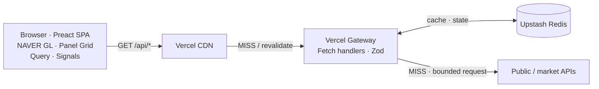
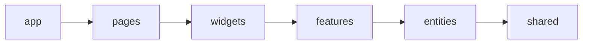
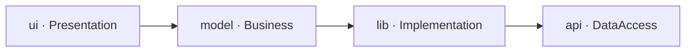
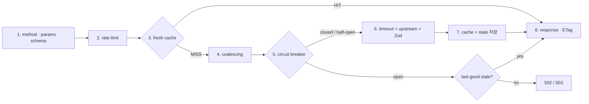
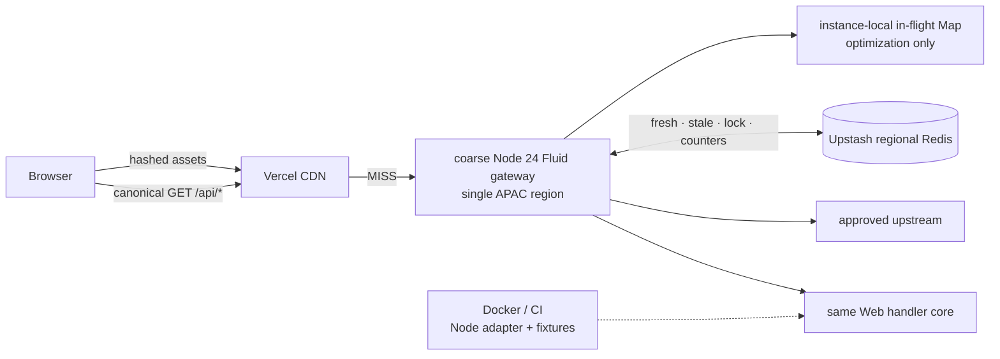
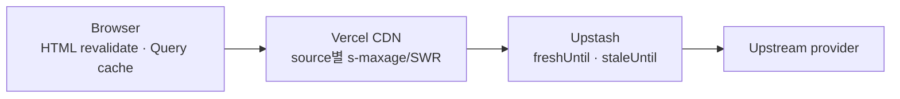
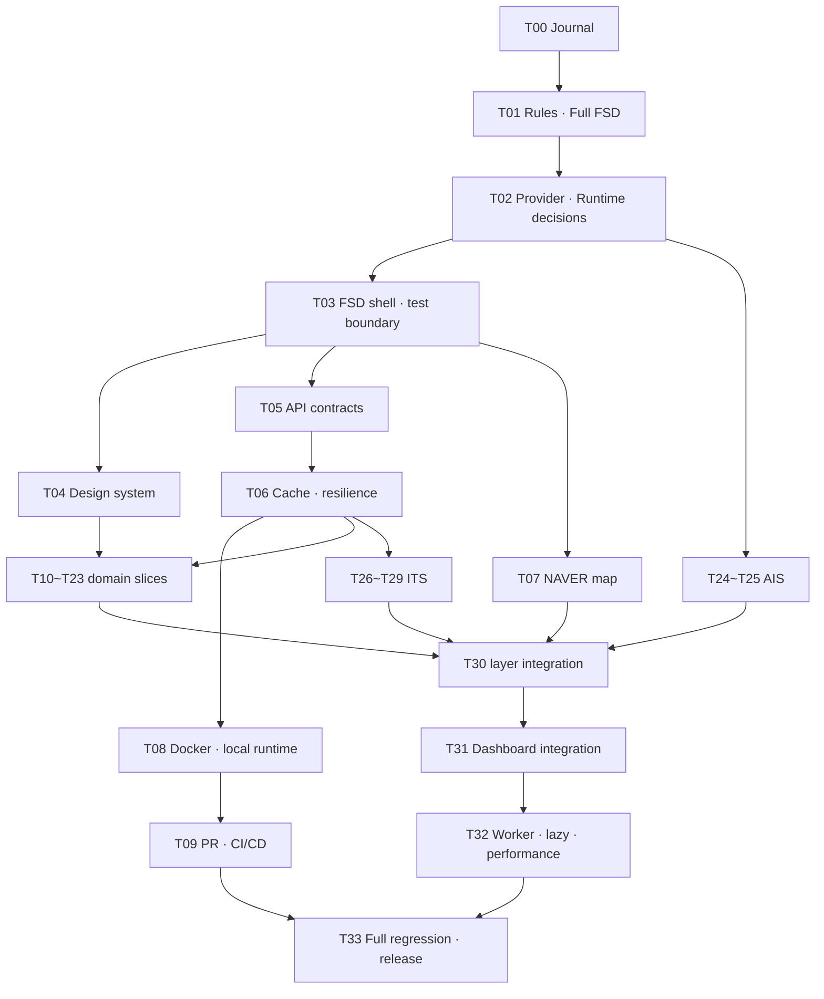
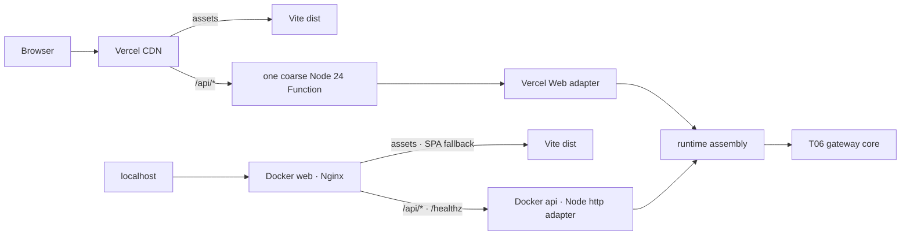
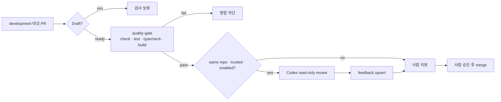

# Balance Keeper Development Journal

> Atlas Armillary Sphere — 대한민국과 주변 세계의 신호를 한눈에 읽는 실시간 대시보드

| 항목 | 값 |
| --- | --- |
| 문서 역할 | 제품 기획·기술 결정·Task·검증·개발일지의 단일 정본 |
| 실행 모드 | 승인모드 |
| 기준일 | 2026-07-22 (Asia/Seoul) |
| 새 저장소 기준선 | `f92ee53 chore: add project skills` |
| 레거시 참조 | `C:\Users\SR83\test\balance-keeper-legacy` |
| 현재 단계 | T09-R1 실질적 Frontend Clean Code 리뷰 계약 — IN_PROGRESS |
| 다음 단계 | `.env.example` 제외 checkpoint commit·기존 PR synchronize → quality와 bootstrap feedback 확인 |

---

## 1. 문서 통제와 승인 규칙

이 파일을 프로젝트의 유일한 개발 정본으로 사용한다. 결정, Task 상태, 구현 증거와 회귀 결과를 다른 계획 문서에 분산하지 않는다. 상세 설계가 커져 별도 산출물이 필요해지더라도 이 문서에서 링크하고 상태를 관리한다.

상태 흐름은 다음과 같다.

```text
PROPOSED → APPROVED → IN_PROGRESS → VERIFYING → PASS → ACCEPTED
                                  └────────────→ BLOCKED
```

- `PASS`는 자동·수동 검증이 끝났다는 뜻이다.
- `ACCEPTED`는 사용자가 결과를 승인했다는 뜻이다.
- 의존 Task는 선행 Task가 `ACCEPTED`가 된 뒤 시작한다.
- 범위가 달라지면 기존 승인을 확대 해석하지 않고 변경 범위를 다시 승인받는다.
- `BLOCKED`는 정보 부족, 명세 모순, 검증 실패 또는 알려진 회귀 위험이 있다는 뜻이다. 추측으로 진행하지 않는다.
- Subagent는 Task 내부 조사에만 사용한다. 메인 에이전트가 결과를 실제 코드·공식 문서로 재검증한 뒤 이 문서에 통합한다.
- 병렬 작업자가 이 파일을 동시에 편집하지 않는다. 문서 갱신은 메인 에이전트가 직렬화한다.
- 기능 구현, 커밋, 원격 푸시는 승인된 Task 범위 안에서만 수행한다.

### 고정 가드레일

모든 단계와 Task는 다음 질문에 답해야 한다.

| 확인 항목 | 통과 조건 |
| --- | --- |
| 범위가 명확한가 | 포함·제외 범위와 변경 파일 영역이 적혀 있다. |
| 판단 근거가 있는가 | 코드, 테스트, 공식 문서 또는 재현 결과가 있다. |
| 기존 동작과 모순되지 않는가 | 충돌이 없거나, 대체 결정과 마이그레이션이 승인됐다. |
| 문서가 쉽게 이해되는가 | 결정 이유, 트레이드오프와 용어가 설명돼 있다. |
| 회귀 영향과 검증 방법이 확인됐는가 | 정상·실패·경계값·기존 영향 경로를 검증한다. |

---

## 2. 개발을 시작한 이유

평소 국제 정치와 글로벌 흐름을 파악하고 여러 주체의 메시지와 프로파간다를 분석하는 일을 흥미롭게 느껴 뉴스 보는 것을 취미로 삼아 왔다. 가장 큰 불편은 정보가 여러 서비스와 형식으로 분산돼 있다는 점이었다.

날씨, 기후, 지진과 같은 지도 데이터까지 포함해 대한민국의 현 상황을 한눈에 바라볼 수 있는 대시보드를 만들어보자는 단순한 생각이 Balance Keeper의 출발점이다. 현재는 흥미로운 아이디어를 검증하는 MVP 수준이지만, 장기적으로는 누구나 한국의 현황을 쉽고 빠르게 파악할 수 있는 신뢰도 높은 대시보드로 발전시키고자 한다. `Balance Keeper`라는 이름도 이 발상지를 모티브로 정했다.

함께할 개발자를 찾으려 했지만 각자의 현업과 우선순위가 달랐다. 프론트엔드 개발을 주력으로 하면서도 다양한 영역에 도전해 온 경험과 AI 도구의 도움을 바탕으로, 제품 판단과 검증 책임은 직접 지고 프로젝트를 독립적으로 진행한다.

이 문서는 전문 교재가 아니라 개인 개발일지다. 완성된 결과만 보여주기보다 왜 결정했고, 어떤 가설이 틀렸으며, 무엇으로 검증했는지 남긴다. AI로 빠르게 구현했는지보다 결정 근거와 테스트, 회귀 관리가 재현 가능한지가 더 중요한 증거다.

---

## 3. Workflow 진행 현황

| 단계 | 상태 | 근거 |
| --- | --- | --- |
| 아이디어 | PASS | 제품 동기, 사용자 가치와 장기 비전이 명시됐다. |
| 스크리닝 | PASS | MVP 수용·보류·검증 필요 범위를 분리했다. |
| 기획 | PASS | 제품 범위, 기술 원칙과 비기능 목표를 정의했다. |
| 코드베이스 분석 | PASS | 새 저장소와 레거시의 파일·계약·테스트를 대조했다. |
| 문서 검토 | PASS | fence 38개, replacement character 0개, API A01~A24를 확인했다. |
| Task 분리 | PASS | T00~T33의 34개 ID와 의존성·완료 조건을 확인했다. |
| 구현 | PASS | T08 one-coarse Function, production runtime assembly, Vercel·Node adapter, bundled Node server, non-root Nginx+API Docker topology를 RED→GREEN으로 구현했다. provider route는 승인 범위대로 추가하지 않았다. |
| 회귀 검증 | PASS | 전체 59 files·721 tests, Biome 139 files, strict TypeScript, client/server build, T08 focused 15 files·96 tests, clean Docker Compose smoke와 독립 runtime/deploy 리뷰가 통과했다. 전체 제품 회귀는 T33까지 누적한다. |

---

## 4. 아이디어 스크리닝

| 아이디어 | 판정 | 이유와 조건 |
| --- | --- | --- |
| 한국 실시간 공공신호 단일 화면 | ACCEPT | 분산된 정보를 한 좌표계와 공통 신선도 모델로 묶는 가치가 분명하다. |
| NAVER Maps GL 기반 한국 지도 | ACCEPT | 한국 지도 경험을 우선한다. 실제 SDK·과금·오버레이 한계는 Task에서 검증한다. |
| 소스별 갱신주기 폴링 | ACCEPT | 모든 데이터를 같은 주기로 조회하는 낭비를 피한다. |
| Vercel Functions + Upstash | ACCEPT | 상주 백엔드 없이 외부 API 보호·정규화·캐시를 제공하는 MVP에 적합하다. |
| Full FSD + 기능 내부 Waterfall | ACCEPT | 최신 사용자 명세가 기존 FSD-lite보다 우선한다. |
| OKLCH 기반 디자인 토큰 | ACCEPT | 밝은 영역 소실, 다크모드 대비와 지도 오버레이 색을 시스템으로 통제한다. |
| 자동 프로파간다 판정·출처 등급화 | DEFER | 방법론, 설명 가능성, 편향·명예훼손 위험을 먼저 정의해야 한다. MVP는 원문 출처와 시각·메타데이터 제공에 집중한다. |
| OpenSky 기반 군용기 운영 표시 | NO_GO | live product·자동 시스템의 REST 사용에 서면 계약이 필요하고 군 소유 분류도 제공하지 않는다. T18은 권리 승인 또는 대체 source feasibility만 수행한다. |
| AISstream 기반 개별 군함 실시간 추적 | NO_GO | 공개 재배포 계약·SLA·안전성이 확인되지 않았고 군함은 AIS 송신 예외도 있다. T24에서 서면 권리 또는 공식 집계형 범위만 재검토한다. |
| Docker를 Vercel의 동등한 운영 대체재로 사용 | DEFER | 우선 로컬·CI 재현성과 미래 백엔드 확장 경계로 사용한다. 자체 호스팅은 별도 결정이 필요하다. |
| 전면 반응형 최적화 | DEFER | MVP는 데스크톱 지도·그리드 경험을 우선한다. 작은 화면에서 기능이 깨지지 않는 최소 안전성은 유지한다. |

---

## 5. 제품 기획

### 5.1 한 문장 정의

Balance Keeper는 대한민국과 주변 지역의 공공·시장·재난·교통 신호를 한국 지도와 데이터 패널에 함께 보여주는 데스크톱 우선 실시간 상황판이다.

### 5.2 핵심 사용자 여정

1. 앱 셸과 마지막 정상 데이터가 먼저 보인다.
2. 사용자는 지도에서 현재 관심 레이어를 켜고 끈다.
3. 지도상의 사건을 선택해 상세 패널이나 CCTV 뷰어를 연다.
4. 각 패널에서 데이터 기준시각, 출처, 신선도와 오류 상태를 확인한다.
5. 일부 공급자가 실패해도 나머지 대시보드와 마지막 정상 데이터는 유지된다.

### 5.3 MVP 범위

- 단일 Preact SPA와 데스크톱 우선 전체 화면 대시보드
- NAVER Maps GL 베이스맵과 공공데이터 오버레이
- Vercel API Gateway를 통한 인증정보 보호, 정규화, 캐시
- Upstash 기반 공유 캐시·복원력 상태
- 소스별 TanStack Query 폴링과 Signals 기반 UI 상태
- 정상·로딩·빈 값·오류·stale 상태가 구분되는 패널
- 테스트 우선 구현과 승인 단위 개발일지

### 5.4 비범위

- 안전·투자·군사 판단을 대신하는 권위 있는 분석
- 모든 소스에 대한 초 단위 실시간성 보장
- 근거 없는 정치 성향·프로파간다 자동 판정
- 초기 MVP의 모바일 전용 정보 구조
- 첫 릴리스에서의 상주 백엔드 서버

---

## 6. 검증된 사실과 결정 등록부

### 6.1 2026-07-20 공식 문서 확인

| 항목 | 확인 결과 | 영향 | 출처 |
| --- | --- | --- | --- |
| NAVER Maps GL | GL 서브모듈은 WebGL 벡터맵을 제공한다. | NAVER GL을 베이스맵 후보로 유지한다. | [NAVER GL module](https://navermaps.github.io/maps.js.ncp/docs/module-gl.html) |
| NAVER Style Editor | `gl: true`와 `customStyleId`로 발행 스타일을 연결한다. 커스텀 스타일 사용 시 일부 기본 지도 유형·레이어를 쓸 수 없다. | 스타일 적용과 기능 손실을 함께 브라우저 검증한다. | [Style Editor 연동](https://navermaps.github.io/maps.js.ncp/docs/tutorial-2-Style-Editor.html) |
| Vercel 정적 파일 캐시 | 정적 파일은 배포 생명주기 동안 자동 CDN 캐시되고, 해시 파일은 변경되지 않으면 배포 간 유지될 수 있다. | 해시 자산은 장기 immutable, HTML과 API는 별도 정책을 쓴다. | [Vercel CDN Cache](https://vercel.com/docs/caching/cdn-cache) |
| Vercel Function 캐시 | Function 응답은 `s-maxage`, `stale-while-revalidate` 등으로 CDN 캐시한다. Vercel 프록시는 공유 캐시 지시자를 소비할 수 있다. | 브라우저·Vercel CDN 헤더를 구분한다. | [Cache-Control headers](https://vercel.com/docs/caching/cache-control-headers) |
| Upstash Redis | `@upstash/redis`는 HTTP 기반 connectionless client로 serverless 환경을 지원한다. | 공유 캐시와 분산 상태 후보로 유지한다. | [Connect with @upstash/redis](https://upstash.com/docs/redis/howto/connect-with-upstash-redis) |
| Codex GitHub Action | 현재 공식 예시는 `openai/codex-action@v1`, `OPENAI_API_KEY` secret, 별도 feedback job과 최소 권한을 사용한다. | CI Task에서 공식 보안 입력을 기준으로 구현한다. | [Codex GitHub Action](https://learn.chatgpt.com/docs/github-action) |

### 6.2 T02 판정 규칙

확인 기준일은 `2026-07-20 KST`다. URL이 지금 응답한다는 사실과 운영 계약이 있다는 사실을 구분한다.

| 판정 | 의미 |
| --- | --- |
| `GO` | 공식 운영 인터페이스와 이용조건이 확인됐고, 현재 범위에서 구현 후보로 사용할 수 있다. |
| `CONDITIONAL` | 공식 후보이지만 키 기반 schema·quota 확인, 표시권리 또는 배포 환경 검증 전에는 production에서 켜지 않는다. |
| `NO_GO` | 현재 source·계약으로는 production 기본값으로 사용하지 않는다. 서면 허가나 승인된 대체 source가 필요하다. |

증거 수준은 `DOC`(공식 문서), `PUBLIC_PROBE`(비밀값 없는 읽기 요청), `GATED_PROBE`(사용자 키가 있는 후속 Task)로 구분한다. `PUBLIC_PROBE`의 `200`은 도달 가능성만 증명하며 이용허락·SLA·재배포 권리를 증명하지 않는다. 포털에 표시된 트래픽은 기본 계정값이지 SLA가 아니며, 언어별 페이지나 과거 Q&A와 충돌하면 실제 승인 계정과 최신 한국어 문서를 보수적으로 적용한다.

### 6.3 Provider 계약 장부

| Provider | 2026-07-20 확인 사실 | 판정과 다음 gate | 공식 근거 |
| --- | --- | --- | --- |
| NAVER Web Dynamic Map GL | SDK는 `ncpKeyId`, `submodules=gl`, `gl: true`, 발행한 Style Editor의 `customStyleId`를 지원한다. Web Dynamic Map과 Web 서비스 host를 Application에 등록하며 host는 최대 10개다. Client ID와 style metadata ID는 브라우저 식별자이고 Client Secret은 브라우저 값이 아니다. 대표 계정 요금표는 현재 월 6,000,000회 이하 무료를 표시하지만 초과 구간의 빈 가격을 hard stop이나 무상 overage로 해석하지 않는다. 커스텀 스타일에서는 일반·위성·겹침·지형도와 자전거·교통·거리뷰·지적도 layer를 함께 쓸 수 없다. | `GO` — T07에서 실제 등록 host·계정 quota·published style load, `429`와 실패 fallback을 browser smoke한다. | [시작하기](https://navermaps.github.io/maps.js.ncp/docs/tutorial-2-Getting-Started.html), [Style Editor 연동](https://navermaps.github.io/maps.js.ncp/docs/tutorial-2-Style-Editor.html), [NAVER Maps Application](https://guide.ncloud-docs.com/docs/maps-app), [Maps 요금](https://www.ncloud.com/api-cms/service-product/static/maps) |
| KMA 초단기·단기예보 | `VilageFcstInfoService_2.0`의 `getUltraSrtNcst`, `getUltraSrtFcst`, `getVilageFcst`를 사용한다. 단기예보 발표는 `02/05/08/11/14/17/20/23 KST`, 개발계정 표시는 10,000건이며 출처표시 제1유형이다. | `CONDITIONAL` — KST 자정·발표 지연, HTTPS alias, null category와 승인 계정 quota를 T10/T22 실키로 검증한다. | [단기예보 조회서비스](https://www.data.go.kr/data/15084084/openapi.do), [KMA API Hub 동네예보](https://apihub.kma.go.kr/apiList.do?apiMov=4.+%EB%8F%99%EB%84%A4%EC%98%88%EB%B3%B4%28%EC%B4%88%EB%8B%A8%EA%B8%B0%EC%8B%A4%ED%99%A9%C2%B7%EC%B4%88%EB%8B%A8%EA%B8%B0%EC%98%88%EB%B3%B4%C2%B7%EB%8B%A8%EA%B8%B0%EC%98%88%EB%B3%B4%29+%EC%A1%B0%ED%9A%8C&seqApi=10&seqApiSub=286) |
| KMA 기상특보 | `WthrWrnInfoService/getWthrWrnList`와 특보 통보문·현황 계약이 있고 업데이트는 실시간, 개발·운영 자동승인, 출처표시 제1유형이다. | `CONDITIONAL` — 목록만으로 active/cancel geometry를 추정하지 않고 T23에서 통보문·현황 조합과 실제 quota를 검증한다. | [기상특보 조회서비스](https://www.data.go.kr/data/15000415/openapi.do) |
| KMA 지진 | `EqkInfoService/getEqkMsg`는 발표·발생시각, 위경도, 규모, 깊이와 수정사항을 제공한다. 실시간·무료·자동승인이고 현재 한국어 페이지 개발계정 표시는 10,000건이다. | `CONDITIONAL` — T12에서 KMA 수정 통보와 USGS event dedup을 실키 검증한다. | [지진정보 조회서비스](https://www.data.go.kr/data/15000420/openapi.do) |
| AirKorea | `ArpltnInforInqireSvc/getCtprvnRltmMesureDnsty`는 서비스키가 필요하다. 현재 한국어 제품 페이지 개발계정 표시는 500건/일이고 운영은 활용신고 심사 후 10,000건/일로 안내된다. 2026-06-30 이후 `전남`, `광주`, `전남광주` 처리 규칙이 바뀌었으며 실시간 측정값은 확정자료가 아니고 결측될 수 있다. 측정소 계약은 `MsrstnInfoInqireSvc/getMsrstnList`이고 샘플의 `dmX`는 위도, `dmY`는 경도라 이름만 보고 축을 바꾸지 않는다. | `CONDITIONAL` — T11에서 승인 quota, 행정구역, 좌표축, 결측과 측정시각을 확인한다. 운영 승인 전 개발 호출량을 production 가정으로 쓰지 않는다. | [대기오염정보](https://www.data.go.kr/data/15073861/openapi.do), [측정소정보](https://www.data.go.kr/data/15073877/openapi.do), [2026 행정구역 공지](https://www.data.go.kr/bbs/ntc/selectNotice.do?originId=NOTICE_0000000004805), [확정자료 설명](https://www.data.go.kr/data/15122830/fileData.do) |
| 행정안전부 긴급재난문자 | `https://www.safetydata.go.kr/V2/api/DSSP-IF-00247`는 신청한 `serviceKey`로 1분 갱신 데이터를 제공한다. 공개 숫자 quota·명시적 종료일/cursor/sort 계약은 찾지 못했고 오류는 요청한 `returnType`과 무관하게 XML일 수 있으며 quota·key·IP 오류코드가 있다. FAQ상 정렬되지 않은 응답도 가능하다. Safetydata는 공공기관 데이터 제3유형을 안내하지만 data.go.kr 연결 메타는 제4유형을 표시해 이용허락 표기가 충돌한다. | `CONDITIONAL` — 더 엄격한 출처표시·비상업·변경금지를 기본으로 두고 원문은 변형하지 않는다. T16에서 실제 quota, XML error branch, pagination·dedup·정렬을 실키 검증하고 공개/상업 서비스 전 제공기관 확인을 받는다. | [Safetydata 상세](https://www.safetydata.go.kr/disaster-data/view?dataSn=228), [data.go.kr 연결 메타](https://www.data.go.kr/data/15134001/openapi.do) |
| ECOS | 공식 서비스는 `StatisticTableList`, `StatisticItemList`, `StatisticSearch`, `KeyStatisticList`다. 검색 URL shape는 `https://ecos.bok.or.kr/api/StatisticSearch/{CERT_KEY}/{xml\|json}/{kr\|en}/{startRow}/{endRow}/{STAT_CODE}/{cycle}/{startTime}/{endTime}/{item1}/{item2}/{item3}/{item4}`이고 공식 안내의 `CERT_KEY` 길이는 30자다. 주기는 `A/S/Q/M/SM/D`, item 1~4는 선택이며 응답은 통계·항목 코드/명, 단위, 시점과 값을 제공한다. 공개 숫자 quota는 찾지 못했고 레거시 `731Y001`, `722Y001`, `732Y001`은 현재 의미가 검증되지 않은 후보다. | `CONDITIONAL` — T13에서 `StatisticTableList → StatisticItemList → StatisticSearch` 순서로 코드·항목을 발견하고 발표일, 단위, 최신 observation과 실제 제한을 실키 검증한다. 응답 순서를 최신값 보장으로 가정하지 않는다. | [한국은행 ECOS Open API](https://ecos.bok.or.kr/api/) |
| USGS earthquake | 실시간 GeoJSON feed는 매분 갱신되며 자동화 앱의 우선 인터페이스다. 고정 숫자 quota는 없고 과다 호출 시 `429`; 대부분 USGS 정보는 public domain이며 출처표시가 권장된다. | `GO` — 60초보다 빠르게 원본을 호출하지 않고 validator/cache header를 존중한다. KMA와 상호 보완한다. | [GeoJSON feed](https://earthquake.usgs.gov/earthquakes/feed/v1.0/geojson.php), [FDSN API](https://earthquake.usgs.gov/fdsnws/event/1/), [USGS credit](https://www.usgs.gov/information-policies-and-instructions/acknowledging-or-crediting-usgs) |
| 시장 데이터 | Yahoo의 현재 개발자 카탈로그에는 Finance API가 없고 데이터 제공자 안내는 재배포를 금지한다. `query1.finance.yahoo.com` 도달 여부는 계약이 아니다. KRX는 승인형 일별 지수 API를, FRED는 key 기반 경제 시계열을 제공한다. | Yahoo `NO_GO`. T14 범위는 KRX 국내 일별지수와 권리 검토를 마친 FRED/승인된 유료 source의 지연 데이터로 축소하며, 실시간 시세로 표시하지 않는다. | [Yahoo API catalog](https://developer.yahoo.com/api/), [Yahoo data delays/redistribution](https://help.yahoo.com/kb/finance/article-exchanges-data-delays-sln2310.html), [KRX API 목록](https://openapi.krx.co.kr/contents/OPP/INFO/service/OPPINFO004.cmd), [FRED terms](https://fred.stlouisfed.org/docs/api/terms_of_use.html) |
| 뉴스 RSS | Yonhap·KBS·Hani·Chosun의 현재 feed는 응답하지만 publisher별 이용범위가 다르다. Chosun은 개인 구독만 기본 허용하고 상업 이용은 문의를 요구한다. Google News search RSS에는 consumer API, quota, SLA나 재배포 허가를 설명하는 공식 계약이 없다. | 직접 publisher RSS는 `CONDITIONAL`로 제목·출처·시각·원문 링크만 제공하고 전문을 저장/재배포하지 않는다. Google News RSS는 `NO_GO`; JoongAng 우회 feed도 제거한다. | [KBS RSS](https://world.kbs.co.kr/service/about_rss.htm?lang=e), [Chosun RSS 안내](https://rssplus.chosun.com/), [Google News 변경](https://support.google.com/news/publisher-center/answer/15898024?hl=en) |
| 항공 데이터 | OpenSky는 OAuth2와 credit quota를 문서화했지만 live product/자동 시스템의 REST 사용에 서면 계약을 요구한다. 제공 state에는 검증된 군 소유 분류가 없다. | OpenSky `NO_GO` until written license. T18은 구현 Task가 아니라 license/대체 source feasibility로 바꾸고, ADSB.lol은 ODbL·동적 제한·`mil` 분류 한계를 승인받기 전 `CONDITIONAL`이다. | [OpenSky REST](https://openskynetwork.github.io/opensky-api/rest.html), [OpenSky terms](https://opensky-network.org/about/terms-of-use), [ADSB.lol license](https://www.adsb.lol/privacy-license/) |
| AIS | AISstream은 API key를 사용하는 backend WebSocket beta이며 CORS를 지원하지 않고 SLA·안정 schema·공개 재배포 계약이 확인되지 않았다. 군함은 AIS 탑재·송신 의무 예외가 있어 완전한 군함 지도가 될 수 없다. | 개인 군함 추적은 `NO_GO`. T24는 서면 권리와 안전성 또는 한국 공식 집계형 AIS로 범위를 바꾸는 feasibility만 수행하며, 조건 충족 전 T25를 시작하지 않는다. | [AISstream docs](https://aisstream.io/documentation.html), [IMO AIS guidance](https://www.imo.org/en/ourwork/safety/navigation/ais.aspx), [한국 연안 AIS 집계](https://www.data.go.kr/data/15084033/openapi.do) |
| ITS | 현재 공식 카탈로그에는 CCTV와 A16~A24 9종이 모두 존재한다. 인증키 승인은 3~5영업일로 안내된다. CCTV는 HLS·mp4·정지영상·HTTPS-HLS·HTTPS-mp4 유형을 문서화했고 재난 API는 point/line/polygon을 제공한다. 현재 manual은 서비스별 24시간 제한이 없다고 하지만 과거 공식 Q&A는 API당 1,000건/일이라 답해 충돌한다. 현재 정적 상세 페이지는 각 서비스의 정확한 production HTTPS resource path를 모두 노출하지 않는다. | 모두 `CONDITIONAL` — T19/T20/T21/T26에서 승인 key로 HTTPS host·path·port, 실제 quota, 좌표·날짜창·빈 결과, media CORS/만료와 표시조건을 동결한다. 과거 `http://openapi.its.go.kr` 예시나 `:9443` probe를 production 경로로 복사하지 않는다. | [ITS Open API](https://www.its.go.kr/opendata/intro), [현재 manual](https://www.its.go.kr/file/opendata/openapi_manual.pdf), [CCTV](https://www.its.go.kr/opendata/opendataList?service=cctv), [재난](https://www.its.go.kr/opendata/opendataList?service=disaster), [과거 quota Q&A](https://www.its.go.kr/opendata/reqOpendataQnaDetail?seqNo=166) |

### 6.4 A01~A24 source 동결

`신선도 기준`은 upstream을 그보다 더 자주 호출하지 않기 위한 하한이며, 실제 TTL은 keyed probe의 응답시각·quota를 근거로 각 구현 Task에서 좁힌다.

| ID | 동결 source | 판정 | 신선도 기준·fallback / 후속 gate |
| --- | --- | --- | --- |
| A01 | KMA `getUltraSrtNcst` | `CONDITIONAL` | KST 발표시각 기준, 10분 client 확인·공유 cache. T10 keyed boundary probe |
| A02 | KMA `getVilageFcst` | `CONDITIONAL` | 하루 8회 발표 경계 기준, 중간에는 캐시. T22 자정·누락 slot probe |
| A03 | KMA `WthrWrnInfoService` | `CONDITIONAL` | event성 1~2분 확인, active/cancel은 목록이 아닌 현황 계약으로 판정 |
| A04 | AirKorea 시도별 실시간 측정+측정소 | `CONDITIONAL` | 측정시각 기준 30분 확인, 결측은 last-good와 별도 표시; `dmX=위도`, `dmY=경도` keyed fixture 고정 |
| A05 | KMA 지진 + USGS GeoJSON | USGS `GO`, 전체 `CONDITIONAL` | USGS 원본 최소 60초, KMA keyed smoke 후 source ID·시공간 dedup |
| A06 | ECOS table/item/search discovery | `CONDITIONAL` | 발표일 기준 6~24시간; table→item→search로 후보 통계코드·단위·정렬 실키 검증 |
| A07 | KRX 일별 + 승인된 미국/환율 source | `CONDITIONAL` | EOD/지연 데이터만. Yahoo endpoint·실시간 표시는 `NO_GO` |
| A08 | 직접 publisher RSS | `CONDITIONAL` | 5~10분, feed별 독립 실패. Google News RSS와 우회 feed는 `NO_GO` |
| A09 | Safetydata `DSSP-IF-00247` | `CONDITIONAL` | 30~60초, 원문 보존·출처·license 확인과 keyed XML error·pagination·정렬/dedup probe |
| A10 | A05+A07+A08 파생 조합 | `CONDITIONAL` | 별도 upstream 중복 호출 없이 가장 느린 component와 부분 실패 표시 |
| A11 | OpenSky 또는 승인 대체 ADS-B | `NO_GO` | 서면 운영권리/ODbL 승인 전 feature off; callsign은 군 소유 증거가 아님 |
| A12 | AISstream 군함 | `NO_GO` | 서면 재배포·안전·retention 계약과 상주 ingestion topology 없이는 feature off |
| A13 | ITS CCTV metadata | `CONDITIONAL` | bbox 변경 또는 5~10분; `type=ex\|its`, URL·좌표·format keyed probe |
| A14 | ITS CCTV `cctvType=3` 정지영상 | `CONDITIONAL` | viewer 활성 시에만 짧게; HTTPS, 크기, CORS·만료와 allowlist 검증 |
| A15 | ITS `cctvType=4` HTTPS-HLS 우선 | `CONDITIONAL` | on-demand 한 스트림. Vercel Function으로 segment/video를 상시 relay하지 않음 |
| A16 | ITS `traffic` | `CONDITIONAL` | 30~60초 후보; link ID·속도·빈 구간 keyed probe |
| A17 | ITS `event` | `CONDITIONAL` | 30~60초 후보; 시작·종료·severity·중복 keyed probe |
| A18 | ITS `fcTraffic` 우회도로 예측 | `CONDITIONAL` | `sectionId`, `fCastDate`, `fCastHour` 필수; generic 전국 예측으로 확대하지 않고 본선/우회 구간과 horizon 검증 |
| A19 | ITS `detectorInfo` | `CONDITIONAL` | 수분 이내 후보; 집계주기·단위·전국 coverage 검증 |
| A20 | ITS `vms` | `CONDITIONAL` | 1~5분 후보; message sanitize·좌표·만료 검증 |
| A21 | ITS `safeDriving` 고속도로 주의운전 | `CONDITIONAL` | 필수 bbox, 5~10분 후보; 고속도로 범위·유형·geometry·유효기간 검증 |
| A22 | ITS `vsl` | `CONDITIONAL` | 1~5분 후보; 제한속도 단위·발효/해제 검증 |
| A23 | ITS `dangerousCarInfo` | `CONDITIONAL` | sparse event·종료 flag라 빈 결과를 장애로 보지 않음; 정밀 위치·보존·안전 노출 정책 선행 |
| A24 | ITS `disaster` | `CONDITIONAL` | category `D`, event `D03/D04/D06/D07`, 필수 시작·종료일과 선택 bbox, Point/Line/Polygon 순서·XY·null·종료 검증; 실패 시 A17 `eventType=dis` 또는 A09 목록만 표시 |

### 6.5 무자격 public probe 장부

2026-07-20에 로컬 secret이나 `.env`를 읽지 않고 공개 GET만 한 번씩 실행했다. 응답 본문의 업무 데이터는 저장하지 않았고 상태·콘텐츠 유형·shape 시작만 확인했다.

| 대상 | 결과 | 증명하는 것 / 증명하지 않는 것 |
| --- | --- | --- |
| USGS FDSN Korea/East Asia bbox | `200 application/json`, GeoJSON collection | 현재 도달·JSON shape. 장기 SLA·고정 quota는 아님 |
| OpenSky Korea bbox anonymous | `200 application/json` | 현재 도달만 확인. 운영 사용권리는 없으므로 후속 polling 금지 |
| KMA HTTPS without key | `401 text/plain` | HTTPS route와 missing-key 실패. keyed schema·quota는 미확인 |
| ITS `:9443` without key | `401 application/json`, `resultCode=4002` | gateway와 구조화된 필수 parameter 실패. 실제 서비스 응답은 미확인 |
| Yonhap·KBS·Hani·Chosun RSS | 모두 `200`, XML root | 현재 feed 도달. KBS는 XML인데 `text/html`을 반환하므로 MIME만 신뢰하지 않음 |
| Google News search RSS | `200 application/xml` | 현재 도달만 확인. 공식 consumer 계약이 아니므로 production 사용 근거가 아님 |

### 6.6 결정 등록부

| ID | 결정 | 상태 | 근거·재검토 조건 |
| --- | --- | --- | --- |
| D-001 | Node 24, TypeScript strict, Preact, Signals, TanStack Preact Query, Vite, Tailwind, Vitest, Biome를 사용한다. | ACCEPTED | 현재 scaffold와 최신 명세가 일치한다. |
| D-002 | 클라이언트 구조는 `app → pages → widgets → features → entities → shared` Full FSD를 사용한다. | ACCEPTED | 최신 사용자 명세가 기존 no-pages skill보다 우선한다. |
| D-003 | `pages/dashboard`는 즉시 도입하되 실제 두 번째 URL이 생기기 전까지 router dependency는 추가하지 않는다. | ACCEPTED | 사용자가 Full FSD와 초기 no-router 구성을 승인했다. Page 조합 계층과 router 도입을 분리한다. |
| D-004 | 기능 내부 Waterfall은 `ui(Presentation)`, `model(Business)`, `lib(Implementation)`, `api(DataAccess)`로 매핑하며 필요한 segment만 만든다. | ACCEPTED | 사용자가 T03 착수와 함께 승인했다. FSD layer와 Waterfall 책임을 1:1 대응시키지 않는다. |
| D-005 | NAVER Maps GL을 주 베이스맵으로 사용하고 지도 SDK는 동적 로딩한다. | ACCEPTED | 한국 지도 정확도와 사용 경험을 우선한다. |
| D-006 | MapLibre/deck.gl은 초기 번들에 넣지 않는다. NAVER 오버레이 예산으로 충족하지 못하는 측정된 고밀도 요구가 생길 때 별도 승인한다. | PROPOSED | 이중 지도 엔진과 2MB급 초기 번들 회귀를 피한다. |
| D-007 | TanStack Query는 원격 서버 상태, Signals는 파생·일시적 UI 상태만 소유한다. | ACCEPTED | 책임 중복을 방지한다. |
| D-008 | Vercel managed deployment를 운영 정본으로 두고 Vite 정적 자산은 CDN, gateway는 단일 APAC Node 24 Fluid Function군, 공유 상태는 Upstash에 둔다. Docker는 로컬·CI 재현성만 담당하며 self-host production과 Vercel Dockerfile beta는 별도 승인한다. | ACCEPTED | Docker는 CDN·Fluid·scale-to-zero·region·배포 무효화를 재현하지 못한다. 기본 후보는 `hnd1`+Upstash Tokyo이고 T08 latency probe에서 `icn1` 대안을 비교한다. |
| D-009 | 서버 코어는 `(request: Request, dependencies) => Promise<Response>` Web handler로 작성한다. Vercel `fetch` export와 Node/Docker `node:http` bridge는 얇은 adapter이며 env·platform cache header·Cron auth·lifecycle은 adapter가 소유한다. | ACCEPTED | Vercel Node runtime과 Node 24가 표준 Request/Response를 지원한다. 플랫폼 의미까지 동일하다고 가정하지 않는다. |
| D-010 | 정적 자산, HTML, API 데이터는 서로 다른 캐시 정책을 쓴다. API에 1년 TTL을 일괄 적용하지 않는다. | ACCEPTED | 데이터 신선도와 배포 무효화를 분리한다. |
| D-011 | AI 개발 workflow는 `brainstorm → plan → RED/GREEN/REFACTOR → verify → review`로 고정한다. | ACCEPTED | 테스트가 먼저 실패하는 것을 확인한다. |
| D-012 | Codex 리뷰는 ready-for-review인 신뢰 가능한 same-repository PR에서 `quality-gate`가 통과한 뒤 실행하고, 초기에는 결과를 참고 의견으로 둔다. | ACCEPTED | 원문에 독립 실행과 quality 통과 후 실행이 함께 있어 충돌한다. 더 구체적인 후반 구현 지침과 비용·secret 노출 최소화를 우선하며 사용자가 T09 진행을 승인했다. |
| D-013 | Hobby의 직접 Function 12개 제한을 피하고 공통 정책을 한곳에 적용하기 위해 A01~A24를 24개 entry가 아니라 하나 또는 소수의 coarse gateway Function과 내부 route registry로 제공한다. | ACCEPTED | 비-프레임워크 `api/` 파일은 파일마다 Function이 되며 현재 제품 route 수가 제한을 넘는다. |
| D-014 | process-local promise map은 같은 warm instance의 최적화만 담당한다. fresh/last-good cache와 fleet-wide lock·rate-limit·breaker는 Upstash atomic operation+TTL을 사용하고, eventual consistency 때문에 breaker는 hint로 취급한다. | ACCEPTED | Fluid concurrency와 scale-out에서 process memory는 공유 정본이 아니다. |
| D-015 | 모든 upstream API·인증·목록·metadata 요청은 gateway를 통과한다. 표준 Vercel Function은 정상화된 JSON·허용된 media metadata만 제공하고 CCTV video/HLS segment와 대형 이미지 bytes를 4.5MB payload 경로로 상시 relay하지 않는다. 브라우저 직접 요청은 server secret을 포함하지 않고 gateway가 allowlist한 provider-issued HTTPS media URL에만 허용하는 media-only 예외다. 조건을 충족하지 못하면 unavailable로 두거나 별도 media topology를 승인받는다. | ACCEPTED | 일반 API gateway의 payload·대역폭·file descriptor 예산과 secret 경계를 함께 보호한다. T05에서 `vercel-api-gateway` skill을 이 예외와 먼저 정렬한 뒤 T19~T21을 구현한다. |
| D-016 | OpenSky, AISstream, Yahoo Finance와 Google News RSS는 현재 production 기본 source로 사용하지 않는다. provider 권리와 계약이 해제되지 않은 기능은 fixture demo가 아니라 명시적 unavailable/feature-off 상태로 둔다. | ACCEPTED | 기술적 도달과 운영·재배포 권리를 분리한다. |
| D-017 | 시각 기반은 `Atlas Armillary / 관측실 계기판`으로 정하고 CSS의 OKLCH semantic token을 단일 출처로 사용한다. TSX의 raw palette·hex·arbitrary color를 금지하며 외부 폰트·아이콘 dependency를 추가하지 않는다. | ACCEPTED | 사용자가 T04 착수와 함께 승인했다. 청회색 지도 바탕, 방위각 blue와 보정된 brass warning이 제품 주제에 맞고 VDI에서도 표면·경계를 분명히 한다. |
| D-018 | theme preference는 `system \| light \| dark`, resolved theme은 `light \| dark`로 분리한다. 최초 방문은 system, 명시적 선택은 저장하며 app initializer가 Preact render 전에 `.dark`와 `color-scheme`를 동기화한다. | ACCEPTED | 사용자가 T04 착수와 함께 승인했다. OS 선호를 존중하면서 사용자 선택·테스트 가능성·Tailwind class 전략을 함께 보존한다. |
| D-019 | 공통 Panel은 discriminated union으로 `loading`, `error`, `empty`, `stale`, `success`, `disabled`, `missing-credential`을 표현한다. stale은 기존 콘텐츠와 upstream freshness를 유지한다. | ACCEPTED | 사용자가 T04 착수와 함께 승인했다. 필수 5상태와 provider 정책·credential 부재를 색상이나 임의 문구가 아닌 하나의 접근 가능한 계약으로 통일한다. |
| D-020 | transport envelope의 outer object·meta·error는 strict Zod schema로 검증한다. `fetchedAt`은 Unix epoch milliseconds의 non-negative safe integer이고, 빈 배열·`null` 허용 여부는 각 domain data schema가 결정한다. | ACCEPTED | 사용자가 T05 상세안을 확인한 뒤 “시작해”로 승인했다. client/server type을 schema에서 추론하고 `message`, `stack`, secret 같은 우발적 필드를 transport 경계에서 거부한다. |
| D-021 | public API error code는 `BAD_REQUEST(400)`, `UNAUTHORIZED(401)`, `FORBIDDEN(403)`, `NOT_FOUND(404)`, `UNPROCESSABLE_CONTENT(422)`, `RATE_LIMITED(429)`, `INTERNAL(500)`, `UPSTREAM_UNAVAILABLE(502)`, `MISSING_CREDENTIALS(503)`, `SERVICE_UNAVAILABLE(503)`로 고정한다. client-local code는 `NETWORK_ERROR`, `INVALID_RESPONSE`만 추가하고 Abort는 원본 오류를 보존한다. | ACCEPTED | 사용자가 T05 상세안을 확인한 뒤 “시작해”로 승인했다. caller 인증 실패와 server provider 설정 누락을 분리한다. |
| D-022 | JSON client는 native `fetch`와 필수 Zod data schema를 사용하며 same-origin 상대 `/api/*` GET만 허용한다. 자체 retry·timeout은 두지 않고 non-2xx/malformed/network를 안전한 `AppError`로 정규화한다. CCTV media-only direct byte fetch는 이 client 밖의 후속 T19~T21 경계다. | ACCEPTED | 사용자가 T05 상세안을 확인한 뒤 “시작해”로 승인했다. unchecked generic cast와 browser의 protected upstream 직접 호출을 막는다. |
| D-023 | Shared는 `createQueryProfile({ staleTime, refetchInterval })`와 retry/focus/background 정책만 제공하고, source별 실제 숫자·query key·enabled/viewport 조건은 owning Entity가 A01~A24 근거로 소유한다. | ACCEPTED | 사용자가 T05 상세안을 확인한 뒤 “시작해”로 승인했다. source별 cadence와 FSD domain 소유권을 보존한다. |
| D-024 | cache record는 versioned discriminated union으로 만들고 하나의 positive record가 `freshUntil`과 `staleUntil`을 함께 가진다. 정상화·검증된 명시적 empty만 stale 없는 short negative record로 저장하며 `fetchedAt`과 내부 `storedAt`을 분리한다. | ACCEPTED | 사용자가 T06 상세안에 “시작해”로 승인했다. fresh/stale 2-key 비원자성, 고정 stale TTL과 과거 positive 부활을 막고 exact expiry·corrupt record를 검증한다. |
| D-025 | JSON 표현의 validator는 canonical JSON의 SHA-256으로 만든 `W/"bk1-…"` weak ETag를 사용한다. 입력에는 data·source·fetchedAt·value/empty·STALE 여부를 넣고 requestId와 MISS/HIT는 제외한다. 304는 cacheable current GET에만 사용하고 STALE·오류는 `no-store`로 200/error를 명시한다. | ACCEPTED | 사용자가 T06 상세안에 “시작해”로 승인했다. fresh→STALE 전환을 validator에 포함해 304가 degraded 표시를 숨기지 않게 한다. |
| D-026 | rate limit을 origin admission과 실제 upstream budget으로 구분한다. 둘 다 초기에는 Upstash atomic fixed-window+TTL을 사용하되 admission은 cache 전에 opaque subject별로, upstream budget은 cache·coalescing·lease 뒤 provider scope로 소비한다. 실제 limit/window는 owning route가 확정한다. | ACCEPTED | 사용자가 T06 상세안에 “시작해”로 승인했다. CDN HIT는 Function limiter를 거치지 않으므로 edge DDoS 방어라고 과장하지 않는다. |
| D-027 | local coalescer는 acquisition만 공유하고 requestId·Response는 요청별로 만든다. fleet lock은 unique token+TTL과 atomic compare-delete, breaker는 CLOSED/OPEN/single HALF_OPEN hint로 구현한다. production credential 누락 시 memory store로 조용히 fallback하지 않는다. | ACCEPTED | 사용자가 T06 상세안에 “시작해”로 승인했다. Upstash eventual consistency 때문에 exactly-once는 주장하지 않고 rare duplicate를 허용한다. |
| D-028 | NAVER Maps GL은 공식 `maps.js`에 `ncpKeyId`, `submodules=gl`, `language=ko`, unique `callback`을 붙여 앱 셸 commit 뒤 비동기 로드한다. 같은 설정은 Promise 하나로 합치고 10초 deadline, auth/network/namespace 실패 정리와 retry를 애플리케이션이 소유한다. | ACCEPTED | 사용자가 T07 상세안에 “네”로 승인했다. 공식 callback이 GL 콘텐츠 완료 신호이고 provider는 loader timeout을 제공하지 않는다. legacy의 `onload` 단독·무기한 pending·설정 무관 전역 Promise를 대체한다. |
| D-029 | `VITE_NAVER_MAPS_KEY_ID`는 필수 browser identifier, `VITE_NAVER_MAP_STYLE_ID`는 선택 custom-style metadata로 사용한다. style 누락 시 기본 GL을 명시적 degraded로 유지하되 hardcoded ID, query override, legacy alias와 Client Secret은 금지한다. | ACCEPTED | 사용자가 T07 상세안에 “네”로 승인했다. 기존 canonical env 표와 일치하고 설정 누락을 숨기지 않으면서 basemap 가용성은 유지한다. 실제 값은 UI·오류·로그·fixture에 기록하지 않는다. |
| D-030 | FSD 소유권은 `shared/config`의 browser config, `entities/map`의 NAVER adapter·map lifecycle, `widgets/korea-map`의 완결된 UI로 나눈다. `DashboardPage`가 `KoreaMapWidget`을 `DashboardShell` slot에 전달하고 두 Widget은 서로 import하지 않는다. | ACCEPTED | 사용자가 T07 상세안에 “네”로 승인했다. Page를 무상태 Widget 조합 계층으로 유지하면서 sibling-widget import와 984줄 legacy 결합을 피한다. |
| D-031 | 화면에 남는 NAVER Map은 한 번만 만들고 공식 `init`을 ready 기준, `tilesloaded`를 live smoke 기준으로 쓴다. `ResizeObserver → autoResize`, listener 해제와 `Map.destroy()`를 session에 묶고 theme 변경으로 map을 재생성하지 않는다. | ACCEPTED | 사용자가 T07 상세안에 “네”로 승인했다. legacy의 첫-load 2회 생성, ref 등록 전 unmount 누수, 취소되지 않는 80/600ms timer와 undocumented `relayout`을 제거한다. |
| D-032 | 발행된 다크 Style Editor 지도는 light/dark shell과 독립된 ‘관측 장비 창’으로 유지한다. 전체 폭·narrow 40rem·desktop 48rem 높이, semantic-token 계기 표식, 접근 가능한 지도 이름·초기 위치 control을 제공하고 data overlay는 넣지 않는다. | ACCEPTED | 사용자가 T07 상세안에 “네”로 승인했다. 사용자가 허용한 다크 GL 시뮬레이션을 Atlas Armillary의 한 시각적 signature로 쓰되 지도 자체와 NAVER attribution을 가리는 장식은 배제한다. |
| D-033 | `init`과 화면 표시를 분리해 최초 `tilesloaded`만 visible-ready로 인정한다. SDK callback 뒤 Map 인증까지 `navermap_authFailure` 구독을 유지하고, custom style이 render deadline을 넘기면 해당 Map을 정리한 뒤 default GL을 한 번만 재시도해 명시적 degraded 상태로 전환한다. | ACCEPTED | minZoom 수정 뒤에도 console error 없이 blank가 재현되어 사용자가 원인 파악과 해결을 지시했다. 운영 SDK와 공식 이벤트 의미를 대조하면 callback·`init`만으로 타일 표시나 Map 단계 인증 성공을 증명할 수 없다. D-031의 cleanup·one-visible-map 원칙은 유지하되 ready 기준만 supersede한다. |
| D-034 | Vercel은 하나의 coarse Web Function이 `/api/*`를 내부 registry로 전달하고, Docker는 `web` Nginx와 `api` Node 24 두 서비스로 분리한다. Nginx는 Vite `dist`와 SPA fallback·same-origin proxy만, Node는 `node:http` bridge와 gateway runtime만 소유한다. | ACCEPTED | 사용자가 T08 상세안에 “네”로 승인했다. 정적 CDN과 API process 책임을 분리하면서 같은 `(Request, dependencies) => Response` 코어를 재사용하고 Docker가 Vercel CDN·Fluid·scale-to-zero를 모사한다고 주장하지 않는다. |
| D-035 | server artifact는 기존 Vite SSR build로 별도 ESM bundle을 만들고 source TypeScript를 runtime에서 직접 실행하지 않는다. Node·Nginx base는 tag+digest로 고정한 multi-stage image, `npm ci`, 최소 runtime artifact와 non-root user를 사용한다. | ACCEPTED | 사용자가 T08 상세안에 “네”로 승인했다. 현재 `moduleResolution: Bundler`·`noEmit`과 extensionless import는 Node source 실행 계약이 아니며 digest 갱신은 명시적 후속 PR로 관리한다. |
| D-036 | `/healthz`는 provider·Upstash를 호출하지 않는 adapter liveness/readiness 경계로 두고 `no-store`로 응답한다. Docker web health는 이 경로를 API까지 proxy해 두 서비스 연결을 확인한다. Upstash 설정이 없거나 불완전해도 memory를 production 정본으로 대체하지 않으며 product route는 fail-closed한다. | ACCEPTED | 사용자가 T08 상세안에 “네”로 승인했다. 현재 product route가 0개라 external dependency health를 성공으로 과장하지 않으면서 D-014·D-027의 fleet-state 원칙을 보존한다. |
| D-037 | 초기 Function region은 Upstash가 지원하는 Tokyo `ap-northeast-1`과 같은 `hnd1`로 명시한다. `vercel dev`는 `dev1`이라 `hnd1`·`icn1` 비교 증거가 될 수 없으므로 D-008의 실측 시점만 실제 linked Preview와 provider가 준비되는 T33으로 옮긴다. | ACCEPTED | 사용자가 T08 상세안에 “네”로 승인했다. 실제 Preview에서 cache HIT·MISS p50/p95와 비용을 비교해 `icn1` 전환 여부를 결정한다. |
| D-038 | `development` 대상 non-draft `pull_request`에 하나의 `quality-gate`를 두고, 기존 broad CI는 `main`·`development` push 전용 `branch-validation`으로 축소한다. PR workflow는 path filter 없이 `opened`, `synchronize`, `reopened`, `ready_for_review`를 처리한다. concurrency는 `github.ref`로 PR을 구분하고 quality는 명시적 Draft만 skip해 fork의 빈 payload에서도 실행한다. | ACCEPTED | PR에서 중복 validation을 피하고 Draft→ready 전환과 required-check pending 함정을 막는다. fork payload가 비어도 quality를 fail-open하되 secret Codex는 same-repository guard로 fail-closed한다. 사용자가 T09 진행을 승인했다. |
| D-039 | Codex review는 full-SHA 고정 `openai/codex-action`과 pinned Codex CLI, `gpt-5.6-sol`·`high`, `permission-profile: :read-only`·`drop-sudo`를 사용한다. API key는 action input에만 전달하고 review job은 `contents: read`만 가진다. | ACCEPTED | 최신 action contract는 legacy `sandbox`보다 permission profile을 권장한다. immutable pin, no-sudo와 job 분리로 공급망·runner secret 경계를 줄인다. 사용자가 T09 진행을 승인했다. |
| D-040 | Codex 출력은 JSON Schema로 `PASS | CHANGES_REQUESTED | BLOCKED`, verification limit과 `severity`, `path`, `line`, `title`, `reason`, `impact`, `recommendation` finding 필드를 강제한다. 별도 no-checkout feedback job만 `pull-requests: write`를 가지고 고정 marker와 bot 작성자를 함께 확인해 댓글 하나를 갱신한다. | ACCEPTED | 모델 출력을 신뢰하지 않고 parse·길이 제한·상태 불변식·중복 거부·안전한 fallback을 적용하며, 리뷰 job에 쓰기 권한을 주지 않고 중복 댓글과 marker 탈취를 방지한다. 사용자가 T09 진행을 승인했다. |
| D-041 | T09를 repository artifact·offline 검증과 remote activation으로 나눈다. 전자는 승인 후 로컬 구현하고, 후자의 push·`development` 생성·secret/variable·ruleset·시험 PR은 별도 외부 변경 승인 후 수행한다. | ACCEPTED | 현재 원격은 main보다 9 commits 뒤이고 development, `OPENAI_API_KEY`, protection/ruleset이 모두 없다. 로컬 workflow 작성이 원격 병합 정책 활성화를 의미하지 않게 한다. 사용자가 T09 진행을 승인했다. |

---

## 7. 코드베이스 분석

### 7.1 새 저장소

새 저장소는 기반 설정만 존재한다.

- Preact 애플리케이션과 Query provider
- Tailwind·Biome·Vitest·TypeScript·Vite 설정
- `npm run validate` 품질 게이트
- Vercel SPA rewrite
- 프로젝트 skills와 `AGENTS.md`

현재 없는 것:

- `pages`, `widgets`, `features`, `entities` 구현
- `api/`와 `src/server/`
- NAVER 지도 loader와 map widget
- Upstash dependency와 cache adapter
- Dockerfile·Compose
- 디자인 토큰과 theme state
- Web Worker
- 제품 API와 패널

따라서 새 저장소의 API 구현 진행률은 `0/24`다.

### 7.2 레거시

레거시에는 정확히 12개의 route 파일과 다수의 fixture 테스트가 있다. 그러나 파일 존재를 제품 완료로 보지 않는다.

재사용 가치가 높은 개념:

- `AppError`와 정규화된 성공·오류 envelope
- route별 TTL과 cache key
- Upstash adapter, last-good stale, process-local singleflight
- source별 Zod 정규화와 fixture 기반 테스트
- TanStack query key와 공통 Panel 상태
- NAVER GL SDK singleton, 첫 로드 처리, listener·overlay cleanup
- CCTV host allowlist와 HLS 상대경로 rewrite 테스트

NAVER 지도 구현의 지정 참고 파일:

- `C:\Users\SR83\test\balance-keeper-legacy\src\widgets\NaverStyleMapLab\NaverStyleMapLab.tsx`
- 사용자가 다크테마 NAVER Maps GL 시뮬레이션을 지도 작업의 참고 구현으로 승인했다.
- `submodules=gl` SDK loader, `gl: true`, `customStyleId`, 첫 동적 로드 처리와 listener·overlay cleanup 동작을 T07의 참고 근거로 삼는다.
- 이 파일은 참고 구현이지 그대로 복사할 production 정본은 아니다. 합성 샘플 데이터, 문자열 기반 HTML marker, 정적 import와 단일 대형 component 구조는 새 경계에 맞게 재설계한다.

재설계가 필요한 부분:

- ETag가 `meta.cached`까지 포함해 같은 데이터에서도 바뀔 수 있다.
- singleflight가 process-local `Map`이라 Vercel 인스턴스 간 중복 호출을 막지 못한다.
- rate limit, circuit breaker, upstream timeout과 구조화된 관측성이 없다.
- stale hit와 fresh cache hit를 메타에서 구분하지 않는다.
- Zod schema와 TypeScript 타입이 수동 중복된다.
- 기본 제품 지도는 MapLibre이고 NAVER GL은 실험실 분기다.
- NAVER 날씨·도로·지진 표시 상당수가 합성 샘플이다.
- 지도와 HLS가 정적 import돼 초기 번들이 약 2MB였다는 QA 기록이 있다.
- Full FSD의 `pages`, slice public API와 import boundary가 없다.
- 앱 소유 Web Worker와 Docker 설정이 없다.

복사하지 않을 항목:

- `deck.gl` umbrella dependency와 기본 OSM MapView
- 합성 샘플을 production 데이터처럼 사용하는 코드
- pathname 문자열 기반 수동 router
- eager map·HLS import
- 최신성·라이선스가 확인되지 않은 지리 데이터

### 7.3 T01 착수 전 충돌과 해소 상태

| 충돌 | T01 착수 전 상태 | 상태·다음 조치 |
| --- | --- | --- |
| Full FSD vs FSD-lite | `AGENTS.md`와 skill이 `pages`를 금지했다. | RESOLVED — Full FSD와 `pages/dashboard` 규칙으로 교체했다. |
| NAVER GL vs deck.gl 정본 | FSD skill은 deck.gl MapView를 예시로 뒀다. | RESOLVED — NAVER Maps GL 정본과 lazy 경계로 정정했다. 실제 adapter는 T07에서 구현한다. |
| 승인모드 | Task 승인·단일 일지 규칙이 저장소에 없었다. | RESOLVED — `planning-agent`와 AGENTS 우선규칙을 추가했다. |
| Vercel + Docker | Vercel 표지만 있고 Docker 실행 역할이 없다. | T02에서 운영 Vercel·로컬/CI Docker 책임을 동결해 수락 대기, T08에서 구현한다. |
| 디자인 토큰 | skill은 semantic token을 요구하지만 App은 raw zinc/cyan이다. | T04에서 token source를 만든다. |
| 테스트 런타임 | 모든 Vitest가 jsdom이다. | T03/T05에서 Node와 jsdom project를 분리한다. |

착수 전 규칙 충돌 세 건과 Tailwind source 경계는 T01에서 해소·수락됐다. 제품 기능은 해당 후속 Task 승인 전까지 시작하지 않는다.

---

## 8. 목표 아키텍처

### 8.1 시스템 컨텍스트



핵심 축은 브라우저 단일 페이지와 cache-first gateway다. 지도는 장식이 아니라 데이터의 좌표계이자 주 인터페이스다.

### 8.2 Full FSD



- `app`: 진입점, provider, 전역 error boundary, theme 초기화, 전역 스타일
- `pages`: 완성 화면의 순수 조합. 초기에는 `pages/dashboard` 하나
- `widgets`: Map, PanelGrid, AlertRail처럼 독립적인 화면 영역과 4상태 UI
- `features`: layer toggle, CCTV live, theme switch처럼 사용자 행동
- `entities`: weather, air, earthquake, market 등 도메인 타입·기본 규칙·표현
- `shared`: 디자인 시스템, HTTP client, 공통 config, logger와 비도메인 유틸
- `api/`와 서버 코어는 클라이언트 import 방향과 분리하되 transport contract만 공유한다.

규칙:

- 위쪽 layer를 아래쪽에서 import하지 않는다.
- sibling slice끼리 직접 import하지 않는다.
- 다른 layer는 slice의 `index.ts` public API만 사용한다.
- 여러 곳에서 쓴다는 이유만으로 도메인 코드를 `shared`로 옮기지 않는다.
- Page는 원격·UI 상태를 소유하지 않는다.

### 8.3 기능 내부 Waterfall



이 도식은 호출 방향을 기계적으로 강제하기 위한 4단 폴더 의무가 아니다. 하나의 slice 안에서 책임을 설명하는 기준이며, 불필요한 segment는 만들지 않는다.

예시:

```text
src/entities/weather/
  api/
    contract.ts
    queries.ts
  model/
    types.ts
    freshness.ts
  ui/
    WeatherPanel.tsx
  index.ts
```

---

## 9. 대시보드 성능 원칙

실시간은 모든 데이터를 1초마다 폴링하거나 WebSocket으로 받는다는 뜻이 아니다. 공급자의 실제 갱신주기, 호출 쿼터와 사용자가 보는 화면에 맞춰 신선도를 관리하는 일이다.

- 앱 셸을 먼저 렌더링하고 지도, HLS, 대형 지리 데이터와 차트를 lazy load한다.
- 수천 개 포인트를 DOM/SVG로 직접 만들지 않는다.
- NAVER overlay는 viewport filter, clustering과 집계로 예산을 관리한다.
- 대용량 GeoJSON/XML 파싱, 공간 인덱스와 집계처럼 순수 계산만 Web Worker로 옮긴다.
- NAVER SDK 객체와 DOM overlay 조작은 메인 스레드에 남긴다.
- Canvas/WebGL이 필요한 밀도는 측정 뒤 선택한다.
- 보이지 않는 패널은 query `enabled` 또는 near-viewport 정책으로 호출을 늦춘다.
- 지도와 CCTV를 켜지 않은 사용자가 해당 무거운 번들 비용을 내지 않게 한다.

### 초기 성능 예산

| 항목 | 초기 목표 | 비고 |
| --- | --- | --- |
| 앱 셸 초기 JS | gzip 100KB 이하 | 지도·HLS 제외 |
| 지도 SDK | 사용자 화면 진입 후 동적 로드 | 실패 fallback 포함 |
| HLS | CCTV Live 선택 후 동적 import | 동시에 한 스트림만 |
| 메인 스레드 long task | 50ms 이상 작업을 계측 | Worker 후보 |
| 패널 요청 | source별 dedup, visibility 적용 | 전체 동일 폴링 금지 |
| 지도 overlay | 계측 가능한 상한 설정 | T07/T30에서 실제 기기 측정 |

---

## 10. Gateway 설계

### 10.1 처리 흐름



### 10.2 계약

성공 envelope:

```ts
type SuccessEnvelope<T> = {
  data: T;
  meta: {
    requestId: string;
    fetchedAt: number;
    cache: 'MISS' | 'HIT' | 'STALE' | 'REVALIDATED';
    source: string;
  };
};
```

오류 envelope:

```ts
type ErrorEnvelope = {
  error: {
    code: string;
    fields?: Record<string, string[]>;
    requestId: string;
  };
};
```

- 스키마 위반: `400` 또는 의미상 유효성 오류 `422`
- 누락·권한: `401`, `403`
- route·parameter: `404`, `400`
- upstream 장애: `502`
- breaker open 또는 일시 불가: stale이 없으면 `503`
- 사용자 응답에는 secret, upstream 원문 오류나 stack을 넣지 않는다.

### 10.3 캐시 키

```text
v1:<route>:<sorted-query-hash>:<lang?>:<region?>
```

- query key와 value를 trim·case·허용값으로 정규화한 뒤 정렬한다.
- bbox는 허용 범위와 정밀도를 제한해 key cardinality를 통제한다.
- 정상 `2xx empty`만 짧은 negative cache 후보로 삼는다.
- timeout, `4xx/5xx`와 schema 실패는 negative cache로 저장하지 않는다.

### 10.4 복원력

- process-local promise map은 한 인스턴스 안의 중복만 합친다.
- 전체 singleflight가 필요하면 Upstash `SET NX EX` 계열의 짧은 분산 lock과 stale fallback을 별도 구현한다.
- breaker 상태, rate counter와 lock은 원자성·TTL을 fixture 및 concurrency test로 검증한다.
- 모든 upstream fetch에 `AbortSignal.timeout` 또는 동등한 명시적 timeout을 둔다.
- structured log에는 route, duration, cache status, upstream status, requestId를 기록한다.
- key, token, raw Authorization과 민감 query는 로그에서 제거한다.

### 10.5 T02 runtime topology



- Vercel은 운영 정본이다. Vite `dist`는 CDN이 제공하고 `/api/*`는 하나 또는 소수의 coarse Node Function이 내부 route registry로 분기한다.
- 새 Vercel project 기본 region `iad1`을 그대로 두지 않는다. 초기 기본 후보는 문서상 co-location 가능한 `hnd1` Function + Upstash Tokyo regional database다. T08에서 한국 upstream까지의 latency를 `icn1` 대안과 비교한 뒤 명시적으로 고정한다.
- 초기에는 multi-region Function을 사용하지 않는다. cache density를 낮추고 cross-region lock·eventual consistency 문제를 늘릴 근거가 없다.
- Docker는 digest-pinned Node 24 환경에서 build·test·local adapter·healthcheck를 재현한다. Vercel CDN, Fluid scheduling, scale-to-zero, Cron과 region network를 재현한다고 주장하지 않는다.
- 2026-06-30 공개 beta인 Vercel Dockerfile Function은 MVP에 필요한 native dependency가 없으므로 사용하지 않는다. self-host production도 별도 결정이다.
- Vercel Cron은 선택적 cache warmer일 뿐 correctness path가 아니다. UTC GET, 중복·겹침 가능성과 retry 부재를 전제로 인증·idempotency·distributed lock을 사용한다.

공식 근거: [Vercel region](https://vercel.com/docs/functions/configuring-functions/region), [Vercel runtimes](https://vercel.com/docs/functions/runtimes), [Vercel Dockerfile beta](https://vercel.com/changelog/bring-your-dockerfile-to-vercel-functions), [Docker build best practices](https://docs.docker.com/build/building/best-practices/), [Vercel Cron](https://vercel.com/docs/cron-jobs).

### 10.6 Portable HTTP core

```ts
type GatewayHandler = (
  request: Request,
  dependencies: GatewayDependencies,
) => Promise<Response>;
```

- Vercel entry는 공식 `fetch(request: Request)` export에서 core를 호출한다.
- 로컬·Docker entry는 `node:http`의 `IncomingMessage`/`ServerResponse`와 Web 객체 사이만 변환한다.
- core는 `new URL(request.url).searchParams`를 사용하고 Vercel 전용 `request.query` helper에 의존하지 않는다.
- `fetch`, clock, cache, logger와 config를 주입해 offline fixture test가 network나 secret을 읽지 않게 한다.
- env loading, `waitUntil`, Cron 인증, platform cache header, region·duration과 process signal은 adapter 책임이다.
- 표준 Web shape는 portable하지만 CDN·timeout·stream·cancellation 동작까지 동일하다고 가정하지 않고 preview deployment contract test를 둔다.

Vercel Node runtime은 Node API와 표준 Web `Request`/`Response`를 지원하며 Node 24도 해당 Web globals를 제공한다. [Vercel Node runtime](https://vercel.com/docs/functions/runtimes/node-js), [Node 24 globals](https://nodejs.org/download/release/latest-v24.x/docs/api/globals.html)

### 10.7 Platform cache·state 한계

- Vercel direct non-framework `api/` 파일은 각각 Function이 되고 Hobby는 현재 12개 Function 제한이 있다. 24개 제품 API를 파일 24개로 배포하지 않는다.
- Function request/response payload는 4.5MB 한계가 있다. gateway는 정상화된 JSON·media metadata만 제공하고 CCTV video/HLS segment를 지속 proxy하지 않는다.
- CDN cache는 anonymous canonical `GET/HEAD` 성공 응답에만 사용한다. `Authorization`, `Set-Cookie`, credential 오류, rate-limit과 upstream 오류 응답은 cache하지 않고 `no-store`로 보낸다.
- browser에는 `Cache-Control: public, max-age=0, must-revalidate`, Vercel에는 source별 `Vercel-CDN-Cache-Control`을 사용해 private/shared 정책을 분리한다.
- query allowlist·정렬·bbox precision으로 CDN과 Redis key fragmentation을 막는다.
- Vercel CDN의 `stale-if-error` 지원 여부는 공식 페이지 간 설명이 충돌하므로 의존하지 않는다. stale-on-error는 Upstash last-good record로 구현하고 CDN SWR은 latency 최적화로만 쓴다.
- fresh expiry와 last-good hard retention을 분리한다. fresh TTL과 Redis record TTL을 같게 두지 않는다.
- Fluid의 module state는 여러 동시 invocation이 공유할 수 있지만 instance가 추가·종료된다. process-local lock·breaker·timer는 fleet-wide 정본이 아니다.
- Upstash `SET NX`와 transaction은 원자 결과를 사용하되 global replication은 eventual consistency다. distributed breaker는 엄격한 합의가 아니라 장애 완화 hint이며 드문 중복 upstream 호출을 허용한다.

공식 근거: [Vercel Function limits](https://vercel.com/docs/functions/limitations), [Vercel CDN cache](https://vercel.com/docs/caching/cdn-cache), [Cache-Control headers](https://vercel.com/docs/caching/cache-control-headers), [Upstash SET](https://upstash.com/docs/redis/sdks/ts/commands/string/set), [Upstash consistency](https://upstash.com/docs/redis/features/consistency).

### 10.8 Identifier와 secret 경계

아래는 값이 아니라 후속 구현에서 사용할 canonical identifier다. T02는 `.env`와 사용자 변경 `.env.example`을 읽거나 수정하지 않는다.

| Identifier | 경계 | 사용 조건 |
| --- | --- | --- |
| `VITE_NAVER_MAPS_KEY_ID` | browser-visible ID | 등록 host 제한, Dynamic Map 선택, quota monitoring 필수 |
| `VITE_NAVER_MAP_STYLE_ID` | browser-visible metadata ID | 발행된 GL style만 사용, 누락 시 명시적 fallback |
| `DATA_GO_KR_SERVICE_KEY` | server-only secret | KMA·AirKorea route adapter에서만 읽고 query log에서 redact |
| `SAFETY_DATA_SERVICE_KEY` | server-only secret | 이용신청·license 확인 후 disaster adapter에서만 사용 |
| `ECOS_API_KEY` | server-only secret | T13 통계코드 gated probe 이후 사용 |
| `KRX_API_KEY`, `FRED_API_KEY` | server-only secret | 승인된 지연 시장 source에만 사용; Yahoo 대체키가 아님 |
| `OPENSKY_CLIENT_ID`, `OPENSKY_CLIENT_SECRET` | disabled server secret | 서면 operational license 전에는 발급·사용·probe하지 않음 |
| `AISSTREAM_API_KEY` | disabled server secret | 재배포·안전·retention 계약과 topology 승인 전 사용하지 않음 |
| `ITS_API_KEY` | server-only secret | T19/T26의 승인 계정 gated probe에서만 사용 |
| `UPSTASH_REDIS_REST_URL`, `UPSTASH_REDIS_REST_TOKEN` | server-only connection/secret | Vercel runtime 또는 Docker secret injection; image·bundle에 포함 금지 |
| `CRON_SECRET` | server-only secret | optional refresh endpoint의 constant-time 인증에만 사용 |

`VITE_*`는 build 시 client bundle에 포함되므로 secret을 넣지 않는다. server secret은 응답, cache key, ETag, exception, telemetry와 raw URL에 포함하지 않으며 Production·Preview·Development 환경을 분리한다. [Vite env](https://vite.dev/guide/env-and-mode), [Vercel environment variables](https://vercel.com/docs/environment-variables)

---

## 11. 캐시와 폴링 전략

### 11.1 3계층



정적 자산과 데이터 API를 구분한다.

| 대상 | 기본 방향 |
| --- | --- |
| 해시 JS/CSS/font | `max-age=31536000, immutable` |
| `index.html` | `max-age=0, must-revalidate` 또는 배포 무효화가 보장된 짧은 CDN 정책 |
| 공개 API 응답 | browser `max-age=0`, provider별 `s-maxage`와 SWR |
| 민감·사용자별 응답 | `private, no-store` |
| Upstash | fresh와 last-good stale의 만료 시점을 분리 |

### 11.2 초기 polling profile

아래 값은 T02의 공식 문서 기준 기본 profile이다. `CONDITIONAL` source의 최종값은 실제 승인 quota와 발표시각을 확인한 구현 Task에서 더 느리게 조정할 수 있다. client refetch가 곧 upstream 호출을 뜻하지 않으며 CDN·Upstash가 먼저 흡수한다.

| Source | Upstash fresh | CDN | Client refetch | 메모 |
| --- | ---: | ---: | ---: | --- |
| 재난문자 | 30~60초 | 15~30초 | 30~60초 | 이벤트 신선도 우선 |
| 지진 | 60~120초 | 30~60초 | 60초 | KMA·USGS dedup |
| 군용기 | DISABLED | DISABLED | 없음 | OpenSky 서면 license 또는 승인 대체 source 전 feature off |
| AIS 군함 | DISABLED | DISABLED | 없음 | 개인 군함 추적은 현재 `NO_GO` |
| CCTV 목록 | 5~10분 | 2~5분 | viewport 변경 시 | bbox 정규화 |
| CCTV 정지영상 | probe 후 결정 | no-store 또는 매우 짧게 | viewer 활성 시에만 | ITS `cctvType=3`, size·CORS·만료 확인 필요 |
| CCTV HTTPS-HLS | metadata만 | metadata만 | on demand | `cctvType=4`, 동시 한 스트림, segment gateway relay 금지 |
| 초단기 기상 | 10~15분 | 5~10분 | 10분 | KST 발표시각 기준 |
| 단기예보 | 다음 발표 전 | 15~30분 | 30분 | 02/05/08/11/14/17/20/23 KST 경계 |
| 기상특보 | 1~2분 | 30~60초 | 1분 | 현황·해제 event dedup |
| 대기질 | 30~60분 | 15~30분 | 30분 | 측정시각 표시 |
| 뉴스 | 5~10분 | 2~5분 | 5분 | 승인된 직접 feed만, 개별 실패 허용 |
| 시장 | 6~24시간 | 1~6시간 | 6시간 | 승인된 EOD/지연 source만; 실시간 표기 금지 |
| 거시 | 6~24시간 | 1~6시간 | 6시간 | 발표일·단위 표시 |
| ITS 흐름·사건 | keyed probe 후 | keyed probe 후 | layer 활성 시 | current quota 충돌 때문에 T26에서 확정 |

탭이 숨겨졌거나 widget이 viewport에서 멀어지면 긴급 데이터 외의 polling을 늦춘다.

---

## 12. 디자인 시스템 전략

밝은 회색과 흰색의 미세한 차이는 VDI 손실 압축, 낮은 명암비 디스플레이와 잘못된 감마에서 쉽게 사라진다. 중요한 경계를 색상 차이 하나에만 맡기지 않는다.

### 12.1 토큰 계층

```text
primitive OKLCH
  → semantic color token
    → component token
      → Tailwind utility / NAVER overlay style
```

- primitive: 명도·채도·색상 팔레트
- semantic: `surface`, `surface-raised`, `text`, `text-muted`, `border`, `accent`, `danger`, `warning`, `success`
- component: Panel, Button, Field, Badge, Map overlay
- 라이트와 다크 팔레트는 단순 반전하지 않고 별도로 설계한다.
- 노란색은 낮은 명도에서 갈색으로 보이는 특성을 감안해 warning 토큰을 별도 보정한다.
- 제품 코드에서 raw hex, raw zinc/cyan utility를 직접 사용하지 않는다.

### 12.2 접근성 하한

- 일반 텍스트는 배경과 최소 `4.5:1`
- 큰 텍스트와 비텍스트 UI 경계는 최소 `3:1`
- focus ring, 아이콘 형태, 선·패턴 등 색 외 단서를 함께 제공
- 키보드로 layer toggle, 패널과 dialog를 조작
- `prefers-reduced-motion`에서 불필요한 지도·패널 애니메이션 감소
- loading, error, empty, stale, success를 문구와 의미 구조로 구분
- MVP 시각 기준은 데스크톱이지만 좁은 화면에서 가려진 조작이나 수평 overflow가 생기지 않게 한다.

---

## 13. API 구현 장부

`레거시 상태`는 참조 프로젝트의 증거이며 새 저장소 완료율에 포함하지 않는다.

| ID | 기능 | 레거시 증거 | 새 저장소 | 검증·Gap | Task |
| --- | --- | --- | --- | --- | --- |
| A01 | `/api/weather` 초단기실황 | PARTIAL | NOT_STARTED | `getUltraSrtNcst` 공식 확인, KST base time·게시 지연·null keyed probe | T10 |
| A02 | 기상 단기·시간별 예보 | MISSING | NOT_STARTED | `getVilageFcst`, 하루 8회 KST 발표 확인; 자정·누락 slot keyed probe | T22 |
| A03 | 기상특보 | MISSING | NOT_STARTED | `WthrWrnInfoService` 확인; 목록+현황으로 발효·해제·지역 계약 검증 | T23 |
| A04 | `/api/air` PM10/PM2.5 | PARTIAL | NOT_STARTED | 개발 500/일·심사 후 운영 10,000/일 안내, 2026 행정구역·결측·측정시각과 측정소 `dmX=위도/dmY=경도` 보강 | T11 |
| A05 | `/api/earthquake` KMA+USGS | PARTIAL | NOT_STARTED | USGS `GO`, KMA `getEqkMsg` conditional; 수정 통보·dedup 신규 구현 | T12 |
| A06 | `/api/macro` | PARTIAL | NOT_STARTED | ECOS table→item→search discovery 뒤 레거시 3개 후보 코드·단위·정렬·시계열 실키 검증 | T13 |
| A07 | `/api/markets` | MVP | NOT_STARTED | Yahoo는 `NO_GO`; KRX+권리 승인된 지연 미국/환율 source로 재기획 | T14 |
| A08 | `/api/news` | PARTIAL | NOT_STARTED | 직접 publisher RSS만 conditional, Google/우회 feed 제거, 부분 실패·권리 확인 | T15 |
| A09 | `/api/disaster` | PARTIAL | NOT_STARTED | 1분 갱신 확인, license 표기 충돌·XML 오류·무정렬 가능성·pagination/dedup·원문 보존 keyed probe | T16 |
| A10 | `/api/neighbor` | PARTIAL | NOT_STARTED | A05/A07/A08의 cache된 파생 조합으로 재설계, 별도 중복 fetch 금지 | T17 |
| A11 | `/api/military` 군용기 | PARTIAL | NOT_STARTED | OpenSky `NO_GO` until written license; T18을 provider feasibility로 변경 | T18 |
| A12 | AIS 군함 | MISSING | NOT_STARTED | 개인 군함 추적 `NO_GO`; 서면 권리 또는 공식 집계형 scope feasibility | T24~T25 |
| A13 | `/api/cctv/list` | MVP | NOT_STARTED | current ITS `type=ex\|its`, bbox·좌표·media URL·실 quota keyed probe | T19 |
| A14 | `/api/cctv/image` | BROKEN_FLOW | NOT_STARTED | 레거시는 null이나 current ITS `cctvType=3` 존재; HTTPS·크기·CORS 검증 | T20 |
| A15 | `/api/cctv/stream` | PARTIAL | NOT_STARTED | `cctvType=4` HTTPS-HLS 우선, Vercel segment relay 제거·browser 검증 | T21 |
| A16 | ITS `traffic` | MISSING | NOT_STARTED | 공식 endpoint 존재; 공통 도로 segment·속도·빈 구간 keyed probe | T26~T27 |
| A17 | ITS `event` | MISSING | NOT_STARTED | 공식 endpoint 존재; severity·유효기간·중복 keyed probe | T26~T28 |
| A18 | ITS `fcTraffic` | MISSING | NOT_STARTED | 우회도로 예측 전용; 필수 section/date/hour와 본선·우회 horizon 모델 필요 | T26~T27 |
| A19 | ITS `detectorInfo` | MISSING | NOT_STARTED | 공식 endpoint 존재; 집계 단위·빈 값·coverage 검증 | T26~T27 |
| A20 | ITS `vms` | MISSING | NOT_STARTED | 공식 endpoint 존재; 메시지 sanitize·좌표·만료 검증 | T26~T29 |
| A21 | ITS `safeDriving` | MISSING | NOT_STARTED | 고속도로 주의운전 전용; 필수 bbox·유형·geometry·유효기간 검증 | T26~T29 |
| A22 | ITS `vsl` | MISSING | NOT_STARTED | 공식 endpoint 존재; 속도 단위·발효·해제 검증 | T26~T29 |
| A23 | ITS `dangerousCarInfo` | MISSING | NOT_STARTED | sparse/종료 event의 빈 결과를 정상으로 처리; 정밀 위치·민감도·보존·안전 정책 선행 | T26~T28 |
| A24 | ITS `disaster` | MISSING | NOT_STARTED | category D·4개 event·필수 날짜창·선택 bbox·3종 geometry와 A17/A09 fallback 우선순위 | T26~T28 |

새 저장소 진행률: `0/24`. 레거시 route 파일 수: `12`. 이 둘을 같은 “구현”으로 표시하지 않는다.

---

## 14. 지도·미디어 전략

### 14.1 NAVER Maps GL

- T07은 레거시 `src/widgets/NaverStyleMapLab/NaverStyleMapLab.tsx`의 다크 GL 시뮬레이션을 시각·수명주기 참고 구현으로 사용한다.
- SDK loader는 한 번만 script를 만들고 동일 promise를 공유한다.
- key·style ID 누락, 인증 실패, timeout과 첫 GL 초기화 실패를 별도 상태로 표시한다.
- map instance, listener, overlay와 timeout을 unmount에서 모두 정리한다.
- Custom Style 사용 시 사용할 수 없는 기본 layer를 수용기준에 반영한다.
- overlay 입력에 upstream 문자열을 HTML로 직접 삽입하지 않는다.
- CCTV, 지진, 재난과 ITS는 공통 layer registry를 통해 켜고 끈다.
- viewport bbox는 precision과 한국 범위로 정규화한다.
- 지도 비활성 layer의 원격 query도 비활성화한다.

### 14.2 고밀도 시각화

NAVER overlay 성능을 실제 기기에서 먼저 측정한다. clustering·aggregation·Canvas overlay로 해결되지 않고 제품 요구가 확인된 경우에만 MapLibre/deck.gl 또는 별도 WebGL view를 승인한다.

### 14.3 CCTV

- ITS 인증·목록·query와 media metadata는 반드시 gateway가 호출하고 정규화한다. 브라우저가 ITS API를 직접 호출하지 않는다.
- 목록 응답의 media URL은 allowlist와 protocol로 검증한다.
- redirect 후 최종 URL도 다시 검증한다.
- current ITS의 정지영상 `cctvType=3`과 HTTPS-HLS `cctvType=4`를 우선 probe하고 legacy `type=all`, HLS-only 가정을 복사하지 않는다.
- 정지영상은 size·CORS·만료·갱신 비용을 확인한 뒤 viewer 활성 중에만 짧은 갱신 UI를 노출한다.
- Live를 누를 때 `hls.js`를 동적 import한다.
- gateway가 허용한 공식 HTTPS media URL에 server secret이 포함되지 않고 provider 조건·CORS가 허용할 때만 browser가 media bytes를 직접 가져온다. 이것이 API gateway 원칙의 유일한 media-only 예외다.
- Vercel 표준 Function으로 video/HLS segment를 상시 relay하지 않는다.
- 직접 재생이 불가능하면 HLS manifest parser, encryption key, init segment와 byte range를 구현하기 전에 별도 media topology와 이용조건 승인을 받는다.
- 한 사용자는 동시에 한 stream만 재생한다.
- 실패 시 마지막 정지영상 또는 명확한 unavailable 상태를 보여준다.

---

## 15. 개발·CI/CD 전략

### 15.1 개발 과정

```text
brainstorm → plan → RED → GREEN → REFACTOR → verify → review
```

- RED: 요구 행동을 설명하는 가장 작은 테스트를 작성하고 예상한 이유로 실패하는지 확인한다.
- GREEN: 테스트를 통과시키는 최소 구현을 한다.
- REFACTOR: 테스트가 녹색인 상태에서 구조를 정리한다.
- verify: 정상·실패·경계값과 영향받는 기존 기능을 검증한다.
- review: 결함, 가독성, 예측 가능성, 응집도와 결합도를 검토한다.

### 15.2 브랜치와 Worktree

- 기능 브랜치: `feature/*`
- 통합 대상: `development`
- 제품 릴리스: `main`
- 하나의 PR에는 하나의 변경 목적만 둔다.
- Worktree를 제거하기 전 미커밋 변경과 untracked 파일을 확인한다.

예시:

```powershell
git worktree add -b feature/my-feature "C:\Users\SR83\test\balance-keeper-my-feature" development
code --reuse-window --add "C:\Users\SR83\test\balance-keeper-my-feature"
git worktree remove "C:\Users\SR83\test\balance-keeper-my-feature"
```

### 15.3 PR 기록

| 항목 | 필수 내용 |
| --- | --- |
| 변경 목적 | 해결하는 사용자·기술 문제 |
| 주요 변경 | 사용자 동작과 구조 변화 |
| 검증 결과 | 실행 명령, 테스트와 사용자 여정 |
| 회귀 위험 | 영향을 받을 수 있는 기존 영역 |
| 시각 자료 | UI 변경 전후 스크린샷 또는 영상 |
| 문서 증거 | 이 파일의 Task ID와 상태 |

### 15.4 자동 검토

| 역할 | 확인 대상 | 초기 병합 정책 |
| --- | --- | --- |
| Quality gate | Biome, type, unit/contract/component test, build | 실패 시 차단 |
| Codex review | 재현 가능한 결함, 구조·클린코드·회귀 위험 | 참고 의견 |
| 사람 리뷰 | 요구사항, UX, 정책, 최종 승인 | 필수 |

Codex Action 구현 시:

- `openai/codex-action@v1`과 repository secret `OPENAI_API_KEY`를 사용한다.
- checkout credential을 남기지 않고 최소 `contents: read` 권한으로 review job을 실행한다.
- `sandbox: read-only`와 기본 `drop-sudo`를 우선한다.
- fork PR과 신뢰하지 않은 사용자의 secret job 실행을 차단한다.
- PR 본문·댓글·숨은 HTML을 그대로 신뢰해 prompt로 넣지 않는다.
- feedback job만 `pull-requests: write` 또는 `issues: write`를 가진다.
- 고정 HTML marker를 사용해 기존 리뷰 댓글을 갱신한다.
- 결과는 `PASS`, `CHANGES_REQUESTED`, `BLOCKED`로 통일하되 사람만 merge·`ACCEPTED`를 결정한다.

---

## 16. Task 의존성

승인모드에서는 아래 그래프가 병렬 가능성을 보여주더라도 Task를 하나씩 승인받아 진행한다.



---

## 17. 승인 단위 Task 목록

### 17.1 정본과 공통 기반

| Task | 해야 할 일과 이유 | 변경 범위 | 완료 조건 | 검증 | 의존성 |
| --- | --- | --- | --- | --- | --- |
| T00 | 단일 개발 정본과 실제 기준선을 확립한다. | `docs/PROJECT-JOURNAL.md` | 비전, 결정, API 24개, Task와 상태 규칙이 누락 없이 존재 | Markdown 구조·API 수·저장소 대조 | 없음 |
| T01 | 승인모드와 Full FSD를 저장소 규칙에 반영해 현재 BLOCKED를 해소한다. | `AGENTS.md`, planning/full-FSD skills, lock, 필요한 README 안내 | `pages` 허용, NAVER 정본, 승인·PASS/BLOCKED 규칙이 일관됨 | skill frontmatter, 참조 경로, diff review, `npm run validate` | T00 ACCEPTED |
| T02 | 변동 가능한 provider 사실과 Vercel·Docker topology를 동결한다. | 이 문서 결정·검증 장부, 최소 probe | 공식 출처·GO/NO-GO·fallback·secret 요구가 기록됨 | 공식 문서, public no-key probe, 후속 gated probe 경계, 비밀값 미출력 | T01 ACCEPTED |
| T03 | Full FSD shell과 import/test runtime 경계를 만든다. | `src/app`, `pages/dashboard`, boundary test, Vitest projects | App이 DashboardPage만 조합하고 금지 import가 검출됨 | RED/GREEN architecture test, node/jsdom test | T02 ACCEPTED |
| T04 | OKLCH semantic token, theme와 공통 Panel 5상태를 구축한다. | shared UI/tokens, app theme init, shell | raw color 없이 light/dark·focus·loading/error/empty/stale/success 제공 | contrast, keyboard, component test, visual QA | T03 |
| T05 | transport schema, envelope, error, API client와 query profile을 통일한다. | shared contracts, server core, test fixtures, `vercel-api-gateway` skill media 예외 정렬 | Zod에서 타입을 추론하고 성공·오류 계약이 고정되며 API gateway와 media-only byte fetch 경계가 모순 없이 문서화됨 | node contract/client/query test, skill forward-test | T03 |
| T06 | Upstash cache, stable ETag, stale, timeout, rate-limit, coalescing, breaker를 구현한다. | server gateway/cache/logging | HIT/MISS/STALE/304와 장애 차단이 결정적으로 동작 | fake clock, concurrency, failure injection, memory adapter | T05 |
| T07 | 레거시 다크 GL 시뮬레이션을 참고해 NAVER GL lazy loader와 기본 map widget을 만든다. | map entity/widget, SDK adapter, env contract | key/style/timeout/failure/cleanup과 기본 한국 view가 동작 | SDK mock, 레거시 수명주기 동작 대조, browser smoke, bundle graph | T02,T03 |
| T08 | 재현 가능한 Docker·로컬 API 실행을 만든다. | Dockerfile, compose, adapters, scripts | 새 환경에서 한 명령으로 앱·API 실행 및 health 확인 | clean image build, healthcheck, Windows smoke | T02,T06 |
| T09 | development PR, template, quality gate와 Codex review를 정립한다. | GitHub workflow, prompt, PR template, 문서 | Draft skip, 최소 권한, 중복 없는 feedback과 사람 승인 흐름 | action lint/dry-run 또는 시험 PR | T08 |

### 17.2 레거시 12개 수직 재구현

각 slice는 `fixture → Zod → normalize → gateway route → query → UI/지도 → gated live smoke`를 완료해야 `PASS`다.

| Task | 기능 | 완료 조건 | 핵심 검증 | 의존성 |
| --- | --- | --- | --- | --- |
| T10 | KMA 초단기실황 | KST 발표시각·격자·신선도와 5상태 Panel | 시간 경계, 누락 category, live smoke | T04,T06 |
| T11 | AirKorea 대기질 | 지역 정규화·PM 등급·측정소 좌표 | `seoul/서울`, empty, 등급 경계 | T04,T06 |
| T12 | KMA+USGS 지진 | 두 source 통합·dedup·bbox·정렬 | 동일 사건, source 부분 실패, live | T04,T06 |
| T13 | ECOS 거시 | table→item→search discovery로 단위·발표일·시계열 계약 | 실키, 후보 통계코드, 응답 정렬, 부분 누락 | T04,T06 |
| T14 | 지연 시장 지수 | Yahoo 없이 KRX와 권리 승인 source의 EOD·지연·휴장 표시 | provider 권리, 날짜·단위, quota, 휴장 | T04,T06 |
| T15 | 직접 publisher 뉴스 RSS | 허용된 제목·출처·시각·원문 링크만 표시하고 한 feed 실패 시 나머지 성공 | 이용조건, malformed XML, MIME 불일치, timeout, SSRF | T04,T06 |
| T16 | 재난문자 | 지역·신규·severity·banner 계약 | XML 오류, pagination·무정렬·duplicate, stale, live | T04,T06 |
| T17 | 주변국 비교 | 중복 upstream 호출 없는 조합 모델 | partial failure, country mapping | T10,T12,T14,T15 |
| T18 | 항공 provider feasibility | OpenSky 서면 license 또는 ODbL·분류 한계를 승인한 대체 source 판정; 미충족 시 feature off | 권리·quota·hyperscaler egress·군 분류 정확도 | T04,T06 |
| T19 | CCTV 목록 | current ITS `type=ex\|its`, bbox·좌표·media allowlist 계약 | 승인 quota, 악성 URL, 빈 목록, live | T04,T06,T07 |
| T20 | CCTV 정지영상 | `cctvType=3` HTTPS·size·CORS·만료 확인 후 direct 또는 bounded fallback | content type, 크기, redirect, timeout, SSRF | T19 |
| T21 | CCTV HTTPS-HLS | `cctvType=4` direct playback와 1-stream UI; Function segment relay 금지 | browser CORS, URL expiry, hls.js, 대역폭 | T19,T20 |

### 17.3 미구현 12개

| Task | 기능 | 완료 조건 | 핵심 검증 | 의존성 |
| --- | --- | --- | --- | --- |
| T22 | KMA 단기·시간별 예보 | 발표·예보시각 timeline 정규화 | KST 자정, 누락 slot, live | T10 |
| T23 | KMA 기상특보 | 발효·해제·지역 geometry와 배너 | active/cancel/duplicate | T10 |
| T24 | AIS feasibility | 서면 재배포·상업·retention·안전 계약 또는 공식 집계형 scope의 GO/NO-GO | 권리 확인 전 keyed probe 금지, 안전·coverage·정확도 검토 | T02,T06 |
| T25 | AIS 군함 | T24가 GO일 때만 vessel slice와 feature flag | fixture, delayed data, live | T24 ACCEPTED |
| T26 | ITS 9종 계약 검증 | 승인 key로 정확한 HTTPS host·path·port, 쿼터와 schema matrix 승인 | 3~5영업일 key 상태, 각 endpoint gated probe, 빈 결과 | T02,T06 |
| T27 | ITS 흐름군 | 교통소통·예측·차량검지 공통 segment 모델 | 부분 실패, TTL, 단위 | T26 |
| T28 | ITS 사건군 | 돌발·재난·위험물 event 모델 | severity, 만료, malformed event | T26 |
| T29 | ITS 안내군 | VMS·주의운전·VSL 모델 | sanitize, 속도 단위, geometry | T26 |

### 17.4 통합·회귀

| Task | 해야 할 일과 이유 | 완료 조건 | 검증 | 의존성 |
| --- | --- | --- | --- | --- |
| T30 | 모든 위치 데이터를 layer registry로 통합한다. | toggle, bbox, tooltip/click, CCTV viewer와 overlay budget | desktop interaction, cleanup, partial data | T07,T10~T29 |
| T31 | DashboardPage와 PanelGrid를 실제 한 화면 경험으로 완성한다. | freshness, alert, disabled·partial failure 상태가 일관됨 | keyboard, visual, small-screen safety, browser | T30 |
| T32 | 측정된 병목만 Worker·Canvas·lazy loading으로 최적화한다. | 성능 예산과 request budget 충족 | bundle, long task, memory, request count | T31 |
| T33 | 전체 회귀와 Vercel preview·rollback 증거를 완성한다. | offline suite, live smoke, 보안·접근성·성능과 운영 제한 기록 | `npm run validate`, E2E, provider smoke, preview | T09,T32 |

---

## 18. Task 카드

### T00 — 단일 개발 정본과 기준선

- 상태: ACCEPTED
- 승인: 실행 모드 선택으로 착수 승인, Tailwind source 제외 amendment 승인, 결과 사용자 승인
- 목적: 분산된 요구와 레거시 상태를 새 저장소의 하나의 실행 가능한 계획으로 바꾼다.
- 포함:
  - 개인 개발 배경과 제품 비전
  - 기술·성능·Gateway·Cache·FSD·디자인·CI 원칙
  - 현재/레거시 대조
  - API 24개 장부
  - T00~T33 Task, 승인과 회귀 규칙
- 제외:
  - 제품 코드, 설정과 dependency 변경
  - provider secret 사용
  - 외부 배포와 Git push
- 완료 조건:
  - 한 Markdown 파일이 정본으로 선언된다.
  - API 장부가 정확히 24개다.
  - 새 저장소 상태와 레거시 상태가 분리된다.
  - 다음 Task의 포함·제외·완료·검증이 명확하다.
  - 개발 문서가 production Tailwind utility 생성에 영향을 주지 않는다.
- 검증:
  - Markdown heading·fence 점검
  - API ID `A01~A24` 연속성
  - 현재 Git diff가 문서 하나로 한정되는지 확인
  - 현재 `npm run validate`
- 회귀 영향: 제품 런타임 변경 없음
- 검증 결과:
  - Markdown fence 28개가 모두 닫혀 있음
  - API ID A01~A24 연속, Task ID T00~T33 연속
  - replacement character 0개, `git diff --check` 통과
  - `npm run validate` 통과: Biome, Vitest 1/1, TypeScript, Vite build
  - RED: Tailwind 자동 source detection이 Markdown 단어를 utility로 생성해 CSS가 6.85KB(gzip 2.29KB)에서 7.01KB(gzip 2.33KB)로 증가
  - GREEN: 공식 `@source not "../../docs"` 적용 후 기존 `index-Fi7IRZjo.css`, 6.85KB(gzip 2.29KB)로 복귀
  - 전체 `npm run validate` 재통과
- 결과: `ACCEPTED`

### T01 — 승인 규칙과 Full FSD 정렬

- 상태: ACCEPTED
- 승인: 사용자가 T01 범위, Full FSD, `pages/dashboard`와 초기 no-router 구성, Tailwind amendment와 최종 PASS 결과를 승인
- 목적: 현재 저장소 규칙이 최신 명세와 충돌해 기능 구현이 BLOCKED인 상태를 해소한다.
- 포함:
  - 제공된 Planning Agent를 프로젝트 skill로 정리
  - `AGENTS.md`에 승인모드, 단일 일지, PASS/BLOCKED, TDD와 검증 우선순위 명시
  - `fsd-lite-architecture`를 Full FSD 규칙으로 교체·이름 정리
  - `app → pages → widgets → features → entities → shared` 방향과 slice public API 정의
  - NAVER Maps GL 정본, Preact-native Query와 lazy loading 원칙 반영
  - skill 참조·provenance와 `skills-lock.json` 정합성 수정
  - README에 개발일지와 승인 workflow 링크
  - 승인된 amendment: `src/styles/index.css`의 Tailwind 탐지 범위를 `src`로 한정
- 제외:
  - `src` 구조 이동
  - router, 지도, Docker와 API 구현
  - dependency 설치
  - 외부 서비스 호출·배포
- 주요 결정:
  - `pages/dashboard`는 사용하되 두 번째 URL 전까지 router dependency는 넣지 않는다.
  - 외부 vendored TDD skill 원문은 수정하지 않고 `AGENTS.md`에서 승인 우선순위를 명확히 한다.
- 완료 조건:
  - 저장소의 모든 지속 규칙이 최신 명세와 모순되지 않는다.
  - skill frontmatter와 참조 경로가 유효하다.
  - 다음 코드 Task가 파일 위치와 import 방향을 판단할 수 있다.
- 검증:
  - skill·AGENTS 참조 경로 검사
  - 금지어와 stale `no pages`·deck.gl 정본 검색
  - `npm run validate`
  - diff 기반 독립 리뷰
- 회귀 영향:
  - UI 동작 변화 없음
  - production CSS 탐지 범위를 `src`로 제한해 문서 기반 utility 생성을 제거
  - 이후 모든 코드 배치와 Task 승인 방식에 영향
- 승인된 amendment:
  - 사용자가 `src/styles/index.css` 한 파일의 source 경계 수정을 승인했다.
  - amendment 적용 전 CSS hash가 바뀌고 T00 기준 6.85 kB에서 6.88 kB로 증가했다.
  - 새 Markdown의 `container`, `visible` 같은 일반 단어를 Tailwind 자동 탐지가 utility 후보로 읽었다.
- 검증 목표:
  - 공식 Tailwind 방식인 `@import "tailwindcss" source("../");`를 적용해 production source만 탐지하고 build 크기·hash를 새 기준으로 검증한다.
- RED/GREEN:
  - RED: 기존 CSS에서 false-positive `.container`, `.visible`을 검출해 의도한 이유로 실패했다.
  - GREEN: source를 `src`로 한정한 뒤 같은 검사가 통과했다.
  - GREEN build: `index-CKsCJLmH.css` 6.12 kB, gzip 2.07 kB, 6,128 bytes
- 최종 검증:
  - `npm run validate` PASS: Biome, Vitest 1/1, TypeScript, Vite build
  - 수정 skill `quick_validate.py` 5/5, project skill CLI 인식 8개
  - `skills-lock.json` 폴더 hash 8/8 일치, 활성 stale 참조 0개
  - Full FSD와 Planning Agent 최종 forward-test 각각 PASS
  - CSS 정상값 `.grid`, `.bg-zinc-950`, `.text-cyan-300` 유지
  - false-positive `.container`, `.visible` 제거, root `index.html` utility 사용 0개
  - 독립 diff 리뷰는 일지 표현 보정 후 PASS
  - `.env.example`은 사용자 소유 unstaged 변경으로 T01에서 제외

### T02 — Provider 사실과 Vercel·Docker topology 동결

- 상태: ACCEPTED
- 승인: 사용자가 T01 ACCEPTED 이후 T02 착수와 최종 PASS 결과를 승인
- 목적: 구현 전에 변동 가능한 외부 provider 계약과 실행 topology를 공식 근거로 동결해 잘못된 endpoint, secret 노출과 배포 구조 재작업을 막는다.
- 포함:
  - A01~A24에 필요한 provider의 공식 endpoint·인증·쿼터·데이터 신선도·약관 확인
  - provider별 `GO`, `CONDITIONAL`, `NO_GO`, fallback과 재검토 조건
  - Vercel production runtime과 Docker 로컬·CI runtime의 책임 분리
  - Web `Request → Response` core와 얇은 runtime adapter 가능성 결정
  - secret과 공개 browser identifier의 이름·노출 경계
  - 무자격 public endpoint 또는 명시적으로 안전한 요청만 최소 probe
  - 공식 source URL, 확인일과 검증 한계를 이 문서에 기록
- 제외:
  - provider key가 필요한 실데이터 호출과 로컬 `.env` 열람
  - `.env.example`, dependency, source, Dockerfile, API route 구현
  - NAVER overlay benchmark, AIS와 ITS 9종의 상세 feasibility 구현
  - 외부 배포, 과금 설정과 계정·콘솔 변경
- 주요 질문:
  - 어떤 provider가 공식·안정 계약을 제공하며 어떤 source는 fallback 또는 교체가 필요한가?
  - Vercel에서 Node runtime과 cache 계층을 어떻게 배치하고 Docker는 어디까지 동등해야 하는가?
  - browser에 노출 가능한 식별자와 절대 노출하면 안 되는 secret은 무엇인가?
  - live probe 없이 확정할 수 없는 사실을 어떤 후속 Task의 `BLOCKED` 조건으로 넘길 것인가?
- 완료 조건:
  - provider matrix가 모든 A01~A24 source를 빠짐없이 매핑한다.
  - topology와 adapter 결정을 `ACCEPTED` 후보로 제시할 근거가 있다.
  - secret 요구는 값 없이 identifier와 실행 경계만 기록한다.
  - 불확실한 계약은 추측하지 않고 후속 gated probe와 fallback으로 분리한다.
- 검증:
  - 최신 공식·1차 문서 교차 확인
  - 레거시 endpoint·parser와 공식 계약 대조
  - credential 없는 public endpoint 정상·실패·경계 probe
  - URL·상태·중복·Markdown 구조 검사와 독립 리뷰
- 조사 결과:
  - A01~A24를 source freeze matrix와 새 저장소 구현 장부에 빠짐없이 연결했다.
  - 현재 즉시 구현 후보 `GO`는 NAVER Web Dynamic Map GL과 USGS earthquake feed다. NAVER는 T07의 실제 계정·host·style·quota browser smoke를 거친다.
  - KMA·AirKorea·Safetydata·ECOS·KRX·직접 publisher RSS·ITS는 공식 후보가 있으나 승인 키의 schema·quota 또는 표시권리 확인 전 `CONDITIONAL`이다.
  - OpenSky 운영 사용, AISstream 개별 군함, Yahoo Finance 비공식 endpoint와 Google News search RSS는 현재 production 기본 source로 `NO_GO`다.
  - ITS의 정지영상 `cctvType=3`, HTTPS-HLS `cctvType=4`, 재난 API와 A16~A24 9개 확장 기능이 현재 카탈로그에 있음을 확인했다. 정확한 HTTPS resource path와 quota 충돌은 T19/T26 gated probe로 넘겼다.
  - Vercel CDN + 하나 또는 소수 Node 24 coarse gateway Function + Upstash를 운영 정본으로, Docker Node adapter를 로컬·CI 재현용으로 동결했다.
  - 공개 browser identifier와 server-only secret의 이름·경계를 값 없이 기록했고 `.env`와 사용자 변경 `.env.example`은 읽거나 수정하지 않았다.
  - D-008, D-009, D-013~D-016을 사용자가 승인했다.
- 검증 결과:
  - Markdown fence 32개가 닫혀 있고 replacement character 0개, 모든 표의 unescaped delimiter 수가 일치한다.
  - source freeze와 구현 장부 각각 A01~A24 연속, Task T00~T33 연속, 결정 D-001~D-016 연속을 확인했다.
  - 문서 안에 canonical identifier의 실제 값 대입이 없고 `git diff --check`가 통과했다.
  - `npm run validate` PASS: Biome, Vitest 1/1, TypeScript, Vite production build.
  - 독립 리뷰에서 T02의 gated probe 모순과 gateway skill의 CCTV media 예외 충돌을 발견했다. public no-key/후속 gated 경계를 분리하고 D-015·T05·CCTV 전략을 정렬한 뒤 독립 재리뷰가 PASS했다.
  - 최종 worktree에서 제품 source·dependency·설정 변경은 없고 이 Task 변경은 이 문서뿐이다. `.env.example`은 기존 사용자 소유 unstaged 변경으로 계속 제외한다.
- 회귀 영향:
  - 제품 runtime과 dependency 변경 없음
  - T03, T05~T08, T10~T29의 구현 선택과 secret contract에 영향

### T03 — Full FSD shell과 test runtime 경계

- 상태: ACCEPTED
- 승인: 사용자가 T03 전체 범위와 D-004 Waterfall mapping 적용을 승인하고 PASS 결과를 최종 승인
- 선행 조건: T02 ACCEPTED, commit `42cc1a7 docs: freeze provider and runtime decisions`
- 목적: 현재 App 안에 섞인 scaffold UI를 `App → DashboardPage → DashboardShell` public API 조합으로 옮기고, 이후 기능이 FSD 참조 방향을 어기면 즉시 실패하는 architecture test와 DOM/Node test runtime 경계를 만든다.
- 착수 당시 코드베이스 근거:
  - 현재 `src/app/App.tsx`가 Provider 조합과 Foundation UI를 함께 소유하고 `pages`, `widgets`가 없다.
  - `AppProviders.tsx`가 `shared/api/queryClient` 내부 파일을 deep import하며 `shared/api` public API가 없다.
  - 모든 Vitest test가 전역 `jsdom`과 `tests/setup.ts`를 사용해 filesystem 기반 architecture test도 DOM setup을 상속한다.
  - 현재 App test는 `Korea Monitor` heading과 foundation 문구를 검증하므로 파일 이동 뒤 사용자 관찰 동작의 회귀 기준으로 재사용할 수 있다.
- 승인된 결정:
  - D-004의 Waterfall mapping `ui(Presentation)`, `model(Business)`, `lib(Implementation)`, `api(DataAccess)`를 적용하되 필요한 segment만 만든다.
  - page는 widget public API 조합만 소유하고 query, signal, business policy를 소유하지 않는다.
  - 두 번째 실제 URL이 없으므로 router는 추가하지 않는다.
  - T03은 시각 설계 Task가 아니다. 기존 Foundation markup·문구·Tailwind class의 관찰 결과를 유지하고 OKLCH token·theme·Panel 상태 설계는 T04에 남긴다.
- 포함:
  - `src/app/App.tsx`, `src/app/main.tsx`의 composition/import 정렬
  - `src/pages/dashboard/ui/DashboardPage.tsx`와 slice public API `index.ts`
  - `src/widgets/dashboard-shell/ui/DashboardShell.tsx`와 slice public API `index.ts`
  - `src/shared/api/index.ts` public API와 app provider의 deep import 제거
  - 전역 CSS를 app ownership인 `src/app/styles/index.css`로 이동하고 Tailwind source root를 같은 `src` 범위로 보존
  - `tests/architecture/fsd-boundaries.node.test.ts`와 필요한 test-only parser/helper
  - `vite.config.ts`의 `dom(jsdom+Testing Library setup)`·`node(no DOM setup)` Vitest projects
  - 기존 App component regression test와 이 Task의 일지 상태·RED/GREEN 증거
- 제외:
  - router, 추가 URL, 디자인 토큰·theme signal·Panel 디자인
  - 지도, 데이터 query, entity/feature slice, gateway/server/API route
  - dependency·lockfile·환경변수·`.env.example` 변경
  - 빈 `features`, `entities`, `shared/ui` 폴더와 미래 기능을 위한 선제 추상화
- TDD 순서:
  1. RED: node 환경 주석을 둔 architecture test가 현재의 missing page/widget chain과 shared deep import를 assertion failure로 검출하는지 확인한다. module/setup error는 RED로 인정하지 않는다.
  2. GREEN: public API chain, 최소 DashboardShell과 shared API barrel을 만들어 architecture test와 기존 App 관찰 동작을 통과시킨다.
  3. RED → GREEN: control comment 없는 node-runtime test가 현재 전역 jsdom에서 `document` 존재로 assertion failure하는 것을 확인한 뒤, Vitest 4 `test.projects`로 DOM과 Node test를 분리해 node project에는 `document`와 DOM setup이 없고 DOM project에서는 App이 render되게 한다. [Vitest Test Projects](https://main.vitest.dev/guide/projects)
  4. REFACTOR: path normalization과 rule 이름을 정리하되 새 제품 동작은 추가하지 않는다.
- architecture test가 증명할 규칙:
  - `app → pages → widgets → features → entities → shared` 아래 방향만 허용
  - 다른 slice의 `ui/model/lib/api` deep import와 같은 layer sibling slice import 금지
  - page의 TanStack Query·Signals·server import 금지, app은 dashboard page public API만 조합
  - client에서 root `api` 또는 `src/server` runtime import 금지
  - synthetic valid/invalid import와 Windows/Posix path를 함께 검사해 scanner 자체의 false PASS를 방지
- 완료 조건:
  - App은 Provider 아래 `DashboardPage`만 render하고 DashboardPage는 `DashboardShell` public API만 조합한다.
  - 기존 heading·foundation 문구와 QueryClientProvider bootstrap이 유지된다.
  - architecture test가 실제 source 전체와 invalid fixture를 검사하며 의도한 위반에서 실패한다.
  - DOM test만 Testing Library setup을 사용하고 Node test는 jsdom 없이 실행된다.
  - CSS build selector·hash·크기가 T02 기준 `index-CKsCJLmH.css`, 6.12 kB, gzip 2.07 kB에서 의도치 않게 변하지 않는다.
  - `npm run validate`와 독립 diff review가 통과한다.
- BLOCKED 조건:
  - RED가 setup/import error이거나 기존 구조에서도 통과함
  - boundary scanner가 정상 내부 import를 오탐하거나 금지 import를 놓침
  - UI 문구·접근 가능한 heading, Query provider 또는 CSS 산출물이 의도치 않게 변함
  - dependency·router·T04 시각 범위가 필요해짐
- 구현 결과:
  - `App → DashboardPage → DashboardShell`을 public API 경계로 조립하고 기존 Foundation markup·문구·Tailwind class를 `DashboardShell`로 이동했다.
  - `AppProviders`는 `shared/api` public API만 사용하며 기존 `QueryClientProvider` bootstrap을 유지한다.
  - 전역 CSS를 `src/app/styles/index.css`로 이동하고 Tailwind source를 동일한 `src` 범위로 보존했다.
  - Vitest를 `dom(jsdom + tests/setup.ts)`과 `node(no DOM setup)` project로 분리했다.
  - architecture scanner는 실제 `.ts/.tsx` 구문, static·side-effect·re-export·dynamic import와 inline import type을 AST로 읽고, public API·layer/slice·server runtime·page composition 규칙을 검사한다.
  - 조합 검사는 문자열 존재가 아니라 named import/re-export와 실제 JSX 반환 트리를 확인한다. `App`, `DashboardPage`, `AppProviders`는 expression-bodied arrow 또는 부수 작업 없는 단일 직접 return만 허용한다.
- RED/GREEN 증거:
  - RED: 최초 architecture suite 8개 중 실제 source graph assertion 1개가 missing page/widget chain, shared deep import와 app 밖 global style 등 10개 위반을 검출했다. GREEN: 최소 public API chain과 style ownership 이동 뒤 8/8 및 기존 App 1/1이 통과했다.
  - RED: 전역 jsdom에서 node-runtime test의 `typeof document`가 `"object"`였다. GREEN: Vitest projects 분리 뒤 Node project는 setup/environment 0ms, DOM project는 Testing Library render를 유지했다.
  - scanner forward-test는 multiline import, `.ts` angle-bracket assertion 뒤 import, App/Page layer 우회, state runtime 하위 경로와 core package, inline import type을 각각 assertion RED로 재현한 뒤 AST·prefix 규칙으로 GREEN 전환했다.
  - composition forward-test는 주석·형제 JSX 위장, local lookalike와 side-effect import, 잘못된 조건 분기, bare return, implicit fallthrough, return 전 page-side work를 각각 assertion RED로 재현한 뒤 semantic JSX·named binding·단일 직접 return 규칙으로 GREEN 전환했다.
  - VERIFYING 중 strict TypeScript가 비공개 ScriptKind helper와 `noUncheckedIndexedAccess` narrowing 5건을 실패시켰다. 파일명 기반 자동 ScriptKind 추론과 명시적 undefined guard로 고친 뒤 typecheck와 전체 validate를 재통과했다.
- 최종 검증:
  - `npx vitest run --project node`: 2 files, 25/25, setup 0ms, environment 0ms
  - `npx vitest run --project dom`: 1 file, 1/1, jsdom과 Testing Library setup 적용
  - `npm run validate`: Biome 22 files, Vitest 3 files 26/26, strict TypeScript, Vite production build PASS
  - build: `index-CKsCJLmH.css` 6.12 kB, gzip 2.07 kB로 T02 기준선 유지; JS 38.83 kB, gzip 13.16 kB
  - `git diff --check` PASS
  - 독립 Full FSD diff review PASS, 독립 test/runtime review PASS
  - router·dependency·lockfile·디자인 토큰·지도·API/server 변경 없음
  - 사용자 소유 `.env.example`은 열람·수정·stage하지 않고 변경 범위에서 제외
- 회귀 영향:
  - 사용자가 보는 heading과 Foundation 문구, Query provider, CSS selector·hash·크기는 유지된다.
  - 이후 client code는 Full FSD public API 방향과 Page 순수 조합 규칙을 위반하면 Node architecture test에서 실패한다.
- 결과: `ACCEPTED`
- 커밋 정책: 사용자 ACCEPTED로 T03 final commit 허용. push는 별도 요청 전까지 금지한다.

---

### T04 — Atlas 디자인 시스템·theme·공통 Panel

- 상태: ACCEPTED — 자동 검증 PASS, 사용자가 로컬 화면을 검토·조정한 뒤 최종 커밋과 다음 단계 진행을 승인
- 승인: 사용자가 T04 전체 범위와 D-017~D-019를 승인하고 “시작”으로 구현 착수를 지시
- 레이아웃 amendment 승인 (2026-07-21): 사용자가 “지도 패널은 영역을 넓게 잡아도 됩니다.”라고 지시했다. 실제 지도·SDK나 최종 Dashboard grid로 범위를 넓히지 않고, T04 Foundation의 지도 표본만 desktop 3열 중 2열을 차지하는 primary canvas로 확장한다. narrow 화면은 기존 단일 열 흐름을 유지한다.
- 높이 amendment 승인 (2026-07-21): 사용자가 지도 패널 높이를 현재 값의 두 배로 지시했다. 기존 narrow `20rem`·desktop `24rem` 최소 높이를 각각 `40rem`·`48rem`으로 정확히 두 배 변경하며 폭·상태·지도 기능 범위는 바꾸지 않는다.
- app-title amendment 승인 (2026-07-21): 사용자가 visible `app-title` 패널 제거를 지시했다. 소개 문구와 Foundation 기술 지표 카드를 제거하고 지도 표본이 행 전체 폭을 사용하게 하되, 문서의 유일한 H1 `Korea Monitor`는 접근성 제목으로 유지한다.
- 선행 조건: T03 ACCEPTED, commit `3e57b9c refactor: establish full FSD shell boundaries`
- 목적: 고정 dark `zinc/cyan` Foundation 화면을 Balance Keeper의 장기 지도·데이터 위젯이 함께 사용할 semantic design contract로 바꾸고, theme와 데이터 lifecycle Panel을 이후 도메인 Task보다 먼저 안정화한다.
- 코드베이스·레거시 근거:
  - 현재 `DashboardShell.tsx`는 `bg-zinc-950`, `text-zinc-100/400`, `text-cyan-300`, `tracking-[0.18em]`을 직접 사용하며 theme control·focus UI·Panel이 없다.
  - `src/app/styles/index.css`에는 Tailwind source 경계와 dark variant만 있고 semantic token, `.dark` palette와 theme initialization이 없다.
  - 기존 App test는 heading과 Foundation 문구만 보호한다. contrast, theme persistence, keyboard와 lifecycle state 검증은 없다.
  - 레거시 `shared/ui/Panel.tsx`는 raw zinc/cyan, loading/error/content 분기만 제공하고 empty·stale·success freshness·disabled·missing credential을 구분하지 않는다. 그대로 이식하지 않는다.
  - 현재 dependency인 `@preact/signals`, Tailwind 4, Testing Library와 분리된 Vitest DOM/Node projects만으로 구현·검증할 수 있다.
- 공식 근거:
  - Tailwind 4는 `@theme` variable을 utility API로 만들고 다른 CSS variable을 참조할 때 `@theme inline`을 사용한다. [Tailwind theme variables](https://tailwindcss.com/docs/theme)
  - class 기반 dark variant와 localStorage/system preference 연결은 공식 dark mode 방식이다. [Tailwind dark mode](https://tailwindcss.com/docs/dark-mode)
  - Preact Signals의 `effect`는 component 밖 반응과 cleanup disposer를 제공하므로 app theme synchronization에 사용할 수 있다. [Preact Signals](https://preactjs.com/guide/v10/signals/)
  - 일반 text 4.5:1, large text 3:1과 non-text boundary 기준은 WCAG 2.2를 따른다. [WCAG 2.2](https://www.w3.org/TR/WCAG22/)
- 시각 방향:
  - 이름: `Atlas Armillary / 관측실 계기판`
  - 화면 역할: 실제 데이터 연결 전 design foundation과 lifecycle을 정직하게 보여주는 계기판. 가짜 실시간 수치를 표시하지 않는다.
  - palette anchor: Survey Ice `#EAF1F8`, Chart Dark `#040913`, Meridian Blue `#0C628C/#3AB5D6`, Signal Brass `#E4C062`, Alert Coral `#F68678`. 구현 단일 출처는 아래 OKLCH 값이다.
  - typography: 본문·display는 `Pretendard Variable`/Pretendard/한국어 system sans, 자료시각·수치는 local-first Bahnschrift/DIN/Segoe UI 계열과 `tabular-nums`를 쓴다. font file이나 원격 요청은 추가하지 않는다.
  - signature: Panel header의 출처·자료시각을 얇은 `datum rail`에 정렬한다. rail은 정보 구조를 나타내며 상태는 항상 텍스트·아이콘과 함께 제공한다.
  - motion: 장식 animation은 추가하지 않는다. loading feedback도 `prefers-reduced-motion`에서 정지하고 레이아웃 높이를 유지한다.
- 후보 semantic palette:

| token | light | dark |
| --- | --- | --- |
| `canvas` | `oklch(.955 .012 250)` | `oklch(.14 .025 255)` |
| `surface` | `oklch(.985 .006 250)` | `oklch(.19 .022 255)` |
| `surface-raised` | `oklch(.995 .001 250)` | `oklch(.235 .024 255)` |
| `surface-inset` | `oklch(.925 .015 250)` | `oklch(.115 .018 255)` |
| `text` | `oklch(.22 .028 255)` | `oklch(.94 .01 245)` |
| `text-muted` | `oklch(.44 .03 255)` | `oklch(.75 .025 245)` |
| `border` | `oklch(.60 .035 250)` | `oklch(.53 .035 250)` |
| `border-strong` | `oklch(.51 .045 250)` | `oklch(.61 .045 245)` |
| `accent` | `oklch(.47 .10 238)` | `oklch(.72 .115 220)` |
| `on-accent` | `oklch(.985 .006 250)` | `oklch(.16 .025 255)` |
| `focus` | `oklch(.54 .15 250)` | `oklch(.76 .14 235)` |
| `danger` | `oklch(.46 .16 28)` | `oklch(.74 .14 28)` |
| `danger-soft` | `oklch(.93 .03 28)` | `oklch(.29 .065 25)` |
| `warning` | `oklch(.43 .085 78)` | `oklch(.82 .12 88)` |
| `warning-soft` | `oklch(.94 .05 88)` | `oklch(.30 .06 80)` |
| `success` | `oklch(.40 .09 155)` | `oklch(.76 .105 155)` |
| `success-soft` | `oklch(.94 .035 155)` | `oklch(.285 .055 155)` |

  - test-only OKLCH→linear-sRGB 계산으로 후보의 `text/surface`는 light 16.58:1·dark 15.50:1, `text-muted/surface`는 7.43:1·8.33:1, `border/surface`는 3.77:1·3.51:1, `focus/surface`는 4.85:1·8.80:1로 1차 확인했다. 실제 CSS parser contract와 브라우저 합성 배경에서 다시 확정한다.
- FSD와 소유권:
  - `src/app/styles/index.css`: primitive/semantic/component CSS token과 Tailwind `@theme inline` mapping의 단일 출처. default color namespace를 semantic utility로 제한한다.
  - `src/shared/model/theme.ts`, `src/shared/model/index.ts`: browser global을 import 시 읽지 않는 theme signal/controller, preference 검증과 system resolution.
  - `src/app/theme/initializeTheme.ts`, `src/app/main.tsx`: storage·matchMedia adapter 연결, `<html>` class/`color-scheme` 동기화와 cleanup. App JSX와 Page는 theme 상태를 소유하지 않는다.
  - `src/features/theme-switch`: native radio fieldset 기반 `system/light/dark` 사용자 행동과 public API.
  - `src/shared/ui/panel`, `src/shared/ui/index.ts`: domain/query 정책을 모르는 공통 Panel Presentation과 공개 타입.
  - `DashboardShell`은 ThemeSwitch와 Panel public API를 조합한 명시적 Foundation state specimen을 제공한다. `DashboardPage`는 기존처럼 widget 하나만 조합한다.
- Panel 표시 계약:
  - `loading`: stable min-height, `aria-busy`, visible loading text와 reduced-motion-safe skeleton
  - `error`: 원인 문구, `role="alert"`, 재시도 가능할 때만 native `button type="button"`
  - `empty`: 비어 있는 이유와 가능한 다음 행동
  - `stale`: 성공 콘텐츠를 유지하고 “이전 자료” 문구·상태 표식·upstream `<time dateTime>` 표시
  - `success`: 콘텐츠와 upstream freshness `<time dateTime>` 필수
  - `disabled`: 운영·권리 정책으로 꺼진 기능의 이유
  - `missing-credential`: 설정 미연결 상태. secret 이름·값은 노출하지 않는다.
- 포함:
  - 위 token/theme/Panel public API와 DashboardShell Foundation specimen
  - Foundation 지도 표본의 desktop 2/3 폭·강화된 최소 높이와 narrow 단일 열 안전성
  - `index.html` meta와 기존 app global style은 필요 범위에서만 정렬하되 inline bootstrap script는 추가하지 않는다.
  - token/raw-color/contrast Node contract, theme·ThemeSwitch·Panel DOM component test, 기존 App/FSD regression 갱신
  - light/dark desktop과 320px narrow, keyboard, focus, reduced-motion browser QA
  - T04 결과·RED/GREEN·새 CSS/JS build 기준선의 이 일지 기록
- 제외:
  - 실제 지도·NAVER SDK, 실제 API/query/entity/feature domain data, 최종 Dashboard grid
  - router, gateway/server, 환경변수·`.env.example`, provider secret
  - 외부 font/icon/component/test dependency, package/lockfile·Vite·tsconfig 변경
  - broad Button/Field/Dialog/icon library, 차트와 애니메이션 시스템
  - inline head theme script와 CSP 정책. app-before-render 방식에서 사용자 관찰 FOUC가 재현되면 단일 amendment 승인을 요청한다.
- TDD 순서:
  1. RED: Node token contract가 현재 missing semantic mapping과 DashboardShell raw palette를 assertion failure로 검출한다. parser 자체는 black/white 21:1, 의도적 저대비, comment/duplicate fixture로 forward-test한다.
  2. GREEN/REFACTOR: CSS OKLCH source와 semantic utilities를 최소 적용하고 light/dark text 4.5:1, border/focus 3:1을 계산 검증한다.
  3. RED→GREEN: source contract로 `shared/ui` public Panel 부재를 assertion failure로 확인한 뒤 최소 export를 만들고, 상태별 role/name/text/time/retry와 loading→success 전환을 DOM test 하나씩 구현한다.
  4. RED→GREEN: 기존 App에 theme control과 root theme sync가 없음을 assertion failure로 확인한 뒤, 저장값→system preference→안전 fallback 우선순위, matchMedia change/listener cleanup, storage get/set 예외와 keyboard 전환을 순서대로 구현한다.
  5. REFACTOR: DashboardShell specimen과 public API를 정리하되 Page 상태·domain policy·새 dependency를 만들지 않는다.
  6. VERIFY/REVIEW: focused Node/DOM, architecture, `npm run validate`, build graph, browser visual·keyboard·narrow QA와 독립 diff review.
  7. 레이아웃 amendment RED→GREEN: App DOM에서 지도 표본이 desktop 3열 중 2열인 primary canvas라는 계약을 먼저 실패로 확인하고 최소 utility 변경 후 전체 회귀를 다시 실행한다.
  8. app-title amendment RED→GREEN: visible 소개 패널 부재·접근성 H1 유지·지도 전체 폭 계약을 먼저 실패로 확인하고 DashboardShell 내부 조합만 최소 변경한다.
- 회귀 검증:
  - 정상: system/light/dark 전환·재방문 복원, Panel 7상태의 유일한 의미 구조, success/stale freshness
  - 실패: malformed/throwing storage, matchMedia 부재, error without retry, disabled/missing credential
  - 경계: OS theme 변경 전·후 explicit preference, loading→success rerender, duplicate panel title ID, long copy, 320px
  - 기존 영향: App→Page→Widget chain, QueryClientProvider, heading, Tailwind source root, FSD public API와 bundle
- 완료 조건:
  - 제품 TSX에 raw palette/hex/arbitrary color가 없고 모든 사용 색이 light/dark semantic token으로 해석된다.
  - 실제 사용 조합에서 일반 text 4.5:1, focus·interactive boundary 3:1 이상이며 상태를 색 하나로 구분하지 않는다.
  - theme preference 우선순위·persistence·system listener·cleanup과 root class/`color-scheme`가 deterministic test를 통과한다.
  - Panel 7상태가 discriminated union과 접근 가능한 DOM으로 구분되고 stale은 콘텐츠와 upstream freshness를 유지한다.
  - desktop 우선 계기판이 narrow 화면에서도 수평 overflow·가려진 control 없이 동작한다.
  - package/lockfile·Vite·tsconfig·env 변경 없이 `npm run validate`, browser QA와 독립 리뷰가 PASS다.
- BLOCKED 조건:
  - contrast 또는 focus visibility 기준 미달, 상태가 color-only이거나 stale content 손실
  - theme signal/storage/matchMedia test가 순서 의존하거나 app-before-render에서도 FOUC가 관찰됨
  - shared Panel에 query/domain freshness 계산이 들어가거나 Page가 상태를 소유함
  - parser가 raw color 위반을 놓치거나 semantic utility를 오탐함
  - 새 dependency, inline bootstrap, T05/T07/domain 범위가 필요해짐
- 구현 결과:
  - CSS OKLCH light/dark semantic token과 Tailwind `@theme inline` mapping을 단일 출처로 만들고 raw component color namespace를 제거했다.
  - browser global이 없는 shared theme model, 저장값→system→light fallback, system listener·cleanup·storage 예외를 app initializer에 구현하고 Preact render 전에 root `.dark`와 `color-scheme`을 동기화했다.
  - `features/theme-switch`는 native radio 3개와 visible check mark·focus token을 제공하며 default singleton이 root와 storage까지 연결되는 통합 테스트를 갖는다.
  - 공통 Panel은 7상태 discriminated union, 고유 heading ID, upstream `<time>`, stale content 유지, 선택적 retry/action, fixed missing-credential copy와 긴 metadata wrapping을 제공한다. 실제 error는 기본 alert이고 정적 Foundation specimen만 assertive announcement를 끈다.
  - `DashboardShell`은 실제 지도·API 데이터 없이 Atlas Armillary, Seoul datum, theme control과 7상태 matrix를 조합한다. header/main/footer landmark와 h1→h2→h3 구조를 유지한다.
  - 2026-07-21 레이아웃 amendment로 Foundation 지도 표본은 desktop 3열 중 2열을 차지하는 primary canvas가 됐다. 후속 높이 지시에 따라 narrow 최소 높이는 `20rem → 40rem`, desktop은 `24rem → 48rem`으로 정확히 두 배 확장했으며 단일 열 흐름은 유지한다.
  - 후속 app-title amendment로 visible 소개·기술 지표 패널을 제거하고 지도 표본이 행 전체 폭을 사용하게 했다. `Korea Monitor` H1은 `sr-only`로 보존해 main landmark의 문서 제목과 section accessible name을 유지한다.
  - `index.html`의 제품 title·description·color-scheme hint를 Balance Keeper 기준으로 정렬했다. package/lockfile·Vite·tsconfig·환경변수는 변경하지 않았고 사용자 소유 `.env.example`은 범위에서 제외했다.
- RED/GREEN 증거:
  - token contract는 semantic token 부재·raw zinc/cyan을 assertion RED로 확인한 뒤, duplicate selector 후행 override, arbitrary/gradient/SVG/`class`·`className`/identifier raw color와 실제 contrast matrix까지 6개 forward test로 GREEN이다.
  - Panel public API 부재를 source assertion RED로 시작하고 loading→success, error/empty/stale/disabled/missing-credential, duplicate ID, static alert suppression, long copy와 compile-time 음성 계약을 순차 GREEN으로 만들었다.
  - theme initializer 부재와 stored dark, system listener, persistence를 각각 assertion RED로 확인했다. throwing storage/matchMedia, stored light 대칭, explicit→system 복귀, listener Set cleanup, default singleton UI→root→storage를 추가 검증했다.
  - 독립 리뷰가 발견한 document min-width, landmark nesting, decorative warning token, 고정 MODE 문구, forced-colors 선택 단서와 fake specimen alert를 회귀 테스트 후 수정했다.
  - 지도 확장 amendment는 App DOM test가 기존 `lg:grid-cols-2`에서 예상대로 실패하는 RED를 확인한 뒤 `lg:grid-cols-3`·`lg:col-span-2`·`lg:min-h-96` 최소 변경으로 GREEN 4/4를 확인했다. 첫 전체 검증의 Biome 줄바꿈 오류 1건을 수정하고 전체 검증을 처음부터 재실행했다.
  - 높이 amendment는 새 App DOM test가 기존 `min-h-80`에서 예상대로 실패하는 RED를 확인한 뒤 `min-h-160`·`lg:min-h-192` 교체로 GREEN 5/5를 확인했다.
  - app-title amendment는 visible H1·`FOUNDATION / 04`·기술 지표와 `lg:grid-cols-3`/`lg:col-span-2`가 남은 상태에서 2건의 예상 RED를 확인한 뒤, H1 접근성 보존·소개 패널 제거·지도 전체 폭으로 GREEN 5/5를 확인했다.
- 최종 자동 검증:

| 검증 | 결과 |
| --- | --- |
| `npm run validate` | PASS — 13 files, 69 tests; Biome·strict TypeScript·Vite build 포함 |
| FSD architecture | PASS — 24 tests, Page는 Widget 조합만 유지 |
| design token focused | PASS — 6 tests, light/dark 실제 사용 contrast와 raw-color scanner |
| Panel·ThemeSwitch·App DOM | PASS — 23 tests + Panel type contract |
| production build | HTML 0.61 kB (gzip 0.42), CSS 13.89 kB (gzip 3.82), JS 57.55 kB (gzip 19.44) |
| dependency/config diff | PASS — package/lockfile·Vite·tsconfig 변경 없음 |
| `git diff --check` | PASS |

- 독립 리뷰:
  - 정적 디자인·접근성 리뷰는 지적 4건 수정 후 `PASS`.
  - Theme/Panel/Dashboard/FSD 코드리뷰는 접근성 2건과 formatting 수정 후 `PASS`; 재현 가능한 코드 결함 없음.
  - TDD 리뷰의 singleton, parser, type, secret, listener, long-copy, bootstrap forward-test 누락을 모두 보강했다.
- Browser QA와 승인:
  - 로컬 Vite 응답 `200`과 production build는 확인했다. 초기 Browser 연결은 Windows sandbox helper 부재로 실패했고, 최종 재시도에서는 Browser plugin의 필수 `scripts/browser-client.mjs` 자체가 누락되어 자동 시각·상호작용 검증을 실행하지 못했다. Browser skill 규칙에 따라 다른 자동화 도구로 우회하지 않았다.
  - 사용자는 로컬 화면을 확인하며 지도 폭·높이와 app-title 제거를 구체적으로 조정한 뒤 “커밋 후 다음 단계 진행”을 지시했다. 이를 현재 시각 구성에 대한 수동 승인과 T04 최종 `ACCEPTED`로 기록한다.
  - native radio arrow-key/focus-visible, reduced-motion, 320px `scrollWidth`, 첫 paint FOUC의 자동 browser 증거는 인프라 복구 시 또는 실제 NAVER 지도를 다루는 T07 browser 회귀에서 다시 수집한다. 자동 증거가 없었다는 사실을 PASS로 바꾸어 기록하지 않는다.
- 가드레일: 코드·자동 테스트·독립 리뷰는 `PASS`; 현재 화면은 사용자 수동 검토와 최종 승인으로 `ACCEPTED`. 남은 browser 자동화 항목은 T07 회귀로 이월한다.
- 커밋 정책: 사용자가 T04 결과를 `ACCEPTED`하고 final commit을 명시적으로 승인했다. push는 별도 요청 전까지 수행하지 않는다.
- final commit: `d1c2f74 feat: establish atlas design foundation`

### T05 — API transport contract·client·query policy

- 상태: ACCEPTED — 구현·회귀 검증·skill forward-test·독립 리뷰 PASS 후 사용자 최종 승인
- 승인: 사용자가 T05 PASS 결과를 두 차례 “승인”으로 확인하고 final commit을 허가
- 선행 조건: T03 ACCEPTED (`3e57b9c`); T04도 ACCEPTED (`d1c2f74`)
- 목적: 24개 domain route를 만들기 전에 client와 server가 공유할 성공·오류 transport 계약, 안전한 JSON client와 query 공통 정책을 먼저 고정한다. 레거시의 unchecked generic cast·오류 message 노출·`cached:boolean`·source별 복제 polling을 새 domain에 전파하지 않는다.
- 코드베이스 근거:
  - 현재 `src/shared/api`에는 QueryClient만 있고 runtime envelope schema, `AppError`, JSON client와 polling profile이 없다.
  - Zod `4.4.3`, `@tanstack/preact-query 5.101.2`와 Node 24 native fetch가 이미 설치돼 있어 `ky`, MSW 또는 새 dependency가 필요하지 않다.
  - Vitest는 `.node.test.ts(x)`를 순수 Node project로 분리하고, architecture test는 client의 `src/server`/root `api` import를 이미 금지한다.
  - 레거시 `Envelope`는 `{ fetchedAt, cached:boolean }`뿐이고 runtime 검증 없이 `as Envelope<T>`로 단언한다. `AppError.message`를 응답에 넣고 `ky` 오류 shape에 결합돼 있으며, entity마다 stale/polling 숫자를 반복한다. 참고 fixture로만 사용하고 이식하지 않는다.
- 공식 근거:
  - Zod는 schema parse와 `z.infer`로 untrusted data 검증과 static type inference를 함께 제공한다. [Zod basic usage](https://zod.dev/basics)
  - TanStack Query는 `staleTime`과 `refetchInterval`이 독립적이고 stale query를 focus/reconnect 시 갱신하며, 실패를 기본 3회 retry한다. 제품은 source cadence와 오류 의미에 맞춰 이를 명시적으로 제한한다. [Important defaults](https://tanstack.com/query/latest/docs/framework/react/guides/important-defaults), [Query options](https://tanstack.com/query/latest/docs/framework/react/guides/query-options)
  - Vercel direct non-framework `api/` 파일은 각각 Function이 되며 Hobby는 12개 제한이 있으므로 D-013의 coarse Function+registry를 유지한다. [Vercel runtimes](https://vercel.com/docs/functions/runtimes)
- 소유권과 예상 변경 범위:
  - `src/shared/contracts`: browser-safe Zod envelope, schema-derived types와 `AppError`; client와 server가 이 public API만 공유한다.
  - `src/shared/api`: `/api/*` native `fetchJson`, query retry predicate/profile factory, 기존 QueryClient default와 public API.
  - `src/server/http`: status mapping과 safe error/success envelope factory. requestId는 입력받고 생성하지 않는다.
  - `tests/fixtures/transport`, `tests/shared/contracts`, `tests/shared/api`, `tests/server/http`: offline fixture와 Node contract test.
  - `.agents/skills/vercel-api-gateway/SKILL.md`, `skills-lock.json`, skill contract test: D-013~D-015와 current provider gate에 정렬한다.
  - architecture public API contract와 이 개발일지는 필요한 최소 범위에서 갱신한다.
- transport 계약:
  - success는 `{ data, meta: { requestId, fetchedAt, cache, source } }`; cache enum은 `MISS | HIT | STALE | REVALIDATED`다.
  - error는 `{ error: { code, fields?, requestId } }`; sentence message, HTTP status, stack, cause, raw upstream body와 secret은 직렬화하지 않는다.
  - outer/meta/error는 strict다. domain `data`의 strictness·empty/nullable 계약은 각 entity schema가 소유한다.
  - server serializer는 known `AppError`만 code/fields로 내리고 unknown throw는 고정 `INTERNAL/500`으로 바꾼다. requestId 생성·header propagation은 T06 route adapter로 미룬다.
- client·query 계약:
  - `fetchJson(path, dataSchema, { fetcher?, signal? })`은 GET+JSON Accept만 사용하고 success envelope 전체를 반환해 UI가 upstream `fetchedAt`과 cache status를 보존하게 한다.
  - absolute/protocol-relative/non-`/api/`/정규화 후 path traversal URL은 network 호출 전에 거부한다. media bytes는 이 함수로 요청하지 않는다.
  - valid error envelope는 code/status/fields/requestId를 가진 `AppError`; malformed/잘못된 MIME/204·304는 `INVALID_RESPONSE`; network failure는 `NETWORK_ERROR`; AbortError는 동일 객체로 다시 던진다.
  - client 자체 retry·backoff·timeout은 없다. query retry는 network·502·503만 최대 2회이며 Abort, 4xx, 500, malformed response는 retry하지 않는다.
  - shared profile은 focus/reconnect 갱신과 `refetchIntervalInBackground:false`를 공통화한다. source별 `staleTime`/`refetchInterval`, enabled와 query key는 domain Entity가 정한다. QueryClient global에는 polling interval을 두지 않는다.
- gateway skill 정렬:
  - 파일별 `api/weather.ts` 예시를 coarse Web `Request` handler+내부 registry 경계로 교체한다.
  - process-local in-flight와 Upstash fleet state를 구분하고 breaker threshold·ETag algorithm·모든 null negative-cache를 T06 전에 고정하지 않는다.
  - API/auth/list/metadata는 gateway, no-secret·allowlisted provider-issued HTTPS URL의 media bytes만 browser direct라는 유일 예외를 명시한다. Vercel Function의 large image/video/HLS segment 상시 relay를 금지한다.
  - `:9443`, `type=all`, CCTV 1/2/3을 production 정답으로 단정하지 않고 current candidate `type=ex|its`, still=3, HTTPS-HLS=4를 T19 gated probe 대상으로 둔다. Safetydata XML error 등 provider 사실은 §6.3 정본을 우선한다.
- TDD 순서:
  1. RED: skill source contract가 coarse registry·media-only 예외·still=3/HLS=4를 요구하고 현재 blanket proxy·낡은 mapping에서 실패. GREEN: SKILL.md 최소 재작성, `quick_validate.py`, lock hash 정렬.
  2. RED: public boundary source test로 `shared/contracts`, shared API와 server HTTP public API 부재를 assertion failure로 확인. GREEN: compile 가능한 최소 public skeleton.
  3. RED→GREEN: success/error fixture, all cache states, optional fields와 schema-derived type; data+error 혼합, missing/extra fields, invalid fetchedAt/id/source, leaked message/stack/secret 거부.
  4. RED→GREEN: AppError status와 safe serializer, unknown error의 fixed INTERNAL, message/cause/status 비직렬화.
  5. RED→GREEN: injected native fetch의 valid success/error, malformed JSON/MIME/envelope, 204/304, network, Abort, forbidden URL. 실제 network와 module mock은 사용하지 않는다.
  6. RED→GREEN: query profile/focus/background와 retry matrix, QueryClient가 polling을 전역 적용하지 않는 계약.
  7. REFACTOR/VERIFY: focused Node suites, architecture, `npm run validate`, build graph, `git diff --check`, skill quick validation과 context를 누설하지 않은 독립 forward-test 3종.
- 회귀 검증:
  - 정상: schema→type inference, success/error roundtrip, valid JSON fetch, source cadence profile 조합
  - 실패: wrong MIME·invalid JSON/schema·unknown throw·network·forbidden URL·안전한 error serialization
  - 경계: `fetchedAt` 0/MAX_SAFE_INTEGER, all cache enum, fields omitted/여러 field, domain이 허용한 empty/null, 204/304, Abort, interval `false`
  - 기존 영향: QueryClientProvider, App→Page→Widget, T04 Panel은 query `dataUpdatedAt`가 아닌 envelope upstream freshness를 사용; package/lockfile·Vite·env와 client bundle secret 경계
- 명시적 제외(T06 이후):
  - root `api/` entry와 route registry, provider source/normalizer 또는 live request
  - Upstash/memory cache, key/hash, ETag/304 생성, Cache-Control 실행, stale 선택, negative cache
  - timeout, retry delay/backoff, rate-limit, coalescing/singleflight, breaker, distributed lock, logger/metric, requestId 생성
  - CCTV media fetch helper·allowlist 구현, 실제 이미지/HLS bytes, Docker adapter
- 완료 조건:
  - D-020~D-023 계약이 Zod runtime parse와 inferred type으로 한곳에서 정의되고 client/server가 중복 shape를 만들지 않는다.
  - 모든 client JSON은 `/api/*`와 필수 schema를 거치며 raw provider·unchecked `<T>` cast·secret 값이 client graph에 없다.
  - 오류 envelope는 재현에 필요한 code/fields/requestId만 포함하고 retry matrix가 결정적으로 검증된다.
  - exact provider cadence는 Shared에 박히지 않고 Entity 소유로 남는다.
  - gateway skill이 D-013~D-015와 모순 없이 validation·source contract·독립 forward-test를 통과한다.
  - 새 dependency와 `.env.example` 변경 없이 전체 validation과 독립 코드리뷰가 PASS다.
- BLOCKED 조건:
  - error code/status, strict schema, fetchedAt 단위 또는 query ownership이 승인되지 않음
  - T06 cache/resilience 구현이 T05 계약 없이는 분리되지 않거나 root Function이 필요해짐
  - client가 protected upstream 또는 media bytes를 일반 JSON path로 요청함
  - schema가 오류 message/stack/secret을 허용하거나 abort/cancellation을 파괴함
  - 실패한 test, skill forward-test 또는 package/config/env 변경이 남음
- 구현 결과:
  - `src/shared/contracts`에 strict success/error envelope, cache 상태, server/client error code와 schema-derived type을 만들었다. `fetchedAt`은 non-negative safe epoch-ms이며 empty/null 허용은 전달된 domain schema가 결정한다.
  - `AppError`는 server code와 `NETWORK_ERROR`의 canonical status를 강제하고 `INVALID_RESPONSE`만 local `0` 또는 실제 HTTP `100~599`를 보존한다. 서버 오류 serializer는 unknown·client-only code·malformed fields를 고정 `INTERNAL/500`으로 redaction하며 성공 serializer도 같은 Zod contract를 통과한다.
  - `fetchJson`은 same-origin 상대 `/api/*`, GET, JSON Accept, `redirect:error`만 허용한다. success envelope 전체를 반환하고 wrong MIME·invalid JSON·schema/status mismatch·204/304·path traversal을 `INVALID_RESPONSE`, fetch/body-stream 단절을 `NETWORK_ERROR`로 정규화하며 fetch/body-read Abort 객체를 그대로 보존한다.
  - query profile은 focus/reconnect 갱신, background polling off와 Entity 소유 `staleTime`/`refetchInterval:number|false`를 조합한다. 실제 `AppError`의 network·502·503만 최대 2회 retry하며 source cadence·key·enabled를 Shared에 두지 않는다.
  - Full FSD 검사에서 Shared 하위는 product sibling slice가 아니라 segment로 분류하고, `shared/api`와 `shared/contracts` public API를 명시적으로 검증한다. pure schema factory로 eager barrel의 tree-shaking을 보존해 아직 사용하지 않는 Zod·`fetchJson`·server serializer가 initial bundle에 들어오지 않는다.
  - `vercel-api-gateway` skill은 coarse Function+registry, warm-instance promise map과 Upstash fleet state 구분, media-only browser byte 예외, CCTV 후보값의 gated probe 원칙으로 교체하고 skill lock을 갱신했다.
- TDD 증거:
  - old gateway skill source contract 4/4 RED 후 4/4 GREEN, public `fetchJson` 부재 1 RED 후 최소 boundary GREEN, behavior skeleton 20/20 RED 후 정상·실패·보안 경계를 순차 GREEN으로 전환했다.
  - query profile 부재/기존 numeric retry 2 RED와 세부 policy 5 RED, contracts/server public boundary와 strict fixture RED를 확인한 뒤 구현했다.
  - 독립 리뷰가 body-read Abort 손실, body-stream network 오분류, cross-origin redirect follow, malformed AppError serializer throw, code/status 불변식 부재 5건을 재현했다. 각 항목에 별도 RED를 추가하고 수정 후 재리뷰 PASS를 받았다.
- 검증 결과:
  - focused Node: 10 files·168 tests PASS; architecture 25 tests 포함
  - 전체 `npm run validate`: Biome 57 files, Vitest 22 files·213 tests, strict TypeScript, Vite production build PASS
  - build: HTML 0.61 kB(gzip 0.42), CSS 13.89 kB(gzip 3.82), initial JS 58.37 kB(gzip 19.88); initial bundle에 Zod·`fetchJson`·server serializer·검사 fixture·secret marker 없음
  - skill: source contract 4/4, `quick_validate.py` PASS, official folder hash `bb642877b4fd78e005c33c639f453a65d14a1d27c36e45dd021c756c3c373830`와 `skills-lock.json` 일치
  - context를 전달하지 않은 독립 forward-test 3종 PASS: weather/air coarse routing, multi-instance concurrent MISS, conditional CCTV list/still/HLS delivery가 D-013~D-015와 T06/T19 gate를 유지했다.
  - `git diff --check` PASS. dependency package/lockfile·Vite·tsconfig 변경 없음. `.env.example`은 기존 사용자 소유 변경 그대로 제외했다.
  - 독립 code/security review, architecture/bundle review, test audit가 수정 후 모두 PASS다.
- 회귀 영향과 잔여 경계:
  - 기존 App→Page→Widget·T04 Panel·theme 동작은 213-test 전체 회귀에서 유지됐다.
  - 실제 browser/native fetch의 redirect·stream cancellation 통합과 root gateway adapter/cache·timeout·Upstash 연결은 각각 후속 browser 경로와 T06의 승인 범위다. T05는 injected native-compatible fixture만 사용했고 live provider·secret 호출은 하지 않았다.
- 가드레일: 범위·근거·기존 동작·문서·회귀 검증 모두 `PASS`; 알려진 실패 테스트나 미해결 T05 결함 없음.
- 커밋 정책: 사용자 `ACCEPTED`로 final commit이 허가됐다. push는 별도 요청이 있어야 한다.
- final commit: `14d601d feat: establish api transport contracts`

### T06 — Cache · resilience · portable gateway core

- 상태: ACCEPTED — 구현·전체 회귀·client bundle 격리·독립 리뷰 PASS 후 사용자 최종 승인
- 승인: 사용자가 T06 PASS 결과에 “진행”으로 응답해 결과를 승인하고 final commit과 다음 Task 기획을 허가
- 선행 조건: T05 ACCEPTED, commit `14d601d feat: establish api transport contracts`
- 목적: provider route보다 먼저 cache freshness, stable validator, timeout, 두 종류의 rate limit, local/fleet coalescing, circuit breaker와 구조화 로그를 결정적으로 동작하는 portable gateway core로 고정한다. 레거시의 silent memory fallback, 모든 `null` negative cache, full-body FNV ETag와 오류 무차별 stale fallback을 이식하지 않는다.
- 코드베이스·레거시 근거:
  - 현재 새 저장소는 T05 strict envelope·`AppError`·safe serializer까지만 있고 cache, timeout, rate limit, lock, breaker와 logger가 없다. T06은 envelope를 다시 만들지 않고 `src/shared/contracts`와 `src/server/http` public API를 재사용한다.
  - 레거시 `src/server/redis.ts`의 fresh lookup→warm-instance in-flight→fetch→last-good fallback이라는 큰 흐름과 동시 MISS test는 참고할 수 있다.
  - 레거시는 import 시 env를 읽고 credential 부재를 process memory로 숨긴다. record가 `{v,t}`뿐이라 version·schema·fresh/stale 경계가 없고 Redis 값을 unchecked cast한다. fresh/stale 2-key 쓰기, 모든 null의 negative cache, 고정 1시간 stale TTL과 cache 오류 삼키기도 새 정본과 충돌한다.
  - 레거시 route는 request별 `cached`와 `fetchedAt`이 든 전체 body를 32-bit FNV-1a로 hash하고 `If-None-Match`를 문자열 하나로만 비교한다. T05 `requestId`까지 포함하면 매 요청 validator가 바뀌므로 재사용하지 않는다.
  - 세 개의 독립 read-only 감사가 현재/레거시 결합점, fake-clock 상태 머신과 2026-07-21 Vercel·Upstash 제약을 나눠 조사했고 메인 에이전트가 실제 코드와 공식 문서로 재검증했다. `.env*`, live provider와 live Redis는 열거나 호출하지 않았다.
- 공식 근거:
  - HTTP는 `If-None-Match`에 weak comparison을 사용하고 조건이 false인 GET/HEAD는 body 없는 304와 현재 validator/cache metadata를 반환한다. byte-identical이 아닌 표현에는 weak ETag를 표시해야 한다. [RFC 9110](https://www.rfc-editor.org/rfc/rfc9110.html), [RFC 9111](https://www.rfc-editor.org/rfc/rfc9111.html)
  - Vercel은 browser `Cache-Control`과 우선순위가 더 높은 `Vercel-CDN-Cache-Control`을 분리하고, cacheability는 GET/HEAD·Authorization·Set-Cookie·status·`no-store` 조건에 좌우된다. `x-vercel-cache`는 platform tier 상태다. [Cache-Control headers](https://vercel.com/docs/caching/cache-control-headers), [Vercel CDN Cache](https://vercel.com/docs/caching/cdn-cache), [response headers](https://vercel.com/docs/headers/response-headers)
  - Vercel 공식 CDN 문서는 같은 페이지 안에서도 `stale-if-error` 지원 설명이 충돌한다. 따라서 CDN stale은 최적화로도 이번 core의 correctness path에 넣지 않고, 명시적 `STALE` envelope는 Upstash last-good에서만 만든다.
  - Upstash는 `SET ... NX PX`, transaction과 Lua `EVAL`을 제공하지만 pipeline은 atomic하지 않다. replication은 eventual consistency이므로 atomic 명령 반환값을 현재 판단에 사용하고 cross-instance exactly-once를 주장하지 않는다. [Upstash SET](https://upstash.com/docs/redis/sdks/ts/commands/string/set), [EVAL](https://upstash.com/docs/redis/sdks/ts/commands/scripts/eval), [pipeline·transaction](https://upstash.com/docs/redis/sdks/ts/pipelining/pipeline-transaction), [consistency](https://upstash.com/docs/redis/features/consistency)
  - `@upstash/redis`는 network 오류를 기본 5회 retry하므로 non-idempotent counter와 ambiguous write를 위해 retry·timeout을 명시적으로 구성해야 한다. [Upstash retries](https://upstash.com/docs/redis/sdks/ts/retries), [request timeout](https://upstash.com/docs/redis/sdks/ts/advanced)
- 승인할 핵심 결정:
  - D-024: positive cache record 하나가 `freshUntil`과 `staleUntil`을 함께 가진다. `now < freshUntil`은 HIT, `freshUntil <= now < staleUntil`은 refresh 대상/last-good, `now >= staleUntil`은 MISS다. public source 시각 `fetchedAt`과 cache 계산 시각 `storedAt`을 분리한다.
  - 정상화·domain schema 검증을 통과한 loader가 `kind: value | empty`를 명시한다. empty만 route의 짧은 `negativeForMs`로 저장하고 negative에는 stale 구간을 두지 않는다. 같은 key를 덮어 과거 positive stale이 다시 살아나지 않게 한다. timeout·4xx/5xx·schema failure·unknown throw는 절대 negative cache하지 않는다.
  - D-025: recursive key-sort canonical JSON과 Node SHA-256으로 versioned cache identity와 `W/"bk1-<base64url>"` ETag를 만든다. non-JSON 값, non-finite number, bigint, cycle과 non-plain object는 거부한다. cache key에는 검증된 public identity의 hash만 넣고 raw query·subject·secret을 넣지 않는다.
  - ETag 입력은 `{data, source, fetchedAt, kind, degraded}`다. `requestId`, `MISS/HIT`, `storedAt`과 TTL은 제외한다. fresh MISS→HIT는 같은 validator이고 fresh→STALE은 달라진다. comma list·weak/strong form·`*`를 RFC weak comparison으로 처리하되 STALE는 항상 body가 있는 200+`no-store`로 보내 304가 degraded 표시를 숨기지 못하게 한다.
  - `meta.requestId`는 해당 200 representation을 만든 origin Function 실행 ID, `meta.cache`는 그 실행의 Upstash/acquisition provenance다. CDN HIT에서는 둘이 그대로 재사용되며 edge 요청·cache 상태는 `x-vercel-id`/`x-vercel-cache`의 별도 의미다. 304의 `X-Request-Id`는 현재 revalidation 실행을 식별한다. envelope `REVALIDATED`는 향후 provider conditional fetch가 unchanged를 확인할 때까지 예약하고 T06이 임의 생성하지 않는다.
  - core는 cacheable current와 degraded/error/no-store를 분류하고 browser `Cache-Control`, ETag와 conditional response를 만든다. Vercel 전용 header 값과 preview 동작은 D-009대로 injected policy/T08 adapter가 소유한다.
  - D-026: admission limiter는 validation 뒤 cache 전에 opaque subject+route scope로 origin invocation을 제어하고 초과 시 `429 RATE_LIMITED`+`Retry-After`를 보낸다. CDN HIT는 Function을 실행하지 않으므로 이를 edge/WAF 방어로 설명하지 않는다.
  - upstream budget은 cache HIT와 coalesced follower를 세지 않고 distributed lease를 얻어 실제 provider call 직전에 provider scope로 소비한다. 소진되면 last-good은 STALE, 없으면 `503 SERVICE_UNAVAILABLE`이다. 초기 atomic algorithm은 비용과 deterministic test가 단순한 fixed window로 두고 boundary burst 한계를 기록한다. 실제 limit/window는 각 provider Task가 quota 근거로 확정한다.
  - D-027: process-local coalescer는 data acquisition promise만 공유한다. request abort는 해당 waiter만 원본 Abort로 종료하고 shared operation·다른 waiter·breaker를 취소하지 않는다. requestId, conditional header와 `Response`는 요청별로 생성한다.
  - fleet lease는 `SET NX PX`의 unique token을 쓰고 해제는 compare-token-delete 단일 Lua operation으로 처리한다. loser는 stale이 있으면 즉시 STALE, 없으면 bounded wait+cache recheck 후 HIT 또는 503이다. lease TTL은 upstream timeout+write safety margin으로 계산하며 old owner가 새 owner lock을 지우지 못하게 한다.
  - breaker는 low-cardinality provider/route scope의 CLOSED/OPEN/single HALF_OPEN 상태다. timeout·network·upstream 429/5xx·schema/normalization 실패만 count하고 parameter/auth/missing credential/caller abort와 gateway limiter는 count하지 않는다. cooldown 뒤 atomic probe 하나, success reset, transient failure reopen이며 replication 특성상 rare duplicate probe는 허용한다.
  - 후속 provider route의 `load`는 예상 가능한 transport·body·raw schema·normalization 오류 경계에서 `rethrowAsUpstreamUnavailable` 또는 동등한 어댑터를 반드시 사용한다. caller abort와 기존 `AppError`는 보존하고, 그 경계 밖의 알 수 없는 programmer error는 `INTERNAL`로 남겨 stale이나 breaker가 결함을 숨기지 않게 한다.
- 처리 흐름:

```text
requestId → method/route/query validation
  → origin admission limit
  → fresh cache
  → local acquisition coalescing
  → cache double-check + stale candidate
  → distributed lease + cache double-check
  → breaker permit → upstream budget
  → timeout-bound loader + domain Zod
  → versioned cache write + breaker outcome
  → per-request envelope → ETag/304 or explicit STALE/error
```

- store·오류 정책:

| 상황 | 응답·처리 | breaker |
| --- | --- | --- |
| fresh positive/negative | `200 HIT`, cacheable current | 미접근 |
| admission 초과 | `429`, `Retry-After`, `no-store` | 미접근 |
| admission/lease/upstream-budget atomic operation 실패 | 보호 장치를 우회해 upstream을 호출하지 않는다. stale 가능 지점이면 `200 STALE`, 아니면 `503` | count 안 함 |
| breaker open | last-good `200 STALE`, 없으면 `503` | upstream skip |
| timeout·network·provider 429/5xx·schema failure | last-good `200 STALE`, 없으면 `502 UPSTREAM_UNAVAILABLE` | failure count |
| missing credential·client 4xx·unknown programmer error | T05 safe error, `no-store`; stale로 숨기지 않는다 | count 안 함 |
| caller abort | 동일 Abort를 보존하고 cache/negative/breaker outcome을 만들지 않는다 | neutral |
| valid upstream 뒤 cache write·lease release·breaker record·logger 실패 | 이미 얻은 정상 응답은 유지하고 allowlisted degraded event를 남긴다. lease TTL이 최종 안전장치다. | 가능한 상태만 best-effort |

- 소유권과 예상 변경 범위:
  - `src/server/gateway`: synthetic registry와 strict route profile, portable handler orchestration. 실제 A01~A24 route는 만들지 않는다.
  - `src/server/cache`: canonical identity, versioned record schema, `FleetStateStore`, deterministic `MemoryFleetStateStore`, injected Upstash adapter와 public API.
  - `src/server/resilience`: local coalescer, timeout/wait primitive, lease·fixed-window·breaker contract.
  - `src/server/http`: weak ETag/`If-None-Match`, cache classification과 request ID response helper. 기존 T05 serializer는 재사용한다.
  - `src/server/observability`: allowlisted structured event와 best-effort logger port. raw URL/query, identity, Authorization, token, error message/cause/stack은 타입과 test에서 제외한다.
  - `tests/server/**`, `tests/fixtures/gateway/**`: fake clock/scheduler, 두 instance shared-store simulation, failure-injection decorator와 offline conformance suite.
  - `package.json`, `package-lock.json`: 승인 후 server-only `@upstash/redis@1.38.0` 하나를 exact dependency로 추가한다. `@upstash/ratelimit`은 hidden fail-open/default memory behavior를 채택하지 않고 추가하지 않는다.
  - architecture/public-boundary test와 이 개발일지는 필요한 최소 범위에서 갱신한다. `.env*`, `vercel.json`, client FSD/UI는 변경하지 않는다.
- TDD 순서:
  1. RED: server gateway/cache/resilience public API가 없다는 source assertion failure를 확인하고 compile 가능한 skeleton만 GREEN으로 만든다.
  2. RED→GREEN: canonical JSON, versioned key, SHA-256 weak ETag와 weak/list/`*` conditional parser. query/object 순서, requestId 변화, data/fetchedAt/STALE 변화와 raw input 비노출을 검증한다.
  3. RED→GREEN: cache record union과 fake clock. fresh 직전·정확한 `freshUntil`·정확한 `staleUntil`, negative expiry, corrupt/version mismatch와 old positive 교체를 검증한다.
  4. RED→GREEN: memory store와 local coalescer. same key N개 1 acquisition, different key 병렬, rejection cleanup, request별 requestId와 한 waiter abort가 follower를 손상하지 않는지 검증한다.
  5. RED→GREEN: 두 local instance가 하나의 store를 공유하는 lease contract. winner 1회, stale loser, no-stale bounded wait, lease expiry/reacquire와 old-token late release를 검증한다.
  6. RED→GREEN: fixed-window admission/upstream budget과 breaker. limit 직전/초과/window exact boundary, 두 instance atomic 합산, threshold/cooldown exact boundary, single half-open, success reset/reopen/neutral을 검증한다.
  7. RED→GREEN: timeout과 cancellation. deadline 직전·정확한 deadline·body/normalization 중 abort, late resolution 미저장, caller abort와 transient timeout 구분을 검증한다.
  8. RED→GREEN: portable gateway integration. MISS→HIT, explicit empty negative, refresh success, STALE/502/503/429, T05 strict envelope, 304 empty body·필수 header와 모든 non-current `no-store`를 검증한다.
  9. RED→GREEN: Upstash adapter offline conformance. `SET NX PX`, cache `SET PX`, token compare-delete와 rate/breaker single `EVAL` key·TTL·return mapping을 injected command client로 검증하고 default retry/timeout을 묵시적으로 사용하지 않게 한다.
  10. RED→GREEN: structured log/redaction과 logger failure. route·phase/outcome·durationMs·cache/breaker/upstream status·requestId만 남고 secret/raw query/error internals가 response·key·ETag·log에 없는지 검증한다.
  11. REFACTOR/VERIFY: focused Node suites, architecture/T05 regression, `npm run validate`, `git diff --check`, client build graph에서 Upstash·server code·secret marker 부재와 독립 code/security/test review를 확인한다.
- 정상·실패·경계 회귀:
  - 정상: value/empty MISS, fresh HIT, local/fleet coalescing, refresh, breaker recovery, current representation 304
  - 실패: timeout/network/status/schema, corrupt cache, store read/write/ambiguous response loss, winner crash, logger throw, admission/provider budget failure
  - 경계: exact TTL/lease/rate window/breaker cooldown, limit+1, half-open 경쟁, abort-timeout race, ETag list/weak/`*`, distinct key/provider scope
  - 기존 영향: T05 envelope·redaction/status invariant, T04 STALE freshness, Full FSD client/server import 경계, initial bundle, package lock와 사용자 소유 `.env.example`
- 명시적 제외(T08/각 domain 이후):
  - root `api/` Vercel entry, Node/Docker bridge, env/credential loading, trusted Vercel client identity 추출과 production registry wiring
  - 실제 provider route·normalizer·secret·live call, 실제 TTL/quota/threshold 숫자와 gated Upstash integration test
  - Vercel preview의 header stripping·`x-vercel-cache`·cancellation·regional behavior 실측, Cron warmer·`waitUntil` background refresh
  - CCTV/media bytes, UI/query 변경, WAF/Bot protection, telemetry vendor·dashboard·retention, cache migration/purge tooling
- 완료 조건:
  - 동일 synthetic route가 deterministic memory adapter와 Upstash command adapter에서 같은 cache/coordination contract를 사용한다.
  - HIT/MISS/STALE/304, negative cache, timeout, 두 rate gate, local/fleet singleflight와 breaker 전이가 fake time과 two-instance concurrency로 재현된다.
  - T05 strict envelope를 재사용하고 STALE는 upstream `fetchedAt`과 명시적 degraded status를 보존한다. 오류·rate·credential·degraded response는 CDN cache 후보가 아니다.
  - production Upstash 누락을 memory fallback으로 숨기지 않고, raw secret·query·identity·upstream error가 response/cache key/ETag/log에 없다.
  - 새 server dependency가 client bundle에 들어오지 않으며 전체 validation과 독립 리뷰가 PASS다.
- BLOCKED 조건:
  - D-024~D-027 또는 T05 metadata/304 의미가 승인되지 않음
  - route가 empty 여부·public cache identity·timeout/rate/breaker scope를 검증 전에 추측함
  - lock owner release나 rate/breaker transition이 atomic하지 않거나 process memory를 fleet correctness로 사용함
  - cache/store 오류가 무제한 upstream bypass를 만들거나 caller abort가 다른 waiter·breaker에 전파됨
  - live secret/Redis/provider가 기본 test에 필요하거나 `.env*`, root adapter, UI까지 범위가 확장됨
  - 실패 test, client bundle server import, secret marker, dependency/config drift 또는 독립 리뷰 finding이 남음
- 구현 결과:
  - `src/server/cache`에 canonical JSON, SHA-256 cache identity·weak ETag, versioned positive/negative record, `FleetStateStore`, JSON snapshot 의미가 동일한 memory·Upstash adapter를 구현했다. invalid/expired read는 unfenced eager delete를 하지 않으며 authoritative empty write는 lease-owner fenced delete/write로 과거 positive stale 부활을 차단한다.
  - `src/server/resilience`에 caller별 abort를 격리하는 local coalescer, bounded polling과 timeout primitive를 구현했다. fleet lease·fixed-window 두 rate gate·breaker는 atomic store contract로 제공하고, CLOSED completion과 HALF_OPEN lease를 포함하는 명시적 state retention으로 느린 완료와 exact cooldown 경계를 보존한다.
  - `src/server/gateway`에 strict route profile·registry와 portable `Request → Response` handler를 구현했다. profile의 root와 중첩 admission/upstream/breaker 정책, registry에 등록된 route를 동결해 동일 scope 정책을 등록 후 변경할 수 없게 했다.
  - `src/server/http`에 weak/list/`*` `If-None-Match`, body 없는 current 304와 cache 분류별 response helper를 추가했다. STALE·오류는 `no-store`이고 STALE ETag 일치도 명시적 degraded body가 있는 200을 유지한다.
  - `src/server/observability`는 allowlist 구조화 event만 기록하며 raw URL/query, subject, secret, error message/cause/stack을 노출하지 않는다. cache write/delete, breaker acquire/complete, lease release 같은 best-effort 후처리 실패는 정상 응답을 깨지 않고 degraded event를 남긴다.
  - exact dependency `@upstash/redis@1.38.0`만 추가했다. production client는 credential·request timeout을 명시하고 retry 0, telemetry·auto-pipeline·latency sampling 비활성으로 구성하며 credential 부재를 memory fallback으로 숨기지 않는다.
- TDD·감사에서 발견하고 해결한 회귀:
  - breaker state TTL이 느린 upstream 완료나 exact cooldown보다 먼저 만료되는 문제를 explicit completion bound·retention으로 수정했다.
  - negative cache 비활성 route에서 authoritative empty 뒤 과거 positive stale이 되살아나는 경쟁을 fenced delete/write로 수정했다.
  - cache read 실패 또는 coalesced follower가 자신이 읽은 stale candidate를 잃는 문제를 transient failure 한정 fallback으로 수정했다.
  - invalid/expired cache의 늦은 `GET → DEL`이 다른 instance의 새 값을 지우는 경쟁을 eager delete 제거와 TTL/owner overwrite 방식으로 수정했다.
  - Memory adapter의 객체 참조·비-JSON 허용이 Upstash snapshot 계약과 다른 문제를 canonical JSON 저장·read별 parse로 수정했다.
  - admission 진행 중 abort와 deny/error가 경합할 때 429/503이 caller abort를 덮는 문제를 모든 응답 경계의 signal 우선 검사로 수정했다.
  - native `fetch` `TypeError`와 raw schema 오류가 unknown 500으로 분류되는 문제를 좁은 provider-boundary 어댑터와 stale·breaker 회귀 테스트로 수정했다.
  - route profile의 중첩 정책을 등록 후 변경해 shared-scope 일관성 검사를 우회하는 문제를 deep-readonly·runtime freeze 회귀로 수정했다.
- 최종 검증 (2026-07-21):
  - `npx vitest run tests/server`: 17 files·370 tests PASS
  - `npm run validate`: Biome 91 files, 전체 37 files·572 tests, strict TypeScript, Vite production build PASS
  - client initial JS: 58,379 bytes, gzip 19.88 kB. `dist`에 `src/server`, `@upstash`, `uncrypto`, Upstash credential marker 0건
  - `git diff --check` PASS. 사용자 소유 `.env.example`의 기존 수정은 열거나 변경하지 않았고 live Redis·provider·secret 호출은 수행하지 않았다.
  - 독립 architecture 감사: 18 files·395 tests와 별도 write:false build PASS, 추가 HIGH/MEDIUM finding 없음
  - 독립 resilience/code/security 감사: 12 files·340 tests와 전체 37 files·572 tests PASS, 추가 HIGH/MEDIUM finding 없음
- 회귀 판정: 정상·실패·경계값과 T05 envelope, T04 STALE, package lock, client/server import 경계를 모두 확인해 `PASS`다. 별도 fixture 디렉터리 대신 test-local injected command client·fake clock을 사용했으며 live integration은 계획대로 T08과 provider Task에 남긴다.
- planning 가드레일: 범위·근거·기존 동작·문서·회귀 방법 모두 `PASS`; 사용자 결과 승인으로 `ACCEPTED`와 final commit 조건을 충족했다. push는 별도 요청 전 수행하지 않는다.
- final commit: `d182219 feat: add resilient gateway core`

### T07 — NAVER Maps GL lazy base map

- 상태: ACCEPTED — blank-map lifecycle 수정과 자동·독립 검증 PASS, 사용자가 최종 마무리와 커밋을 승인
- 승인: 사용자가 T07 상세안 보고 직후 “네”로 전체 범위와 D-028~D-032 착수를 승인
- 선행 조건: T02·T03 ACCEPTED. T04의 지도 전체 폭·두 배 높이·숨은 H1과 D-017~D-019를 회귀 기준으로 사용한다.
- 목적: 현재 Atlas Armillary placeholder를 NAVER Maps Web GL의 발행된 다크 custom style로 교체한다. 앱 셸을 먼저 그린 뒤 SDK를 비동기 로드하고, 설정 누락·인증·네트워크·timeout·초기화 실패와 unmount/resize를 안전하게 처리하는 최소 base-map foundation을 만든다.
- 현재 코드·레거시 분석:
  - 현재 `DashboardShell`은 전체 폭 `min-h-160 lg:min-h-192` figure와 숨은 `Korea Monitor` H1, Foundation 상태 표본을 함께 소유한다. `DashboardPage`는 `DashboardShell`만 반환하도록 architecture test가 고정돼 있어 독립 map Widget을 slot으로 조합하도록 계약을 일반화해야 한다.
  - `src/vite-env.d.ts`와 canonical env 표에는 이미 `VITE_NAVER_MAPS_KEY_ID`, `VITE_NAVER_MAP_STYLE_ID`가 있다. 사용자 로컬 `.env`는 존재하지만 값은 읽거나 출력하지 않았고, 수정 상태인 `.env.example`도 계속 사용자 소유로 보존한다.
  - 레거시 `NaverStyleMapLab.tsx`의 `ncpKeyId+submodules=gl`, 한국 중심 `36.35/127.9`, zoom 7, `gl: true`, custom style와 listener/map cleanup 체크리스트는 참고한다.
  - 레거시는 984줄 한 Widget에 SDK, 날씨·지진 mock, CCTV fetch/HLS, raw HTML marker, layer control과 전체 화면 shell을 결합한다. sibling/deep import, raw palette·inline HTML, fixed style UUID와 query override도 새 FSD·token·보안 경계와 충돌한다.
  - 특히 첫 load에서 map을 생성해 `init`을 기다린 뒤 destroy하고 다시 만드는 workaround는 대기 중 unmount 시 아직 ref에 없는 첫 map을 누수한다. 취소하지 않는 80/600ms timer와 undocumented `relayout`도 복사하지 않는다.
- 공식 근거:
  - 현재 NAVER Maps JavaScript v3의 GL loader는 `https://oapi.map.naver.com/openapi/v3/maps.js?ncpKeyId=…&submodules=gl`이고, `callback`은 submodule 포함 JavaScript 완료 신호다. GL은 WebGL vector renderer이며 `gl: true`가 필요하다. [시작하기](https://navermaps.github.io/maps.js.ncp/docs/tutorial-2-Getting-Started.html), [GL 기본](https://navermaps.github.io/maps.js.ncp/docs/tutorial-1-GL.html), [서브모듈](https://navermaps.github.io/maps.js.ncp/docs/tutorial-4-Submodules.html)
  - `customStyleId`는 발행된 Style Editor My Style ID다. custom style 사용 중에는 일반·위성·지형도와 교통·거리뷰 등 기본 layer를 함께 쓸 수 없으므로 T07은 하나의 base style만 사용한다. [Style Editor 연동](https://navermaps.github.io/maps.js.ncp/docs/tutorial-2-Style-Editor.html)
  - `Map`은 `init`, `tilesloaded`, `autoResize()`와 모든 DOM·event를 안전하게 제거하는 `destroy()`를 제공한다. listener는 `Event.removeListener` 또는 `clearInstanceListeners`로 제거할 수 있다. [Map API](https://navermaps.github.io/maps.js.ncp/docs/naver.maps.Map.html), [Event API](https://navermaps.github.io/maps.js.ncp/docs/naver.maps.Event.html)
  - Web Dynamic Map은 등록된 Web 서비스 URL과 실제 host가 다르면 인증 실패한다. port·path를 제외한 host 등록, localhost와 고정 배포 host smoke가 필요하며 Client Secret은 browser SDK에 넣지 않는다. [Maps Application](https://guide.ncloud-docs.com/docs/application-maps-app-vpc), [문제 해결](https://guide.ncloud-docs.com/docs/application-maps-troubleshoot)
  - 공식 TypeScript 문서는 `@types/navermaps`를 권장한다. 현재 registry의 `3.9.2`를 exact dev dependency로 추가하고 실제 사용하는 `gl`, `customStyleId`, `destroy`, Event 계약을 compile test로 고정한다. [TypeScript 사용](https://navermaps.github.io/maps.js.ncp/docs/tutorial-3-Using-TypeScript.html)
- 제안 설계:
  - D-028 loader는 `callback`·`navermap_authFailure`·script `error`·10초 timeout을 typed safe code로 분리한다. unique callback과 기존 auth callback을 복원하고 실패 script/timer/global을 제거해 retry를 허용한다. 이미 `naver.maps.jsContentLoaded`이면 script를 중복 삽입하지 않으며, 동시 동일 설정은 한 Promise만 공유하고 다른 client 설정의 경쟁은 값 없는 conflict 오류로 거부한다.
  - D-029 config parser는 공백을 정규화한다. key가 없으면 script를 만들지 않고 `missing-credential`, style이 없으면 `ready-default-style`+명시적 degraded badge, 둘 다 있으면 `ready-custom-style`로 간다. legacy `VITE_NAVER_MAP_KEY_ID`, `?styleId=`, 내장 UUID는 지원하지 않는다.
  - D-030 구조는 `shared/config → entities/map → widgets/korea-map → pages/dashboard`의 하향 의존만 허용한다. Page는 `<DashboardShell mapSlot={<KoreaMapWidget />} />`처럼 두 Widget public API를 조합하고 state·hook·provider policy를 소유하지 않는다.
  - D-031 map session은 constructor 직후 ref에 등록해 어떤 await 지점의 unmount도 같은 instance를 정확히 한 번 destroy한다. `init`에 별도 10초 deadline을 두고 `ResizeObserver`가 공식 `autoResize()`만 호출한다. SDK shared load는 한 Widget unmount가 취소하지 않지만 늦은 결과로 map을 만들거나 state를 갱신하지 않는다.
  - 기본 view는 center `36.35°N / 127.9°E`, zoom 7, 프로젝트 범위 6~20, 한국어, keyboard shortcut과 zoom control이다. 현재 운영 SDK의 신규 지도 minZoom 하한은 6이다. 한반도·제주·동해가 현재 두 배 높이 panel 안에서 보이는지는 live smoke로 최종 확정하며 근거 없이 사용자 중심을 되돌리는 delayed recenter는 두지 않는다.
  - D-032 시각 signature는 다크 custom map 자체에 집중한다. 기존 semantic `canvas/surface/boundary/accent/warning/foreground`와 data font만 사용하고 새 raw color·gradient·glass chrome를 추가하지 않는다. loading 동안 현재 armillary datum을 안정적인 skeleton으로 유지하고 ready 뒤에는 위쪽의 작은 source/status rail과 ‘대한민국 전체 보기’ control만 남긴다. NAVER logo·copyright가 위치하는 아래쪽은 비운다.

```text
┌─ 대한민국 상황 지도 ─────────────────────────────────────┐
│ NAVER GL · CUSTOM/DEFAULT                  [대한민국 전체] │
│                                                          │
│                    DARK VECTOR MAP                       │
│                                                          │
│ KOREA DATUM · 36.35°N / 127.90°E                         │
│                                      NAVER attribution   │
└──────────────────────────────────────────────────────────┘
```

- 포함 범위:
  - SDK URL/config/parser, shared promise, safe loader 오류와 retry
  - one-instance map session, init deadline, ResizeObserver, destroy와 reset controller
  - base-map Widget의 missing/loading/error/custom-ready/default-degraded 상태와 접근 가능한 이름·retry·reset
  - Page slot 조합, 기존 전체 폭·40/48rem 높이·숨은 H1·state matrix·header/footer 유지
  - exact `@types/navermaps@3.9.2`, TypeScript reference와 bundle/public-boundary contract
  - offline SDK mock, jsdom component test, registered-host live browser smoke와 bundle/performance baseline
- 명시적 제외:
  - 날씨·지진·대기질·군용기·CCTV data, marker, polygon, heatmap, layer rail, legend, timeline와 East Asia mode
  - NAVER visualization/drawing submodule, MapLibre, deck.gl, HLS, mock geography와 Worker/Canvas overlay
  - legacy의 two-map workaround, arbitrary timeout relayout, raw HTML overlay, style query override와 fixed UUID
  - production CSP wildcard, Vercel preview-domain 정책, quota dashboard·billing automation. 실제 network inventory 뒤 T08/T33에서 별도 승인한다.
- 예상 변경 범위:
  - `src/shared/config/naverMaps.ts`, `src/shared/config/index.ts`
  - `src/entities/map/model/**`, `src/entities/map/api/**`, `src/entities/map/lib/**`, `src/entities/map/index.ts`
  - `src/widgets/korea-map/ui/KoreaMapWidget.tsx`, `src/widgets/korea-map/index.ts`
  - `src/pages/dashboard/ui/DashboardPage.tsx`, `src/widgets/dashboard-shell/ui/DashboardShell.tsx`
  - `src/vite-env.d.ts`는 기존 canonical 이름을 유지하고 필요한 type reference만 최소 수정한다. `.env*`는 읽거나 수정하지 않는다.
  - `package.json`, `package-lock.json`, `tsconfig.json`: exact dev type dependency와 global type inclusion
  - `tests/shared/config/**`, `tests/entities/map/**`, `tests/widgets/**`, architecture·App·design regression, 이 개발일지
- TDD 순서:
  1. RED: `shared/config`, `entities/map`, `widgets/korea-map` public API와 Page slot 조합 부재를 contract·architecture test로 확인한다.
  2. RED→GREEN: config parser. trim, key 누락, style 누락 fallback, legacy alias/query override 거부와 값 비노출을 검증한다.
  3. RED→GREEN: SDK loader. exact URL/callback/language/GL, already-loaded, N-call dedup, config conflict, auth/network/namespace/정확한 timeout, late callback 무시, global·script cleanup과 retry를 fake DOM/time으로 검증한다.
  4. RED→GREEN: map session. one constructor, 한국 center/zoom/min/max, `gl`, conditional `customStyleId`, init 직전·정확한 deadline, unmount before/during/after init, listener·observer·map exactly-once cleanup과 resize/reset을 injected namespace로 검증한다.
  5. RED→GREEN: Widget. stable loading layout, missing key, custom/default ready, safe error code·retry, late resolve, accessible section/map/reset와 theme change non-recreation을 jsdom에서 검증한다.
  6. RED→GREEN: Dashboard integration. placeholder를 Page-composed Widget으로 교체하고 전체 폭, `min-h-160 lg:min-h-192`, H1, state matrix와 narrow overflow를 회귀한다.
  7. REFACTOR/VERIFY: focused tests, `npm run validate`, `git diff --check`, initial bundle gzip 100KB 예산, server/secret/MapLibre/deck.gl/HLS 부재, 독립 code/design/test review와 browser smoke를 확인한다.
- 정상·실패·경계 회귀:
  - 정상: custom dark GL, style 없는 default GL degraded, namespace preloaded, 동시 loader caller, init, resize와 reset
  - 실패: key 누락, auth callback, script error, callback namespace 누락, SDK/map timeout, constructor throw, retry 실패·성공
  - 경계: timeout 직전/정확한 deadline/late callback, unmount 세 시점, config collision, repeated retry, zero→visible resize, theme·re-render, destroy exactly once
  - 기존 영향: App→Page→Widget composition, hidden H1, map 전체 폭·높이, Foundation states, OKLCH/raw-color 검사, initial JS/CSS, `.env.example` 사용자 변경, client→server import 금지
- browser smoke:
  - Vite가 사용자 로컬 env를 소비하게 하되 identifier 값은 command·console·screenshot·문서에 출력하지 않는다. 등록된 localhost/고정 host가 아니면 live 결과를 성공으로 간주하지 않는다.
  - SDK script 1개, auth failure 없음, 실제 `init`·`tilesloaded`, GL canvas와 발행된 다크 style, 한국·제주·동해 view, reset과 resize를 확인한다.
  - keyboard focus/name, light/dark shell, reduced motion, 320px overflow, NAVER attribution 비가림과 console/network 오류를 확인한다.
  - first paint 뒤 async SDK activation, base-map long task와 initial shell gzip 100KB 이하를 기록한다. overlay 수량 예산은 실제 data layer가 생기는 T30에서 정한다.
- 완료 조건:
  - offline mock에서 key/style/timeout/error/retry/dedup과 모든 lifecycle cleanup이 결정적으로 재현된다.
  - Page가 두 Widget public API를 무상태로 조합하고 sibling/deep/server import가 없으며 기존 shell·height·theme·Panel 회귀가 없다.
  - live registered host에서 발행된 dark style의 `init`·`tilesloaded`, 한국 view·resize·keyboard를 값 노출 없이 확인한다. style 없는 fallback만 검증됐으면 T07 전체는 PASS가 아니다.
  - initial app shell은 gzip 100KB 이하이고 SDK는 화면 mount 뒤 external async load되며 새 runtime map dependency가 client entry에 들어오지 않는다.
  - 전체 validation과 독립 리뷰에 미해결 HIGH/MEDIUM finding이 없다.
- BLOCKED 조건:
  - 실제 Client ID·발행 dark Style ID·등록 localhost 또는 고정 host가 없어 live custom-style smoke를 완료하지 못함
  - provider callback/GL/style 동작이 공식 문서와 실제 browser에서 충돌하거나 first-load 문제 때문에 two-map workaround가 필요함
  - map cleanup·timeout·retry가 deterministic test로 고정되지 않거나 Page가 state/sibling-widget dependency를 소유함
  - raw palette·identifier·secret 노출, `.env*` 변경, client server import, bundle budget 초과, browser console/CSP/auth 오류 또는 독립 finding이 남음
- planning 가드레일: 목적·포함/제외·소유권·공식 근거·정상/실패/경계·live 검증과 회귀 영향이 명확해 `PASS`. 사용자 승인 범위 안에서 TDD 구현을 진행한다.
- 구현 결과:
  - `shared/config`는 canonical browser key를 trim하고 key 누락을 값 없는 `missing-key`로 분류한다. 선택 style이 없으면 hardcoded ID 없이 default GL degraded 경로를 반환하며 legacy alias는 수용하지 않는다.
  - `entities/map`은 public singleton loader만 노출한다. 공식 URL의 `ncpKeyId`·`submodules=gl`·`language=ko`·unique callback, 동일 설정 Promise dedup, 10초 deadline, preloaded namespace, config conflict, auth/network/namespace 실패와 cleanup/retry를 deterministic DOM/time fixture로 고정했다.
  - loader는 session이 실제 소비하는 `Map`, `jsContentLoaded`, `Event.once/removeListener`, `Position.RIGHT_CENTER` surface까지 검증한다. 인증 실패는 기존 global hook 통지 전에 local Promise를 먼저 settle해 재진입 성공 전환을 차단한다. SDK callback 뒤에는 Map session 구독이 `navermap_authFailure` dispatcher를 lease하고 마지막 unsubscribe에서 기존 property descriptor를 정확히 복원하며, 외부 takeover 뒤 retry도 stale ownership 없이 재획득한다.
  - map session은 constructor 직후 동기 handle을 반환하고 `init`과 visible-ready를 분리한다. 첫 `tilesloaded`만 render deadline을 해제하고 ready를 resolve하며, 실제 운영 순서 `tilesloaded → init`에서도 init listener를 유지해 공식 `autoResize()`와 `refresh(true)`를 실행한다. 한국 center `36.35/127.9`, zoom `7`, min/max `6/20`, `gl`, keyboard, zoom control과 조건부 `customStyleId`, reset, listener/timer/observer/Map exactly-once cleanup을 소유한다.
  - zoom control은 status rail과 충돌하지 않도록 `RIGHT_CENTER`로 고정했다. SDK mount root는 빈 `z-0`, loading/missing/error/ready UI는 형제 `z-10` overlay이며 ready overlay는 위쪽에만 있어 아래쪽 NAVER attribution 공간을 비운다.
  - `widgets/korea-map`은 missing/loading/custom-ready/default-degraded/failed 상태, safe Korean copy, retry와 native reset button을 완결한다. custom style이 10초 render deadline을 넘기면 해당 session을 정리하고 style 없는 default GL을 정확히 한 번만 재시도하며 fallback 이유를 표시한다. Map-stage auth와 dispatcher 획득 실패, SDK 대기 전·init 중 unmount와 theme/equivalent rerender가 late state update나 Map 재생성을 만들지 않는다.
  - `DashboardPage`가 두 Widget public API를 통해 `<DashboardShell mapSlot={<KoreaMapWidget />} />`를 조합한다. Shell은 지도 구현을 모르며 기존 숨은 H1, header/footer, Foundation 7상태, 전체 폭과 `min-h-160 lg:min-h-192`를 유지한다.
  - 공식 ambient type은 `@types/navermaps@3.9.2` exact dev dependency와 `tsconfig` type entry로만 추가했다. runtime map package는 추가하지 않았다.
- TDD·회귀 증거:
  - public/FSD·App composition, config/model/type, loader, session, Widget와 App integration에서 각각 의도한 RED를 관찰한 뒤 최소 GREEN을 구현했다.
  - loader 재감사 MEDIUM 3건인 public factory 다중 생성, 불완전 namespace 승인, auth-hook 재진입을 실패 테스트로 재현하고 singleton public entrypoint, consumed-surface 검증, fail-first 순서로 수정했다.
  - UI/FSD 재감사 MEDIUM 1건인 좌상단 rail·기본 zoom control 중첩을 실패 테스트로 재현하고 `RIGHT_CENTER`와 `z-0/z-10` stacking 경계로 수정했다.
  - manual blank 재현 뒤 RED는 (1) `init`만으로 false-ready, (2) SDK callback 뒤 Map-stage auth 관찰 부재, (3) custom render timeout의 terminal blank, (4) mount root의 암묵적 크기, (5) auth dispatcher lease 미복원·takeover retry 실패, (6) 운영 `tilesloaded → init` 순서에서 init cleanup 누락을 각각 assertion failure로 검출했다. `tilesloaded` ready, init resize/refresh, auth lease, custom→default 1회 fallback, explicit `h-full w-full`, 분리 cleanup으로 GREEN 전환했다.
  - 최종 `npm run validate` PASS: Biome 107 files, Vitest 44 files·625 tests, strict TypeScript, production build.
  - production output은 JS 68.68 kB·gzip 23.35 kB, CSS 14.60 kB·gzip 3.98 kB로 initial gzip 100 kB 예산 안이다.
  - source scan은 legacy key alias, hardcoded UUID, MapLibre/deck.gl/HLS runtime reference, client→server import 후보가 모두 0건이다. `@types/navermaps`는 runtime dependency가 아니다.
  - loader/session 독립 리뷰와 최종 FSD/회귀 리뷰는 남은 HIGH/MEDIUM 없이 PASS했다. blank fix 재감사의 auth lease 2건과 운영 event-order 1건도 takeover→retry, last-unsubscribe restore, `tilesloaded → init` RED로 해소했고 최종 loader+Widget 26 tests, session 11 tests가 PASS했다.
  - `git diff --check` PASS. 기존 사용자 변경인 `.env.example`은 읽거나 수정하지 않았고 T07 commit 대상에서 계속 제외한다.
- browser 검증과 최초 BLOCKED 근거:
  - local Vite 서버의 HTTP 200 준비까지 확인했지만 Browser plugin이 보고한 사용 가능한 browser backend가 0개여서 페이지를 열 수 없었다. Browser skill 규칙에 따라 standalone 자동화나 다른 surface로 우회하지 않았고 임시 dev server와 로그는 정리했다.
  - 따라서 실제 SDK script 1개, registered-host auth, `init`·`tilesloaded`, published dark style, 한국·제주·동해 view, reset/resize, zoom·reset keyboard focus, light/dark, reduced motion, 320px overflow, attribution bounding box와 console/network는 아직 검증하지 않았다.
  - identifier 값은 command·출력·문서·fixture에 기록하지 않았다. browser backend가 제공되면 local env를 Vite가 소비하는 상태에서 위 live checklist를 완료하고, 모두 통과한 경우에만 T07을 `PASS`로 바꿔 사용자 최종 승인을 요청한다.
- manual live QA 재개:
  - 사용자가 실제 실행 화면에서 지도가 보이지 않고 `NAVER Maps JavaScript API v3 [minZoom] Please set the minimum zoom level to 6 or higher.` 경고가 발생한다고 보고했다. 별도 console error는 없었다.
  - 공식 신규 StyleMap 마이그레이션 문서는 국내 제한 지도의 `minZoom`을 `6`으로 명시한다. 현재 entity model의 `5`와 직접 충돌하므로 이전 5~20 판단을 superseded evidence로 처리하고 model contract를 RED로 바꾼 뒤 `6`으로 최소 수정한다. [신규 맵 minZoom 제한](https://navermaps.github.io/maps.js.ncp/docs/tutorial-Migrate-To-StyleMap.html)
  - RED는 model test에서 expected `6`, received `5`로 정확히 실패했고 session의 다른 10개 수명주기 검사는 유지됐다. 단일 viewport model을 `6`으로 수정한 뒤 map model·session·Widget·App focused 25 tests와 전체 `npm run validate` 44 files·620 tests, typecheck, build가 PASS했다.
  - 현재 운영 SDK는 6 미만 값을 경고한 뒤 6으로 보정하므로 이 경고만으로 Map 생성 중단을 단정하지 않는다. 사용자가 수정본을 재실행해 경고 제거와 실제 지도·타일 표시를 확인해야 하며, 여전히 blank이면 표시 중인 Widget 상태와 custom/default style 경로를 다음 진단 근거로 삼는다.
  - 사용자가 minZoom 수정본에서도 지도 패널이 계속 보이지 않는다고 재검증했다. 새 console error는 보고되지 않았으므로 minZoom 경고는 직접 원인이 아니었음이 확인됐다. T07을 `IN_PROGRESS`로 되돌리고, 레거시의 첫 GL load 동작·현재 container 실제 크기와 stacking·Map event 등록 순서·custom style 실패 경로를 공식 SDK 동작과 대조한다. 구현 변경 전 실제 결함을 deterministic RED로 고정하며, 근거 없이 timer나 두 번째 Map 생성을 복사하지 않는다.
  - 정적 CSS는 root에 40/48rem의 양의 높이와 정상 stacking을 제공해 직접 결함이 발견되지 않았다. 반면 현재 session은 `init`만으로 맞춤 스타일 성공을 표시하고 `tilesloaded`를 전혀 관찰하지 않으며, loader는 SDK callback 성공 즉시 인증 실패 hook을 제거한 뒤에야 Map을 만든다. 운영 SDK의 custom-style props 요청 실패는 별도 fallback/log 없이 Map을 파기할 수 있어 사용자 증상과 일치한다. D-033에 따라 visible-ready, late auth 관찰, custom→default 1회 fallback을 각각 RED/GREEN으로 구현한다.
  - 수정 뒤 앱은 타일 없는 `init`을 성공으로 표시하지 않는다. Map-stage 인증 실패는 즉시 안전한 인증 안내로, custom style만 render되지 않으면 최대 10초 뒤 `NAVER GL · 기본 스타일`과 “맞춤 지도 스타일을 불러오지 못해 기본 지도로 전환했습니다.”로 복구된다. default GL도 타일이 없으면 두 번째 deadline 뒤 명시적 timeout으로 끝나며 무한 재생성하지 않는다.
  - 자동 검증과 독립 리뷰는 PASS지만 provider의 실제 custom style 여부는 `tilesloaded`만으로 증명할 수 없다. 사용자가 dev server를 재시작한 clean first load에서 다크 custom rail과 실제 지도 타일, 또는 위 degraded default rail과 실제 타일을 확인해야 원인 branch와 live 복구를 확정할 수 있다. 값·URL query·identifier는 공유하지 않는다.
- 최종 수락:
  - 사용자가 blank-map 수정 결과, 자동 검증과 live QA 판별 기준을 전달받은 뒤 “마무리하세요.”라고 지시했다. 이를 T07 결과 수락과 final commit 권한으로 기록한다.
  - 별도의 screenshot·network trace 또는 custom/default rail 결과는 전달되지 않았으므로 published custom style의 live 성공을 독립 검증했다고 주장하지 않는다. 사용자는 이 잔여 provider 확인 항목을 인지한 상태에서 현재 Task를 종료했으며, 이후 실제 provider 회귀가 보고되면 T07을 다시 연다.
- 결과: `ACCEPTED`
- 커밋 정책: T07 변경만 final commit하고 사용자 소유 `.env.example`은 stage하지 않는다. push는 별도 요청 전 수행하지 않는다.
- final commit: `3c564aa feat: add resilient naver gl map`

### T08 — Docker · local runtime · platform adapters

- 상태: ACCEPTED — 사용자 결과 승인, final commit 허용
- 승인: 사용자가 T08 계획 보고 직후 “네”로 전체 범위와 D-034~D-037 착수를 승인했다. 외부 배포와 final commit은 승인 범위가 아니다.
- 선행 조건: T02·T06 ACCEPTED. T07 final commit `3c564aa` 이후의 사용자 소유 `.env.example` 변경은 읽거나 수정·stage하지 않는다.
- 목적: 새 환경에서 한 명령으로 Vite SPA와 현재 portable gateway core를 함께 실행하고, 같은 요청이 Vercel Web Function과 Docker Node adapter에서 같은 결과를 내도록 런타임 경계를 완성한다. Docker는 로컬·CI 재현성만 담당하고 Vercel 운영 의미를 과장하지 않는다.
- 현재 코드·레거시 분석:
  - 현재 실행 entry는 `src/app/main.tsx`뿐이고 `dev/build/preview`는 Vite client 전용이다. root `api/`, Node main, production registry/dependency assembly, env loader, server emit, Dockerfile·Compose·`.dockerignore`가 없다.
  - T06의 `createGatewayHandler`는 이미 `(Request, GatewayDependencies) => Promise<Response>`이고 exact `/api/*` registry, GET-only, abort, cache·ETag·rate·coalescing·breaker를 소유한다. adapter가 이 정책을 다시 구현하지 않는다.
  - Upstash store와 retry 0·timeout client는 구현돼 있지만 실제 runtime wiring은 없다. production credential 부재를 `MemoryFleetStateStore`로 숨기지 않는다.
  - 현재 `tsconfig`는 `moduleResolution: Bundler`, `noEmit`이며 source import가 extensionless다. Node source 실행을 가정하지 않고 Vite의 Node-target server build를 별도 생성한다.
  - 레거시에는 실제 Dockerfile·Compose·Nginx·health endpoint가 없다. `vite.config.ts`의 Node↔Web 변환 아이디어만 참고할 수 있고, filesystem route 동적 로드, 전체 body buffering, 모든 env 복사, 파일별 12 Functions, memory cache fallback과 CCTV byte relay는 이식하지 않는다.
- 공식 근거:
  - Vercel Node runtime은 root `api/` TypeScript의 default `{ fetch(request: Request) }`와 표준 `Request`/`Response`, Node 24를 지원한다. 파일 수만큼 Function이 되므로 coarse entry를 유지한다. [Node runtime](https://vercel.com/docs/functions/runtimes/node-js), [Runtimes](https://vercel.com/docs/functions/runtimes)
  - `hnd1`과 `icn1`은 compute region이고 정적 파일은 global CDN에 배치된다. `vercel dev`는 실제 APAC가 아닌 `dev1`이다. [Vercel regions](https://vercel.com/docs/regions), [vercel.json](https://vercel.com/docs/project-configuration/vercel-json)
  - Upstash Redis의 현재 AWS primary/read region에는 Tokyo `ap-northeast-1`이 있지만 Seoul은 없다. 같은 region data access를 권장한다. [Upstash global regions](https://upstash.com/docs/redis/features/globaldatabase)
  - Docker는 multi-stage, 최소·신뢰 base, `.dockerignore`, non-root, digest pin과 CI build/test를 권장한다. Compose `--wait`와 `service_healthy`는 명시적 healthcheck를 기다린다. [Build best practices](https://docs.docker.com/build/building/best-practices/), [Compose startup order](https://docs.docker.com/compose/how-tos/startup-order/), [Compose up](https://docs.docker.com/reference/cli/docker/compose/up/)
  - Vite는 client build와 별도의 `vite build --ssr <entry>` Node-target ESM artifact를 지원한다. [Vite server build](https://vite.dev/guide/ssr#building-for-production)
- 제안 runtime topology:



- 제안 설계:
  - D-034: `web`은 정적 자산·HTML cache와 SPA fallback, same-origin proxy만 담당한다. `api`는 고정 internal port의 Node server이며 Web core 외의 제품 정책을 갖지 않는다. Compose는 API healthy 뒤 web을 시작하고 web health가 proxy를 지나 `/healthz`까지 확인한다.
  - coarse Vercel routing은 canonical `/api/weather` 같은 원 경로·query를 한 entry에 보존해야 한다. 먼저 current CLI에서 catch-all entry와 explicit rewrite를 contract probe해, query collision·path traversal 없이 한 Function만 생성되는 형태를 선택한다. 성공하지 못하면 추측으로 배포하지 않는다.
  - runtime assembly는 production route list, handler, optional Upstash store, process-local coalescer, clock, UUID와 safe JSON logger를 warm process당 한 번 만든다. Upstash URL/token 둘 다 있을 때만 store를 만들고, 둘 중 하나만 있으면 값 없는 config error, 둘 다 없으면 product data path가 fail-closed하는 unavailable store를 사용한다. 현재 route list는 비어 있으므로 `/api/*` unknown은 strict `404`다.
  - Vercel adapter는 platform이 덮어쓰는 `x-vercel-forwarded-for`에서만 client identity를 정규화·hash하고 user-supplied internal subject header를 제거한다. cacheable current response에만 route의 `cdnMaxAgeSeconds`를 `Vercel-CDN-Cache-Control`로 적용하며 error·STALE·credential 응답은 `no-store`를 유지한다.
  - Node adapter는 고정 configured origin으로 URL을 조립해 Host spoofing을 피하고, direct socket identity를 사용하며 전달된 proxy IP를 기본 신뢰하지 않는다. request/response body는 buffer 전체 복사 없이 Web stream으로 bridge하고 disconnect→AbortSignal, duplicate `Set-Cookie`, HEAD·204·304 bodyless, backpressure와 bounded graceful shutdown을 처리한다.
  - D-036: `/healthz`는 Node adapter와 runtime 조립이 요청을 받을 준비가 됐다는 뜻만 가진다. provider·Redis·지도 SDK를 호출하지 않고 secret·환경명·version 상세를 노출하지 않는다. 제품 dependency readiness는 실제 route가 생긴 후 별도 상태로 추가한다.
  - D-035: 하나의 multi-stage Dockerfile에서 validation/client+server build를 공유하고 `api`와 `web` runtime target을 만든다. Node·Nginx image tag와 manifest digest를 구현 시점에 확인해 고정하고, runtime에는 build tool·source·test·`.env*`를 넣지 않는다.
  - D-037: `vercel.json`은 provisional single `hnd1`를 명시한다. linked project와 provider 없이 local `dev1` 수치를 리전 증거로 만들지 않으며 T33 Preview에서 동일 fixture·Upstash·승인 provider의 warm/cold, HIT/MISS p50/p95와 비용을 비교한다.
- 포함 범위:
  - runtime env parser·production dependency/registry assembly와 safe logger
  - Vercel Web adapter, coarse `/api/*` routing과 platform cache/client-identity policy
  - Node HTTP bridge, `/healthz`, fixed host/port와 signal-driven graceful shutdown
  - Vite server artifact build, local API/start scripts와 same-origin development boundary
  - digest-pinned multi-stage Dockerfile, `.dockerignore`, Compose, Nginx SPA/proxy config
  - README 실행 명령, offline adapter parity tests, clean Docker/Windows smoke와 journal evidence
- 명시적 제외:
  - T10~T29 provider route·schema·secret·live API, Redis container와 production Upstash 생성·변경
  - CCTV image/HLS/segment relay, WebSocket, Cron warmer, Worker, background refresh와 `waitUntil`
  - Vercel production/Preview deploy, project link, DNS·environment mutation와 `hnd1`/`icn1` live benchmark; T33 승인 범위
  - GitHub Actions·PR template·Codex review는 T09, self-host production·Vercel Dockerfile Function beta·multi-arch publish는 별도 결정
  - `.env`, 사용자 변경 `.env.example`, credential 값의 읽기·수정·출력·image build context 포함
- 예상 변경 범위:
  - `src/server/runtime/**`, 필요한 `src/server/**/index.ts` public boundary
  - root `api/gateway.ts` 또는 current CLI로 검증된 단일 catch-all 동등 entry, `vercel.json`
  - `vite.config.ts`, `package.json`, `package-lock.json`; 새 runtime dependency 없이 기존 Vite/Node API 우선
  - `Dockerfile`, `.dockerignore`, `compose.yaml`, `docker/nginx.conf`
  - `tests/server/runtime/**`, adapter·architecture·build contract test, `README.md`, 이 개발일지
- TDD 순서:
  1. RED: runtime/adapter public boundary, one coarse Function, server bundle과 Docker artifact 부재를 architecture contract로 고정한다.
  2. RED→GREEN: env/runtime assembly. Upstash pair absent/present/partial, unavailable-store fail-closed, singleton coalescer·logger·secret 비노출을 검증한다.
  3. RED→GREEN: Vercel adapter. original path/query, spoofed subject 제거, trusted IP normalization, cacheable-only CDN header와 one-Function routing을 검증한다.
  4. RED→GREEN: Node bridge. method/path/query/header, streaming, abort, backpressure, HEAD·204·304, cookie, handler failure와 exactly-once response를 injected server fixture로 검증한다.
  5. RED→GREEN: Node main과 `/healthz`. invalid host/port, listen failure, SIGTERM/SIGINT, in-flight bounded close와 no-provider health를 검증한다.
  6. RED→GREEN: Vite server build와 Docker targets. non-root, minimal artifacts, SPA fallback, immutable asset/HTML cache 분리, proxy readiness와 `.env*` exclusion을 검사한다.
  7. VERIFY/REVIEW: `npm run validate`, server artifact start, `docker compose up --build --wait`, PowerShell root/health/unknown-API smoke, shutdown, image/history scan, current CLI build shape와 독립 runtime/security/test review를 수행한다.
- 정상·실패·경계 회귀:
  - 정상: Web/Node adapter 동일 path·query·status·headers/body, root SPA, deep-link fallback, `/healthz`, unknown API 404, cacheable 200/304
  - 실패: partial/malformed env, Upstash unavailable, handler reject, request stream error, client disconnect, port collision, API unhealthy, graceful timeout와 repeated signal
  - 경계: empty·duplicate headers, multiple cookies, IPv4/IPv6, encoded path, query collision, GET/HEAD/204/304, exact body end, concurrent request와 shutdown race
  - 기존 영향: 44 files·625 tests, T06 cache/ETag/abort, client/server bundle 격리, initial app JS/CSS, NAVER map, FSD boundary와 사용자 `.env.example` 변경
- 완료 조건:
  - clean checkout에서 `docker compose up --build --wait` 한 명령으로 web과 API가 healthy가 되고 Windows에서 `/`, deep link, `/healthz`, unknown `/api/*`의 예상 상태를 확인한다.
  - 동일 fixture core vector가 direct Web, Vercel adapter와 real loopback Node adapter에서 path/query/status/header/body/abort 의미를 보존한다.
  - `.vercel/output` 또는 current CLI의 동등 build inspection에서 coarse API entry가 하나이며 canonical `/api/*` routing이 안전하게 보존된다. project link나 deploy가 필요한 검증은 수행하지 않고 그 한계를 기록한다.
  - runtime container는 non-root이고 build tool·test·source·`.env*`가 없으며 image history와 output에 secret이 없다. Upstash 부재가 production memory fallback을 만들지 않는다.
  - 전체 validation·Docker smoke·독립 리뷰에 미해결 HIGH/MEDIUM finding과 알려진 회귀가 없다.
- BLOCKED 조건:
  - current Vercel CLI가 원 path/query를 보존하는 one-Function coarse route를 build/dev inspection으로 증명하지 못함
  - Node/Web stream·abort·bodyless parity, signal shutdown 또는 Upstash fail-closed를 deterministic test로 고정하지 못함
  - clean Docker build/Compose wait/Windows smoke 실패, image가 root로 실행되거나 `.env*`·secret·개발 도구를 포함함
  - Docker가 Vercel platform parity 또는 `/healthz`가 external dependency readiness를 과장하거나 D-013~D-015와 충돌함
- planning 가드레일: 목적·포함/제외·런타임 소유권·공식 근거·정상/실패/경계·회귀·완료/BLOCKED 조건이 명확해 `PASS`. 사용자 승인 뒤 RED부터 구현했다.
- RED→GREEN 구현:
  - runtime config는 Upstash URL/token의 absent·complete·partial을 구분한다. 둘 다 없으면 product route가 `SERVICE_UNAVAILABLE`로 fail-closed하고, partial·malformed 설정은 값 없는 configuration error로 중단한다. production singleton은 local coalescer와 allowlist JSON logger를 한 번 조립하며 raw query·secret을 기록하지 않는다.
  - Vercel은 `api/gateway.ts` 하나와 fixed rewrite로 원 pathname·duplicate query를 registry에 전달한다. trusted `x-vercel-forwarded-for`만 opaque admission subject로 사용하고 Cookie·Authorization·Range·Set-Cookie·오류·STALE에는 shared CDN TTL을 붙이지 않는다. Node Function의 client cancellation을 명시적으로 활성화했다.
  - Node bridge는 fixed origin과 canonical origin-form target만 허용하고 Host·Forwarded·proxy auth·hop-by-hop header를 제거한다. request/response를 Web stream으로 연결하며 disconnect abort, backpressure, duplicate cookie, HEAD·204·205·304, adapter-level strict error envelope와 bounded graceful shutdown을 처리한다.
  - Vite는 client와 Node 24 SSR bundle을 분리하고 `/api(?:/|\?|$)`·`/healthz(?:\?|$)` 경계만 proxy한다. `/apiary`와 `/healthzfoo`는 SPA로 남는다.
  - digest-pinned multi-stage Dockerfile은 validation build를 공유하고 API에는 `dist-server/server.mjs`만, web에는 Vite `dist`만 복사한다. Compose는 API를 내부에 두고 web만 localhost에 노출하며 non-root, read-only, tmpfs, cap-drop, no-new-privileges와 proxy health dependency를 적용한다. 브라우저 공개 식별자인 두 NAVER `VITE_*` 값만 build argument로 전달하고 server secret은 전달하지 않는다.
- 검증 증거:

  | 검증 | 결과 |
  | --- | --- |
  | TDD | 최초 architecture/runtime RED 6건과 Vite query boundary·header hygiene·strict adapter envelope RED 5건을 의도한 이유로 확인한 뒤 focused 15 files·96 tests GREEN |
  | 전체 품질 게이트 | `npm run validate` PASS — Biome 139 files, Vitest 59 files·721 tests, strict TypeScript, client build 68.68 kB(gzip 23.35 kB), Node bundle 352.51 kB(gzip 67.93 kB) |
  | adapter parity | 동일 duplicate-query fixture가 direct core·Vercel adapter·실제 Node loopback에서 status·body·cache/content/request-id contract를 보존; request disconnect·stream error·partial response failure·backpressure·IPv6·bodyless status 검증 PASS |
  | Docker build | clean-context `docker compose up --build --wait` 안에서 동일 721 tests와 두 build PASS; public NAVER fixture 식별자 두 개가 web asset에 포함되고 `.env*`는 context에서 제외됨 |
  | Docker runtime | `/`·deep link 200, `/healthz` GET/HEAD 200 `no-store`, unknown·nested API 404, `/apiary`·`/healthzfoo` SPA 200; safe JSON log에 raw query 없음 |
  | container hardening | API `1000:1000`, web `101:101`, 두 서비스 read-only·`cap_drop: ALL`·`no-new-privileges`; API runtime에 source·tests·node_modules·package manifest 없음 |
  | image | API 80,364,155 bytes, web 26,084,505 bytes; Node `24.18.0-bookworm-slim`과 Nginx `1.30.4-alpine`을 검증한 manifest digest로 고정 |
  | Vercel local | CLI `54.14.0`의 비연결 `vercel dev --local` one-shot에서 `/healthz` 200 `no-store`, nested API 404, root SPA 200, linked project 없음; 이전 build inspection은 `nodejs24.x`의 `api/gateway.func` 하나를 확인 |
  | 독립 리뷰 | deploy finding 4건(public map build args, cancellation, Cookie CDN, production logger)과 runtime finding(Vite prefix, proxy header, requestId, stream parity)을 회귀 테스트로 해소; 최종 HIGH/MEDIUM 0건 |

- 검증 중 관찰과 정리:
  - 준비 전 반복 readiness 요청은 Vercel CLI가 dev-server worker를 과도하게 생성하게 했다. 해당 probe를 중단하고 이 실행에서 생성된 104개 process와 `.vercel/cache`를 정리한 뒤, 12초 대기 후 one-shot 방식으로 재검증해 통과했다. 앱 또는 project link·deployment 상태 변경으로 해석하지 않는다.
  - smoke 종료 후 container·network를 제거했고, 실제 키로 오인될 수 있는 public fixture가 포함된 `balance-keeper-api:latest`·`balance-keeper-web:latest` test image tag도 제거했다. source와 재사용 가능한 Docker build cache는 유지된다.
  - Vercel local dev는 raw `+`를 `%2B`로 재직렬화할 수 있다. route는 `URLSearchParams`로 canonical query를 해석하며 실제 Preview path/query·cancellation·regional parity는 T33에서 재검증한다.
  - `hnd1`은 provisional이고 실제 provider·Upstash를 사용한 warm/cold HIT/MISS p50/p95, `icn1` 비교와 비용은 T33 범위다. 이번 Task에서는 project link·Preview/production deploy·remote environment mutation을 수행하지 않았다.
  - 사용자 소유 `.env.example`은 읽기·수정·stage 대상에서 제외한 상태를 유지했다.
- 최종 수락:
  - 사용자가 T08 PASS 보고 후 “커밋 후 다음 단계 진행”으로 결과를 승인하고 final commit과 T09 상세 기획 진행을 지시했다.
  - T08 변경만 final commit하며 사용자 소유 `.env.example`은 stage하지 않는다. push·deploy는 별도 요청 전 수행하지 않는다.
- 결과: `ACCEPTED`
- final commit: `19183f2 feat: add portable deployment runtime`

### T09 — development PR quality gate · Codex review

- 상태: ACCEPTED — repository artifact 구현·로컬 회귀·독립 최종 감사가 PASS했고, 사용자가 `development` 전환과 시험 PR 생성을 지시해 결과와 final commit을 승인했다.
- 선행 조건: T08 ACCEPTED와 final commit `19183f2`. 사용자 소유 `.env.example` 변경은 읽거나 수정·stage하지 않는다.
- 목적: 기능 변경을 `development` 대상 PR로 모으고 deterministic 품질 게이트, 읽기 전용 Codex 리뷰, 사람의 최종 판단을 하나의 안전한 흐름으로 연결한다. 이번 승인 단위는 저장소 안의 workflow·review contract와 offline 검증이며 원격 활성화는 분리한다.
- 현재 저장소·원격 분석:
  - 현재 `.github/workflows/ci.yml`은 모든 push와 모든 PR에서 Node `24`, `npm ci`, `npm run validate`를 실행한다. Draft·base branch·fork trust 경계가 없고 PR template, Codex prompt/schema, feedback updater도 없다.
  - `npm run validate`는 Biome check, Vitest, strict TypeScript, client/server build를 이미 포함한다. 새 PR workflow에서는 각 실패 지점을 바로 찾도록 `check → test → typecheck → build`를 별도 step으로 표시하되 명령 의미는 바꾸지 않는다.
  - 원격 public repository의 기본 branch는 `main`이고 local main은 origin보다 9 commits 앞선다. local/remote `development`, open PR, branch protection/ruleset, repository secret이 없으며 `OPENAI_API_KEY`도 없다.
  - `.nvmrc`는 Node `24.16.0`, package manager contract는 npm `11.17.0`, Docker runtime은 별도 승인된 Node `24.18.0` digest다. T09는 runtime version upgrade를 섞지 않고 CI가 `.nvmrc`를 읽게 한다.
- 공식 근거:
  - GitHub의 `pull_request` 기본 activity에는 `ready_for_review`가 없으므로 명시해야 한다. fork PR에는 secret이 전달되지 않고 write token이 제한되며, untrusted head를 실행하는 `pull_request_target`은 사용하지 않는다. [pull_request events](https://docs.github.com/en/actions/reference/workflows-and-actions/events-that-trigger-workflows#pull_request), [secure use](https://docs.github.com/en/actions/reference/security/secure-use)
  - GitHub는 fork에서 오는 `pull_request` webhook payload가 비어 있을 수 있다고 명시한다. 따라서 quality 실행 여부와 concurrency key는 PR object의 존재를 전제하지 않고, `github.ref`와 fail-open quality guard를 사용한다. secret Codex만 same-repository 비교로 fail-closed한다. [fork pull request payload](https://docs.github.com/en/actions/reference/workflows-and-actions/events-that-trigger-workflows#pull_request)
  - action은 full commit SHA만 immutable하다. checkout credential은 보존하지 않고 workflow/job별 최소 `GITHUB_TOKEN` 권한을 선언한다. [workflow permissions](https://docs.github.com/en/actions/reference/workflows-and-actions/workflow-syntax#permissions), [third-party action pinning](https://docs.github.com/en/actions/reference/security/secure-use#using-third-party-actions)
  - 현재 `openai/codex-action`은 `final-message`, prompt/schema file, permission profile을 지원한다. `permission-profile: :read-only`와 `drop-sudo`를 함께 쓰고 action을 job의 마지막 step으로 둔다. [Codex Action](https://developers.openai.com/codex/github-action), [pinned v1.11 contract](https://github.com/openai/codex-action/blob/52fe01ec70a42f454c9d2ebd47598f9fd6893d56/action.yml), [security model](https://github.com/openai/codex-action/blob/52fe01ec70a42f454c9d2ebd47598f9fd6893d56/docs/security.md)
  - Codex Action 보안 문서는 PR-controlled `AGENTS.md`·override·fallback project docs와 loaded `config.toml`을 prompt-injection·permission-profile 충돌 표면으로 본다. review policy는 base SHA에서 runner temp로 추출하고 Codex의 working directory와 home을 checkout 밖에 두며 project docs·hooks·web을 비활성화한다. [untrusted input and loaded config](https://github.com/openai/codex-action/blob/52fe01ec70a42f454c9d2ebd47598f9fd6893d56/docs/security.md#defending-against-untrusted-input)
  - Structured Outputs가 지원하는 array 제약은 `minItems`·`maxItems`이며, 지원하지 않는 schema는 API 오류가 될 수 있다. 따라서 output schema에는 `uniqueItems`를 넣지 않고 feedback runtime이 finding·verification limit 중복을 별도로 거부한다. [Structured Outputs supported schemas](https://developers.openai.com/api/docs/guides/structured-outputs#supported-schemas)
- 구현 실행 흐름:



- 구현 workflow·보안 계약:
  - `frontend-pr-review.yml`은 `development` 대상 `opened`, `synchronize`, `reopened`, `ready_for_review`를 받는다. required check가 영구 pending이 되지 않게 path/commit-message filter를 두지 않는다. `github.ref` concurrency로 같은 PR의 오래된 run을 취소하고, quality guard는 명시적 `draft == true`만 skip해 빈 fork payload에서는 검사를 실행한다.
  - `quality-gate`는 secret을 받지 않고 fork PR에서도 실행한다. merge ref를 `persist-credentials: false`로 checkout하고 `.nvmrc`·npm cache를 사용한다. Corepack temp shim으로 package manager 계약 `npm 11.17.0`을 활성화·검증한 뒤 `npm ci`, `npm run check`, `npm test`, `npm run typecheck`, `npm run build`를 순서대로 수행한다.
  - D-012에 따라 `codex-review`는 quality 성공 뒤에만 실행한다. `vars.CODEX_REVIEW_ENABLED == 'true'`, same-repository, non-draft 조건을 이중 확인하고 Action 자체의 기본 write-access actor 검사와 bot 금지를 유지한다. PR title/body/comment를 prompt에 삽입하지 않는다.
  - review job은 `contents: read`뿐이며 checkout은 fetch-depth 0, credential 미보존이다. base SHA의 prompt/schema를 trusted runner temp로 추출하고 Codex working directory도 그곳으로 둔다. checkout은 `$REVIEW_WORKSPACE` 데이터로만 읽고 project docs·fallback·hooks·web이 비활성인 dedicated Codex home을 사용한다. `openai/codex-action` v1.11 commit과 Codex CLI `0.145.0`을 고정하고 `gpt-5.6-sol`, effort `high`, `permission-profile: :read-only`, `safety-strategy: drop-sudo`를 명시한다. 실제 API key는 job-level env가 아니라 action의 `openai-api-key` input에만 전달한다.
  - Codex action은 runner 권한을 낮추므로 review job의 마지막 step이다. `post-feedback`은 별도 job에서 checkout·secret·repository script 실행 없이 pinned `actions/github-script`만 사용한다.
  - output schema는 status enum, severity/path/line/title/reason/impact/recommendation과 verification limit만 허용하고 개수·문자열 길이를 제한한다. feedback은 env로 받은 JSON을 다시 parse해 상태별 finding 불변식과 중복까지 검사하며 malformed/missing/failure는 안전한 한국어 `BLOCKED`로 바꾼다. 모델 출력을 JavaScript source나 shell command에 보간하지 않는다.
  - 댓글은 `<!-- balance-keeper:codex-review -->` marker와 `github-actions[bot]` 작성자를 함께 확인하고 pagination 후 update/create한다. 한 PR의 concurrency와 본문 길이 상한으로 create race·API limit을 막는다. Codex는 advisory이며 required check는 `quality-gate` 하나, 최종 merge와 Task ACCEPTED는 사람만 결정한다.
  - 기존 `ci.yml`은 PR trigger를 제거하고 `main`·`development` push의 `branch-validation`으로 좁힌다. 두 workflow의 checkout/setup-node/github-script/OpenAI action은 구현 시점의 공식 release full SHA와 version 주석으로 고정한다.
- Codex review 규칙:
  - base 대비 변경분만 검토하고 재현 가능하거나 코드로 근거를 제시할 수 있는 결함·회귀·보안·접근성·성능 문제만 보고한다.
  - 가독성, 예측 가능성, 응집도, 결합도와 Full FSD import/public API를 보되 취향, 단순 format, 근거 없는 추측과 불필요한 칭찬·요약은 제외한다.
  - 각 issue는 심각도, 경로와 가능한 line, 문제 이유, 사용자 또는 유지보수 영향, 최소 수정 방향을 한국어로 기록한다. 보고할 문제가 없으면 `PASS`, 수정 근거가 있으면 `CHANGES_REQUESTED`, 정보·실행 부족으로 판정 불가일 때만 `BLOCKED`다.
- PR template 계약:
  - 하나의 변경 목적, 주요 변경, 실행한 검사·사용자 여정, 정상/실패/경계값, 회귀 위험, UI 변경 시 전후 시각 자료와 미검증 항목을 요구한다.
  - secret, 실제 환경값, provider key, 개인정보를 본문·로그·스크린샷에 넣지 않는 체크를 포함한다.
- 포함 범위:
  - 기존 `.github/workflows/ci.yml`의 push-only 정리와 새 `.github/workflows/frontend-pr-review.yml`
  - `.github/codex/prompts/clean-code-review.md`, strict JSON Schema, `.github/pull_request_template.md`
  - `AGENTS.md`의 짧고 지속 가능한 Code Review Rules와 feature→development 규칙
  - YAML parser dev dependency와 `tests/architecture/github-pr-review-contract.node.test.ts`
  - 이 개발일지의 결정·RED/GREEN·검증 증거
- 명시적 제외:
  - commit·push, local/remote branch 또는 worktree 생성·제거, PR 생성·merge, repository secret/variable 등록, Actions setting·branch protection/ruleset 변경
  - 실제 `OPENAI_API_KEY` 값의 요청·읽기·기록·로그 출력과 fork PR에 secret/write token 허용
  - `main` 자동 배포, Vercel deploy, release/rollback, merge queue, CODEOWNERS 조직 정책과 Codex 자동 승인·자동 수정
  - 제품 source·API·UI 변경, Node/Docker version upgrade와 T10 이후 provider 기능
- 예상 변경 범위:
  - `.github/workflows/ci.yml`, `.github/workflows/frontend-pr-review.yml`
  - `.github/codex/prompts/clean-code-review.md`, `.github/codex/schemas/clean-code-review.schema.json`
  - `.github/pull_request_template.md`, `AGENTS.md`
  - `tests/architecture/github-pr-review-contract.node.test.ts`, `package.json`, `package-lock.json`, 이 개발일지
- TDD 순서:
  1. RED: 새 workflow·prompt/schema·template 부재와 기존 broad PR CI를 architecture test assertion failure로 확인한다.
  2. RED→GREEN: YAML을 실제 parse해 event/base/draft/concurrency, unique job, quality commands, no-secret fork path와 old CI push-only 계약을 최소 구현한다.
  3. RED→GREEN: job-level 최소 권한, immutable action SHA, credential 미보존, no `pull_request_target`, same-repo/enabled guard, quality dependency, read-only/drop-sudo와 action-last-step을 검사한다.
  4. RED→GREEN: strict review schema·한국어 prompt·AGENTS 규칙·PR template을 만들고 status/issue limits, prompt-injection 금지와 required template fields를 contract로 고정한다.
  5. RED→GREEN: no-checkout feedback의 env parse, failure→BLOCKED, marker+bot pagination upsert, no model-output source interpolation과 length cap을 fixture로 검증한다.
  6. VERIFY/REVIEW: focused Vitest, pinned `actionlint`, JSON Schema parse, `npm run validate`, `git diff --check`와 독립 workflow security·review-quality·test 감사에서 미해결 finding을 제거한다.
- 정상·실패·경계 회귀:
  - 정상: ready same-repo PR quality PASS→Codex→댓글 create/update, fork PR quality-only, main/development push branch validation
  - 실패: check/test/type/build 실패 시 Codex 미실행, key/enable 미설정 skip, Action failure·빈/malformed/oversized output의 BLOCKED feedback, comment API failure
  - 경계: Draft→ready, rapid synchronize cancellation, empty/null fork payload의 quality 실행·Codex skip, fork/Dependabot, marker를 흉내 낸 사용자 댓글, 기존 bot 댓글 0/1/복수·100개 초과 pagination, model output의 quote/newline/script text
  - 기존 영향: 현재 763 tests·client/server build, isolated npm clean install, action cache, public repository fork safety, 기존 push CI, 사용자 `.env.example`
- 완료 조건:
  - focused contract가 RED 원인 확인 후 GREEN이고 workflow가 pinned actionlint·전체 `npm run validate`·diff check를 통과한다.
  - quality가 모든 ready `development` PR에 secret 없이 적용되고 fork가 Codex/write job에 들어갈 수 없으며 review job에 write 권한·persistent credential·sudo·workspace write가 없다.
  - quality failure와 Codex/feedback failure가 서로 숨겨지지 않고, 댓글은 하나만 유지되며 schema 밖 출력은 `BLOCKED`로 안전하게 축소된다.
  - prompt·PR template·AGENTS가 사용자 원문의 review 기준과 Full FSD·승인모드에 모순되지 않고, 독립 감사에 미해결 HIGH/MEDIUM finding이 없다.
  - 이 시점 결과는 `repository artifacts verified, remote inactive`로 명시한다. live trial은 remote activation 승인 뒤에만 수행한다.
- BLOCKED 조건:
  - GitHub expression/YAML/actionlint가 trigger·job dependency·권한 계약을 검증하지 못하거나 full-SHA action의 공식 source를 확인할 수 없음
  - untrusted fork/PR content가 secret job, write token, prompt source 또는 feedback executable path에 들어갈 수 있음
  - quality 실패인데 Codex가 실행되거나 model output이 shell/JavaScript source로 보간되거나 bot이 아닌 marker 댓글을 갱신함
  - 전체 validation 실패, 알려진 regression 또는 action offline 검증 한계를 숨긴 채 `PASS`를 주장함
- planning 가드레일: 목적·결정 충돌과 선택·포함/제외·보안 경계·정상/실패/경계·회귀·완료/BLOCKED 조건이 코드베이스와 공식 근거로 명확해 착수 시점 `PASS`. 사용자의 “진행” 승인 뒤에만 구현 RED를 시작했다.
- 구현 증거:
  - YAML을 실제 parse하는 architecture contract를 먼저 추가해 workflow 부재, trigger/concurrency, quality step, immutable pin·최소 권한, branch push-only, prompt/schema/template/AGENTS, 정확한 SHA diff, Codex trust guard와 feedback 동작을 assertion별 RED로 확인한 뒤 GREEN으로 구현했다.
  - 초안의 strict null draft guard는 독립 감사에서 fork 빈 payload까지 quality를 skip하는 HIGH로 재현되어 superseded 처리했고, `github.ref` concurrency와 empty-payload quality fail-open·same-repo Codex fail-closed 계약을 RED→GREEN으로 교정했다. 감사 중 제안된 `converted_to_draft` trigger는 승인된 D-038의 네 event 범위를 넘기므로 최종 artifact에서 제거했다.
  - OpenAI 공식 지원 subset과 충돌한 schema `uniqueItems`는 absence assertion RED를 먼저 확인하고 제거했다. feedback runtime의 finding·verification limit 중복 거부와 invalid-output→고정 `BLOCKED` test는 유지한다.
  - 독립 감사에서 PR checkout의 `AGENTS.md`·Codex config와 PR 버전 prompt/schema가 review 지시를 오염할 수 있는 MEDIUM을 재현했다. base-derived policy, external working directory, dedicated home의 project-doc/hook/web disable과 prompt의 `git -C "$REVIEW_WORKSPACE"` 계약을 RED→GREEN으로 추가했다.
  - Node `24.16.0` bundled npm과 `packageManager` 계약 차이는 두 workflow의 Corepack temp shim·`npm 11.17.0` version assertion RED→GREEN으로 해소했다.
  - 실제 workflow에서 추출한 `github-script`를 fake GitHub API로 실행해 create/update/no-op, bot marker 복수 정리, 사용자 marker spoof 보존, 100개 초과 pagination, PASS/CHANGES_REQUESTED/BLOCKED 렌더링, failure·malformed·oversized·상태 불변식 위반 fallback, markup·mention 무력화와 list/create/update/delete API failure 전파를 검증했다.
- 검증 증거:
  - focused `tests/architecture/github-pr-review-contract.node.test.ts`: `42/42 PASS`.
  - `npm run validate`: `60 files`, `763 tests PASS`, strict typecheck, client build와 server build PASS.
  - 격리된 임시 디렉터리의 `npm ci`: `251 packages`, PASS. 첫 in-place 재검증은 병렬 감사 프로세스가 native module을 잡은 상태에서 `EPERM`이 발생했으나 lockfile hash를 바꾸지 않은 `npm install`로 복구했고, 이후 isolated clean install과 전체 validation이 연속 PASS해 미해결 회귀가 아니다.
  - actionlint `1.7.12` Windows AMD64 artifact는 GitHub attestation과 SHA-256 `6e7241b51e6817ea6a047693d8e6fed13b31819c9a0dd6c5a726e1592d22f6e9`를 확인한 뒤 실행해 PASS.
  - 현재 artifact 상태는 `repository artifacts verified, remote inactive`다. push·`development` branch·secret/variable·ruleset·trial PR은 D-041의 별도 승인 전까지 실행하지 않는다.
- 리뷰 결과: GitHub contract/pin, repository workflow security/test, Codex output·prompt-injection 경계의 독립 감사 3개에서 최종 HIGH/MEDIUM/LOW `0건`. 초기에 발견된 fork empty-payload HIGH, unsupported schema HIGH, PR-owned instruction MEDIUM과 npm version LOW는 각각 RED→GREEN 보정 후 재감사에서 해소됐다.
- 최종 수락:
  - 사용자가 T09 PASS 보고 뒤 `development` 전환과 테스트용 feature branch·PR 생성을 지시해 T09 결과와 final commit을 승인했다.
  - 같은 지시는 `development`, `feature/t09-pr-smoke` push와 시험 PR 생성만 승인한다. `main` push, PR merge/close, repository secret·variable, ruleset/protection과 배포 변경은 포함하지 않는다.
- 결과: `ACCEPTED` — final commit 허용. 제한된 원격 시험은 T09-R1에서 수행한다.

### T09-R1 — development 원격 시험 PR

- 상태: IN_PROGRESS — local prompt·schema·renderer와 회귀 계약은 TDD·전체 검증을 통과했다. 사용자가 “PR 다시 한번”을 요청해 `.env.example`을 제외한 checkpoint commit·push와 기존 PR #1 synchronize를 승인했다. `development` merge와 후속 smoke PR은 이번 승인에 포함하지 않는다.
- 선행 조건: T09 ACCEPTED. 원격 `development`와 open PR은 없고 GitHub Actions는 활성화돼 있다.
- 목적: 검증된 T09 workflow를 원격 `development`에 게시하고 문서 전용 feature PR로 실제 GitHub Actions trigger와 job 결과를 확인한다.
- 포함 범위:
  - 현재 검증된 기준선에서 local/remote `development` 생성
  - 사용자 소유 `.env.example`을 제외한 T09 artifact의 final commit과 `development` push
  - `feature/t09-pr-smoke` 생성, 무해한 문서 전용 smoke 변경 commit·push와 `development` 대상 PR 생성
  - `branch-validation`과 PR `quality-gate` 결과·skip 사유 확인
  - 사용자 등록 `OPENAI_API_KEY`의 이름·존재만 확인하고 `CODEX_REVIEW_ENABLED=true` repository variable 활성화
  - 기존 PR #1의 `synchronize` 재실행에서 Codex read-only review와 feedback 댓글 실제 동작 확인
- 명시적 제외:
  - `main` push, PR merge/close, branch 삭제와 default branch 변경
  - `OPENAI_API_KEY` 값의 읽기·출력·변경, ruleset/branch protection과 Actions 권한 변경
  - 제품 source·API·UI 변경과 Vercel 배포
- 원격 사전 점검:
  - `gh 2.94.0`과 `HappyMarmot123` 인증·`repo`/`workflow` 권한이 정상이다.
  - 최초 시험 당시 repository secret·variable은 비어 있어 Codex·feedback job이 안전하게 skip됐다.
  - 사용자의 재시험 요청 시점에는 `OPENAI_API_KEY` Secret 이름이 등록됐고 `CODEX_REVIEW_ENABLED` Variable만 비어 있다. 값은 조회하지 않는다.
- 완료 조건:
  - 두 원격 branch와 open PR이 생성되고 base가 `development`, head가 `feature/t09-pr-smoke`다.
  - `development` push의 `branch-validation`과 PR의 `quality-gate`가 PASS한다.
  - 확장 시험에서는 `quality-gate`, `codex-review`, `post-feedback`이 모두 성공하고 PR에 marker 기반 Codex 댓글 하나가 생성된다.
  - 댓글이 정확한 head SHA를 가리키며 review 결과가 schema와 한국어 출력 계약을 지킨다.
  - Secret 값은 요청·조회·출력하지 않는다.
  - `.env.example`은 읽기·수정·stage·commit하지 않고 로컬 사용자 변경으로 남는다.
- 검증 방법:
  - 명시적 stage 목록과 `git diff --cached --name-only`, commit tree, branch tracking을 확인한다.
  - `gh run`/`gh pr checks`로 정상 trigger, 실패 log, job conclusion과 PR base/head를 확인한다.
  - 실패 시 원인을 재현 가능한 workflow 범위에서만 수정하고, secret/variable 또는 병합이 필요하면 중단한다.
- 실행·검증 증거:
  - T09 final commit은 `7790380 ci: establish development PR review workflow`이며 명시한 10개 파일만 포함했다. `.env.example`은 commit tree와 stage에서 제외됐다.
  - 원격 `development`는 `7790380`을 추적한다. push workflow [run 29884590263](https://github.com/HappyMarmot123/balance-keeper/actions/runs/29884590263)의 `branch-validation`이 install과 전체 `npm run validate`를 포함해 35초에 PASS했다.
  - `feature/t09-pr-smoke`의 문서 전용 commit은 `3b2dd44 test: exercise development PR workflow`다.
  - [시험 PR #1](https://github.com/HappyMarmot123/balance-keeper/pull/1)은 OPEN·MERGEABLE이며 base=`development`, head=`feature/t09-pr-smoke`다.
  - PR [run 29884690268](https://github.com/HappyMarmot123/balance-keeper/actions/runs/29884690268)에서 `quality-gate`의 checkout, pinned npm, install, check, 763 tests, typecheck, client/server build가 37초에 PASS했다.
  - repository variable·secret을 만들지 않은 상태에서 `codex-review`와 `post-feedback`은 모두 `SKIPPED`였다. 이는 unconfigured secret job의 fail-closed 계약과 일치한다.
  - 원격 두 branch SHA와 local tracking이 일치하고 working tree에는 사용자 소유 `.env.example` 변경과 이 PASS 개발일지 기록만 남는다. PR은 merge·close하지 않았다.
- 1차 회귀 판정: 정상 trigger·전체 quality, 설정 부재 실패 경계, base/head와 문서 전용 변경, 기존 push validation은 `PASS`다.
- 1차 결과: `PASS`였으나 사용자 ACCEPTED 전 실제 Codex review까지 범위가 확장되어 superseded. PR은 열린 상태로 보존하며 merge/close하지 않는다.
- 확장 승인: 사용자가 `OPENAI_API_KEY` 미설정을 바로잡은 뒤 “다시 PR”을 요청해 enable variable 활성화, 기존 PR synchronize, 실제 Codex·feedback 검증을 승인했다.
- 확장 시험 증거:
  - GitHub에는 `OPENAI_API_KEY` Secret 이름이 등록됐고 값은 조회·출력하지 않았다. `CODEX_REVIEW_ENABLED=true` repository variable을 활성화했다.
  - 기존 PR #1에 개발일지 checkpoint commit `4ef3a9a test: retry codex PR review`를 push해 `synchronize` 이벤트를 발생시켰다. `.env.example`은 stage·commit에서 제외됐다.
  - [run 29886728621](https://github.com/HappyMarmot123/balance-keeper/actions/runs/29886728621)은 head `4ef3a9a5fac05102ad3179c5f37eb3d38bfb66df`에서 전체 SUCCESS다.
  - `quality-gate` 40초, `codex-review` 32초, `post-feedback` 3초로 세 job과 모든 step이 PASS했다.
  - [Codex 자동 리뷰 댓글](https://github.com/HappyMarmot123/balance-keeper/pull/1#issuecomment-5041254511)은 marker를 가진 `github-actions[bot]` 댓글 하나이며 상태 `PASS`, 검토 commit `4ef3a9a5fac05102ad3179c5f37eb3d38bfb66df`, “새로 도입된 결함이 없습니다.”를 기록했다.
  - PR은 OPEN·MERGEABLE, base=`development@7790380`, head=`feature/t09-pr-smoke@4ef3a9a`를 유지한다. merge·close·ruleset·main push는 수행하지 않았다.
- 최종 회귀 판정: no-secret fail-closed, enabled same-repository success, 정확한 base/head와 reviewed SHA, schema PASS 출력, marker 댓글 create까지 확인해 `PASS`다. API key 값은 어느 출력에도 노출하지 않았다.
- 직전 결과: `PASS`였으나 아래 사용자 품질 피드백으로 superseded. PR은 열린 상태로 보존한다.
- 사용자 품질 피드백:
  - 현재 PASS 댓글은 상태·SHA와 “새로 도입된 결함이 없습니다.”만 제공해 실제로 어떤 변경과 위험을 검토했는지 알 수 없다.
  - 사용자 제공 기준에 따라 사용자 영향, 정확성, 상태 처리, 비동기 흐름, 접근성, 테스트, 가독성, 예측 가능성, 응집도, 결합도, 구조·FSD, 보안과 성능의 13개 영역을 위험 우선순위로 검토해야 한다.
  - finding은 무엇·이유·영향·최소 수정 방향을 유지하고, PASS여도 변경 요약·회귀 위험·항목별 판정과 근거·검증 한계를 남겨야 한다. 취향·포맷·근거 없는 추측은 계속 제외한다.
- 확장 포함 범위:
  - strict structured output에 사실 기반 변경 요약, 종합 판단, 회귀 위험과 고정 review-area 판정·근거를 추가
  - finding에 Frontend Clean Code/사용자 영향 category를 추가하고 상태·finding·area 불변식을 runtime에서 검증
  - PR 댓글이 PASS·CHANGES_REQUESTED·BLOCKED 모두에서 변경 요약, 종합 판단, 회귀 위험, 검토 체크포인트, 발견 문제, 검증 제한을 명시적으로 렌더링
  - prompt에 사용자 기준의 위험 우선순위, 상태·접근성·비동기·테스트와 readability·predictability·cohesion·coupling 질문을 구체화
  - architecture contract RED/GREEN, 전체 `npm run validate`, actionlint와 실제 PR synchronize 재리뷰
- 확장 제외 범위:
  - Codex의 코드 수정·자동 승인·merge, GitHub formal review 제출, inline comment API와 별도 사람 reviewer 지정
  - 단순 스타일·포맷 지적, 변경되지 않은 기존 코드 문제와 검증되지 않은 추측
- 완료 조건:
  - 기존 한 문장 PASS fixture가 새 계약에서 RED가 되고, 충분한 PASS fixture만 허용된다.
  - rendered PASS 댓글만 읽어도 변경 범위, 위험, 13개 review area의 판정 근거, finding 없음, 읽기 전용 정적 리뷰라는 고정 한계와 모델이 보고한 비차단 검증 제한을 확인할 수 있다.
  - finding이 있으면 category·severity·위치·이유·영향·수정 방향이 모두 표시되고 불일치·누락·중복·markup 주입은 고정 BLOCKED로 축소된다.
  - 로컬 전체 검증 뒤 rich contract를 먼저 `development`에 반영하고, 그 기준선에서 만든 별도 smoke PR의 quality·Codex·feedback이 PASS하며 새 댓글이 최신 head SHA와 풍부한 checklist를 포함한다.
- 승인: 사용자가 상세 `Frontend PR Clean Code Review Guide`를 제공하고 “하단의 내용을 참고해서 재작성”을 명시해 위 범위를 승인했다.
- 로컬 구현:
  - structured output은 `changeSummary`, `summary`, `regressionRisk`, 13개 `reviewAreas`, category가 있는 `findings`, `verificationLimits`를 강제한다. PASS도 모든 영역의 30자 이상 근거를 요구하고, CHANGES_REQUESTED는 ISSUE 영역과 finding category를 양방향 일치시키며, 핵심 미검토는 BLOCKED로만 허용한다.
  - prompt는 `사용자 영향 → 회귀 위험 → 테스트 신뢰도 → 유지보수성` 순서와 상태·비동기·접근성·테스트, readability·predictability·cohesion·coupling, FSD·정확성·보안·성능 체크를 구체화했다. 명령·브라우저·네트워크를 실행했다고 주장하지 못하게 하고 취향·포맷 코멘트를 제외한다.
  - renderer는 변경 요약·종합 판단·회귀 위험·13개 체크포인트·발견 문제·검증 제한을 항상 표시한다. finding은 category·severity·변경 파일 위치·이유·영향·수정 방향을 출력하고 path는 HTML-escaped `<code>`로 표시해 mention·markup·URL autolink를 차단한다.
  - feedback은 event의 base/head/count와 현재 PR 상태를 manifest 조회 전·후 및 댓글 변경 직전에 재확인한다. GitHub file manifest 수·고유 경로 수가 event count와 다르거나 3,000-file API 한계로 잘리면 고정 BLOCKED로 축소하고, head가 바뀐 stale run은 기존 댓글을 덮어쓰지 않는다.
- TDD·검증 증거:
  - 구형 한 문장 PASS와 근거 없는 출력은 첫 RED에서 실패했고 rich fixture·상태 불변식 구현 후 GREEN이 됐다. 독립 감사에서 발견한 category↔area 불일치, diff 밖 finding, 불완전 manifest, 합법적 `@`·`&`·backtick path, `www.` autolink와 head TOCTOU를 각각 실패 테스트로 재현한 뒤 보정했다.
  - 최종 focused contract suite는 52/52 PASS다. 전체 `npm run validate`는 60 files·773 tests, typecheck와 client/server build까지 PASS했고 workflow actionlint, JSON schema parse와 `git diff --check`도 PASS했다.
- 원격 rollout 제약:
  - 현재 `development@7790380`에는 legacy 4-field prompt/schema가 있고 workflow는 신뢰 경계를 위해 policy를 PR의 `BASE_SHA`에서 읽는다. 이 rich renderer만 현 PR에 push하면 legacy JSON이 새 validator와 충돌해 고정 BLOCKED가 되므로 같은 PR에서 새 계약을 self-bootstrap할 수 없다.
  - 안전한 순서는 (1) 현재 contract 변경을 quality gate와 사람 검토 후 `development`에 반영하고, (2) 갱신된 `development`에서 새 smoke feature PR을 생성해 rich PASS/CHANGES/BLOCKED 댓글을 live 검증하는 것이다.
  - 사용자 재시험 승인 전까지 사용자 소유 `.env.example`을 제외한 commit·push·merge·새 PR 생성은 수행하지 않았다.
  - 사용자의 원격 재시험 요청으로 stage 1 checkpoint commit·기존 PR push 차단은 해제됐다. 이 PR의 Codex 결과는 base의 legacy policy 때문에 bootstrap `BLOCKED`가 예상되며, rich 출력의 live 검증은 merge 승인 후 stage 2에서만 가능하다.
- 현재 판정: `IN_PROGRESS` — stage 1 PR synchronize와 원격 quality/bootstrap feedback을 확인한다.

---

## 19. Regression 장부

각 구현 Task는 다음 네 축을 검증한다.

| 축 | 예시 |
| --- | --- |
| 정상 흐름 | fixture와 live source가 정규화되어 UI에 표시된다. |
| 실패 흐름 | timeout, malformed source, missing credential과 partial provider failure |
| 경계값 | KST 자정, 빈 배열, bbox 한계, TTL 만료, ETag 일치, 중복 event |
| 기존 영향 | 다른 widget query, 지도 cleanup, bundle size, cache key와 shared contract |

검증 계층:

- unit: 순수 normalize, key, freshness, policy
- contract: route envelope, Zod, error와 ETag
- cache concurrency: HIT/MISS/STALE, lock, breaker와 rate limit
- component: loading/error/empty/stale/success, keyboard
- browser: NAVER SDK, overlay, HLS, visual·accessibility
- gated live smoke: secret이 있는 환경에서만 실행하며 기본 CI는 deterministic offline
- performance: bundle graph, long task, request count, memory와 overlay budget
- security: SSRF, redirect, secret/log, HTML injection, prompt injection과 workflow permissions

실패한 테스트, 검증하지 못한 핵심 경로 또는 알려진 회귀가 있으면 `PASS`로 기록하지 않는다.

---

## 20. 열린 질문과 BLOCKED 조건

| 항목 | 현재 상태 | 해제 조건 |
| --- | --- | --- |
| T00 Tailwind source 제외 | RESOLVED | 사용자 승인, 기존 CSS hash·크기 복귀와 전체 validate 통과 |
| T01 시작 | RESOLVED | 사용자 승인, T00 ACCEPTED 이후 착수 |
| T01 Tailwind source 경계 | RESOLVED | 단일 파일 amendment와 RED/GREEN build 재검증 완료 |
| Docker 역할 | RESOLVED | Vercel 운영 정본·Docker local/CI 역할을 유지하며 T08 Nginx web+Node API clean build, health, non-root·read-only image smoke까지 PASS |
| Function region 실측 | DEFERRED | D-037에 따라 provisional `hnd1`; 실제 linked Preview의 `hnd1`/`icn1` 비교는 T33에서 수행 |
| T08 시작 | RESOLVED | 사용자가 D-034~D-037과 T08 전체 상세 범위를 “네”로 승인해 public-boundary RED 착수 |
| Router | DEFERRED | 두 번째 독립 URL 요구 또는 사용자 변경 승인 |
| NAVER overlay 상한 | NEEDS_EVIDENCE | T07 실제 브라우저 benchmark |
| Public API 계약·쿼터 | PARTIALLY_FROZEN | 공식 후보와 no-go는 T02에서 동결; 승인 키의 schema·실 quota는 각 구현 Task gated probe |
| OpenSky 군용기 | NO_GO_CURRENT | 서면 live/automated product 계약 또는 권리·분류 한계가 승인된 대체 source |
| AISstream 개별 군함 | NO_GO_CURRENT | T24에서 서면 재배포·상업·retention·안전 계약 또는 공식 집계형 scope 승인; 그 전 T25 금지 |
| Yahoo Finance | NO_GO_CURRENT | T14에서 KRX와 권리 승인된 EOD·지연 source 계약 확정 |
| Google News search RSS | NO_GO_CURRENT | T15에서 이용범위가 확인된 직접 publisher feed만 채택 |
| CCTV 정지영상·HTTPS-HLS | CONDITIONAL | T19~T21 승인 key로 정확한 HTTPS path·URL expiry·size·CORS와 표시조건 확인 |
| ITS quota·resource path | CONDITIONAL | T19/T26 승인 계정 gated probe와 필요 시 운영기관 확인 |
| Gateway skill media 예외 | RESOLVED | T05에서 skill contract·validator·lock hash와 독립 forward-test 3종 PASS |
| T06 cache·resilience 상세 범위 | RESOLVED | 사용자가 D-024~D-027과 T06 전체 범위를 “시작해”로 승인, 첫 public-boundary RED부터 착수 |
| T09 repository artifact 시작 | RESOLVED | 사용자가 “진행”으로 D-012·D-038~D-041과 T09 상세 범위를 승인해 첫 architecture RED부터 착수 |
| Codex review 실행 조건 | RESOLVED | D-012의 quality PASS 후 실행안을 사용자가 T09 진행 지시로 승인 |
| T09 remote activation | PARTIAL | 사용자 등록 `OPENAI_API_KEY`와 `CODEX_REVIEW_ENABLED=true`로 실제 Codex review·feedback까지 PASS했다. required check/ruleset·merge·main push는 계속 EXTERNAL이다. |
| Production Upstash·provider keys | EXTERNAL | 해당 live smoke Task에서 secret 존재 확인 |

---

## 21. 구현 일지

### 2026-07-20 — T00

- 실행 모드: 승인모드
- 분석 대상:
  - 새 저장소 `f92ee53`
  - 레거시 `dev` 작업 트리의 source, route, test와 QA 문서
  - NAVER, Vercel, Upstash와 Codex 공식 문서
- 확인:
  - 새 저장소 기반 검증은 직전 `npm run validate`에서 PASS
  - 최신 Full FSD와 현재 no-pages skill 충돌
  - 새 저장소 API 진행률 `0/24`
  - 레거시 12 route 중 다수가 부분 구현
  - 레거시의 KMA forecast/warning, AIS와 ITS 9종은 미구현
  - NAVER GL은 실험실 구현이며 기본 제품 지도는 MapLibre
  - rate limit, breaker, distributed singleflight, Worker와 Docker는 없음
  - 사용자가 레거시 `NaverStyleMapLab.tsx`를 NAVER 다크 GL 지도 작업의 참고 구현으로 지정
- 변경 파일: `docs/PROJECT-JOURNAL.md`, `src/styles/index.css`
- 제품 런타임 영향: RED에서 CSS raw +0.16KB, gzip +0.04KB를 확인했고 GREEN에서 기존 hash·크기로 복귀
- 공식 해결 근거: [Tailwind source detection — Ignoring specific paths](https://tailwindcss.com/docs/detecting-classes-in-source-files#ignoring-specific-paths)
- 검증: `npm run validate` PASS, CSS `index-Fi7IRZjo.css` 6.85KB(gzip 2.29KB)
- 최종 상태: `ACCEPTED`

### 2026-07-20 — T01

- 승인 범위 구현:
  - Planning Agent와 Full FSD skill 생성
  - 승인·상태·커밋 규칙, Preact Query·Signals 책임과 NAVER lazy 경계 정렬
  - testing·web-design skill의 구식 참조와 5상태·접근성 규칙 정정
  - README·AGENTS·skill lock 정합성 반영
- 통과 증거:
  - skill-creator `quick_validate.py` 5/5
  - `npx skills list --json`에서 8개 project skill 인식
  - skill lock 8/8 폴더 hash 일치
  - 활성 규칙 stale 참조 0개
  - `npm run validate`에서 Biome, Vitest 1/1, TypeScript와 Vite build 통과
- 발견된 회귀와 해결:
  - 최초 검증 CSS는 `index-Bl-Lbduu.css` 7.12 kB, gzip 2.33 kB였다.
  - forward-test 보완 후 amendment 직전 CSS는 `index-CHMaaBZz.css` 6.88 kB, gzip 2.26 kB였다.
  - T00 기준 `index-Fi7IRZjo.css` 6.85 kB, gzip 2.29 kB와 hash·utility 집합이 다르며 raw 0.03 kB가 증가했다.
  - 원인: Tailwind가 `docs` 외의 AGENTS·README·skill Markdown도 plain text source로 자동 탐지해 실제 UI에서 사용하지 않는 utility를 생성한다.
  - RED: 기존 산출물에서 false-positive `.container`, `.visible`을 검출했다.
  - GREEN: `source("../")` 적용 후 같은 검사가 통과했다.
  - 해결 산출물: `index-CKsCJLmH.css` 6.12 kB, gzip 2.07 kB, 6,128 bytes
  - T00 기준보다 raw 0.73 kB, gzip 0.22 kB 감소했으며 현재 selector는 모두 `src`에서 사용된다.
- 공식 근거: [Tailwind source detection](https://tailwindcss.com/docs/detecting-classes-in-source-files)
- amendment 승인: `src/styles/index.css`에서 Tailwind source를 `src`로 한정
- 최종 상태: `ACCEPTED` — 사용자 결과 승인, final commit 허용

### 2026-07-21 — T08

- 승인 범위 구현:
  - one-coarse Vercel Function과 warm production runtime assembly
  - Vercel Web adapter, fixed-origin Node HTTP bridge, isolated `/healthz`와 graceful shutdown
  - Vite Node 24 bundled artifact, same-origin local proxy와 실행 명령
  - digest-pinned non-root Nginx web+Node API Docker Compose topology
- TDD·감사 보완:
  - Upstash absent/partial fail-closed, trusted identity, safe cache/log policy, request target·stream·bodyless·shutdown을 RED→GREEN으로 고정했다.
  - 독립 리뷰의 public map build args, Function cancellation, Cookie CDN exclusion, production logger, proxy prefix/header와 adapter requestId finding을 각각 회귀 테스트 뒤 수정했다.
  - 동일 route fixture를 direct core·Vercel·real loopback Node에 통과시키고 request/response stream error, backpressure, IPv6와 duplicate header/cookie를 검증했다.
- 최종 검증:
  - `npm run validate`: 59 files·721 tests, Biome 139 files, strict TypeScript, client/server build PASS
  - Docker build 안에서도 721 tests·두 build PASS; Compose health·routing·cache·safe log·public map build args·runtime artifact·non-root/read-only/cap-drop PASS
  - Vercel CLI 비연결 one-shot local smoke PASS, project link·deploy 없음; 반복 readiness로 생성된 임시 worker와 `.vercel/cache`, fixture Docker image tag는 전부 정리
  - 독립 runtime/security 최종 리뷰 HIGH/MEDIUM 0건, `git diff --check` PASS
- 최종 상태: `ACCEPTED` — 사용자 결과 승인, final commit 허용; 사용자 소유 `.env.example` 제외

---

## 22. 변경 이력

| 날짜 | 변경 | Task |
| --- | --- | --- |
| 2026-07-20 | 제품 비전, 기술 검증, 코드 분석, API 장부와 승인 Task 정본 생성 | T00 |
| 2026-07-20 | Tailwind가 개발 문서를 utility source로 읽지 않도록 제외하고 CSS 회귀 해소 | T00 |
| 2026-07-20 | 레거시 `NaverStyleMapLab.tsx`를 T07 다크 NAVER GL 참고 구현으로 등록 | T00 |
| 2026-07-20 | T00 결과 사용자 승인, T01 착수 승인 | T00→T01 |
| 2026-07-20 | Full FSD와 `pages/dashboard` 도입, 초기 no-router 결정 사용자 승인 | T01 |
| 2026-07-20 | T01 검증에서 Markdown 기반 Tailwind utility 생성을 발견해 amendment 대기 | T01 |
| 2026-07-20 | Tailwind 탐지 범위를 `src`로 한정하는 T01 amendment 사용자 승인 | T01 |
| 2026-07-20 | T01 전체 품질 게이트·forward-test·독립 리뷰 PASS | T01 |
| 2026-07-20 | T01 PASS 결과 사용자 ACCEPTED | T01 |
| 2026-07-20 | T02 provider 사실과 Vercel·Docker topology 조사 착수 승인 | T02 |
| 2026-07-20 | T02 A01~A24 provider 계약·runtime topology·secret 경계 검증과 독립 재리뷰 PASS | T02 |
| 2026-07-20 | T02 PASS 결과와 D-008·D-009·D-013~D-016 사용자 ACCEPTED, final commit 허용 | T02 |
| 2026-07-20 | T02 정본 commit `42cc1a7`; 코드베이스 기반 T03 상세 범위 PROPOSED | T02→T03 |
| 2026-07-20 | T03 전체 범위와 D-004 Waterfall mapping 사용자 승인, RED 착수 | T03 |
| 2026-07-20 | T03 Full FSD shell·Vitest runtime 경계 구현, RED/GREEN·전체 회귀·독립 리뷰 PASS; 사용자 ACCEPTED 대기 | T03 |
| 2026-07-20 | T03 PASS 결과 사용자 ACCEPTED, final commit 허용 | T03 |
| 2026-07-20 | 현재·레거시 UI와 공식 Tailwind/Preact/WCAG 근거를 대조해 T04 Atlas token·3-state theme·Panel 7상태 상세 범위 PROPOSED | T04 |
| 2026-07-20 | T04 전체 범위와 D-017~D-019 사용자 승인, semantic token contract RED 착수 | T04 |
| 2026-07-20 | T04 token·theme·Panel·Atlas specimen 구현과 67-test 품질 게이트·독립 코드리뷰 PASS | T04 |
| 2026-07-20 | Browser sandbox helper 부재로 light/dark·320px·keyboard/focus·reduced-motion 시각 QA BLOCKED; 사용자 수동 확인 또는 환경 복구 대기 | T04 |
| 2026-07-21 | 사용자 승인에 따라 Foundation 지도 표본을 desktop 2/3 primary canvas로 확장하고 RED→GREEN·68-test 전체 검증 PASS; browser 시각 QA 상태는 계속 BLOCKED | T04 |
| 2026-07-21 | 사용자 지시에 따라 지도 표본 최소 높이를 narrow 40rem·desktop 48rem으로 두 배 확장하고 RED→GREEN·69-test 전체 검증 PASS | T04 |
| 2026-07-21 | visible app-title 소개·기술 지표 패널을 제거하고 접근성 H1은 보존, 지도 표본을 전체 폭으로 확장한 뒤 69-test 전체 검증 PASS | T04 |
| 2026-07-21 | 사용자가 로컬 화면 조정 결과를 최종 승인하고 commit·다음 단계 진행을 지시; Browser plugin 필수 파일 누락은 T07 회귀 증거로 이월 | T04→T05 |
| 2026-07-21 | T04 final commit `d1c2f74`; 현재·레거시 코드, gateway skill과 Zod/TanStack/Vercel 공식 문서를 대조해 T05 상세 범위와 D-020~D-023을 PROPOSED | T04→T05 |
| 2026-07-21 | 사용자가 D-020~D-023과 T05 상세 범위를 “시작해”로 승인; skill contract RED부터 구현 착수 | T05 |
| 2026-07-21 | gateway skill, strict transport envelope·AppError·server serializer, native `fetchJson`과 Entity-owned query profile을 RED→GREEN으로 구현 | T05 |
| 2026-07-21 | 독립 리뷰에서 Abort/body-stream/redirect/serializer/status 결함 5건을 발견해 각각 회귀 테스트와 수정 완료; 최종 code·architecture·test 재리뷰 PASS | T05 |
| 2026-07-21 | 전체 22 files·213 tests, Biome 57 files, TypeScript, 58.37 kB initial JS build, skill validator·hash·forward-test 3종 PASS; 사용자 최종 승인 대기 | T05 |
| 2026-07-21 | 사용자가 T05 PASS 결과를 최종 승인하고 final commit을 허가 | T05 |
| 2026-07-21 | T05 final commit `14d601d`; 현재·레거시 코드와 Vercel·Upstash·HTTP 공식 계약을 대조해 T06 상세 범위와 D-024~D-027을 PROPOSED | T05→T06 |
| 2026-07-21 | 사용자가 T06 상세 범위와 D-024~D-027을 “시작해”로 승인; public-boundary RED부터 구현 착수 | T06 |
| 2026-07-21 | T06 cache·resilience core를 RED→GREEN으로 구현하고 감사 finding 8종을 회귀 테스트와 함께 해소; 전체 37 files·572 tests, production build, client bundle 격리와 독립 리뷰 PASS, 사용자 결과 승인 대기 | T06 |
| 2026-07-21 | 사용자가 T06 PASS 결과를 “진행”으로 최종 승인하고 final commit과 T07 상세 기획을 허가 | T06→T07 |
| 2026-07-21 | T06 final commit `d182219`; 현재 shell·FSD·env 계약, 레거시 NaverStyleMapLab 수명주기와 최신 NAVER GL·Style Editor 공식 문서를 대조해 T07 범위와 D-028~D-032를 PROPOSED | T06→T07 |
| 2026-07-21 | 사용자가 T07 상세 범위와 D-028~D-032를 “네”로 승인; public-boundary RED부터 구현 착수 | T07 |
| 2026-07-21 | T07 config·singleton SDK loader·one-instance session·map Widget·Page slot을 RED→GREEN으로 구현하고 감사 MEDIUM 4건을 회귀 테스트와 함께 해소; 44 files·620 tests, build, bundle, 독립 loader/FSD 리뷰 PASS. browser backend 0개로 registered-host dark-style smoke는 BLOCKED, `.env.example` 사용자 변경은 제외 | T07 |
| 2026-07-21 | 사용자의 manual live QA에서 지도 미표시와 신규 GL map의 minZoom 6 이상 경고가 재현됨; 공식 StyleMap 문서와 대조해 기존 minZoom 5 근거를 superseded 처리하고 T07을 IN_PROGRESS로 재개 | T07 |
| 2026-07-21 | minZoom 6 contract RED를 확인한 뒤 shared Korea viewport를 5→6으로 최소 수정; focused 25 tests와 전체 44 files·620 tests·build PASS, SDK clamp 특성상 지도 표시 여부는 사용자 manual live 재검증 대기 | T07 |
| 2026-07-21 | minZoom 수정 뒤에도 blank가 재현되어 `init` false-ready·Map-stage auth gap·custom render terminal blank·auth lease·실제 `tilesloaded→init` 순서를 RED로 고정하고 visible-ready·default fallback·복원 가능한 auth dispatcher로 수정; 최종 44 files·625 tests, build와 독립 재리뷰 PASS, 사용자 live 재검증 대기 | T07 |
| 2026-07-21 | 사용자가 T07 수정·검증·QA 판별 기준 보고 후 “마무리하세요.”로 결과 종료와 final commit을 승인; 별도 live custom-style 증거는 주장하지 않고 provider 회귀 시 T07 재개 조건으로 보존 | T07→T08 |
| 2026-07-21 | T07 final commit `3c564aa`; 현재·레거시 runtime과 Vercel·Docker·Node·Vite·Upstash 공식 문서를 대조해 T08 Nginx web+Node API topology, server bundle, health·fail-closed와 provisional `hnd1` 결정 D-034~D-037을 PROPOSED | T07→T08 |
| 2026-07-21 | 사용자가 T08 상세 범위와 D-034~D-037을 “네”로 승인; 외부 배포·final commit은 제외하고 public-boundary RED부터 구현 착수 | T08 |
| 2026-07-21 | T08 runtime·Vercel/Node adapter·server bundle·non-root Docker topology를 RED→GREEN으로 구현하고 focused 96 tests, 전체 721 tests, Compose·Vercel local smoke와 독립 리뷰 PASS; 사용자 ACCEPTED 대기 | T08 |
| 2026-07-22 | 사용자가 T08 PASS 결과를 승인하고 final commit과 T09 상세 기획 진행을 지시; `.env.example` 제외와 no-push/no-deploy 경계 유지 | T08→T09 |
| 2026-07-22 | T08 final commit `19183f2`; 현재 저장소·public GitHub 설정과 GitHub/OpenAI 공식 계약을 대조해 T09 quality-gated read-only Codex review, structured feedback와 remote activation 분리안 D-012·D-038~D-041을 PROPOSED | T08→T09 |
| 2026-07-22 | 사용자가 “진행”으로 T09 repository artifact 범위와 D-012·D-038~D-041을 승인; remote activation·commit은 제외하고 workflow architecture RED부터 착수 | T09 |
| 2026-07-22 | T09 PR quality gate·base-trusted read-only Codex review·safe feedback를 RED→GREEN으로 구현; focused 42, 전체 763 tests·build, isolated npm ci, attested actionlint와 독립 감사 3개 PASS. repository artifacts verified, remote inactive이며 사용자 ACCEPTED 대기 | T09 |
| 2026-07-22 | 사용자가 T09 결과를 승인하고 `development` 전환, 테스트 feature branch와 시험 PR 생성을 지시; T09 final commit 및 두 branch push·PR 생성만 승인하고 secret/variable·ruleset·merge·main push는 제외 | T09→T09-R1 |
| 2026-07-22 | T09 final commit `7790380`을 원격 `development`에 게시해 branch validation PASS; `feature/t09-pr-smoke` commit `3b2dd44`와 PR #1 생성, PR quality PASS·Codex/feedback 안전 skip 확인. PR은 OPEN 상태로 사용자 ACCEPTED 대기 | T09-R1 |
| 2026-07-22 | 사용자 ACCEPTED 전에 `OPENAI_API_KEY` Secret을 등록하고 실제 리뷰 재시험을 요청; 1차 no-secret PASS를 확장 범위로 supersede하고 `CODEX_REVIEW_ENABLED` 활성화·PR synchronize·Codex/feedback live 검증 착수 | T09-R1 |
| 2026-07-22 | `CODEX_REVIEW_ENABLED=true` 활성화 후 checkpoint `4ef3a9a`를 PR #1에 push; run 29886728621의 quality·Codex·feedback 전부 SUCCESS, reviewed SHA가 일치하는 marker 댓글 PASS 생성. 사용자 최종 ACCEPTED 대기 | T09-R1 |
| 2026-07-22 | 사용자가 한 문장 PASS 리뷰를 품질 미달로 판정하고 Frontend Clean Code 기준서를 제공; 직전 PASS를 supersede하고 summary·risk·13개 review area evidence·finding category를 강제하는 prompt/schema/renderer TDD 개선 착수 | T09-R1 |
| 2026-07-22 | 사용자가 “PR 다시 한번”을 요청해 rich review contract의 checkpoint commit·기존 PR #1 push를 승인; `.env.example`, `development` merge와 후속 smoke PR은 제외하고 stage 1 원격 재시험 착수 | T09-R1 |
