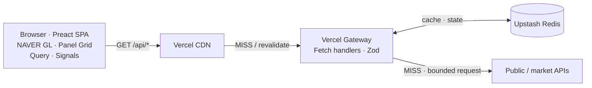
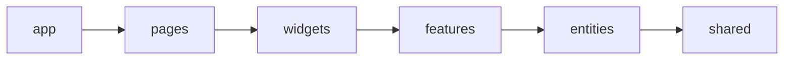
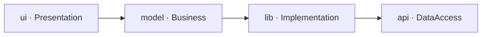
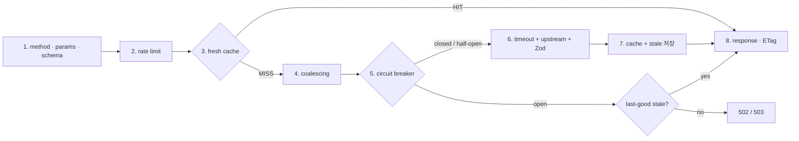
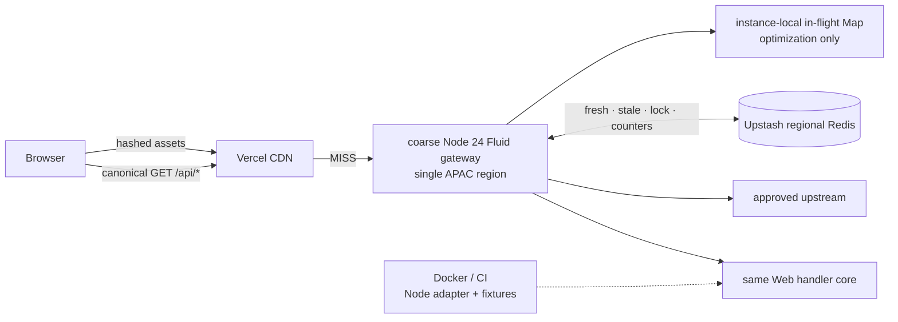
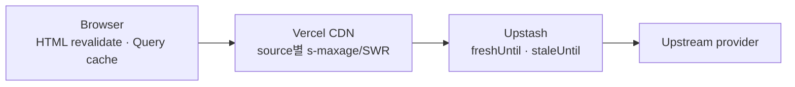
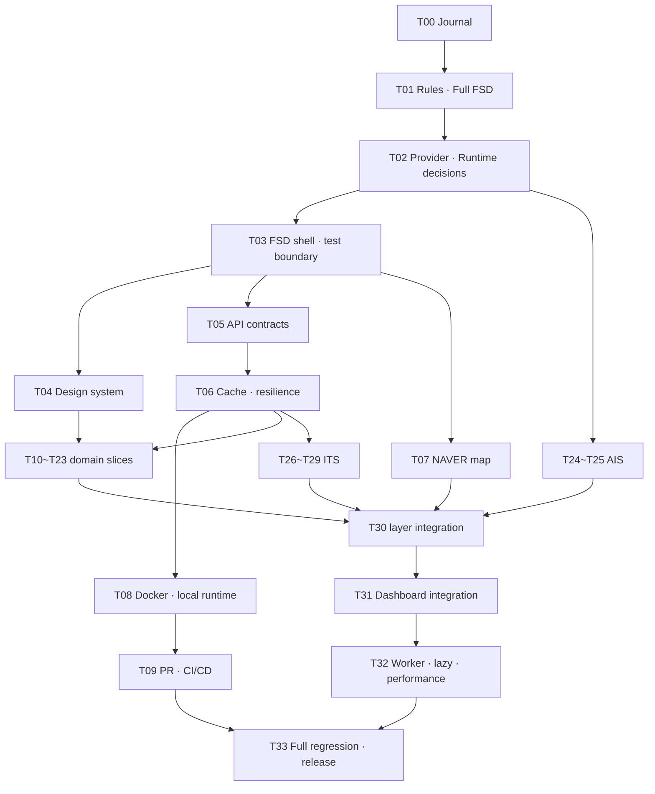

# Balance Keeper Development Journal

> Atlas Armillary Sphere — 대한민국과 주변 세계의 신호를 한눈에 읽는 실시간 대시보드

| 항목 | 값 |
| --- | --- |
| 문서 역할 | 제품 기획·기술 결정·Task·검증·개발일지의 단일 정본 |
| 실행 모드 | 승인모드 |
| 기준일 | 2026-07-20 (Asia/Seoul) |
| 새 저장소 기준선 | `f92ee53 chore: add project skills` |
| 레거시 참조 | `C:\Users\SR83\test\balance-keeper-legacy` |
| 현재 단계 | T03 Full FSD shell과 test runtime 경계 — ACCEPTED |
| 다음 단계 | T04 상세 범위 PROPOSED 준비; 사용자 승인 전 착수 금지 |

---

## 1. 문서 통제와 승인 규칙

이 파일을 프로젝트의 유일한 개발 정본으로 사용한다. 결정, Task 상태, 구현 증거와 회귀 결과를 다른 계획 문서에 분산하지 않는다. 상세 설계가 커져 별도 산출물이 필요해지더라도 이 문서에서 링크하고 상태를 관리한다.

상태 흐름은 다음과 같다.

```text
PROPOSED → APPROVED → IN_PROGRESS → VERIFYING → PASS → ACCEPTED
                                  └────────────→ BLOCKED
```

- `PASS`는 자동·수동 검증이 끝났다는 뜻이다.
- `ACCEPTED`는 사용자가 결과를 승인했다는 뜻이다.
- 의존 Task는 선행 Task가 `ACCEPTED`가 된 뒤 시작한다.
- 범위가 달라지면 기존 승인을 확대 해석하지 않고 변경 범위를 다시 승인받는다.
- `BLOCKED`는 정보 부족, 명세 모순, 검증 실패 또는 알려진 회귀 위험이 있다는 뜻이다. 추측으로 진행하지 않는다.
- Subagent는 Task 내부 조사에만 사용한다. 메인 에이전트가 결과를 실제 코드·공식 문서로 재검증한 뒤 이 문서에 통합한다.
- 병렬 작업자가 이 파일을 동시에 편집하지 않는다. 문서 갱신은 메인 에이전트가 직렬화한다.
- 기능 구현, 커밋, 원격 푸시는 승인된 Task 범위 안에서만 수행한다.

### 고정 가드레일

모든 단계와 Task는 다음 질문에 답해야 한다.

| 확인 항목 | 통과 조건 |
| --- | --- |
| 범위가 명확한가 | 포함·제외 범위와 변경 파일 영역이 적혀 있다. |
| 판단 근거가 있는가 | 코드, 테스트, 공식 문서 또는 재현 결과가 있다. |
| 기존 동작과 모순되지 않는가 | 충돌이 없거나, 대체 결정과 마이그레이션이 승인됐다. |
| 문서가 쉽게 이해되는가 | 결정 이유, 트레이드오프와 용어가 설명돼 있다. |
| 회귀 영향과 검증 방법이 확인됐는가 | 정상·실패·경계값·기존 영향 경로를 검증한다. |

---

## 2. 개발을 시작한 이유

평소 국제 정치와 글로벌 흐름을 파악하고 여러 주체의 메시지와 프로파간다를 분석하는 일을 흥미롭게 느껴 뉴스 보는 것을 취미로 삼아 왔다. 가장 큰 불편은 정보가 여러 서비스와 형식으로 분산돼 있다는 점이었다.

날씨, 기후, 지진과 같은 지도 데이터까지 포함해 대한민국의 현 상황을 한눈에 바라볼 수 있는 대시보드를 만들어보자는 단순한 생각이 Balance Keeper의 출발점이다. 현재는 흥미로운 아이디어를 검증하는 MVP 수준이지만, 장기적으로는 누구나 한국의 현황을 쉽고 빠르게 파악할 수 있는 신뢰도 높은 대시보드로 발전시키고자 한다. `Balance Keeper`라는 이름도 이 발상지를 모티브로 정했다.

함께할 개발자를 찾으려 했지만 각자의 현업과 우선순위가 달랐다. 프론트엔드 개발을 주력으로 하면서도 다양한 영역에 도전해 온 경험과 AI 도구의 도움을 바탕으로, 제품 판단과 검증 책임은 직접 지고 프로젝트를 독립적으로 진행한다.

이 문서는 전문 교재가 아니라 개인 개발일지다. 완성된 결과만 보여주기보다 왜 결정했고, 어떤 가설이 틀렸으며, 무엇으로 검증했는지 남긴다. AI로 빠르게 구현했는지보다 결정 근거와 테스트, 회귀 관리가 재현 가능한지가 더 중요한 증거다.

---

## 3. Workflow 진행 현황

| 단계 | 상태 | 근거 |
| --- | --- | --- |
| 아이디어 | PASS | 제품 동기, 사용자 가치와 장기 비전이 명시됐다. |
| 스크리닝 | PASS | MVP 수용·보류·검증 필요 범위를 분리했다. |
| 기획 | PASS | 제품 범위, 기술 원칙과 비기능 목표를 정의했다. |
| 코드베이스 분석 | PASS | 새 저장소와 레거시의 파일·계약·테스트를 대조했다. |
| 문서 검토 | PASS | fence 32개, replacement character 0개, API A01~A24를 확인했다. |
| Task 분리 | PASS | T00~T33의 34개 ID와 의존성·완료 조건을 확인했다. |
| 구현 | IN_PROGRESS | T03 구현과 사용자 승인이 완료됐다. 후속 Task는 승인모드에 따라 개별 착수한다. |
| 회귀 검증 | IN_PROGRESS | T03은 architecture 24/24, Node 25/25, DOM 1/1, 전체 26/26, CSS 기준선, `npm run validate`와 독립 리뷰 2건이 통과했다. 전체 제품 회귀는 T33까지 누적한다. |

---

## 4. 아이디어 스크리닝

| 아이디어 | 판정 | 이유와 조건 |
| --- | --- | --- |
| 한국 실시간 공공신호 단일 화면 | ACCEPT | 분산된 정보를 한 좌표계와 공통 신선도 모델로 묶는 가치가 분명하다. |
| NAVER Maps GL 기반 한국 지도 | ACCEPT | 한국 지도 경험을 우선한다. 실제 SDK·과금·오버레이 한계는 Task에서 검증한다. |
| 소스별 갱신주기 폴링 | ACCEPT | 모든 데이터를 같은 주기로 조회하는 낭비를 피한다. |
| Vercel Functions + Upstash | ACCEPT | 상주 백엔드 없이 외부 API 보호·정규화·캐시를 제공하는 MVP에 적합하다. |
| Full FSD + 기능 내부 Waterfall | ACCEPT | 최신 사용자 명세가 기존 FSD-lite보다 우선한다. |
| OKLCH 기반 디자인 토큰 | ACCEPT | 밝은 영역 소실, 다크모드 대비와 지도 오버레이 색을 시스템으로 통제한다. |
| 자동 프로파간다 판정·출처 등급화 | DEFER | 방법론, 설명 가능성, 편향·명예훼손 위험을 먼저 정의해야 한다. MVP는 원문 출처와 시각·메타데이터 제공에 집중한다. |
| OpenSky 기반 군용기 운영 표시 | NO_GO | live product·자동 시스템의 REST 사용에 서면 계약이 필요하고 군 소유 분류도 제공하지 않는다. T18은 권리 승인 또는 대체 source feasibility만 수행한다. |
| AISstream 기반 개별 군함 실시간 추적 | NO_GO | 공개 재배포 계약·SLA·안전성이 확인되지 않았고 군함은 AIS 송신 예외도 있다. T24에서 서면 권리 또는 공식 집계형 범위만 재검토한다. |
| Docker를 Vercel의 동등한 운영 대체재로 사용 | DEFER | 우선 로컬·CI 재현성과 미래 백엔드 확장 경계로 사용한다. 자체 호스팅은 별도 결정이 필요하다. |
| 전면 반응형 최적화 | DEFER | MVP는 데스크톱 지도·그리드 경험을 우선한다. 작은 화면에서 기능이 깨지지 않는 최소 안전성은 유지한다. |

---

## 5. 제품 기획

### 5.1 한 문장 정의

Balance Keeper는 대한민국과 주변 지역의 공공·시장·재난·교통 신호를 한국 지도와 데이터 패널에 함께 보여주는 데스크톱 우선 실시간 상황판이다.

### 5.2 핵심 사용자 여정

1. 앱 셸과 마지막 정상 데이터가 먼저 보인다.
2. 사용자는 지도에서 현재 관심 레이어를 켜고 끈다.
3. 지도상의 사건을 선택해 상세 패널이나 CCTV 뷰어를 연다.
4. 각 패널에서 데이터 기준시각, 출처, 신선도와 오류 상태를 확인한다.
5. 일부 공급자가 실패해도 나머지 대시보드와 마지막 정상 데이터는 유지된다.

### 5.3 MVP 범위

- 단일 Preact SPA와 데스크톱 우선 전체 화면 대시보드
- NAVER Maps GL 베이스맵과 공공데이터 오버레이
- Vercel API Gateway를 통한 인증정보 보호, 정규화, 캐시
- Upstash 기반 공유 캐시·복원력 상태
- 소스별 TanStack Query 폴링과 Signals 기반 UI 상태
- 정상·로딩·빈 값·오류·stale 상태가 구분되는 패널
- 테스트 우선 구현과 승인 단위 개발일지

### 5.4 비범위

- 안전·투자·군사 판단을 대신하는 권위 있는 분석
- 모든 소스에 대한 초 단위 실시간성 보장
- 근거 없는 정치 성향·프로파간다 자동 판정
- 초기 MVP의 모바일 전용 정보 구조
- 첫 릴리스에서의 상주 백엔드 서버

---

## 6. 검증된 사실과 결정 등록부

### 6.1 2026-07-20 공식 문서 확인

| 항목 | 확인 결과 | 영향 | 출처 |
| --- | --- | --- | --- |
| NAVER Maps GL | GL 서브모듈은 WebGL 벡터맵을 제공한다. | NAVER GL을 베이스맵 후보로 유지한다. | [NAVER GL module](https://navermaps.github.io/maps.js.ncp/docs/module-gl.html) |
| NAVER Style Editor | `gl: true`와 `customStyleId`로 발행 스타일을 연결한다. 커스텀 스타일 사용 시 일부 기본 지도 유형·레이어를 쓸 수 없다. | 스타일 적용과 기능 손실을 함께 브라우저 검증한다. | [Style Editor 연동](https://navermaps.github.io/maps.js.ncp/docs/tutorial-2-Style-Editor.html) |
| Vercel 정적 파일 캐시 | 정적 파일은 배포 생명주기 동안 자동 CDN 캐시되고, 해시 파일은 변경되지 않으면 배포 간 유지될 수 있다. | 해시 자산은 장기 immutable, HTML과 API는 별도 정책을 쓴다. | [Vercel CDN Cache](https://vercel.com/docs/caching/cdn-cache) |
| Vercel Function 캐시 | Function 응답은 `s-maxage`, `stale-while-revalidate` 등으로 CDN 캐시한다. Vercel 프록시는 공유 캐시 지시자를 소비할 수 있다. | 브라우저·Vercel CDN 헤더를 구분한다. | [Cache-Control headers](https://vercel.com/docs/caching/cache-control-headers) |
| Upstash Redis | `@upstash/redis`는 HTTP 기반 connectionless client로 serverless 환경을 지원한다. | 공유 캐시와 분산 상태 후보로 유지한다. | [Connect with @upstash/redis](https://upstash.com/docs/redis/howto/connect-with-upstash-redis) |
| Codex GitHub Action | 현재 공식 예시는 `openai/codex-action@v1`, `OPENAI_API_KEY` secret, 별도 feedback job과 최소 권한을 사용한다. | CI Task에서 공식 보안 입력을 기준으로 구현한다. | [Codex GitHub Action](https://learn.chatgpt.com/docs/github-action) |

### 6.2 T02 판정 규칙

확인 기준일은 `2026-07-20 KST`다. URL이 지금 응답한다는 사실과 운영 계약이 있다는 사실을 구분한다.

| 판정 | 의미 |
| --- | --- |
| `GO` | 공식 운영 인터페이스와 이용조건이 확인됐고, 현재 범위에서 구현 후보로 사용할 수 있다. |
| `CONDITIONAL` | 공식 후보이지만 키 기반 schema·quota 확인, 표시권리 또는 배포 환경 검증 전에는 production에서 켜지 않는다. |
| `NO_GO` | 현재 source·계약으로는 production 기본값으로 사용하지 않는다. 서면 허가나 승인된 대체 source가 필요하다. |

증거 수준은 `DOC`(공식 문서), `PUBLIC_PROBE`(비밀값 없는 읽기 요청), `GATED_PROBE`(사용자 키가 있는 후속 Task)로 구분한다. `PUBLIC_PROBE`의 `200`은 도달 가능성만 증명하며 이용허락·SLA·재배포 권리를 증명하지 않는다. 포털에 표시된 트래픽은 기본 계정값이지 SLA가 아니며, 언어별 페이지나 과거 Q&A와 충돌하면 실제 승인 계정과 최신 한국어 문서를 보수적으로 적용한다.

### 6.3 Provider 계약 장부

| Provider | 2026-07-20 확인 사실 | 판정과 다음 gate | 공식 근거 |
| --- | --- | --- | --- |
| NAVER Web Dynamic Map GL | SDK는 `ncpKeyId`, `submodules=gl`, `gl: true`, 발행한 Style Editor의 `customStyleId`를 지원한다. Web Dynamic Map과 Web 서비스 host를 Application에 등록하며 host는 최대 10개다. Client ID와 style metadata ID는 브라우저 식별자이고 Client Secret은 브라우저 값이 아니다. 대표 계정 요금표는 현재 월 6,000,000회 이하 무료를 표시하지만 초과 구간의 빈 가격을 hard stop이나 무상 overage로 해석하지 않는다. 커스텀 스타일에서는 일반·위성·겹침·지형도와 자전거·교통·거리뷰·지적도 layer를 함께 쓸 수 없다. | `GO` — T07에서 실제 등록 host·계정 quota·published style load, `429`와 실패 fallback을 browser smoke한다. | [시작하기](https://navermaps.github.io/maps.js.ncp/docs/tutorial-2-Getting-Started.html), [Style Editor 연동](https://navermaps.github.io/maps.js.ncp/docs/tutorial-2-Style-Editor.html), [NAVER Maps Application](https://guide.ncloud-docs.com/docs/maps-app), [Maps 요금](https://www.ncloud.com/api-cms/service-product/static/maps) |
| KMA 초단기·단기예보 | `VilageFcstInfoService_2.0`의 `getUltraSrtNcst`, `getUltraSrtFcst`, `getVilageFcst`를 사용한다. 단기예보 발표는 `02/05/08/11/14/17/20/23 KST`, 개발계정 표시는 10,000건이며 출처표시 제1유형이다. | `CONDITIONAL` — KST 자정·발표 지연, HTTPS alias, null category와 승인 계정 quota를 T10/T22 실키로 검증한다. | [단기예보 조회서비스](https://www.data.go.kr/data/15084084/openapi.do), [KMA API Hub 동네예보](https://apihub.kma.go.kr/apiList.do?apiMov=4.+%EB%8F%99%EB%84%A4%EC%98%88%EB%B3%B4%28%EC%B4%88%EB%8B%A8%EA%B8%B0%EC%8B%A4%ED%99%A9%C2%B7%EC%B4%88%EB%8B%A8%EA%B8%B0%EC%98%88%EB%B3%B4%C2%B7%EB%8B%A8%EA%B8%B0%EC%98%88%EB%B3%B4%29+%EC%A1%B0%ED%9A%8C&seqApi=10&seqApiSub=286) |
| KMA 기상특보 | `WthrWrnInfoService/getWthrWrnList`와 특보 통보문·현황 계약이 있고 업데이트는 실시간, 개발·운영 자동승인, 출처표시 제1유형이다. | `CONDITIONAL` — 목록만으로 active/cancel geometry를 추정하지 않고 T23에서 통보문·현황 조합과 실제 quota를 검증한다. | [기상특보 조회서비스](https://www.data.go.kr/data/15000415/openapi.do) |
| KMA 지진 | `EqkInfoService/getEqkMsg`는 발표·발생시각, 위경도, 규모, 깊이와 수정사항을 제공한다. 실시간·무료·자동승인이고 현재 한국어 페이지 개발계정 표시는 10,000건이다. | `CONDITIONAL` — T12에서 KMA 수정 통보와 USGS event dedup을 실키 검증한다. | [지진정보 조회서비스](https://www.data.go.kr/data/15000420/openapi.do) |
| AirKorea | `ArpltnInforInqireSvc/getCtprvnRltmMesureDnsty`는 서비스키가 필요하다. 현재 한국어 제품 페이지 개발계정 표시는 500건/일이고 운영은 활용신고 심사 후 10,000건/일로 안내된다. 2026-06-30 이후 `전남`, `광주`, `전남광주` 처리 규칙이 바뀌었으며 실시간 측정값은 확정자료가 아니고 결측될 수 있다. 측정소 계약은 `MsrstnInfoInqireSvc/getMsrstnList`이고 샘플의 `dmX`는 위도, `dmY`는 경도라 이름만 보고 축을 바꾸지 않는다. | `CONDITIONAL` — T11에서 승인 quota, 행정구역, 좌표축, 결측과 측정시각을 확인한다. 운영 승인 전 개발 호출량을 production 가정으로 쓰지 않는다. | [대기오염정보](https://www.data.go.kr/data/15073861/openapi.do), [측정소정보](https://www.data.go.kr/data/15073877/openapi.do), [2026 행정구역 공지](https://www.data.go.kr/bbs/ntc/selectNotice.do?originId=NOTICE_0000000004805), [확정자료 설명](https://www.data.go.kr/data/15122830/fileData.do) |
| 행정안전부 긴급재난문자 | `https://www.safetydata.go.kr/V2/api/DSSP-IF-00247`는 신청한 `serviceKey`로 1분 갱신 데이터를 제공한다. 공개 숫자 quota·명시적 종료일/cursor/sort 계약은 찾지 못했고 오류는 요청한 `returnType`과 무관하게 XML일 수 있으며 quota·key·IP 오류코드가 있다. FAQ상 정렬되지 않은 응답도 가능하다. Safetydata는 공공기관 데이터 제3유형을 안내하지만 data.go.kr 연결 메타는 제4유형을 표시해 이용허락 표기가 충돌한다. | `CONDITIONAL` — 더 엄격한 출처표시·비상업·변경금지를 기본으로 두고 원문은 변형하지 않는다. T16에서 실제 quota, XML error branch, pagination·dedup·정렬을 실키 검증하고 공개/상업 서비스 전 제공기관 확인을 받는다. | [Safetydata 상세](https://www.safetydata.go.kr/disaster-data/view?dataSn=228), [data.go.kr 연결 메타](https://www.data.go.kr/data/15134001/openapi.do) |
| ECOS | 공식 서비스는 `StatisticTableList`, `StatisticItemList`, `StatisticSearch`, `KeyStatisticList`다. 검색 URL shape는 `https://ecos.bok.or.kr/api/StatisticSearch/{CERT_KEY}/{xml\|json}/{kr\|en}/{startRow}/{endRow}/{STAT_CODE}/{cycle}/{startTime}/{endTime}/{item1}/{item2}/{item3}/{item4}`이고 공식 안내의 `CERT_KEY` 길이는 30자다. 주기는 `A/S/Q/M/SM/D`, item 1~4는 선택이며 응답은 통계·항목 코드/명, 단위, 시점과 값을 제공한다. 공개 숫자 quota는 찾지 못했고 레거시 `731Y001`, `722Y001`, `732Y001`은 현재 의미가 검증되지 않은 후보다. | `CONDITIONAL` — T13에서 `StatisticTableList → StatisticItemList → StatisticSearch` 순서로 코드·항목을 발견하고 발표일, 단위, 최신 observation과 실제 제한을 실키 검증한다. 응답 순서를 최신값 보장으로 가정하지 않는다. | [한국은행 ECOS Open API](https://ecos.bok.or.kr/api/) |
| USGS earthquake | 실시간 GeoJSON feed는 매분 갱신되며 자동화 앱의 우선 인터페이스다. 고정 숫자 quota는 없고 과다 호출 시 `429`; 대부분 USGS 정보는 public domain이며 출처표시가 권장된다. | `GO` — 60초보다 빠르게 원본을 호출하지 않고 validator/cache header를 존중한다. KMA와 상호 보완한다. | [GeoJSON feed](https://earthquake.usgs.gov/earthquakes/feed/v1.0/geojson.php), [FDSN API](https://earthquake.usgs.gov/fdsnws/event/1/), [USGS credit](https://www.usgs.gov/information-policies-and-instructions/acknowledging-or-crediting-usgs) |
| 시장 데이터 | Yahoo의 현재 개발자 카탈로그에는 Finance API가 없고 데이터 제공자 안내는 재배포를 금지한다. `query1.finance.yahoo.com` 도달 여부는 계약이 아니다. KRX는 승인형 일별 지수 API를, FRED는 key 기반 경제 시계열을 제공한다. | Yahoo `NO_GO`. T14 범위는 KRX 국내 일별지수와 권리 검토를 마친 FRED/승인된 유료 source의 지연 데이터로 축소하며, 실시간 시세로 표시하지 않는다. | [Yahoo API catalog](https://developer.yahoo.com/api/), [Yahoo data delays/redistribution](https://help.yahoo.com/kb/finance/article-exchanges-data-delays-sln2310.html), [KRX API 목록](https://openapi.krx.co.kr/contents/OPP/INFO/service/OPPINFO004.cmd), [FRED terms](https://fred.stlouisfed.org/docs/api/terms_of_use.html) |
| 뉴스 RSS | Yonhap·KBS·Hani·Chosun의 현재 feed는 응답하지만 publisher별 이용범위가 다르다. Chosun은 개인 구독만 기본 허용하고 상업 이용은 문의를 요구한다. Google News search RSS에는 consumer API, quota, SLA나 재배포 허가를 설명하는 공식 계약이 없다. | 직접 publisher RSS는 `CONDITIONAL`로 제목·출처·시각·원문 링크만 제공하고 전문을 저장/재배포하지 않는다. Google News RSS는 `NO_GO`; JoongAng 우회 feed도 제거한다. | [KBS RSS](https://world.kbs.co.kr/service/about_rss.htm?lang=e), [Chosun RSS 안내](https://rssplus.chosun.com/), [Google News 변경](https://support.google.com/news/publisher-center/answer/15898024?hl=en) |
| 항공 데이터 | OpenSky는 OAuth2와 credit quota를 문서화했지만 live product/자동 시스템의 REST 사용에 서면 계약을 요구한다. 제공 state에는 검증된 군 소유 분류가 없다. | OpenSky `NO_GO` until written license. T18은 구현 Task가 아니라 license/대체 source feasibility로 바꾸고, ADSB.lol은 ODbL·동적 제한·`mil` 분류 한계를 승인받기 전 `CONDITIONAL`이다. | [OpenSky REST](https://openskynetwork.github.io/opensky-api/rest.html), [OpenSky terms](https://opensky-network.org/about/terms-of-use), [ADSB.lol license](https://www.adsb.lol/privacy-license/) |
| AIS | AISstream은 API key를 사용하는 backend WebSocket beta이며 CORS를 지원하지 않고 SLA·안정 schema·공개 재배포 계약이 확인되지 않았다. 군함은 AIS 탑재·송신 의무 예외가 있어 완전한 군함 지도가 될 수 없다. | 개인 군함 추적은 `NO_GO`. T24는 서면 권리와 안전성 또는 한국 공식 집계형 AIS로 범위를 바꾸는 feasibility만 수행하며, 조건 충족 전 T25를 시작하지 않는다. | [AISstream docs](https://aisstream.io/documentation.html), [IMO AIS guidance](https://www.imo.org/en/ourwork/safety/navigation/ais.aspx), [한국 연안 AIS 집계](https://www.data.go.kr/data/15084033/openapi.do) |
| ITS | 현재 공식 카탈로그에는 CCTV와 A16~A24 9종이 모두 존재한다. 인증키 승인은 3~5영업일로 안내된다. CCTV는 HLS·mp4·정지영상·HTTPS-HLS·HTTPS-mp4 유형을 문서화했고 재난 API는 point/line/polygon을 제공한다. 현재 manual은 서비스별 24시간 제한이 없다고 하지만 과거 공식 Q&A는 API당 1,000건/일이라 답해 충돌한다. 현재 정적 상세 페이지는 각 서비스의 정확한 production HTTPS resource path를 모두 노출하지 않는다. | 모두 `CONDITIONAL` — T19/T20/T21/T26에서 승인 key로 HTTPS host·path·port, 실제 quota, 좌표·날짜창·빈 결과, media CORS/만료와 표시조건을 동결한다. 과거 `http://openapi.its.go.kr` 예시나 `:9443` probe를 production 경로로 복사하지 않는다. | [ITS Open API](https://www.its.go.kr/opendata/intro), [현재 manual](https://www.its.go.kr/file/opendata/openapi_manual.pdf), [CCTV](https://www.its.go.kr/opendata/opendataList?service=cctv), [재난](https://www.its.go.kr/opendata/opendataList?service=disaster), [과거 quota Q&A](https://www.its.go.kr/opendata/reqOpendataQnaDetail?seqNo=166) |

### 6.4 A01~A24 source 동결

`신선도 기준`은 upstream을 그보다 더 자주 호출하지 않기 위한 하한이며, 실제 TTL은 keyed probe의 응답시각·quota를 근거로 각 구현 Task에서 좁힌다.

| ID | 동결 source | 판정 | 신선도 기준·fallback / 후속 gate |
| --- | --- | --- | --- |
| A01 | KMA `getUltraSrtNcst` | `CONDITIONAL` | KST 발표시각 기준, 10분 client 확인·공유 cache. T10 keyed boundary probe |
| A02 | KMA `getVilageFcst` | `CONDITIONAL` | 하루 8회 발표 경계 기준, 중간에는 캐시. T22 자정·누락 slot probe |
| A03 | KMA `WthrWrnInfoService` | `CONDITIONAL` | event성 1~2분 확인, active/cancel은 목록이 아닌 현황 계약으로 판정 |
| A04 | AirKorea 시도별 실시간 측정+측정소 | `CONDITIONAL` | 측정시각 기준 30분 확인, 결측은 last-good와 별도 표시; `dmX=위도`, `dmY=경도` keyed fixture 고정 |
| A05 | KMA 지진 + USGS GeoJSON | USGS `GO`, 전체 `CONDITIONAL` | USGS 원본 최소 60초, KMA keyed smoke 후 source ID·시공간 dedup |
| A06 | ECOS table/item/search discovery | `CONDITIONAL` | 발표일 기준 6~24시간; table→item→search로 후보 통계코드·단위·정렬 실키 검증 |
| A07 | KRX 일별 + 승인된 미국/환율 source | `CONDITIONAL` | EOD/지연 데이터만. Yahoo endpoint·실시간 표시는 `NO_GO` |
| A08 | 직접 publisher RSS | `CONDITIONAL` | 5~10분, feed별 독립 실패. Google News RSS와 우회 feed는 `NO_GO` |
| A09 | Safetydata `DSSP-IF-00247` | `CONDITIONAL` | 30~60초, 원문 보존·출처·license 확인과 keyed XML error·pagination·정렬/dedup probe |
| A10 | A05+A07+A08 파생 조합 | `CONDITIONAL` | 별도 upstream 중복 호출 없이 가장 느린 component와 부분 실패 표시 |
| A11 | OpenSky 또는 승인 대체 ADS-B | `NO_GO` | 서면 운영권리/ODbL 승인 전 feature off; callsign은 군 소유 증거가 아님 |
| A12 | AISstream 군함 | `NO_GO` | 서면 재배포·안전·retention 계약과 상주 ingestion topology 없이는 feature off |
| A13 | ITS CCTV metadata | `CONDITIONAL` | bbox 변경 또는 5~10분; `type=ex\|its`, URL·좌표·format keyed probe |
| A14 | ITS CCTV `cctvType=3` 정지영상 | `CONDITIONAL` | viewer 활성 시에만 짧게; HTTPS, 크기, CORS·만료와 allowlist 검증 |
| A15 | ITS `cctvType=4` HTTPS-HLS 우선 | `CONDITIONAL` | on-demand 한 스트림. Vercel Function으로 segment/video를 상시 relay하지 않음 |
| A16 | ITS `traffic` | `CONDITIONAL` | 30~60초 후보; link ID·속도·빈 구간 keyed probe |
| A17 | ITS `event` | `CONDITIONAL` | 30~60초 후보; 시작·종료·severity·중복 keyed probe |
| A18 | ITS `fcTraffic` 우회도로 예측 | `CONDITIONAL` | `sectionId`, `fCastDate`, `fCastHour` 필수; generic 전국 예측으로 확대하지 않고 본선/우회 구간과 horizon 검증 |
| A19 | ITS `detectorInfo` | `CONDITIONAL` | 수분 이내 후보; 집계주기·단위·전국 coverage 검증 |
| A20 | ITS `vms` | `CONDITIONAL` | 1~5분 후보; message sanitize·좌표·만료 검증 |
| A21 | ITS `safeDriving` 고속도로 주의운전 | `CONDITIONAL` | 필수 bbox, 5~10분 후보; 고속도로 범위·유형·geometry·유효기간 검증 |
| A22 | ITS `vsl` | `CONDITIONAL` | 1~5분 후보; 제한속도 단위·발효/해제 검증 |
| A23 | ITS `dangerousCarInfo` | `CONDITIONAL` | sparse event·종료 flag라 빈 결과를 장애로 보지 않음; 정밀 위치·보존·안전 노출 정책 선행 |
| A24 | ITS `disaster` | `CONDITIONAL` | category `D`, event `D03/D04/D06/D07`, 필수 시작·종료일과 선택 bbox, Point/Line/Polygon 순서·XY·null·종료 검증; 실패 시 A17 `eventType=dis` 또는 A09 목록만 표시 |

### 6.5 무자격 public probe 장부

2026-07-20에 로컬 secret이나 `.env`를 읽지 않고 공개 GET만 한 번씩 실행했다. 응답 본문의 업무 데이터는 저장하지 않았고 상태·콘텐츠 유형·shape 시작만 확인했다.

| 대상 | 결과 | 증명하는 것 / 증명하지 않는 것 |
| --- | --- | --- |
| USGS FDSN Korea/East Asia bbox | `200 application/json`, GeoJSON collection | 현재 도달·JSON shape. 장기 SLA·고정 quota는 아님 |
| OpenSky Korea bbox anonymous | `200 application/json` | 현재 도달만 확인. 운영 사용권리는 없으므로 후속 polling 금지 |
| KMA HTTPS without key | `401 text/plain` | HTTPS route와 missing-key 실패. keyed schema·quota는 미확인 |
| ITS `:9443` without key | `401 application/json`, `resultCode=4002` | gateway와 구조화된 필수 parameter 실패. 실제 서비스 응답은 미확인 |
| Yonhap·KBS·Hani·Chosun RSS | 모두 `200`, XML root | 현재 feed 도달. KBS는 XML인데 `text/html`을 반환하므로 MIME만 신뢰하지 않음 |
| Google News search RSS | `200 application/xml` | 현재 도달만 확인. 공식 consumer 계약이 아니므로 production 사용 근거가 아님 |

### 6.6 결정 등록부

| ID | 결정 | 상태 | 근거·재검토 조건 |
| --- | --- | --- | --- |
| D-001 | Node 24, TypeScript strict, Preact, Signals, TanStack Preact Query, Vite, Tailwind, Vitest, Biome를 사용한다. | ACCEPTED | 현재 scaffold와 최신 명세가 일치한다. |
| D-002 | 클라이언트 구조는 `app → pages → widgets → features → entities → shared` Full FSD를 사용한다. | ACCEPTED | 최신 사용자 명세가 기존 no-pages skill보다 우선한다. |
| D-003 | `pages/dashboard`는 즉시 도입하되 실제 두 번째 URL이 생기기 전까지 router dependency는 추가하지 않는다. | ACCEPTED | 사용자가 Full FSD와 초기 no-router 구성을 승인했다. Page 조합 계층과 router 도입을 분리한다. |
| D-004 | 기능 내부 Waterfall은 `ui(Presentation)`, `model(Business)`, `lib(Implementation)`, `api(DataAccess)`로 매핑하며 필요한 segment만 만든다. | ACCEPTED | 사용자가 T03 착수와 함께 승인했다. FSD layer와 Waterfall 책임을 1:1 대응시키지 않는다. |
| D-005 | NAVER Maps GL을 주 베이스맵으로 사용하고 지도 SDK는 동적 로딩한다. | ACCEPTED | 한국 지도 정확도와 사용 경험을 우선한다. |
| D-006 | MapLibre/deck.gl은 초기 번들에 넣지 않는다. NAVER 오버레이 예산으로 충족하지 못하는 측정된 고밀도 요구가 생길 때 별도 승인한다. | PROPOSED | 이중 지도 엔진과 2MB급 초기 번들 회귀를 피한다. |
| D-007 | TanStack Query는 원격 서버 상태, Signals는 파생·일시적 UI 상태만 소유한다. | ACCEPTED | 책임 중복을 방지한다. |
| D-008 | Vercel managed deployment를 운영 정본으로 두고 Vite 정적 자산은 CDN, gateway는 단일 APAC Node 24 Fluid Function군, 공유 상태는 Upstash에 둔다. Docker는 로컬·CI 재현성만 담당하며 self-host production과 Vercel Dockerfile beta는 별도 승인한다. | ACCEPTED | Docker는 CDN·Fluid·scale-to-zero·region·배포 무효화를 재현하지 못한다. 기본 후보는 `hnd1`+Upstash Tokyo이고 T08 latency probe에서 `icn1` 대안을 비교한다. |
| D-009 | 서버 코어는 `(request: Request, dependencies) => Promise<Response>` Web handler로 작성한다. Vercel `fetch` export와 Node/Docker `node:http` bridge는 얇은 adapter이며 env·platform cache header·Cron auth·lifecycle은 adapter가 소유한다. | ACCEPTED | Vercel Node runtime과 Node 24가 표준 Request/Response를 지원한다. 플랫폼 의미까지 동일하다고 가정하지 않는다. |
| D-010 | 정적 자산, HTML, API 데이터는 서로 다른 캐시 정책을 쓴다. API에 1년 TTL을 일괄 적용하지 않는다. | ACCEPTED | 데이터 신선도와 배포 무효화를 분리한다. |
| D-011 | AI 개발 workflow는 `brainstorm → plan → RED/GREEN/REFACTOR → verify → review`로 고정한다. | ACCEPTED | 테스트가 먼저 실패하는 것을 확인한다. |
| D-012 | Codex 리뷰와 자동 품질 게이트는 ready-for-review PR에서 독립 실행하고, 초기에는 Codex 결과를 참고 의견으로 둔다. | PROPOSED | 테스트 실패와 별개인 구조 결함도 찾되 비용은 Draft skip으로 제어한다. |
| D-013 | Hobby의 직접 Function 12개 제한을 피하고 공통 정책을 한곳에 적용하기 위해 A01~A24를 24개 entry가 아니라 하나 또는 소수의 coarse gateway Function과 내부 route registry로 제공한다. | ACCEPTED | 비-프레임워크 `api/` 파일은 파일마다 Function이 되며 현재 제품 route 수가 제한을 넘는다. |
| D-014 | process-local promise map은 같은 warm instance의 최적화만 담당한다. fresh/last-good cache와 fleet-wide lock·rate-limit·breaker는 Upstash atomic operation+TTL을 사용하고, eventual consistency 때문에 breaker는 hint로 취급한다. | ACCEPTED | Fluid concurrency와 scale-out에서 process memory는 공유 정본이 아니다. |
| D-015 | 모든 upstream API·인증·목록·metadata 요청은 gateway를 통과한다. 표준 Vercel Function은 정상화된 JSON·허용된 media metadata만 제공하고 CCTV video/HLS segment와 대형 이미지 bytes를 4.5MB payload 경로로 상시 relay하지 않는다. 브라우저 직접 요청은 server secret을 포함하지 않고 gateway가 allowlist한 provider-issued HTTPS media URL에만 허용하는 media-only 예외다. 조건을 충족하지 못하면 unavailable로 두거나 별도 media topology를 승인받는다. | ACCEPTED | 일반 API gateway의 payload·대역폭·file descriptor 예산과 secret 경계를 함께 보호한다. T05에서 `vercel-api-gateway` skill을 이 예외와 먼저 정렬한 뒤 T19~T21을 구현한다. |
| D-016 | OpenSky, AISstream, Yahoo Finance와 Google News RSS는 현재 production 기본 source로 사용하지 않는다. provider 권리와 계약이 해제되지 않은 기능은 fixture demo가 아니라 명시적 unavailable/feature-off 상태로 둔다. | ACCEPTED | 기술적 도달과 운영·재배포 권리를 분리한다. |

---

## 7. 코드베이스 분석

### 7.1 새 저장소

새 저장소는 기반 설정만 존재한다.

- Preact 애플리케이션과 Query provider
- Tailwind·Biome·Vitest·TypeScript·Vite 설정
- `npm run validate` 품질 게이트
- Vercel SPA rewrite
- 프로젝트 skills와 `AGENTS.md`

현재 없는 것:

- `pages`, `widgets`, `features`, `entities` 구현
- `api/`와 `src/server/`
- NAVER 지도 loader와 map widget
- Upstash dependency와 cache adapter
- Dockerfile·Compose
- 디자인 토큰과 theme state
- Web Worker
- 제품 API와 패널

따라서 새 저장소의 API 구현 진행률은 `0/24`다.

### 7.2 레거시

레거시에는 정확히 12개의 route 파일과 다수의 fixture 테스트가 있다. 그러나 파일 존재를 제품 완료로 보지 않는다.

재사용 가치가 높은 개념:

- `AppError`와 정규화된 성공·오류 envelope
- route별 TTL과 cache key
- Upstash adapter, last-good stale, process-local singleflight
- source별 Zod 정규화와 fixture 기반 테스트
- TanStack query key와 공통 Panel 상태
- NAVER GL SDK singleton, 첫 로드 처리, listener·overlay cleanup
- CCTV host allowlist와 HLS 상대경로 rewrite 테스트

NAVER 지도 구현의 지정 참고 파일:

- `C:\Users\SR83\test\balance-keeper-legacy\src\widgets\NaverStyleMapLab\NaverStyleMapLab.tsx`
- 사용자가 다크테마 NAVER Maps GL 시뮬레이션을 지도 작업의 참고 구현으로 승인했다.
- `submodules=gl` SDK loader, `gl: true`, `customStyleId`, 첫 동적 로드 처리와 listener·overlay cleanup 동작을 T07의 참고 근거로 삼는다.
- 이 파일은 참고 구현이지 그대로 복사할 production 정본은 아니다. 합성 샘플 데이터, 문자열 기반 HTML marker, 정적 import와 단일 대형 component 구조는 새 경계에 맞게 재설계한다.

재설계가 필요한 부분:

- ETag가 `meta.cached`까지 포함해 같은 데이터에서도 바뀔 수 있다.
- singleflight가 process-local `Map`이라 Vercel 인스턴스 간 중복 호출을 막지 못한다.
- rate limit, circuit breaker, upstream timeout과 구조화된 관측성이 없다.
- stale hit와 fresh cache hit를 메타에서 구분하지 않는다.
- Zod schema와 TypeScript 타입이 수동 중복된다.
- 기본 제품 지도는 MapLibre이고 NAVER GL은 실험실 분기다.
- NAVER 날씨·도로·지진 표시 상당수가 합성 샘플이다.
- 지도와 HLS가 정적 import돼 초기 번들이 약 2MB였다는 QA 기록이 있다.
- Full FSD의 `pages`, slice public API와 import boundary가 없다.
- 앱 소유 Web Worker와 Docker 설정이 없다.

복사하지 않을 항목:

- `deck.gl` umbrella dependency와 기본 OSM MapView
- 합성 샘플을 production 데이터처럼 사용하는 코드
- pathname 문자열 기반 수동 router
- eager map·HLS import
- 최신성·라이선스가 확인되지 않은 지리 데이터

### 7.3 T01 착수 전 충돌과 해소 상태

| 충돌 | T01 착수 전 상태 | 상태·다음 조치 |
| --- | --- | --- |
| Full FSD vs FSD-lite | `AGENTS.md`와 skill이 `pages`를 금지했다. | RESOLVED — Full FSD와 `pages/dashboard` 규칙으로 교체했다. |
| NAVER GL vs deck.gl 정본 | FSD skill은 deck.gl MapView를 예시로 뒀다. | RESOLVED — NAVER Maps GL 정본과 lazy 경계로 정정했다. 실제 adapter는 T07에서 구현한다. |
| 승인모드 | Task 승인·단일 일지 규칙이 저장소에 없었다. | RESOLVED — `planning-agent`와 AGENTS 우선규칙을 추가했다. |
| Vercel + Docker | Vercel 표지만 있고 Docker 실행 역할이 없다. | T02에서 운영 Vercel·로컬/CI Docker 책임을 동결해 수락 대기, T08에서 구현한다. |
| 디자인 토큰 | skill은 semantic token을 요구하지만 App은 raw zinc/cyan이다. | T04에서 token source를 만든다. |
| 테스트 런타임 | 모든 Vitest가 jsdom이다. | T03/T05에서 Node와 jsdom project를 분리한다. |

착수 전 규칙 충돌 세 건과 Tailwind source 경계는 T01에서 해소·수락됐다. 제품 기능은 해당 후속 Task 승인 전까지 시작하지 않는다.

---

## 8. 목표 아키텍처

### 8.1 시스템 컨텍스트



핵심 축은 브라우저 단일 페이지와 cache-first gateway다. 지도는 장식이 아니라 데이터의 좌표계이자 주 인터페이스다.

### 8.2 Full FSD



- `app`: 진입점, provider, 전역 error boundary, theme 초기화, 전역 스타일
- `pages`: 완성 화면의 순수 조합. 초기에는 `pages/dashboard` 하나
- `widgets`: Map, PanelGrid, AlertRail처럼 독립적인 화면 영역과 4상태 UI
- `features`: layer toggle, CCTV live, theme switch처럼 사용자 행동
- `entities`: weather, air, earthquake, market 등 도메인 타입·기본 규칙·표현
- `shared`: 디자인 시스템, HTTP client, 공통 config, logger와 비도메인 유틸
- `api/`와 서버 코어는 클라이언트 import 방향과 분리하되 transport contract만 공유한다.

규칙:

- 위쪽 layer를 아래쪽에서 import하지 않는다.
- sibling slice끼리 직접 import하지 않는다.
- 다른 layer는 slice의 `index.ts` public API만 사용한다.
- 여러 곳에서 쓴다는 이유만으로 도메인 코드를 `shared`로 옮기지 않는다.
- Page는 원격·UI 상태를 소유하지 않는다.

### 8.3 기능 내부 Waterfall



이 도식은 호출 방향을 기계적으로 강제하기 위한 4단 폴더 의무가 아니다. 하나의 slice 안에서 책임을 설명하는 기준이며, 불필요한 segment는 만들지 않는다.

예시:

```text
src/entities/weather/
  api/
    contract.ts
    queries.ts
  model/
    types.ts
    freshness.ts
  ui/
    WeatherPanel.tsx
  index.ts
```

---

## 9. 대시보드 성능 원칙

실시간은 모든 데이터를 1초마다 폴링하거나 WebSocket으로 받는다는 뜻이 아니다. 공급자의 실제 갱신주기, 호출 쿼터와 사용자가 보는 화면에 맞춰 신선도를 관리하는 일이다.

- 앱 셸을 먼저 렌더링하고 지도, HLS, 대형 지리 데이터와 차트를 lazy load한다.
- 수천 개 포인트를 DOM/SVG로 직접 만들지 않는다.
- NAVER overlay는 viewport filter, clustering과 집계로 예산을 관리한다.
- 대용량 GeoJSON/XML 파싱, 공간 인덱스와 집계처럼 순수 계산만 Web Worker로 옮긴다.
- NAVER SDK 객체와 DOM overlay 조작은 메인 스레드에 남긴다.
- Canvas/WebGL이 필요한 밀도는 측정 뒤 선택한다.
- 보이지 않는 패널은 query `enabled` 또는 near-viewport 정책으로 호출을 늦춘다.
- 지도와 CCTV를 켜지 않은 사용자가 해당 무거운 번들 비용을 내지 않게 한다.

### 초기 성능 예산

| 항목 | 초기 목표 | 비고 |
| --- | --- | --- |
| 앱 셸 초기 JS | gzip 100KB 이하 | 지도·HLS 제외 |
| 지도 SDK | 사용자 화면 진입 후 동적 로드 | 실패 fallback 포함 |
| HLS | CCTV Live 선택 후 동적 import | 동시에 한 스트림만 |
| 메인 스레드 long task | 50ms 이상 작업을 계측 | Worker 후보 |
| 패널 요청 | source별 dedup, visibility 적용 | 전체 동일 폴링 금지 |
| 지도 overlay | 계측 가능한 상한 설정 | T07/T30에서 실제 기기 측정 |

---

## 10. Gateway 설계

### 10.1 처리 흐름



### 10.2 계약

성공 envelope:

```ts
type SuccessEnvelope<T> = {
  data: T;
  meta: {
    requestId: string;
    fetchedAt: number;
    cache: 'MISS' | 'HIT' | 'STALE' | 'REVALIDATED';
    source: string;
  };
};
```

오류 envelope:

```ts
type ErrorEnvelope = {
  error: {
    code: string;
    fields?: Record<string, string[]>;
    requestId: string;
  };
};
```

- 스키마 위반: `400` 또는 의미상 유효성 오류 `422`
- 누락·권한: `401`, `403`
- route·parameter: `404`, `400`
- upstream 장애: `502`
- breaker open 또는 일시 불가: stale이 없으면 `503`
- 사용자 응답에는 secret, upstream 원문 오류나 stack을 넣지 않는다.

### 10.3 캐시 키

```text
v1:<route>:<sorted-query-hash>:<lang?>:<region?>
```

- query key와 value를 trim·case·허용값으로 정규화한 뒤 정렬한다.
- bbox는 허용 범위와 정밀도를 제한해 key cardinality를 통제한다.
- 정상 `2xx empty`만 짧은 negative cache 후보로 삼는다.
- timeout, `4xx/5xx`와 schema 실패는 negative cache로 저장하지 않는다.

### 10.4 복원력

- process-local promise map은 한 인스턴스 안의 중복만 합친다.
- 전체 singleflight가 필요하면 Upstash `SET NX EX` 계열의 짧은 분산 lock과 stale fallback을 별도 구현한다.
- breaker 상태, rate counter와 lock은 원자성·TTL을 fixture 및 concurrency test로 검증한다.
- 모든 upstream fetch에 `AbortSignal.timeout` 또는 동등한 명시적 timeout을 둔다.
- structured log에는 route, duration, cache status, upstream status, requestId를 기록한다.
- key, token, raw Authorization과 민감 query는 로그에서 제거한다.

### 10.5 T02 runtime topology



- Vercel은 운영 정본이다. Vite `dist`는 CDN이 제공하고 `/api/*`는 하나 또는 소수의 coarse Node Function이 내부 route registry로 분기한다.
- 새 Vercel project 기본 region `iad1`을 그대로 두지 않는다. 초기 기본 후보는 문서상 co-location 가능한 `hnd1` Function + Upstash Tokyo regional database다. T08에서 한국 upstream까지의 latency를 `icn1` 대안과 비교한 뒤 명시적으로 고정한다.
- 초기에는 multi-region Function을 사용하지 않는다. cache density를 낮추고 cross-region lock·eventual consistency 문제를 늘릴 근거가 없다.
- Docker는 digest-pinned Node 24 환경에서 build·test·local adapter·healthcheck를 재현한다. Vercel CDN, Fluid scheduling, scale-to-zero, Cron과 region network를 재현한다고 주장하지 않는다.
- 2026-06-30 공개 beta인 Vercel Dockerfile Function은 MVP에 필요한 native dependency가 없으므로 사용하지 않는다. self-host production도 별도 결정이다.
- Vercel Cron은 선택적 cache warmer일 뿐 correctness path가 아니다. UTC GET, 중복·겹침 가능성과 retry 부재를 전제로 인증·idempotency·distributed lock을 사용한다.

공식 근거: [Vercel region](https://vercel.com/docs/functions/configuring-functions/region), [Vercel runtimes](https://vercel.com/docs/functions/runtimes), [Vercel Dockerfile beta](https://vercel.com/changelog/bring-your-dockerfile-to-vercel-functions), [Docker build best practices](https://docs.docker.com/build/building/best-practices/), [Vercel Cron](https://vercel.com/docs/cron-jobs).

### 10.6 Portable HTTP core

```ts
type GatewayHandler = (
  request: Request,
  dependencies: GatewayDependencies,
) => Promise<Response>;
```

- Vercel entry는 공식 `fetch(request: Request)` export에서 core를 호출한다.
- 로컬·Docker entry는 `node:http`의 `IncomingMessage`/`ServerResponse`와 Web 객체 사이만 변환한다.
- core는 `new URL(request.url).searchParams`를 사용하고 Vercel 전용 `request.query` helper에 의존하지 않는다.
- `fetch`, clock, cache, logger와 config를 주입해 offline fixture test가 network나 secret을 읽지 않게 한다.
- env loading, `waitUntil`, Cron 인증, platform cache header, region·duration과 process signal은 adapter 책임이다.
- 표준 Web shape는 portable하지만 CDN·timeout·stream·cancellation 동작까지 동일하다고 가정하지 않고 preview deployment contract test를 둔다.

Vercel Node runtime은 Node API와 표준 Web `Request`/`Response`를 지원하며 Node 24도 해당 Web globals를 제공한다. [Vercel Node runtime](https://vercel.com/docs/functions/runtimes/node-js), [Node 24 globals](https://nodejs.org/download/release/latest-v24.x/docs/api/globals.html)

### 10.7 Platform cache·state 한계

- Vercel direct non-framework `api/` 파일은 각각 Function이 되고 Hobby는 현재 12개 Function 제한이 있다. 24개 제품 API를 파일 24개로 배포하지 않는다.
- Function request/response payload는 4.5MB 한계가 있다. gateway는 정상화된 JSON·media metadata만 제공하고 CCTV video/HLS segment를 지속 proxy하지 않는다.
- CDN cache는 anonymous canonical `GET/HEAD` 성공 응답에만 사용한다. `Authorization`, `Set-Cookie`, credential 오류, rate-limit과 upstream 오류 응답은 cache하지 않고 `no-store`로 보낸다.
- browser에는 `Cache-Control: public, max-age=0, must-revalidate`, Vercel에는 source별 `Vercel-CDN-Cache-Control`을 사용해 private/shared 정책을 분리한다.
- query allowlist·정렬·bbox precision으로 CDN과 Redis key fragmentation을 막는다.
- Vercel CDN의 `stale-if-error` 지원 여부는 공식 페이지 간 설명이 충돌하므로 의존하지 않는다. stale-on-error는 Upstash last-good record로 구현하고 CDN SWR은 latency 최적화로만 쓴다.
- fresh expiry와 last-good hard retention을 분리한다. fresh TTL과 Redis record TTL을 같게 두지 않는다.
- Fluid의 module state는 여러 동시 invocation이 공유할 수 있지만 instance가 추가·종료된다. process-local lock·breaker·timer는 fleet-wide 정본이 아니다.
- Upstash `SET NX`와 transaction은 원자 결과를 사용하되 global replication은 eventual consistency다. distributed breaker는 엄격한 합의가 아니라 장애 완화 hint이며 드문 중복 upstream 호출을 허용한다.

공식 근거: [Vercel Function limits](https://vercel.com/docs/functions/limitations), [Vercel CDN cache](https://vercel.com/docs/caching/cdn-cache), [Cache-Control headers](https://vercel.com/docs/caching/cache-control-headers), [Upstash SET](https://upstash.com/docs/redis/sdks/ts/commands/string/set), [Upstash consistency](https://upstash.com/docs/redis/features/consistency).

### 10.8 Identifier와 secret 경계

아래는 값이 아니라 후속 구현에서 사용할 canonical identifier다. T02는 `.env`와 사용자 변경 `.env.example`을 읽거나 수정하지 않는다.

| Identifier | 경계 | 사용 조건 |
| --- | --- | --- |
| `VITE_NAVER_MAPS_KEY_ID` | browser-visible ID | 등록 host 제한, Dynamic Map 선택, quota monitoring 필수 |
| `VITE_NAVER_MAP_STYLE_ID` | browser-visible metadata ID | 발행된 GL style만 사용, 누락 시 명시적 fallback |
| `DATA_GO_KR_SERVICE_KEY` | server-only secret | KMA·AirKorea route adapter에서만 읽고 query log에서 redact |
| `SAFETY_DATA_SERVICE_KEY` | server-only secret | 이용신청·license 확인 후 disaster adapter에서만 사용 |
| `ECOS_API_KEY` | server-only secret | T13 통계코드 gated probe 이후 사용 |
| `KRX_API_KEY`, `FRED_API_KEY` | server-only secret | 승인된 지연 시장 source에만 사용; Yahoo 대체키가 아님 |
| `OPENSKY_CLIENT_ID`, `OPENSKY_CLIENT_SECRET` | disabled server secret | 서면 operational license 전에는 발급·사용·probe하지 않음 |
| `AISSTREAM_API_KEY` | disabled server secret | 재배포·안전·retention 계약과 topology 승인 전 사용하지 않음 |
| `ITS_API_KEY` | server-only secret | T19/T26의 승인 계정 gated probe에서만 사용 |
| `UPSTASH_REDIS_REST_URL`, `UPSTASH_REDIS_REST_TOKEN` | server-only connection/secret | Vercel runtime 또는 Docker secret injection; image·bundle에 포함 금지 |
| `CRON_SECRET` | server-only secret | optional refresh endpoint의 constant-time 인증에만 사용 |

`VITE_*`는 build 시 client bundle에 포함되므로 secret을 넣지 않는다. server secret은 응답, cache key, ETag, exception, telemetry와 raw URL에 포함하지 않으며 Production·Preview·Development 환경을 분리한다. [Vite env](https://vite.dev/guide/env-and-mode), [Vercel environment variables](https://vercel.com/docs/environment-variables)

---

## 11. 캐시와 폴링 전략

### 11.1 3계층



정적 자산과 데이터 API를 구분한다.

| 대상 | 기본 방향 |
| --- | --- |
| 해시 JS/CSS/font | `max-age=31536000, immutable` |
| `index.html` | `max-age=0, must-revalidate` 또는 배포 무효화가 보장된 짧은 CDN 정책 |
| 공개 API 응답 | browser `max-age=0`, provider별 `s-maxage`와 SWR |
| 민감·사용자별 응답 | `private, no-store` |
| Upstash | fresh와 last-good stale의 만료 시점을 분리 |

### 11.2 초기 polling profile

아래 값은 T02의 공식 문서 기준 기본 profile이다. `CONDITIONAL` source의 최종값은 실제 승인 quota와 발표시각을 확인한 구현 Task에서 더 느리게 조정할 수 있다. client refetch가 곧 upstream 호출을 뜻하지 않으며 CDN·Upstash가 먼저 흡수한다.

| Source | Upstash fresh | CDN | Client refetch | 메모 |
| --- | ---: | ---: | ---: | --- |
| 재난문자 | 30~60초 | 15~30초 | 30~60초 | 이벤트 신선도 우선 |
| 지진 | 60~120초 | 30~60초 | 60초 | KMA·USGS dedup |
| 군용기 | DISABLED | DISABLED | 없음 | OpenSky 서면 license 또는 승인 대체 source 전 feature off |
| AIS 군함 | DISABLED | DISABLED | 없음 | 개인 군함 추적은 현재 `NO_GO` |
| CCTV 목록 | 5~10분 | 2~5분 | viewport 변경 시 | bbox 정규화 |
| CCTV 정지영상 | probe 후 결정 | no-store 또는 매우 짧게 | viewer 활성 시에만 | ITS `cctvType=3`, size·CORS·만료 확인 필요 |
| CCTV HTTPS-HLS | metadata만 | metadata만 | on demand | `cctvType=4`, 동시 한 스트림, segment gateway relay 금지 |
| 초단기 기상 | 10~15분 | 5~10분 | 10분 | KST 발표시각 기준 |
| 단기예보 | 다음 발표 전 | 15~30분 | 30분 | 02/05/08/11/14/17/20/23 KST 경계 |
| 기상특보 | 1~2분 | 30~60초 | 1분 | 현황·해제 event dedup |
| 대기질 | 30~60분 | 15~30분 | 30분 | 측정시각 표시 |
| 뉴스 | 5~10분 | 2~5분 | 5분 | 승인된 직접 feed만, 개별 실패 허용 |
| 시장 | 6~24시간 | 1~6시간 | 6시간 | 승인된 EOD/지연 source만; 실시간 표기 금지 |
| 거시 | 6~24시간 | 1~6시간 | 6시간 | 발표일·단위 표시 |
| ITS 흐름·사건 | keyed probe 후 | keyed probe 후 | layer 활성 시 | current quota 충돌 때문에 T26에서 확정 |

탭이 숨겨졌거나 widget이 viewport에서 멀어지면 긴급 데이터 외의 polling을 늦춘다.

---

## 12. 디자인 시스템 전략

밝은 회색과 흰색의 미세한 차이는 VDI 손실 압축, 낮은 명암비 디스플레이와 잘못된 감마에서 쉽게 사라진다. 중요한 경계를 색상 차이 하나에만 맡기지 않는다.

### 12.1 토큰 계층

```text
primitive OKLCH
  → semantic color token
    → component token
      → Tailwind utility / NAVER overlay style
```

- primitive: 명도·채도·색상 팔레트
- semantic: `surface`, `surface-raised`, `text`, `text-muted`, `border`, `accent`, `danger`, `warning`, `success`
- component: Panel, Button, Field, Badge, Map overlay
- 라이트와 다크 팔레트는 단순 반전하지 않고 별도로 설계한다.
- 노란색은 낮은 명도에서 갈색으로 보이는 특성을 감안해 warning 토큰을 별도 보정한다.
- 제품 코드에서 raw hex, raw zinc/cyan utility를 직접 사용하지 않는다.

### 12.2 접근성 하한

- 일반 텍스트는 배경과 최소 `4.5:1`
- 큰 텍스트와 비텍스트 UI 경계는 최소 `3:1`
- focus ring, 아이콘 형태, 선·패턴 등 색 외 단서를 함께 제공
- 키보드로 layer toggle, 패널과 dialog를 조작
- `prefers-reduced-motion`에서 불필요한 지도·패널 애니메이션 감소
- loading, error, empty, stale, success를 문구와 의미 구조로 구분
- MVP 시각 기준은 데스크톱이지만 좁은 화면에서 가려진 조작이나 수평 overflow가 생기지 않게 한다.

---

## 13. API 구현 장부

`레거시 상태`는 참조 프로젝트의 증거이며 새 저장소 완료율에 포함하지 않는다.

| ID | 기능 | 레거시 증거 | 새 저장소 | 검증·Gap | Task |
| --- | --- | --- | --- | --- | --- |
| A01 | `/api/weather` 초단기실황 | PARTIAL | NOT_STARTED | `getUltraSrtNcst` 공식 확인, KST base time·게시 지연·null keyed probe | T10 |
| A02 | 기상 단기·시간별 예보 | MISSING | NOT_STARTED | `getVilageFcst`, 하루 8회 KST 발표 확인; 자정·누락 slot keyed probe | T22 |
| A03 | 기상특보 | MISSING | NOT_STARTED | `WthrWrnInfoService` 확인; 목록+현황으로 발효·해제·지역 계약 검증 | T23 |
| A04 | `/api/air` PM10/PM2.5 | PARTIAL | NOT_STARTED | 개발 500/일·심사 후 운영 10,000/일 안내, 2026 행정구역·결측·측정시각과 측정소 `dmX=위도/dmY=경도` 보강 | T11 |
| A05 | `/api/earthquake` KMA+USGS | PARTIAL | NOT_STARTED | USGS `GO`, KMA `getEqkMsg` conditional; 수정 통보·dedup 신규 구현 | T12 |
| A06 | `/api/macro` | PARTIAL | NOT_STARTED | ECOS table→item→search discovery 뒤 레거시 3개 후보 코드·단위·정렬·시계열 실키 검증 | T13 |
| A07 | `/api/markets` | MVP | NOT_STARTED | Yahoo는 `NO_GO`; KRX+권리 승인된 지연 미국/환율 source로 재기획 | T14 |
| A08 | `/api/news` | PARTIAL | NOT_STARTED | 직접 publisher RSS만 conditional, Google/우회 feed 제거, 부분 실패·권리 확인 | T15 |
| A09 | `/api/disaster` | PARTIAL | NOT_STARTED | 1분 갱신 확인, license 표기 충돌·XML 오류·무정렬 가능성·pagination/dedup·원문 보존 keyed probe | T16 |
| A10 | `/api/neighbor` | PARTIAL | NOT_STARTED | A05/A07/A08의 cache된 파생 조합으로 재설계, 별도 중복 fetch 금지 | T17 |
| A11 | `/api/military` 군용기 | PARTIAL | NOT_STARTED | OpenSky `NO_GO` until written license; T18을 provider feasibility로 변경 | T18 |
| A12 | AIS 군함 | MISSING | NOT_STARTED | 개인 군함 추적 `NO_GO`; 서면 권리 또는 공식 집계형 scope feasibility | T24~T25 |
| A13 | `/api/cctv/list` | MVP | NOT_STARTED | current ITS `type=ex\|its`, bbox·좌표·media URL·실 quota keyed probe | T19 |
| A14 | `/api/cctv/image` | BROKEN_FLOW | NOT_STARTED | 레거시는 null이나 current ITS `cctvType=3` 존재; HTTPS·크기·CORS 검증 | T20 |
| A15 | `/api/cctv/stream` | PARTIAL | NOT_STARTED | `cctvType=4` HTTPS-HLS 우선, Vercel segment relay 제거·browser 검증 | T21 |
| A16 | ITS `traffic` | MISSING | NOT_STARTED | 공식 endpoint 존재; 공통 도로 segment·속도·빈 구간 keyed probe | T26~T27 |
| A17 | ITS `event` | MISSING | NOT_STARTED | 공식 endpoint 존재; severity·유효기간·중복 keyed probe | T26~T28 |
| A18 | ITS `fcTraffic` | MISSING | NOT_STARTED | 우회도로 예측 전용; 필수 section/date/hour와 본선·우회 horizon 모델 필요 | T26~T27 |
| A19 | ITS `detectorInfo` | MISSING | NOT_STARTED | 공식 endpoint 존재; 집계 단위·빈 값·coverage 검증 | T26~T27 |
| A20 | ITS `vms` | MISSING | NOT_STARTED | 공식 endpoint 존재; 메시지 sanitize·좌표·만료 검증 | T26~T29 |
| A21 | ITS `safeDriving` | MISSING | NOT_STARTED | 고속도로 주의운전 전용; 필수 bbox·유형·geometry·유효기간 검증 | T26~T29 |
| A22 | ITS `vsl` | MISSING | NOT_STARTED | 공식 endpoint 존재; 속도 단위·발효·해제 검증 | T26~T29 |
| A23 | ITS `dangerousCarInfo` | MISSING | NOT_STARTED | sparse/종료 event의 빈 결과를 정상으로 처리; 정밀 위치·민감도·보존·안전 정책 선행 | T26~T28 |
| A24 | ITS `disaster` | MISSING | NOT_STARTED | category D·4개 event·필수 날짜창·선택 bbox·3종 geometry와 A17/A09 fallback 우선순위 | T26~T28 |

새 저장소 진행률: `0/24`. 레거시 route 파일 수: `12`. 이 둘을 같은 “구현”으로 표시하지 않는다.

---

## 14. 지도·미디어 전략

### 14.1 NAVER Maps GL

- T07은 레거시 `src/widgets/NaverStyleMapLab/NaverStyleMapLab.tsx`의 다크 GL 시뮬레이션을 시각·수명주기 참고 구현으로 사용한다.
- SDK loader는 한 번만 script를 만들고 동일 promise를 공유한다.
- key·style ID 누락, 인증 실패, timeout과 첫 GL 초기화 실패를 별도 상태로 표시한다.
- map instance, listener, overlay와 timeout을 unmount에서 모두 정리한다.
- Custom Style 사용 시 사용할 수 없는 기본 layer를 수용기준에 반영한다.
- overlay 입력에 upstream 문자열을 HTML로 직접 삽입하지 않는다.
- CCTV, 지진, 재난과 ITS는 공통 layer registry를 통해 켜고 끈다.
- viewport bbox는 precision과 한국 범위로 정규화한다.
- 지도 비활성 layer의 원격 query도 비활성화한다.

### 14.2 고밀도 시각화

NAVER overlay 성능을 실제 기기에서 먼저 측정한다. clustering·aggregation·Canvas overlay로 해결되지 않고 제품 요구가 확인된 경우에만 MapLibre/deck.gl 또는 별도 WebGL view를 승인한다.

### 14.3 CCTV

- ITS 인증·목록·query와 media metadata는 반드시 gateway가 호출하고 정규화한다. 브라우저가 ITS API를 직접 호출하지 않는다.
- 목록 응답의 media URL은 allowlist와 protocol로 검증한다.
- redirect 후 최종 URL도 다시 검증한다.
- current ITS의 정지영상 `cctvType=3`과 HTTPS-HLS `cctvType=4`를 우선 probe하고 legacy `type=all`, HLS-only 가정을 복사하지 않는다.
- 정지영상은 size·CORS·만료·갱신 비용을 확인한 뒤 viewer 활성 중에만 짧은 갱신 UI를 노출한다.
- Live를 누를 때 `hls.js`를 동적 import한다.
- gateway가 허용한 공식 HTTPS media URL에 server secret이 포함되지 않고 provider 조건·CORS가 허용할 때만 browser가 media bytes를 직접 가져온다. 이것이 API gateway 원칙의 유일한 media-only 예외다.
- Vercel 표준 Function으로 video/HLS segment를 상시 relay하지 않는다.
- 직접 재생이 불가능하면 HLS manifest parser, encryption key, init segment와 byte range를 구현하기 전에 별도 media topology와 이용조건 승인을 받는다.
- 한 사용자는 동시에 한 stream만 재생한다.
- 실패 시 마지막 정지영상 또는 명확한 unavailable 상태를 보여준다.

---

## 15. 개발·CI/CD 전략

### 15.1 개발 과정

```text
brainstorm → plan → RED → GREEN → REFACTOR → verify → review
```

- RED: 요구 행동을 설명하는 가장 작은 테스트를 작성하고 예상한 이유로 실패하는지 확인한다.
- GREEN: 테스트를 통과시키는 최소 구현을 한다.
- REFACTOR: 테스트가 녹색인 상태에서 구조를 정리한다.
- verify: 정상·실패·경계값과 영향받는 기존 기능을 검증한다.
- review: 결함, 가독성, 예측 가능성, 응집도와 결합도를 검토한다.

### 15.2 브랜치와 Worktree

- 기능 브랜치: `feature/*`
- 통합 대상: `development`
- 제품 릴리스: `main`
- 하나의 PR에는 하나의 변경 목적만 둔다.
- Worktree를 제거하기 전 미커밋 변경과 untracked 파일을 확인한다.

예시:

```powershell
git worktree add -b feature/my-feature "C:\Users\SR83\test\balance-keeper-my-feature" development
code --reuse-window --add "C:\Users\SR83\test\balance-keeper-my-feature"
git worktree remove "C:\Users\SR83\test\balance-keeper-my-feature"
```

### 15.3 PR 기록

| 항목 | 필수 내용 |
| --- | --- |
| 변경 목적 | 해결하는 사용자·기술 문제 |
| 주요 변경 | 사용자 동작과 구조 변화 |
| 검증 결과 | 실행 명령, 테스트와 사용자 여정 |
| 회귀 위험 | 영향을 받을 수 있는 기존 영역 |
| 시각 자료 | UI 변경 전후 스크린샷 또는 영상 |
| 문서 증거 | 이 파일의 Task ID와 상태 |

### 15.4 자동 검토

| 역할 | 확인 대상 | 초기 병합 정책 |
| --- | --- | --- |
| Quality gate | Biome, type, unit/contract/component test, build | 실패 시 차단 |
| Codex review | 재현 가능한 결함, 구조·클린코드·회귀 위험 | 참고 의견 |
| 사람 리뷰 | 요구사항, UX, 정책, 최종 승인 | 필수 |

Codex Action 구현 시:

- `openai/codex-action@v1`과 repository secret `OPENAI_API_KEY`를 사용한다.
- checkout credential을 남기지 않고 최소 `contents: read` 권한으로 review job을 실행한다.
- `sandbox: read-only`와 기본 `drop-sudo`를 우선한다.
- fork PR과 신뢰하지 않은 사용자의 secret job 실행을 차단한다.
- PR 본문·댓글·숨은 HTML을 그대로 신뢰해 prompt로 넣지 않는다.
- feedback job만 `pull-requests: write` 또는 `issues: write`를 가진다.
- 고정 HTML marker를 사용해 기존 리뷰 댓글을 갱신한다.
- 결과는 `PASS`, `CHANGES_REQUESTED`, `BLOCKED`로 통일하되 사람만 merge·`ACCEPTED`를 결정한다.

---

## 16. Task 의존성

승인모드에서는 아래 그래프가 병렬 가능성을 보여주더라도 Task를 하나씩 승인받아 진행한다.



---

## 17. 승인 단위 Task 목록

### 17.1 정본과 공통 기반

| Task | 해야 할 일과 이유 | 변경 범위 | 완료 조건 | 검증 | 의존성 |
| --- | --- | --- | --- | --- | --- |
| T00 | 단일 개발 정본과 실제 기준선을 확립한다. | `docs/PROJECT-JOURNAL.md` | 비전, 결정, API 24개, Task와 상태 규칙이 누락 없이 존재 | Markdown 구조·API 수·저장소 대조 | 없음 |
| T01 | 승인모드와 Full FSD를 저장소 규칙에 반영해 현재 BLOCKED를 해소한다. | `AGENTS.md`, planning/full-FSD skills, lock, 필요한 README 안내 | `pages` 허용, NAVER 정본, 승인·PASS/BLOCKED 규칙이 일관됨 | skill frontmatter, 참조 경로, diff review, `npm run validate` | T00 ACCEPTED |
| T02 | 변동 가능한 provider 사실과 Vercel·Docker topology를 동결한다. | 이 문서 결정·검증 장부, 최소 probe | 공식 출처·GO/NO-GO·fallback·secret 요구가 기록됨 | 공식 문서, public no-key probe, 후속 gated probe 경계, 비밀값 미출력 | T01 ACCEPTED |
| T03 | Full FSD shell과 import/test runtime 경계를 만든다. | `src/app`, `pages/dashboard`, boundary test, Vitest projects | App이 DashboardPage만 조합하고 금지 import가 검출됨 | RED/GREEN architecture test, node/jsdom test | T02 ACCEPTED |
| T04 | OKLCH semantic token, theme와 공통 Panel 5상태를 구축한다. | shared UI/tokens, app theme init, shell | raw color 없이 light/dark·focus·loading/error/empty/stale/success 제공 | contrast, keyboard, component test, visual QA | T03 |
| T05 | transport schema, envelope, error, API client와 query profile을 통일한다. | shared contracts, server core, test fixtures, `vercel-api-gateway` skill media 예외 정렬 | Zod에서 타입을 추론하고 성공·오류 계약이 고정되며 API gateway와 media-only byte fetch 경계가 모순 없이 문서화됨 | node contract/client/query test, skill forward-test | T03 |
| T06 | Upstash cache, stable ETag, stale, timeout, rate-limit, coalescing, breaker를 구현한다. | server gateway/cache/logging | HIT/MISS/STALE/304와 장애 차단이 결정적으로 동작 | fake clock, concurrency, failure injection, memory adapter | T05 |
| T07 | 레거시 다크 GL 시뮬레이션을 참고해 NAVER GL lazy loader와 기본 map widget을 만든다. | map entity/widget, SDK adapter, env contract | key/style/timeout/failure/cleanup과 기본 한국 view가 동작 | SDK mock, 레거시 수명주기 동작 대조, browser smoke, bundle graph | T02,T03 |
| T08 | 재현 가능한 Docker·로컬 API 실행을 만든다. | Dockerfile, compose, adapters, scripts | 새 환경에서 한 명령으로 앱·API 실행 및 health 확인 | clean image build, healthcheck, Windows smoke | T02,T06 |
| T09 | development PR, template, quality gate와 Codex review를 정립한다. | GitHub workflow, prompt, PR template, 문서 | Draft skip, 최소 권한, 중복 없는 feedback과 사람 승인 흐름 | action lint/dry-run 또는 시험 PR | T08 |

### 17.2 레거시 12개 수직 재구현

각 slice는 `fixture → Zod → normalize → gateway route → query → UI/지도 → gated live smoke`를 완료해야 `PASS`다.

| Task | 기능 | 완료 조건 | 핵심 검증 | 의존성 |
| --- | --- | --- | --- | --- |
| T10 | KMA 초단기실황 | KST 발표시각·격자·신선도와 5상태 Panel | 시간 경계, 누락 category, live smoke | T04,T06 |
| T11 | AirKorea 대기질 | 지역 정규화·PM 등급·측정소 좌표 | `seoul/서울`, empty, 등급 경계 | T04,T06 |
| T12 | KMA+USGS 지진 | 두 source 통합·dedup·bbox·정렬 | 동일 사건, source 부분 실패, live | T04,T06 |
| T13 | ECOS 거시 | table→item→search discovery로 단위·발표일·시계열 계약 | 실키, 후보 통계코드, 응답 정렬, 부분 누락 | T04,T06 |
| T14 | 지연 시장 지수 | Yahoo 없이 KRX와 권리 승인 source의 EOD·지연·휴장 표시 | provider 권리, 날짜·단위, quota, 휴장 | T04,T06 |
| T15 | 직접 publisher 뉴스 RSS | 허용된 제목·출처·시각·원문 링크만 표시하고 한 feed 실패 시 나머지 성공 | 이용조건, malformed XML, MIME 불일치, timeout, SSRF | T04,T06 |
| T16 | 재난문자 | 지역·신규·severity·banner 계약 | XML 오류, pagination·무정렬·duplicate, stale, live | T04,T06 |
| T17 | 주변국 비교 | 중복 upstream 호출 없는 조합 모델 | partial failure, country mapping | T10,T12,T14,T15 |
| T18 | 항공 provider feasibility | OpenSky 서면 license 또는 ODbL·분류 한계를 승인한 대체 source 판정; 미충족 시 feature off | 권리·quota·hyperscaler egress·군 분류 정확도 | T04,T06 |
| T19 | CCTV 목록 | current ITS `type=ex\|its`, bbox·좌표·media allowlist 계약 | 승인 quota, 악성 URL, 빈 목록, live | T04,T06,T07 |
| T20 | CCTV 정지영상 | `cctvType=3` HTTPS·size·CORS·만료 확인 후 direct 또는 bounded fallback | content type, 크기, redirect, timeout, SSRF | T19 |
| T21 | CCTV HTTPS-HLS | `cctvType=4` direct playback와 1-stream UI; Function segment relay 금지 | browser CORS, URL expiry, hls.js, 대역폭 | T19,T20 |

### 17.3 미구현 12개

| Task | 기능 | 완료 조건 | 핵심 검증 | 의존성 |
| --- | --- | --- | --- | --- |
| T22 | KMA 단기·시간별 예보 | 발표·예보시각 timeline 정규화 | KST 자정, 누락 slot, live | T10 |
| T23 | KMA 기상특보 | 발효·해제·지역 geometry와 배너 | active/cancel/duplicate | T10 |
| T24 | AIS feasibility | 서면 재배포·상업·retention·안전 계약 또는 공식 집계형 scope의 GO/NO-GO | 권리 확인 전 keyed probe 금지, 안전·coverage·정확도 검토 | T02,T06 |
| T25 | AIS 군함 | T24가 GO일 때만 vessel slice와 feature flag | fixture, delayed data, live | T24 ACCEPTED |
| T26 | ITS 9종 계약 검증 | 승인 key로 정확한 HTTPS host·path·port, 쿼터와 schema matrix 승인 | 3~5영업일 key 상태, 각 endpoint gated probe, 빈 결과 | T02,T06 |
| T27 | ITS 흐름군 | 교통소통·예측·차량검지 공통 segment 모델 | 부분 실패, TTL, 단위 | T26 |
| T28 | ITS 사건군 | 돌발·재난·위험물 event 모델 | severity, 만료, malformed event | T26 |
| T29 | ITS 안내군 | VMS·주의운전·VSL 모델 | sanitize, 속도 단위, geometry | T26 |

### 17.4 통합·회귀

| Task | 해야 할 일과 이유 | 완료 조건 | 검증 | 의존성 |
| --- | --- | --- | --- | --- |
| T30 | 모든 위치 데이터를 layer registry로 통합한다. | toggle, bbox, tooltip/click, CCTV viewer와 overlay budget | desktop interaction, cleanup, partial data | T07,T10~T29 |
| T31 | DashboardPage와 PanelGrid를 실제 한 화면 경험으로 완성한다. | freshness, alert, disabled·partial failure 상태가 일관됨 | keyboard, visual, small-screen safety, browser | T30 |
| T32 | 측정된 병목만 Worker·Canvas·lazy loading으로 최적화한다. | 성능 예산과 request budget 충족 | bundle, long task, memory, request count | T31 |
| T33 | 전체 회귀와 Vercel preview·rollback 증거를 완성한다. | offline suite, live smoke, 보안·접근성·성능과 운영 제한 기록 | `npm run validate`, E2E, provider smoke, preview | T09,T32 |

---

## 18. Task 카드

### T00 — 단일 개발 정본과 기준선

- 상태: ACCEPTED
- 승인: 실행 모드 선택으로 착수 승인, Tailwind source 제외 amendment 승인, 결과 사용자 승인
- 목적: 분산된 요구와 레거시 상태를 새 저장소의 하나의 실행 가능한 계획으로 바꾼다.
- 포함:
  - 개인 개발 배경과 제품 비전
  - 기술·성능·Gateway·Cache·FSD·디자인·CI 원칙
  - 현재/레거시 대조
  - API 24개 장부
  - T00~T33 Task, 승인과 회귀 규칙
- 제외:
  - 제품 코드, 설정과 dependency 변경
  - provider secret 사용
  - 외부 배포와 Git push
- 완료 조건:
  - 한 Markdown 파일이 정본으로 선언된다.
  - API 장부가 정확히 24개다.
  - 새 저장소 상태와 레거시 상태가 분리된다.
  - 다음 Task의 포함·제외·완료·검증이 명확하다.
  - 개발 문서가 production Tailwind utility 생성에 영향을 주지 않는다.
- 검증:
  - Markdown heading·fence 점검
  - API ID `A01~A24` 연속성
  - 현재 Git diff가 문서 하나로 한정되는지 확인
  - 현재 `npm run validate`
- 회귀 영향: 제품 런타임 변경 없음
- 검증 결과:
  - Markdown fence 28개가 모두 닫혀 있음
  - API ID A01~A24 연속, Task ID T00~T33 연속
  - replacement character 0개, `git diff --check` 통과
  - `npm run validate` 통과: Biome, Vitest 1/1, TypeScript, Vite build
  - RED: Tailwind 자동 source detection이 Markdown 단어를 utility로 생성해 CSS가 6.85KB(gzip 2.29KB)에서 7.01KB(gzip 2.33KB)로 증가
  - GREEN: 공식 `@source not "../../docs"` 적용 후 기존 `index-Fi7IRZjo.css`, 6.85KB(gzip 2.29KB)로 복귀
  - 전체 `npm run validate` 재통과
- 결과: `ACCEPTED`

### T01 — 승인 규칙과 Full FSD 정렬

- 상태: ACCEPTED
- 승인: 사용자가 T01 범위, Full FSD, `pages/dashboard`와 초기 no-router 구성, Tailwind amendment와 최종 PASS 결과를 승인
- 목적: 현재 저장소 규칙이 최신 명세와 충돌해 기능 구현이 BLOCKED인 상태를 해소한다.
- 포함:
  - 제공된 Planning Agent를 프로젝트 skill로 정리
  - `AGENTS.md`에 승인모드, 단일 일지, PASS/BLOCKED, TDD와 검증 우선순위 명시
  - `fsd-lite-architecture`를 Full FSD 규칙으로 교체·이름 정리
  - `app → pages → widgets → features → entities → shared` 방향과 slice public API 정의
  - NAVER Maps GL 정본, Preact-native Query와 lazy loading 원칙 반영
  - skill 참조·provenance와 `skills-lock.json` 정합성 수정
  - README에 개발일지와 승인 workflow 링크
  - 승인된 amendment: `src/styles/index.css`의 Tailwind 탐지 범위를 `src`로 한정
- 제외:
  - `src` 구조 이동
  - router, 지도, Docker와 API 구현
  - dependency 설치
  - 외부 서비스 호출·배포
- 주요 결정:
  - `pages/dashboard`는 사용하되 두 번째 URL 전까지 router dependency는 넣지 않는다.
  - 외부 vendored TDD skill 원문은 수정하지 않고 `AGENTS.md`에서 승인 우선순위를 명확히 한다.
- 완료 조건:
  - 저장소의 모든 지속 규칙이 최신 명세와 모순되지 않는다.
  - skill frontmatter와 참조 경로가 유효하다.
  - 다음 코드 Task가 파일 위치와 import 방향을 판단할 수 있다.
- 검증:
  - skill·AGENTS 참조 경로 검사
  - 금지어와 stale `no pages`·deck.gl 정본 검색
  - `npm run validate`
  - diff 기반 독립 리뷰
- 회귀 영향:
  - UI 동작 변화 없음
  - production CSS 탐지 범위를 `src`로 제한해 문서 기반 utility 생성을 제거
  - 이후 모든 코드 배치와 Task 승인 방식에 영향
- 승인된 amendment:
  - 사용자가 `src/styles/index.css` 한 파일의 source 경계 수정을 승인했다.
  - amendment 적용 전 CSS hash가 바뀌고 T00 기준 6.85 kB에서 6.88 kB로 증가했다.
  - 새 Markdown의 `container`, `visible` 같은 일반 단어를 Tailwind 자동 탐지가 utility 후보로 읽었다.
- 검증 목표:
  - 공식 Tailwind 방식인 `@import "tailwindcss" source("../");`를 적용해 production source만 탐지하고 build 크기·hash를 새 기준으로 검증한다.
- RED/GREEN:
  - RED: 기존 CSS에서 false-positive `.container`, `.visible`을 검출해 의도한 이유로 실패했다.
  - GREEN: source를 `src`로 한정한 뒤 같은 검사가 통과했다.
  - GREEN build: `index-CKsCJLmH.css` 6.12 kB, gzip 2.07 kB, 6,128 bytes
- 최종 검증:
  - `npm run validate` PASS: Biome, Vitest 1/1, TypeScript, Vite build
  - 수정 skill `quick_validate.py` 5/5, project skill CLI 인식 8개
  - `skills-lock.json` 폴더 hash 8/8 일치, 활성 stale 참조 0개
  - Full FSD와 Planning Agent 최종 forward-test 각각 PASS
  - CSS 정상값 `.grid`, `.bg-zinc-950`, `.text-cyan-300` 유지
  - false-positive `.container`, `.visible` 제거, root `index.html` utility 사용 0개
  - 독립 diff 리뷰는 일지 표현 보정 후 PASS
  - `.env.example`은 사용자 소유 unstaged 변경으로 T01에서 제외

### T02 — Provider 사실과 Vercel·Docker topology 동결

- 상태: ACCEPTED
- 승인: 사용자가 T01 ACCEPTED 이후 T02 착수와 최종 PASS 결과를 승인
- 목적: 구현 전에 변동 가능한 외부 provider 계약과 실행 topology를 공식 근거로 동결해 잘못된 endpoint, secret 노출과 배포 구조 재작업을 막는다.
- 포함:
  - A01~A24에 필요한 provider의 공식 endpoint·인증·쿼터·데이터 신선도·약관 확인
  - provider별 `GO`, `CONDITIONAL`, `NO_GO`, fallback과 재검토 조건
  - Vercel production runtime과 Docker 로컬·CI runtime의 책임 분리
  - Web `Request → Response` core와 얇은 runtime adapter 가능성 결정
  - secret과 공개 browser identifier의 이름·노출 경계
  - 무자격 public endpoint 또는 명시적으로 안전한 요청만 최소 probe
  - 공식 source URL, 확인일과 검증 한계를 이 문서에 기록
- 제외:
  - provider key가 필요한 실데이터 호출과 로컬 `.env` 열람
  - `.env.example`, dependency, source, Dockerfile, API route 구현
  - NAVER overlay benchmark, AIS와 ITS 9종의 상세 feasibility 구현
  - 외부 배포, 과금 설정과 계정·콘솔 변경
- 주요 질문:
  - 어떤 provider가 공식·안정 계약을 제공하며 어떤 source는 fallback 또는 교체가 필요한가?
  - Vercel에서 Node runtime과 cache 계층을 어떻게 배치하고 Docker는 어디까지 동등해야 하는가?
  - browser에 노출 가능한 식별자와 절대 노출하면 안 되는 secret은 무엇인가?
  - live probe 없이 확정할 수 없는 사실을 어떤 후속 Task의 `BLOCKED` 조건으로 넘길 것인가?
- 완료 조건:
  - provider matrix가 모든 A01~A24 source를 빠짐없이 매핑한다.
  - topology와 adapter 결정을 `ACCEPTED` 후보로 제시할 근거가 있다.
  - secret 요구는 값 없이 identifier와 실행 경계만 기록한다.
  - 불확실한 계약은 추측하지 않고 후속 gated probe와 fallback으로 분리한다.
- 검증:
  - 최신 공식·1차 문서 교차 확인
  - 레거시 endpoint·parser와 공식 계약 대조
  - credential 없는 public endpoint 정상·실패·경계 probe
  - URL·상태·중복·Markdown 구조 검사와 독립 리뷰
- 조사 결과:
  - A01~A24를 source freeze matrix와 새 저장소 구현 장부에 빠짐없이 연결했다.
  - 현재 즉시 구현 후보 `GO`는 NAVER Web Dynamic Map GL과 USGS earthquake feed다. NAVER는 T07의 실제 계정·host·style·quota browser smoke를 거친다.
  - KMA·AirKorea·Safetydata·ECOS·KRX·직접 publisher RSS·ITS는 공식 후보가 있으나 승인 키의 schema·quota 또는 표시권리 확인 전 `CONDITIONAL`이다.
  - OpenSky 운영 사용, AISstream 개별 군함, Yahoo Finance 비공식 endpoint와 Google News search RSS는 현재 production 기본 source로 `NO_GO`다.
  - ITS의 정지영상 `cctvType=3`, HTTPS-HLS `cctvType=4`, 재난 API와 A16~A24 9개 확장 기능이 현재 카탈로그에 있음을 확인했다. 정확한 HTTPS resource path와 quota 충돌은 T19/T26 gated probe로 넘겼다.
  - Vercel CDN + 하나 또는 소수 Node 24 coarse gateway Function + Upstash를 운영 정본으로, Docker Node adapter를 로컬·CI 재현용으로 동결했다.
  - 공개 browser identifier와 server-only secret의 이름·경계를 값 없이 기록했고 `.env`와 사용자 변경 `.env.example`은 읽거나 수정하지 않았다.
  - D-008, D-009, D-013~D-016을 사용자가 승인했다.
- 검증 결과:
  - Markdown fence 32개가 닫혀 있고 replacement character 0개, 모든 표의 unescaped delimiter 수가 일치한다.
  - source freeze와 구현 장부 각각 A01~A24 연속, Task T00~T33 연속, 결정 D-001~D-016 연속을 확인했다.
  - 문서 안에 canonical identifier의 실제 값 대입이 없고 `git diff --check`가 통과했다.
  - `npm run validate` PASS: Biome, Vitest 1/1, TypeScript, Vite production build.
  - 독립 리뷰에서 T02의 gated probe 모순과 gateway skill의 CCTV media 예외 충돌을 발견했다. public no-key/후속 gated 경계를 분리하고 D-015·T05·CCTV 전략을 정렬한 뒤 독립 재리뷰가 PASS했다.
  - 최종 worktree에서 제품 source·dependency·설정 변경은 없고 이 Task 변경은 이 문서뿐이다. `.env.example`은 기존 사용자 소유 unstaged 변경으로 계속 제외한다.
- 회귀 영향:
  - 제품 runtime과 dependency 변경 없음
  - T03, T05~T08, T10~T29의 구현 선택과 secret contract에 영향

### T03 — Full FSD shell과 test runtime 경계

- 상태: ACCEPTED
- 승인: 사용자가 T03 전체 범위와 D-004 Waterfall mapping 적용을 승인하고 PASS 결과를 최종 승인
- 선행 조건: T02 ACCEPTED, commit `42cc1a7 docs: freeze provider and runtime decisions`
- 목적: 현재 App 안에 섞인 scaffold UI를 `App → DashboardPage → DashboardShell` public API 조합으로 옮기고, 이후 기능이 FSD 참조 방향을 어기면 즉시 실패하는 architecture test와 DOM/Node test runtime 경계를 만든다.
- 착수 당시 코드베이스 근거:
  - 현재 `src/app/App.tsx`가 Provider 조합과 Foundation UI를 함께 소유하고 `pages`, `widgets`가 없다.
  - `AppProviders.tsx`가 `shared/api/queryClient` 내부 파일을 deep import하며 `shared/api` public API가 없다.
  - 모든 Vitest test가 전역 `jsdom`과 `tests/setup.ts`를 사용해 filesystem 기반 architecture test도 DOM setup을 상속한다.
  - 현재 App test는 `Korea Monitor` heading과 foundation 문구를 검증하므로 파일 이동 뒤 사용자 관찰 동작의 회귀 기준으로 재사용할 수 있다.
- 승인된 결정:
  - D-004의 Waterfall mapping `ui(Presentation)`, `model(Business)`, `lib(Implementation)`, `api(DataAccess)`를 적용하되 필요한 segment만 만든다.
  - page는 widget public API 조합만 소유하고 query, signal, business policy를 소유하지 않는다.
  - 두 번째 실제 URL이 없으므로 router는 추가하지 않는다.
  - T03은 시각 설계 Task가 아니다. 기존 Foundation markup·문구·Tailwind class의 관찰 결과를 유지하고 OKLCH token·theme·Panel 상태 설계는 T04에 남긴다.
- 포함:
  - `src/app/App.tsx`, `src/app/main.tsx`의 composition/import 정렬
  - `src/pages/dashboard/ui/DashboardPage.tsx`와 slice public API `index.ts`
  - `src/widgets/dashboard-shell/ui/DashboardShell.tsx`와 slice public API `index.ts`
  - `src/shared/api/index.ts` public API와 app provider의 deep import 제거
  - 전역 CSS를 app ownership인 `src/app/styles/index.css`로 이동하고 Tailwind source root를 같은 `src` 범위로 보존
  - `tests/architecture/fsd-boundaries.node.test.ts`와 필요한 test-only parser/helper
  - `vite.config.ts`의 `dom(jsdom+Testing Library setup)`·`node(no DOM setup)` Vitest projects
  - 기존 App component regression test와 이 Task의 일지 상태·RED/GREEN 증거
- 제외:
  - router, 추가 URL, 디자인 토큰·theme signal·Panel 디자인
  - 지도, 데이터 query, entity/feature slice, gateway/server/API route
  - dependency·lockfile·환경변수·`.env.example` 변경
  - 빈 `features`, `entities`, `shared/ui` 폴더와 미래 기능을 위한 선제 추상화
- TDD 순서:
  1. RED: node 환경 주석을 둔 architecture test가 현재의 missing page/widget chain과 shared deep import를 assertion failure로 검출하는지 확인한다. module/setup error는 RED로 인정하지 않는다.
  2. GREEN: public API chain, 최소 DashboardShell과 shared API barrel을 만들어 architecture test와 기존 App 관찰 동작을 통과시킨다.
  3. RED → GREEN: control comment 없는 node-runtime test가 현재 전역 jsdom에서 `document` 존재로 assertion failure하는 것을 확인한 뒤, Vitest 4 `test.projects`로 DOM과 Node test를 분리해 node project에는 `document`와 DOM setup이 없고 DOM project에서는 App이 render되게 한다. [Vitest Test Projects](https://main.vitest.dev/guide/projects)
  4. REFACTOR: path normalization과 rule 이름을 정리하되 새 제품 동작은 추가하지 않는다.
- architecture test가 증명할 규칙:
  - `app → pages → widgets → features → entities → shared` 아래 방향만 허용
  - 다른 slice의 `ui/model/lib/api` deep import와 같은 layer sibling slice import 금지
  - page의 TanStack Query·Signals·server import 금지, app은 dashboard page public API만 조합
  - client에서 root `api` 또는 `src/server` runtime import 금지
  - synthetic valid/invalid import와 Windows/Posix path를 함께 검사해 scanner 자체의 false PASS를 방지
- 완료 조건:
  - App은 Provider 아래 `DashboardPage`만 render하고 DashboardPage는 `DashboardShell` public API만 조합한다.
  - 기존 heading·foundation 문구와 QueryClientProvider bootstrap이 유지된다.
  - architecture test가 실제 source 전체와 invalid fixture를 검사하며 의도한 위반에서 실패한다.
  - DOM test만 Testing Library setup을 사용하고 Node test는 jsdom 없이 실행된다.
  - CSS build selector·hash·크기가 T02 기준 `index-CKsCJLmH.css`, 6.12 kB, gzip 2.07 kB에서 의도치 않게 변하지 않는다.
  - `npm run validate`와 독립 diff review가 통과한다.
- BLOCKED 조건:
  - RED가 setup/import error이거나 기존 구조에서도 통과함
  - boundary scanner가 정상 내부 import를 오탐하거나 금지 import를 놓침
  - UI 문구·접근 가능한 heading, Query provider 또는 CSS 산출물이 의도치 않게 변함
  - dependency·router·T04 시각 범위가 필요해짐
- 구현 결과:
  - `App → DashboardPage → DashboardShell`을 public API 경계로 조립하고 기존 Foundation markup·문구·Tailwind class를 `DashboardShell`로 이동했다.
  - `AppProviders`는 `shared/api` public API만 사용하며 기존 `QueryClientProvider` bootstrap을 유지한다.
  - 전역 CSS를 `src/app/styles/index.css`로 이동하고 Tailwind source를 동일한 `src` 범위로 보존했다.
  - Vitest를 `dom(jsdom + tests/setup.ts)`과 `node(no DOM setup)` project로 분리했다.
  - architecture scanner는 실제 `.ts/.tsx` 구문, static·side-effect·re-export·dynamic import와 inline import type을 AST로 읽고, public API·layer/slice·server runtime·page composition 규칙을 검사한다.
  - 조합 검사는 문자열 존재가 아니라 named import/re-export와 실제 JSX 반환 트리를 확인한다. `App`, `DashboardPage`, `AppProviders`는 expression-bodied arrow 또는 부수 작업 없는 단일 직접 return만 허용한다.
- RED/GREEN 증거:
  - RED: 최초 architecture suite 8개 중 실제 source graph assertion 1개가 missing page/widget chain, shared deep import와 app 밖 global style 등 10개 위반을 검출했다. GREEN: 최소 public API chain과 style ownership 이동 뒤 8/8 및 기존 App 1/1이 통과했다.
  - RED: 전역 jsdom에서 node-runtime test의 `typeof document`가 `"object"`였다. GREEN: Vitest projects 분리 뒤 Node project는 setup/environment 0ms, DOM project는 Testing Library render를 유지했다.
  - scanner forward-test는 multiline import, `.ts` angle-bracket assertion 뒤 import, App/Page layer 우회, state runtime 하위 경로와 core package, inline import type을 각각 assertion RED로 재현한 뒤 AST·prefix 규칙으로 GREEN 전환했다.
  - composition forward-test는 주석·형제 JSX 위장, local lookalike와 side-effect import, 잘못된 조건 분기, bare return, implicit fallthrough, return 전 page-side work를 각각 assertion RED로 재현한 뒤 semantic JSX·named binding·단일 직접 return 규칙으로 GREEN 전환했다.
  - VERIFYING 중 strict TypeScript가 비공개 ScriptKind helper와 `noUncheckedIndexedAccess` narrowing 5건을 실패시켰다. 파일명 기반 자동 ScriptKind 추론과 명시적 undefined guard로 고친 뒤 typecheck와 전체 validate를 재통과했다.
- 최종 검증:
  - `npx vitest run --project node`: 2 files, 25/25, setup 0ms, environment 0ms
  - `npx vitest run --project dom`: 1 file, 1/1, jsdom과 Testing Library setup 적용
  - `npm run validate`: Biome 22 files, Vitest 3 files 26/26, strict TypeScript, Vite production build PASS
  - build: `index-CKsCJLmH.css` 6.12 kB, gzip 2.07 kB로 T02 기준선 유지; JS 38.83 kB, gzip 13.16 kB
  - `git diff --check` PASS
  - 독립 Full FSD diff review PASS, 독립 test/runtime review PASS
  - router·dependency·lockfile·디자인 토큰·지도·API/server 변경 없음
  - 사용자 소유 `.env.example`은 열람·수정·stage하지 않고 변경 범위에서 제외
- 회귀 영향:
  - 사용자가 보는 heading과 Foundation 문구, Query provider, CSS selector·hash·크기는 유지된다.
  - 이후 client code는 Full FSD public API 방향과 Page 순수 조합 규칙을 위반하면 Node architecture test에서 실패한다.
- 결과: `ACCEPTED`
- 커밋 정책: 사용자 ACCEPTED로 T03 final commit 허용. push는 별도 요청 전까지 금지한다.

---

## 19. Regression 장부

각 구현 Task는 다음 네 축을 검증한다.

| 축 | 예시 |
| --- | --- |
| 정상 흐름 | fixture와 live source가 정규화되어 UI에 표시된다. |
| 실패 흐름 | timeout, malformed source, missing credential과 partial provider failure |
| 경계값 | KST 자정, 빈 배열, bbox 한계, TTL 만료, ETag 일치, 중복 event |
| 기존 영향 | 다른 widget query, 지도 cleanup, bundle size, cache key와 shared contract |

검증 계층:

- unit: 순수 normalize, key, freshness, policy
- contract: route envelope, Zod, error와 ETag
- cache concurrency: HIT/MISS/STALE, lock, breaker와 rate limit
- component: loading/error/empty/stale/success, keyboard
- browser: NAVER SDK, overlay, HLS, visual·accessibility
- gated live smoke: secret이 있는 환경에서만 실행하며 기본 CI는 deterministic offline
- performance: bundle graph, long task, request count, memory와 overlay budget
- security: SSRF, redirect, secret/log, HTML injection, prompt injection과 workflow permissions

실패한 테스트, 검증하지 못한 핵심 경로 또는 알려진 회귀가 있으면 `PASS`로 기록하지 않는다.

---

## 20. 열린 질문과 BLOCKED 조건

| 항목 | 현재 상태 | 해제 조건 |
| --- | --- | --- |
| T00 Tailwind source 제외 | RESOLVED | 사용자 승인, 기존 CSS hash·크기 복귀와 전체 validate 통과 |
| T01 시작 | RESOLVED | 사용자 승인, T00 ACCEPTED 이후 착수 |
| T01 Tailwind source 경계 | RESOLVED | 단일 파일 amendment와 RED/GREEN build 재검증 완료 |
| Docker 역할 | RESOLVED | Vercel 운영 정본·Docker local/CI Node adapter를 사용자 승인; T08에서 `hnd1`/`icn1` latency와 clean image smoke |
| Router | DEFERRED | 두 번째 독립 URL 요구 또는 사용자 변경 승인 |
| NAVER overlay 상한 | NEEDS_EVIDENCE | T07 실제 브라우저 benchmark |
| Public API 계약·쿼터 | PARTIALLY_FROZEN | 공식 후보와 no-go는 T02에서 동결; 승인 키의 schema·실 quota는 각 구현 Task gated probe |
| OpenSky 군용기 | NO_GO_CURRENT | 서면 live/automated product 계약 또는 권리·분류 한계가 승인된 대체 source |
| AISstream 개별 군함 | NO_GO_CURRENT | T24에서 서면 재배포·상업·retention·안전 계약 또는 공식 집계형 scope 승인; 그 전 T25 금지 |
| Yahoo Finance | NO_GO_CURRENT | T14에서 KRX와 권리 승인된 EOD·지연 source 계약 확정 |
| Google News search RSS | NO_GO_CURRENT | T15에서 이용범위가 확인된 직접 publisher feed만 채택 |
| CCTV 정지영상·HTTPS-HLS | CONDITIONAL | T19~T21 승인 key로 정확한 HTTPS path·URL expiry·size·CORS와 표시조건 확인 |
| ITS quota·resource path | CONDITIONAL | T19/T26 승인 계정 gated probe와 필요 시 운영기관 확인 |
| Gateway skill media 예외 | SCHEDULED | T05 첫 단계에서 `vercel-api-gateway`를 D-015의 비밀값 없는 provider media byte fetch 예외와 정렬하고 forward-test |
| Codex review 실행 조건 | PROPOSED | T09에서 독립 실행/quality 통과 후 실행 중 하나 승인 |
| Production Upstash·provider keys | EXTERNAL | 해당 live smoke Task에서 secret 존재 확인 |

---

## 21. 구현 일지

### 2026-07-20 — T00

- 실행 모드: 승인모드
- 분석 대상:
  - 새 저장소 `f92ee53`
  - 레거시 `dev` 작업 트리의 source, route, test와 QA 문서
  - NAVER, Vercel, Upstash와 Codex 공식 문서
- 확인:
  - 새 저장소 기반 검증은 직전 `npm run validate`에서 PASS
  - 최신 Full FSD와 현재 no-pages skill 충돌
  - 새 저장소 API 진행률 `0/24`
  - 레거시 12 route 중 다수가 부분 구현
  - 레거시의 KMA forecast/warning, AIS와 ITS 9종은 미구현
  - NAVER GL은 실험실 구현이며 기본 제품 지도는 MapLibre
  - rate limit, breaker, distributed singleflight, Worker와 Docker는 없음
  - 사용자가 레거시 `NaverStyleMapLab.tsx`를 NAVER 다크 GL 지도 작업의 참고 구현으로 지정
- 변경 파일: `docs/PROJECT-JOURNAL.md`, `src/styles/index.css`
- 제품 런타임 영향: RED에서 CSS raw +0.16KB, gzip +0.04KB를 확인했고 GREEN에서 기존 hash·크기로 복귀
- 공식 해결 근거: [Tailwind source detection — Ignoring specific paths](https://tailwindcss.com/docs/detecting-classes-in-source-files#ignoring-specific-paths)
- 검증: `npm run validate` PASS, CSS `index-Fi7IRZjo.css` 6.85KB(gzip 2.29KB)
- 최종 상태: `ACCEPTED`

### 2026-07-20 — T01

- 승인 범위 구현:
  - Planning Agent와 Full FSD skill 생성
  - 승인·상태·커밋 규칙, Preact Query·Signals 책임과 NAVER lazy 경계 정렬
  - testing·web-design skill의 구식 참조와 5상태·접근성 규칙 정정
  - README·AGENTS·skill lock 정합성 반영
- 통과 증거:
  - skill-creator `quick_validate.py` 5/5
  - `npx skills list --json`에서 8개 project skill 인식
  - skill lock 8/8 폴더 hash 일치
  - 활성 규칙 stale 참조 0개
  - `npm run validate`에서 Biome, Vitest 1/1, TypeScript와 Vite build 통과
- 발견된 회귀와 해결:
  - 최초 검증 CSS는 `index-Bl-Lbduu.css` 7.12 kB, gzip 2.33 kB였다.
  - forward-test 보완 후 amendment 직전 CSS는 `index-CHMaaBZz.css` 6.88 kB, gzip 2.26 kB였다.
  - T00 기준 `index-Fi7IRZjo.css` 6.85 kB, gzip 2.29 kB와 hash·utility 집합이 다르며 raw 0.03 kB가 증가했다.
  - 원인: Tailwind가 `docs` 외의 AGENTS·README·skill Markdown도 plain text source로 자동 탐지해 실제 UI에서 사용하지 않는 utility를 생성한다.
  - RED: 기존 산출물에서 false-positive `.container`, `.visible`을 검출했다.
  - GREEN: `source("../")` 적용 후 같은 검사가 통과했다.
  - 해결 산출물: `index-CKsCJLmH.css` 6.12 kB, gzip 2.07 kB, 6,128 bytes
  - T00 기준보다 raw 0.73 kB, gzip 0.22 kB 감소했으며 현재 selector는 모두 `src`에서 사용된다.
- 공식 근거: [Tailwind source detection](https://tailwindcss.com/docs/detecting-classes-in-source-files)
- amendment 승인: `src/styles/index.css`에서 Tailwind source를 `src`로 한정
- 최종 상태: `ACCEPTED` — 사용자 결과 승인, final commit 허용

---

## 22. 변경 이력

| 날짜 | 변경 | Task |
| --- | --- | --- |
| 2026-07-20 | 제품 비전, 기술 검증, 코드 분석, API 장부와 승인 Task 정본 생성 | T00 |
| 2026-07-20 | Tailwind가 개발 문서를 utility source로 읽지 않도록 제외하고 CSS 회귀 해소 | T00 |
| 2026-07-20 | 레거시 `NaverStyleMapLab.tsx`를 T07 다크 NAVER GL 참고 구현으로 등록 | T00 |
| 2026-07-20 | T00 결과 사용자 승인, T01 착수 승인 | T00→T01 |
| 2026-07-20 | Full FSD와 `pages/dashboard` 도입, 초기 no-router 결정 사용자 승인 | T01 |
| 2026-07-20 | T01 검증에서 Markdown 기반 Tailwind utility 생성을 발견해 amendment 대기 | T01 |
| 2026-07-20 | Tailwind 탐지 범위를 `src`로 한정하는 T01 amendment 사용자 승인 | T01 |
| 2026-07-20 | T01 전체 품질 게이트·forward-test·독립 리뷰 PASS | T01 |
| 2026-07-20 | T01 PASS 결과 사용자 ACCEPTED | T01 |
| 2026-07-20 | T02 provider 사실과 Vercel·Docker topology 조사 착수 승인 | T02 |
| 2026-07-20 | T02 A01~A24 provider 계약·runtime topology·secret 경계 검증과 독립 재리뷰 PASS | T02 |
| 2026-07-20 | T02 PASS 결과와 D-008·D-009·D-013~D-016 사용자 ACCEPTED, final commit 허용 | T02 |
| 2026-07-20 | T02 정본 commit `42cc1a7`; 코드베이스 기반 T03 상세 범위 PROPOSED | T02→T03 |
| 2026-07-20 | T03 전체 범위와 D-004 Waterfall mapping 사용자 승인, RED 착수 | T03 |
| 2026-07-20 | T03 Full FSD shell·Vitest runtime 경계 구현, RED/GREEN·전체 회귀·독립 리뷰 PASS; 사용자 ACCEPTED 대기 | T03 |
| 2026-07-20 | T03 PASS 결과 사용자 ACCEPTED, final commit 허용 | T03 |
