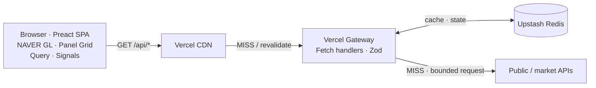
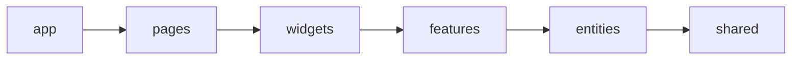
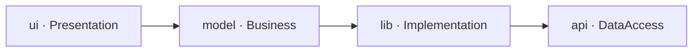
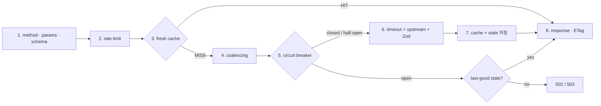
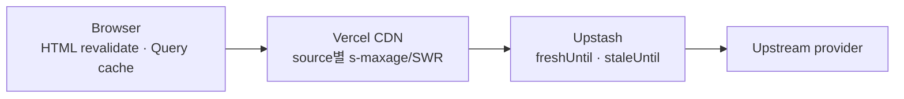
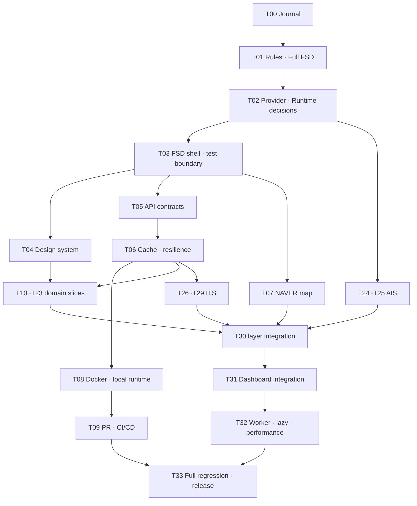

# Balance Keeper Development Journal

> Atlas Armillary Sphere — 대한민국과 주변 세계의 신호를 한눈에 읽는 실시간 대시보드

| 항목 | 값 |
| --- | --- |
| 문서 역할 | 제품 기획·기술 결정·Task·검증·개발일지의 단일 정본 |
| 실행 모드 | 승인모드 |
| 기준일 | 2026-07-20 (Asia/Seoul) |
| 새 저장소 기준선 | `f92ee53 chore: add project skills` |
| 레거시 참조 | `C:\Users\SR83\test\balance-keeper-legacy` |
| 현재 단계 | T01 승인 규칙과 Full FSD 정렬 — APPROVED |
| 다음 단계 | T01 프로젝트 규칙과 Full FSD 정렬 — PROPOSED |

---

## 1. 문서 통제와 승인 규칙

이 파일을 프로젝트의 유일한 개발 정본으로 사용한다. 결정, Task 상태, 구현 증거와 회귀 결과를 다른 계획 문서에 분산하지 않는다. 상세 설계가 커져 별도 산출물이 필요해지더라도 이 문서에서 링크하고 상태를 관리한다.

상태 흐름은 다음과 같다.

```text
PROPOSED → APPROVED → IN_PROGRESS → VERIFYING → PASS → ACCEPTED
                                  └────────────→ BLOCKED
```

- `PASS`는 자동·수동 검증이 끝났다는 뜻이다.
- `ACCEPTED`는 사용자가 결과를 승인했다는 뜻이다.
- 의존 Task는 선행 Task가 `ACCEPTED`가 된 뒤 시작한다.
- 범위가 달라지면 기존 승인을 확대 해석하지 않고 변경 범위를 다시 승인받는다.
- `BLOCKED`는 정보 부족, 명세 모순, 검증 실패 또는 알려진 회귀 위험이 있다는 뜻이다. 추측으로 진행하지 않는다.
- Subagent는 Task 내부 조사에만 사용한다. 메인 에이전트가 결과를 실제 코드·공식 문서로 재검증한 뒤 이 문서에 통합한다.
- 병렬 작업자가 이 파일을 동시에 편집하지 않는다. 문서 갱신은 메인 에이전트가 직렬화한다.
- 기능 구현, 커밋, 원격 푸시는 승인된 Task 범위 안에서만 수행한다.

### 고정 가드레일

모든 단계와 Task는 다음 질문에 답해야 한다.

| 확인 항목 | 통과 조건 |
| --- | --- |
| 범위가 명확한가 | 포함·제외 범위와 변경 파일 영역이 적혀 있다. |
| 판단 근거가 있는가 | 코드, 테스트, 공식 문서 또는 재현 결과가 있다. |
| 기존 동작과 모순되지 않는가 | 충돌이 없거나, 대체 결정과 마이그레이션이 승인됐다. |
| 문서가 쉽게 이해되는가 | 결정 이유, 트레이드오프와 용어가 설명돼 있다. |
| 회귀 영향과 검증 방법이 확인됐는가 | 정상·실패·경계값·기존 영향 경로를 검증한다. |

---

## 2. 개발을 시작한 이유

평소 국제 정치와 글로벌 흐름을 파악하고 여러 주체의 메시지와 프로파간다를 분석하는 일을 흥미롭게 느껴 뉴스 보는 것을 취미로 삼아 왔다. 가장 큰 불편은 정보가 여러 서비스와 형식으로 분산돼 있다는 점이었다.

날씨, 기후, 지진과 같은 지도 데이터까지 포함해 대한민국의 현 상황을 한눈에 바라볼 수 있는 대시보드를 만들어보자는 단순한 생각이 Balance Keeper의 출발점이다. 현재는 흥미로운 아이디어를 검증하는 MVP 수준이지만, 장기적으로는 누구나 한국의 현황을 쉽고 빠르게 파악할 수 있는 신뢰도 높은 대시보드로 발전시키고자 한다. `Balance Keeper`라는 이름도 이 발상지를 모티브로 정했다.

함께할 개발자를 찾으려 했지만 각자의 현업과 우선순위가 달랐다. 프론트엔드 개발을 주력으로 하면서도 다양한 영역에 도전해 온 경험과 AI 도구의 도움을 바탕으로, 제품 판단과 검증 책임은 직접 지고 프로젝트를 독립적으로 진행한다.

이 문서는 전문 교재가 아니라 개인 개발일지다. 완성된 결과만 보여주기보다 왜 결정했고, 어떤 가설이 틀렸으며, 무엇으로 검증했는지 남긴다. AI로 빠르게 구현했는지보다 결정 근거와 테스트, 회귀 관리가 재현 가능한지가 더 중요한 증거다.

---

## 3. Workflow 진행 현황

| 단계 | 상태 | 근거 |
| --- | --- | --- |
| 아이디어 | PASS | 제품 동기, 사용자 가치와 장기 비전이 명시됐다. |
| 스크리닝 | PASS | MVP 수용·보류·검증 필요 범위를 분리했다. |
| 기획 | PASS | 제품 범위, 기술 원칙과 비기능 목표를 정의했다. |
| 코드베이스 분석 | PASS | 새 저장소와 레거시의 파일·계약·테스트를 대조했다. |
| 문서 검토 | PASS | fence 28개, replacement character 0개, API A01~A24를 확인했다. |
| Task 분리 | PASS | T00~T33의 34개 ID와 의존성·완료 조건을 확인했다. |
| 구현 | APPROVED | T01의 저장소 규칙·skill 정렬 범위만 승인됐다. 제품 기능 구현은 아직 시작하지 않는다. |
| 회귀 검증 | NOT_STARTED | 구현 Task별 검증 후 누적한다. |

---

## 4. 아이디어 스크리닝

| 아이디어 | 판정 | 이유와 조건 |
| --- | --- | --- |
| 한국 실시간 공공신호 단일 화면 | ACCEPT | 분산된 정보를 한 좌표계와 공통 신선도 모델로 묶는 가치가 분명하다. |
| NAVER Maps GL 기반 한국 지도 | ACCEPT | 한국 지도 경험을 우선한다. 실제 SDK·과금·오버레이 한계는 Task에서 검증한다. |
| 소스별 갱신주기 폴링 | ACCEPT | 모든 데이터를 같은 주기로 조회하는 낭비를 피한다. |
| Vercel Functions + Upstash | ACCEPT | 상주 백엔드 없이 외부 API 보호·정규화·캐시를 제공하는 MVP에 적합하다. |
| Full FSD + 기능 내부 Waterfall | ACCEPT | 최신 사용자 명세가 기존 FSD-lite보다 우선한다. |
| OKLCH 기반 디자인 토큰 | ACCEPT | 밝은 영역 소실, 다크모드 대비와 지도 오버레이 색을 시스템으로 통제한다. |
| 자동 프로파간다 판정·출처 등급화 | DEFER | 방법론, 설명 가능성, 편향·명예훼손 위험을 먼저 정의해야 한다. MVP는 원문 출처와 시각·메타데이터 제공에 집중한다. |
| AIS 군함 실시간 추적 | NEEDS_EVIDENCE | 서버리스 WebSocket, 약관, 비용, 안전·정확도 문제를 feasibility Task에서 검증한다. |
| Docker를 Vercel의 동등한 운영 대체재로 사용 | DEFER | 우선 로컬·CI 재현성과 미래 백엔드 확장 경계로 사용한다. 자체 호스팅은 별도 결정이 필요하다. |
| 전면 반응형 최적화 | DEFER | MVP는 데스크톱 지도·그리드 경험을 우선한다. 작은 화면에서 기능이 깨지지 않는 최소 안전성은 유지한다. |

---

## 5. 제품 기획

### 5.1 한 문장 정의

Balance Keeper는 대한민국과 주변 지역의 공공·시장·재난·교통 신호를 한국 지도와 데이터 패널에 함께 보여주는 데스크톱 우선 실시간 상황판이다.

### 5.2 핵심 사용자 여정

1. 앱 셸과 마지막 정상 데이터가 먼저 보인다.
2. 사용자는 지도에서 현재 관심 레이어를 켜고 끈다.
3. 지도상의 사건을 선택해 상세 패널이나 CCTV 뷰어를 연다.
4. 각 패널에서 데이터 기준시각, 출처, 신선도와 오류 상태를 확인한다.
5. 일부 공급자가 실패해도 나머지 대시보드와 마지막 정상 데이터는 유지된다.

### 5.3 MVP 범위

- 단일 Preact SPA와 데스크톱 우선 전체 화면 대시보드
- NAVER Maps GL 베이스맵과 공공데이터 오버레이
- Vercel API Gateway를 통한 인증정보 보호, 정규화, 캐시
- Upstash 기반 공유 캐시·복원력 상태
- 소스별 TanStack Query 폴링과 Signals 기반 UI 상태
- 정상·로딩·빈 값·오류·stale 상태가 구분되는 패널
- 테스트 우선 구현과 승인 단위 개발일지

### 5.4 비범위

- 안전·투자·군사 판단을 대신하는 권위 있는 분석
- 모든 소스에 대한 초 단위 실시간성 보장
- 근거 없는 정치 성향·프로파간다 자동 판정
- 초기 MVP의 모바일 전용 정보 구조
- 첫 릴리스에서의 상주 백엔드 서버

---

## 6. 검증된 사실과 결정 등록부

### 6.1 2026-07-20 공식 문서 확인

| 항목 | 확인 결과 | 영향 | 출처 |
| --- | --- | --- | --- |
| NAVER Maps GL | GL 서브모듈은 WebGL 벡터맵을 제공한다. | NAVER GL을 베이스맵 후보로 유지한다. | [NAVER GL module](https://navermaps.github.io/maps.js.ncp/docs/module-gl.html) |
| NAVER Style Editor | `gl: true`와 `customStyleId`로 발행 스타일을 연결한다. 커스텀 스타일 사용 시 일부 기본 지도 유형·레이어를 쓸 수 없다. | 스타일 적용과 기능 손실을 함께 브라우저 검증한다. | [Style Editor 연동](https://navermaps.github.io/maps.js.ncp/docs/tutorial-2-Style-Editor.html) |
| Vercel 정적 파일 캐시 | 정적 파일은 배포 생명주기 동안 자동 CDN 캐시되고, 해시 파일은 변경되지 않으면 배포 간 유지될 수 있다. | 해시 자산은 장기 immutable, HTML과 API는 별도 정책을 쓴다. | [Vercel CDN Cache](https://vercel.com/docs/caching/cdn-cache) |
| Vercel Function 캐시 | Function 응답은 `s-maxage`, `stale-while-revalidate` 등으로 CDN 캐시한다. Vercel 프록시는 공유 캐시 지시자를 소비할 수 있다. | 브라우저·Vercel CDN 헤더를 구분한다. | [Cache-Control headers](https://vercel.com/docs/caching/cache-control-headers) |
| Upstash Redis | `@upstash/redis`는 HTTP 기반 connectionless client로 serverless 환경을 지원한다. | 공유 캐시와 분산 상태 후보로 유지한다. | [Connect with @upstash/redis](https://upstash.com/docs/redis/howto/connect-with-upstash-redis) |
| Codex GitHub Action | 현재 공식 예시는 `openai/codex-action@v1`, `OPENAI_API_KEY` secret, 별도 feedback job과 최소 권한을 사용한다. | CI Task에서 공식 보안 입력을 기준으로 구현한다. | [Codex GitHub Action](https://learn.chatgpt.com/docs/github-action) |

공공 API, OpenSky, AIS, Yahoo Finance, RSS와 CCTV 재전송 약관·쿼터는 아직 최신 공식 자료와 실키로 모두 확인하지 않았다. T02에서 별도 검증한다.

### 6.2 결정 등록부

| ID | 결정 | 상태 | 근거·재검토 조건 |
| --- | --- | --- | --- |
| D-001 | Node 24, TypeScript strict, Preact, Signals, TanStack Preact Query, Vite, Tailwind, Vitest, Biome를 사용한다. | ACCEPTED | 현재 scaffold와 최신 명세가 일치한다. |
| D-002 | 클라이언트 구조는 `app → pages → widgets → features → entities → shared` Full FSD를 사용한다. | ACCEPTED | 최신 사용자 명세가 기존 no-pages skill보다 우선한다. |
| D-003 | `pages/dashboard`는 즉시 도입하되 실제 두 번째 URL이 생기기 전까지 router dependency는 추가하지 않는다. | PROPOSED | Page 조합 계층과 불필요한 router 도입을 분리한다. |
| D-004 | 기능 내부 Waterfall은 `ui(Presentation)`, `model(Business)`, `lib(Implementation)`, `api(DataAccess)`로 매핑하며 필요한 segment만 만든다. | PROPOSED | FSD layer와 Waterfall 책임을 1:1 대응시키지 않는다. |
| D-005 | NAVER Maps GL을 주 베이스맵으로 사용하고 지도 SDK는 동적 로딩한다. | ACCEPTED | 한국 지도 정확도와 사용 경험을 우선한다. |
| D-006 | MapLibre/deck.gl은 초기 번들에 넣지 않는다. NAVER 오버레이 예산으로 충족하지 못하는 측정된 고밀도 요구가 생길 때 별도 승인한다. | PROPOSED | 이중 지도 엔진과 2MB급 초기 번들 회귀를 피한다. |
| D-007 | TanStack Query는 원격 서버 상태, Signals는 파생·일시적 UI 상태만 소유한다. | ACCEPTED | 책임 중복을 방지한다. |
| D-008 | Vercel은 운영 배포 정본, Docker는 로컬·CI 재현성과 미래 백엔드 확장 경계로 시작한다. | PROPOSED | Vercel Functions와 Docker API 실행을 억지로 동일시하지 않는다. |
| D-009 | 서버 코어는 Web `Request → Response` handler로 작성하고 Vercel·로컬 실행기는 얇은 adapter로 둔다. | PROPOSED | 런타임별 비즈니스 로직 복제를 막는다. |
| D-010 | 정적 자산, HTML, API 데이터는 서로 다른 캐시 정책을 쓴다. API에 1년 TTL을 일괄 적용하지 않는다. | ACCEPTED | 데이터 신선도와 배포 무효화를 분리한다. |
| D-011 | AI 개발 workflow는 `brainstorm → plan → RED/GREEN/REFACTOR → verify → review`로 고정한다. | ACCEPTED | 테스트가 먼저 실패하는 것을 확인한다. |
| D-012 | Codex 리뷰와 자동 품질 게이트는 ready-for-review PR에서 독립 실행하고, 초기에는 Codex 결과를 참고 의견으로 둔다. | PROPOSED | 테스트 실패와 별개인 구조 결함도 찾되 비용은 Draft skip으로 제어한다. |

---

## 7. 코드베이스 분석

### 7.1 새 저장소

새 저장소는 기반 설정만 존재한다.

- Preact 애플리케이션과 Query provider
- Tailwind·Biome·Vitest·TypeScript·Vite 설정
- `npm run validate` 품질 게이트
- Vercel SPA rewrite
- 프로젝트 skills와 `AGENTS.md`

현재 없는 것:

- `pages`, `widgets`, `features`, `entities` 구현
- `api/`와 `src/server/`
- NAVER 지도 loader와 map widget
- Upstash dependency와 cache adapter
- Dockerfile·Compose
- 디자인 토큰과 theme state
- Web Worker
- 제품 API와 패널

따라서 새 저장소의 API 구현 진행률은 `0/24`다.

### 7.2 레거시

레거시에는 정확히 12개의 route 파일과 다수의 fixture 테스트가 있다. 그러나 파일 존재를 제품 완료로 보지 않는다.

재사용 가치가 높은 개념:

- `AppError`와 정규화된 성공·오류 envelope
- route별 TTL과 cache key
- Upstash adapter, last-good stale, process-local singleflight
- source별 Zod 정규화와 fixture 기반 테스트
- TanStack query key와 공통 Panel 상태
- NAVER GL SDK singleton, 첫 로드 처리, listener·overlay cleanup
- CCTV host allowlist와 HLS 상대경로 rewrite 테스트

NAVER 지도 구현의 지정 참고 파일:

- `C:\Users\SR83\test\balance-keeper-legacy\src\widgets\NaverStyleMapLab\NaverStyleMapLab.tsx`
- 사용자가 다크테마 NAVER Maps GL 시뮬레이션을 지도 작업의 참고 구현으로 승인했다.
- `submodules=gl` SDK loader, `gl: true`, `customStyleId`, 첫 동적 로드 처리와 listener·overlay cleanup 동작을 T07의 참고 근거로 삼는다.
- 이 파일은 참고 구현이지 그대로 복사할 production 정본은 아니다. 합성 샘플 데이터, 문자열 기반 HTML marker, 정적 import와 단일 대형 component 구조는 새 경계에 맞게 재설계한다.

재설계가 필요한 부분:

- ETag가 `meta.cached`까지 포함해 같은 데이터에서도 바뀔 수 있다.
- singleflight가 process-local `Map`이라 Vercel 인스턴스 간 중복 호출을 막지 못한다.
- rate limit, circuit breaker, upstream timeout과 구조화된 관측성이 없다.
- stale hit와 fresh cache hit를 메타에서 구분하지 않는다.
- Zod schema와 TypeScript 타입이 수동 중복된다.
- 기본 제품 지도는 MapLibre이고 NAVER GL은 실험실 분기다.
- NAVER 날씨·도로·지진 표시 상당수가 합성 샘플이다.
- 지도와 HLS가 정적 import돼 초기 번들이 약 2MB였다는 QA 기록이 있다.
- Full FSD의 `pages`, slice public API와 import boundary가 없다.
- 앱 소유 Web Worker와 Docker 설정이 없다.

복사하지 않을 항목:

- `deck.gl` umbrella dependency와 기본 OSM MapView
- 합성 샘플을 production 데이터처럼 사용하는 코드
- pathname 문자열 기반 수동 router
- eager map·HLS import
- 최신성·라이선스가 확인되지 않은 지리 데이터

### 7.3 현재 명세와 저장소 규칙의 충돌

| 충돌 | 현재 상태 | 필요한 조치 |
| --- | --- | --- |
| Full FSD vs FSD-lite | `AGENTS.md`와 skill이 `pages`를 금지한다. | T01에서 최신 규칙으로 교체한다. |
| NAVER GL vs deck.gl 정본 | FSD skill은 deck.gl MapView를 예시로 둔다. | T01에서 skill을 정정하고 T07에서 NAVER adapter를 구현한다. |
| 승인모드 | Task 승인·단일 일지 규칙이 저장소에 없다. | T01에서 `planning-agent`와 AGENTS 우선규칙을 추가한다. |
| Vercel + Docker | Vercel 표지만 있고 Docker 실행 역할이 없다. | T02에서 topology를 승인하고 T08에서 구현한다. |
| 디자인 토큰 | skill은 semantic token을 요구하지만 App은 raw zinc/cyan이다. | T04에서 token source를 만든다. |
| 테스트 런타임 | 모든 Vitest가 jsdom이다. | T03/T05에서 Node와 jsdom project를 분리한다. |

판정: 기반 도구 건강성은 `PASS`지만 최신 명세에 맞춘 기능 구현 착수는 `BLOCKED`다. T01 승인이 해제 조건이다.

---

## 8. 목표 아키텍처

### 8.1 시스템 컨텍스트



핵심 축은 브라우저 단일 페이지와 cache-first gateway다. 지도는 장식이 아니라 데이터의 좌표계이자 주 인터페이스다.

### 8.2 Full FSD



- `app`: 진입점, provider, 전역 error boundary, theme 초기화, 전역 스타일
- `pages`: 완성 화면의 순수 조합. 초기에는 `pages/dashboard` 하나
- `widgets`: Map, PanelGrid, AlertRail처럼 독립적인 화면 영역과 4상태 UI
- `features`: layer toggle, CCTV live, theme switch처럼 사용자 행동
- `entities`: weather, air, earthquake, market 등 도메인 타입·기본 규칙·표현
- `shared`: 디자인 시스템, HTTP client, 공통 config, logger와 비도메인 유틸
- `api/`와 서버 코어는 클라이언트 import 방향과 분리하되 transport contract만 공유한다.

규칙:

- 위쪽 layer를 아래쪽에서 import하지 않는다.
- sibling slice끼리 직접 import하지 않는다.
- 다른 layer는 slice의 `index.ts` public API만 사용한다.
- 여러 곳에서 쓴다는 이유만으로 도메인 코드를 `shared`로 옮기지 않는다.
- Page는 원격·UI 상태를 소유하지 않는다.

### 8.3 기능 내부 Waterfall



이 도식은 호출 방향을 기계적으로 강제하기 위한 4단 폴더 의무가 아니다. 하나의 slice 안에서 책임을 설명하는 기준이며, 불필요한 segment는 만들지 않는다.

예시:

```text
src/entities/weather/
  api/
    contract.ts
    queries.ts
  model/
    types.ts
    freshness.ts
  ui/
    WeatherPanel.tsx
  index.ts
```

---

## 9. 대시보드 성능 원칙

실시간은 모든 데이터를 1초마다 폴링하거나 WebSocket으로 받는다는 뜻이 아니다. 공급자의 실제 갱신주기, 호출 쿼터와 사용자가 보는 화면에 맞춰 신선도를 관리하는 일이다.

- 앱 셸을 먼저 렌더링하고 지도, HLS, 대형 지리 데이터와 차트를 lazy load한다.
- 수천 개 포인트를 DOM/SVG로 직접 만들지 않는다.
- NAVER overlay는 viewport filter, clustering과 집계로 예산을 관리한다.
- 대용량 GeoJSON/XML 파싱, 공간 인덱스와 집계처럼 순수 계산만 Web Worker로 옮긴다.
- NAVER SDK 객체와 DOM overlay 조작은 메인 스레드에 남긴다.
- Canvas/WebGL이 필요한 밀도는 측정 뒤 선택한다.
- 보이지 않는 패널은 query `enabled` 또는 near-viewport 정책으로 호출을 늦춘다.
- 지도와 CCTV를 켜지 않은 사용자가 해당 무거운 번들 비용을 내지 않게 한다.

### 초기 성능 예산

| 항목 | 초기 목표 | 비고 |
| --- | --- | --- |
| 앱 셸 초기 JS | gzip 100KB 이하 | 지도·HLS 제외 |
| 지도 SDK | 사용자 화면 진입 후 동적 로드 | 실패 fallback 포함 |
| HLS | CCTV Live 선택 후 동적 import | 동시에 한 스트림만 |
| 메인 스레드 long task | 50ms 이상 작업을 계측 | Worker 후보 |
| 패널 요청 | source별 dedup, visibility 적용 | 전체 동일 폴링 금지 |
| 지도 overlay | 계측 가능한 상한 설정 | T07/T30에서 실제 기기 측정 |

---

## 10. Gateway 설계

### 10.1 처리 흐름



### 10.2 계약

성공 envelope:

```ts
type SuccessEnvelope<T> = {
  data: T;
  meta: {
    requestId: string;
    fetchedAt: number;
    cache: 'MISS' | 'HIT' | 'STALE' | 'REVALIDATED';
    source: string;
  };
};
```

오류 envelope:

```ts
type ErrorEnvelope = {
  error: {
    code: string;
    fields?: Record<string, string[]>;
    requestId: string;
  };
};
```

- 스키마 위반: `400` 또는 의미상 유효성 오류 `422`
- 누락·권한: `401`, `403`
- route·parameter: `404`, `400`
- upstream 장애: `502`
- breaker open 또는 일시 불가: stale이 없으면 `503`
- 사용자 응답에는 secret, upstream 원문 오류나 stack을 넣지 않는다.

### 10.3 캐시 키

```text
v1:<route>:<sorted-query-hash>:<lang?>:<region?>
```

- query key와 value를 trim·case·허용값으로 정규화한 뒤 정렬한다.
- bbox는 허용 범위와 정밀도를 제한해 key cardinality를 통제한다.
- 정상 `2xx empty`만 짧은 negative cache 후보로 삼는다.
- timeout, `4xx/5xx`와 schema 실패는 negative cache로 저장하지 않는다.

### 10.4 복원력

- process-local promise map은 한 인스턴스 안의 중복만 합친다.
- 전체 singleflight가 필요하면 Upstash `SET NX EX` 계열의 짧은 분산 lock과 stale fallback을 별도 구현한다.
- breaker 상태, rate counter와 lock은 원자성·TTL을 fixture 및 concurrency test로 검증한다.
- 모든 upstream fetch에 `AbortSignal.timeout` 또는 동등한 명시적 timeout을 둔다.
- structured log에는 route, duration, cache status, upstream status, requestId를 기록한다.
- key, token, raw Authorization과 민감 query는 로그에서 제거한다.

---

## 11. 캐시와 폴링 전략

### 11.1 3계층



정적 자산과 데이터 API를 구분한다.

| 대상 | 기본 방향 |
| --- | --- |
| 해시 JS/CSS/font | `max-age=31536000, immutable` |
| `index.html` | `max-age=0, must-revalidate` 또는 배포 무효화가 보장된 짧은 CDN 정책 |
| 공개 API 응답 | browser `max-age=0`, provider별 `s-maxage`와 SWR |
| 민감·사용자별 응답 | `private, no-store` |
| Upstash | fresh와 last-good stale의 만료 시점을 분리 |

### 11.2 초기 polling profile

아래 값은 구현값이 아니라 T02에서 쿼터·실제 발표주기를 확인하기 위한 초기 가설이다.

| Source | Upstash fresh | CDN | Client refetch | 메모 |
| --- | ---: | ---: | ---: | --- |
| 재난문자 | 30~60초 | 15~30초 | 30~60초 | 이벤트 신선도 우선 |
| 지진 | 60~120초 | 30~60초 | 60초 | KMA·USGS dedup |
| 군용기 | 30~60초 | 15~30초 | 30~60초 | 쿼터와 정확도 고지 필요 |
| CCTV 목록 | 5~10분 | 2~5분 | viewport 변경 시 | bbox 정규화 |
| CCTV 정지영상 | 2~5초 | 매우 짧게 | viewer 활성 시 3초 | 실 URL 제공 여부 재검증 |
| CCTV HLS | manifest·segment별 | 매우 짧게 | on demand | 동시 한 스트림 |
| 초단기 기상 | 10~15분 | 5~10분 | 10분 | KST 발표시각 기준 |
| 대기질 | 30~60분 | 15~30분 | 30분 | 측정시각 표시 |
| 뉴스 | 5~10분 | 2~5분 | 5분 | 개별 feed 부분 실패 허용 |
| 시장 | 1~5분 | 30~120초 | 장중만 | 비공식 endpoint 대안 필요 |
| 거시 | 6~24시간 | 1~6시간 | 6시간 | 발표일·단위 표시 |

탭이 숨겨졌거나 widget이 viewport에서 멀어지면 긴급 데이터 외의 polling을 늦춘다.

---

## 12. 디자인 시스템 전략

밝은 회색과 흰색의 미세한 차이는 VDI 손실 압축, 낮은 명암비 디스플레이와 잘못된 감마에서 쉽게 사라진다. 중요한 경계를 색상 차이 하나에만 맡기지 않는다.

### 12.1 토큰 계층

```text
primitive OKLCH
  → semantic color token
    → component token
      → Tailwind utility / NAVER overlay style
```

- primitive: 명도·채도·색상 팔레트
- semantic: `surface`, `surface-raised`, `text`, `text-muted`, `border`, `accent`, `danger`, `warning`, `success`
- component: Panel, Button, Field, Badge, Map overlay
- 라이트와 다크 팔레트는 단순 반전하지 않고 별도로 설계한다.
- 노란색은 낮은 명도에서 갈색으로 보이는 특성을 감안해 warning 토큰을 별도 보정한다.
- 제품 코드에서 raw hex, raw zinc/cyan utility를 직접 사용하지 않는다.

### 12.2 접근성 하한

- 일반 텍스트는 배경과 최소 `4.5:1`
- 큰 텍스트와 비텍스트 UI 경계는 최소 `3:1`
- focus ring, 아이콘 형태, 선·패턴 등 색 외 단서를 함께 제공
- 키보드로 layer toggle, 패널과 dialog를 조작
- `prefers-reduced-motion`에서 불필요한 지도·패널 애니메이션 감소
- loading, error, empty, stale, success를 문구와 의미 구조로 구분
- MVP 시각 기준은 데스크톱이지만 좁은 화면에서 가려진 조작이나 수평 overflow가 생기지 않게 한다.

---

## 13. API 구현 장부

`레거시 상태`는 참조 프로젝트의 증거이며 새 저장소 완료율에 포함하지 않는다.

| ID | 기능 | 레거시 증거 | 새 저장소 | 검증·Gap | Task |
| --- | --- | --- | --- | --- | --- |
| A01 | `/api/weather` 초단기실황 | PARTIAL | NOT_STARTED | KMA `getUltraSrtNcst`만, KST base time과 null 필드 재설계 | T10 |
| A02 | 기상 단기·시간별 예보 | MISSING | NOT_STARTED | endpoint·발표 경계 검증 필요 | T22 |
| A03 | 기상특보 | MISSING | NOT_STARTED | 발효·해제·지역 geometry 검증 필요 | T23 |
| A04 | `/api/air` PM10/PM2.5 | PARTIAL | NOT_STARTED | 지역 코드, 좌표와 등급 기준 보강 | T11 |
| A05 | `/api/earthquake` KMA+USGS | PARTIAL | NOT_STARTED | 레거시는 USGS만 사용. KMA 통합·dedup 신규 구현 | T12 |
| A06 | `/api/macro` | PARTIAL | NOT_STARTED | ECOS 3개 현재값, 실키·통계코드·시계열 검증 필요 | T13 |
| A07 | `/api/markets` | MVP | NOT_STARTED | Yahoo quote/chart fallback은 있으나 약관·차단 대안 필요 | T14 |
| A08 | `/api/news` | PARTIAL | NOT_STARTED | RSS 6개가 `Promise.all`이라 한 feed 실패 시 전체 실패 | T15 |
| A09 | `/api/disaster` | PARTIAL | NOT_STARTED | 목록만 존재, 신규 판정·지역·배너·지도 미연결 | T16 |
| A10 | `/api/neighbor` | PARTIAL | NOT_STARTED | 시장+USGS 요약뿐이며 US weather/news 없음 | T17 |
| A11 | `/api/military` 군용기 | PARTIAL | NOT_STARTED | callsign prefix 기반 추정, 오탐·쿼터·bbox 제한 필요 | T18 |
| A12 | AIS 군함 | MISSING | NOT_STARTED | 서버리스·약관·비용 feasibility 선행 | T24~T25 |
| A13 | `/api/cctv/list` | MVP | NOT_STARTED | ITS bbox와 URL 계약 재검증 | T19 |
| A14 | `/api/cctv/image` | BROKEN_FLOW | NOT_STARTED | route는 있지만 레거시 list가 `imageUrl: null`을 생성 | T20 |
| A15 | `/api/cctv/stream` | PARTIAL | NOT_STARTED | HLS key/map/fMP4, redirect 최종 host와 비용 검증 | T21 |
| A16 | ITS 교통소통정보 | MISSING | NOT_STARTED | 공통 도로 segment 계약 필요 | T26~T27 |
| A17 | ITS 돌발상황정보 | MISSING | NOT_STARTED | 사건 severity·유효기간 필요 | T26~T28 |
| A18 | ITS 교통예측정보 | MISSING | NOT_STARTED | 예측 시각·구간 모델 필요 | T26~T27 |
| A19 | ITS 차량검지정보 | MISSING | NOT_STARTED | 집계 단위·빈 값 검증 필요 | T26~T27 |
| A20 | ITS 도로전광표지 VMS | MISSING | NOT_STARTED | 메시지 sanitize·좌표 필요 | T26~T29 |
| A21 | ITS 주의운전구간 | MISSING | NOT_STARTED | 유형·geometry 계약 필요 | T26~T29 |
| A22 | ITS 가변형 속도제한 VSL | MISSING | NOT_STARTED | 속도 단위·유효기간 필요 | T26~T29 |
| A23 | ITS 위험물질 운송차량 사고 | MISSING | NOT_STARTED | 민감도·정밀도·보존기간 검토 | T26~T28 |
| A24 | ITS 재난상황정보 | MISSING | NOT_STARTED | 재난문자와 중복·우선순위 정의 | T26~T28 |

새 저장소 진행률: `0/24`. 레거시 route 파일 수: `12`. 이 둘을 같은 “구현”으로 표시하지 않는다.

---

## 14. 지도·미디어 전략

### 14.1 NAVER Maps GL

- T07은 레거시 `src/widgets/NaverStyleMapLab/NaverStyleMapLab.tsx`의 다크 GL 시뮬레이션을 시각·수명주기 참고 구현으로 사용한다.
- SDK loader는 한 번만 script를 만들고 동일 promise를 공유한다.
- key·style ID 누락, 인증 실패, timeout과 첫 GL 초기화 실패를 별도 상태로 표시한다.
- map instance, listener, overlay와 timeout을 unmount에서 모두 정리한다.
- Custom Style 사용 시 사용할 수 없는 기본 layer를 수용기준에 반영한다.
- overlay 입력에 upstream 문자열을 HTML로 직접 삽입하지 않는다.
- CCTV, 지진, 재난과 ITS는 공통 layer registry를 통해 켜고 끈다.
- viewport bbox는 precision과 한국 범위로 정규화한다.
- 지도 비활성 layer의 원격 query도 비활성화한다.

### 14.2 고밀도 시각화

NAVER overlay 성능을 실제 기기에서 먼저 측정한다. clustering·aggregation·Canvas overlay로 해결되지 않고 제품 요구가 확인된 경우에만 MapLibre/deck.gl 또는 별도 WebGL view를 승인한다.

### 14.3 CCTV

- 목록 응답의 media URL은 allowlist와 protocol로 검증한다.
- redirect 후 최종 URL도 다시 검증한다.
- 정지영상이 실제 제공될 때만 3초 갱신 UI를 노출한다.
- Live를 누를 때 `hls.js`를 동적 import한다.
- HLS manifest parser 범위, encryption key, init segment와 byte range를 fixture로 검증한다.
- 한 사용자는 동시에 한 stream만 재생한다.
- 실패 시 마지막 정지영상 또는 명확한 unavailable 상태를 보여준다.

---

## 15. 개발·CI/CD 전략

### 15.1 개발 과정

```text
brainstorm → plan → RED → GREEN → REFACTOR → verify → review
```

- RED: 요구 행동을 설명하는 가장 작은 테스트를 작성하고 예상한 이유로 실패하는지 확인한다.
- GREEN: 테스트를 통과시키는 최소 구현을 한다.
- REFACTOR: 테스트가 녹색인 상태에서 구조를 정리한다.
- verify: 정상·실패·경계값과 영향받는 기존 기능을 검증한다.
- review: 결함, 가독성, 예측 가능성, 응집도와 결합도를 검토한다.

### 15.2 브랜치와 Worktree

- 기능 브랜치: `feature/*`
- 통합 대상: `development`
- 제품 릴리스: `main`
- 하나의 PR에는 하나의 변경 목적만 둔다.
- Worktree를 제거하기 전 미커밋 변경과 untracked 파일을 확인한다.

예시:

```powershell
git worktree add -b feature/my-feature "C:\Users\SR83\test\balance-keeper-my-feature" development
code --reuse-window --add "C:\Users\SR83\test\balance-keeper-my-feature"
git worktree remove "C:\Users\SR83\test\balance-keeper-my-feature"
```

### 15.3 PR 기록

| 항목 | 필수 내용 |
| --- | --- |
| 변경 목적 | 해결하는 사용자·기술 문제 |
| 주요 변경 | 사용자 동작과 구조 변화 |
| 검증 결과 | 실행 명령, 테스트와 사용자 여정 |
| 회귀 위험 | 영향을 받을 수 있는 기존 영역 |
| 시각 자료 | UI 변경 전후 스크린샷 또는 영상 |
| 문서 증거 | 이 파일의 Task ID와 상태 |

### 15.4 자동 검토

| 역할 | 확인 대상 | 초기 병합 정책 |
| --- | --- | --- |
| Quality gate | Biome, type, unit/contract/component test, build | 실패 시 차단 |
| Codex review | 재현 가능한 결함, 구조·클린코드·회귀 위험 | 참고 의견 |
| 사람 리뷰 | 요구사항, UX, 정책, 최종 승인 | 필수 |

Codex Action 구현 시:

- `openai/codex-action@v1`과 repository secret `OPENAI_API_KEY`를 사용한다.
- checkout credential을 남기지 않고 최소 `contents: read` 권한으로 review job을 실행한다.
- `sandbox: read-only`와 기본 `drop-sudo`를 우선한다.
- fork PR과 신뢰하지 않은 사용자의 secret job 실행을 차단한다.
- PR 본문·댓글·숨은 HTML을 그대로 신뢰해 prompt로 넣지 않는다.
- feedback job만 `pull-requests: write` 또는 `issues: write`를 가진다.
- 고정 HTML marker를 사용해 기존 리뷰 댓글을 갱신한다.
- 결과는 `PASS`, `CHANGES_REQUESTED`, `BLOCKED`로 통일하되 사람만 merge·`ACCEPTED`를 결정한다.

---

## 16. Task 의존성

승인모드에서는 아래 그래프가 병렬 가능성을 보여주더라도 Task를 하나씩 승인받아 진행한다.



---

## 17. 승인 단위 Task 목록

### 17.1 정본과 공통 기반

| Task | 해야 할 일과 이유 | 변경 범위 | 완료 조건 | 검증 | 의존성 |
| --- | --- | --- | --- | --- | --- |
| T00 | 단일 개발 정본과 실제 기준선을 확립한다. | `docs/PROJECT-JOURNAL.md` | 비전, 결정, API 24개, Task와 상태 규칙이 누락 없이 존재 | Markdown 구조·API 수·저장소 대조 | 없음 |
| T01 | 승인모드와 Full FSD를 저장소 규칙에 반영해 현재 BLOCKED를 해소한다. | `AGENTS.md`, planning/full-FSD skills, lock, 필요한 README 안내 | `pages` 허용, NAVER 정본, 승인·PASS/BLOCKED 규칙이 일관됨 | skill frontmatter, 참조 경로, diff review, `npm run validate` | T00 ACCEPTED |
| T02 | 변동 가능한 provider 사실과 Vercel·Docker topology를 동결한다. | 이 문서 결정·검증 장부, 최소 probe | 공식 출처·GO/NO-GO·fallback·secret 요구가 기록됨 | 공식 문서, gated live probe, 비밀값 미출력 | T01 |
| T03 | Full FSD shell과 import/test runtime 경계를 만든다. | `src/app`, `pages/dashboard`, boundary test, Vitest projects | App이 DashboardPage만 조합하고 금지 import가 검출됨 | RED/GREEN architecture test, node/jsdom test | T02 |
| T04 | OKLCH semantic token, theme와 공통 Panel 5상태를 구축한다. | shared UI/tokens, app theme init, shell | raw color 없이 light/dark·focus·loading/error/empty/stale/success 제공 | contrast, keyboard, component test, visual QA | T03 |
| T05 | transport schema, envelope, error, API client와 query profile을 통일한다. | shared contracts, server core, test fixtures | Zod에서 타입을 추론하고 성공·오류 계약이 고정됨 | node contract/client/query test | T03 |
| T06 | Upstash cache, stable ETag, stale, timeout, rate-limit, coalescing, breaker를 구현한다. | server gateway/cache/logging | HIT/MISS/STALE/304와 장애 차단이 결정적으로 동작 | fake clock, concurrency, failure injection, memory adapter | T05 |
| T07 | 레거시 다크 GL 시뮬레이션을 참고해 NAVER GL lazy loader와 기본 map widget을 만든다. | map entity/widget, SDK adapter, env contract | key/style/timeout/failure/cleanup과 기본 한국 view가 동작 | SDK mock, 레거시 수명주기 동작 대조, browser smoke, bundle graph | T02,T03 |
| T08 | 재현 가능한 Docker·로컬 API 실행을 만든다. | Dockerfile, compose, adapters, scripts | 새 환경에서 한 명령으로 앱·API 실행 및 health 확인 | clean image build, healthcheck, Windows smoke | T02,T06 |
| T09 | development PR, template, quality gate와 Codex review를 정립한다. | GitHub workflow, prompt, PR template, 문서 | Draft skip, 최소 권한, 중복 없는 feedback과 사람 승인 흐름 | action lint/dry-run 또는 시험 PR | T08 |

### 17.2 레거시 12개 수직 재구현

각 slice는 `fixture → Zod → normalize → gateway route → query → UI/지도 → gated live smoke`를 완료해야 `PASS`다.

| Task | 기능 | 완료 조건 | 핵심 검증 | 의존성 |
| --- | --- | --- | --- | --- |
| T10 | KMA 초단기실황 | KST 발표시각·격자·신선도와 5상태 Panel | 시간 경계, 누락 category, live smoke | T04,T06 |
| T11 | AirKorea 대기질 | 지역 정규화·PM 등급·측정소 좌표 | `seoul/서울`, empty, 등급 경계 | T04,T06 |
| T12 | KMA+USGS 지진 | 두 source 통합·dedup·bbox·정렬 | 동일 사건, source 부분 실패, live | T04,T06 |
| T13 | ECOS 거시 | 단위·발표일·시계열 계약 | 실키, 통계코드, 부분 누락 | T04,T06 |
| T14 | 시장 지수 | 휴장·지연·fallback 표시 | quote 차단, chart fallback, 휴장 | T04,T06 |
| T15 | 뉴스 | 한 feed 실패 시 나머지 성공, sanitize·dedup | malformed XML, timeout, SSRF | T04,T06 |
| T16 | 재난문자 | 지역·신규·severity·banner 계약 | cursor, duplicate, stale, live | T04,T06 |
| T17 | 주변국 비교 | 중복 upstream 호출 없는 조합 모델 | partial failure, country mapping | T10,T12,T14,T15 |
| T18 | OpenSky 군용기 | bbox 제한, 추정 표시, 정확도 고지 | auth, quota, callsign 오탐 | T04,T06 |
| T19 | CCTV 목록 | bbox·좌표·media allowlist 계약 | 악성 URL, 빈 목록, live | T04,T06,T07 |
| T20 | CCTV 정지영상 | 실제 지원 확인 후 안전한 proxy·fallback | content type, redirect, timeout, SSRF | T19 |
| T21 | CCTV HLS | manifest/segment 안전 proxy, 1-stream UI | key/map/range/fMP4, browser, 대역폭 | T19,T20 |

### 17.3 미구현 12개

| Task | 기능 | 완료 조건 | 핵심 검증 | 의존성 |
| --- | --- | --- | --- | --- |
| T22 | KMA 단기·시간별 예보 | 발표·예보시각 timeline 정규화 | KST 자정, 누락 slot, live | T10 |
| T23 | KMA 기상특보 | 발효·해제·지역 geometry와 배너 | active/cancel/duplicate | T10 |
| T24 | AIS feasibility | 약관·비용·서버리스 snapshot의 GO/NO-GO | controlled probe, 안전·정확도 검토 | T02,T06 |
| T25 | AIS 군함 | T24가 GO일 때만 vessel slice와 feature flag | fixture, delayed data, live | T24 PASS |
| T26 | ITS 9종 계약 검증 | endpoint·키·쿼터·schema matrix 승인 | 각 endpoint gated probe | T02,T06 |
| T27 | ITS 흐름군 | 교통소통·예측·차량검지 공통 segment 모델 | 부분 실패, TTL, 단위 | T26 |
| T28 | ITS 사건군 | 돌발·재난·위험물 event 모델 | severity, 만료, malformed event | T26 |
| T29 | ITS 안내군 | VMS·주의운전·VSL 모델 | sanitize, 속도 단위, geometry | T26 |

### 17.4 통합·회귀

| Task | 해야 할 일과 이유 | 완료 조건 | 검증 | 의존성 |
| --- | --- | --- | --- | --- |
| T30 | 모든 위치 데이터를 layer registry로 통합한다. | toggle, bbox, tooltip/click, CCTV viewer와 overlay budget | desktop interaction, cleanup, partial data | T07,T10~T29 |
| T31 | DashboardPage와 PanelGrid를 실제 한 화면 경험으로 완성한다. | freshness, alert, disabled·partial failure 상태가 일관됨 | keyboard, visual, small-screen safety, browser | T30 |
| T32 | 측정된 병목만 Worker·Canvas·lazy loading으로 최적화한다. | 성능 예산과 request budget 충족 | bundle, long task, memory, request count | T31 |
| T33 | 전체 회귀와 Vercel preview·rollback 증거를 완성한다. | offline suite, live smoke, 보안·접근성·성능과 운영 제한 기록 | `npm run validate`, E2E, provider smoke, preview | T09,T32 |

---

## 18. Task 카드

### T00 — 단일 개발 정본과 기준선

- 상태: ACCEPTED
- 승인: 실행 모드 선택으로 착수 승인, Tailwind source 제외 amendment 승인, 결과 사용자 승인
- 목적: 분산된 요구와 레거시 상태를 새 저장소의 하나의 실행 가능한 계획으로 바꾼다.
- 포함:
  - 개인 개발 배경과 제품 비전
  - 기술·성능·Gateway·Cache·FSD·디자인·CI 원칙
  - 현재/레거시 대조
  - API 24개 장부
  - T00~T33 Task, 승인과 회귀 규칙
- 제외:
  - 제품 코드, 설정과 dependency 변경
  - provider secret 사용
  - 외부 배포와 Git push
- 완료 조건:
  - 한 Markdown 파일이 정본으로 선언된다.
  - API 장부가 정확히 24개다.
  - 새 저장소 상태와 레거시 상태가 분리된다.
  - 다음 Task의 포함·제외·완료·검증이 명확하다.
  - 개발 문서가 production Tailwind utility 생성에 영향을 주지 않는다.
- 검증:
  - Markdown heading·fence 점검
  - API ID `A01~A24` 연속성
  - 현재 Git diff가 문서 하나로 한정되는지 확인
  - 현재 `npm run validate`
- 회귀 영향: 제품 런타임 변경 없음
- 검증 결과:
  - Markdown fence 28개가 모두 닫혀 있음
  - API ID A01~A24 연속, Task ID T00~T33 연속
  - replacement character 0개, `git diff --check` 통과
  - `npm run validate` 통과: Biome, Vitest 1/1, TypeScript, Vite build
  - RED: Tailwind 자동 source detection이 Markdown 단어를 utility로 생성해 CSS가 6.85KB(gzip 2.29KB)에서 7.01KB(gzip 2.33KB)로 증가
  - GREEN: 공식 `@source not "../../docs"` 적용 후 기존 `index-Fi7IRZjo.css`, 6.85KB(gzip 2.29KB)로 복귀
  - 전체 `npm run validate` 재통과
- 결과: `ACCEPTED`

### T01 — 승인 규칙과 Full FSD 정렬

- 상태: APPROVED
- 목적: 현재 저장소 규칙이 최신 명세와 충돌해 기능 구현이 BLOCKED인 상태를 해소한다.
- 포함:
  - 제공된 Planning Agent를 프로젝트 skill로 정리
  - `AGENTS.md`에 승인모드, 단일 일지, PASS/BLOCKED, TDD와 검증 우선순위 명시
  - `fsd-lite-architecture`를 Full FSD 규칙으로 교체·이름 정리
  - `app → pages → widgets → features → entities → shared` 방향과 slice public API 정의
  - NAVER Maps GL 정본, Preact-native Query와 lazy loading 원칙 반영
  - skill 참조·provenance와 `skills-lock.json` 정합성 수정
  - README에 개발일지와 승인 workflow 링크
- 제외:
  - `src` 구조 이동
  - router, 지도, Docker와 API 구현
  - dependency 설치
  - 외부 서비스 호출·배포
- 주요 결정:
  - `pages/dashboard`는 사용하되 두 번째 URL 전까지 router dependency는 넣지 않는다.
  - 외부 vendored TDD skill 원문은 수정하지 않고 `AGENTS.md`에서 승인 우선순위를 명확히 한다.
- 완료 조건:
  - 저장소의 모든 지속 규칙이 최신 명세와 모순되지 않는다.
  - skill frontmatter와 참조 경로가 유효하다.
  - 다음 코드 Task가 파일 위치와 import 방향을 판단할 수 있다.
- 검증:
  - skill·AGENTS 참조 경로 검사
  - 금지어와 stale `no pages`·deck.gl 정본 검색
  - `npm run validate`
  - diff 기반 독립 리뷰
- 회귀 영향:
  - 런타임 영향 없음
  - 이후 모든 코드 배치와 Task 승인 방식에 영향
- 승인 질문: T01을 이 범위로 시작할 것인가?

---

## 19. Regression 장부

각 구현 Task는 다음 네 축을 검증한다.

| 축 | 예시 |
| --- | --- |
| 정상 흐름 | fixture와 live source가 정규화되어 UI에 표시된다. |
| 실패 흐름 | timeout, malformed source, missing credential과 partial provider failure |
| 경계값 | KST 자정, 빈 배열, bbox 한계, TTL 만료, ETag 일치, 중복 event |
| 기존 영향 | 다른 widget query, 지도 cleanup, bundle size, cache key와 shared contract |

검증 계층:

- unit: 순수 normalize, key, freshness, policy
- contract: route envelope, Zod, error와 ETag
- cache concurrency: HIT/MISS/STALE, lock, breaker와 rate limit
- component: loading/error/empty/stale/success, keyboard
- browser: NAVER SDK, overlay, HLS, visual·accessibility
- gated live smoke: secret이 있는 환경에서만 실행하며 기본 CI는 deterministic offline
- performance: bundle graph, long task, request count, memory와 overlay budget
- security: SSRF, redirect, secret/log, HTML injection, prompt injection과 workflow permissions

실패한 테스트, 검증하지 못한 핵심 경로 또는 알려진 회귀가 있으면 `PASS`로 기록하지 않는다.

---

## 20. 열린 질문과 BLOCKED 조건

| 항목 | 현재 상태 | 해제 조건 |
| --- | --- | --- |
| T00 Tailwind source 제외 | RESOLVED | 사용자 승인, 기존 CSS hash·크기 복귀와 전체 validate 통과 |
| T01 시작 | RESOLVED | 사용자 승인, T00 ACCEPTED 이후 착수 |
| Docker 역할 | PROPOSED | T02에서 개발·CI용과 self-host 범위를 승인 |
| Router | PROPOSED | 두 번째 독립 URL 요구 또는 사용자 변경 승인 |
| NAVER overlay 상한 | NEEDS_EVIDENCE | T07 실제 브라우저 benchmark |
| Public API 계약·쿼터 | NEEDS_EVIDENCE | T02 공식 문서·gated probe |
| AIS | BLOCKED | T24 feasibility PASS |
| CCTV 정지영상 | NEEDS_EVIDENCE | ITS 실응답과 약관 확인 |
| Codex review 실행 조건 | PROPOSED | T09에서 독립 실행/quality 통과 후 실행 중 하나 승인 |
| Production Upstash·provider keys | EXTERNAL | 해당 live smoke Task에서 secret 존재 확인 |

---

## 21. 구현 일지

### 2026-07-20 — T00

- 실행 모드: 승인모드
- 분석 대상:
  - 새 저장소 `f92ee53`
  - 레거시 `dev` 작업 트리의 source, route, test와 QA 문서
  - NAVER, Vercel, Upstash와 Codex 공식 문서
- 확인:
  - 새 저장소 기반 검증은 직전 `npm run validate`에서 PASS
  - 최신 Full FSD와 현재 no-pages skill 충돌
  - 새 저장소 API 진행률 `0/24`
  - 레거시 12 route 중 다수가 부분 구현
  - 레거시의 KMA forecast/warning, AIS와 ITS 9종은 미구현
  - NAVER GL은 실험실 구현이며 기본 제품 지도는 MapLibre
  - rate limit, breaker, distributed singleflight, Worker와 Docker는 없음
  - 사용자가 레거시 `NaverStyleMapLab.tsx`를 NAVER 다크 GL 지도 작업의 참고 구현으로 지정
- 변경 파일: `docs/PROJECT-JOURNAL.md`, `src/styles/index.css`
- 제품 런타임 영향: RED에서 CSS raw +0.16KB, gzip +0.04KB를 확인했고 GREEN에서 기존 hash·크기로 복귀
- 공식 해결 근거: [Tailwind source detection — Ignoring specific paths](https://tailwindcss.com/docs/detecting-classes-in-source-files#ignoring-specific-paths)
- 검증: `npm run validate` PASS, CSS `index-Fi7IRZjo.css` 6.85KB(gzip 2.29KB)
- 최종 상태: `ACCEPTED`

---

## 22. 변경 이력

| 날짜 | 변경 | Task |
| --- | --- | --- |
| 2026-07-20 | 제품 비전, 기술 검증, 코드 분석, API 장부와 승인 Task 정본 생성 | T00 |
| 2026-07-20 | Tailwind가 개발 문서를 utility source로 읽지 않도록 제외하고 CSS 회귀 해소 | T00 |
| 2026-07-20 | 레거시 `NaverStyleMapLab.tsx`를 T07 다크 NAVER GL 참고 구현으로 등록 | T00 |
| 2026-07-20 | T00 결과 사용자 승인, T01 착수 승인 | T00→T01 |
