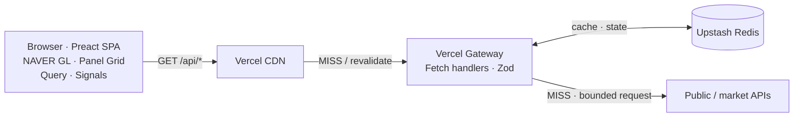
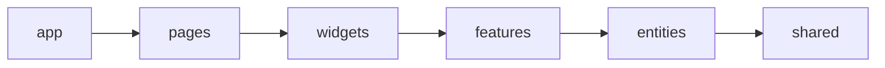
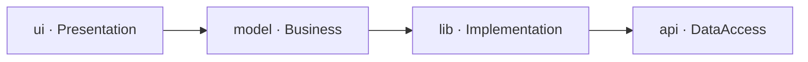
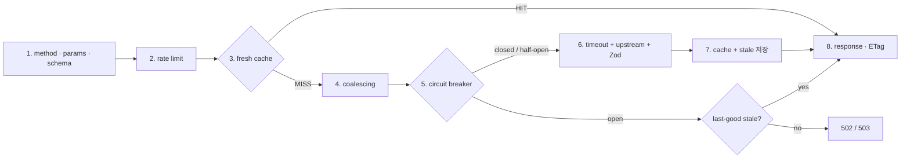
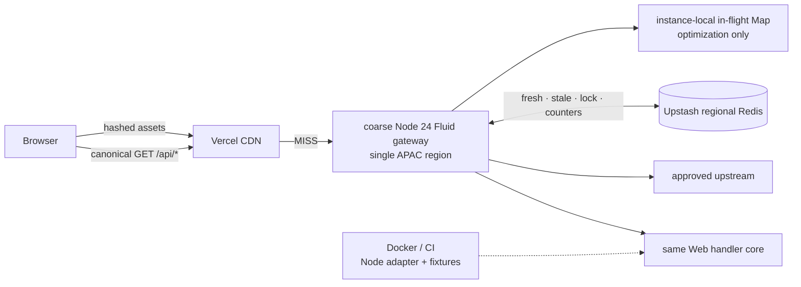
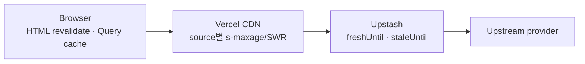
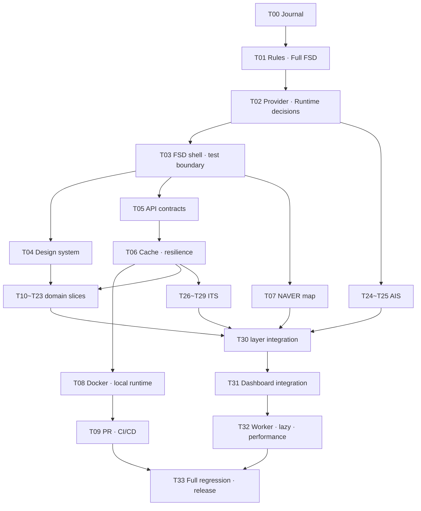
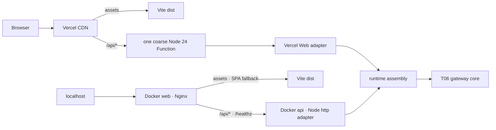
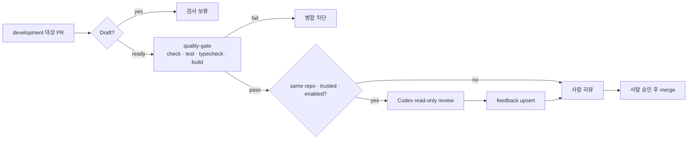

# Balance Keeper Development Journal

> Atlas Armillary Sphere — 대한민국과 주변 세계의 신호를 한눈에 읽는 실시간 대시보드

| 항목 | 값 |
| --- | --- |
| 문서 역할 | 제품 기획·기술 결정·Task·검증·개발일지의 단일 정본 |
| 실행 모드 | 승인모드 |
| 기준일 | 2026-07-31 (Asia/Seoul) |
| 새 저장소 기준선 | `f92ee53 chore: add project skills` |
| 레거시 참조 | `C:\Users\SR83\test\balance-keeper-legacy` |
| 현재 단계 | T26 ITS 9종 계약 검증 — ACCEPTED, 게시 진행 |
| 다음 단계 | T26 final commit·development PR·병합 → T27 제안 |

---

## 1. 문서 통제와 승인 규칙

이 파일을 프로젝트의 유일한 개발 정본으로 사용한다. 결정, Task 상태, 구현 증거와 회귀 결과를 다른 계획 문서에 분산하지 않는다. 상세 설계가 커져 별도 산출물이 필요해지더라도 이 문서에서 링크하고 상태를 관리한다.

상태 흐름은 다음과 같다.

```text
PROPOSED → APPROVED → IN_PROGRESS → VERIFYING → PASS → ACCEPTED
                                  └────────────→ BLOCKED
```

- `PASS`는 자동·수동 검증이 끝났다는 뜻이다.
- `ACCEPTED`는 사용자가 결과를 승인했다는 뜻이다.
- 의존 Task는 선행 Task가 `ACCEPTED`가 된 뒤 시작한다.
- 범위가 달라지면 기존 승인을 확대 해석하지 않고 변경 범위를 다시 승인받는다.
- `BLOCKED`는 정보 부족, 명세 모순, 검증 실패 또는 알려진 회귀 위험이 있다는 뜻이다. 추측으로 진행하지 않는다.
- Subagent는 Task 내부 조사에만 사용한다. 메인 에이전트가 결과를 실제 코드·공식 문서로 재검증한 뒤 이 문서에 통합한다.
- 병렬 작업자가 이 파일을 동시에 편집하지 않는다. 문서 갱신은 메인 에이전트가 직렬화한다.
- 기능 구현, 커밋, 원격 푸시는 승인된 Task 범위 안에서만 수행한다.

### 고정 가드레일

모든 단계와 Task는 다음 질문에 답해야 한다.

| 확인 항목 | 통과 조건 |
| --- | --- |
| 범위가 명확한가 | 포함·제외 범위와 변경 파일 영역이 적혀 있다. |
| 판단 근거가 있는가 | 코드, 테스트, 공식 문서 또는 재현 결과가 있다. |
| 기존 동작과 모순되지 않는가 | 충돌이 없거나, 대체 결정과 마이그레이션이 승인됐다. |
| 문서가 쉽게 이해되는가 | 결정 이유, 트레이드오프와 용어가 설명돼 있다. |
| 회귀 영향과 검증 방법이 확인됐는가 | 정상·실패·경계값·기존 영향 경로를 검증한다. |

---

## 2. 개발을 시작한 이유

평소 국제 정치와 글로벌 흐름을 파악하고 여러 주체의 메시지와 프로파간다를 분석하는 일을 흥미롭게 느껴 뉴스 보는 것을 취미로 삼아 왔다. 가장 큰 불편은 정보가 여러 서비스와 형식으로 분산돼 있다는 점이었다.

날씨, 기후, 지진과 같은 지도 데이터까지 포함해 대한민국의 현 상황을 한눈에 바라볼 수 있는 대시보드를 만들어보자는 단순한 생각이 Balance Keeper의 출발점이다. 현재는 흥미로운 아이디어를 검증하는 MVP 수준이지만, 장기적으로는 누구나 한국의 현황을 쉽고 빠르게 파악할 수 있는 신뢰도 높은 대시보드로 발전시키고자 한다. `Balance Keeper`라는 이름도 이 발상지를 모티브로 정했다.

함께할 개발자를 찾으려 했지만 각자의 현업과 우선순위가 달랐다. 프론트엔드 개발을 주력으로 하면서도 다양한 영역에 도전해 온 경험과 AI 도구의 도움을 바탕으로, 제품 판단과 검증 책임은 직접 지고 프로젝트를 독립적으로 진행한다.

이 문서는 전문 교재가 아니라 개인 개발일지다. 완성된 결과만 보여주기보다 왜 결정했고, 어떤 가설이 틀렸으며, 무엇으로 검증했는지 남긴다. AI로 빠르게 구현했는지보다 결정 근거와 테스트, 회귀 관리가 재현 가능한지가 더 중요한 증거다.

---

## 3. Workflow 진행 현황

| 단계 | 상태 | 근거 |
| --- | --- | --- |
| 아이디어 | PASS | 제품 동기, 사용자 가치와 장기 비전이 명시됐다. |
| 스크리닝 | PASS | MVP 수용·보류·검증 필요 범위를 분리했다. |
| 기획 | PASS | 제품 범위, 기술 원칙과 비기능 목표를 정의했다. |
| 코드베이스 분석 | PASS | 새 저장소와 레거시의 파일·계약·테스트를 대조했다. |
| 문서 검토 | PASS | fence 38개, replacement character 0개, API A01~A24를 확인했다. |
| Task 분리 | PASS | T00~T33의 34개 ID와 의존성·완료 조건을 확인했다. |
| 구현 | PASS | T08 one-coarse Function, production runtime assembly, Vercel·Node adapter, bundled Node server, non-root Nginx+API Docker topology를 RED→GREEN으로 구현했다. provider route는 승인 범위대로 추가하지 않았다. |
| 회귀 검증 | PASS | 전체 59 files·721 tests, Biome 139 files, strict TypeScript, client/server build, T08 focused 15 files·96 tests, clean Docker Compose smoke와 독립 runtime/deploy 리뷰가 통과했다. 전체 제품 회귀는 T33까지 누적한다. |

---

## 4. 아이디어 스크리닝

| 아이디어 | 판정 | 이유와 조건 |
| --- | --- | --- |
| 한국 실시간 공공신호 단일 화면 | ACCEPT | 분산된 정보를 한 좌표계와 공통 신선도 모델로 묶는 가치가 분명하다. |
| NAVER Maps GL 기반 한국 지도 | ACCEPT | 한국 지도 경험을 우선한다. 실제 SDK·과금·오버레이 한계는 Task에서 검증한다. |
| 소스별 갱신주기 폴링 | ACCEPT | 모든 데이터를 같은 주기로 조회하는 낭비를 피한다. |
| Vercel Functions + Upstash | ACCEPT | 상주 백엔드 없이 외부 API 보호·정규화·캐시를 제공하는 MVP에 적합하다. |
| Full FSD + 기능 내부 Waterfall | ACCEPT | 최신 사용자 명세가 기존 FSD-lite보다 우선한다. |
| OKLCH 기반 디자인 토큰 | ACCEPT | 밝은 영역 소실, 다크모드 대비와 지도 오버레이 색을 시스템으로 통제한다. |
| 자동 프로파간다 판정·출처 등급화 | DEFER | 방법론, 설명 가능성, 편향·명예훼손 위험을 먼저 정의해야 한다. MVP는 원문 출처와 시각·메타데이터 제공에 집중한다. |
| OpenSky 기반 군용기 운영 표시 | NO_GO | live product·자동 시스템의 REST 사용에 서면 계약이 필요하고 군 소유 분류도 제공하지 않는다. T18은 권리 승인 또는 대체 source feasibility만 수행한다. |
| AISstream 기반 개별 군함 실시간 추적 | NO_GO | 공개 재배포 계약·SLA·안전성이 확인되지 않았고 군함은 AIS 송신 예외도 있다. T24에서 서면 권리 또는 공식 집계형 범위만 재검토한다. |
| Docker를 Vercel의 동등한 운영 대체재로 사용 | DEFER | 우선 로컬·CI 재현성과 미래 백엔드 확장 경계로 사용한다. 자체 호스팅은 별도 결정이 필요하다. |
| 전면 반응형 최적화 | DEFER | MVP는 데스크톱 지도·그리드 경험을 우선한다. 작은 화면에서 기능이 깨지지 않는 최소 안전성은 유지한다. |

---

## 5. 제품 기획

### 5.1 한 문장 정의

Balance Keeper는 대한민국과 주변 지역의 공공·시장·재난·교통 신호를 한국 지도와 데이터 패널에 함께 보여주는 데스크톱 우선 실시간 상황판이다.

### 5.2 핵심 사용자 여정

1. 앱 셸과 마지막 정상 데이터가 먼저 보인다.
2. 사용자는 지도에서 현재 관심 레이어를 켜고 끈다.
3. 지도상의 사건을 선택해 상세 패널이나 CCTV 뷰어를 연다.
4. 각 패널에서 데이터 기준시각, 출처, 신선도와 오류 상태를 확인한다.
5. 일부 공급자가 실패해도 나머지 대시보드와 마지막 정상 데이터는 유지된다.

### 5.3 MVP 범위

- 단일 Preact SPA와 데스크톱 우선 전체 화면 대시보드
- NAVER Maps GL 베이스맵과 공공데이터 오버레이
- Vercel API Gateway를 통한 인증정보 보호, 정규화, 캐시
- Upstash 기반 공유 캐시·복원력 상태
- 소스별 TanStack Query 폴링과 Signals 기반 UI 상태
- 정상·로딩·빈 값·오류·stale 상태가 구분되는 패널
- 테스트 우선 구현과 승인 단위 개발일지

### 5.4 비범위

- 안전·투자·군사 판단을 대신하는 권위 있는 분석
- 모든 소스에 대한 초 단위 실시간성 보장
- 근거 없는 정치 성향·프로파간다 자동 판정
- 초기 MVP의 모바일 전용 정보 구조
- 첫 릴리스에서의 상주 백엔드 서버

---

## 6. 검증된 사실과 결정 등록부

### 6.1 2026-07-20 공식 문서 확인

| 항목 | 확인 결과 | 영향 | 출처 |
| --- | --- | --- | --- |
| NAVER Maps GL | GL 서브모듈은 WebGL 벡터맵을 제공한다. | NAVER GL을 베이스맵 후보로 유지한다. | [NAVER GL module](https://navermaps.github.io/maps.js.ncp/docs/module-gl.html) |
| NAVER Style Editor | `gl: true`와 `customStyleId`로 발행 스타일을 연결한다. 커스텀 스타일 사용 시 일부 기본 지도 유형·레이어를 쓸 수 없다. | 스타일 적용과 기능 손실을 함께 브라우저 검증한다. | [Style Editor 연동](https://navermaps.github.io/maps.js.ncp/docs/tutorial-2-Style-Editor.html) |
| Vercel 정적 파일 캐시 | 정적 파일은 배포 생명주기 동안 자동 CDN 캐시되고, 해시 파일은 변경되지 않으면 배포 간 유지될 수 있다. | 해시 자산은 장기 immutable, HTML과 API는 별도 정책을 쓴다. | [Vercel CDN Cache](https://vercel.com/docs/caching/cdn-cache) |
| Vercel Function 캐시 | Function 응답은 `s-maxage`, `stale-while-revalidate` 등으로 CDN 캐시한다. Vercel 프록시는 공유 캐시 지시자를 소비할 수 있다. | 브라우저·Vercel CDN 헤더를 구분한다. | [Cache-Control headers](https://vercel.com/docs/caching/cache-control-headers) |
| Upstash Redis | `@upstash/redis`는 HTTP 기반 connectionless client로 serverless 환경을 지원한다. | 공유 캐시와 분산 상태 후보로 유지한다. | [Connect with @upstash/redis](https://upstash.com/docs/redis/howto/connect-with-upstash-redis) |
| Codex GitHub Action | 현재 공식 예시는 `openai/codex-action@v1`, `OPENAI_API_KEY` secret, 별도 feedback job과 최소 권한을 사용한다. | CI Task에서 공식 보안 입력을 기준으로 구현한다. | [Codex GitHub Action](https://learn.chatgpt.com/docs/github-action) |

### 6.2 T02 판정 규칙

확인 기준일은 `2026-07-20 KST`다. URL이 지금 응답한다는 사실과 운영 계약이 있다는 사실을 구분한다.

| 판정 | 의미 |
| --- | --- |
| `GO` | 공식 운영 인터페이스와 이용조건이 확인됐고, 현재 범위에서 구현 후보로 사용할 수 있다. |
| `CONDITIONAL` | 공식 후보이지만 키 기반 schema·quota 확인, 표시권리 또는 배포 환경 검증 전에는 production에서 켜지 않는다. |
| `NO_GO` | 현재 source·계약으로는 production 기본값으로 사용하지 않는다. 서면 허가나 승인된 대체 source가 필요하다. |

증거 수준은 `DOC`(공식 문서), `PUBLIC_PROBE`(비밀값 없는 읽기 요청), `GATED_PROBE`(사용자 키가 있는 후속 Task)로 구분한다. `PUBLIC_PROBE`의 `200`은 도달 가능성만 증명하며 이용허락·SLA·재배포 권리를 증명하지 않는다. 포털에 표시된 트래픽은 기본 계정값이지 SLA가 아니며, 언어별 페이지나 과거 Q&A와 충돌하면 실제 승인 계정과 최신 한국어 문서를 보수적으로 적용한다.

### 6.3 Provider 계약 장부

| Provider | 2026-07-20 확인 사실 | 판정과 다음 gate | 공식 근거 |
| --- | --- | --- | --- |
| NAVER Web Dynamic Map GL | SDK는 `ncpKeyId`, `submodules=gl`, `gl: true`, 발행한 Style Editor의 `customStyleId`를 지원한다. Web Dynamic Map과 Web 서비스 host를 Application에 등록하며 host는 최대 10개다. Client ID와 style metadata ID는 브라우저 식별자이고 Client Secret은 브라우저 값이 아니다. 대표 계정 요금표는 현재 월 6,000,000회 이하 무료를 표시하지만 초과 구간의 빈 가격을 hard stop이나 무상 overage로 해석하지 않는다. 커스텀 스타일에서는 일반·위성·겹침·지형도와 자전거·교통·거리뷰·지적도 layer를 함께 쓸 수 없다. | `GO` — T07에서 실제 등록 host·계정 quota·published style load, `429`와 실패 fallback을 browser smoke한다. | [시작하기](https://navermaps.github.io/maps.js.ncp/docs/tutorial-2-Getting-Started.html), [Style Editor 연동](https://navermaps.github.io/maps.js.ncp/docs/tutorial-2-Style-Editor.html), [NAVER Maps Application](https://guide.ncloud-docs.com/docs/maps-app), [Maps 요금](https://www.ncloud.com/api-cms/service-product/static/maps) |
| KMA 초단기·단기예보 | `VilageFcstInfoService_2.0`의 `getUltraSrtNcst`, `getUltraSrtFcst`, `getVilageFcst`를 사용한다. 단기예보 발표는 `02/05/08/11/14/17/20/23 KST`, 개발계정 표시는 10,000건이며 출처표시 제1유형이다. | `CONDITIONAL` — KST 자정·발표 지연, HTTPS alias, null category와 승인 계정 quota를 T10/T22 실키로 검증한다. | [단기예보 조회서비스](https://www.data.go.kr/data/15084084/openapi.do), [KMA API Hub 동네예보](https://apihub.kma.go.kr/apiList.do?apiMov=4.+%EB%8F%99%EB%84%A4%EC%98%88%EB%B3%B4%28%EC%B4%88%EB%8B%A8%EA%B8%B0%EC%8B%A4%ED%99%A9%C2%B7%EC%B4%88%EB%8B%A8%EA%B8%B0%EC%98%88%EB%B3%B4%C2%B7%EB%8B%A8%EA%B8%B0%EC%98%88%EB%B3%B4%29+%EC%A1%B0%ED%9A%8C&seqApi=10&seqApiSub=286) |
| KMA 기상특보 | `WthrWrnInfoService/getWthrWrnList`와 특보 통보문·현황 계약이 있고 업데이트는 실시간, 개발·운영 자동승인, 출처표시 제1유형이다. | `CONDITIONAL` — 목록만으로 active/cancel geometry를 추정하지 않고 T23에서 통보문·현황 조합과 실제 quota를 검증한다. | [기상특보 조회서비스](https://www.data.go.kr/data/15000415/openapi.do) |
| KMA 지진 | `EqkInfoService/getEqkMsg`는 발표·발생시각, 위경도, 규모, 깊이와 수정사항을 제공한다. 실시간·무료·자동승인이고 현재 한국어 페이지 개발계정 표시는 10,000건이다. | `CONDITIONAL` — T12에서 KMA 수정 통보와 USGS event dedup을 실키 검증한다. | [지진정보 조회서비스](https://www.data.go.kr/data/15000420/openapi.do) |
| AirKorea | `ArpltnInforInqireSvc/getCtprvnRltmMesureDnsty`는 서비스키가 필요하다. 현재 한국어 제품 페이지 개발계정 표시는 500건/일이고 운영은 활용신고 심사 후 10,000건/일로 안내된다. 2026-06-30 이후 `전남`, `광주`, `전남광주` 처리 규칙이 바뀌었으며 실시간 측정값은 확정자료가 아니고 결측될 수 있다. 측정소 계약은 `MsrstnInfoInqireSvc/getMsrstnList`이고 샘플의 `dmX`는 위도, `dmY`는 경도라 이름만 보고 축을 바꾸지 않는다. | `CONDITIONAL` — T11에서 승인 quota, 행정구역, 좌표축, 결측과 측정시각을 확인한다. 운영 승인 전 개발 호출량을 production 가정으로 쓰지 않는다. | [대기오염정보](https://www.data.go.kr/data/15073861/openapi.do), [측정소정보](https://www.data.go.kr/data/15073877/openapi.do), [2026 행정구역 공지](https://www.data.go.kr/bbs/ntc/selectNotice.do?originId=NOTICE_0000000004805), [확정자료 설명](https://www.data.go.kr/data/15122830/fileData.do) |
| 행정안전부 긴급재난문자 | `https://www.safetydata.go.kr/V2/api/DSSP-IF-00247`는 신청한 `serviceKey`로 1분 갱신 데이터를 제공한다. 공개 숫자 quota·명시적 종료일/cursor/sort 계약은 찾지 못했고 오류는 요청한 `returnType`과 무관하게 XML일 수 있으며 quota·key·IP 오류코드가 있다. FAQ상 정렬되지 않은 응답도 가능하다. Safetydata는 공공기관 데이터 제3유형을 안내하지만 data.go.kr 연결 메타는 제4유형을 표시해 이용허락 표기가 충돌한다. | `CONDITIONAL` — 더 엄격한 출처표시·비상업·변경금지를 기본으로 두고 원문은 변형하지 않는다. T16에서 실제 quota, XML error branch, pagination·dedup·정렬을 실키 검증하고 공개/상업 서비스 전 제공기관 확인을 받는다. | [Safetydata 상세](https://www.safetydata.go.kr/disaster-data/view?dataSn=228), [data.go.kr 연결 메타](https://www.data.go.kr/data/15134001/openapi.do) |
| ECOS | 공식 서비스는 `StatisticTableList`, `StatisticItemList`, `StatisticSearch`, `KeyStatisticList`다. 검색 URL shape는 `https://ecos.bok.or.kr/api/StatisticSearch/{CERT_KEY}/{xml\|json}/{kr\|en}/{startRow}/{endRow}/{STAT_CODE}/{cycle}/{startTime}/{endTime}/{item1}/{item2}/{item3}/{item4}`이고 공식 안내의 `CERT_KEY` 길이는 30자다. 주기는 `A/S/Q/M/SM/D`, item 1~4는 선택이며 응답은 통계·항목 코드/명, 단위, 시점과 값을 제공한다. 공개 숫자 quota는 찾지 못했고 레거시 `731Y001`, `722Y001`, `732Y001`은 현재 의미가 검증되지 않은 후보다. | `CONDITIONAL` — T13에서 `StatisticTableList → StatisticItemList → StatisticSearch` 순서로 코드·항목을 발견하고 발표일, 단위, 최신 observation과 실제 제한을 실키 검증한다. 응답 순서를 최신값 보장으로 가정하지 않는다. | [한국은행 ECOS Open API](https://ecos.bok.or.kr/api/) |
| USGS earthquake | 실시간 GeoJSON feed는 매분 갱신되며 자동화 앱의 우선 인터페이스다. 고정 숫자 quota는 없고 과다 호출 시 `429`; 대부분 USGS 정보는 public domain이며 출처표시가 권장된다. | `GO` — 60초보다 빠르게 원본을 호출하지 않고 validator/cache header를 존중한다. KMA와 상호 보완한다. | [GeoJSON feed](https://earthquake.usgs.gov/earthquakes/feed/v1.0/geojson.php), [FDSN API](https://earthquake.usgs.gov/fdsnws/event/1/), [USGS credit](https://www.usgs.gov/information-policies-and-instructions/acknowledging-or-crediting-usgs) |
| 시장 데이터 | Yahoo의 현재 개발자 카탈로그에는 Finance API가 없고 데이터 제공자 안내는 재배포를 금지한다. KRX 직접 OPEN API 약관은 비상업 목적만 허용하고 제공받은 정보를 제3자에게 제공할 수 없게 한다. 금융위원회 `GetMarketIndexInfoService/getStockMarketIndex`는 KRX 주요 지수를 기준일 다음 영업일 13시 이후 일 1회 제공하며 이용허락범위 제한 없음, 개발 10,000회와 운영 자동승인을 명시한다. FRED는 API 이용과 제3자 소유 series의 재배포 권리를 분리하며 S&P 500·NASDAQ Composite는 별도 권리 확인이 필요하다. | Yahoo·KRX 직접·권리 미확인 FRED 지수는 `NO_GO`. T14는 금융위원회가 재개방한 KOSPI·KOSDAQ 지연 종가만 사용하고 실시간 시세로 표시하지 않는다. | [금융위원회 지수시세정보](https://www.data.go.kr/data/15094807/openapi.do), [KRX OPEN API 약관](https://openapi.krx.co.kr/contents/OPP/INFO/OPPINFO002.jsp), [FRED terms](https://fred.stlouisfed.org/docs/api/terms_of_use.html) |
| 뉴스 RSS | Yonhap·KBS·Hani·Chosun의 현재 feed는 응답하지만 publisher별 이용범위가 다르다. Chosun은 개인 구독만 기본 허용하고 상업 이용은 문의를 요구한다. Google News search RSS에는 consumer API, quota, SLA나 재배포 허가를 설명하는 공식 계약이 없다. | 직접 publisher RSS는 `CONDITIONAL`로 제목·출처·시각·원문 링크만 제공하고 전문을 저장/재배포하지 않는다. Google News RSS는 `NO_GO`; JoongAng 우회 feed도 제거한다. | [KBS RSS](https://world.kbs.co.kr/service/about_rss.htm?lang=e), [Chosun RSS 안내](https://rssplus.chosun.com/), [Google News 변경](https://support.google.com/news/publisher-center/answer/15898024?hl=en) |
| 항공 데이터 | OpenSky는 OAuth2와 credit quota를 문서화했지만 live product/자동 시스템의 REST 사용에 서면 계약을 요구한다. 제공 state에는 검증된 군 소유 분류가 없다. | OpenSky `NO_GO` until written license. T18은 구현 Task가 아니라 license/대체 source feasibility로 바꾸고, ADSB.lol은 ODbL·동적 제한·`mil` 분류 한계를 승인받기 전 `CONDITIONAL`이다. | [OpenSky REST](https://openskynetwork.github.io/opensky-api/rest.html), [OpenSky terms](https://opensky-network.org/about/terms-of-use), [ADSB.lol license](https://www.adsb.lol/privacy-license/) |
| AIS | AISstream은 API key를 사용하는 backend WebSocket beta이며 CORS를 지원하지 않고 SLA·안정 schema·공개 재배포 계약이 확인되지 않았다. 군함은 AIS 탑재·송신 의무 예외가 있어 완전한 군함 지도가 될 수 없다. | 개인 군함 추적은 `NO_GO`. T24는 서면 권리와 안전성 또는 한국 공식 집계형 AIS로 범위를 바꾸는 feasibility만 수행하며, 조건 충족 전 T25를 시작하지 않는다. | [AISstream docs](https://aisstream.io/documentation.html), [IMO AIS guidance](https://www.imo.org/en/ourwork/safety/navigation/ais.aspx), [한국 연안 AIS 집계](https://www.data.go.kr/data/15084033/openapi.do) |
| ITS | 현재 공식 카탈로그에는 CCTV와 A16~A24 9종이 모두 존재한다. 인증키 승인은 3~5영업일로 안내된다. CCTV는 HLS·mp4·정지영상·HTTPS-HLS·HTTPS-mp4 유형을 문서화했고 재난 API는 point/line/polygon을 제공한다. 현재 manual은 서비스별 24시간 제한이 없다고 하지만 과거 공식 Q&A는 API당 1,000건/일이라 답해 충돌한다. 현재 정적 상세 페이지는 각 서비스의 정확한 production HTTPS resource path를 모두 노출하지 않는다. | 모두 `CONDITIONAL` — T19/T20/T21/T26에서 승인 key로 HTTPS host·path·port, 실제 quota, 좌표·날짜창·빈 결과, media CORS/만료와 표시조건을 동결한다. 과거 `http://openapi.its.go.kr` 예시나 `:9443` probe를 production 경로로 복사하지 않는다. | [ITS Open API](https://www.its.go.kr/opendata/intro), [현재 manual](https://www.its.go.kr/file/opendata/openapi_manual.pdf), [CCTV](https://www.its.go.kr/opendata/opendataList?service=cctv), [재난](https://www.its.go.kr/opendata/opendataList?service=disaster), [과거 quota Q&A](https://www.its.go.kr/opendata/reqOpendataQnaDetail?seqNo=166) |

### 6.4 A01~A24 source 동결

`신선도 기준`은 upstream을 그보다 더 자주 호출하지 않기 위한 하한이며, 실제 TTL은 keyed probe의 응답시각·quota를 근거로 각 구현 Task에서 좁힌다.

| ID | 동결 source | 판정 | 신선도 기준·fallback / 후속 gate |
| --- | --- | --- | --- |
| A01 | KMA `getUltraSrtNcst` | `CONDITIONAL` | KST 발표시각 기준, 10분 client 확인·공유 cache. T10 keyed boundary probe |
| A02 | KMA `getVilageFcst` | `CONDITIONAL` | 하루 8회 발표 경계 기준, 중간에는 캐시. T22 자정·누락 slot probe |
| A03 | KMA `WthrWrnInfoService` | `CONDITIONAL` | event성 1~2분 확인, active/cancel은 목록이 아닌 현황 계약으로 판정 |
| A04 | AirKorea 시도별 실시간 측정+측정소 | `CONDITIONAL` | 측정시각 기준 30분 확인, 결측은 last-good와 별도 표시; `dmX=위도`, `dmY=경도` keyed fixture 고정 |
| A05 | KMA 지진 + USGS GeoJSON | USGS `GO`, 전체 `CONDITIONAL` | USGS 원본 최소 60초, KMA keyed smoke 후 source ID·시공간 dedup |
| A06 | ECOS table/item/search discovery | `GO` | 공식 코드·항목·단위 discovery와 production gateway 3-call 실키 검증 PASS |
| A07 | 금융위원회 KRX-derived 일별 주가지수 | `CONDITIONAL` | KOSPI·KOSDAQ EOD/하루 지연만. 전용 승인 key live gate 전 fixture 구현; Yahoo·KRX 직접·미국 지수는 `NO_GO` |
| A08 | 직접 publisher RSS | `CONDITIONAL` | 5~10분, feed별 독립 실패. Google News RSS와 우회 feed는 `NO_GO` |
| A09 | Safetydata `DSSP-IF-00247` | `CONDITIONAL` | 30~60초, 원문 보존·출처·license 확인과 keyed XML error·pagination·정렬/dedup probe |
| A10 | A05+A07+A08 파생 조합 | `CONDITIONAL` | 별도 upstream 중복 호출 없이 가장 느린 component와 부분 실패 표시 |
| A11 | OpenSky 또는 승인 대체 ADS-B | `NO_GO` | 서면 운영권리/ODbL 승인 전 feature off; callsign은 군 소유 증거가 아님 |
| A12 | AISstream 군함 | `NO_GO` | 서면 재배포·안전·retention 계약과 상주 ingestion topology 없이는 feature off |
| A13 | ITS CCTV metadata | `CONDITIONAL` | bbox 변경 또는 5~10분; `type=ex\|its`, URL·좌표·format keyed probe |
| A14 | ITS CCTV `cctvType=3` 정지영상 | `CONDITIONAL` | viewer 활성 시에만 짧게; HTTPS, 크기, CORS·만료와 allowlist 검증 |
| A15 | ITS `cctvType=4` HTTPS-HLS 우선 | `CONDITIONAL` | on-demand 한 스트림. Vercel Function으로 segment/video를 상시 relay하지 않음 |
| A16 | ITS `traffic` | `CONDITIONAL` | 30~60초 후보; link ID·속도·빈 구간 keyed probe |
| A17 | ITS `event` | `CONDITIONAL` | 30~60초 후보; 시작·종료·severity·중복 keyed probe |
| A18 | ITS `fcTraffic` 우회도로 예측 | `CONDITIONAL` | `sectionId`, `fCastDate`, `fCastHour` 필수; generic 전국 예측으로 확대하지 않고 본선/우회 구간과 horizon 검증 |
| A19 | ITS `detectorInfo` | `CONDITIONAL` | 수분 이내 후보; 집계주기·단위·전국 coverage 검증 |
| A20 | ITS `vms` | `CONDITIONAL` | 1~5분 후보; message sanitize·좌표·만료 검증 |
| A21 | ITS `safeDriving` 고속도로 주의운전 | `CONDITIONAL` | 필수 bbox, 5~10분 후보; 고속도로 범위·유형·geometry·유효기간 검증 |
| A22 | ITS `vsl` | `CONDITIONAL` | 1~5분 후보; 제한속도 단위·발효/해제 검증 |
| A23 | ITS `dangerousCarInfo` | `CONDITIONAL` | sparse event·종료 flag라 빈 결과를 장애로 보지 않음; 정밀 위치·보존·안전 노출 정책 선행 |
| A24 | ITS `disaster` | `CONDITIONAL` | category `D`, event `D03/D04/D06/D07`, 필수 시작·종료일과 선택 bbox, Point/Line/Polygon 순서·XY·null·종료 검증; 실패 시 A17 `eventType=dis` 또는 A09 목록만 표시 |

### 6.5 무자격 public probe 장부

2026-07-20에 로컬 secret이나 `.env`를 읽지 않고 공개 GET만 한 번씩 실행했다. 응답 본문의 업무 데이터는 저장하지 않았고 상태·콘텐츠 유형·shape 시작만 확인했다.

| 대상 | 결과 | 증명하는 것 / 증명하지 않는 것 |
| --- | --- | --- |
| USGS FDSN Korea/East Asia bbox | `200 application/json`, GeoJSON collection | 현재 도달·JSON shape. 장기 SLA·고정 quota는 아님 |
| OpenSky Korea bbox anonymous | `200 application/json` | 현재 도달만 확인. 운영 사용권리는 없으므로 후속 polling 금지 |
| KMA HTTPS without key | `401 text/plain` | HTTPS route와 missing-key 실패. keyed schema·quota는 미확인 |
| ITS `:9443` without key | `401 application/json`, `resultCode=4002` | gateway와 구조화된 필수 parameter 실패. 실제 서비스 응답은 미확인 |
| Yonhap·KBS·Hani·Chosun RSS | 모두 `200`, XML root | 현재 feed 도달. KBS는 XML인데 `text/html`을 반환하므로 MIME만 신뢰하지 않음 |
| Google News search RSS | `200 application/xml` | 현재 도달만 확인. 공식 consumer 계약이 아니므로 production 사용 근거가 아님 |

### 6.6 결정 등록부

| ID | 결정 | 상태 | 근거·재검토 조건 |
| --- | --- | --- | --- |
| D-001 | Node 24, TypeScript strict, Preact, Signals, TanStack Preact Query, Vite, Tailwind, Vitest, Biome를 사용한다. | ACCEPTED | 현재 scaffold와 최신 명세가 일치한다. |
| D-002 | 클라이언트 구조는 `app → pages → widgets → features → entities → shared` Full FSD를 사용한다. | ACCEPTED | 최신 사용자 명세가 기존 no-pages skill보다 우선한다. |
| D-003 | `pages/dashboard`는 즉시 도입하되 실제 두 번째 URL이 생기기 전까지 router dependency는 추가하지 않는다. | ACCEPTED | 사용자가 Full FSD와 초기 no-router 구성을 승인했다. Page 조합 계층과 router 도입을 분리한다. |
| D-004 | 기능 내부 Waterfall은 `ui(Presentation)`, `model(Business)`, `lib(Implementation)`, `api(DataAccess)`로 매핑하며 필요한 segment만 만든다. | ACCEPTED | 사용자가 T03 착수와 함께 승인했다. FSD layer와 Waterfall 책임을 1:1 대응시키지 않는다. |
| D-005 | NAVER Maps GL을 주 베이스맵으로 사용하고 지도 SDK는 동적 로딩한다. | ACCEPTED | 한국 지도 정확도와 사용 경험을 우선한다. |
| D-006 | MapLibre/deck.gl은 초기 번들에 넣지 않는다. NAVER 오버레이 예산으로 충족하지 못하는 측정된 고밀도 요구가 생길 때 별도 승인한다. | PROPOSED | 이중 지도 엔진과 2MB급 초기 번들 회귀를 피한다. |
| D-007 | TanStack Query는 원격 서버 상태, Signals는 파생·일시적 UI 상태만 소유한다. | ACCEPTED | 책임 중복을 방지한다. |
| D-008 | Vercel managed deployment를 운영 정본으로 두고 Vite 정적 자산은 CDN, gateway는 단일 APAC Node 24 Fluid Function군, 공유 상태는 Upstash에 둔다. Docker는 로컬·CI 재현성만 담당하며 self-host production과 Vercel Dockerfile beta는 별도 승인한다. | ACCEPTED | Docker는 CDN·Fluid·scale-to-zero·region·배포 무효화를 재현하지 못한다. 기본 후보는 `hnd1`+Upstash Tokyo이고 T08 latency probe에서 `icn1` 대안을 비교한다. |
| D-009 | 서버 코어는 `(request: Request, dependencies) => Promise<Response>` Web handler로 작성한다. Vercel `fetch` export와 Node/Docker `node:http` bridge는 얇은 adapter이며 env·platform cache header·Cron auth·lifecycle은 adapter가 소유한다. | ACCEPTED | Vercel Node runtime과 Node 24가 표준 Request/Response를 지원한다. 플랫폼 의미까지 동일하다고 가정하지 않는다. |
| D-010 | 정적 자산, HTML, API 데이터는 서로 다른 캐시 정책을 쓴다. API에 1년 TTL을 일괄 적용하지 않는다. | ACCEPTED | 데이터 신선도와 배포 무효화를 분리한다. |
| D-011 | AI 개발 workflow는 `brainstorm → plan → RED/GREEN/REFACTOR → verify → review`로 고정한다. | ACCEPTED | 테스트가 먼저 실패하는 것을 확인한다. |
| D-012 | Codex 리뷰는 ready-for-review인 신뢰 가능한 same-repository PR에서 `quality-gate`가 통과한 뒤 실행하고, 초기에는 결과를 참고 의견으로 둔다. | ACCEPTED | 원문에 독립 실행과 quality 통과 후 실행이 함께 있어 충돌한다. 더 구체적인 후반 구현 지침과 비용·secret 노출 최소화를 우선하며 사용자가 T09 진행을 승인했다. |
| D-013 | Hobby의 직접 Function 12개 제한을 피하고 공통 정책을 한곳에 적용하기 위해 A01~A24를 24개 entry가 아니라 하나 또는 소수의 coarse gateway Function과 내부 route registry로 제공한다. | ACCEPTED | 비-프레임워크 `api/` 파일은 파일마다 Function이 되며 현재 제품 route 수가 제한을 넘는다. |
| D-014 | process-local promise map은 같은 warm instance의 최적화만 담당한다. fresh/last-good cache와 fleet-wide lock·rate-limit·breaker는 Upstash atomic operation+TTL을 사용하고, eventual consistency 때문에 breaker는 hint로 취급한다. | ACCEPTED | Fluid concurrency와 scale-out에서 process memory는 공유 정본이 아니다. |
| D-015 | 모든 upstream API·인증·목록·metadata 요청은 gateway를 통과한다. 표준 Vercel Function은 정상화된 JSON·허용된 media metadata만 제공하고 CCTV video/HLS segment와 대형 이미지 bytes를 4.5MB payload 경로로 상시 relay하지 않는다. 브라우저 직접 요청은 server secret을 포함하지 않고 gateway가 allowlist한 provider-issued HTTPS media URL에만 허용하는 media-only 예외다. 조건을 충족하지 못하면 unavailable로 두거나 별도 media topology를 승인받는다. | ACCEPTED | 일반 API gateway의 payload·대역폭·file descriptor 예산과 secret 경계를 함께 보호한다. T05에서 `vercel-api-gateway` skill을 이 예외와 먼저 정렬한 뒤 T19~T21을 구현한다. |
| D-016 | OpenSky, AISstream, Yahoo Finance와 Google News RSS는 현재 production 기본 source로 사용하지 않는다. provider 권리와 계약이 해제되지 않은 기능은 fixture demo가 아니라 명시적 unavailable/feature-off 상태로 둔다. | ACCEPTED | 기술적 도달과 운영·재배포 권리를 분리한다. |
| D-017 | 시각 기반은 `Atlas Armillary / 관측실 계기판`으로 정하고 CSS의 OKLCH semantic token을 단일 출처로 사용한다. TSX의 raw palette·hex·arbitrary color를 금지하며 외부 폰트·아이콘 dependency를 추가하지 않는다. | ACCEPTED | 사용자가 T04 착수와 함께 승인했다. 청회색 지도 바탕, 방위각 blue와 보정된 brass warning이 제품 주제에 맞고 VDI에서도 표면·경계를 분명히 한다. |
| D-018 | theme preference는 `system \| light \| dark`, resolved theme은 `light \| dark`로 분리한다. 최초 방문은 system, 명시적 선택은 저장하며 app initializer가 Preact render 전에 `.dark`와 `color-scheme`를 동기화한다. | ACCEPTED | 사용자가 T04 착수와 함께 승인했다. OS 선호를 존중하면서 사용자 선택·테스트 가능성·Tailwind class 전략을 함께 보존한다. |
| D-019 | 공통 Panel은 discriminated union으로 `loading`, `error`, `empty`, `stale`, `success`, `disabled`, `missing-credential`을 표현한다. stale은 기존 콘텐츠와 upstream freshness를 유지한다. | ACCEPTED | 사용자가 T04 착수와 함께 승인했다. 필수 5상태와 provider 정책·credential 부재를 색상이나 임의 문구가 아닌 하나의 접근 가능한 계약으로 통일한다. |
| D-020 | transport envelope의 outer object·meta·error는 strict Zod schema로 검증한다. `fetchedAt`은 Unix epoch milliseconds의 non-negative safe integer이고, 빈 배열·`null` 허용 여부는 각 domain data schema가 결정한다. | ACCEPTED | 사용자가 T05 상세안을 확인한 뒤 “시작해”로 승인했다. client/server type을 schema에서 추론하고 `message`, `stack`, secret 같은 우발적 필드를 transport 경계에서 거부한다. |
| D-021 | public API error code는 `BAD_REQUEST(400)`, `UNAUTHORIZED(401)`, `FORBIDDEN(403)`, `NOT_FOUND(404)`, `UNPROCESSABLE_CONTENT(422)`, `RATE_LIMITED(429)`, `INTERNAL(500)`, `UPSTREAM_UNAVAILABLE(502)`, `MISSING_CREDENTIALS(503)`, `SERVICE_UNAVAILABLE(503)`로 고정한다. client-local code는 `NETWORK_ERROR`, `INVALID_RESPONSE`만 추가하고 Abort는 원본 오류를 보존한다. | ACCEPTED | 사용자가 T05 상세안을 확인한 뒤 “시작해”로 승인했다. caller 인증 실패와 server provider 설정 누락을 분리한다. |
| D-022 | JSON client는 native `fetch`와 필수 Zod data schema를 사용하며 same-origin 상대 `/api/*` GET만 허용한다. 자체 retry·timeout은 두지 않고 non-2xx/malformed/network를 안전한 `AppError`로 정규화한다. CCTV media-only direct byte fetch는 이 client 밖의 후속 T19~T21 경계다. | ACCEPTED | 사용자가 T05 상세안을 확인한 뒤 “시작해”로 승인했다. unchecked generic cast와 browser의 protected upstream 직접 호출을 막는다. |
| D-023 | Shared는 `createQueryProfile({ staleTime, refetchInterval })`와 retry/focus/background 정책만 제공하고, source별 실제 숫자·query key·enabled/viewport 조건은 owning Entity가 A01~A24 근거로 소유한다. | ACCEPTED | 사용자가 T05 상세안을 확인한 뒤 “시작해”로 승인했다. source별 cadence와 FSD domain 소유권을 보존한다. |
| D-024 | cache record는 versioned discriminated union으로 만들고 하나의 positive record가 `freshUntil`과 `staleUntil`을 함께 가진다. 정상화·검증된 명시적 empty만 stale 없는 short negative record로 저장하며 `fetchedAt`과 내부 `storedAt`을 분리한다. | ACCEPTED | 사용자가 T06 상세안에 “시작해”로 승인했다. fresh/stale 2-key 비원자성, 고정 stale TTL과 과거 positive 부활을 막고 exact expiry·corrupt record를 검증한다. |
| D-025 | JSON 표현의 validator는 canonical JSON의 SHA-256으로 만든 `W/"bk1-…"` weak ETag를 사용한다. 입력에는 data·source·fetchedAt·value/empty·STALE 여부를 넣고 requestId와 MISS/HIT는 제외한다. 304는 cacheable current GET에만 사용하고 STALE·오류는 `no-store`로 200/error를 명시한다. | ACCEPTED | 사용자가 T06 상세안에 “시작해”로 승인했다. fresh→STALE 전환을 validator에 포함해 304가 degraded 표시를 숨기지 않게 한다. |
| D-026 | rate limit을 origin admission과 실제 upstream budget으로 구분한다. 둘 다 초기에는 Upstash atomic fixed-window+TTL을 사용하되 admission은 cache 전에 opaque subject별로, upstream budget은 cache·coalescing·lease 뒤 provider scope로 소비한다. 실제 limit/window는 owning route가 확정한다. | ACCEPTED | 사용자가 T06 상세안에 “시작해”로 승인했다. CDN HIT는 Function limiter를 거치지 않으므로 edge DDoS 방어라고 과장하지 않는다. |
| D-027 | local coalescer는 acquisition만 공유하고 requestId·Response는 요청별로 만든다. fleet lock은 unique token+TTL과 atomic compare-delete, breaker는 CLOSED/OPEN/single HALF_OPEN hint로 구현한다. production credential 누락 시 memory store로 조용히 fallback하지 않는다. | ACCEPTED | 사용자가 T06 상세안에 “시작해”로 승인했다. Upstash eventual consistency 때문에 exactly-once는 주장하지 않고 rare duplicate를 허용한다. |
| D-028 | NAVER Maps GL은 공식 `maps.js`에 `ncpKeyId`, `submodules=gl`, `language=ko`, unique `callback`을 붙여 앱 셸 commit 뒤 비동기 로드한다. 같은 설정은 Promise 하나로 합치고 10초 deadline, auth/network/namespace 실패 정리와 retry를 애플리케이션이 소유한다. | ACCEPTED | 사용자가 T07 상세안에 “네”로 승인했다. 공식 callback이 GL 콘텐츠 완료 신호이고 provider는 loader timeout을 제공하지 않는다. legacy의 `onload` 단독·무기한 pending·설정 무관 전역 Promise를 대체한다. |
| D-029 | `VITE_NAVER_MAPS_KEY_ID`는 필수 browser identifier, `VITE_NAVER_MAP_STYLE_ID`는 선택 custom-style metadata로 사용한다. style 누락 시 기본 GL을 명시적 degraded로 유지하되 hardcoded ID, query override, legacy alias와 Client Secret은 금지한다. | ACCEPTED | 사용자가 T07 상세안에 “네”로 승인했다. 기존 canonical env 표와 일치하고 설정 누락을 숨기지 않으면서 basemap 가용성은 유지한다. 실제 값은 UI·오류·로그·fixture에 기록하지 않는다. |
| D-030 | FSD 소유권은 `shared/config`의 browser config, `entities/map`의 NAVER adapter·map lifecycle, `widgets/korea-map`의 완결된 UI로 나눈다. `DashboardPage`가 `KoreaMapWidget`을 `DashboardShell` slot에 전달하고 두 Widget은 서로 import하지 않는다. | ACCEPTED | 사용자가 T07 상세안에 “네”로 승인했다. Page를 무상태 Widget 조합 계층으로 유지하면서 sibling-widget import와 984줄 legacy 결합을 피한다. |
| D-031 | 화면에 남는 NAVER Map은 한 번만 만들고 공식 `init`을 ready 기준, `tilesloaded`를 live smoke 기준으로 쓴다. `ResizeObserver → autoResize`, listener 해제와 `Map.destroy()`를 session에 묶고 theme 변경으로 map을 재생성하지 않는다. | ACCEPTED | 사용자가 T07 상세안에 “네”로 승인했다. legacy의 첫-load 2회 생성, ref 등록 전 unmount 누수, 취소되지 않는 80/600ms timer와 undocumented `relayout`을 제거한다. |
| D-032 | 발행된 다크 Style Editor 지도는 light/dark shell과 독립된 ‘관측 장비 창’으로 유지한다. 전체 폭·narrow 40rem·desktop 48rem 높이, semantic-token 계기 표식, 접근 가능한 지도 이름·초기 위치 control을 제공하고 data overlay는 넣지 않는다. | ACCEPTED | 사용자가 T07 상세안에 “네”로 승인했다. 사용자가 허용한 다크 GL 시뮬레이션을 Atlas Armillary의 한 시각적 signature로 쓰되 지도 자체와 NAVER attribution을 가리는 장식은 배제한다. |
| D-033 | `init`과 화면 표시를 분리해 최초 `tilesloaded`만 visible-ready로 인정한다. SDK callback 뒤 Map 인증까지 `navermap_authFailure` 구독을 유지하고, custom style이 render deadline을 넘기면 해당 Map을 정리한 뒤 default GL을 한 번만 재시도해 명시적 degraded 상태로 전환한다. | ACCEPTED | minZoom 수정 뒤에도 console error 없이 blank가 재현되어 사용자가 원인 파악과 해결을 지시했다. 운영 SDK와 공식 이벤트 의미를 대조하면 callback·`init`만으로 타일 표시나 Map 단계 인증 성공을 증명할 수 없다. D-031의 cleanup·one-visible-map 원칙은 유지하되 ready 기준만 supersede한다. |
| D-034 | Vercel은 하나의 coarse Web Function이 `/api/*`를 내부 registry로 전달하고, Docker는 `web` Nginx와 `api` Node 24 두 서비스로 분리한다. Nginx는 Vite `dist`와 SPA fallback·same-origin proxy만, Node는 `node:http` bridge와 gateway runtime만 소유한다. | ACCEPTED | 사용자가 T08 상세안에 “네”로 승인했다. 정적 CDN과 API process 책임을 분리하면서 같은 `(Request, dependencies) => Response` 코어를 재사용하고 Docker가 Vercel CDN·Fluid·scale-to-zero를 모사한다고 주장하지 않는다. |
| D-035 | server artifact는 기존 Vite SSR build로 별도 ESM bundle을 만들고 source TypeScript를 runtime에서 직접 실행하지 않는다. Node·Nginx base는 tag+digest로 고정한 multi-stage image, `npm ci`, 최소 runtime artifact와 non-root user를 사용한다. | ACCEPTED | 사용자가 T08 상세안에 “네”로 승인했다. 현재 `moduleResolution: Bundler`·`noEmit`과 extensionless import는 Node source 실행 계약이 아니며 digest 갱신은 명시적 후속 PR로 관리한다. |
| D-036 | `/healthz`는 provider·Upstash를 호출하지 않는 adapter liveness/readiness 경계로 두고 `no-store`로 응답한다. Docker web health는 이 경로를 API까지 proxy해 두 서비스 연결을 확인한다. Upstash 설정이 없거나 불완전해도 memory를 production 정본으로 대체하지 않으며 product route는 fail-closed한다. | ACCEPTED | 사용자가 T08 상세안에 “네”로 승인했다. 현재 product route가 0개라 external dependency health를 성공으로 과장하지 않으면서 D-014·D-027의 fleet-state 원칙을 보존한다. |
| D-037 | 초기 Function region은 Upstash가 지원하는 Tokyo `ap-northeast-1`과 같은 `hnd1`로 명시한다. `vercel dev`는 `dev1`이라 `hnd1`·`icn1` 비교 증거가 될 수 없으므로 D-008의 실측 시점만 실제 linked Preview와 provider가 준비되는 T33으로 옮긴다. | ACCEPTED | 사용자가 T08 상세안에 “네”로 승인했다. 실제 Preview에서 cache HIT·MISS p50/p95와 비용을 비교해 `icn1` 전환 여부를 결정한다. |
| D-038 | `development` 대상 non-draft `pull_request`에 하나의 `quality-gate`를 두고, 기존 broad CI는 `main`·`development` push 전용 `branch-validation`으로 축소한다. PR workflow는 path filter 없이 `opened`, `synchronize`, `reopened`, `ready_for_review`를 처리한다. concurrency는 `github.ref`로 PR을 구분하고 quality는 명시적 Draft만 skip해 fork의 빈 payload에서도 실행한다. | ACCEPTED | PR에서 중복 validation을 피하고 Draft→ready 전환과 required-check pending 함정을 막는다. fork payload가 비어도 quality를 fail-open하되 secret Codex는 same-repository guard로 fail-closed한다. 사용자가 T09 진행을 승인했다. |
| D-039 | Codex review는 full-SHA 고정 `openai/codex-action`과 pinned Codex CLI, `gpt-5.6-sol`·`high`, `permission-profile: :read-only`·`drop-sudo`를 사용한다. API key는 action input에만 전달하고 review job은 `contents: read`만 가진다. | ACCEPTED | 최신 action contract는 legacy `sandbox`보다 permission profile을 권장한다. immutable pin, no-sudo와 job 분리로 공급망·runner secret 경계를 줄인다. 사용자가 T09 진행을 승인했다. |
| D-040 | Codex 출력은 JSON Schema로 `PASS | CHANGES_REQUESTED | BLOCKED`, verification limit과 `severity`, `path`, `line`, `title`, `reason`, `impact`, `recommendation` finding 필드를 강제한다. 별도 no-checkout feedback job만 `pull-requests: write`를 가지고 고정 marker와 bot 작성자를 함께 확인해 댓글 하나를 갱신한다. | ACCEPTED | 모델 출력을 신뢰하지 않고 parse·길이 제한·상태 불변식·중복 거부·안전한 fallback을 적용하며, 리뷰 job에 쓰기 권한을 주지 않고 중복 댓글과 marker 탈취를 방지한다. 사용자가 T09 진행을 승인했다. |
| D-041 | T09를 repository artifact·offline 검증과 remote activation으로 나눈다. 전자는 승인 후 로컬 구현하고, 후자의 push·`development` 생성·secret/variable·ruleset·시험 PR은 별도 외부 변경 승인 후 수행한다. | ACCEPTED | 현재 원격은 main보다 9 commits 뒤이고 development, `OPENAI_API_KEY`, protection/ruleset이 모두 없다. 로컬 workflow 작성이 원격 병합 정책 활성화를 의미하지 않게 한다. 사용자가 T09 진행을 승인했다. |
| D-042 | KMA 초단기실황은 공공데이터포털 HTTPS `getUltraSrtNcst`, canonical `DATA_GO_KR_SERVICE_KEY`, KST 기준 20분 안전 지연 뒤 정시 slot을 사용한다. Entity의 7개 지역 격자를 단일 출처로 두고 production assembly만 `/api/weather`를 등록하며 fresh 10분·CDN 5분·stale 60분·empty 60초·client refetch 10분으로 운용한다. | ACCEPTED | 사용자가 T10 범위를 승인했고 값 미출력 실키 probe에서 최근 10분 후보 요청도 실제 정시 자료를 반환했다. 요청 slot과 응답 slot 불일치, 지역 불일치, raw provider 오류와 browser/server 번들 혼합을 실패로 고정한다. |
| D-043 | AirKorea 대기질은 HTTPS 시도별 실시간 측정정보와 측정소정보를 server에서 결합한다. 측정은 `KOREA_AIR_QUALITY_BASE_URL/KEY`, 측정소정보는 `KOREA_AIR_STATION_BASE_URL/KEY`의 분리된 server-only 계약을 사용하고 각 base를 공식 service family로 allowlist한다. `*_EXPIRES_AT`은 T11 runtime·contract gate에서 사용하지 않는다. domain-owned 7개 지역 ID와 한국어 alias를 하나의 cache identity로 정규화하고 `dmX=위도`, `dmY=경도`를 고정한다. PM10·PM2.5 농도 등급은 공식 경계로 파생하되 `khaiGrade`와 혼용하지 않으며 지도 overlay는 T30까지 제외한다. | ACCEPTED | 사용자가 T11 상세안과 service별 환경계약 분리를 승인한 뒤 “expires_at은 일단 무시”라고 명시해 만료일 metadata를 현재 범위에서 제외했다. 공식 API는 서비스별 활용승인과 개발 500건 quota가 필요하다. |
| D-044 | T11 수동 화면 완료 조건은 반응형·테마 기능과 기존 지도·서울 기상 실황 Panel 존재 확인으로 고정한다. theme keyboard 전환의 별도 수동 검증은 현재 필요하지 않으며 T11 release gate에서 제외한다. 기존 native control과 자동 접근성 테스트는 제거하지 않는다. | ACCEPTED | 사용자가 반응형·테마 기능을 직접 PASS로 보고한 뒤 keyboard 전환은 지금 필요하지 않고 지도·서울 기상 실황 Panel이 존재한다고 명시했다. |
| D-045 | 승인모드에 Fast Track을 추가한다. 동일 목적·최대 3개 product/test/config 파일이며 dependency·public API/schema·architecture·migration·secret 값·제품 정책을 바꾸지 않는 수정은 시작 승인 한 번으로 RED→GREEN, focused test, 최종 validate, commit과 기존 승인 PR branch push까지 연속 수행한다. merge·deploy는 별도 승인한다. | ACCEPTED | 사용자가 간단한 작업에 대형 workflow가 반복되는 문제를 지적했고, 제안한 Fast Track 규칙에 “진행”으로 승인했다. 범위 확대·검증 실패·secret 또는 사용자 변경 충돌이 생기면 즉시 full workflow로 복귀한다. |
| D-046 | T12의 공개 범위는 KMA가 공식 제공하는 최근 3일 통보와 USGS `2.5_week.geojson` 최근 7일 자료를 KMA 공식 동아시아 범위 `21~45°N, 110~145°E`에서 결합하는 고정 `/api/earthquake`로 둔다. snapshot은 source별 조회 시작시각을 노출해 3일 KMA 자료를 7일 자료로 오인하지 않게 한다. provider-native ID·revision·magnitude와 양쪽 출처를 보존하고, KMA 수정 통보를 먼저 정리한 뒤 발생시각 90초 이내·거리 50km 이내·규모 차이 0.7 이하를 모두 만족하는 사건만 보수적으로 dedup한다. 한 source만 실패하면 유효 source를 명시적 partial 상태로 제공하고 둘 다 실패할 때만 last-good/error 경계로 전환한다. 지도 overlay는 T30까지 제외한다. KMA provider는 data.go.kr HTTPS `getEqkMsg`와 실제 정상 동작이 확인된 소문자 `serviceKey`를 사용한다. 지진 전용 server credential identifier는 사용자가 설정한 `KOREA_EARTHQUAKE_KEY`이며 기존 기상 adapter의 `DATA_GO_KR_SERVICE_KEY` 계약은 바꾸지 않는다. | ACCEPTED | 사용자가 T12 진행과 keyed contract 확인을 승인했고, 2026-07-28 값 미출력 gate에서 `serviceKey` 요청이 HTTP 200·`resultCode=00`·1 item을 반환했다. 공식 활용가이드는 서비스 갱신을 수시, 자료 범위를 현재일 기준 최근 3일로 명시한다. 2.5 feed는 레거시의 M2.5 동아시아 신호 밀도와 60초 polling payload 예산을 보존하고, KMA 국내 M2.0 이상 통보가 더 낮은 국내 신호를 보완한다. 경계값은 RED 테스트로 고정한다. |
| D-047 | T14는 KRX 직접 API나 FRED copyrighted index 대신 금융위원회 `GetMarketIndexInfoService/getStockMarketIndex`의 KOSPI·KOSDAQ 하루 지연 지수를 사용한다. queryless route가 exact index별 bounded window를 조회하며 provider 기준일과 지연 상태를 노출한다. | ACCEPTED | 사용자가 T14 착수를 지시했다. 금융위원회 공식 metadata는 이용허락 제한 없음, 일 1회·다음 영업일 13시 이후 갱신과 개발 10,000회를 명시하고, KRX 직접·FRED 제3자 series 약관은 public 재배포 근거가 되지 않는다. |
| D-048 | `apis.data.go.kr` 기반 provider는 활용신청별 endpoint·base allowlist는 분리하되 인증 값은 canonical server-only `DATA_GO_KR_SERVICE_KEY` 하나만 읽는다. D-043의 AirKorea 분리 key와 D-046의 지진 전용 key identifier는 이 결정으로 대체한다. ECOS·NAVER·Upstash 등 비-data.go provider credential은 통합하지 않는다. | ACCEPTED | 사용자가 AirKorea·KMA 지진 등 승인 서비스가 동일 공공데이터포털 인증키를 사용한다고 확인하고 단일 변수만 유지하겠다고 결정한 뒤 “진행하세요”로 구현을 승인했다. |
| D-049 | 항공 신호는 현재 제품에서 `FEATURE_OFF`를 유지한다. OpenSky는 운영 REST 서면 계약을 받기 전 `NO_GO`, ADSB.lol은 ODbL 표시·파생 DB 공개 의무, 동적 제한·향후 feeder key, `filter_mil`의 군 등록 DB 분류와 수신 누락을 제품 문구·상태에 반영하는 별도 구현안이 승인되기 전 `CONDITIONAL`이다. | ACCEPTED | OpenSky state vector에는 군 소유 필드가 없고 운영 사용은 계약 대상이다. ADSB.lol은 API와 공개 데이터를 ODbL로 제공하지만 `/v2/mil`을 “military registered aircraft”로 정의하고 availability·정확성을 보증하지 않는다. 사용자가 T18 PASS 보고에 “승인”으로 응답했다. |
| D-050 | T19는 ITS `ex\|its × cctvType=3\|4` 목록을 하나의 atomic CCTV metadata snapshot으로 정규화한다. 인증·목록·media metadata는 coarse gateway만 호출하고, public 계약에는 검증된 provider-issued HTTPS URL만 포함한다. media bytes·재생 UI는 T20/T21, viewport·marker·layer registry는 T30까지 제외한다. | ACCEPTED | 현재 공식 CCTV 문서는 `type=ex\|its`, 정지영상 3, HTTPS-HLS 4와 `/cctvInfo`를 명시하지만 JSON/empty/error shape, 실제 quota, media host·만료·CORS는 승인 key probe가 필요하다. 현 map session에는 bbox·overlay API가 없어 T19에서 지도 consumer를 추가하면 T30과 중복된다. 사용자가 T19 상세 제안에 “시작”으로 착수와 선행 probe를 승인했다. |
| D-051 | T20은 direct CORS 실패의 별도 media topology로 같은 coarse gateway 내부에 viewer-on-demand JPEG binary route 하나를 둔다. 요청은 `cameraId + canonical bbox`만 받고 서버가 최신 type-3 metadata에서 ID를 재확인한다. 성공은 검증 완료된 최대 `512 KiB` JPEG와 `no-store`만 반환하고, raw URL·redirect·Range·polling·byte cache·CDN·video/HLS relay는 금지한다. | ACCEPTED | CCTV ID는 비가역 hash라 fleet-safe reverse index 없이 ID만으로 최신 회전 URL을 복원할 수 없다. 별도 Function이나 legacy raw `src` proxy 없이 exact registry, admission·provider budget·breaker·timeout, MIME·signature·dimension·declared/actual size 검증을 공유한다. 사용자가 direct 실패와 bounded fallback 후보를 보고받은 직후 “진행”으로 이 별도 구현 범위를 승인했다. ITS 표시·relay 조건 확인은 외부 배포 전 release gate로 유지한다. |
| D-052 | T21의 `native HLS 우선`을 폐기하고 gateway가 initial 302의 body를 relay하지 않은 채 allowlist된 final manifest `Location`만 검증한다. 브라우저는 선택 시 lazy `hls.js` `FetchLoader`를 사용하며 `loader`·`pLoader`·`fLoader` 전체에 URL/resource guard와 `redirect: error`, `credentials: omit`, `referrerPolicy: no-referrer`, `cache: no-store`를 강제한다. | APPROVED | native HLS와 redirect-following XHR은 child/key/map/segment 및 redirect 목적지를 요청 전에 검증할 수 없어 ACCEPTED D-015와 모순된다. Chrome/Edge 중심 MVP의 엄격한 media boundary를 우선하는 지원 범위 변경을 명시해 승인 요청했고, 사용자가 2026-07-31 “진행”으로 amendment 착수를 승인했다. 실제 browser playback 검증과 Task 수락 전에는 commit하지 않는다. |
| D-053 | T22는 기존 `/api/weather` 실황 계약을 보존하고 `/api/weather/forecast?region=...`를 별도로 추가한다. KMA `getVilageFcst`의 발표시각과 예보시각을 분리해 현재 이후 24개 KST 시간 slot으로 정규화하고, 누락 slot은 값을 발명하지 않은 unavailable period로 보존한다. UI는 서울 고정 일반 panel에서 가장 가까운 6개 시간을 보여주며 전역 지역 선택·지도 overlay·재생 animation은 제외한다. | ACCEPTED | 기존 실황 query는 Regional Context와 dedup되므로 path·key·cadence 변경 시 회귀가 크다. KMA는 하루 8회 발표하면서 근시일 자료를 1시간 간격으로 제공하므로 독립 cache/query와 명시적 timeline이 맞다. 9번째 dashboard panel로 넣으면 2xl 3×3 구성이 완성되고 지도 높이를 침범하지 않는다. 레거시 timeline은 “더미 예보”이므로 데이터·재생 동작을 이식하지 않는다. 사용자가 2026-07-31 “시작”으로 범위를 승인하고 자동·실키 검증 결과 뒤 development 병합과 다음 단계 진행을 지시했다. |
| D-054 | T23는 공공데이터포털 `WthrWrnInfoService/getPwnStatus`를 현재 발효 상태의 정본으로 사용하고 `getWthrWrnMsg`는 제한된 최근 통보문 보강에만 사용한다. canonical `DATA_GO_KR_SERVICE_KEY`를 재사용하며 `/api/weather/alerts`와 독립 Entity·Query·Widget을 추가한다. UI는 지도와 패널 grid 사이의 전폭 알림 영역으로 두고, 발효 중 특보가 없을 때도 명시적 empty 상태를 제공한다. 공식 지역 geometry 계약이 확인되기 전에는 polygon을 만들거나 지역명으로 active/cancel을 추론하지 않고 지도 overlay는 T30으로 미룬다. | APPROVED | 현재 공식 서비스는 목록·통보문·특보코드·현재 현황을 별도 상세기능으로 제공하며 목록 응답만으로 발효·해제를 판정할 수 없다. 기존 T23 요약의 `지역 geometry`는 근거 없는 좌표 생성 위험이 있어 공식 mapping 검증 전 범위에서 제외하는 변경안을 사용자가 2026-07-31 “시작”으로 승인했다. |
| D-055 | data.go.kr 점검 중에는 2026-06-01 공식 활용가이드의 현황·특보코드·통보문 schema와 synthetic fixture로 T23 RED→GREEN·자동 회귀를 진행한다. `getPwnStatus`의 현재 집계문과 `getPwnCd`의 구조화된 lifecycle을 교차 사용하고, active가 있을 때만 `getWthrWrnMsg`를 최대 1회 보강한다. live smoke는 현재 Task 완료 조건에서 외부 공개 release condition으로 이동하며 실제 응답 값을 fixture에 복사하지 않는다. | APPROVED | canonical key는 다른 KMA 서비스에서 정상이고 기상특보 3개 endpoint만 403이므로 data.go.kr 점검·활용신청 불가라는 사용자의 설명과 일치한다. 사용자가 “되었다 가정하고 모킹 데이터로 다음 작업 진행”을 명시해 offline 구현과 live gate 유예를 승인했다. |
| D-056 | T24는 AISstream 개별 군함 구현이 아니라 feasibility-only Task로 진행한다. 공개 재배포·상업 이용·자동 수집·파생 데이터·retention과 안전 조건이 공식 서면 근거로 모두 확인될 때만 개별 vessel 범위를 재검토하고, 그 전에는 key 발급·WebSocket probe·payload 저장을 금지한다. 동시에 한국 공식 AIS 집계형 데이터가 실시간 군함 추적이 아닌 해상교통 맥락으로 사용 가능한지 별도 판정한다. | APPROVED | T23 병합 뒤 사용자가 “다음 단계 진행”을 지시했고 순서상 T24의 완료 조건은 구현이 아니라 권리·안전·coverage GO/NO-GO다. 현재 D-016과 T02는 AISstream production 기본 source와 개별 군함 추적을 `NO_GO_CURRENT`로 고정하므로, 새 서면 근거 없이 T25를 시작하면 기존 승인 결정과 충돌한다. |
| D-057 | AISstream 기반 공개 개별 군함 추적은 `NO_GO`를 유지한다. 별도 제품 후보는 군함 식별·개별 좌표·항로 추론이 없는 격자별 해상교통량·밀집도로 한정하며, KOMSA MTIS를 1순위·해양수산부 GICOMS를 2순위 `CONDITIONAL` 후보로 둔다. | ACCEPTED | AISstream의 공개 재배포·상업 이용·파생 데이터·retention 권리는 공식 공개 문서에서 확인되지 않았고 beta·no SLA다. IMO는 군함·정부선의 AIS 의무 예외와 송신 중단·불완전성을 명시하며 웹 공개의 안전·보안 위험을 경고한다. 두 한국 공식 후보는 이용허락 제한이 없지만 집계 데이터일 뿐이며 운영 승인·quota·HTTPS·실 schema contract gate가 남았다. 사용자가 2026-07-31 T24 판정과 T25의 격자형 해상교통 재정의 방향을 수락했으며, 상세 Task 승인 전 구현은 시작하지 않는다. |
| D-058 | T25는 공공데이터포털 KOMSA MTIS의 최신 비식별 level-4 격자 snapshot을 `/api/maritime-traffic` 데이터 수직 슬라이스로 준비한다. canonical `DATA_GO_KR_SERVICE_KEY`를 재사용하고 public route에는 provider pagination을 노출하지 않는다. Entity Query는 기본 비활성화하며 지도 toggle·geometry·렌더링은 T30에 남긴다. | APPROVED | 공식 OpenAPI는 5분 생성 `grid_id`, `vmtc`, `dnsty`, `regDt`와 pagination만 제공하고 좌표·polygon, 선박용도·톤수·시각·grid level 선택 요청은 제공하지 않는다. 실제 HTTPS, item cardinality, page 수, quota와 공식 grid geometry가 확인되지 않아 값 미출력 keyed gate 전에는 fixture·cache cadence·production route를 확정할 수 없다. 사용자가 2026-07-31 “시작하세요.”로 이 범위와 선행 gate 착수를 승인했다. |
| D-059 | MTIS 활용승인이 완료됐다고 가정하고 T25 offline 구현을 진행한다. fixture는 공식 Swagger의 `header/body/items.item`, `grid_id/vmtc/dnsty`, `regDt/pageNo/numOfRows/totalCount`만 사용한 synthetic 값으로 작성하며 production은 fixture fallback 없이 실제 provider만 호출한다. 현재 403 때문에 확인하지 못한 다건·empty cardinality, 최대 page size·실 page 수·quota·시간대는 보수적으로 검증하고 live smoke를 외부 공개 release gate로 남긴다. | APPROVED | 사용자가 2026-07-31 “T25 승인됬다 가정하고 작업 진행”으로 기존 keyed gate BLOCKED를 인지한 상태에서 mock-first 범위 변경을 명시적으로 승인했다. 이는 실제 활용승인·live schema 성공을 주장하거나 geometry를 추측하도록 허용하지 않는다. |
| D-060 | T26은 ITS 전용 `ITS_API_KEY`로 9개 공식 HTTPS `:9443` 후보의 실제 JSON success·empty·error 계약과 계정 승인 범위만 검증한다. 서비스별 최소 1회·전체 최대 9회인 값 미출력 probe를 재실행 가능한 명시적 live-smoke gate로 만들고, quota를 소진해 한도를 시험하지 않는다. production Entity·route·Query·UI는 T27~T30까지 만들지 않는다. | APPROVED | 공식 상세 페이지와 현재 공식 JS 샘플에서 실제 resource path를 확인했지만 JSON cardinality·MIME·HTTP status·좌표축·단위·시간대·실 quota가 문서화되지 않았다. 특히 `dangerousCarInfo` 요청·응답 표와 샘플, VSL 좌표 설명, 예측 `routeNo`가 서로 충돌한다. 공공데이터포털 key와 통합하면 안 되며 서비스별 신청·3~5영업일 승인이 필요하다. 사용자가 2026-07-31 “되었다 가정하고 작업을 진행하세요”로 서비스 승인을 가정한 T26 착수를 승인했다. |
| D-061 | T26은 서비스 승인이 완료됐다고 가정해 공식 문서 기반 synthetic response로 계약 프로브의 offline 보안·경계 테스트와 기본 skip live-smoke를 구현한다. 로컬 `ITS_API_KEY`와 명시적 gate가 있으면 실제 9종을 각 1회 검증하되, live 실패·미실행 결과를 synthetic fixture로 덮거나 실제 계약 PASS로 승격하지 않는다. | APPROVED | 사용자의 가정은 활용신청 상태 때문에 구현을 멈추지 말라는 범위 변경이며 실제 JSON cardinality·quota·좌표축을 확인했다는 증거는 아니다. 후속 T27~T29가 문서 모순을 production 사실로 복사하지 않도록 실키 결과는 별도 release condition으로 유지한다. |
| D-062 | T26은 disaster의 HTTPS·JSON·provider code·cardinality·핵심 비위치 필드가 정상이고 geometry만 공식 계약과 불일치하면 이를 `observed`가 아닌 `deferred-geometry`로 분리해 완료할 수 있다. 이 상태는 T28의 공식 코드 정의·실응답 parser release gate이며 production Entity·route·지도에서 사용할 수 없다. geometry 외 필수 필드·timestamp·envelope 오류는 계속 `invalid`다. | APPROVED | strict live gate에서 나머지 8종은 PASS했지만 disaster 8건의 위치 유형·geometry 조합이 모두 문서상 Point/LineString/Polygon과 불일치했다. 사용자가 2026-07-31 “추천 방향으로 계속 진행해봐”로 거짓 geometry PASS 대신 T28 release gate 이관 방향을 승인했다. |

---

## 7. 코드베이스 분석

### 7.1 새 저장소

새 저장소는 기반 설정만 존재한다.

- Preact 애플리케이션과 Query provider
- Tailwind·Biome·Vitest·TypeScript·Vite 설정
- `npm run validate` 품질 게이트
- Vercel SPA rewrite
- 프로젝트 skills와 `AGENTS.md`

현재 없는 것:

- `pages`, `widgets`, `features`, `entities` 구현
- `api/`와 `src/server/`
- NAVER 지도 loader와 map widget
- Upstash dependency와 cache adapter
- Dockerfile·Compose
- 디자인 토큰과 theme state
- Web Worker
- 제품 API와 패널

따라서 새 저장소의 API 구현 진행률은 `0/24`다.

### 7.2 레거시

레거시에는 정확히 12개의 route 파일과 다수의 fixture 테스트가 있다. 그러나 파일 존재를 제품 완료로 보지 않는다.

재사용 가치가 높은 개념:

- `AppError`와 정규화된 성공·오류 envelope
- route별 TTL과 cache key
- Upstash adapter, last-good stale, process-local singleflight
- source별 Zod 정규화와 fixture 기반 테스트
- TanStack query key와 공통 Panel 상태
- NAVER GL SDK singleton, 첫 로드 처리, listener·overlay cleanup
- CCTV host allowlist와 HLS 상대경로 rewrite 테스트

NAVER 지도 구현의 지정 참고 파일:

- `C:\Users\SR83\test\balance-keeper-legacy\src\widgets\NaverStyleMapLab\NaverStyleMapLab.tsx`
- 사용자가 다크테마 NAVER Maps GL 시뮬레이션을 지도 작업의 참고 구현으로 승인했다.
- `submodules=gl` SDK loader, `gl: true`, `customStyleId`, 첫 동적 로드 처리와 listener·overlay cleanup 동작을 T07의 참고 근거로 삼는다.
- 이 파일은 참고 구현이지 그대로 복사할 production 정본은 아니다. 합성 샘플 데이터, 문자열 기반 HTML marker, 정적 import와 단일 대형 component 구조는 새 경계에 맞게 재설계한다.

재설계가 필요한 부분:

- ETag가 `meta.cached`까지 포함해 같은 데이터에서도 바뀔 수 있다.
- singleflight가 process-local `Map`이라 Vercel 인스턴스 간 중복 호출을 막지 못한다.
- rate limit, circuit breaker, upstream timeout과 구조화된 관측성이 없다.
- stale hit와 fresh cache hit를 메타에서 구분하지 않는다.
- Zod schema와 TypeScript 타입이 수동 중복된다.
- 기본 제품 지도는 MapLibre이고 NAVER GL은 실험실 분기다.
- NAVER 날씨·도로·지진 표시 상당수가 합성 샘플이다.
- 지도와 HLS가 정적 import돼 초기 번들이 약 2MB였다는 QA 기록이 있다.
- Full FSD의 `pages`, slice public API와 import boundary가 없다.
- 앱 소유 Web Worker와 Docker 설정이 없다.

복사하지 않을 항목:

- `deck.gl` umbrella dependency와 기본 OSM MapView
- 합성 샘플을 production 데이터처럼 사용하는 코드
- pathname 문자열 기반 수동 router
- eager map·HLS import
- 최신성·라이선스가 확인되지 않은 지리 데이터

### 7.3 T01 착수 전 충돌과 해소 상태

| 충돌 | T01 착수 전 상태 | 상태·다음 조치 |
| --- | --- | --- |
| Full FSD vs FSD-lite | `AGENTS.md`와 skill이 `pages`를 금지했다. | RESOLVED — Full FSD와 `pages/dashboard` 규칙으로 교체했다. |
| NAVER GL vs deck.gl 정본 | FSD skill은 deck.gl MapView를 예시로 뒀다. | RESOLVED — NAVER Maps GL 정본과 lazy 경계로 정정했다. 실제 adapter는 T07에서 구현한다. |
| 승인모드 | Task 승인·단일 일지 규칙이 저장소에 없었다. | RESOLVED — `planning-agent`와 AGENTS 우선규칙을 추가했다. |
| Vercel + Docker | Vercel 표지만 있고 Docker 실행 역할이 없다. | T02에서 운영 Vercel·로컬/CI Docker 책임을 동결해 수락 대기, T08에서 구현한다. |
| 디자인 토큰 | skill은 semantic token을 요구하지만 App은 raw zinc/cyan이다. | T04에서 token source를 만든다. |
| 테스트 런타임 | 모든 Vitest가 jsdom이다. | T03/T05에서 Node와 jsdom project를 분리한다. |

착수 전 규칙 충돌 세 건과 Tailwind source 경계는 T01에서 해소·수락됐다. 제품 기능은 해당 후속 Task 승인 전까지 시작하지 않는다.

---

## 8. 목표 아키텍처

### 8.1 시스템 컨텍스트


```mermaid
flowchart LR
  BR["Browser · Preact SPA<br/>NAVER GL · Panel Grid<br/>Query · Signals"] -->|"GET /api/*"| CDN["Vercel CDN"]
  CDN -->|"MISS / revalidate"| GW["Vercel Gateway<br/>Fetch handlers · Zod"]
  GW <-->|"cache · state"| RD[("Upstash Redis")]
  GW -->|"MISS · bounded request"| API["Public / market APIs"]
```

핵심 축은 브라우저 단일 페이지와 cache-first gateway다. 지도는 장식이 아니라 데이터의 좌표계이자 주 인터페이스다.

### 8.2 Full FSD


```mermaid
flowchart LR
  APP[app] --> PAGES[pages]
  PAGES --> WIDGETS[widgets]
  WIDGETS --> FEATURES[features]
  FEATURES --> ENTITIES[entities]
  ENTITIES --> SHARED[shared]
```

- `app`: 진입점, provider, 전역 error boundary, theme 초기화, 전역 스타일
- `pages`: 완성 화면의 순수 조합. 초기에는 `pages/dashboard` 하나
- `widgets`: Map, PanelGrid, AlertRail처럼 독립적인 화면 영역과 4상태 UI
- `features`: layer toggle, CCTV live, theme switch처럼 사용자 행동
- `entities`: weather, air, earthquake, market 등 도메인 타입·기본 규칙·표현
- `shared`: 디자인 시스템, HTTP client, 공통 config, logger와 비도메인 유틸
- `api/`와 서버 코어는 클라이언트 import 방향과 분리하되 transport contract만 공유한다.

규칙:

- 위쪽 layer를 아래쪽에서 import하지 않는다.
- sibling slice끼리 직접 import하지 않는다.
- 다른 layer는 slice의 `index.ts` public API만 사용한다.
- 여러 곳에서 쓴다는 이유만으로 도메인 코드를 `shared`로 옮기지 않는다.
- Page는 원격·UI 상태를 소유하지 않는다.

### 8.3 기능 내부 Waterfall


```mermaid
flowchart LR
  UI["ui · Presentation"] --> MODEL["model · Business"]
  MODEL --> LIB["lib · Implementation"]
  LIB --> DATA["api · DataAccess"]
```

이 도식은 호출 방향을 기계적으로 강제하기 위한 4단 폴더 의무가 아니다. 하나의 slice 안에서 책임을 설명하는 기준이며, 불필요한 segment는 만들지 않는다.

예시:

```text
src/entities/weather/
  api/
    contract.ts
    queries.ts
  model/
    types.ts
    freshness.ts
  ui/
    WeatherPanel.tsx
  index.ts
```

---

## 9. 대시보드 성능 원칙

실시간은 모든 데이터를 1초마다 폴링하거나 WebSocket으로 받는다는 뜻이 아니다. 공급자의 실제 갱신주기, 호출 쿼터와 사용자가 보는 화면에 맞춰 신선도를 관리하는 일이다.

- 앱 셸을 먼저 렌더링하고 지도, HLS, 대형 지리 데이터와 차트를 lazy load한다.
- 수천 개 포인트를 DOM/SVG로 직접 만들지 않는다.
- NAVER overlay는 viewport filter, clustering과 집계로 예산을 관리한다.
- 대용량 GeoJSON/XML 파싱, 공간 인덱스와 집계처럼 순수 계산만 Web Worker로 옮긴다.
- NAVER SDK 객체와 DOM overlay 조작은 메인 스레드에 남긴다.
- Canvas/WebGL이 필요한 밀도는 측정 뒤 선택한다.
- 보이지 않는 패널은 query `enabled` 또는 near-viewport 정책으로 호출을 늦춘다.
- 지도와 CCTV를 켜지 않은 사용자가 해당 무거운 번들 비용을 내지 않게 한다.

### 초기 성능 예산

| 항목 | 초기 목표 | 비고 |
| --- | --- | --- |
| 앱 셸 초기 JS | gzip 100KB 이하 | 지도·HLS 제외 |
| 지도 SDK | 사용자 화면 진입 후 동적 로드 | 실패 fallback 포함 |
| HLS | CCTV Live 선택 후 동적 import | 동시에 한 스트림만 |
| 메인 스레드 long task | 50ms 이상 작업을 계측 | Worker 후보 |
| 패널 요청 | source별 dedup, visibility 적용 | 전체 동일 폴링 금지 |
| 지도 overlay | 계측 가능한 상한 설정 | T07/T30에서 실제 기기 측정 |

---

## 10. Gateway 설계

### 10.1 처리 흐름


```mermaid
flowchart LR
  V["1. method · params · schema"] --> RL["2. rate limit"]
  RL --> C{"3. fresh cache"}
  C -->|"HIT"| R["8. response · ETag"]
  C -->|"MISS"| SF["4. coalescing"]
  SF --> CB{"5. circuit breaker"}
  CB -->|"closed / half-open"| UP["6. timeout + upstream + Zod"]
  UP --> SAVE["7. cache + stale 저장"]
  SAVE --> R
  CB -->|"open"| ST{"last-good stale?"}
  ST -->|"yes"| R
  ST -->|"no"| FAIL["502 / 503"]
```

### 10.2 계약

성공 envelope:

```ts
type SuccessEnvelope<T> = {
  data: T;
  meta: {
    requestId: string;
    fetchedAt: number;
    cache: 'MISS' | 'HIT' | 'STALE' | 'REVALIDATED';
    source: string;
  };
};
```

오류 envelope:

```ts
type ErrorEnvelope = {
  error: {
    code: string;
    fields?: Record<string, string[]>;
    requestId: string;
  };
};
```

- 스키마 위반: `400` 또는 의미상 유효성 오류 `422`
- 누락·권한: `401`, `403`
- route·parameter: `404`, `400`
- upstream 장애: `502`
- breaker open 또는 일시 불가: stale이 없으면 `503`
- 사용자 응답에는 secret, upstream 원문 오류나 stack을 넣지 않는다.

### 10.3 캐시 키

```text
v1:<route>:<sorted-query-hash>:<lang?>:<region?>
```

- query key와 value를 trim·case·허용값으로 정규화한 뒤 정렬한다.
- bbox는 허용 범위와 정밀도를 제한해 key cardinality를 통제한다.
- 정상 `2xx empty`만 짧은 negative cache 후보로 삼는다.
- timeout, `4xx/5xx`와 schema 실패는 negative cache로 저장하지 않는다.

### 10.4 복원력

- process-local promise map은 한 인스턴스 안의 중복만 합친다.
- 전체 singleflight가 필요하면 Upstash `SET NX EX` 계열의 짧은 분산 lock과 stale fallback을 별도 구현한다.
- breaker 상태, rate counter와 lock은 원자성·TTL을 fixture 및 concurrency test로 검증한다.
- 모든 upstream fetch에 `AbortSignal.timeout` 또는 동등한 명시적 timeout을 둔다.
- structured log에는 route, duration, cache status, upstream status, requestId를 기록한다.
- key, token, raw Authorization과 민감 query는 로그에서 제거한다.

### 10.5 T02 runtime topology


```mermaid
flowchart LR
  BR["Browser"] -->|"hashed assets"| CDN["Vercel CDN"]
  BR -->|"canonical GET /api/*"| CDN
  CDN -->|"MISS"| VF["coarse Node 24 Fluid gateway<br/>single APAC region"]
  VF --> MEM["instance-local in-flight Map<br/>optimization only"]
  VF <-->|"fresh · stale · lock · counters"| UP[("Upstash regional Redis")]
  VF --> SRC["approved upstream"]
  DC["Docker / CI<br/>Node adapter + fixtures"] -.-> CORE["same Web handler core"]
  VF --> CORE
```

- Vercel은 운영 정본이다. Vite `dist`는 CDN이 제공하고 `/api/*`는 하나 또는 소수의 coarse Node Function이 내부 route registry로 분기한다.
- 새 Vercel project 기본 region `iad1`을 그대로 두지 않는다. 초기 기본 후보는 문서상 co-location 가능한 `hnd1` Function + Upstash Tokyo regional database다. T08에서 한국 upstream까지의 latency를 `icn1` 대안과 비교한 뒤 명시적으로 고정한다.
- 초기에는 multi-region Function을 사용하지 않는다. cache density를 낮추고 cross-region lock·eventual consistency 문제를 늘릴 근거가 없다.
- Docker는 digest-pinned Node 24 환경에서 build·test·local adapter·healthcheck를 재현한다. Vercel CDN, Fluid scheduling, scale-to-zero, Cron과 region network를 재현한다고 주장하지 않는다.
- 2026-06-30 공개 beta인 Vercel Dockerfile Function은 MVP에 필요한 native dependency가 없으므로 사용하지 않는다. self-host production도 별도 결정이다.
- Vercel Cron은 선택적 cache warmer일 뿐 correctness path가 아니다. UTC GET, 중복·겹침 가능성과 retry 부재를 전제로 인증·idempotency·distributed lock을 사용한다.

공식 근거: [Vercel region](https://vercel.com/docs/functions/configuring-functions/region), [Vercel runtimes](https://vercel.com/docs/functions/runtimes), [Vercel Dockerfile beta](https://vercel.com/changelog/bring-your-dockerfile-to-vercel-functions), [Docker build best practices](https://docs.docker.com/build/building/best-practices/), [Vercel Cron](https://vercel.com/docs/cron-jobs).

### 10.6 Portable HTTP core

```ts
type GatewayHandler = (
  request: Request,
  dependencies: GatewayDependencies,
) => Promise<Response>;
```

- Vercel entry는 공식 `fetch(request: Request)` export에서 core를 호출한다.
- 로컬·Docker entry는 `node:http`의 `IncomingMessage`/`ServerResponse`와 Web 객체 사이만 변환한다.
- core는 `new URL(request.url).searchParams`를 사용하고 Vercel 전용 `request.query` helper에 의존하지 않는다.
- `fetch`, clock, cache, logger와 config를 주입해 offline fixture test가 network나 secret을 읽지 않게 한다.
- env loading, `waitUntil`, Cron 인증, platform cache header, region·duration과 process signal은 adapter 책임이다.
- 표준 Web shape는 portable하지만 CDN·timeout·stream·cancellation 동작까지 동일하다고 가정하지 않고 preview deployment contract test를 둔다.

Vercel Node runtime은 Node API와 표준 Web `Request`/`Response`를 지원하며 Node 24도 해당 Web globals를 제공한다. [Vercel Node runtime](https://vercel.com/docs/functions/runtimes/node-js), [Node 24 globals](https://nodejs.org/download/release/latest-v24.x/docs/api/globals.html)

### 10.7 Platform cache·state 한계

- Vercel direct non-framework `api/` 파일은 각각 Function이 되고 Hobby는 현재 12개 Function 제한이 있다. 24개 제품 API를 파일 24개로 배포하지 않는다.
- Function request/response payload는 4.5MB 한계가 있다. gateway는 정상화된 JSON·media metadata만 제공하고 CCTV video/HLS segment를 지속 proxy하지 않는다.
- CDN cache는 anonymous canonical `GET/HEAD` 성공 응답에만 사용한다. `Authorization`, `Set-Cookie`, credential 오류, rate-limit과 upstream 오류 응답은 cache하지 않고 `no-store`로 보낸다.
- browser에는 `Cache-Control: public, max-age=0, must-revalidate`, Vercel에는 source별 `Vercel-CDN-Cache-Control`을 사용해 private/shared 정책을 분리한다.
- query allowlist·정렬·bbox precision으로 CDN과 Redis key fragmentation을 막는다.
- Vercel CDN의 `stale-if-error` 지원 여부는 공식 페이지 간 설명이 충돌하므로 의존하지 않는다. stale-on-error는 Upstash last-good record로 구현하고 CDN SWR은 latency 최적화로만 쓴다.
- fresh expiry와 last-good hard retention을 분리한다. fresh TTL과 Redis record TTL을 같게 두지 않는다.
- Fluid의 module state는 여러 동시 invocation이 공유할 수 있지만 instance가 추가·종료된다. process-local lock·breaker·timer는 fleet-wide 정본이 아니다.
- Upstash `SET NX`와 transaction은 원자 결과를 사용하되 global replication은 eventual consistency다. distributed breaker는 엄격한 합의가 아니라 장애 완화 hint이며 드문 중복 upstream 호출을 허용한다.

공식 근거: [Vercel Function limits](https://vercel.com/docs/functions/limitations), [Vercel CDN cache](https://vercel.com/docs/caching/cdn-cache), [Cache-Control headers](https://vercel.com/docs/caching/cache-control-headers), [Upstash SET](https://upstash.com/docs/redis/sdks/ts/commands/string/set), [Upstash consistency](https://upstash.com/docs/redis/features/consistency).

### 10.8 Identifier와 secret 경계

아래는 값이 아니라 후속 구현에서 사용할 canonical identifier다. T02는 `.env`와 사용자 변경 `.env.example`을 읽거나 수정하지 않는다.

| Identifier | 경계 | 사용 조건 |
| --- | --- | --- |
| `VITE_NAVER_MAPS_KEY_ID` | browser-visible ID | 등록 host 제한, Dynamic Map 선택, quota monitoring 필수 |
| `VITE_NAVER_MAP_STYLE_ID` | browser-visible metadata ID | 발행된 GL style만 사용, 누락 시 명시적 fallback |
| `DATA_GO_KR_SERVICE_KEY` | server-only secret | KMA 기상·지진, AirKorea·금융위원회와 승인된 data.go.kr adapter에서만 읽고 query log에서 redact |
| `SAFETY_DATA_SERVICE_KEY` | server-only secret | 이용신청·license 확인 후 disaster adapter에서만 사용 |
| `ECOS_API_KEY` | server-only secret | T13 통계코드 gated probe 이후 사용 |
| `KRX_API_KEY`, `FRED_API_KEY` | server-only secret | 승인된 지연 시장 source에만 사용; Yahoo 대체키가 아님 |
| `OPENSKY_CLIENT_ID`, `OPENSKY_CLIENT_SECRET` | disabled server secret | 서면 operational license 전에는 발급·사용·probe하지 않음 |
| `AISSTREAM_API_KEY` | disabled server secret | 재배포·안전·retention 계약과 topology 승인 전 사용하지 않음 |
| `ITS_API_KEY` | server-only secret | T19/T26의 승인 계정 gated probe에서만 사용 |
| `UPSTASH_REDIS_REST_URL`, `UPSTASH_REDIS_REST_TOKEN` | server-only connection/secret | Vercel runtime 또는 Docker secret injection; image·bundle에 포함 금지 |
| `CRON_SECRET` | server-only secret | optional refresh endpoint의 constant-time 인증에만 사용 |

`VITE_*`는 build 시 client bundle에 포함되므로 secret을 넣지 않는다. server secret은 응답, cache key, ETag, exception, telemetry와 raw URL에 포함하지 않으며 Production·Preview·Development 환경을 분리한다. [Vite env](https://vite.dev/guide/env-and-mode), [Vercel environment variables](https://vercel.com/docs/environment-variables)

---

## 11. 캐시와 폴링 전략

### 11.1 3계층


```mermaid
flowchart LR
  B["Browser<br/>HTML revalidate · Query cache"] --> C["Vercel CDN<br/>source별 s-maxage/SWR"]
  C --> U["Upstash<br/>freshUntil · staleUntil"]
  U --> P["Upstream provider"]
```

정적 자산과 데이터 API를 구분한다.

| 대상 | 기본 방향 |
| --- | --- |
| 해시 JS/CSS/font | `max-age=31536000, immutable` |
| `index.html` | `max-age=0, must-revalidate` 또는 배포 무효화가 보장된 짧은 CDN 정책 |
| 공개 API 응답 | browser `max-age=0`, provider별 `s-maxage`와 SWR |
| 민감·사용자별 응답 | `private, no-store` |
| Upstash | fresh와 last-good stale의 만료 시점을 분리 |

### 11.2 초기 polling profile

아래 값은 T02의 공식 문서 기준 기본 profile이다. `CONDITIONAL` source의 최종값은 실제 승인 quota와 발표시각을 확인한 구현 Task에서 더 느리게 조정할 수 있다. client refetch가 곧 upstream 호출을 뜻하지 않으며 CDN·Upstash가 먼저 흡수한다.

| Source | Upstash fresh | CDN | Client refetch | 메모 |
| --- | ---: | ---: | ---: | --- |
| 재난문자 | 30~60초 | 15~30초 | 30~60초 | 이벤트 신선도 우선 |
| 지진 | 60~120초 | 30~60초 | 60초 | KMA·USGS dedup |
| 군용기 | DISABLED | DISABLED | 없음 | OpenSky 서면 license 또는 승인 대체 source 전 feature off |
| AIS 군함 | DISABLED | DISABLED | 없음 | 개인 군함 추적은 현재 `NO_GO` |
| CCTV 목록 | 5~10분 | 2~5분 | viewport 변경 시 | bbox 정규화 |
| CCTV 정지영상 | probe 후 결정 | no-store 또는 매우 짧게 | viewer 활성 시에만 | ITS `cctvType=3`, size·CORS·만료 확인 필요 |
| CCTV HTTPS-HLS | metadata만 | metadata만 | on demand | `cctvType=4`, 동시 한 스트림, segment gateway relay 금지 |
| 초단기 기상 | 10~15분 | 5~10분 | 10분 | KST 발표시각 기준 |
| 단기예보 | 다음 발표 전 | 15~30분 | 30분 | 02/05/08/11/14/17/20/23 KST 경계 |
| 기상특보 | 1~2분 | 30~60초 | 1분 | 현황·해제 event dedup |
| 대기질 | 30~60분 | 15~30분 | 30분 | 측정시각 표시 |
| 뉴스 | 5~10분 | 2~5분 | 5분 | 승인된 직접 feed만, 개별 실패 허용 |
| 시장 | 6~24시간 | 1~6시간 | 6시간 | 승인된 EOD/지연 source만; 실시간 표기 금지 |
| 거시 | 6~24시간 | 1~6시간 | 6시간 | 발표일·단위 표시 |
| ITS 흐름·사건 | keyed probe 후 | keyed probe 후 | layer 활성 시 | current quota 충돌 때문에 T26에서 확정 |

탭이 숨겨졌거나 widget이 viewport에서 멀어지면 긴급 데이터 외의 polling을 늦춘다.

---

## 12. 디자인 시스템 전략

밝은 회색과 흰색의 미세한 차이는 VDI 손실 압축, 낮은 명암비 디스플레이와 잘못된 감마에서 쉽게 사라진다. 중요한 경계를 색상 차이 하나에만 맡기지 않는다.

### 12.1 토큰 계층

```text
primitive OKLCH
  → semantic color token
    → component token
      → Tailwind utility / NAVER overlay style
```

- primitive: 명도·채도·색상 팔레트
- semantic: `surface`, `surface-raised`, `text`, `text-muted`, `border`, `accent`, `danger`, `warning`, `success`
- component: Panel, Button, Field, Badge, Map overlay
- 라이트와 다크 팔레트는 단순 반전하지 않고 별도로 설계한다.
- 노란색은 낮은 명도에서 갈색으로 보이는 특성을 감안해 warning 토큰을 별도 보정한다.
- 제품 코드에서 raw hex, raw zinc/cyan utility를 직접 사용하지 않는다.

### 12.2 접근성 하한

- 일반 텍스트는 배경과 최소 `4.5:1`
- 큰 텍스트와 비텍스트 UI 경계는 최소 `3:1`
- focus ring, 아이콘 형태, 선·패턴 등 색 외 단서를 함께 제공
- 키보드로 layer toggle, 패널과 dialog를 조작
- `prefers-reduced-motion`에서 불필요한 지도·패널 애니메이션 감소
- loading, error, empty, stale, success를 문구와 의미 구조로 구분
- MVP 시각 기준은 데스크톱이지만 좁은 화면에서 가려진 조작이나 수평 overflow가 생기지 않게 한다.

---

## 13. API 구현 장부

`레거시 상태`는 참조 프로젝트의 증거이며 새 저장소 완료율에 포함하지 않는다.

| ID | 기능 | 레거시 증거 | 새 저장소 | 검증·Gap | Task |
| --- | --- | --- | --- | --- | --- |
| A01 | `/api/weather` 초단기실황 | PARTIAL | NOT_STARTED | `getUltraSrtNcst` 공식 확인, KST base time·게시 지연·null keyed probe | T10 |
| A02 | 기상 단기·시간별 예보 | MISSING | ACCEPTED | `getVilageFcst` 현재 이후 24시간·누락 slot·gateway live smoke와 자동 회귀 PASS; 연결 browser 부재의 수동 시각 QA 제한을 사용자가 인지하고 병합 승인 | T22 |
| A03 | 기상특보 | MISSING | ACCEPTED | offline 구현·전체 자동 회귀 PASS; 사용자가 browser 시각 QA 미검증 제한을 수락, data.go.kr live는 외부 공개 release condition | T23 |
| A04 | `/api/air` PM10/PM2.5 | PARTIAL | NOT_STARTED | 개발 500/일·심사 후 운영 10,000/일 안내, 2026 행정구역·결측·측정시각과 측정소 `dmX=위도/dmY=경도` 보강 | T11 |
| A05 | `/api/earthquake` KMA+USGS | PARTIAL | ACCEPTED | KMA 3일+USGS 7일, 수정 통보·보수적 dedup·partial/stale·500건 상한과 keyed live smoke PASS | T12 |
| A06 | `/api/macro` | PARTIAL | ACCEPTED | 공식 코드·항목 확정, offline 전체 회귀와 production gateway 3-call live smoke PASS | T13 |
| A07 | `/api/markets` | MVP | PASS | 금융위원회 KOSPI·KOSDAQ 하루 지연 구현, strict 실응답·2-call gateway live smoke와 전체 회귀 PASS | T14 |
| A08 | `/api/news` | PARTIAL | NOT_STARTED | 직접 publisher RSS만 conditional, Google/우회 feed 제거, 부분 실패·권리 확인 | T15 |
| A09 | `/api/disaster` | PARTIAL | NOT_STARTED | 1분 갱신 확인, license 표기 충돌·XML 오류·무정렬 가능성·pagination/dedup·원문 보존 keyed probe | T16 |
| A10 | 한국 기준 동아시아 상황 (client projection) | MVP | PASS | 기존 기상·지진·시장·보도자료 exact Query key를 재사용하고 `/api/neighbor` 없이 요청 중복 제거 | T17 |
| A11 | `/api/military` 군용기 | PARTIAL | NOT_STARTED | OpenSky `NO_GO` until written license; T18을 provider feasibility로 변경 | T18 |
| A12 | `/api/maritime-traffic` 해상교통 밀도 | PARTIAL | ACCEPTED | 비식별 latest snapshot Entity·기본 비활성 Query·strict KOMSA provider·coarse gateway offline PASS; live 200 JSON·pagination·quota와 grid geometry는 release gate | T24~T25 |
| A13 | `/api/cctv/list` | MVP | NOT_STARTED | current ITS `type=ex\|its`, bbox·좌표·media URL·실 quota keyed probe | T19 |
| A14 | `/api/cctv/image` | BROKEN_FLOW | NOT_STARTED | 레거시는 null이나 current ITS `cctvType=3` 존재; HTTPS·크기·CORS 검증 | T20 |
| A15 | `/api/cctv/stream` | PARTIAL | NOT_STARTED | `cctvType=4` HTTPS-HLS 우선, Vercel segment relay 제거·browser 검증 | T21 |
| A16 | ITS `traffic` | MISSING | NOT_STARTED | 공식 endpoint 존재; 공통 도로 segment·속도·빈 구간 keyed probe | T26~T27 |
| A17 | ITS `event` | MISSING | NOT_STARTED | 공식 endpoint 존재; severity·유효기간·중복 keyed probe | T26~T28 |
| A18 | ITS `fcTraffic` | MISSING | NOT_STARTED | 우회도로 예측 전용; 필수 section/date/hour와 본선·우회 horizon 모델 필요 | T26~T27 |
| A19 | ITS `detectorInfo` | MISSING | NOT_STARTED | 공식 endpoint 존재; 집계 단위·빈 값·coverage 검증 | T26~T27 |
| A20 | ITS `vms` | MISSING | NOT_STARTED | 공식 endpoint 존재; 메시지 sanitize·좌표·만료 검증 | T26~T29 |
| A21 | ITS `safeDriving` | MISSING | NOT_STARTED | 고속도로 주의운전 전용; 필수 bbox·유형·geometry·유효기간 검증 | T26~T29 |
| A22 | ITS `vsl` | MISSING | NOT_STARTED | 공식 endpoint 존재; 속도 단위·발효·해제 검증 | T26~T29 |
| A23 | ITS `dangerousCarInfo` | MISSING | NOT_STARTED | sparse/종료 event의 빈 결과를 정상으로 처리; 정밀 위치·민감도·보존·안전 정책 선행 | T26~T28 |
| A24 | ITS `disaster` | MISSING | NOT_STARTED | category D·4개 event·필수 날짜창·선택 bbox·3종 geometry와 A17/A09 fallback 우선순위 | T26~T28 |

새 저장소 진행률: `0/24`. 레거시 route 파일 수: `12`. 이 둘을 같은 “구현”으로 표시하지 않는다.

---

## 14. 지도·미디어 전략

### 14.1 NAVER Maps GL

- T07은 레거시 `src/widgets/NaverStyleMapLab/NaverStyleMapLab.tsx`의 다크 GL 시뮬레이션을 시각·수명주기 참고 구현으로 사용한다.
- SDK loader는 한 번만 script를 만들고 동일 promise를 공유한다.
- key·style ID 누락, 인증 실패, timeout과 첫 GL 초기화 실패를 별도 상태로 표시한다.
- map instance, listener, overlay와 timeout을 unmount에서 모두 정리한다.
- Custom Style 사용 시 사용할 수 없는 기본 layer를 수용기준에 반영한다.
- overlay 입력에 upstream 문자열을 HTML로 직접 삽입하지 않는다.
- CCTV, 지진, 재난과 ITS는 공통 layer registry를 통해 켜고 끈다.
- viewport bbox는 precision과 한국 범위로 정규화한다.
- 지도 비활성 layer의 원격 query도 비활성화한다.

### 14.2 고밀도 시각화

NAVER overlay 성능을 실제 기기에서 먼저 측정한다. clustering·aggregation·Canvas overlay로 해결되지 않고 제품 요구가 확인된 경우에만 MapLibre/deck.gl 또는 별도 WebGL view를 승인한다.

### 14.3 CCTV

- ITS 인증·목록·query와 media metadata는 반드시 gateway가 호출하고 정규화한다. 브라우저가 ITS API를 직접 호출하지 않는다.
- 목록 응답의 media URL은 allowlist와 protocol로 검증한다.
- redirect 후 최종 URL도 다시 검증한다.
- current ITS의 정지영상 `cctvType=3`과 HTTPS-HLS `cctvType=4`를 우선 probe하고 legacy `type=all`, HLS-only 가정을 복사하지 않는다.
- 정지영상은 size·CORS·만료·갱신 비용을 확인한 뒤 viewer 활성 중에만 짧은 갱신 UI를 노출한다.
- Live를 누를 때 `hls.js`를 동적 import한다.
- gateway가 허용한 공식 HTTPS media URL에 server secret이 포함되지 않고 provider 조건·CORS가 허용할 때만 browser가 media bytes를 직접 가져온다. 이것이 API gateway 원칙의 유일한 media-only 예외다.
- Vercel 표준 Function으로 video/HLS segment를 상시 relay하지 않는다.
- 직접 재생이 불가능하면 HLS manifest parser, encryption key, init segment와 byte range를 구현하기 전에 별도 media topology와 이용조건 승인을 받는다.
- 한 사용자는 동시에 한 stream만 재생한다.
- 실패 시 마지막 정지영상 또는 명확한 unavailable 상태를 보여준다.

---

## 15. 개발·CI/CD 전략

### 15.1 개발 과정

```text
brainstorm → plan → RED → GREEN → REFACTOR → verify → review
```

- RED: 요구 행동을 설명하는 가장 작은 테스트를 작성하고 예상한 이유로 실패하는지 확인한다.
- GREEN: 테스트를 통과시키는 최소 구현을 한다.
- REFACTOR: 테스트가 녹색인 상태에서 구조를 정리한다.
- verify: 정상·실패·경계값과 영향받는 기존 기능을 검증한다.
- review: 결함, 가독성, 예측 가능성, 응집도와 결합도를 검토한다.

### 15.2 브랜치와 Worktree

- 기능 브랜치: `feature/*`
- 통합 대상: `development`
- 제품 릴리스: `main`
- 하나의 PR에는 하나의 변경 목적만 둔다.
- Worktree를 제거하기 전 미커밋 변경과 untracked 파일을 확인한다.

예시:

```powershell
git worktree add -b feature/my-feature "C:\Users\SR83\test\balance-keeper-my-feature" development
code --reuse-window --add "C:\Users\SR83\test\balance-keeper-my-feature"
git worktree remove "C:\Users\SR83\test\balance-keeper-my-feature"
```

### 15.3 PR 기록

| 항목 | 필수 내용 |
| --- | --- |
| 변경 목적 | 해결하는 사용자·기술 문제 |
| 주요 변경 | 사용자 동작과 구조 변화 |
| 검증 결과 | 실행 명령, 테스트와 사용자 여정 |
| 회귀 위험 | 영향을 받을 수 있는 기존 영역 |
| 시각 자료 | UI 변경 전후 스크린샷 또는 영상 |
| 문서 증거 | 이 파일의 Task ID와 상태 |

### 15.4 자동 검토

| 역할 | 확인 대상 | 초기 병합 정책 |
| --- | --- | --- |
| Quality gate | Biome, type, unit/contract/component test, build | 실패 시 차단 |
| Codex review | 재현 가능한 결함, 구조·클린코드·회귀 위험 | 참고 의견 |
| 사람 리뷰 | 요구사항, UX, 정책, 최종 승인 | 필수 |

Codex Action 구현 시:

- `openai/codex-action@v1`과 repository secret `OPENAI_API_KEY`를 사용한다.
- checkout credential을 남기지 않고 최소 `contents: read` 권한으로 review job을 실행한다.
- `sandbox: read-only`와 기본 `drop-sudo`를 우선한다.
- fork PR과 신뢰하지 않은 사용자의 secret job 실행을 차단한다.
- PR 본문·댓글·숨은 HTML을 그대로 신뢰해 prompt로 넣지 않는다.
- feedback job만 `pull-requests: write` 또는 `issues: write`를 가진다.
- 고정 HTML marker를 사용해 기존 리뷰 댓글을 갱신한다.
- 결과는 `PASS`, `CHANGES_REQUESTED`, `BLOCKED`로 통일하되 사람만 merge·`ACCEPTED`를 결정한다.

---

## 16. Task 의존성

승인모드에서는 아래 그래프가 병렬 가능성을 보여주더라도 Task를 하나씩 승인받아 진행한다.


```mermaid
flowchart TD
  T00["T00 Journal"] --> T01["T01 Rules · Full FSD"]
  T01 --> T02["T02 Provider · Runtime decisions"]
  T02 --> T03["T03 FSD shell · test boundary"]
  T03 --> T04["T04 Design system"]
  T03 --> T05["T05 API contracts"]
  T05 --> T06["T06 Cache · resilience"]
  T03 --> T07["T07 NAVER map"]
  T06 --> T08["T08 Docker · local runtime"]
  T08 --> T09["T09 PR · CI/CD"]
  T04 --> DOMAIN["T10~T23 domain slices"]
  T06 --> DOMAIN
  T07 --> MAP["T30 layer integration"]
  DOMAIN --> MAP
  T02 --> AIS["T24~T25 AIS"]
  T06 --> ITS["T26~T29 ITS"]
  AIS --> MAP
  ITS --> MAP
  MAP --> T31["T31 Dashboard integration"]
  T31 --> T32["T32 Worker · lazy · performance"]
  T09 --> T33["T33 Full regression · release"]
  T32 --> T33
```

---

## 17. 승인 단위 Task 목록

### 17.1 정본과 공통 기반

| Task | 해야 할 일과 이유 | 변경 범위 | 완료 조건 | 검증 | 의존성 |
| --- | --- | --- | --- | --- | --- |
| T00 | 단일 개발 정본과 실제 기준선을 확립한다. | `docs/PROJECT-JOURNAL.md` | 비전, 결정, API 24개, Task와 상태 규칙이 누락 없이 존재 | Markdown 구조·API 수·저장소 대조 | 없음 |
| T01 | 승인모드와 Full FSD를 저장소 규칙에 반영해 현재 BLOCKED를 해소한다. | `AGENTS.md`, planning/full-FSD skills, lock, 필요한 README 안내 | `pages` 허용, NAVER 정본, 승인·PASS/BLOCKED 규칙이 일관됨 | skill frontmatter, 참조 경로, diff review, `npm run validate` | T00 ACCEPTED |
| T02 | 변동 가능한 provider 사실과 Vercel·Docker topology를 동결한다. | 이 문서 결정·검증 장부, 최소 probe | 공식 출처·GO/NO-GO·fallback·secret 요구가 기록됨 | 공식 문서, public no-key probe, 후속 gated probe 경계, 비밀값 미출력 | T01 ACCEPTED |
| T03 | Full FSD shell과 import/test runtime 경계를 만든다. | `src/app`, `pages/dashboard`, boundary test, Vitest projects | App이 DashboardPage만 조합하고 금지 import가 검출됨 | RED/GREEN architecture test, node/jsdom test | T02 ACCEPTED |
| T04 | OKLCH semantic token, theme와 공통 Panel 5상태를 구축한다. | shared UI/tokens, app theme init, shell | raw color 없이 light/dark·focus·loading/error/empty/stale/success 제공 | contrast, keyboard, component test, visual QA | T03 |
| T05 | transport schema, envelope, error, API client와 query profile을 통일한다. | shared contracts, server core, test fixtures, `vercel-api-gateway` skill media 예외 정렬 | Zod에서 타입을 추론하고 성공·오류 계약이 고정되며 API gateway와 media-only byte fetch 경계가 모순 없이 문서화됨 | node contract/client/query test, skill forward-test | T03 |
| T06 | Upstash cache, stable ETag, stale, timeout, rate-limit, coalescing, breaker를 구현한다. | server gateway/cache/logging | HIT/MISS/STALE/304와 장애 차단이 결정적으로 동작 | fake clock, concurrency, failure injection, memory adapter | T05 |
| T07 | 레거시 다크 GL 시뮬레이션을 참고해 NAVER GL lazy loader와 기본 map widget을 만든다. | map entity/widget, SDK adapter, env contract | key/style/timeout/failure/cleanup과 기본 한국 view가 동작 | SDK mock, 레거시 수명주기 동작 대조, browser smoke, bundle graph | T02,T03 |
| T08 | 재현 가능한 Docker·로컬 API 실행을 만든다. | Dockerfile, compose, adapters, scripts | 새 환경에서 한 명령으로 앱·API 실행 및 health 확인 | clean image build, healthcheck, Windows smoke | T02,T06 |
| T09 | development PR, template, quality gate와 Codex review를 정립한다. | GitHub workflow, prompt, PR template, 문서 | Draft skip, 최소 권한, 중복 없는 feedback과 사람 승인 흐름 | action lint/dry-run 또는 시험 PR | T08 |

### 17.2 레거시 12개 수직 재구현

각 slice는 `fixture → Zod → normalize → gateway route → query → UI/지도 → gated live smoke`를 완료해야 `PASS`다.

| Task | 기능 | 완료 조건 | 핵심 검증 | 의존성 |
| --- | --- | --- | --- | --- |
| T10 | KMA 초단기실황 | KST 발표시각·격자·신선도와 5상태 Panel | 시간 경계, 누락 category, live smoke | T04,T06 |
| T11 | AirKorea 대기질 | 지역 정규화·PM 등급·측정소 좌표 | `seoul/서울`, empty, 등급 경계 | T04,T06 |
| T12 | KMA+USGS 지진 | 두 source 통합·dedup·bbox·정렬 | 동일 사건, source 부분 실패, live | T04,T06 |
| T13 | ECOS 거시 | table→item→search discovery로 단위·발표일·시계열 계약 | 실키, 후보 통계코드, 응답 정렬, 부분 누락 | T04,T06 |
| T14 | 지연 시장 지수 | 금융위원회가 재개방한 KOSPI·KOSDAQ EOD·하루 지연·휴장 표시 | provider 권리, 날짜·단위, pagination, 휴장, live | T04,T06 |
| T15 | 직접 publisher 뉴스 RSS | 허용된 제목·출처·시각·원문 링크만 표시하고 한 feed 실패 시 나머지 성공 | 이용조건, malformed XML, MIME 불일치, timeout, SSRF | T04,T06 |
| T16 | 재난문자 | 지역·신규·severity·banner 계약 | XML 오류, pagination·무정렬·duplicate, stale, live | T04,T06 |
| T17 | 한국 기준 동아시아 상황 | 기존 네 Query를 중복 요청 없이 조합하고 국가별 동일 지표 비교가 아님을 명시 | partial/stale/empty, 비대칭 범위, exact-key dedup | T10,T12,T14,T15 |
| T18 | 항공 provider feasibility | OpenSky 서면 license 또는 ODbL·분류 한계를 승인한 대체 source 판정; 미충족 시 feature off | 권리·quota·hyperscaler egress·군 분류 정확도 | T04,T06 |
| T19 | CCTV 목록 | current ITS `type=ex\|its`, bbox·좌표·media allowlist 계약 | 승인 quota, 악성 URL, 빈 목록, live | T04,T06,T07 |
| T20 | CCTV 정지영상 | `cctvType=3` HTTPS·size·CORS·만료 확인 후 direct 또는 bounded fallback | content type, 크기, redirect, timeout, SSRF | T19 |
| T20-R1 | CCTV 지도 정지영상 UI | 준비된 지도에서 명시적 CCTV toggle·viewport query·bounded marker·접근 가능한 목록·정지영상 상세를 제공 | zoom/bbox gate, 5상태, marker/list selection, Blob URL cleanup, keyboard | T07,T19,T20 |
| T21 | CCTV HTTPS-HLS | `cctvType=4` direct playback와 1-stream UI; Function segment relay 금지 | browser CORS, URL expiry, hls.js, 대역폭 | T19,T20 |

### 17.3 미구현 12개

| Task | 기능 | 완료 조건 | 핵심 검증 | 의존성 |
| --- | --- | --- | --- | --- |
| T22 | KMA 단기·시간별 예보 | 발표·예보시각 timeline 정규화 | KST 자정, 누락 slot, live | T10 |
| T23 | KMA 기상특보 | 현황 기반 발효 상태·공식 지역명과 전폭 알림 영역; 지도 geometry는 T30 전 별도 검증 | active/cancel/duplicate/empty/live | T10,T22 |
| T24 | AIS feasibility | 서면 재배포·상업·retention·안전 계약 또는 공식 집계형 scope의 GO/NO-GO | 권리 확인 전 keyed probe 금지, 안전·coverage·정확도 검토 | T02,T06 |
| T25 | MTIS 격자 해상교통 데이터 | keyed contract 뒤 비식별 최신 snapshot Entity·gateway·기본 비활성 Query 준비; 지도는 T30 | HTTPS, pagination·quota, empty/schema, 시간·값 경계, secret 비노출 | T24 ACCEPTED |
| T26 | ITS 9종 계약 검증 | 승인 key로 정확한 HTTPS host·path·port, 쿼터와 schema matrix 승인 | 3~5영업일 key 상태, 각 endpoint gated probe, 빈 결과 | T02,T06 |
| T27 | ITS 흐름군 | 교통소통·예측·차량검지 공통 segment 모델 | 부분 실패, TTL, 단위 | T26 |
| T28 | ITS 사건군 | 돌발·재난·위험물 event 모델 | severity, 만료, malformed event | T26 |
| T29 | ITS 안내군 | VMS·주의운전·VSL 모델 | sanitize, 속도 단위, geometry | T26 |

### 17.4 통합·회귀

| Task | 해야 할 일과 이유 | 완료 조건 | 검증 | 의존성 |
| --- | --- | --- | --- | --- |
| T30 | 모든 위치 데이터를 layer registry로 통합한다. | toggle, bbox, tooltip/click, CCTV viewer와 overlay budget | desktop interaction, cleanup, partial data | T07,T10~T29 |
| T31 | DashboardPage와 PanelGrid를 실제 한 화면 경험으로 완성한다. | freshness, alert, disabled·partial failure 상태가 일관됨 | keyboard, visual, small-screen safety, browser | T30 |
| T32 | 측정된 병목만 Worker·Canvas·lazy loading으로 최적화한다. | 성능 예산과 request budget 충족 | bundle, long task, memory, request count | T31 |
| T33 | 전체 회귀와 Vercel preview·rollback 증거를 완성한다. | offline suite, live smoke, 보안·접근성·성능과 운영 제한 기록 | `npm run validate`, E2E, provider smoke, preview | T09,T32 |

---

## 18. Task 카드

### T00 — 단일 개발 정본과 기준선

- 상태: ACCEPTED
- 승인: 실행 모드 선택으로 착수 승인, Tailwind source 제외 amendment 승인, 결과 사용자 승인
- 목적: 분산된 요구와 레거시 상태를 새 저장소의 하나의 실행 가능한 계획으로 바꾼다.
- 포함:
  - 개인 개발 배경과 제품 비전
  - 기술·성능·Gateway·Cache·FSD·디자인·CI 원칙
  - 현재/레거시 대조
  - API 24개 장부
  - T00~T33 Task, 승인과 회귀 규칙
- 제외:
  - 제품 코드, 설정과 dependency 변경
  - provider secret 사용
  - 외부 배포와 Git push
- 완료 조건:
  - 한 Markdown 파일이 정본으로 선언된다.
  - API 장부가 정확히 24개다.
  - 새 저장소 상태와 레거시 상태가 분리된다.
  - 다음 Task의 포함·제외·완료·검증이 명확하다.
  - 개발 문서가 production Tailwind utility 생성에 영향을 주지 않는다.
- 검증:
  - Markdown heading·fence 점검
  - API ID `A01~A24` 연속성
  - 현재 Git diff가 문서 하나로 한정되는지 확인
  - 현재 `npm run validate`
- 회귀 영향: 제품 런타임 변경 없음
- 검증 결과:
  - Markdown fence 28개가 모두 닫혀 있음
  - API ID A01~A24 연속, Task ID T00~T33 연속
  - replacement character 0개, `git diff --check` 통과
  - `npm run validate` 통과: Biome, Vitest 1/1, TypeScript, Vite build
  - RED: Tailwind 자동 source detection이 Markdown 단어를 utility로 생성해 CSS가 6.85KB(gzip 2.29KB)에서 7.01KB(gzip 2.33KB)로 증가
  - GREEN: 공식 `@source not "../../docs"` 적용 후 기존 `index-Fi7IRZjo.css`, 6.85KB(gzip 2.29KB)로 복귀
  - 전체 `npm run validate` 재통과
- 결과: `ACCEPTED`

### T01 — 승인 규칙과 Full FSD 정렬

- 상태: ACCEPTED
- 승인: 사용자가 T01 범위, Full FSD, `pages/dashboard`와 초기 no-router 구성, Tailwind amendment와 최종 PASS 결과를 승인
- 목적: 현재 저장소 규칙이 최신 명세와 충돌해 기능 구현이 BLOCKED인 상태를 해소한다.
- 포함:
  - 제공된 Planning Agent를 프로젝트 skill로 정리
  - `AGENTS.md`에 승인모드, 단일 일지, PASS/BLOCKED, TDD와 검증 우선순위 명시
  - `fsd-lite-architecture`를 Full FSD 규칙으로 교체·이름 정리
  - `app → pages → widgets → features → entities → shared` 방향과 slice public API 정의
  - NAVER Maps GL 정본, Preact-native Query와 lazy loading 원칙 반영
  - skill 참조·provenance와 `skills-lock.json` 정합성 수정
  - README에 개발일지와 승인 workflow 링크
  - 승인된 amendment: `src/styles/index.css`의 Tailwind 탐지 범위를 `src`로 한정
- 제외:
  - `src` 구조 이동
  - router, 지도, Docker와 API 구현
  - dependency 설치
  - 외부 서비스 호출·배포
- 주요 결정:
  - `pages/dashboard`는 사용하되 두 번째 URL 전까지 router dependency는 넣지 않는다.
  - 외부 vendored TDD skill 원문은 수정하지 않고 `AGENTS.md`에서 승인 우선순위를 명확히 한다.
- 완료 조건:
  - 저장소의 모든 지속 규칙이 최신 명세와 모순되지 않는다.
  - skill frontmatter와 참조 경로가 유효하다.
  - 다음 코드 Task가 파일 위치와 import 방향을 판단할 수 있다.
- 검증:
  - skill·AGENTS 참조 경로 검사
  - 금지어와 stale `no pages`·deck.gl 정본 검색
  - `npm run validate`
  - diff 기반 독립 리뷰
- 회귀 영향:
  - UI 동작 변화 없음
  - production CSS 탐지 범위를 `src`로 제한해 문서 기반 utility 생성을 제거
  - 이후 모든 코드 배치와 Task 승인 방식에 영향
- 승인된 amendment:
  - 사용자가 `src/styles/index.css` 한 파일의 source 경계 수정을 승인했다.
  - amendment 적용 전 CSS hash가 바뀌고 T00 기준 6.85 kB에서 6.88 kB로 증가했다.
  - 새 Markdown의 `container`, `visible` 같은 일반 단어를 Tailwind 자동 탐지가 utility 후보로 읽었다.
- 검증 목표:
  - 공식 Tailwind 방식인 `@import "tailwindcss" source("../");`를 적용해 production source만 탐지하고 build 크기·hash를 새 기준으로 검증한다.
- RED/GREEN:
  - RED: 기존 CSS에서 false-positive `.container`, `.visible`을 검출해 의도한 이유로 실패했다.
  - GREEN: source를 `src`로 한정한 뒤 같은 검사가 통과했다.
  - GREEN build: `index-CKsCJLmH.css` 6.12 kB, gzip 2.07 kB, 6,128 bytes
- 최종 검증:
  - `npm run validate` PASS: Biome, Vitest 1/1, TypeScript, Vite build
  - 수정 skill `quick_validate.py` 5/5, project skill CLI 인식 8개
  - `skills-lock.json` 폴더 hash 8/8 일치, 활성 stale 참조 0개
  - Full FSD와 Planning Agent 최종 forward-test 각각 PASS
  - CSS 정상값 `.grid`, `.bg-zinc-950`, `.text-cyan-300` 유지
  - false-positive `.container`, `.visible` 제거, root `index.html` utility 사용 0개
  - 독립 diff 리뷰는 일지 표현 보정 후 PASS
  - `.env.example`은 사용자 소유 unstaged 변경으로 T01에서 제외

### T02 — Provider 사실과 Vercel·Docker topology 동결

- 상태: ACCEPTED
- 승인: 사용자가 T01 ACCEPTED 이후 T02 착수와 최종 PASS 결과를 승인
- 목적: 구현 전에 변동 가능한 외부 provider 계약과 실행 topology를 공식 근거로 동결해 잘못된 endpoint, secret 노출과 배포 구조 재작업을 막는다.
- 포함:
  - A01~A24에 필요한 provider의 공식 endpoint·인증·쿼터·데이터 신선도·약관 확인
  - provider별 `GO`, `CONDITIONAL`, `NO_GO`, fallback과 재검토 조건
  - Vercel production runtime과 Docker 로컬·CI runtime의 책임 분리
  - Web `Request → Response` core와 얇은 runtime adapter 가능성 결정
  - secret과 공개 browser identifier의 이름·노출 경계
  - 무자격 public endpoint 또는 명시적으로 안전한 요청만 최소 probe
  - 공식 source URL, 확인일과 검증 한계를 이 문서에 기록
- 제외:
  - provider key가 필요한 실데이터 호출과 로컬 `.env` 열람
  - `.env.example`, dependency, source, Dockerfile, API route 구현
  - NAVER overlay benchmark, AIS와 ITS 9종의 상세 feasibility 구현
  - 외부 배포, 과금 설정과 계정·콘솔 변경
- 주요 질문:
  - 어떤 provider가 공식·안정 계약을 제공하며 어떤 source는 fallback 또는 교체가 필요한가?
  - Vercel에서 Node runtime과 cache 계층을 어떻게 배치하고 Docker는 어디까지 동등해야 하는가?
  - browser에 노출 가능한 식별자와 절대 노출하면 안 되는 secret은 무엇인가?
  - live probe 없이 확정할 수 없는 사실을 어떤 후속 Task의 `BLOCKED` 조건으로 넘길 것인가?
- 완료 조건:
  - provider matrix가 모든 A01~A24 source를 빠짐없이 매핑한다.
  - topology와 adapter 결정을 `ACCEPTED` 후보로 제시할 근거가 있다.
  - secret 요구는 값 없이 identifier와 실행 경계만 기록한다.
  - 불확실한 계약은 추측하지 않고 후속 gated probe와 fallback으로 분리한다.
- 검증:
  - 최신 공식·1차 문서 교차 확인
  - 레거시 endpoint·parser와 공식 계약 대조
  - credential 없는 public endpoint 정상·실패·경계 probe
  - URL·상태·중복·Markdown 구조 검사와 독립 리뷰
- 조사 결과:
  - A01~A24를 source freeze matrix와 새 저장소 구현 장부에 빠짐없이 연결했다.
  - 현재 즉시 구현 후보 `GO`는 NAVER Web Dynamic Map GL과 USGS earthquake feed다. NAVER는 T07의 실제 계정·host·style·quota browser smoke를 거친다.
  - KMA·AirKorea·Safetydata·ECOS·KRX·직접 publisher RSS·ITS는 공식 후보가 있으나 승인 키의 schema·quota 또는 표시권리 확인 전 `CONDITIONAL`이다.
  - OpenSky 운영 사용, AISstream 개별 군함, Yahoo Finance 비공식 endpoint와 Google News search RSS는 현재 production 기본 source로 `NO_GO`다.
  - ITS의 정지영상 `cctvType=3`, HTTPS-HLS `cctvType=4`, 재난 API와 A16~A24 9개 확장 기능이 현재 카탈로그에 있음을 확인했다. 정확한 HTTPS resource path와 quota 충돌은 T19/T26 gated probe로 넘겼다.
  - Vercel CDN + 하나 또는 소수 Node 24 coarse gateway Function + Upstash를 운영 정본으로, Docker Node adapter를 로컬·CI 재현용으로 동결했다.
  - 공개 browser identifier와 server-only secret의 이름·경계를 값 없이 기록했고 `.env`와 사용자 변경 `.env.example`은 읽거나 수정하지 않았다.
  - D-008, D-009, D-013~D-016을 사용자가 승인했다.
- 검증 결과:
  - Markdown fence 32개가 닫혀 있고 replacement character 0개, 모든 표의 unescaped delimiter 수가 일치한다.
  - source freeze와 구현 장부 각각 A01~A24 연속, Task T00~T33 연속, 결정 D-001~D-016 연속을 확인했다.
  - 문서 안에 canonical identifier의 실제 값 대입이 없고 `git diff --check`가 통과했다.
  - `npm run validate` PASS: Biome, Vitest 1/1, TypeScript, Vite production build.
  - 독립 리뷰에서 T02의 gated probe 모순과 gateway skill의 CCTV media 예외 충돌을 발견했다. public no-key/후속 gated 경계를 분리하고 D-015·T05·CCTV 전략을 정렬한 뒤 독립 재리뷰가 PASS했다.
  - 최종 worktree에서 제품 source·dependency·설정 변경은 없고 이 Task 변경은 이 문서뿐이다. `.env.example`은 기존 사용자 소유 unstaged 변경으로 계속 제외한다.
- 회귀 영향:
  - 제품 runtime과 dependency 변경 없음
  - T03, T05~T08, T10~T29의 구현 선택과 secret contract에 영향

### T03 — Full FSD shell과 test runtime 경계

- 상태: ACCEPTED
- 승인: 사용자가 T03 전체 범위와 D-004 Waterfall mapping 적용을 승인하고 PASS 결과를 최종 승인
- 선행 조건: T02 ACCEPTED, commit `42cc1a7 docs: freeze provider and runtime decisions`
- 목적: 현재 App 안에 섞인 scaffold UI를 `App → DashboardPage → DashboardShell` public API 조합으로 옮기고, 이후 기능이 FSD 참조 방향을 어기면 즉시 실패하는 architecture test와 DOM/Node test runtime 경계를 만든다.
- 착수 당시 코드베이스 근거:
  - 현재 `src/app/App.tsx`가 Provider 조합과 Foundation UI를 함께 소유하고 `pages`, `widgets`가 없다.
  - `AppProviders.tsx`가 `shared/api/queryClient` 내부 파일을 deep import하며 `shared/api` public API가 없다.
  - 모든 Vitest test가 전역 `jsdom`과 `tests/setup.ts`를 사용해 filesystem 기반 architecture test도 DOM setup을 상속한다.
  - 현재 App test는 `Korea Monitor` heading과 foundation 문구를 검증하므로 파일 이동 뒤 사용자 관찰 동작의 회귀 기준으로 재사용할 수 있다.
- 승인된 결정:
  - D-004의 Waterfall mapping `ui(Presentation)`, `model(Business)`, `lib(Implementation)`, `api(DataAccess)`를 적용하되 필요한 segment만 만든다.
  - page는 widget public API 조합만 소유하고 query, signal, business policy를 소유하지 않는다.
  - 두 번째 실제 URL이 없으므로 router는 추가하지 않는다.
  - T03은 시각 설계 Task가 아니다. 기존 Foundation markup·문구·Tailwind class의 관찰 결과를 유지하고 OKLCH token·theme·Panel 상태 설계는 T04에 남긴다.
- 포함:
  - `src/app/App.tsx`, `src/app/main.tsx`의 composition/import 정렬
  - `src/pages/dashboard/ui/DashboardPage.tsx`와 slice public API `index.ts`
  - `src/widgets/dashboard-shell/ui/DashboardShell.tsx`와 slice public API `index.ts`
  - `src/shared/api/index.ts` public API와 app provider의 deep import 제거
  - 전역 CSS를 app ownership인 `src/app/styles/index.css`로 이동하고 Tailwind source root를 같은 `src` 범위로 보존
  - `tests/architecture/fsd-boundaries.node.test.ts`와 필요한 test-only parser/helper
  - `vite.config.ts`의 `dom(jsdom+Testing Library setup)`·`node(no DOM setup)` Vitest projects
  - 기존 App component regression test와 이 Task의 일지 상태·RED/GREEN 증거
- 제외:
  - router, 추가 URL, 디자인 토큰·theme signal·Panel 디자인
  - 지도, 데이터 query, entity/feature slice, gateway/server/API route
  - dependency·lockfile·환경변수·`.env.example` 변경
  - 빈 `features`, `entities`, `shared/ui` 폴더와 미래 기능을 위한 선제 추상화
- TDD 순서:
  1. RED: node 환경 주석을 둔 architecture test가 현재의 missing page/widget chain과 shared deep import를 assertion failure로 검출하는지 확인한다. module/setup error는 RED로 인정하지 않는다.
  2. GREEN: public API chain, 최소 DashboardShell과 shared API barrel을 만들어 architecture test와 기존 App 관찰 동작을 통과시킨다.
  3. RED → GREEN: control comment 없는 node-runtime test가 현재 전역 jsdom에서 `document` 존재로 assertion failure하는 것을 확인한 뒤, Vitest 4 `test.projects`로 DOM과 Node test를 분리해 node project에는 `document`와 DOM setup이 없고 DOM project에서는 App이 render되게 한다. [Vitest Test Projects](https://main.vitest.dev/guide/projects)
  4. REFACTOR: path normalization과 rule 이름을 정리하되 새 제품 동작은 추가하지 않는다.
- architecture test가 증명할 규칙:
  - `app → pages → widgets → features → entities → shared` 아래 방향만 허용
  - 다른 slice의 `ui/model/lib/api` deep import와 같은 layer sibling slice import 금지
  - page의 TanStack Query·Signals·server import 금지, app은 dashboard page public API만 조합
  - client에서 root `api` 또는 `src/server` runtime import 금지
  - synthetic valid/invalid import와 Windows/Posix path를 함께 검사해 scanner 자체의 false PASS를 방지
- 완료 조건:
  - App은 Provider 아래 `DashboardPage`만 render하고 DashboardPage는 `DashboardShell` public API만 조합한다.
  - 기존 heading·foundation 문구와 QueryClientProvider bootstrap이 유지된다.
  - architecture test가 실제 source 전체와 invalid fixture를 검사하며 의도한 위반에서 실패한다.
  - DOM test만 Testing Library setup을 사용하고 Node test는 jsdom 없이 실행된다.
  - CSS build selector·hash·크기가 T02 기준 `index-CKsCJLmH.css`, 6.12 kB, gzip 2.07 kB에서 의도치 않게 변하지 않는다.
  - `npm run validate`와 독립 diff review가 통과한다.
- BLOCKED 조건:
  - RED가 setup/import error이거나 기존 구조에서도 통과함
  - boundary scanner가 정상 내부 import를 오탐하거나 금지 import를 놓침
  - UI 문구·접근 가능한 heading, Query provider 또는 CSS 산출물이 의도치 않게 변함
  - dependency·router·T04 시각 범위가 필요해짐
- 구현 결과:
  - `App → DashboardPage → DashboardShell`을 public API 경계로 조립하고 기존 Foundation markup·문구·Tailwind class를 `DashboardShell`로 이동했다.
  - `AppProviders`는 `shared/api` public API만 사용하며 기존 `QueryClientProvider` bootstrap을 유지한다.
  - 전역 CSS를 `src/app/styles/index.css`로 이동하고 Tailwind source를 동일한 `src` 범위로 보존했다.
  - Vitest를 `dom(jsdom + tests/setup.ts)`과 `node(no DOM setup)` project로 분리했다.
  - architecture scanner는 실제 `.ts/.tsx` 구문, static·side-effect·re-export·dynamic import와 inline import type을 AST로 읽고, public API·layer/slice·server runtime·page composition 규칙을 검사한다.
  - 조합 검사는 문자열 존재가 아니라 named import/re-export와 실제 JSX 반환 트리를 확인한다. `App`, `DashboardPage`, `AppProviders`는 expression-bodied arrow 또는 부수 작업 없는 단일 직접 return만 허용한다.
- RED/GREEN 증거:
  - RED: 최초 architecture suite 8개 중 실제 source graph assertion 1개가 missing page/widget chain, shared deep import와 app 밖 global style 등 10개 위반을 검출했다. GREEN: 최소 public API chain과 style ownership 이동 뒤 8/8 및 기존 App 1/1이 통과했다.
  - RED: 전역 jsdom에서 node-runtime test의 `typeof document`가 `"object"`였다. GREEN: Vitest projects 분리 뒤 Node project는 setup/environment 0ms, DOM project는 Testing Library render를 유지했다.
  - scanner forward-test는 multiline import, `.ts` angle-bracket assertion 뒤 import, App/Page layer 우회, state runtime 하위 경로와 core package, inline import type을 각각 assertion RED로 재현한 뒤 AST·prefix 규칙으로 GREEN 전환했다.
  - composition forward-test는 주석·형제 JSX 위장, local lookalike와 side-effect import, 잘못된 조건 분기, bare return, implicit fallthrough, return 전 page-side work를 각각 assertion RED로 재현한 뒤 semantic JSX·named binding·단일 직접 return 규칙으로 GREEN 전환했다.
  - VERIFYING 중 strict TypeScript가 비공개 ScriptKind helper와 `noUncheckedIndexedAccess` narrowing 5건을 실패시켰다. 파일명 기반 자동 ScriptKind 추론과 명시적 undefined guard로 고친 뒤 typecheck와 전체 validate를 재통과했다.
- 최종 검증:
  - `npx vitest run --project node`: 2 files, 25/25, setup 0ms, environment 0ms
  - `npx vitest run --project dom`: 1 file, 1/1, jsdom과 Testing Library setup 적용
  - `npm run validate`: Biome 22 files, Vitest 3 files 26/26, strict TypeScript, Vite production build PASS
  - build: `index-CKsCJLmH.css` 6.12 kB, gzip 2.07 kB로 T02 기준선 유지; JS 38.83 kB, gzip 13.16 kB
  - `git diff --check` PASS
  - 독립 Full FSD diff review PASS, 독립 test/runtime review PASS
  - router·dependency·lockfile·디자인 토큰·지도·API/server 변경 없음
  - 사용자 소유 `.env.example`은 열람·수정·stage하지 않고 변경 범위에서 제외
- 회귀 영향:
  - 사용자가 보는 heading과 Foundation 문구, Query provider, CSS selector·hash·크기는 유지된다.
  - 이후 client code는 Full FSD public API 방향과 Page 순수 조합 규칙을 위반하면 Node architecture test에서 실패한다.
- 결과: `ACCEPTED`
- 커밋 정책: 사용자 ACCEPTED로 T03 final commit 허용. push는 별도 요청 전까지 금지한다.

---

### T04 — Atlas 디자인 시스템·theme·공통 Panel

- 상태: ACCEPTED — 자동 검증 PASS, 사용자가 로컬 화면을 검토·조정한 뒤 최종 커밋과 다음 단계 진행을 승인
- 승인: 사용자가 T04 전체 범위와 D-017~D-019를 승인하고 “시작”으로 구현 착수를 지시
- 레이아웃 amendment 승인 (2026-07-21): 사용자가 “지도 패널은 영역을 넓게 잡아도 됩니다.”라고 지시했다. 실제 지도·SDK나 최종 Dashboard grid로 범위를 넓히지 않고, T04 Foundation의 지도 표본만 desktop 3열 중 2열을 차지하는 primary canvas로 확장한다. narrow 화면은 기존 단일 열 흐름을 유지한다.
- 높이 amendment 승인 (2026-07-21): 사용자가 지도 패널 높이를 현재 값의 두 배로 지시했다. 기존 narrow `20rem`·desktop `24rem` 최소 높이를 각각 `40rem`·`48rem`으로 정확히 두 배 변경하며 폭·상태·지도 기능 범위는 바꾸지 않는다.
- app-title amendment 승인 (2026-07-21): 사용자가 visible `app-title` 패널 제거를 지시했다. 소개 문구와 Foundation 기술 지표 카드를 제거하고 지도 표본이 행 전체 폭을 사용하게 하되, 문서의 유일한 H1 `Korea Monitor`는 접근성 제목으로 유지한다.
- 선행 조건: T03 ACCEPTED, commit `3e57b9c refactor: establish full FSD shell boundaries`
- 목적: 고정 dark `zinc/cyan` Foundation 화면을 Balance Keeper의 장기 지도·데이터 위젯이 함께 사용할 semantic design contract로 바꾸고, theme와 데이터 lifecycle Panel을 이후 도메인 Task보다 먼저 안정화한다.
- 코드베이스·레거시 근거:
  - 현재 `DashboardShell.tsx`는 `bg-zinc-950`, `text-zinc-100/400`, `text-cyan-300`, `tracking-[0.18em]`을 직접 사용하며 theme control·focus UI·Panel이 없다.
  - `src/app/styles/index.css`에는 Tailwind source 경계와 dark variant만 있고 semantic token, `.dark` palette와 theme initialization이 없다.
  - 기존 App test는 heading과 Foundation 문구만 보호한다. contrast, theme persistence, keyboard와 lifecycle state 검증은 없다.
  - 레거시 `shared/ui/Panel.tsx`는 raw zinc/cyan, loading/error/content 분기만 제공하고 empty·stale·success freshness·disabled·missing credential을 구분하지 않는다. 그대로 이식하지 않는다.
  - 현재 dependency인 `@preact/signals`, Tailwind 4, Testing Library와 분리된 Vitest DOM/Node projects만으로 구현·검증할 수 있다.
- 공식 근거:
  - Tailwind 4는 `@theme` variable을 utility API로 만들고 다른 CSS variable을 참조할 때 `@theme inline`을 사용한다. [Tailwind theme variables](https://tailwindcss.com/docs/theme)
  - class 기반 dark variant와 localStorage/system preference 연결은 공식 dark mode 방식이다. [Tailwind dark mode](https://tailwindcss.com/docs/dark-mode)
  - Preact Signals의 `effect`는 component 밖 반응과 cleanup disposer를 제공하므로 app theme synchronization에 사용할 수 있다. [Preact Signals](https://preactjs.com/guide/v10/signals/)
  - 일반 text 4.5:1, large text 3:1과 non-text boundary 기준은 WCAG 2.2를 따른다. [WCAG 2.2](https://www.w3.org/TR/WCAG22/)
- 시각 방향:
  - 이름: `Atlas Armillary / 관측실 계기판`
  - 화면 역할: 실제 데이터 연결 전 design foundation과 lifecycle을 정직하게 보여주는 계기판. 가짜 실시간 수치를 표시하지 않는다.
  - palette anchor: Survey Ice `#EAF1F8`, Chart Dark `#040913`, Meridian Blue `#0C628C/#3AB5D6`, Signal Brass `#E4C062`, Alert Coral `#F68678`. 구현 단일 출처는 아래 OKLCH 값이다.
  - typography: 본문·display는 `Pretendard Variable`/Pretendard/한국어 system sans, 자료시각·수치는 local-first Bahnschrift/DIN/Segoe UI 계열과 `tabular-nums`를 쓴다. font file이나 원격 요청은 추가하지 않는다.
  - signature: Panel header의 출처·자료시각을 얇은 `datum rail`에 정렬한다. rail은 정보 구조를 나타내며 상태는 항상 텍스트·아이콘과 함께 제공한다.
  - motion: 장식 animation은 추가하지 않는다. loading feedback도 `prefers-reduced-motion`에서 정지하고 레이아웃 높이를 유지한다.
- 후보 semantic palette:

| token | light | dark |
| --- | --- | --- |
| `canvas` | `oklch(.955 .012 250)` | `oklch(.14 .025 255)` |
| `surface` | `oklch(.985 .006 250)` | `oklch(.19 .022 255)` |
| `surface-raised` | `oklch(.995 .001 250)` | `oklch(.235 .024 255)` |
| `surface-inset` | `oklch(.925 .015 250)` | `oklch(.115 .018 255)` |
| `text` | `oklch(.22 .028 255)` | `oklch(.94 .01 245)` |
| `text-muted` | `oklch(.44 .03 255)` | `oklch(.75 .025 245)` |
| `border` | `oklch(.60 .035 250)` | `oklch(.53 .035 250)` |
| `border-strong` | `oklch(.51 .045 250)` | `oklch(.61 .045 245)` |
| `accent` | `oklch(.47 .10 238)` | `oklch(.72 .115 220)` |
| `on-accent` | `oklch(.985 .006 250)` | `oklch(.16 .025 255)` |
| `focus` | `oklch(.54 .15 250)` | `oklch(.76 .14 235)` |
| `danger` | `oklch(.46 .16 28)` | `oklch(.74 .14 28)` |
| `danger-soft` | `oklch(.93 .03 28)` | `oklch(.29 .065 25)` |
| `warning` | `oklch(.43 .085 78)` | `oklch(.82 .12 88)` |
| `warning-soft` | `oklch(.94 .05 88)` | `oklch(.30 .06 80)` |
| `success` | `oklch(.40 .09 155)` | `oklch(.76 .105 155)` |
| `success-soft` | `oklch(.94 .035 155)` | `oklch(.285 .055 155)` |

  - test-only OKLCH→linear-sRGB 계산으로 후보의 `text/surface`는 light 16.58:1·dark 15.50:1, `text-muted/surface`는 7.43:1·8.33:1, `border/surface`는 3.77:1·3.51:1, `focus/surface`는 4.85:1·8.80:1로 1차 확인했다. 실제 CSS parser contract와 브라우저 합성 배경에서 다시 확정한다.
- FSD와 소유권:
  - `src/app/styles/index.css`: primitive/semantic/component CSS token과 Tailwind `@theme inline` mapping의 단일 출처. default color namespace를 semantic utility로 제한한다.
  - `src/shared/model/theme.ts`, `src/shared/model/index.ts`: browser global을 import 시 읽지 않는 theme signal/controller, preference 검증과 system resolution.
  - `src/app/theme/initializeTheme.ts`, `src/app/main.tsx`: storage·matchMedia adapter 연결, `<html>` class/`color-scheme` 동기화와 cleanup. App JSX와 Page는 theme 상태를 소유하지 않는다.
  - `src/features/theme-switch`: native radio fieldset 기반 `system/light/dark` 사용자 행동과 public API.
  - `src/shared/ui/panel`, `src/shared/ui/index.ts`: domain/query 정책을 모르는 공통 Panel Presentation과 공개 타입.
  - `DashboardShell`은 ThemeSwitch와 Panel public API를 조합한 명시적 Foundation state specimen을 제공한다. `DashboardPage`는 기존처럼 widget 하나만 조합한다.
- Panel 표시 계약:
  - `loading`: stable min-height, `aria-busy`, visible loading text와 reduced-motion-safe skeleton
  - `error`: 원인 문구, `role="alert"`, 재시도 가능할 때만 native `button type="button"`
  - `empty`: 비어 있는 이유와 가능한 다음 행동
  - `stale`: 성공 콘텐츠를 유지하고 “이전 자료” 문구·상태 표식·upstream `<time dateTime>` 표시
  - `success`: 콘텐츠와 upstream freshness `<time dateTime>` 필수
  - `disabled`: 운영·권리 정책으로 꺼진 기능의 이유
  - `missing-credential`: 설정 미연결 상태. secret 이름·값은 노출하지 않는다.
- 포함:
  - 위 token/theme/Panel public API와 DashboardShell Foundation specimen
  - Foundation 지도 표본의 desktop 2/3 폭·강화된 최소 높이와 narrow 단일 열 안전성
  - `index.html` meta와 기존 app global style은 필요 범위에서만 정렬하되 inline bootstrap script는 추가하지 않는다.
  - token/raw-color/contrast Node contract, theme·ThemeSwitch·Panel DOM component test, 기존 App/FSD regression 갱신
  - light/dark desktop과 320px narrow, keyboard, focus, reduced-motion browser QA
  - T04 결과·RED/GREEN·새 CSS/JS build 기준선의 이 일지 기록
- 제외:
  - 실제 지도·NAVER SDK, 실제 API/query/entity/feature domain data, 최종 Dashboard grid
  - router, gateway/server, 환경변수·`.env.example`, provider secret
  - 외부 font/icon/component/test dependency, package/lockfile·Vite·tsconfig 변경
  - broad Button/Field/Dialog/icon library, 차트와 애니메이션 시스템
  - inline head theme script와 CSP 정책. app-before-render 방식에서 사용자 관찰 FOUC가 재현되면 단일 amendment 승인을 요청한다.
- TDD 순서:
  1. RED: Node token contract가 현재 missing semantic mapping과 DashboardShell raw palette를 assertion failure로 검출한다. parser 자체는 black/white 21:1, 의도적 저대비, comment/duplicate fixture로 forward-test한다.
  2. GREEN/REFACTOR: CSS OKLCH source와 semantic utilities를 최소 적용하고 light/dark text 4.5:1, border/focus 3:1을 계산 검증한다.
  3. RED→GREEN: source contract로 `shared/ui` public Panel 부재를 assertion failure로 확인한 뒤 최소 export를 만들고, 상태별 role/name/text/time/retry와 loading→success 전환을 DOM test 하나씩 구현한다.
  4. RED→GREEN: 기존 App에 theme control과 root theme sync가 없음을 assertion failure로 확인한 뒤, 저장값→system preference→안전 fallback 우선순위, matchMedia change/listener cleanup, storage get/set 예외와 keyboard 전환을 순서대로 구현한다.
  5. REFACTOR: DashboardShell specimen과 public API를 정리하되 Page 상태·domain policy·새 dependency를 만들지 않는다.
  6. VERIFY/REVIEW: focused Node/DOM, architecture, `npm run validate`, build graph, browser visual·keyboard·narrow QA와 독립 diff review.
  7. 레이아웃 amendment RED→GREEN: App DOM에서 지도 표본이 desktop 3열 중 2열인 primary canvas라는 계약을 먼저 실패로 확인하고 최소 utility 변경 후 전체 회귀를 다시 실행한다.
  8. app-title amendment RED→GREEN: visible 소개 패널 부재·접근성 H1 유지·지도 전체 폭 계약을 먼저 실패로 확인하고 DashboardShell 내부 조합만 최소 변경한다.
- 회귀 검증:
  - 정상: system/light/dark 전환·재방문 복원, Panel 7상태의 유일한 의미 구조, success/stale freshness
  - 실패: malformed/throwing storage, matchMedia 부재, error without retry, disabled/missing credential
  - 경계: OS theme 변경 전·후 explicit preference, loading→success rerender, duplicate panel title ID, long copy, 320px
  - 기존 영향: App→Page→Widget chain, QueryClientProvider, heading, Tailwind source root, FSD public API와 bundle
- 완료 조건:
  - 제품 TSX에 raw palette/hex/arbitrary color가 없고 모든 사용 색이 light/dark semantic token으로 해석된다.
  - 실제 사용 조합에서 일반 text 4.5:1, focus·interactive boundary 3:1 이상이며 상태를 색 하나로 구분하지 않는다.
  - theme preference 우선순위·persistence·system listener·cleanup과 root class/`color-scheme`가 deterministic test를 통과한다.
  - Panel 7상태가 discriminated union과 접근 가능한 DOM으로 구분되고 stale은 콘텐츠와 upstream freshness를 유지한다.
  - desktop 우선 계기판이 narrow 화면에서도 수평 overflow·가려진 control 없이 동작한다.
  - package/lockfile·Vite·tsconfig·env 변경 없이 `npm run validate`, browser QA와 독립 리뷰가 PASS다.
- BLOCKED 조건:
  - contrast 또는 focus visibility 기준 미달, 상태가 color-only이거나 stale content 손실
  - theme signal/storage/matchMedia test가 순서 의존하거나 app-before-render에서도 FOUC가 관찰됨
  - shared Panel에 query/domain freshness 계산이 들어가거나 Page가 상태를 소유함
  - parser가 raw color 위반을 놓치거나 semantic utility를 오탐함
  - 새 dependency, inline bootstrap, T05/T07/domain 범위가 필요해짐
- 구현 결과:
  - CSS OKLCH light/dark semantic token과 Tailwind `@theme inline` mapping을 단일 출처로 만들고 raw component color namespace를 제거했다.
  - browser global이 없는 shared theme model, 저장값→system→light fallback, system listener·cleanup·storage 예외를 app initializer에 구현하고 Preact render 전에 root `.dark`와 `color-scheme`을 동기화했다.
  - `features/theme-switch`는 native radio 3개와 visible check mark·focus token을 제공하며 default singleton이 root와 storage까지 연결되는 통합 테스트를 갖는다.
  - 공통 Panel은 7상태 discriminated union, 고유 heading ID, upstream `<time>`, stale content 유지, 선택적 retry/action, fixed missing-credential copy와 긴 metadata wrapping을 제공한다. 실제 error는 기본 alert이고 정적 Foundation specimen만 assertive announcement를 끈다.
  - `DashboardShell`은 실제 지도·API 데이터 없이 Atlas Armillary, Seoul datum, theme control과 7상태 matrix를 조합한다. header/main/footer landmark와 h1→h2→h3 구조를 유지한다.
  - 2026-07-21 레이아웃 amendment로 Foundation 지도 표본은 desktop 3열 중 2열을 차지하는 primary canvas가 됐다. 후속 높이 지시에 따라 narrow 최소 높이는 `20rem → 40rem`, desktop은 `24rem → 48rem`으로 정확히 두 배 확장했으며 단일 열 흐름은 유지한다.
  - 후속 app-title amendment로 visible 소개·기술 지표 패널을 제거하고 지도 표본이 행 전체 폭을 사용하게 했다. `Korea Monitor` H1은 `sr-only`로 보존해 main landmark의 문서 제목과 section accessible name을 유지한다.
  - `index.html`의 제품 title·description·color-scheme hint를 Balance Keeper 기준으로 정렬했다. package/lockfile·Vite·tsconfig·환경변수는 변경하지 않았고 사용자 소유 `.env.example`은 범위에서 제외했다.
- RED/GREEN 증거:
  - token contract는 semantic token 부재·raw zinc/cyan을 assertion RED로 확인한 뒤, duplicate selector 후행 override, arbitrary/gradient/SVG/`class`·`className`/identifier raw color와 실제 contrast matrix까지 6개 forward test로 GREEN이다.
  - Panel public API 부재를 source assertion RED로 시작하고 loading→success, error/empty/stale/disabled/missing-credential, duplicate ID, static alert suppression, long copy와 compile-time 음성 계약을 순차 GREEN으로 만들었다.
  - theme initializer 부재와 stored dark, system listener, persistence를 각각 assertion RED로 확인했다. throwing storage/matchMedia, stored light 대칭, explicit→system 복귀, listener Set cleanup, default singleton UI→root→storage를 추가 검증했다.
  - 독립 리뷰가 발견한 document min-width, landmark nesting, decorative warning token, 고정 MODE 문구, forced-colors 선택 단서와 fake specimen alert를 회귀 테스트 후 수정했다.
  - 지도 확장 amendment는 App DOM test가 기존 `lg:grid-cols-2`에서 예상대로 실패하는 RED를 확인한 뒤 `lg:grid-cols-3`·`lg:col-span-2`·`lg:min-h-96` 최소 변경으로 GREEN 4/4를 확인했다. 첫 전체 검증의 Biome 줄바꿈 오류 1건을 수정하고 전체 검증을 처음부터 재실행했다.
  - 높이 amendment는 새 App DOM test가 기존 `min-h-80`에서 예상대로 실패하는 RED를 확인한 뒤 `min-h-160`·`lg:min-h-192` 교체로 GREEN 5/5를 확인했다.
  - app-title amendment는 visible H1·`FOUNDATION / 04`·기술 지표와 `lg:grid-cols-3`/`lg:col-span-2`가 남은 상태에서 2건의 예상 RED를 확인한 뒤, H1 접근성 보존·소개 패널 제거·지도 전체 폭으로 GREEN 5/5를 확인했다.
- 최종 자동 검증:

| 검증 | 결과 |
| --- | --- |
| `npm run validate` | PASS — 13 files, 69 tests; Biome·strict TypeScript·Vite build 포함 |
| FSD architecture | PASS — 24 tests, Page는 Widget 조합만 유지 |
| design token focused | PASS — 6 tests, light/dark 실제 사용 contrast와 raw-color scanner |
| Panel·ThemeSwitch·App DOM | PASS — 23 tests + Panel type contract |
| production build | HTML 0.61 kB (gzip 0.42), CSS 13.89 kB (gzip 3.82), JS 57.55 kB (gzip 19.44) |
| dependency/config diff | PASS — package/lockfile·Vite·tsconfig 변경 없음 |
| `git diff --check` | PASS |

- 독립 리뷰:
  - 정적 디자인·접근성 리뷰는 지적 4건 수정 후 `PASS`.
  - Theme/Panel/Dashboard/FSD 코드리뷰는 접근성 2건과 formatting 수정 후 `PASS`; 재현 가능한 코드 결함 없음.
  - TDD 리뷰의 singleton, parser, type, secret, listener, long-copy, bootstrap forward-test 누락을 모두 보강했다.
- Browser QA와 승인:
  - 로컬 Vite 응답 `200`과 production build는 확인했다. 초기 Browser 연결은 Windows sandbox helper 부재로 실패했고, 최종 재시도에서는 Browser plugin의 필수 `scripts/browser-client.mjs` 자체가 누락되어 자동 시각·상호작용 검증을 실행하지 못했다. Browser skill 규칙에 따라 다른 자동화 도구로 우회하지 않았다.
  - 사용자는 로컬 화면을 확인하며 지도 폭·높이와 app-title 제거를 구체적으로 조정한 뒤 “커밋 후 다음 단계 진행”을 지시했다. 이를 현재 시각 구성에 대한 수동 승인과 T04 최종 `ACCEPTED`로 기록한다.
  - native radio arrow-key/focus-visible, reduced-motion, 320px `scrollWidth`, 첫 paint FOUC의 자동 browser 증거는 인프라 복구 시 또는 실제 NAVER 지도를 다루는 T07 browser 회귀에서 다시 수집한다. 자동 증거가 없었다는 사실을 PASS로 바꾸어 기록하지 않는다.
- 가드레일: 코드·자동 테스트·독립 리뷰는 `PASS`; 현재 화면은 사용자 수동 검토와 최종 승인으로 `ACCEPTED`. 남은 browser 자동화 항목은 T07 회귀로 이월한다.
- 커밋 정책: 사용자가 T04 결과를 `ACCEPTED`하고 final commit을 명시적으로 승인했다. push는 별도 요청 전까지 수행하지 않는다.
- final commit: `d1c2f74 feat: establish atlas design foundation`

### T05 — API transport contract·client·query policy

- 상태: ACCEPTED — 구현·회귀 검증·skill forward-test·독립 리뷰 PASS 후 사용자 최종 승인
- 승인: 사용자가 T05 PASS 결과를 두 차례 “승인”으로 확인하고 final commit을 허가
- 선행 조건: T03 ACCEPTED (`3e57b9c`); T04도 ACCEPTED (`d1c2f74`)
- 목적: 24개 domain route를 만들기 전에 client와 server가 공유할 성공·오류 transport 계약, 안전한 JSON client와 query 공통 정책을 먼저 고정한다. 레거시의 unchecked generic cast·오류 message 노출·`cached:boolean`·source별 복제 polling을 새 domain에 전파하지 않는다.
- 코드베이스 근거:
  - 현재 `src/shared/api`에는 QueryClient만 있고 runtime envelope schema, `AppError`, JSON client와 polling profile이 없다.
  - Zod `4.4.3`, `@tanstack/preact-query 5.101.2`와 Node 24 native fetch가 이미 설치돼 있어 `ky`, MSW 또는 새 dependency가 필요하지 않다.
  - Vitest는 `.node.test.ts(x)`를 순수 Node project로 분리하고, architecture test는 client의 `src/server`/root `api` import를 이미 금지한다.
  - 레거시 `Envelope`는 `{ fetchedAt, cached:boolean }`뿐이고 runtime 검증 없이 `as Envelope<T>`로 단언한다. `AppError.message`를 응답에 넣고 `ky` 오류 shape에 결합돼 있으며, entity마다 stale/polling 숫자를 반복한다. 참고 fixture로만 사용하고 이식하지 않는다.
- 공식 근거:
  - Zod는 schema parse와 `z.infer`로 untrusted data 검증과 static type inference를 함께 제공한다. [Zod basic usage](https://zod.dev/basics)
  - TanStack Query는 `staleTime`과 `refetchInterval`이 독립적이고 stale query를 focus/reconnect 시 갱신하며, 실패를 기본 3회 retry한다. 제품은 source cadence와 오류 의미에 맞춰 이를 명시적으로 제한한다. [Important defaults](https://tanstack.com/query/latest/docs/framework/react/guides/important-defaults), [Query options](https://tanstack.com/query/latest/docs/framework/react/guides/query-options)
  - Vercel direct non-framework `api/` 파일은 각각 Function이 되며 Hobby는 12개 제한이 있으므로 D-013의 coarse Function+registry를 유지한다. [Vercel runtimes](https://vercel.com/docs/functions/runtimes)
- 소유권과 예상 변경 범위:
  - `src/shared/contracts`: browser-safe Zod envelope, schema-derived types와 `AppError`; client와 server가 이 public API만 공유한다.
  - `src/shared/api`: `/api/*` native `fetchJson`, query retry predicate/profile factory, 기존 QueryClient default와 public API.
  - `src/server/http`: status mapping과 safe error/success envelope factory. requestId는 입력받고 생성하지 않는다.
  - `tests/fixtures/transport`, `tests/shared/contracts`, `tests/shared/api`, `tests/server/http`: offline fixture와 Node contract test.
  - `.agents/skills/vercel-api-gateway/SKILL.md`, `skills-lock.json`, skill contract test: D-013~D-015와 current provider gate에 정렬한다.
  - architecture public API contract와 이 개발일지는 필요한 최소 범위에서 갱신한다.
- transport 계약:
  - success는 `{ data, meta: { requestId, fetchedAt, cache, source } }`; cache enum은 `MISS | HIT | STALE | REVALIDATED`다.
  - error는 `{ error: { code, fields?, requestId } }`; sentence message, HTTP status, stack, cause, raw upstream body와 secret은 직렬화하지 않는다.
  - outer/meta/error는 strict다. domain `data`의 strictness·empty/nullable 계약은 각 entity schema가 소유한다.
  - server serializer는 known `AppError`만 code/fields로 내리고 unknown throw는 고정 `INTERNAL/500`으로 바꾼다. requestId 생성·header propagation은 T06 route adapter로 미룬다.
- client·query 계약:
  - `fetchJson(path, dataSchema, { fetcher?, signal? })`은 GET+JSON Accept만 사용하고 success envelope 전체를 반환해 UI가 upstream `fetchedAt`과 cache status를 보존하게 한다.
  - absolute/protocol-relative/non-`/api/`/정규화 후 path traversal URL은 network 호출 전에 거부한다. media bytes는 이 함수로 요청하지 않는다.
  - valid error envelope는 code/status/fields/requestId를 가진 `AppError`; malformed/잘못된 MIME/204·304는 `INVALID_RESPONSE`; network failure는 `NETWORK_ERROR`; AbortError는 동일 객체로 다시 던진다.
  - client 자체 retry·backoff·timeout은 없다. query retry는 network·502·503만 최대 2회이며 Abort, 4xx, 500, malformed response는 retry하지 않는다.
  - shared profile은 focus/reconnect 갱신과 `refetchIntervalInBackground:false`를 공통화한다. source별 `staleTime`/`refetchInterval`, enabled와 query key는 domain Entity가 정한다. QueryClient global에는 polling interval을 두지 않는다.
- gateway skill 정렬:
  - 파일별 `api/weather.ts` 예시를 coarse Web `Request` handler+내부 registry 경계로 교체한다.
  - process-local in-flight와 Upstash fleet state를 구분하고 breaker threshold·ETag algorithm·모든 null negative-cache를 T06 전에 고정하지 않는다.
  - API/auth/list/metadata는 gateway, no-secret·allowlisted provider-issued HTTPS URL의 media bytes만 browser direct라는 유일 예외를 명시한다. Vercel Function의 large image/video/HLS segment 상시 relay를 금지한다.
  - `:9443`, `type=all`, CCTV 1/2/3을 production 정답으로 단정하지 않고 current candidate `type=ex|its`, still=3, HTTPS-HLS=4를 T19 gated probe 대상으로 둔다. Safetydata XML error 등 provider 사실은 §6.3 정본을 우선한다.
- TDD 순서:
  1. RED: skill source contract가 coarse registry·media-only 예외·still=3/HLS=4를 요구하고 현재 blanket proxy·낡은 mapping에서 실패. GREEN: SKILL.md 최소 재작성, `quick_validate.py`, lock hash 정렬.
  2. RED: public boundary source test로 `shared/contracts`, shared API와 server HTTP public API 부재를 assertion failure로 확인. GREEN: compile 가능한 최소 public skeleton.
  3. RED→GREEN: success/error fixture, all cache states, optional fields와 schema-derived type; data+error 혼합, missing/extra fields, invalid fetchedAt/id/source, leaked message/stack/secret 거부.
  4. RED→GREEN: AppError status와 safe serializer, unknown error의 fixed INTERNAL, message/cause/status 비직렬화.
  5. RED→GREEN: injected native fetch의 valid success/error, malformed JSON/MIME/envelope, 204/304, network, Abort, forbidden URL. 실제 network와 module mock은 사용하지 않는다.
  6. RED→GREEN: query profile/focus/background와 retry matrix, QueryClient가 polling을 전역 적용하지 않는 계약.
  7. REFACTOR/VERIFY: focused Node suites, architecture, `npm run validate`, build graph, `git diff --check`, skill quick validation과 context를 누설하지 않은 독립 forward-test 3종.
- 회귀 검증:
  - 정상: schema→type inference, success/error roundtrip, valid JSON fetch, source cadence profile 조합
  - 실패: wrong MIME·invalid JSON/schema·unknown throw·network·forbidden URL·안전한 error serialization
  - 경계: `fetchedAt` 0/MAX_SAFE_INTEGER, all cache enum, fields omitted/여러 field, domain이 허용한 empty/null, 204/304, Abort, interval `false`
  - 기존 영향: QueryClientProvider, App→Page→Widget, T04 Panel은 query `dataUpdatedAt`가 아닌 envelope upstream freshness를 사용; package/lockfile·Vite·env와 client bundle secret 경계
- 명시적 제외(T06 이후):
  - root `api/` entry와 route registry, provider source/normalizer 또는 live request
  - Upstash/memory cache, key/hash, ETag/304 생성, Cache-Control 실행, stale 선택, negative cache
  - timeout, retry delay/backoff, rate-limit, coalescing/singleflight, breaker, distributed lock, logger/metric, requestId 생성
  - CCTV media fetch helper·allowlist 구현, 실제 이미지/HLS bytes, Docker adapter
- 완료 조건:
  - D-020~D-023 계약이 Zod runtime parse와 inferred type으로 한곳에서 정의되고 client/server가 중복 shape를 만들지 않는다.
  - 모든 client JSON은 `/api/*`와 필수 schema를 거치며 raw provider·unchecked `<T>` cast·secret 값이 client graph에 없다.
  - 오류 envelope는 재현에 필요한 code/fields/requestId만 포함하고 retry matrix가 결정적으로 검증된다.
  - exact provider cadence는 Shared에 박히지 않고 Entity 소유로 남는다.
  - gateway skill이 D-013~D-015와 모순 없이 validation·source contract·독립 forward-test를 통과한다.
  - 새 dependency와 `.env.example` 변경 없이 전체 validation과 독립 코드리뷰가 PASS다.
- BLOCKED 조건:
  - error code/status, strict schema, fetchedAt 단위 또는 query ownership이 승인되지 않음
  - T06 cache/resilience 구현이 T05 계약 없이는 분리되지 않거나 root Function이 필요해짐
  - client가 protected upstream 또는 media bytes를 일반 JSON path로 요청함
  - schema가 오류 message/stack/secret을 허용하거나 abort/cancellation을 파괴함
  - 실패한 test, skill forward-test 또는 package/config/env 변경이 남음
- 구현 결과:
  - `src/shared/contracts`에 strict success/error envelope, cache 상태, server/client error code와 schema-derived type을 만들었다. `fetchedAt`은 non-negative safe epoch-ms이며 empty/null 허용은 전달된 domain schema가 결정한다.
  - `AppError`는 server code와 `NETWORK_ERROR`의 canonical status를 강제하고 `INVALID_RESPONSE`만 local `0` 또는 실제 HTTP `100~599`를 보존한다. 서버 오류 serializer는 unknown·client-only code·malformed fields를 고정 `INTERNAL/500`으로 redaction하며 성공 serializer도 같은 Zod contract를 통과한다.
  - `fetchJson`은 same-origin 상대 `/api/*`, GET, JSON Accept, `redirect:error`만 허용한다. success envelope 전체를 반환하고 wrong MIME·invalid JSON·schema/status mismatch·204/304·path traversal을 `INVALID_RESPONSE`, fetch/body-stream 단절을 `NETWORK_ERROR`로 정규화하며 fetch/body-read Abort 객체를 그대로 보존한다.
  - query profile은 focus/reconnect 갱신, background polling off와 Entity 소유 `staleTime`/`refetchInterval:number|false`를 조합한다. 실제 `AppError`의 network·502·503만 최대 2회 retry하며 source cadence·key·enabled를 Shared에 두지 않는다.
  - Full FSD 검사에서 Shared 하위는 product sibling slice가 아니라 segment로 분류하고, `shared/api`와 `shared/contracts` public API를 명시적으로 검증한다. pure schema factory로 eager barrel의 tree-shaking을 보존해 아직 사용하지 않는 Zod·`fetchJson`·server serializer가 initial bundle에 들어오지 않는다.
  - `vercel-api-gateway` skill은 coarse Function+registry, warm-instance promise map과 Upstash fleet state 구분, media-only browser byte 예외, CCTV 후보값의 gated probe 원칙으로 교체하고 skill lock을 갱신했다.
- TDD 증거:
  - old gateway skill source contract 4/4 RED 후 4/4 GREEN, public `fetchJson` 부재 1 RED 후 최소 boundary GREEN, behavior skeleton 20/20 RED 후 정상·실패·보안 경계를 순차 GREEN으로 전환했다.
  - query profile 부재/기존 numeric retry 2 RED와 세부 policy 5 RED, contracts/server public boundary와 strict fixture RED를 확인한 뒤 구현했다.
  - 독립 리뷰가 body-read Abort 손실, body-stream network 오분류, cross-origin redirect follow, malformed AppError serializer throw, code/status 불변식 부재 5건을 재현했다. 각 항목에 별도 RED를 추가하고 수정 후 재리뷰 PASS를 받았다.
- 검증 결과:
  - focused Node: 10 files·168 tests PASS; architecture 25 tests 포함
  - 전체 `npm run validate`: Biome 57 files, Vitest 22 files·213 tests, strict TypeScript, Vite production build PASS
  - build: HTML 0.61 kB(gzip 0.42), CSS 13.89 kB(gzip 3.82), initial JS 58.37 kB(gzip 19.88); initial bundle에 Zod·`fetchJson`·server serializer·검사 fixture·secret marker 없음
  - skill: source contract 4/4, `quick_validate.py` PASS, official folder hash `bb642877b4fd78e005c33c639f453a65d14a1d27c36e45dd021c756c3c373830`와 `skills-lock.json` 일치
  - context를 전달하지 않은 독립 forward-test 3종 PASS: weather/air coarse routing, multi-instance concurrent MISS, conditional CCTV list/still/HLS delivery가 D-013~D-015와 T06/T19 gate를 유지했다.
  - `git diff --check` PASS. dependency package/lockfile·Vite·tsconfig 변경 없음. `.env.example`은 기존 사용자 소유 변경 그대로 제외했다.
  - 독립 code/security review, architecture/bundle review, test audit가 수정 후 모두 PASS다.
- 회귀 영향과 잔여 경계:
  - 기존 App→Page→Widget·T04 Panel·theme 동작은 213-test 전체 회귀에서 유지됐다.
  - 실제 browser/native fetch의 redirect·stream cancellation 통합과 root gateway adapter/cache·timeout·Upstash 연결은 각각 후속 browser 경로와 T06의 승인 범위다. T05는 injected native-compatible fixture만 사용했고 live provider·secret 호출은 하지 않았다.
- 가드레일: 범위·근거·기존 동작·문서·회귀 검증 모두 `PASS`; 알려진 실패 테스트나 미해결 T05 결함 없음.
- 커밋 정책: 사용자 `ACCEPTED`로 final commit이 허가됐다. push는 별도 요청이 있어야 한다.
- final commit: `14d601d feat: establish api transport contracts`

### T06 — Cache · resilience · portable gateway core

- 상태: ACCEPTED — 구현·전체 회귀·client bundle 격리·독립 리뷰 PASS 후 사용자 최종 승인
- 승인: 사용자가 T06 PASS 결과에 “진행”으로 응답해 결과를 승인하고 final commit과 다음 Task 기획을 허가
- 선행 조건: T05 ACCEPTED, commit `14d601d feat: establish api transport contracts`
- 목적: provider route보다 먼저 cache freshness, stable validator, timeout, 두 종류의 rate limit, local/fleet coalescing, circuit breaker와 구조화 로그를 결정적으로 동작하는 portable gateway core로 고정한다. 레거시의 silent memory fallback, 모든 `null` negative cache, full-body FNV ETag와 오류 무차별 stale fallback을 이식하지 않는다.
- 코드베이스·레거시 근거:
  - 현재 새 저장소는 T05 strict envelope·`AppError`·safe serializer까지만 있고 cache, timeout, rate limit, lock, breaker와 logger가 없다. T06은 envelope를 다시 만들지 않고 `src/shared/contracts`와 `src/server/http` public API를 재사용한다.
  - 레거시 `src/server/redis.ts`의 fresh lookup→warm-instance in-flight→fetch→last-good fallback이라는 큰 흐름과 동시 MISS test는 참고할 수 있다.
  - 레거시는 import 시 env를 읽고 credential 부재를 process memory로 숨긴다. record가 `{v,t}`뿐이라 version·schema·fresh/stale 경계가 없고 Redis 값을 unchecked cast한다. fresh/stale 2-key 쓰기, 모든 null의 negative cache, 고정 1시간 stale TTL과 cache 오류 삼키기도 새 정본과 충돌한다.
  - 레거시 route는 request별 `cached`와 `fetchedAt`이 든 전체 body를 32-bit FNV-1a로 hash하고 `If-None-Match`를 문자열 하나로만 비교한다. T05 `requestId`까지 포함하면 매 요청 validator가 바뀌므로 재사용하지 않는다.
  - 세 개의 독립 read-only 감사가 현재/레거시 결합점, fake-clock 상태 머신과 2026-07-21 Vercel·Upstash 제약을 나눠 조사했고 메인 에이전트가 실제 코드와 공식 문서로 재검증했다. `.env*`, live provider와 live Redis는 열거나 호출하지 않았다.
- 공식 근거:
  - HTTP는 `If-None-Match`에 weak comparison을 사용하고 조건이 false인 GET/HEAD는 body 없는 304와 현재 validator/cache metadata를 반환한다. byte-identical이 아닌 표현에는 weak ETag를 표시해야 한다. [RFC 9110](https://www.rfc-editor.org/rfc/rfc9110.html), [RFC 9111](https://www.rfc-editor.org/rfc/rfc9111.html)
  - Vercel은 browser `Cache-Control`과 우선순위가 더 높은 `Vercel-CDN-Cache-Control`을 분리하고, cacheability는 GET/HEAD·Authorization·Set-Cookie·status·`no-store` 조건에 좌우된다. `x-vercel-cache`는 platform tier 상태다. [Cache-Control headers](https://vercel.com/docs/caching/cache-control-headers), [Vercel CDN Cache](https://vercel.com/docs/caching/cdn-cache), [response headers](https://vercel.com/docs/headers/response-headers)
  - Vercel 공식 CDN 문서는 같은 페이지 안에서도 `stale-if-error` 지원 설명이 충돌한다. 따라서 CDN stale은 최적화로도 이번 core의 correctness path에 넣지 않고, 명시적 `STALE` envelope는 Upstash last-good에서만 만든다.
  - Upstash는 `SET ... NX PX`, transaction과 Lua `EVAL`을 제공하지만 pipeline은 atomic하지 않다. replication은 eventual consistency이므로 atomic 명령 반환값을 현재 판단에 사용하고 cross-instance exactly-once를 주장하지 않는다. [Upstash SET](https://upstash.com/docs/redis/sdks/ts/commands/string/set), [EVAL](https://upstash.com/docs/redis/sdks/ts/commands/scripts/eval), [pipeline·transaction](https://upstash.com/docs/redis/sdks/ts/pipelining/pipeline-transaction), [consistency](https://upstash.com/docs/redis/features/consistency)
  - `@upstash/redis`는 network 오류를 기본 5회 retry하므로 non-idempotent counter와 ambiguous write를 위해 retry·timeout을 명시적으로 구성해야 한다. [Upstash retries](https://upstash.com/docs/redis/sdks/ts/retries), [request timeout](https://upstash.com/docs/redis/sdks/ts/advanced)
- 승인할 핵심 결정:
  - D-024: positive cache record 하나가 `freshUntil`과 `staleUntil`을 함께 가진다. `now < freshUntil`은 HIT, `freshUntil <= now < staleUntil`은 refresh 대상/last-good, `now >= staleUntil`은 MISS다. public source 시각 `fetchedAt`과 cache 계산 시각 `storedAt`을 분리한다.
  - 정상화·domain schema 검증을 통과한 loader가 `kind: value | empty`를 명시한다. empty만 route의 짧은 `negativeForMs`로 저장하고 negative에는 stale 구간을 두지 않는다. 같은 key를 덮어 과거 positive stale이 다시 살아나지 않게 한다. timeout·4xx/5xx·schema failure·unknown throw는 절대 negative cache하지 않는다.
  - D-025: recursive key-sort canonical JSON과 Node SHA-256으로 versioned cache identity와 `W/"bk1-<base64url>"` ETag를 만든다. non-JSON 값, non-finite number, bigint, cycle과 non-plain object는 거부한다. cache key에는 검증된 public identity의 hash만 넣고 raw query·subject·secret을 넣지 않는다.
  - ETag 입력은 `{data, source, fetchedAt, kind, degraded}`다. `requestId`, `MISS/HIT`, `storedAt`과 TTL은 제외한다. fresh MISS→HIT는 같은 validator이고 fresh→STALE은 달라진다. comma list·weak/strong form·`*`를 RFC weak comparison으로 처리하되 STALE는 항상 body가 있는 200+`no-store`로 보내 304가 degraded 표시를 숨기지 못하게 한다.
  - `meta.requestId`는 해당 200 representation을 만든 origin Function 실행 ID, `meta.cache`는 그 실행의 Upstash/acquisition provenance다. CDN HIT에서는 둘이 그대로 재사용되며 edge 요청·cache 상태는 `x-vercel-id`/`x-vercel-cache`의 별도 의미다. 304의 `X-Request-Id`는 현재 revalidation 실행을 식별한다. envelope `REVALIDATED`는 향후 provider conditional fetch가 unchanged를 확인할 때까지 예약하고 T06이 임의 생성하지 않는다.
  - core는 cacheable current와 degraded/error/no-store를 분류하고 browser `Cache-Control`, ETag와 conditional response를 만든다. Vercel 전용 header 값과 preview 동작은 D-009대로 injected policy/T08 adapter가 소유한다.
  - D-026: admission limiter는 validation 뒤 cache 전에 opaque subject+route scope로 origin invocation을 제어하고 초과 시 `429 RATE_LIMITED`+`Retry-After`를 보낸다. CDN HIT는 Function을 실행하지 않으므로 이를 edge/WAF 방어로 설명하지 않는다.
  - upstream budget은 cache HIT와 coalesced follower를 세지 않고 distributed lease를 얻어 실제 provider call 직전에 provider scope로 소비한다. 소진되면 last-good은 STALE, 없으면 `503 SERVICE_UNAVAILABLE`이다. 초기 atomic algorithm은 비용과 deterministic test가 단순한 fixed window로 두고 boundary burst 한계를 기록한다. 실제 limit/window는 각 provider Task가 quota 근거로 확정한다.
  - D-027: process-local coalescer는 data acquisition promise만 공유한다. request abort는 해당 waiter만 원본 Abort로 종료하고 shared operation·다른 waiter·breaker를 취소하지 않는다. requestId, conditional header와 `Response`는 요청별로 생성한다.
  - fleet lease는 `SET NX PX`의 unique token을 쓰고 해제는 compare-token-delete 단일 Lua operation으로 처리한다. loser는 stale이 있으면 즉시 STALE, 없으면 bounded wait+cache recheck 후 HIT 또는 503이다. lease TTL은 upstream timeout+write safety margin으로 계산하며 old owner가 새 owner lock을 지우지 못하게 한다.
  - breaker는 low-cardinality provider/route scope의 CLOSED/OPEN/single HALF_OPEN 상태다. timeout·network·upstream 429/5xx·schema/normalization 실패만 count하고 parameter/auth/missing credential/caller abort와 gateway limiter는 count하지 않는다. cooldown 뒤 atomic probe 하나, success reset, transient failure reopen이며 replication 특성상 rare duplicate probe는 허용한다.
  - 후속 provider route의 `load`는 예상 가능한 transport·body·raw schema·normalization 오류 경계에서 `rethrowAsUpstreamUnavailable` 또는 동등한 어댑터를 반드시 사용한다. caller abort와 기존 `AppError`는 보존하고, 그 경계 밖의 알 수 없는 programmer error는 `INTERNAL`로 남겨 stale이나 breaker가 결함을 숨기지 않게 한다.
- 처리 흐름:

```text
requestId → method/route/query validation
  → origin admission limit
  → fresh cache
  → local acquisition coalescing
  → cache double-check + stale candidate
  → distributed lease + cache double-check
  → breaker permit → upstream budget
  → timeout-bound loader + domain Zod
  → versioned cache write + breaker outcome
  → per-request envelope → ETag/304 or explicit STALE/error
```

- store·오류 정책:

| 상황 | 응답·처리 | breaker |
| --- | --- | --- |
| fresh positive/negative | `200 HIT`, cacheable current | 미접근 |
| admission 초과 | `429`, `Retry-After`, `no-store` | 미접근 |
| admission/lease/upstream-budget atomic operation 실패 | 보호 장치를 우회해 upstream을 호출하지 않는다. stale 가능 지점이면 `200 STALE`, 아니면 `503` | count 안 함 |
| breaker open | last-good `200 STALE`, 없으면 `503` | upstream skip |
| timeout·network·provider 429/5xx·schema failure | last-good `200 STALE`, 없으면 `502 UPSTREAM_UNAVAILABLE` | failure count |
| missing credential·client 4xx·unknown programmer error | T05 safe error, `no-store`; stale로 숨기지 않는다 | count 안 함 |
| caller abort | 동일 Abort를 보존하고 cache/negative/breaker outcome을 만들지 않는다 | neutral |
| valid upstream 뒤 cache write·lease release·breaker record·logger 실패 | 이미 얻은 정상 응답은 유지하고 allowlisted degraded event를 남긴다. lease TTL이 최종 안전장치다. | 가능한 상태만 best-effort |

- 소유권과 예상 변경 범위:
  - `src/server/gateway`: synthetic registry와 strict route profile, portable handler orchestration. 실제 A01~A24 route는 만들지 않는다.
  - `src/server/cache`: canonical identity, versioned record schema, `FleetStateStore`, deterministic `MemoryFleetStateStore`, injected Upstash adapter와 public API.
  - `src/server/resilience`: local coalescer, timeout/wait primitive, lease·fixed-window·breaker contract.
  - `src/server/http`: weak ETag/`If-None-Match`, cache classification과 request ID response helper. 기존 T05 serializer는 재사용한다.
  - `src/server/observability`: allowlisted structured event와 best-effort logger port. raw URL/query, identity, Authorization, token, error message/cause/stack은 타입과 test에서 제외한다.
  - `tests/server/**`, `tests/fixtures/gateway/**`: fake clock/scheduler, 두 instance shared-store simulation, failure-injection decorator와 offline conformance suite.
  - `package.json`, `package-lock.json`: 승인 후 server-only `@upstash/redis@1.38.0` 하나를 exact dependency로 추가한다. `@upstash/ratelimit`은 hidden fail-open/default memory behavior를 채택하지 않고 추가하지 않는다.
  - architecture/public-boundary test와 이 개발일지는 필요한 최소 범위에서 갱신한다. `.env*`, `vercel.json`, client FSD/UI는 변경하지 않는다.
- TDD 순서:
  1. RED: server gateway/cache/resilience public API가 없다는 source assertion failure를 확인하고 compile 가능한 skeleton만 GREEN으로 만든다.
  2. RED→GREEN: canonical JSON, versioned key, SHA-256 weak ETag와 weak/list/`*` conditional parser. query/object 순서, requestId 변화, data/fetchedAt/STALE 변화와 raw input 비노출을 검증한다.
  3. RED→GREEN: cache record union과 fake clock. fresh 직전·정확한 `freshUntil`·정확한 `staleUntil`, negative expiry, corrupt/version mismatch와 old positive 교체를 검증한다.
  4. RED→GREEN: memory store와 local coalescer. same key N개 1 acquisition, different key 병렬, rejection cleanup, request별 requestId와 한 waiter abort가 follower를 손상하지 않는지 검증한다.
  5. RED→GREEN: 두 local instance가 하나의 store를 공유하는 lease contract. winner 1회, stale loser, no-stale bounded wait, lease expiry/reacquire와 old-token late release를 검증한다.
  6. RED→GREEN: fixed-window admission/upstream budget과 breaker. limit 직전/초과/window exact boundary, 두 instance atomic 합산, threshold/cooldown exact boundary, single half-open, success reset/reopen/neutral을 검증한다.
  7. RED→GREEN: timeout과 cancellation. deadline 직전·정확한 deadline·body/normalization 중 abort, late resolution 미저장, caller abort와 transient timeout 구분을 검증한다.
  8. RED→GREEN: portable gateway integration. MISS→HIT, explicit empty negative, refresh success, STALE/502/503/429, T05 strict envelope, 304 empty body·필수 header와 모든 non-current `no-store`를 검증한다.
  9. RED→GREEN: Upstash adapter offline conformance. `SET NX PX`, cache `SET PX`, token compare-delete와 rate/breaker single `EVAL` key·TTL·return mapping을 injected command client로 검증하고 default retry/timeout을 묵시적으로 사용하지 않게 한다.
  10. RED→GREEN: structured log/redaction과 logger failure. route·phase/outcome·durationMs·cache/breaker/upstream status·requestId만 남고 secret/raw query/error internals가 response·key·ETag·log에 없는지 검증한다.
  11. REFACTOR/VERIFY: focused Node suites, architecture/T05 regression, `npm run validate`, `git diff --check`, client build graph에서 Upstash·server code·secret marker 부재와 독립 code/security/test review를 확인한다.
- 정상·실패·경계 회귀:
  - 정상: value/empty MISS, fresh HIT, local/fleet coalescing, refresh, breaker recovery, current representation 304
  - 실패: timeout/network/status/schema, corrupt cache, store read/write/ambiguous response loss, winner crash, logger throw, admission/provider budget failure
  - 경계: exact TTL/lease/rate window/breaker cooldown, limit+1, half-open 경쟁, abort-timeout race, ETag list/weak/`*`, distinct key/provider scope
  - 기존 영향: T05 envelope·redaction/status invariant, T04 STALE freshness, Full FSD client/server import 경계, initial bundle, package lock와 사용자 소유 `.env.example`
- 명시적 제외(T08/각 domain 이후):
  - root `api/` Vercel entry, Node/Docker bridge, env/credential loading, trusted Vercel client identity 추출과 production registry wiring
  - 실제 provider route·normalizer·secret·live call, 실제 TTL/quota/threshold 숫자와 gated Upstash integration test
  - Vercel preview의 header stripping·`x-vercel-cache`·cancellation·regional behavior 실측, Cron warmer·`waitUntil` background refresh
  - CCTV/media bytes, UI/query 변경, WAF/Bot protection, telemetry vendor·dashboard·retention, cache migration/purge tooling
- 완료 조건:
  - 동일 synthetic route가 deterministic memory adapter와 Upstash command adapter에서 같은 cache/coordination contract를 사용한다.
  - HIT/MISS/STALE/304, negative cache, timeout, 두 rate gate, local/fleet singleflight와 breaker 전이가 fake time과 two-instance concurrency로 재현된다.
  - T05 strict envelope를 재사용하고 STALE는 upstream `fetchedAt`과 명시적 degraded status를 보존한다. 오류·rate·credential·degraded response는 CDN cache 후보가 아니다.
  - production Upstash 누락을 memory fallback으로 숨기지 않고, raw secret·query·identity·upstream error가 response/cache key/ETag/log에 없다.
  - 새 server dependency가 client bundle에 들어오지 않으며 전체 validation과 독립 리뷰가 PASS다.
- BLOCKED 조건:
  - D-024~D-027 또는 T05 metadata/304 의미가 승인되지 않음
  - route가 empty 여부·public cache identity·timeout/rate/breaker scope를 검증 전에 추측함
  - lock owner release나 rate/breaker transition이 atomic하지 않거나 process memory를 fleet correctness로 사용함
  - cache/store 오류가 무제한 upstream bypass를 만들거나 caller abort가 다른 waiter·breaker에 전파됨
  - live secret/Redis/provider가 기본 test에 필요하거나 `.env*`, root adapter, UI까지 범위가 확장됨
  - 실패 test, client bundle server import, secret marker, dependency/config drift 또는 독립 리뷰 finding이 남음
- 구현 결과:
  - `src/server/cache`에 canonical JSON, SHA-256 cache identity·weak ETag, versioned positive/negative record, `FleetStateStore`, JSON snapshot 의미가 동일한 memory·Upstash adapter를 구현했다. invalid/expired read는 unfenced eager delete를 하지 않으며 authoritative empty write는 lease-owner fenced delete/write로 과거 positive stale 부활을 차단한다.
  - `src/server/resilience`에 caller별 abort를 격리하는 local coalescer, bounded polling과 timeout primitive를 구현했다. fleet lease·fixed-window 두 rate gate·breaker는 atomic store contract로 제공하고, CLOSED completion과 HALF_OPEN lease를 포함하는 명시적 state retention으로 느린 완료와 exact cooldown 경계를 보존한다.
  - `src/server/gateway`에 strict route profile·registry와 portable `Request → Response` handler를 구현했다. profile의 root와 중첩 admission/upstream/breaker 정책, registry에 등록된 route를 동결해 동일 scope 정책을 등록 후 변경할 수 없게 했다.
  - `src/server/http`에 weak/list/`*` `If-None-Match`, body 없는 current 304와 cache 분류별 response helper를 추가했다. STALE·오류는 `no-store`이고 STALE ETag 일치도 명시적 degraded body가 있는 200을 유지한다.
  - `src/server/observability`는 allowlist 구조화 event만 기록하며 raw URL/query, subject, secret, error message/cause/stack을 노출하지 않는다. cache write/delete, breaker acquire/complete, lease release 같은 best-effort 후처리 실패는 정상 응답을 깨지 않고 degraded event를 남긴다.
  - exact dependency `@upstash/redis@1.38.0`만 추가했다. production client는 credential·request timeout을 명시하고 retry 0, telemetry·auto-pipeline·latency sampling 비활성으로 구성하며 credential 부재를 memory fallback으로 숨기지 않는다.
- TDD·감사에서 발견하고 해결한 회귀:
  - breaker state TTL이 느린 upstream 완료나 exact cooldown보다 먼저 만료되는 문제를 explicit completion bound·retention으로 수정했다.
  - negative cache 비활성 route에서 authoritative empty 뒤 과거 positive stale이 되살아나는 경쟁을 fenced delete/write로 수정했다.
  - cache read 실패 또는 coalesced follower가 자신이 읽은 stale candidate를 잃는 문제를 transient failure 한정 fallback으로 수정했다.
  - invalid/expired cache의 늦은 `GET → DEL`이 다른 instance의 새 값을 지우는 경쟁을 eager delete 제거와 TTL/owner overwrite 방식으로 수정했다.
  - Memory adapter의 객체 참조·비-JSON 허용이 Upstash snapshot 계약과 다른 문제를 canonical JSON 저장·read별 parse로 수정했다.
  - admission 진행 중 abort와 deny/error가 경합할 때 429/503이 caller abort를 덮는 문제를 모든 응답 경계의 signal 우선 검사로 수정했다.
  - native `fetch` `TypeError`와 raw schema 오류가 unknown 500으로 분류되는 문제를 좁은 provider-boundary 어댑터와 stale·breaker 회귀 테스트로 수정했다.
  - route profile의 중첩 정책을 등록 후 변경해 shared-scope 일관성 검사를 우회하는 문제를 deep-readonly·runtime freeze 회귀로 수정했다.
- 최종 검증 (2026-07-21):
  - `npx vitest run tests/server`: 17 files·370 tests PASS
  - `npm run validate`: Biome 91 files, 전체 37 files·572 tests, strict TypeScript, Vite production build PASS
  - client initial JS: 58,379 bytes, gzip 19.88 kB. `dist`에 `src/server`, `@upstash`, `uncrypto`, Upstash credential marker 0건
  - `git diff --check` PASS. 사용자 소유 `.env.example`의 기존 수정은 열거나 변경하지 않았고 live Redis·provider·secret 호출은 수행하지 않았다.
  - 독립 architecture 감사: 18 files·395 tests와 별도 write:false build PASS, 추가 HIGH/MEDIUM finding 없음
  - 독립 resilience/code/security 감사: 12 files·340 tests와 전체 37 files·572 tests PASS, 추가 HIGH/MEDIUM finding 없음
- 회귀 판정: 정상·실패·경계값과 T05 envelope, T04 STALE, package lock, client/server import 경계를 모두 확인해 `PASS`다. 별도 fixture 디렉터리 대신 test-local injected command client·fake clock을 사용했으며 live integration은 계획대로 T08과 provider Task에 남긴다.
- planning 가드레일: 범위·근거·기존 동작·문서·회귀 방법 모두 `PASS`; 사용자 결과 승인으로 `ACCEPTED`와 final commit 조건을 충족했다. push는 별도 요청 전 수행하지 않는다.
- final commit: `d182219 feat: add resilient gateway core`

### T07 — NAVER Maps GL lazy base map

- 상태: ACCEPTED — blank-map lifecycle 수정과 자동·독립 검증 PASS, 사용자가 최종 마무리와 커밋을 승인
- 승인: 사용자가 T07 상세안 보고 직후 “네”로 전체 범위와 D-028~D-032 착수를 승인
- 선행 조건: T02·T03 ACCEPTED. T04의 지도 전체 폭·두 배 높이·숨은 H1과 D-017~D-019를 회귀 기준으로 사용한다.
- 목적: 현재 Atlas Armillary placeholder를 NAVER Maps Web GL의 발행된 다크 custom style로 교체한다. 앱 셸을 먼저 그린 뒤 SDK를 비동기 로드하고, 설정 누락·인증·네트워크·timeout·초기화 실패와 unmount/resize를 안전하게 처리하는 최소 base-map foundation을 만든다.
- 현재 코드·레거시 분석:
  - 현재 `DashboardShell`은 전체 폭 `min-h-160 lg:min-h-192` figure와 숨은 `Korea Monitor` H1, Foundation 상태 표본을 함께 소유한다. `DashboardPage`는 `DashboardShell`만 반환하도록 architecture test가 고정돼 있어 독립 map Widget을 slot으로 조합하도록 계약을 일반화해야 한다.
  - `src/vite-env.d.ts`와 canonical env 표에는 이미 `VITE_NAVER_MAPS_KEY_ID`, `VITE_NAVER_MAP_STYLE_ID`가 있다. 사용자 로컬 `.env`는 존재하지만 값은 읽거나 출력하지 않았고, 수정 상태인 `.env.example`도 계속 사용자 소유로 보존한다.
  - 레거시 `NaverStyleMapLab.tsx`의 `ncpKeyId+submodules=gl`, 한국 중심 `36.35/127.9`, zoom 7, `gl: true`, custom style와 listener/map cleanup 체크리스트는 참고한다.
  - 레거시는 984줄 한 Widget에 SDK, 날씨·지진 mock, CCTV fetch/HLS, raw HTML marker, layer control과 전체 화면 shell을 결합한다. sibling/deep import, raw palette·inline HTML, fixed style UUID와 query override도 새 FSD·token·보안 경계와 충돌한다.
  - 특히 첫 load에서 map을 생성해 `init`을 기다린 뒤 destroy하고 다시 만드는 workaround는 대기 중 unmount 시 아직 ref에 없는 첫 map을 누수한다. 취소하지 않는 80/600ms timer와 undocumented `relayout`도 복사하지 않는다.
- 공식 근거:
  - 현재 NAVER Maps JavaScript v3의 GL loader는 `https://oapi.map.naver.com/openapi/v3/maps.js?ncpKeyId=…&submodules=gl`이고, `callback`은 submodule 포함 JavaScript 완료 신호다. GL은 WebGL vector renderer이며 `gl: true`가 필요하다. [시작하기](https://navermaps.github.io/maps.js.ncp/docs/tutorial-2-Getting-Started.html), [GL 기본](https://navermaps.github.io/maps.js.ncp/docs/tutorial-1-GL.html), [서브모듈](https://navermaps.github.io/maps.js.ncp/docs/tutorial-4-Submodules.html)
  - `customStyleId`는 발행된 Style Editor My Style ID다. custom style 사용 중에는 일반·위성·지형도와 교통·거리뷰 등 기본 layer를 함께 쓸 수 없으므로 T07은 하나의 base style만 사용한다. [Style Editor 연동](https://navermaps.github.io/maps.js.ncp/docs/tutorial-2-Style-Editor.html)
  - `Map`은 `init`, `tilesloaded`, `autoResize()`와 모든 DOM·event를 안전하게 제거하는 `destroy()`를 제공한다. listener는 `Event.removeListener` 또는 `clearInstanceListeners`로 제거할 수 있다. [Map API](https://navermaps.github.io/maps.js.ncp/docs/naver.maps.Map.html), [Event API](https://navermaps.github.io/maps.js.ncp/docs/naver.maps.Event.html)
  - Web Dynamic Map은 등록된 Web 서비스 URL과 실제 host가 다르면 인증 실패한다. port·path를 제외한 host 등록, localhost와 고정 배포 host smoke가 필요하며 Client Secret은 browser SDK에 넣지 않는다. [Maps Application](https://guide.ncloud-docs.com/docs/application-maps-app-vpc), [문제 해결](https://guide.ncloud-docs.com/docs/application-maps-troubleshoot)
  - 공식 TypeScript 문서는 `@types/navermaps`를 권장한다. 현재 registry의 `3.9.2`를 exact dev dependency로 추가하고 실제 사용하는 `gl`, `customStyleId`, `destroy`, Event 계약을 compile test로 고정한다. [TypeScript 사용](https://navermaps.github.io/maps.js.ncp/docs/tutorial-3-Using-TypeScript.html)
- 제안 설계:
  - D-028 loader는 `callback`·`navermap_authFailure`·script `error`·10초 timeout을 typed safe code로 분리한다. unique callback과 기존 auth callback을 복원하고 실패 script/timer/global을 제거해 retry를 허용한다. 이미 `naver.maps.jsContentLoaded`이면 script를 중복 삽입하지 않으며, 동시 동일 설정은 한 Promise만 공유하고 다른 client 설정의 경쟁은 값 없는 conflict 오류로 거부한다.
  - D-029 config parser는 공백을 정규화한다. key가 없으면 script를 만들지 않고 `missing-credential`, style이 없으면 `ready-default-style`+명시적 degraded badge, 둘 다 있으면 `ready-custom-style`로 간다. legacy `VITE_NAVER_MAP_KEY_ID`, `?styleId=`, 내장 UUID는 지원하지 않는다.
  - D-030 구조는 `shared/config → entities/map → widgets/korea-map → pages/dashboard`의 하향 의존만 허용한다. Page는 `<DashboardShell mapSlot={<KoreaMapWidget />} />`처럼 두 Widget public API를 조합하고 state·hook·provider policy를 소유하지 않는다.
  - D-031 map session은 constructor 직후 ref에 등록해 어떤 await 지점의 unmount도 같은 instance를 정확히 한 번 destroy한다. `init`에 별도 10초 deadline을 두고 `ResizeObserver`가 공식 `autoResize()`만 호출한다. SDK shared load는 한 Widget unmount가 취소하지 않지만 늦은 결과로 map을 만들거나 state를 갱신하지 않는다.
  - 기본 view는 center `36.35°N / 127.9°E`, zoom 7, 프로젝트 범위 6~20, 한국어, keyboard shortcut과 zoom control이다. 현재 운영 SDK의 신규 지도 minZoom 하한은 6이다. 한반도·제주·동해가 현재 두 배 높이 panel 안에서 보이는지는 live smoke로 최종 확정하며 근거 없이 사용자 중심을 되돌리는 delayed recenter는 두지 않는다.
  - D-032 시각 signature는 다크 custom map 자체에 집중한다. 기존 semantic `canvas/surface/boundary/accent/warning/foreground`와 data font만 사용하고 새 raw color·gradient·glass chrome를 추가하지 않는다. loading 동안 현재 armillary datum을 안정적인 skeleton으로 유지하고 ready 뒤에는 위쪽의 작은 source/status rail과 ‘대한민국 전체 보기’ control만 남긴다. NAVER logo·copyright가 위치하는 아래쪽은 비운다.

```text
┌─ 대한민국 상황 지도 ─────────────────────────────────────┐
│ NAVER GL · CUSTOM/DEFAULT                  [대한민국 전체] │
│                                                          │
│                    DARK VECTOR MAP                       │
│                                                          │
│ KOREA DATUM · 36.35°N / 127.90°E                         │
│                                      NAVER attribution   │
└──────────────────────────────────────────────────────────┘
```

- 포함 범위:
  - SDK URL/config/parser, shared promise, safe loader 오류와 retry
  - one-instance map session, init deadline, ResizeObserver, destroy와 reset controller
  - base-map Widget의 missing/loading/error/custom-ready/default-degraded 상태와 접근 가능한 이름·retry·reset
  - Page slot 조합, 기존 전체 폭·40/48rem 높이·숨은 H1·state matrix·header/footer 유지
  - exact `@types/navermaps@3.9.2`, TypeScript reference와 bundle/public-boundary contract
  - offline SDK mock, jsdom component test, registered-host live browser smoke와 bundle/performance baseline
- 명시적 제외:
  - 날씨·지진·대기질·군용기·CCTV data, marker, polygon, heatmap, layer rail, legend, timeline와 East Asia mode
  - NAVER visualization/drawing submodule, MapLibre, deck.gl, HLS, mock geography와 Worker/Canvas overlay
  - legacy의 two-map workaround, arbitrary timeout relayout, raw HTML overlay, style query override와 fixed UUID
  - production CSP wildcard, Vercel preview-domain 정책, quota dashboard·billing automation. 실제 network inventory 뒤 T08/T33에서 별도 승인한다.
- 예상 변경 범위:
  - `src/shared/config/naverMaps.ts`, `src/shared/config/index.ts`
  - `src/entities/map/model/**`, `src/entities/map/api/**`, `src/entities/map/lib/**`, `src/entities/map/index.ts`
  - `src/widgets/korea-map/ui/KoreaMapWidget.tsx`, `src/widgets/korea-map/index.ts`
  - `src/pages/dashboard/ui/DashboardPage.tsx`, `src/widgets/dashboard-shell/ui/DashboardShell.tsx`
  - `src/vite-env.d.ts`는 기존 canonical 이름을 유지하고 필요한 type reference만 최소 수정한다. `.env*`는 읽거나 수정하지 않는다.
  - `package.json`, `package-lock.json`, `tsconfig.json`: exact dev type dependency와 global type inclusion
  - `tests/shared/config/**`, `tests/entities/map/**`, `tests/widgets/**`, architecture·App·design regression, 이 개발일지
- TDD 순서:
  1. RED: `shared/config`, `entities/map`, `widgets/korea-map` public API와 Page slot 조합 부재를 contract·architecture test로 확인한다.
  2. RED→GREEN: config parser. trim, key 누락, style 누락 fallback, legacy alias/query override 거부와 값 비노출을 검증한다.
  3. RED→GREEN: SDK loader. exact URL/callback/language/GL, already-loaded, N-call dedup, config conflict, auth/network/namespace/정확한 timeout, late callback 무시, global·script cleanup과 retry를 fake DOM/time으로 검증한다.
  4. RED→GREEN: map session. one constructor, 한국 center/zoom/min/max, `gl`, conditional `customStyleId`, init 직전·정확한 deadline, unmount before/during/after init, listener·observer·map exactly-once cleanup과 resize/reset을 injected namespace로 검증한다.
  5. RED→GREEN: Widget. stable loading layout, missing key, custom/default ready, safe error code·retry, late resolve, accessible section/map/reset와 theme change non-recreation을 jsdom에서 검증한다.
  6. RED→GREEN: Dashboard integration. placeholder를 Page-composed Widget으로 교체하고 전체 폭, `min-h-160 lg:min-h-192`, H1, state matrix와 narrow overflow를 회귀한다.
  7. REFACTOR/VERIFY: focused tests, `npm run validate`, `git diff --check`, initial bundle gzip 100KB 예산, server/secret/MapLibre/deck.gl/HLS 부재, 독립 code/design/test review와 browser smoke를 확인한다.
- 정상·실패·경계 회귀:
  - 정상: custom dark GL, style 없는 default GL degraded, namespace preloaded, 동시 loader caller, init, resize와 reset
  - 실패: key 누락, auth callback, script error, callback namespace 누락, SDK/map timeout, constructor throw, retry 실패·성공
  - 경계: timeout 직전/정확한 deadline/late callback, unmount 세 시점, config collision, repeated retry, zero→visible resize, theme·re-render, destroy exactly once
  - 기존 영향: App→Page→Widget composition, hidden H1, map 전체 폭·높이, Foundation states, OKLCH/raw-color 검사, initial JS/CSS, `.env.example` 사용자 변경, client→server import 금지
- browser smoke:
  - Vite가 사용자 로컬 env를 소비하게 하되 identifier 값은 command·console·screenshot·문서에 출력하지 않는다. 등록된 localhost/고정 host가 아니면 live 결과를 성공으로 간주하지 않는다.
  - SDK script 1개, auth failure 없음, 실제 `init`·`tilesloaded`, GL canvas와 발행된 다크 style, 한국·제주·동해 view, reset과 resize를 확인한다.
  - keyboard focus/name, light/dark shell, reduced motion, 320px overflow, NAVER attribution 비가림과 console/network 오류를 확인한다.
  - first paint 뒤 async SDK activation, base-map long task와 initial shell gzip 100KB 이하를 기록한다. overlay 수량 예산은 실제 data layer가 생기는 T30에서 정한다.
- 완료 조건:
  - offline mock에서 key/style/timeout/error/retry/dedup과 모든 lifecycle cleanup이 결정적으로 재현된다.
  - Page가 두 Widget public API를 무상태로 조합하고 sibling/deep/server import가 없으며 기존 shell·height·theme·Panel 회귀가 없다.
  - live registered host에서 발행된 dark style의 `init`·`tilesloaded`, 한국 view·resize·keyboard를 값 노출 없이 확인한다. style 없는 fallback만 검증됐으면 T07 전체는 PASS가 아니다.
  - initial app shell은 gzip 100KB 이하이고 SDK는 화면 mount 뒤 external async load되며 새 runtime map dependency가 client entry에 들어오지 않는다.
  - 전체 validation과 독립 리뷰에 미해결 HIGH/MEDIUM finding이 없다.
- BLOCKED 조건:
  - 실제 Client ID·발행 dark Style ID·등록 localhost 또는 고정 host가 없어 live custom-style smoke를 완료하지 못함
  - provider callback/GL/style 동작이 공식 문서와 실제 browser에서 충돌하거나 first-load 문제 때문에 two-map workaround가 필요함
  - map cleanup·timeout·retry가 deterministic test로 고정되지 않거나 Page가 state/sibling-widget dependency를 소유함
  - raw palette·identifier·secret 노출, `.env*` 변경, client server import, bundle budget 초과, browser console/CSP/auth 오류 또는 독립 finding이 남음
- planning 가드레일: 목적·포함/제외·소유권·공식 근거·정상/실패/경계·live 검증과 회귀 영향이 명확해 `PASS`. 사용자 승인 범위 안에서 TDD 구현을 진행한다.
- 구현 결과:
  - `shared/config`는 canonical browser key를 trim하고 key 누락을 값 없는 `missing-key`로 분류한다. 선택 style이 없으면 hardcoded ID 없이 default GL degraded 경로를 반환하며 legacy alias는 수용하지 않는다.
  - `entities/map`은 public singleton loader만 노출한다. 공식 URL의 `ncpKeyId`·`submodules=gl`·`language=ko`·unique callback, 동일 설정 Promise dedup, 10초 deadline, preloaded namespace, config conflict, auth/network/namespace 실패와 cleanup/retry를 deterministic DOM/time fixture로 고정했다.
  - loader는 session이 실제 소비하는 `Map`, `jsContentLoaded`, `Event.once/removeListener`, `Position.RIGHT_CENTER` surface까지 검증한다. 인증 실패는 기존 global hook 통지 전에 local Promise를 먼저 settle해 재진입 성공 전환을 차단한다. SDK callback 뒤에는 Map session 구독이 `navermap_authFailure` dispatcher를 lease하고 마지막 unsubscribe에서 기존 property descriptor를 정확히 복원하며, 외부 takeover 뒤 retry도 stale ownership 없이 재획득한다.
  - map session은 constructor 직후 동기 handle을 반환하고 `init`과 visible-ready를 분리한다. 첫 `tilesloaded`만 render deadline을 해제하고 ready를 resolve하며, 실제 운영 순서 `tilesloaded → init`에서도 init listener를 유지해 공식 `autoResize()`와 `refresh(true)`를 실행한다. 한국 center `36.35/127.9`, zoom `7`, min/max `6/20`, `gl`, keyboard, zoom control과 조건부 `customStyleId`, reset, listener/timer/observer/Map exactly-once cleanup을 소유한다.
  - zoom control은 status rail과 충돌하지 않도록 `RIGHT_CENTER`로 고정했다. SDK mount root는 빈 `z-0`, loading/missing/error/ready UI는 형제 `z-10` overlay이며 ready overlay는 위쪽에만 있어 아래쪽 NAVER attribution 공간을 비운다.
  - `widgets/korea-map`은 missing/loading/custom-ready/default-degraded/failed 상태, safe Korean copy, retry와 native reset button을 완결한다. custom style이 10초 render deadline을 넘기면 해당 session을 정리하고 style 없는 default GL을 정확히 한 번만 재시도하며 fallback 이유를 표시한다. Map-stage auth와 dispatcher 획득 실패, SDK 대기 전·init 중 unmount와 theme/equivalent rerender가 late state update나 Map 재생성을 만들지 않는다.
  - `DashboardPage`가 두 Widget public API를 통해 `<DashboardShell mapSlot={<KoreaMapWidget />} />`를 조합한다. Shell은 지도 구현을 모르며 기존 숨은 H1, header/footer, Foundation 7상태, 전체 폭과 `min-h-160 lg:min-h-192`를 유지한다.
  - 공식 ambient type은 `@types/navermaps@3.9.2` exact dev dependency와 `tsconfig` type entry로만 추가했다. runtime map package는 추가하지 않았다.
- TDD·회귀 증거:
  - public/FSD·App composition, config/model/type, loader, session, Widget와 App integration에서 각각 의도한 RED를 관찰한 뒤 최소 GREEN을 구현했다.
  - loader 재감사 MEDIUM 3건인 public factory 다중 생성, 불완전 namespace 승인, auth-hook 재진입을 실패 테스트로 재현하고 singleton public entrypoint, consumed-surface 검증, fail-first 순서로 수정했다.
  - UI/FSD 재감사 MEDIUM 1건인 좌상단 rail·기본 zoom control 중첩을 실패 테스트로 재현하고 `RIGHT_CENTER`와 `z-0/z-10` stacking 경계로 수정했다.
  - manual blank 재현 뒤 RED는 (1) `init`만으로 false-ready, (2) SDK callback 뒤 Map-stage auth 관찰 부재, (3) custom render timeout의 terminal blank, (4) mount root의 암묵적 크기, (5) auth dispatcher lease 미복원·takeover retry 실패, (6) 운영 `tilesloaded → init` 순서에서 init cleanup 누락을 각각 assertion failure로 검출했다. `tilesloaded` ready, init resize/refresh, auth lease, custom→default 1회 fallback, explicit `h-full w-full`, 분리 cleanup으로 GREEN 전환했다.
  - 최종 `npm run validate` PASS: Biome 107 files, Vitest 44 files·625 tests, strict TypeScript, production build.
  - production output은 JS 68.68 kB·gzip 23.35 kB, CSS 14.60 kB·gzip 3.98 kB로 initial gzip 100 kB 예산 안이다.
  - source scan은 legacy key alias, hardcoded UUID, MapLibre/deck.gl/HLS runtime reference, client→server import 후보가 모두 0건이다. `@types/navermaps`는 runtime dependency가 아니다.
  - loader/session 독립 리뷰와 최종 FSD/회귀 리뷰는 남은 HIGH/MEDIUM 없이 PASS했다. blank fix 재감사의 auth lease 2건과 운영 event-order 1건도 takeover→retry, last-unsubscribe restore, `tilesloaded → init` RED로 해소했고 최종 loader+Widget 26 tests, session 11 tests가 PASS했다.
  - `git diff --check` PASS. 기존 사용자 변경인 `.env.example`은 읽거나 수정하지 않았고 T07 commit 대상에서 계속 제외한다.
- browser 검증과 최초 BLOCKED 근거:
  - local Vite 서버의 HTTP 200 준비까지 확인했지만 Browser plugin이 보고한 사용 가능한 browser backend가 0개여서 페이지를 열 수 없었다. Browser skill 규칙에 따라 standalone 자동화나 다른 surface로 우회하지 않았고 임시 dev server와 로그는 정리했다.
  - 따라서 실제 SDK script 1개, registered-host auth, `init`·`tilesloaded`, published dark style, 한국·제주·동해 view, reset/resize, zoom·reset keyboard focus, light/dark, reduced motion, 320px overflow, attribution bounding box와 console/network는 아직 검증하지 않았다.
  - identifier 값은 command·출력·문서·fixture에 기록하지 않았다. browser backend가 제공되면 local env를 Vite가 소비하는 상태에서 위 live checklist를 완료하고, 모두 통과한 경우에만 T07을 `PASS`로 바꿔 사용자 최종 승인을 요청한다.
- manual live QA 재개:
  - 사용자가 실제 실행 화면에서 지도가 보이지 않고 `NAVER Maps JavaScript API v3 [minZoom] Please set the minimum zoom level to 6 or higher.` 경고가 발생한다고 보고했다. 별도 console error는 없었다.
  - 공식 신규 StyleMap 마이그레이션 문서는 국내 제한 지도의 `minZoom`을 `6`으로 명시한다. 현재 entity model의 `5`와 직접 충돌하므로 이전 5~20 판단을 superseded evidence로 처리하고 model contract를 RED로 바꾼 뒤 `6`으로 최소 수정한다. [신규 맵 minZoom 제한](https://navermaps.github.io/maps.js.ncp/docs/tutorial-Migrate-To-StyleMap.html)
  - RED는 model test에서 expected `6`, received `5`로 정확히 실패했고 session의 다른 10개 수명주기 검사는 유지됐다. 단일 viewport model을 `6`으로 수정한 뒤 map model·session·Widget·App focused 25 tests와 전체 `npm run validate` 44 files·620 tests, typecheck, build가 PASS했다.
  - 현재 운영 SDK는 6 미만 값을 경고한 뒤 6으로 보정하므로 이 경고만으로 Map 생성 중단을 단정하지 않는다. 사용자가 수정본을 재실행해 경고 제거와 실제 지도·타일 표시를 확인해야 하며, 여전히 blank이면 표시 중인 Widget 상태와 custom/default style 경로를 다음 진단 근거로 삼는다.
  - 사용자가 minZoom 수정본에서도 지도 패널이 계속 보이지 않는다고 재검증했다. 새 console error는 보고되지 않았으므로 minZoom 경고는 직접 원인이 아니었음이 확인됐다. T07을 `IN_PROGRESS`로 되돌리고, 레거시의 첫 GL load 동작·현재 container 실제 크기와 stacking·Map event 등록 순서·custom style 실패 경로를 공식 SDK 동작과 대조한다. 구현 변경 전 실제 결함을 deterministic RED로 고정하며, 근거 없이 timer나 두 번째 Map 생성을 복사하지 않는다.
  - 정적 CSS는 root에 40/48rem의 양의 높이와 정상 stacking을 제공해 직접 결함이 발견되지 않았다. 반면 현재 session은 `init`만으로 맞춤 스타일 성공을 표시하고 `tilesloaded`를 전혀 관찰하지 않으며, loader는 SDK callback 성공 즉시 인증 실패 hook을 제거한 뒤에야 Map을 만든다. 운영 SDK의 custom-style props 요청 실패는 별도 fallback/log 없이 Map을 파기할 수 있어 사용자 증상과 일치한다. D-033에 따라 visible-ready, late auth 관찰, custom→default 1회 fallback을 각각 RED/GREEN으로 구현한다.
  - 수정 뒤 앱은 타일 없는 `init`을 성공으로 표시하지 않는다. Map-stage 인증 실패는 즉시 안전한 인증 안내로, custom style만 render되지 않으면 최대 10초 뒤 `NAVER GL · 기본 스타일`과 “맞춤 지도 스타일을 불러오지 못해 기본 지도로 전환했습니다.”로 복구된다. default GL도 타일이 없으면 두 번째 deadline 뒤 명시적 timeout으로 끝나며 무한 재생성하지 않는다.
  - 자동 검증과 독립 리뷰는 PASS지만 provider의 실제 custom style 여부는 `tilesloaded`만으로 증명할 수 없다. 사용자가 dev server를 재시작한 clean first load에서 다크 custom rail과 실제 지도 타일, 또는 위 degraded default rail과 실제 타일을 확인해야 원인 branch와 live 복구를 확정할 수 있다. 값·URL query·identifier는 공유하지 않는다.
- 최종 수락:
  - 사용자가 blank-map 수정 결과, 자동 검증과 live QA 판별 기준을 전달받은 뒤 “마무리하세요.”라고 지시했다. 이를 T07 결과 수락과 final commit 권한으로 기록한다.
  - 별도의 screenshot·network trace 또는 custom/default rail 결과는 전달되지 않았으므로 published custom style의 live 성공을 독립 검증했다고 주장하지 않는다. 사용자는 이 잔여 provider 확인 항목을 인지한 상태에서 현재 Task를 종료했으며, 이후 실제 provider 회귀가 보고되면 T07을 다시 연다.
- 결과: `ACCEPTED`
- 커밋 정책: T07 변경만 final commit하고 사용자 소유 `.env.example`은 stage하지 않는다. push는 별도 요청 전 수행하지 않는다.
- final commit: `3c564aa feat: add resilient naver gl map`

### T08 — Docker · local runtime · platform adapters

- 상태: ACCEPTED — 사용자 결과 승인, final commit 허용
- 승인: 사용자가 T08 계획 보고 직후 “네”로 전체 범위와 D-034~D-037 착수를 승인했다. 외부 배포와 final commit은 승인 범위가 아니다.
- 선행 조건: T02·T06 ACCEPTED. T07 final commit `3c564aa` 이후의 사용자 소유 `.env.example` 변경은 읽거나 수정·stage하지 않는다.
- 목적: 새 환경에서 한 명령으로 Vite SPA와 현재 portable gateway core를 함께 실행하고, 같은 요청이 Vercel Web Function과 Docker Node adapter에서 같은 결과를 내도록 런타임 경계를 완성한다. Docker는 로컬·CI 재현성만 담당하고 Vercel 운영 의미를 과장하지 않는다.
- 현재 코드·레거시 분석:
  - 현재 실행 entry는 `src/app/main.tsx`뿐이고 `dev/build/preview`는 Vite client 전용이다. root `api/`, Node main, production registry/dependency assembly, env loader, server emit, Dockerfile·Compose·`.dockerignore`가 없다.
  - T06의 `createGatewayHandler`는 이미 `(Request, GatewayDependencies) => Promise<Response>`이고 exact `/api/*` registry, GET-only, abort, cache·ETag·rate·coalescing·breaker를 소유한다. adapter가 이 정책을 다시 구현하지 않는다.
  - Upstash store와 retry 0·timeout client는 구현돼 있지만 실제 runtime wiring은 없다. production credential 부재를 `MemoryFleetStateStore`로 숨기지 않는다.
  - 현재 `tsconfig`는 `moduleResolution: Bundler`, `noEmit`이며 source import가 extensionless다. Node source 실행을 가정하지 않고 Vite의 Node-target server build를 별도 생성한다.
  - 레거시에는 실제 Dockerfile·Compose·Nginx·health endpoint가 없다. `vite.config.ts`의 Node↔Web 변환 아이디어만 참고할 수 있고, filesystem route 동적 로드, 전체 body buffering, 모든 env 복사, 파일별 12 Functions, memory cache fallback과 CCTV byte relay는 이식하지 않는다.
- 공식 근거:
  - Vercel Node runtime은 root `api/` TypeScript의 default `{ fetch(request: Request) }`와 표준 `Request`/`Response`, Node 24를 지원한다. 파일 수만큼 Function이 되므로 coarse entry를 유지한다. [Node runtime](https://vercel.com/docs/functions/runtimes/node-js), [Runtimes](https://vercel.com/docs/functions/runtimes)
  - `hnd1`과 `icn1`은 compute region이고 정적 파일은 global CDN에 배치된다. `vercel dev`는 실제 APAC가 아닌 `dev1`이다. [Vercel regions](https://vercel.com/docs/regions), [vercel.json](https://vercel.com/docs/project-configuration/vercel-json)
  - Upstash Redis의 현재 AWS primary/read region에는 Tokyo `ap-northeast-1`이 있지만 Seoul은 없다. 같은 region data access를 권장한다. [Upstash global regions](https://upstash.com/docs/redis/features/globaldatabase)
  - Docker는 multi-stage, 최소·신뢰 base, `.dockerignore`, non-root, digest pin과 CI build/test를 권장한다. Compose `--wait`와 `service_healthy`는 명시적 healthcheck를 기다린다. [Build best practices](https://docs.docker.com/build/building/best-practices/), [Compose startup order](https://docs.docker.com/compose/how-tos/startup-order/), [Compose up](https://docs.docker.com/reference/cli/docker/compose/up/)
  - Vite는 client build와 별도의 `vite build --ssr <entry>` Node-target ESM artifact를 지원한다. [Vite server build](https://vite.dev/guide/ssr#building-for-production)
- 제안 runtime topology:


```mermaid
flowchart LR
  BR["Browser"] --> VX["Vercel CDN"]
  VX -->|"assets"| DIST["Vite dist"]
  VX -->|"/api/*"| VF["one coarse Node 24 Function"]
  VF --> VA["Vercel Web adapter"] --> RT["runtime assembly"] --> CORE["T06 gateway core"]
  LB["localhost"] --> NG["Docker web · Nginx"]
  NG -->|"assets · SPA fallback"| LD["Vite dist"]
  NG -->|"/api/* · /healthz"| NA["Docker api · Node http adapter"] --> RT
```

- 제안 설계:
  - D-034: `web`은 정적 자산·HTML cache와 SPA fallback, same-origin proxy만 담당한다. `api`는 고정 internal port의 Node server이며 Web core 외의 제품 정책을 갖지 않는다. Compose는 API healthy 뒤 web을 시작하고 web health가 proxy를 지나 `/healthz`까지 확인한다.
  - coarse Vercel routing은 canonical `/api/weather` 같은 원 경로·query를 한 entry에 보존해야 한다. 먼저 current CLI에서 catch-all entry와 explicit rewrite를 contract probe해, query collision·path traversal 없이 한 Function만 생성되는 형태를 선택한다. 성공하지 못하면 추측으로 배포하지 않는다.
  - runtime assembly는 production route list, handler, optional Upstash store, process-local coalescer, clock, UUID와 safe JSON logger를 warm process당 한 번 만든다. Upstash URL/token 둘 다 있을 때만 store를 만들고, 둘 중 하나만 있으면 값 없는 config error, 둘 다 없으면 product data path가 fail-closed하는 unavailable store를 사용한다. 현재 route list는 비어 있으므로 `/api/*` unknown은 strict `404`다.
  - Vercel adapter는 platform이 덮어쓰는 `x-vercel-forwarded-for`에서만 client identity를 정규화·hash하고 user-supplied internal subject header를 제거한다. cacheable current response에만 route의 `cdnMaxAgeSeconds`를 `Vercel-CDN-Cache-Control`로 적용하며 error·STALE·credential 응답은 `no-store`를 유지한다.
  - Node adapter는 고정 configured origin으로 URL을 조립해 Host spoofing을 피하고, direct socket identity를 사용하며 전달된 proxy IP를 기본 신뢰하지 않는다. request/response body는 buffer 전체 복사 없이 Web stream으로 bridge하고 disconnect→AbortSignal, duplicate `Set-Cookie`, HEAD·204·304 bodyless, backpressure와 bounded graceful shutdown을 처리한다.
  - D-036: `/healthz`는 Node adapter와 runtime 조립이 요청을 받을 준비가 됐다는 뜻만 가진다. provider·Redis·지도 SDK를 호출하지 않고 secret·환경명·version 상세를 노출하지 않는다. 제품 dependency readiness는 실제 route가 생긴 후 별도 상태로 추가한다.
  - D-035: 하나의 multi-stage Dockerfile에서 validation/client+server build를 공유하고 `api`와 `web` runtime target을 만든다. Node·Nginx image tag와 manifest digest를 구현 시점에 확인해 고정하고, runtime에는 build tool·source·test·`.env*`를 넣지 않는다.
  - D-037: `vercel.json`은 provisional single `hnd1`를 명시한다. linked project와 provider 없이 local `dev1` 수치를 리전 증거로 만들지 않으며 T33 Preview에서 동일 fixture·Upstash·승인 provider의 warm/cold, HIT/MISS p50/p95와 비용을 비교한다.
- 포함 범위:
  - runtime env parser·production dependency/registry assembly와 safe logger
  - Vercel Web adapter, coarse `/api/*` routing과 platform cache/client-identity policy
  - Node HTTP bridge, `/healthz`, fixed host/port와 signal-driven graceful shutdown
  - Vite server artifact build, local API/start scripts와 same-origin development boundary
  - digest-pinned multi-stage Dockerfile, `.dockerignore`, Compose, Nginx SPA/proxy config
  - README 실행 명령, offline adapter parity tests, clean Docker/Windows smoke와 journal evidence
- 명시적 제외:
  - T10~T29 provider route·schema·secret·live API, Redis container와 production Upstash 생성·변경
  - CCTV image/HLS/segment relay, WebSocket, Cron warmer, Worker, background refresh와 `waitUntil`
  - Vercel production/Preview deploy, project link, DNS·environment mutation와 `hnd1`/`icn1` live benchmark; T33 승인 범위
  - GitHub Actions·PR template·Codex review는 T09, self-host production·Vercel Dockerfile Function beta·multi-arch publish는 별도 결정
  - `.env`, 사용자 변경 `.env.example`, credential 값의 읽기·수정·출력·image build context 포함
- 예상 변경 범위:
  - `src/server/runtime/**`, 필요한 `src/server/**/index.ts` public boundary
  - root `api/gateway.ts` 또는 current CLI로 검증된 단일 catch-all 동등 entry, `vercel.json`
  - `vite.config.ts`, `package.json`, `package-lock.json`; 새 runtime dependency 없이 기존 Vite/Node API 우선
  - `Dockerfile`, `.dockerignore`, `compose.yaml`, `docker/nginx.conf`
  - `tests/server/runtime/**`, adapter·architecture·build contract test, `README.md`, 이 개발일지
- TDD 순서:
  1. RED: runtime/adapter public boundary, one coarse Function, server bundle과 Docker artifact 부재를 architecture contract로 고정한다.
  2. RED→GREEN: env/runtime assembly. Upstash pair absent/present/partial, unavailable-store fail-closed, singleton coalescer·logger·secret 비노출을 검증한다.
  3. RED→GREEN: Vercel adapter. original path/query, spoofed subject 제거, trusted IP normalization, cacheable-only CDN header와 one-Function routing을 검증한다.
  4. RED→GREEN: Node bridge. method/path/query/header, streaming, abort, backpressure, HEAD·204·304, cookie, handler failure와 exactly-once response를 injected server fixture로 검증한다.
  5. RED→GREEN: Node main과 `/healthz`. invalid host/port, listen failure, SIGTERM/SIGINT, in-flight bounded close와 no-provider health를 검증한다.
  6. RED→GREEN: Vite server build와 Docker targets. non-root, minimal artifacts, SPA fallback, immutable asset/HTML cache 분리, proxy readiness와 `.env*` exclusion을 검사한다.
  7. VERIFY/REVIEW: `npm run validate`, server artifact start, `docker compose up --build --wait`, PowerShell root/health/unknown-API smoke, shutdown, image/history scan, current CLI build shape와 독립 runtime/security/test review를 수행한다.
- 정상·실패·경계 회귀:
  - 정상: Web/Node adapter 동일 path·query·status·headers/body, root SPA, deep-link fallback, `/healthz`, unknown API 404, cacheable 200/304
  - 실패: partial/malformed env, Upstash unavailable, handler reject, request stream error, client disconnect, port collision, API unhealthy, graceful timeout와 repeated signal
  - 경계: empty·duplicate headers, multiple cookies, IPv4/IPv6, encoded path, query collision, GET/HEAD/204/304, exact body end, concurrent request와 shutdown race
  - 기존 영향: 44 files·625 tests, T06 cache/ETag/abort, client/server bundle 격리, initial app JS/CSS, NAVER map, FSD boundary와 사용자 `.env.example` 변경
- 완료 조건:
  - clean checkout에서 `docker compose up --build --wait` 한 명령으로 web과 API가 healthy가 되고 Windows에서 `/`, deep link, `/healthz`, unknown `/api/*`의 예상 상태를 확인한다.
  - 동일 fixture core vector가 direct Web, Vercel adapter와 real loopback Node adapter에서 path/query/status/header/body/abort 의미를 보존한다.
  - `.vercel/output` 또는 current CLI의 동등 build inspection에서 coarse API entry가 하나이며 canonical `/api/*` routing이 안전하게 보존된다. project link나 deploy가 필요한 검증은 수행하지 않고 그 한계를 기록한다.
  - runtime container는 non-root이고 build tool·test·source·`.env*`가 없으며 image history와 output에 secret이 없다. Upstash 부재가 production memory fallback을 만들지 않는다.
  - 전체 validation·Docker smoke·독립 리뷰에 미해결 HIGH/MEDIUM finding과 알려진 회귀가 없다.
- BLOCKED 조건:
  - current Vercel CLI가 원 path/query를 보존하는 one-Function coarse route를 build/dev inspection으로 증명하지 못함
  - Node/Web stream·abort·bodyless parity, signal shutdown 또는 Upstash fail-closed를 deterministic test로 고정하지 못함
  - clean Docker build/Compose wait/Windows smoke 실패, image가 root로 실행되거나 `.env*`·secret·개발 도구를 포함함
  - Docker가 Vercel platform parity 또는 `/healthz`가 external dependency readiness를 과장하거나 D-013~D-015와 충돌함
- planning 가드레일: 목적·포함/제외·런타임 소유권·공식 근거·정상/실패/경계·회귀·완료/BLOCKED 조건이 명확해 `PASS`. 사용자 승인 뒤 RED부터 구현했다.
- RED→GREEN 구현:
  - runtime config는 Upstash URL/token의 absent·complete·partial을 구분한다. 둘 다 없으면 product route가 `SERVICE_UNAVAILABLE`로 fail-closed하고, partial·malformed 설정은 값 없는 configuration error로 중단한다. production singleton은 local coalescer와 allowlist JSON logger를 한 번 조립하며 raw query·secret을 기록하지 않는다.
  - Vercel은 `api/gateway.ts` 하나와 fixed rewrite로 원 pathname·duplicate query를 registry에 전달한다. trusted `x-vercel-forwarded-for`만 opaque admission subject로 사용하고 Cookie·Authorization·Range·Set-Cookie·오류·STALE에는 shared CDN TTL을 붙이지 않는다. Node Function의 client cancellation을 명시적으로 활성화했다.
  - Node bridge는 fixed origin과 canonical origin-form target만 허용하고 Host·Forwarded·proxy auth·hop-by-hop header를 제거한다. request/response를 Web stream으로 연결하며 disconnect abort, backpressure, duplicate cookie, HEAD·204·205·304, adapter-level strict error envelope와 bounded graceful shutdown을 처리한다.
  - Vite는 client와 Node 24 SSR bundle을 분리하고 `/api(?:/|\?|$)`·`/healthz(?:\?|$)` 경계만 proxy한다. `/apiary`와 `/healthzfoo`는 SPA로 남는다.
  - digest-pinned multi-stage Dockerfile은 validation build를 공유하고 API에는 `dist-server/server.mjs`만, web에는 Vite `dist`만 복사한다. Compose는 API를 내부에 두고 web만 localhost에 노출하며 non-root, read-only, tmpfs, cap-drop, no-new-privileges와 proxy health dependency를 적용한다. 브라우저 공개 식별자인 두 NAVER `VITE_*` 값만 build argument로 전달하고 server secret은 전달하지 않는다.
- 검증 증거:

  | 검증 | 결과 |
  | --- | --- |
  | TDD | 최초 architecture/runtime RED 6건과 Vite query boundary·header hygiene·strict adapter envelope RED 5건을 의도한 이유로 확인한 뒤 focused 15 files·96 tests GREEN |
  | 전체 품질 게이트 | `npm run validate` PASS — Biome 139 files, Vitest 59 files·721 tests, strict TypeScript, client build 68.68 kB(gzip 23.35 kB), Node bundle 352.51 kB(gzip 67.93 kB) |
  | adapter parity | 동일 duplicate-query fixture가 direct core·Vercel adapter·실제 Node loopback에서 status·body·cache/content/request-id contract를 보존; request disconnect·stream error·partial response failure·backpressure·IPv6·bodyless status 검증 PASS |
  | Docker build | clean-context `docker compose up --build --wait` 안에서 동일 721 tests와 두 build PASS; public NAVER fixture 식별자 두 개가 web asset에 포함되고 `.env*`는 context에서 제외됨 |
  | Docker runtime | `/`·deep link 200, `/healthz` GET/HEAD 200 `no-store`, unknown·nested API 404, `/apiary`·`/healthzfoo` SPA 200; safe JSON log에 raw query 없음 |
  | container hardening | API `1000:1000`, web `101:101`, 두 서비스 read-only·`cap_drop: ALL`·`no-new-privileges`; API runtime에 source·tests·node_modules·package manifest 없음 |
  | image | API 80,364,155 bytes, web 26,084,505 bytes; Node `24.18.0-bookworm-slim`과 Nginx `1.30.4-alpine`을 검증한 manifest digest로 고정 |
  | Vercel local | CLI `54.14.0`의 비연결 `vercel dev --local` one-shot에서 `/healthz` 200 `no-store`, nested API 404, root SPA 200, linked project 없음; 이전 build inspection은 `nodejs24.x`의 `api/gateway.func` 하나를 확인 |
  | 독립 리뷰 | deploy finding 4건(public map build args, cancellation, Cookie CDN, production logger)과 runtime finding(Vite prefix, proxy header, requestId, stream parity)을 회귀 테스트로 해소; 최종 HIGH/MEDIUM 0건 |

- 검증 중 관찰과 정리:
  - 준비 전 반복 readiness 요청은 Vercel CLI가 dev-server worker를 과도하게 생성하게 했다. 해당 probe를 중단하고 이 실행에서 생성된 104개 process와 `.vercel/cache`를 정리한 뒤, 12초 대기 후 one-shot 방식으로 재검증해 통과했다. 앱 또는 project link·deployment 상태 변경으로 해석하지 않는다.
  - smoke 종료 후 container·network를 제거했고, 실제 키로 오인될 수 있는 public fixture가 포함된 `balance-keeper-api:latest`·`balance-keeper-web:latest` test image tag도 제거했다. source와 재사용 가능한 Docker build cache는 유지된다.
  - Vercel local dev는 raw `+`를 `%2B`로 재직렬화할 수 있다. route는 `URLSearchParams`로 canonical query를 해석하며 실제 Preview path/query·cancellation·regional parity는 T33에서 재검증한다.
  - `hnd1`은 provisional이고 실제 provider·Upstash를 사용한 warm/cold HIT/MISS p50/p95, `icn1` 비교와 비용은 T33 범위다. 이번 Task에서는 project link·Preview/production deploy·remote environment mutation을 수행하지 않았다.
  - 사용자 소유 `.env.example`은 읽기·수정·stage 대상에서 제외한 상태를 유지했다.
- 최종 수락:
  - 사용자가 T08 PASS 보고 후 “커밋 후 다음 단계 진행”으로 결과를 승인하고 final commit과 T09 상세 기획 진행을 지시했다.
  - T08 변경만 final commit하며 사용자 소유 `.env.example`은 stage하지 않는다. push·deploy는 별도 요청 전 수행하지 않는다.
- 결과: `ACCEPTED`
- final commit: `19183f2 feat: add portable deployment runtime`

### T08-R1 — 로컬 API 개발 런타임 복구

- 상태: `ACCEPTED` — 구현·정상/실패/경계/회귀 검증과 독립 리뷰가 PASS했고, 사용자가 결과와 final commit을 승인했다.
- 승인·기준선: 사용자가 공통 502 진단 뒤 “진행”으로 승인했다. `development@36e8a8b`에서 `feature/t08-r1-local-dev-runtime` 독립 worktree를 사용하고, BLOCKED 상태인 T14 worktree는 수정하지 않는다.
- 목적: `npm run dev` 한 번으로 최신 Vite client와 local API를 함께 실행해 `/api/*` proxy가 빈 text/plain 502를 만들지 않게 한다.
- 재현 근거:
  - `5173`에는 Vite만 listen하고 고정 proxy 대상 `127.0.0.1:8787`에는 listener가 없다.
  - 네 route가 동일하게 body 없는 `502 text/plain`을 반환하고 client `fetchJson`은 non-JSON을 `INVALID_RESPONSE`로 분류한다.
  - 기존 `dist-server/server.mjs`는 현재 server source보다 오래됐고 `start:api`는 `.env`를 자동 로드하지 않는다.
- 포함:
  - local-only Node entry가 `.env`로 받은 server 설정과 provider identifier를 사용하고 `MemoryFleetStateStore`를 명시적으로 주입
  - client Vite, local server bundle watch, Node API watch를 한 명령에서 시작하고 한 process 실패·종료 시 나머지도 정리
  - `/healthz`와 네 기존 API가 proxy를 통해 JSON transport를 반환하는 local smoke
  - package/build/runtime contract test와 README 실행 안내
- 제외:
  - production `start:api`, Vercel·Docker의 Upstash fail-closed 정책 변경
  - provider credential 값·schema·route·cache profile 변경, `.env`와 사용자 `.env.example` 수정
  - T14 시장 기능, Docker Compose provider env 전달과 외부 배포
- 예상 변경: `package.json`·lockfile, local dev entry/config or runner, runtime/build contract tests, README와 이 journal.
- 완료 조건:
  - 정상: clean current source에서 `npm run dev`가 `5173`과 `8787`을 함께 열고 `/healthz`가 proxy/direct 모두 JSON 200이다.
  - 실패: API build/server/Vite 중 하나가 종료되면 자식 process를 남기지 않고 명확한 non-zero 결과로 끝난다.
  - 경계: local memory store는 local entry graph에만 존재하고 production Node entry는 Upstash absent 시 계속 JSON `SERVICE_UNAVAILABLE`로 fail-closed한다.
  - 회귀: 네 API는 credential 유무와 provider 결과에 맞는 JSON envelope를 반환하며 더는 proxy `INVALID_RESPONSE`로 뭉개지지 않는다. `npm run validate`와 server/client graph 검사가 PASS한다.
- 구현:
  - `npm run dev`는 local API one-shot build → bundle watcher 준비 → API JSON health 준비 → Vite 순서로 실행한다. API child만 `.env`의 server identifier를 읽으며 Vite의 기존 `VITE_*` 노출 경계는 유지한다.
  - local Node entry는 `127.0.0.1:8787`과 `MemoryFleetStateStore`를 명시적으로 사용한다. production barrel·Node/Vercel entry에는 local runtime을 노출하지 않는다.
  - `dev:web`을 별도로 제공해 production `start:api`와 Vite-only proxy 검증이 8787 포트에서 충돌하지 않게 했다.
  - supervisor는 sync spawn throw와 `ChildProcess error`, readiness 실패, signal·unexpected exit를 non-zero 또는 정상 signal 결과로 수렴시키고 `finally`에서 활성 자식을 정리한다. health fetch와 JSON parsing에는 하나의 30초 절대 deadline·AbortSignal을 적용했다.
- TDD 증거:
  - RED: local runtime/config/build 계약 부재, watcher initial rebuild race, Vercel graph local export와 `dev:web` 부재를 각각 실패로 확인했다.
  - 추가 RED: late spawn throw는 reject되고 peer kill 0회, child `error` listener 0개, hanging health fetch는 30초 뒤에도 pending인 세 실패를 확인했다.
  - GREEN: architecture/runtime/supervisor 집중 검증 `3 files · 14 tests` PASS.
- 정상·회귀 스모크:
  - 실제 supervisor로 direct `/healthz` JSON 200, Vite proxy `/healthz` JSON 200을 확인했다.
  - proxy 네 route는 weather `503 MISSING_CREDENTIALS`, air `503 MISSING_CREDENTIALS`, earthquake `200 SUCCESS`, macro `503 MISSING_CREDENTIALS`의 JSON envelope를 반환했다. 이 worktree에는 `.env`를 복사하지 않았으므로 provider 실키 성공이 아니라 transport와 credential failure 계약을 검증한 결과이며 `INVALID_RESPONSE`는 재현되지 않았다.
  - signal 종료 결과 `0`, 5173·8787 모두 release를 확인했다. 기존 root Vite는 종료 후 다시 실행해 `http://localhost:5173/` 200으로 복원했다.
- 실패·경계 검증:
  - 기존 5173 점유로 Vite가 실패하면 supervisor가 non-zero로 끝나고 8787과 watcher를 정리한다.
  - initial build 실패, bundle/API readiness 실패, late spawn throw, async child error, hanging health request와 잘못된 ready payload를 offline test로 고정했다.
  - production bundle에는 local entry marker와 `new MemoryFleetStateStore` 주입이 없고 local bundle에는 local entry가 있다. production runtime의 Upstash 부재 `503 SERVICE_UNAVAILABLE` 계약도 유지된다.
- 전체 검증:
  - `npm run validate` PASS — Biome `240 files`, Vitest `99 passed · 4 skipped`, tests `1,148 passed · 4 skipped`, strict typecheck, client build, production server build.
  - `npm run build:server:dev` PASS — local server bundle `452.29 kB`, gzip `89.05 kB`.
  - `git diff --check` PASS.
- 독립 리뷰:
  - production barrel local export, decision ID 중복, split 실행 포트 충돌과 `.env` 문구 finding을 해소하고 재검토 PASS.
  - spawn/error cleanup과 readiness absolute deadline finding을 RED 테스트로 해소하고 재검토 PASS. 새 actionable finding은 없다.
- 검증 판정: `PASS`
- 최종 수락:
  - 2026-07-29 사용자가 PASS 보고에 “승인”으로 응답해 T08-R1 결과와 final commit을 승인했다.
  - 이 승인은 해당 피처 브랜치의 final commit까지 허용하며 push·merge와 후속 Task 시작은 포함하지 않는다.
- development PR:
  - 사용자의 Task 완료 시 development 대상 PR 게시 지시에 따라 PR #8을 생성했다.
  - 첫 Linux quality-gate에서 test fixture의 Windows 형식 가상 workspace path가 `resolve`에 상대 경로로 해석되는 실패를 RED로 확인했다. platform-native absolute fixture로 수정해 focused 7 tests와 전체 1,148 tests·두 build를 다시 PASS했으며 production code 변경은 없다.
- 결과: `ACCEPTED`
- development·T14 통합:
  - 2026-07-29 사용자가 root T14 확인 중 모든 `/api/*`의 공통 502를 재보고했다. 원인은 승인된 `f5224a4`가 별도 branch에만 있고 `development@36e8a8b`와 T14에 포함되지 않아, `npm run dev`가 Vite만 시작하고 proxy 대상 `127.0.0.1:8787`을 비워 둔 것이었다.
  - 사용자가 “하세요”로 `f5224a4`의 local development 반영, T14 동기화와 5-route smoke를 승인했다. provider 계약·credential·production Upstash 정책은 변경하지 않는다.
  - local `development`를 `f5224a4`로 fast-forward하고 T14에 병합했다. 집중 검증 `3 files · 14 tests`, 전체 `npm run validate`의 `1,188 passed · 5 skipped`, production client/server build와 local server build가 PASS했다.
  - 실제 `npm run dev` supervisor에서 direct `8787/healthz`와 proxy `5173/healthz`가 모두 JSON 200이었다. proxy 5-route는 air·earthquake·markets가 JSON 200, weather·macro가 JSON `503 MISSING_CREDENTIALS`였으며 공통 `502 text/plain`과 client `INVALID_RESPONSE`는 제거됐다.
  - local `.env`에는 `DATA_GO_KR_SERVICE_KEY`와 `ECOS_API_KEY` identifier가 없음을 값 미출력 확인했다. 두 503은 transport 회귀가 아니라 정확한 server credential 경계이며, 실제 provider 성공은 해당 local 설정 뒤 별도로 확인한다.

### T09 — development PR quality gate · Codex review

- 상태: ACCEPTED — repository artifact 구현·로컬 회귀·독립 최종 감사가 PASS했고, 사용자가 `development` 전환과 시험 PR 생성을 지시해 결과와 final commit을 승인했다.
- 선행 조건: T08 ACCEPTED와 final commit `19183f2`. 사용자 소유 `.env.example` 변경은 읽거나 수정·stage하지 않는다.
- 목적: 기능 변경을 `development` 대상 PR로 모으고 deterministic 품질 게이트, 읽기 전용 Codex 리뷰, 사람의 최종 판단을 하나의 안전한 흐름으로 연결한다. 이번 승인 단위는 저장소 안의 workflow·review contract와 offline 검증이며 원격 활성화는 분리한다.
- 현재 저장소·원격 분석:
  - 현재 `.github/workflows/ci.yml`은 모든 push와 모든 PR에서 Node `24`, `npm ci`, `npm run validate`를 실행한다. Draft·base branch·fork trust 경계가 없고 PR template, Codex prompt/schema, feedback updater도 없다.
  - `npm run validate`는 Biome check, Vitest, strict TypeScript, client/server build를 이미 포함한다. 새 PR workflow에서는 각 실패 지점을 바로 찾도록 `check → test → typecheck → build`를 별도 step으로 표시하되 명령 의미는 바꾸지 않는다.
  - 원격 public repository의 기본 branch는 `main`이고 local main은 origin보다 9 commits 앞선다. local/remote `development`, open PR, branch protection/ruleset, repository secret이 없으며 `OPENAI_API_KEY`도 없다.
  - `.nvmrc`는 Node `24.16.0`, package manager contract는 npm `11.17.0`, Docker runtime은 별도 승인된 Node `24.18.0` digest다. T09는 runtime version upgrade를 섞지 않고 CI가 `.nvmrc`를 읽게 한다.
- 공식 근거:
  - GitHub의 `pull_request` 기본 activity에는 `ready_for_review`가 없으므로 명시해야 한다. fork PR에는 secret이 전달되지 않고 write token이 제한되며, untrusted head를 실행하는 `pull_request_target`은 사용하지 않는다. [pull_request events](https://docs.github.com/en/actions/reference/workflows-and-actions/events-that-trigger-workflows#pull_request), [secure use](https://docs.github.com/en/actions/reference/security/secure-use)
  - GitHub는 fork에서 오는 `pull_request` webhook payload가 비어 있을 수 있다고 명시한다. 따라서 quality 실행 여부와 concurrency key는 PR object의 존재를 전제하지 않고, `github.ref`와 fail-open quality guard를 사용한다. secret Codex만 same-repository 비교로 fail-closed한다. [fork pull request payload](https://docs.github.com/en/actions/reference/workflows-and-actions/events-that-trigger-workflows#pull_request)
  - action은 full commit SHA만 immutable하다. checkout credential은 보존하지 않고 workflow/job별 최소 `GITHUB_TOKEN` 권한을 선언한다. [workflow permissions](https://docs.github.com/en/actions/reference/workflows-and-actions/workflow-syntax#permissions), [third-party action pinning](https://docs.github.com/en/actions/reference/security/secure-use#using-third-party-actions)
  - 현재 `openai/codex-action`은 `final-message`, prompt/schema file, permission profile을 지원한다. `permission-profile: :read-only`와 `drop-sudo`를 함께 쓰고 action을 job의 마지막 step으로 둔다. [Codex Action](https://developers.openai.com/codex/github-action), [pinned v1.11 contract](https://github.com/openai/codex-action/blob/52fe01ec70a42f454c9d2ebd47598f9fd6893d56/action.yml), [security model](https://github.com/openai/codex-action/blob/52fe01ec70a42f454c9d2ebd47598f9fd6893d56/docs/security.md)
  - Codex Action 보안 문서는 PR-controlled `AGENTS.md`·override·fallback project docs와 loaded `config.toml`을 prompt-injection·permission-profile 충돌 표면으로 본다. review policy는 base SHA에서 runner temp로 추출하고 Codex의 working directory와 home을 checkout 밖에 두며 project docs·hooks·web을 비활성화한다. [untrusted input and loaded config](https://github.com/openai/codex-action/blob/52fe01ec70a42f454c9d2ebd47598f9fd6893d56/docs/security.md#defending-against-untrusted-input)
  - Structured Outputs가 지원하는 array 제약은 `minItems`·`maxItems`이며, 지원하지 않는 schema는 API 오류가 될 수 있다. 따라서 output schema에는 `uniqueItems`를 넣지 않고 feedback runtime이 finding·verification limit 중복을 별도로 거부한다. [Structured Outputs supported schemas](https://developers.openai.com/api/docs/guides/structured-outputs#supported-schemas)
- 구현 실행 흐름:


```mermaid
flowchart LR
  PR["development 대상 PR"] --> D{"Draft?"}
  D -->|"yes"| SKIP["검사 보류"]
  D -->|"ready"| Q["quality-gate<br/>check · test · typecheck · build"]
  Q -->|"fail"| STOP["병합 차단"]
  Q -->|"pass"| T{"same repo · trusted · enabled?"}
  T -->|"no"| HUMAN["사람 리뷰"]
  T -->|"yes"| C["Codex read-only review"]
  C --> F["feedback upsert"] --> HUMAN
  HUMAN --> M["사람 승인 후 merge"]
```

- 구현 workflow·보안 계약:
  - `frontend-pr-review.yml`은 `development` 대상 `opened`, `synchronize`, `reopened`, `ready_for_review`를 받는다. required check가 영구 pending이 되지 않게 path/commit-message filter를 두지 않는다. `github.ref` concurrency로 같은 PR의 오래된 run을 취소하고, quality guard는 명시적 `draft == true`만 skip해 빈 fork payload에서는 검사를 실행한다.
  - `quality-gate`는 secret을 받지 않고 fork PR에서도 실행한다. merge ref를 `persist-credentials: false`로 checkout하고 `.nvmrc`·npm cache를 사용한다. Corepack temp shim으로 package manager 계약 `npm 11.17.0`을 활성화·검증한 뒤 `npm ci`, `npm run check`, `npm test`, `npm run typecheck`, `npm run build`를 순서대로 수행한다.
  - D-012에 따라 `codex-review`는 quality 성공 뒤에만 실행한다. `vars.CODEX_REVIEW_ENABLED == 'true'`, same-repository, non-draft 조건을 이중 확인하고 Action 자체의 기본 write-access actor 검사와 bot 금지를 유지한다. PR title/body/comment를 prompt에 삽입하지 않는다.
  - review job은 `contents: read`뿐이며 checkout은 fetch-depth 0, credential 미보존이다. base SHA의 prompt/schema를 trusted runner temp로 추출하고 Codex working directory도 그곳으로 둔다. checkout은 `$REVIEW_WORKSPACE` 데이터로만 읽고 project docs·fallback·hooks·web이 비활성인 dedicated Codex home을 사용한다. `openai/codex-action` v1.11 commit과 Codex CLI `0.145.0`을 고정하고 `gpt-5.6-sol`, effort `high`, `permission-profile: :read-only`, `safety-strategy: drop-sudo`를 명시한다. 실제 API key는 job-level env가 아니라 action의 `openai-api-key` input에만 전달한다.
  - Codex action은 runner 권한을 낮추므로 review job의 마지막 step이다. `post-feedback`은 별도 job에서 checkout·secret·repository script 실행 없이 pinned `actions/github-script`만 사용한다.
  - output schema는 status enum, severity/path/line/title/reason/impact/recommendation과 verification limit만 허용하고 개수·문자열 길이를 제한한다. feedback은 env로 받은 JSON을 다시 parse해 상태별 finding 불변식과 중복까지 검사하며 malformed/missing/failure는 안전한 한국어 `BLOCKED`로 바꾼다. 모델 출력을 JavaScript source나 shell command에 보간하지 않는다.
  - 댓글은 `<!-- balance-keeper:codex-review -->` marker와 `github-actions[bot]` 작성자를 함께 확인하고 pagination 후 update/create한다. 한 PR의 concurrency와 본문 길이 상한으로 create race·API limit을 막는다. Codex는 advisory이며 required check는 `quality-gate` 하나, 최종 merge와 Task ACCEPTED는 사람만 결정한다.
  - 기존 `ci.yml`은 PR trigger를 제거하고 `main`·`development` push의 `branch-validation`으로 좁힌다. 두 workflow의 checkout/setup-node/github-script/OpenAI action은 구현 시점의 공식 release full SHA와 version 주석으로 고정한다.
- Codex review 규칙:
  - base 대비 변경분만 검토하고 재현 가능하거나 코드로 근거를 제시할 수 있는 결함·회귀·보안·접근성·성능 문제만 보고한다.
  - 가독성, 예측 가능성, 응집도, 결합도와 Full FSD import/public API를 보되 취향, 단순 format, 근거 없는 추측과 불필요한 칭찬·요약은 제외한다.
  - 각 issue는 심각도, 경로와 가능한 line, 문제 이유, 사용자 또는 유지보수 영향, 최소 수정 방향을 한국어로 기록한다. 보고할 문제가 없으면 `PASS`, 수정 근거가 있으면 `CHANGES_REQUESTED`, 정보·실행 부족으로 판정 불가일 때만 `BLOCKED`다.
- PR template 계약:
  - 하나의 변경 목적, 주요 변경, 실행한 검사·사용자 여정, 정상/실패/경계값, 회귀 위험, UI 변경 시 전후 시각 자료와 미검증 항목을 요구한다.
  - secret, 실제 환경값, provider key, 개인정보를 본문·로그·스크린샷에 넣지 않는 체크를 포함한다.
- 포함 범위:
  - 기존 `.github/workflows/ci.yml`의 push-only 정리와 새 `.github/workflows/frontend-pr-review.yml`
  - `.github/codex/prompts/clean-code-review.md`, strict JSON Schema, `.github/pull_request_template.md`
  - `AGENTS.md`의 짧고 지속 가능한 Code Review Rules와 feature→development 규칙
  - YAML parser dev dependency와 `tests/architecture/github-pr-review-contract.node.test.ts`
  - 이 개발일지의 결정·RED/GREEN·검증 증거
- 명시적 제외:
  - commit·push, local/remote branch 또는 worktree 생성·제거, PR 생성·merge, repository secret/variable 등록, Actions setting·branch protection/ruleset 변경
  - 실제 `OPENAI_API_KEY` 값의 요청·읽기·기록·로그 출력과 fork PR에 secret/write token 허용
  - `main` 자동 배포, Vercel deploy, release/rollback, merge queue, CODEOWNERS 조직 정책과 Codex 자동 승인·자동 수정
  - 제품 source·API·UI 변경, Node/Docker version upgrade와 T10 이후 provider 기능
- 예상 변경 범위:
  - `.github/workflows/ci.yml`, `.github/workflows/frontend-pr-review.yml`
  - `.github/codex/prompts/clean-code-review.md`, `.github/codex/schemas/clean-code-review.schema.json`
  - `.github/pull_request_template.md`, `AGENTS.md`
  - `tests/architecture/github-pr-review-contract.node.test.ts`, `package.json`, `package-lock.json`, 이 개발일지
- TDD 순서:
  1. RED: 새 workflow·prompt/schema·template 부재와 기존 broad PR CI를 architecture test assertion failure로 확인한다.
  2. RED→GREEN: YAML을 실제 parse해 event/base/draft/concurrency, unique job, quality commands, no-secret fork path와 old CI push-only 계약을 최소 구현한다.
  3. RED→GREEN: job-level 최소 권한, immutable action SHA, credential 미보존, no `pull_request_target`, same-repo/enabled guard, quality dependency, read-only/drop-sudo와 action-last-step을 검사한다.
  4. RED→GREEN: strict review schema·한국어 prompt·AGENTS 규칙·PR template을 만들고 status/issue limits, prompt-injection 금지와 required template fields를 contract로 고정한다.
  5. RED→GREEN: no-checkout feedback의 env parse, failure→BLOCKED, marker+bot pagination upsert, no model-output source interpolation과 length cap을 fixture로 검증한다.
  6. VERIFY/REVIEW: focused Vitest, pinned `actionlint`, JSON Schema parse, `npm run validate`, `git diff --check`와 독립 workflow security·review-quality·test 감사에서 미해결 finding을 제거한다.
- 정상·실패·경계 회귀:
  - 정상: ready same-repo PR quality PASS→Codex→댓글 create/update, fork PR quality-only, main/development push branch validation
  - 실패: check/test/type/build 실패 시 Codex 미실행, key/enable 미설정 skip, Action failure·빈/malformed/oversized output의 BLOCKED feedback, comment API failure
  - 경계: Draft→ready, rapid synchronize cancellation, empty/null fork payload의 quality 실행·Codex skip, fork/Dependabot, marker를 흉내 낸 사용자 댓글, 기존 bot 댓글 0/1/복수·100개 초과 pagination, model output의 quote/newline/script text
  - 기존 영향: 현재 763 tests·client/server build, isolated npm clean install, action cache, public repository fork safety, 기존 push CI, 사용자 `.env.example`
- 완료 조건:
  - focused contract가 RED 원인 확인 후 GREEN이고 workflow가 pinned actionlint·전체 `npm run validate`·diff check를 통과한다.
  - quality가 모든 ready `development` PR에 secret 없이 적용되고 fork가 Codex/write job에 들어갈 수 없으며 review job에 write 권한·persistent credential·sudo·workspace write가 없다.
  - quality failure와 Codex/feedback failure가 서로 숨겨지지 않고, 댓글은 하나만 유지되며 schema 밖 출력은 `BLOCKED`로 안전하게 축소된다.
  - prompt·PR template·AGENTS가 사용자 원문의 review 기준과 Full FSD·승인모드에 모순되지 않고, 독립 감사에 미해결 HIGH/MEDIUM finding이 없다.
  - 이 시점 결과는 `repository artifacts verified, remote inactive`로 명시한다. live trial은 remote activation 승인 뒤에만 수행한다.
- BLOCKED 조건:
  - GitHub expression/YAML/actionlint가 trigger·job dependency·권한 계약을 검증하지 못하거나 full-SHA action의 공식 source를 확인할 수 없음
  - untrusted fork/PR content가 secret job, write token, prompt source 또는 feedback executable path에 들어갈 수 있음
  - quality 실패인데 Codex가 실행되거나 model output이 shell/JavaScript source로 보간되거나 bot이 아닌 marker 댓글을 갱신함
  - 전체 validation 실패, 알려진 regression 또는 action offline 검증 한계를 숨긴 채 `PASS`를 주장함
- planning 가드레일: 목적·결정 충돌과 선택·포함/제외·보안 경계·정상/실패/경계·회귀·완료/BLOCKED 조건이 코드베이스와 공식 근거로 명확해 착수 시점 `PASS`. 사용자의 “진행” 승인 뒤에만 구현 RED를 시작했다.
- 구현 증거:
  - YAML을 실제 parse하는 architecture contract를 먼저 추가해 workflow 부재, trigger/concurrency, quality step, immutable pin·최소 권한, branch push-only, prompt/schema/template/AGENTS, 정확한 SHA diff, Codex trust guard와 feedback 동작을 assertion별 RED로 확인한 뒤 GREEN으로 구현했다.
  - 초안의 strict null draft guard는 독립 감사에서 fork 빈 payload까지 quality를 skip하는 HIGH로 재현되어 superseded 처리했고, `github.ref` concurrency와 empty-payload quality fail-open·same-repo Codex fail-closed 계약을 RED→GREEN으로 교정했다. 감사 중 제안된 `converted_to_draft` trigger는 승인된 D-038의 네 event 범위를 넘기므로 최종 artifact에서 제거했다.
  - OpenAI 공식 지원 subset과 충돌한 schema `uniqueItems`는 absence assertion RED를 먼저 확인하고 제거했다. feedback runtime의 finding·verification limit 중복 거부와 invalid-output→고정 `BLOCKED` test는 유지한다.
  - 독립 감사에서 PR checkout의 `AGENTS.md`·Codex config와 PR 버전 prompt/schema가 review 지시를 오염할 수 있는 MEDIUM을 재현했다. base-derived policy, external working directory, dedicated home의 project-doc/hook/web disable과 prompt의 `git -C "$REVIEW_WORKSPACE"` 계약을 RED→GREEN으로 추가했다.
  - Node `24.16.0` bundled npm과 `packageManager` 계약 차이는 두 workflow의 Corepack temp shim·`npm 11.17.0` version assertion RED→GREEN으로 해소했다.
  - 실제 workflow에서 추출한 `github-script`를 fake GitHub API로 실행해 create/update/no-op, bot marker 복수 정리, 사용자 marker spoof 보존, 100개 초과 pagination, PASS/CHANGES_REQUESTED/BLOCKED 렌더링, failure·malformed·oversized·상태 불변식 위반 fallback, markup·mention 무력화와 list/create/update/delete API failure 전파를 검증했다.
- 검증 증거:
  - focused `tests/architecture/github-pr-review-contract.node.test.ts`: `42/42 PASS`.
  - `npm run validate`: `60 files`, `763 tests PASS`, strict typecheck, client build와 server build PASS.
  - 격리된 임시 디렉터리의 `npm ci`: `251 packages`, PASS. 첫 in-place 재검증은 병렬 감사 프로세스가 native module을 잡은 상태에서 `EPERM`이 발생했으나 lockfile hash를 바꾸지 않은 `npm install`로 복구했고, 이후 isolated clean install과 전체 validation이 연속 PASS해 미해결 회귀가 아니다.
  - actionlint `1.7.12` Windows AMD64 artifact는 GitHub attestation과 SHA-256 `6e7241b51e6817ea6a047693d8e6fed13b31819c9a0dd6c5a726e1592d22f6e9`를 확인한 뒤 실행해 PASS.
  - 현재 artifact 상태는 `repository artifacts verified, remote inactive`다. push·`development` branch·secret/variable·ruleset·trial PR은 D-041의 별도 승인 전까지 실행하지 않는다.
- 리뷰 결과: GitHub contract/pin, repository workflow security/test, Codex output·prompt-injection 경계의 독립 감사 3개에서 최종 HIGH/MEDIUM/LOW `0건`. 초기에 발견된 fork empty-payload HIGH, unsupported schema HIGH, PR-owned instruction MEDIUM과 npm version LOW는 각각 RED→GREEN 보정 후 재감사에서 해소됐다.
- 최종 수락:
  - 사용자가 T09 PASS 보고 뒤 `development` 전환과 테스트용 feature branch·PR 생성을 지시해 T09 결과와 final commit을 승인했다.
  - 같은 지시는 `development`, `feature/t09-pr-smoke` push와 시험 PR 생성만 승인한다. `main` push, PR merge/close, repository secret·variable, ruleset/protection과 배포 변경은 포함하지 않는다.
- 결과: `ACCEPTED` — final commit 허용. 제한된 원격 시험은 T09-R1에서 수행한다.

### T09-R1 — development 원격 시험 PR

- 상태: ACCEPTED — local contract, stage 1 bootstrap, PR #1 merge와 갱신된 base의 stage 2 rich review live 검증이 모두 완료됐고, 사용자가 “작업 내용들 다 병합하고 main에서 다시 작업 재개”를 지시해 결과·final journal commit·PR #2 merge와 main 반영을 승인했다.
- 선행 조건: T09 ACCEPTED. 원격 `development`와 open PR은 없고 GitHub Actions는 활성화돼 있다.
- 목적: 검증된 T09 workflow를 원격 `development`에 게시하고 문서 전용 feature PR로 실제 GitHub Actions trigger와 job 결과를 확인한다.
- 포함 범위:
  - 현재 검증된 기준선에서 local/remote `development` 생성
  - 사용자 소유 `.env.example`을 제외한 T09 artifact의 final commit과 `development` push
  - `feature/t09-pr-smoke` 생성, 무해한 문서 전용 smoke 변경 commit·push와 `development` 대상 PR 생성
  - `branch-validation`과 PR `quality-gate` 결과·skip 사유 확인
  - 사용자 등록 `OPENAI_API_KEY`의 이름·존재만 확인하고 `CODEX_REVIEW_ENABLED=true` repository variable 활성화
  - 기존 PR #1의 `synchronize` 재실행에서 Codex read-only review와 feedback 댓글 실제 동작 확인
- 명시적 제외:
  - `main` push, PR merge/close, branch 삭제와 default branch 변경
  - `OPENAI_API_KEY` 값의 읽기·출력·변경, ruleset/branch protection과 Actions 권한 변경
  - 제품 source·API·UI 변경과 Vercel 배포
- 원격 사전 점검:
  - `gh 2.94.0`과 `HappyMarmot123` 인증·`repo`/`workflow` 권한이 정상이다.
  - 최초 시험 당시 repository secret·variable은 비어 있어 Codex·feedback job이 안전하게 skip됐다.
  - 사용자의 재시험 요청 시점에는 `OPENAI_API_KEY` Secret 이름이 등록됐고 `CODEX_REVIEW_ENABLED` Variable만 비어 있다. 값은 조회하지 않는다.
- 완료 조건:
  - 두 원격 branch와 open PR이 생성되고 base가 `development`, head가 `feature/t09-pr-smoke`다.
  - `development` push의 `branch-validation`과 PR의 `quality-gate`가 PASS한다.
  - 확장 시험에서는 `quality-gate`, `codex-review`, `post-feedback`이 모두 성공하고 PR에 marker 기반 Codex 댓글 하나가 생성된다.
  - 댓글이 정확한 head SHA를 가리키며 review 결과가 schema와 한국어 출력 계약을 지킨다.
  - Secret 값은 요청·조회·출력하지 않는다.
  - `.env.example`은 읽기·수정·stage·commit하지 않고 로컬 사용자 변경으로 남는다.
- 검증 방법:
  - 명시적 stage 목록과 `git diff --cached --name-only`, commit tree, branch tracking을 확인한다.
  - `gh run`/`gh pr checks`로 정상 trigger, 실패 log, job conclusion과 PR base/head를 확인한다.
  - 실패 시 원인을 재현 가능한 workflow 범위에서만 수정하고, secret/variable 또는 병합이 필요하면 중단한다.
- 실행·검증 증거:
  - T09 final commit은 `7790380 ci: establish development PR review workflow`이며 명시한 10개 파일만 포함했다. `.env.example`은 commit tree와 stage에서 제외됐다.
  - 원격 `development`는 `7790380`을 추적한다. push workflow [run 29884590263](https://github.com/HappyMarmot123/balance-keeper/actions/runs/29884590263)의 `branch-validation`이 install과 전체 `npm run validate`를 포함해 35초에 PASS했다.
  - `feature/t09-pr-smoke`의 문서 전용 commit은 `3b2dd44 test: exercise development PR workflow`다.
  - [시험 PR #1](https://github.com/HappyMarmot123/balance-keeper/pull/1)은 OPEN·MERGEABLE이며 base=`development`, head=`feature/t09-pr-smoke`다.
  - PR [run 29884690268](https://github.com/HappyMarmot123/balance-keeper/actions/runs/29884690268)에서 `quality-gate`의 checkout, pinned npm, install, check, 763 tests, typecheck, client/server build가 37초에 PASS했다.
  - repository variable·secret을 만들지 않은 상태에서 `codex-review`와 `post-feedback`은 모두 `SKIPPED`였다. 이는 unconfigured secret job의 fail-closed 계약과 일치한다.
  - 원격 두 branch SHA와 local tracking이 일치하고 working tree에는 사용자 소유 `.env.example` 변경과 이 PASS 개발일지 기록만 남는다. PR은 merge·close하지 않았다.
- 1차 회귀 판정: 정상 trigger·전체 quality, 설정 부재 실패 경계, base/head와 문서 전용 변경, 기존 push validation은 `PASS`다.
- 1차 결과: `PASS`였으나 사용자 ACCEPTED 전 실제 Codex review까지 범위가 확장되어 superseded. PR은 열린 상태로 보존하며 merge/close하지 않는다.
- 확장 승인: 사용자가 `OPENAI_API_KEY` 미설정을 바로잡은 뒤 “다시 PR”을 요청해 enable variable 활성화, 기존 PR synchronize, 실제 Codex·feedback 검증을 승인했다.
- 확장 시험 증거:
  - GitHub에는 `OPENAI_API_KEY` Secret 이름이 등록됐고 값은 조회·출력하지 않았다. `CODEX_REVIEW_ENABLED=true` repository variable을 활성화했다.
  - 기존 PR #1에 개발일지 checkpoint commit `4ef3a9a test: retry codex PR review`를 push해 `synchronize` 이벤트를 발생시켰다. `.env.example`은 stage·commit에서 제외됐다.
  - [run 29886728621](https://github.com/HappyMarmot123/balance-keeper/actions/runs/29886728621)은 head `4ef3a9a5fac05102ad3179c5f37eb3d38bfb66df`에서 전체 SUCCESS다.
  - `quality-gate` 40초, `codex-review` 32초, `post-feedback` 3초로 세 job과 모든 step이 PASS했다.
  - [Codex 자동 리뷰 댓글](https://github.com/HappyMarmot123/balance-keeper/pull/1#issuecomment-5041254511)은 marker를 가진 `github-actions[bot]` 댓글 하나이며 상태 `PASS`, 검토 commit `4ef3a9a5fac05102ad3179c5f37eb3d38bfb66df`, “새로 도입된 결함이 없습니다.”를 기록했다.
  - PR은 OPEN·MERGEABLE, base=`development@7790380`, head=`feature/t09-pr-smoke@4ef3a9a`를 유지한다. merge·close·ruleset·main push는 수행하지 않았다.
- 최종 회귀 판정: no-secret fail-closed, enabled same-repository success, 정확한 base/head와 reviewed SHA, schema PASS 출력, marker 댓글 create까지 확인해 `PASS`다. API key 값은 어느 출력에도 노출하지 않았다.
- 직전 결과: `PASS`였으나 아래 사용자 품질 피드백으로 superseded. PR은 열린 상태로 보존한다.
- 사용자 품질 피드백:
  - 현재 PASS 댓글은 상태·SHA와 “새로 도입된 결함이 없습니다.”만 제공해 실제로 어떤 변경과 위험을 검토했는지 알 수 없다.
  - 사용자 제공 기준에 따라 사용자 영향, 정확성, 상태 처리, 비동기 흐름, 접근성, 테스트, 가독성, 예측 가능성, 응집도, 결합도, 구조·FSD, 보안과 성능의 13개 영역을 위험 우선순위로 검토해야 한다.
  - finding은 무엇·이유·영향·최소 수정 방향을 유지하고, PASS여도 변경 요약·회귀 위험·항목별 판정과 근거·검증 한계를 남겨야 한다. 취향·포맷·근거 없는 추측은 계속 제외한다.
- 확장 포함 범위:
  - strict structured output에 사실 기반 변경 요약, 종합 판단, 회귀 위험과 고정 review-area 판정·근거를 추가
  - finding에 Frontend Clean Code/사용자 영향 category를 추가하고 상태·finding·area 불변식을 runtime에서 검증
  - PR 댓글이 PASS·CHANGES_REQUESTED·BLOCKED 모두에서 변경 요약, 종합 판단, 회귀 위험, 검토 체크포인트, 발견 문제, 검증 제한을 명시적으로 렌더링
  - prompt에 사용자 기준의 위험 우선순위, 상태·접근성·비동기·테스트와 readability·predictability·cohesion·coupling 질문을 구체화
  - architecture contract RED/GREEN, 전체 `npm run validate`, actionlint와 실제 PR synchronize 재리뷰
- 확장 제외 범위:
  - Codex의 코드 수정·자동 승인·merge, GitHub formal review 제출, inline comment API와 별도 사람 reviewer 지정
  - 단순 스타일·포맷 지적, 변경되지 않은 기존 코드 문제와 검증되지 않은 추측
- 완료 조건:
  - 기존 한 문장 PASS fixture가 새 계약에서 RED가 되고, 충분한 PASS fixture만 허용된다.
  - rendered PASS 댓글만 읽어도 변경 범위, 위험, 13개 review area의 판정 근거, finding 없음, 읽기 전용 정적 리뷰라는 고정 한계와 모델이 보고한 비차단 검증 제한을 확인할 수 있다.
  - finding이 있으면 category·severity·위치·이유·영향·수정 방향이 모두 표시되고 불일치·누락·중복·markup 주입은 고정 BLOCKED로 축소된다.
  - 로컬 전체 검증 뒤 rich contract를 먼저 `development`에 반영하고, 그 기준선에서 만든 별도 smoke PR의 quality·Codex·feedback이 PASS하며 새 댓글이 최신 head SHA와 풍부한 checklist를 포함한다.
- 승인: 사용자가 상세 `Frontend PR Clean Code Review Guide`를 제공하고 “하단의 내용을 참고해서 재작성”을 명시해 위 범위를 승인했다.
- 로컬 구현:
  - structured output은 `changeSummary`, `summary`, `regressionRisk`, 13개 `reviewAreas`, category가 있는 `findings`, `verificationLimits`를 강제한다. PASS도 모든 영역의 30자 이상 근거를 요구하고, CHANGES_REQUESTED는 ISSUE 영역과 finding category를 양방향 일치시키며, 핵심 미검토는 BLOCKED로만 허용한다.
  - prompt는 `사용자 영향 → 회귀 위험 → 테스트 신뢰도 → 유지보수성` 순서와 상태·비동기·접근성·테스트, readability·predictability·cohesion·coupling, FSD·정확성·보안·성능 체크를 구체화했다. 명령·브라우저·네트워크를 실행했다고 주장하지 못하게 하고 취향·포맷 코멘트를 제외한다.
  - renderer는 변경 요약·종합 판단·회귀 위험·13개 체크포인트·발견 문제·검증 제한을 항상 표시한다. finding은 category·severity·변경 파일 위치·이유·영향·수정 방향을 출력하고 path는 HTML-escaped `<code>`로 표시해 mention·markup·URL autolink를 차단한다.
  - feedback은 event의 base/head/count와 현재 PR 상태를 manifest 조회 전·후 및 댓글 변경 직전에 재확인한다. GitHub file manifest 수·고유 경로 수가 event count와 다르거나 3,000-file API 한계로 잘리면 고정 BLOCKED로 축소하고, head가 바뀐 stale run은 기존 댓글을 덮어쓰지 않는다.
- TDD·검증 증거:
  - 구형 한 문장 PASS와 근거 없는 출력은 첫 RED에서 실패했고 rich fixture·상태 불변식 구현 후 GREEN이 됐다. 독립 감사에서 발견한 category↔area 불일치, diff 밖 finding, 불완전 manifest, 합법적 `@`·`&`·backtick path, `www.` autolink와 head TOCTOU를 각각 실패 테스트로 재현한 뒤 보정했다.
  - 최종 focused contract suite는 52/52 PASS다. 전체 `npm run validate`는 60 files·773 tests, typecheck와 client/server build까지 PASS했고 workflow actionlint, JSON schema parse와 `git diff --check`도 PASS했다.
- 원격 rollout 제약:
  - 현재 `development@7790380`에는 legacy 4-field prompt/schema가 있고 workflow는 신뢰 경계를 위해 policy를 PR의 `BASE_SHA`에서 읽는다. 이 rich renderer만 현 PR에 push하면 legacy JSON이 새 validator와 충돌해 고정 BLOCKED가 되므로 같은 PR에서 새 계약을 self-bootstrap할 수 없다.
  - 안전한 순서는 (1) 현재 contract 변경을 quality gate와 사람 검토 후 `development`에 반영하고, (2) 갱신된 `development`에서 새 smoke feature PR을 생성해 rich PASS/CHANGES/BLOCKED 댓글을 live 검증하는 것이다.
  - 사용자 재시험 승인 전까지 사용자 소유 `.env.example`을 제외한 commit·push·merge·새 PR 생성은 수행하지 않았다.
  - 사용자의 원격 재시험 요청으로 stage 1 checkpoint commit·기존 PR push 차단은 해제됐다. 이 PR의 Codex 결과는 base의 legacy policy 때문에 bootstrap `BLOCKED`가 예상되며, rich 출력의 live 검증은 merge 승인 후 stage 2에서만 가능하다.
- stage 1·merge 증거:
  - checkpoint `f1b0cca ci: enrich codex pull request feedback`은 review contract 6개 파일만 포함하며 `.env.example`은 제외했다. 기존 [PR #1](https://github.com/HappyMarmot123/balance-keeper/pull/1)에 push한 뒤 [run 29888611754](https://github.com/HappyMarmot123/balance-keeper/actions/runs/29888611754)의 quality-gate·codex-review·post-feedback이 모두 SUCCESS였다.
  - marker 댓글은 reviewed head=`f1b0cca`, policy SHA=`7790380`, 변경 파일 7개를 표시하고 legacy JSON을 예상 bootstrap `BLOCKED`로 안전하게 축소했다. job 실패나 Secret 값 노출은 없었다.
  - 사용자 승인 후 PR #1을 squash merge해 원격 `development@cc4b4ea`가 rich prompt·schema·renderer와 52개 contract tests를 포함한다. `main`, 배포 설정, Secret 값과 branch protection은 변경하지 않았다.
- stage 2 포함 범위:
  - `origin/development@cc4b4ea`에서 독립 worktree와 `feature/t09-rich-review-smoke` branch 생성
  - 이 개발일지 상태 갱신만 commit·push하고 `development` 대상 non-draft PR 생성
  - branch validation, PR quality-gate·codex-review·post-feedback과 marker 댓글의 exact SHA·13개 근거·검증 제한 확인
  - PR merge·close, branch/worktree 삭제, 제품 코드·설정 변경은 사용자 후속 승인 전 제외
- stage 2 원격 증거:
  - `d8921f5 test: verify rich Codex review output`은 [PR #2](https://github.com/HappyMarmot123/balance-keeper/pull/2)의 최초 문서 전용 smoke 검증 대상 commit이며 base는 `development@cc4b4ea`였다. 이 SHA를 후속 commit까지 포함하는 현재 head로 해석하지 않는다.
  - merge 직후 [branch validation run 29891199196](https://github.com/HappyMarmot123/balance-keeper/actions/runs/29891199196)은 전체 `npm run validate`를 포함해 SUCCESS다.
  - [PR run 29891259683](https://github.com/HappyMarmot123/balance-keeper/actions/runs/29891259683)의 quality-gate·codex-review·post-feedback이 모두 SUCCESS다.
  - [rich marker 댓글](https://github.com/HappyMarmot123/balance-keeper/pull/2#issuecomment-5041887165)은 상태 PASS, 범위=`cc4b4ea...d8921f5`, policy SHA=`cc4b4ea`, 변경 파일 1개를 정확히 표시한다. 변경 요약·종합 판단·회귀 위험, 13개 영역별 30자 이상 근거, finding 없음과 고정·모델 검증 제한이 모두 렌더링됐다.
  - 후속 acceptance 기록 commit `ab154e4`의 [run 29891662807](https://github.com/HappyMarmot123/balance-keeper/actions/runs/29891662807)은 세 job 모두 SUCCESS였지만, 자동 리뷰는 위 최초 검증 SHA를 당시 현재 head처럼 표현한 정확성 문제를 `CHANGES_REQUESTED`로 보고했다. 이 충돌 해결에서 최초 검증 대상임을 명시하고, 병합 직전 최신 head checks를 별도 조건으로 분리했다.
  - 사용자의 전체 병합 지시에 따라 PR #2는 squash merge되어 원격 `development@7b6845f`에 반영됐다.
- 회귀 판정:
  - 정상 흐름: 새 base 정책으로 rich PASS 생성, exact SHA와 13개 checklist 확인 — PASS.
  - 실패 흐름: stage 1 legacy schema를 고정 BLOCKED로 축소하고 stage 2에서 정상 복구 — PASS.
  - 경계값: 문서 한 파일·NOT_APPLICABLE/PASS 혼합·비차단 verification limits·finding 0건 — PASS.
  - 기존 영향: branch validation과 PR quality 전체 성공, 제품 코드·설정·Secret 값·main 무변경 — PASS.
- 현재 판정: `ACCEPTED` — 자동 리뷰가 찾은 stale-head 표현을 해소했고, 사용자 지시에 따라 이 문서 해결 commit 뒤 검증된 `development`를 `main`에 반영한다.

### T10 — KMA 초단기실황

- 상태: `ACCEPTED` — 구현·전체 회귀·credential-gated live smoke와 독립 리뷰가 통과했고, 사용자가 커밋과 다음 단계 진행을 승인했다. `6329e02 feat: add kma weather nowcast`로 commit해 `main`에 fast-forward 반영했다.
- 선행 조건:
  - T04 공통 Panel과 T06 gateway/cache는 `ACCEPTED`다.
  - T08 production adapter와 T09 검증 workflow도 `ACCEPTED`이며 `main`, `development`, 원격 두 branch는 기준 commit `feb085f`에서 동기화됐다.
  - main worktree의 `.env.example`, `.github/codex/prompts/clean-code-review.md`는 사용자 소유 미커밋 변경이다. 내용을 읽거나 stage·수정하지 않고 `main` 기준 별도 worktree에서 구현한다.
- 목적: KMA 초단기실황을 server-only credential 경계에서 조회·검증·정규화하고, 서울 대표 관측을 freshness와 장애 상태가 드러나는 실제 대시보드 Panel로 제공한다.
- 코드베이스·레거시 근거:
  - production runtime의 제품 route registry는 현재 비어 있고 `/api/weather`와 `entities/weather`가 없다.
  - 레거시는 `region → 7개 KMA grid`와 `T1H`, `REH`, `WSD`, `RN1`의 최소 변환만 참고할 수 있다. runtime local timezone, 무조건 40분 차감, HTTP upstream, raw URL key 결합, unchecked `Number()`, stale 은폐와 process-memory fallback은 이식하지 않는다.
  - 공공데이터포털의 현재 `getUltraSrtNcst` 계약은 `ServiceKey`, `base_date`, `base_time`, `nx`, `ny`와 JSON/XML 응답을 요구하고 5km 격자 AWS 대표 관측을 제공한다. 개발계정 표기는 10,000건이며 출처표시 제1유형이다. [기상청 단기예보 조회서비스](https://www.data.go.kr/tcs/dss/selectApiDataDetailView.do?publicDataPk=15084084)
  - KMA API Hub는 별도 `authKey` route의 실황 생산 간격을 2024년부터 10분으로 안내하지만, 이번 Task의 공공데이터포털 route는 페이지상 정시 `base_time` 계약을 유지한다. 서로 다른 credential·endpoint를 섞지 않고 승인 key의 실제 slot·게시 지연을 최소 probe로 확인한다. [KMA 실황 개선 공지](https://apihub.kma.go.kr/notice.do?seqNotice=21)

#### T10 결정

1. **요청·격자**
   - public contract는 `GET /api/weather?region=<id>`다. 누락 시 `seoul`, 값은 trim+lowercase 후 `seoul | busan | incheon | daegu | gwangju | daejeon | jeju`만 허용한다.
   - 중복 `region`, 알 수 없는 값과 허용되지 않은 query는 cache identity를 만들기 전에 `BAD_REQUEST`로 거부한다.
   - Entity가 7개 의미 ID·한국어 이름·검증된 KMA `nx/ny`를 소유한다. client는 임의 숫자 격자를 보내지 않으며 route cache identity는 정규화된 `{ region }`만 사용한다.
   - 첫 Panel은 명시적으로 `seoul`을 조회한다. 지역 selector·전역 Signal·지도 클릭 연동은 별도 사용자 행동이므로 T10에 넣지 않는다.
2. **provider·시각·secret**
   - upstream은 HTTPS `apis.data.go.kr/1360000/VilageFcstInfoService_2.0/getUltraSrtNcst`, credential은 canonical `DATA_GO_KR_SERVICE_KEY`만 사용한다. browser bundle·응답·cache key·ETag·log·오류에 key 또는 raw provider URL을 넣지 않는다.
   - KST slot 계산은 주입한 clock과 명시적 policy를 쓰며 runtime locale/timezone에 의존하지 않는다. 자정 이전 slot과 월·연도 경계를 단위 테스트한다.
   - 구현 시작 시 key 값이 아니라 존재 여부만 확인한다. key가 있으면 서울 한 격자에 대한 최소 contract probe로 accepted `base_time` 간격, 게시 지연, HTTPS, 성공 header, null/empty category를 확인해 policy를 고정한다. key가 없거나 결과가 공식 계약과 충돌하면 추측하지 않고 `BLOCKED`로 보고한다.
   - gateway가 제공한 `AbortSignal`을 fetch에 전달한다. local credential 부재는 `MISSING_CREDENTIALS`, provider transport·non-success result·malformed body·정규화 실패는 좁은 경계에서 `UPSTREAM_UNAVAILABLE`로 변환한다.
3. **도메인 응답**
   - strict Zod output은 region, `observedAt`과 현재 실황의 기온·습도·1시간 강수·강수형태·풍속·풍향을 단위가 드러나는 필드로 제공한다.
   - `observedAt`은 provider의 `baseDate/baseTime`을 KST epoch로 해석한 자료시각이고, envelope `meta.fetchedAt`은 성공적으로 수집·검증을 마친 시각이다. 두 의미를 섞지 않는다.
   - category가 일부 누락되면 해당 필드만 `null`, 지원 category가 전부 없거나 provider가 명시한 정상 empty이면 `data: null`의 `empty` outcome으로 처리한다. 값이 존재하지만 finite number·범위·code 계약을 위반하면 조용히 `NaN/null`로 바꾸지 않고 provider failure로 처리한다.
   - `response.header.resultCode/resultMsg`, body pagination/items와 item 필드를 검증하며 raw provider body와 메시지를 public envelope에 노출하지 않는다.
4. **cache·query cadence**
   - 초기 후보는 Upstash fresh 10분, CDN 5분, last-good stale 60분, 정상 empty 60초, client refetch 10분이다. contract probe 결과가 이보다 느린 cadence를 요구하면 더 느리게 조정하고 근거를 기록한다.
   - source-owned query key는 `['weather', region]`이고 Shared의 retry/focus/reconnect 정책을 재사용한다. background polling은 끈다.
   - provider upstream budget은 공식 개발계정 10,000건/일보다 낮은 보수적 일일 한도로 두고 7개 region allowlist로 cardinality를 제한한다. 정확한 route rate·timeout·breaker 수치는 T06 profile 검증과 함께 테스트로 고정한다.
   - 최종 profile은 admission `60/분/subject`, provider budget `7,000/일`, upstream timeout `8초`, fleet lock wait/poll/safety `2,000/50/1,000ms`, breaker `3회/60초 → 30초 cooldown · 5초 probe`로 고정한다.
5. **UI 상태·FSD**
   - `entities/weather`는 schema-derived type, region/grid, freshness와 query option을 소유하고 public `index.ts`로 노출한다.
   - `server/providers/kma`는 raw schema·KST slot·fetch·normalize, `server/routes/weather`는 request validation·cache identity·route profile을 소유한다. 범용 `createGatewayRuntime`은 synthetic route 주입 가능성을 유지하고 production assembly가 환경·clock·fetcher로 만든 weather route를 명시적으로 전달한다.
   - `widgets/weather-nowcast`가 Query와 공통 `Panel`을 조합한다. `DashboardPage`는 지도와 날씨 Widget을 `DashboardShell` slot에 전달하는 순수 조합만 수행한다.
   - 핵심 다섯 상태는 `loading`, `error`, `empty`, `stale`, `success`다. `MISSING_CREDENTIALS`만 D-019의 별도 `missing-credential` 상태로 표시한다. gateway `STALE` 또는 기존 data를 가진 refetch 실패는 마지막 성공 콘텐츠·자료시각과 함께 stale로 표시한다.

#### 포함·제외 범위

- 포함:
  - KMA fixture, strict raw/output schema, KST slot·7-region grid·normalizer
  - `/api/weather` route와 production registry 등록, server-only config·injected fetch/clock
  - weather Entity query와 WeatherNowcast Widget, Dashboard composition
  - offline TDD, cache/transport/component/FSD 회귀, credential-gated live smoke와 개발일지 증거
- 제외:
  - T22 단기·시간별 예보, T23 기상특보와 체감온도 계산
  - 지도 polygon/heat/wind overlay, 지도 클릭 지역 선택과 layer registry(T30)
  - geolocation, router, 전역 지역 Signal, 반응형 dashboard 재설계(T31)
  - KMA API Hub로 provider 전환, 새 dependency, `.env*` 편집, secret·GitHub 설정 변경
  - commit·push·PR·Vercel deploy와 기존 T09 smoke worktree/stash 정리

#### TDD 순서

1. `RED`: output/region public contract와 KST 자정·월/연도·게시 경계, 7개 grid fixture를 먼저 실패시킨다.
2. `GREEN`: provider raw schema·slot resolver·normalizer와 injected HTTPS fetch를 최소 구현한다. success header, partial/empty, unknown code, non-finite/range, malformed·abort를 검증한다.
3. `RED → GREEN`: strict query parser, canonical cache identity, missing credential, product route profile과 production runtime 등록을 검증한다.
4. `RED → GREEN`: Entity query key/path/cadence/cancellation과 Widget의 loading/error/empty/stale/success/setup·retry·freshness를 jsdom에서 검증한다.
5. `REFACTOR`: public API·FSD import 방향, server/client bundle 경계와 이름·중복을 정리하되 동작을 확대하지 않는다.
6. `VERIFY`: focused tests → `npm run validate` → credential-gated 서울 live smoke → 필요 시 local browser에서 dark/light·keyboard·narrow overflow를 확인한다.

#### 완료·회귀·BLOCKED 기준

- 정상: 서울과 6개 허용 region이 동일 route에서 canonical grid로 정규화되고, success/empty가 strict envelope와 실제 Panel에 표시된다.
- 실패: missing credential, KMA logical error, timeout/abort, malformed JSON/schema, network failure가 secret·raw message 없이 올바른 code 또는 last-good stale로 끝난다.
- 경계: KST 자정·월말·연말, 게시 직전/직후, query 중복·대소문자·공백·unknown, category 일부/전부 누락, 0·음수 기온·강수 없음·풍향 0/360을 검증한다.
- 기존 영향: `/healthz`, synthetic route injection, HIT/MISS/STALE/304, map lifecycle, theme·Panel, FSD boundary, Node/Vercel adapter와 client/server build가 회귀하지 않는다.
- live smoke는 key 값·raw URL을 출력하지 않고 status, normalized field 존재, source/base slot과 request 수만 기록한다.
- 실패한 필수 테스트, 미확인 slot 정책, key가 필요한데 없는 live gate, provider 계약 충돌 또는 기존 기능 회귀가 있으면 T10은 `PASS`가 아니라 `BLOCKED`다.
- 기획 가드레일: 범위·근거·기존 결정·문서 이해성·회귀 방법을 모두 명시해 `PASS`. credential contract gate가 해제되어 구현은 `IN_PROGRESS`다.

#### Contract gate 결과

- `Test-Path Env:DATA_GO_KR_SERVICE_KEY` 결과는 `false`다.
- main worktree의 ignored `.env`에서 canonical `DATA_GO_KR_SERVICE_KEY`와 legacy `DATA_GO_KR_KEY`의 이름·비어 있지 않은지 여부만 확인했으며 둘 다 `false`다. 다른 env 이름·값과 `.env.example` 내용은 읽거나 출력하지 않았다.
- 사용자가 main ignored `.env`의 `KOREA_EARTHQUAKE_KEY`에 기존 key가 있음을 알려 이름·비어 있지 않은지 여부만 재확인했다. 이 이름은 레거시 보관 위치로만 취급하고 production runtime fallback으로 채택하지 않는다.
- 값을 temporary process variable로만 전달해 서울 `60/127`에 2회 호출했다. 최근 10분 후보 `20260722/1410` 요청과 안전한 정시 `20260722/1300` 요청은 모두 HTTP 200·JSON·`resultCode=00`이었다.
- `1410` 요청의 item은 실제 `baseTime=1400`, 정시 요청은 `baseTime=1300`이었고 둘 다 `PTY, REH, RN1, T1H, UUU, VEC, VVV, WSD` 8개 category를 반환했다. 따라서 data.go route는 정시 `HH00`만 요청하고 현재 KST에서 20분 safety lag 뒤 hour floor한 slot을 사용한다.
- key, raw URL, 원문 body와 `resultMsg`는 출력하지 않았다. quota 소비는 서울 2건이며 RED test와 production code는 probe 전에 작성하지 않았다.
- current release condition은 충족됐다. production code·문서·fixture는 canonical `DATA_GO_KR_SERVICE_KEY`만 사용하고, live test runner에서만 기존 local secret을 temporary canonical process variable로 매핑한다.
- 현재 가드레일 판정: scope·provider authorization·slot·category 근거가 확보되어 `PASS`; 같은 승인 범위에서 T10을 `IN_PROGRESS`로 복귀한다.

#### 구현 결과

- `entities/weather`가 strict nullable schema, 7개 semantic region/grid와 query key·path·5분 stale/10분 foreground refetch를 소유한다. server는 pure `contract.ts` public sub-entry만 사용해 browser Query runtime을 server bundle에 포함하지 않는다.
- `server/providers/kma`는 HTTPS fetch·AbortSignal, 정시 slot, strict raw schema, item grid·timestamp·요청 slot 일치와 category 정규화를 담당한다. 일부 category만 없으면 해당 필드만 `null`, 정상 empty는 `data:null`, malformed·범위/code 위반은 안전한 provider failure다.
- `server/routes/weather`는 누락 region의 `seoul` 기본값, trim+lowercase, 7개 allowlist와 duplicate/extra/empty/unknown query 거부, canonical cache identity, exact cache/rate/timeout/breaker profile을 제공한다. 범용 runtime은 기본 empty와 synthetic route 주입을 유지하고 production factory만 weather route를 명시적으로 조립한다.
- `widgets/weather-nowcast`는 공통 Panel로 loading/error+retry/empty/stale/success와 missing credential을 완결한다. KMA `observedAt`을 KST 자료시각으로 표시하고 기온·습도·1시간 강수·강수형태·풍속·풍향의 단위와 부분 결측을 명시한다.
- `DashboardPage`는 지도와 날씨 Widget public API만 `DashboardShell` slot에 전달한다. 제품에 남아 있던 API 연결 전 `STATE MATRIX` 표본은 실제 날씨 Panel로 교체했고 지도 전체 폭·`min-h-160 lg:min-h-192`는 유지했다.

#### TDD·리뷰·검증 결과

- 최초 public boundary RED는 새 Entity/provider/route/Widget/slot 부재를 assertion failure로 검출했다. 이후 시간 경계·raw schema·strict query·production assembly·query cancellation·Panel lifecycle을 순서대로 GREEN 전환했다.
- 독립 계약/클라이언트 리뷰가 요청 slot과 응답 slot 불일치, production end-to-end gap, server bundle의 TanStack 유입, 캐시된 empty의 refetch 실패 은폐와 요청 지역/응답 지역 불일치를 발견했다. 각 항목을 별도 RED로 재현한 뒤 expected slot 검증, pure contract entry, error/retry 전환과 region-specific schema로 해소했다.
- 추가 회귀는 `__proto__` region, 렌더할 수 없는 epoch, provider network·HTTP·invalid JSON·malformed raw schema·range/logical failure, duplicate category, grid/timestamp mismatch, abort 원인 보존과 수집 완료 `fetchedAt`을 포함한다.
- 최종 focused gate는 10 files·134 tests PASS였다. 전체 `npm run validate`는 68 test files·898 tests PASS와 credential-gated live smoke 1 file·1 test SKIP, Biome, strict TypeScript, client/server build와 기존 지도·Panel·gateway·adapter 회귀까지 PASS했다.
- production output은 client JS `148.26 kB / gzip 45.58 kB`, CSS `14.97 kB / gzip 4.05 kB`, server `367.01 kB / gzip 72.06 kB`다. server graph의 `QueryClient`, `@tanstack`과 browser query 참조는 0건이다.
- credential-gated live test는 main ignored `.env`의 기존 key를 temporary canonical process variable로만 전달해 실제 production gateway→서울 KMA 요청→strict envelope를 통과했다. 첫 실행은 제품 8초 timeout보다 짧은 Vitest 기본 5초에 종료돼 live test 한정 timeout을 15초로 조정했고, 재실행은 provider 요청 1건·`200 MISS`·source `KMA`·서울 정규화로 PASS했다. 두 시도에서 key·raw URL·원문 body는 출력하지 않았으며 quota는 최대 2건을 추가 소비했다.
- fixture browser QA에서 실제 날씨 Panel의 light/dark, 390px 폭, 6개 측정값·자료시각, 수평 overflow 없음과 native radio focus-visible을 확인했다. 현 local host는 NAVER 등록 주소와 일치하지 않아 지도는 기존의 안전한 인증 오류를 표시했고 console error는 없었다. 지도 live 성공은 주장하지 않으며 T10이 변경한 map lifecycle은 자동 회귀로 통과했다. 임시 server·log·browser compatibility junction은 모두 제거했다.
- 현재 판정: 요구 범위, 근거, 기존 결정, 문서 이해성, 정상·실패·경계와 회귀 검증을 모두 충족해 `ACCEPTED`; 알려진 T10 회귀나 실패한 필수 검증은 없다.

### T11 — AirKorea 대기질

- 상태: `ACCEPTED` — 분리된 두 service 계약, offline TDD 구현, 전체 품질 게이트와 값 미출력 production gateway live smoke가 통과했다. 사용자가 로컬 화면의 반응형·테마 기능과 기존 지도·서울 기상 실황 Panel 존재를 확인했고, D-044에 따라 keyboard 전환의 별도 수동 검증은 현재 release gate에서 제외했다. 사용자가 최종 결과를 “네”로 승인해 feature commit `7e3bcb9`를 생성했다.
- 선행 조건:
  - T04 공통 Panel, T06 gateway/cache와 T10의 production route·server-safe Entity contract 패턴은 `ACCEPTED`다.
  - `main@6329e02`에 T10이 반영됐고 main worktree의 `.env.example`, `.github/codex/prompts/clean-code-review.md`는 계속 사용자 소유 미커밋 변경으로 보존한다.
- 목적: AirKorea 시도별 실시간 PM10·PM2.5 관측과 측정소 WGS84 좌표를 server-only credential 경계에서 검증·결합하고, 서울의 고농도 측정소와 자료 신선도가 명확한 대기질 Panel을 제공한다.
- 공식·코드베이스 근거:
  - 현재 production registry에는 `/api/weather`만 있고 `/api/air`, AirKorea provider, air-quality Entity/Widget은 없다. T10의 pure `contract.ts`, production-only route registration과 5상태 Panel 패턴을 재사용할 수 있다.
  - 공식 대기오염정보 `getCtprvnRltmMesureDnsty`와 측정소정보 `getMsrstnList`는 각각 개발계정 500건, 운영계정 별도 심의를 안내한다. 두 서비스는 별도의 활용승인·endpoint·server-only base/key 계약을 사용한다. [대기오염정보](https://www.data.go.kr/data/15073861/openapi.do), [측정소정보](https://www.data.go.kr/data/15073877/openapi.do)
  - 측정소정보의 WGS84 샘플은 `dmX=37.572025`가 위도, `dmY=127.005028`이 경도다. 이름만 보고 축을 뒤집지 않는다.
  - 2026-06-30부터 `getCtprvnRltmMesureDnsty`는 `전남`, `광주`, `전남광주`를 허용하지만 `전국` 응답은 `전남광주` 기준이다. T11은 quota와 cache cardinality를 제한하기 위해 전국 조회를 쓰지 않고 승인된 7개 지역만 직접 조회한다. [행정구역 변경 공지](https://www.data.go.kr/bbs/ntc/selectNotice.do?originId=NOTICE_0000000004805)
  - AirKorea의 PM 농도 등급은 PM10 `0~30 / 31~80 / 81~150 / 151+`, PM2.5 `0~15 / 16~35 / 36~75 / 76+`다. [AirKorea 미세먼지 등급](https://m.airkorea.or.kr/info/behaviorInfo1)
  - 레거시 `api/air.ts`, `src/server/sources/air.ts`, `entities/air`는 endpoint·fixture와 `- → null` 정도만 참고한다. HTTP/raw secret URL, `seoul` pass-through, `khaiGrade`를 PM 등급으로 사용, 첫 4개 upstream 순서 표시, 좌표·자료시각·header 검증 누락과 합성 지도 PM은 이식하지 않는다.

#### T11 결정

1. **요청·지역**
   - public contract는 `GET /api/air?region=<id-or-ko>`다. 누락 시 `seoul`; `seoul | busan | incheon | daegu | gwangju | daejeon | jeju`와 `서울 | 부산 | 인천 | 대구 | 광주 | 대전 | 제주`를 허용하고 응답·cache identity는 semantic ID 하나로 정규화한다.
   - 중복 `region`, 빈 값, unknown, 대소문자·공백 정규화 뒤 충돌, 추가 query와 prototype key는 upstream 전에 `BAD_REQUEST`로 거부한다. Air region mapping은 날씨 격자 Entity를 import하지 않고 air-quality domain이 독립 소유한다.
   - 첫 Panel은 명시적으로 서울을 사용한다. selector, 전국 조회, 전남광주 통합 UI와 지도 클릭 지역 선택은 T11에서 제외한다.
2. **두 provider 계약·결합**
   - production measurement는 `KOREA_AIR_QUALITY_BASE_URL/KEY`, station directory는 `KOREA_AIR_STATION_BASE_URL/KEY`를 사용한다. 두 base는 query·credential·operation이 없는 HTTPS `apis.data.go.kr/B552584`의 해당 service family만 허용하고 각각 `getCtprvnRltmMesureDnsty`, `getMsrstnList`를 코드에서 결합한다. `*_EXPIRES_AT`은 T11에서 읽거나 검증하지 않는다.
   - key, raw URL/body/resultMsg는 응답·cache key·ETag·log·fixture에 넣지 않는다. 한 서비스의 base/key를 다른 서비스 fallback으로 사용하지 않고 legacy `DATA_GO_KR_SERVICE_KEY`, `KOREA_EARTHQUAKE_KEY` alias도 지원하지 않는다.
   - 실시간 항목의 `stationName`, `mangName`, `sidoName`, `dataTime`, `pm10Value`, `pm25Value`와 두 응답의 header/body/pagination을 strict schema로 검증한다. 측정소 항목은 `stationName`, `addr`, `mangName`, `dmX`, `dmY`를 검증한다.
   - 측정소명과 측정망을 정규화한 안정 key로 결합하며 duplicate·ambiguous join을 임의 선택하지 않는다. `dmX`를 latitude, `dmY`를 longitude로 변환해 한국 bounds와 finite number를 검증한다. 일부 station metadata가 실제로 누락되는지는 승인 후 probe로 확인해 nullable 또는 provider failure 정책을 고정한다.
   - 한 지역은 `numOfRows=100` 한 페이지로 제한하고 `totalCount`가 이를 넘으면 조용히 잘라내지 않고 실패시킨다. 두 fetch에 같은 `AbortSignal`을 전달하며 measurement failure, station-directory failure와 malformed body는 gateway last-good stale 또는 안전한 `UPSTREAM_UNAVAILABLE`로 끝낸다.
3. **도메인·등급·시각**
   - public station은 canonical `regionId`, provider `sidoName`, station name/network/address, latitude/longitude, KST `observedAt`, PM10·PM2.5의 `µg/m³` 농도와 `good | moderate | bad | very-bad` 등급을 가진다.
   - `-`, 빈 문자열과 provider null은 관측 결측 `null`로만 정규화하고 0은 유효값이다. 음수·non-finite와 정해진 상한 밖 값은 조용히 null로 바꾸지 않고 provider failure로 처리한다.
   - PM 등급은 농도에서 공식 경계로 결정한다. `khaiGrade`는 통합대기환경지수이므로 PM10·PM2.5 등급의 fallback으로 사용하지 않는다. 관측값이 null이면 해당 등급도 null이다.
   - `dataTime`은 명시적으로 KST epoch로 파싱한다. station마다 시각을 보존하고 응답은 최신 `observedAt`과 유효/전체 station 수를 제공한다. AirKorea 자료는 미확정·결측 가능성이 있음을 source 설명에 유지한다.
4. **cache·quota·query**
   - 초기 profile은 fresh 30분, CDN 15분, last-good stale 2시간, 정상 empty 5분, client stale 15분·foreground refetch 30분, background polling off다. probe에서 실제 갱신 지연이 더 길면 cadence를 느리게 조정한다.
   - provider upstream budget은 canonical region 최대 7개와 개발 500건 한도 아래인 `350/일`, admission은 `60/분/subject`, upstream timeout은 두 요청 전체 `8초` 후보로 둔다. 정확한 lock/breaker 수치는 T06/T10 profile 대조 테스트로 고정한다.
   - Entity query key는 `['air-quality', regionId]`이고 Shared retry/focus/reconnect 정책과 취소 signal을 사용한다. `seoul`과 `서울`은 동일 route cache identity와 query 결과를 만들어야 한다.
5. **UI·FSD**
   - `entities/air-quality`는 pure public contract, region mapping, grade·summary selector와 query option을 소유한다. `server/providers/airkorea`는 두 raw schema·fetch·normalize/join, `server/routes/air`는 query·cache identity·route profile을 소유한다.
   - `widgets/air-quality`가 공통 Panel로 loading/error+retry/empty/stale/success와 missing credential을 완결한다. 서울의 PM10·PM2.5는 ‘지역 평균’으로 오인되지 않도록 각각 측정소 최고 관측값·측정소명·관측 coverage를 명시하고, 같은 위험도에서는 농도와 station name으로 결정적으로 정렬한다.
   - `DashboardPage`가 Weather와 AirQuality Widget public API를 `DashboardShell`의 독립 slot으로 조합한다. 측정소 marker, heatmap, clustering, 지도 legend와 합성 PM 데이터는 T30까지 넣지 않는다.

#### 포함·제외 범위

- 포함:
  - 두 AirKorea fixture, strict raw/output schema, 7-region alias와 공식 PM 등급 경계
  - HTTPS measurement+station fetch, 좌표축·KST 시각·결측·join 검증
  - 분리된 `KOREA_AIR_QUALITY_BASE_URL/KEY`·`KOREA_AIR_STATION_BASE_URL/KEY` server config validation과 missing/invalid-base 상태
  - `/api/air` route/production registry, air-quality Entity query·Widget·Dashboard slot
  - offline TDD, cache/transport/component/FSD 회귀, 승인 credential-gated 서울 live smoke와 개발일지 증거
- 제외:
  - 대기질 예보·오존/NO2/CO/SO2/CAI UI, 경보·건강행동 추천
  - 전국·전남광주 통합 selector, geolocation과 전역 region Signal
  - 지도 측정소 marker·heatmap·layer registry, 합성 PM 데이터와 Worker/Canvas
  - `*_EXPIRES_AT` lifecycle 검증, generic key alias·새 dependency, 사용자 `.env*` 값 편집, commit·push·PR·deploy

#### Contract gate·TDD·회귀

1. 승인 뒤 독립 `feature/t11-air-quality` worktree를 `main@6329e02`에서 만든다. 값은 출력하지 않고 분리된 두 service의 base/key 존재, allowlisted family와 활용승인만 확인한다. `*_EXPIRES_AT`은 gate 대상이 아니다.
2. 각 service config가 있으면 서울 measurement 1회와 station list 1회, 최대 2-call probe로 HTTPS, success header, API version/필드, `totalCount`, dataTime cadence, 결측 token, join coverage와 `dmX/dmY` 축을 확인한다. 한 service의 key를 다른 service에 임시 매핑하지 않는다.
3. 두 서비스 중 하나라도 미승인·schema 충돌·100건 초과·좌표축/지역 계약 불명확이면 코드로 추측하지 않고 `BLOCKED`로 보고한다.
4. `RED`: region alias/cache identity, PM10 `30/31/80/81/150/151`, PM2.5 `15/16/35/36/75/76`, 0·null·invalid와 좌표축·KST parser를 실패시킨다.
5. `GREEN`: injected two-fetch provider, strict query/route/profile, server-safe Entity contract와 query, Panel 6상태를 최소 구현한다. 정상, normal empty, partial pollutant null, logical/HTTP/network/JSON/schema/timeout/abort, duplicate/ambiguous station과 stale을 검증한다.
6. `VERIFY`: focused test → `npm run validate` → 값 미출력 production gateway live smoke → 사용자 수동 반응형·light/dark theme와 기존 map/weather 화면 회귀를 확인한다. D-044에 따라 keyboard 전환의 별도 수동 검증은 현재 완료 조건에서 제외한다.
- 완료 조건: `seoul`과 `서울`이 동일 strict envelope/cache identity를 만들고 좌표가 뒤집히지 않으며, 서울 PM 고농도 station과 자료시각·coverage가 실제 Panel에 표시된다.
- `BLOCKED`: 활용승인/실키 없음, 두 provider 계약 충돌, 실패한 필수 테스트, secret 노출, 미검증 좌표/등급/시각, 기존 map/weather/gateway 회귀가 하나라도 남으면 `PASS`로 종료하지 않는다.
- 기획 가드레일 자체는 범위, 공식·코드 근거, 기존 결정과의 정합성, 정상·실패·경계·회귀 방법이 명시되어 `PASS`다. 사용자 승인 뒤 수행한 contract gate의 실행 판정은 아래와 같이 `BLOCKED`다.

#### Contract gate 결과 — PASS

- `feature/t11-air-quality@6329e02` worktree를 만들었고 제품 코드·fixture·테스트는 변경하지 않았다.
- 최초 probe 당시 분리 계약이 승인되기 전이라 사용자가 알려준 기존 local secret을 값 미출력 runner process에서만 전달했다. 이 임시 매핑은 superseded됐으며 production 계약이나 재시도에 사용하지 않는다.
- 승인된 최대 2-call 서울 probe를 한 번 실행했다. key, query가 포함된 raw URL, 응답 body, `resultMsg`와 station 식별정보는 출력하지 않았다.
- 대기오염정보 `getCtprvnRltmMesureDnsty`: HTTPS 200, JSON, `resultCode=00`, `totalCount=40`, item 40개와 필수 측정 필드·`sidoName=서울`을 확인했다. 모든 `dataTime`은 `2026-07-27 16:00`, PM10 결측 3개·PM2.5 결측 4개였다.
- 측정소정보 `getMsrstnList`: HTTPS 403과 non-JSON 응답이었다. raw 오류 본문을 노출하지 않았고 coordinate item·`dmX/dmY`·pagination·station join을 검증할 수 없었다.
- 사용자가 기존 `KOREA_AIR_QUALITY_BASE_URL`과 측정소정보 endpoint가 다름을 지적했다. 값 자체는 출력하지 않고 판별한 결과 local 변수는 대기오염 측정 서비스 계열이고, 공식 측정소정보는 별도 `MsrstnInfoInqireSvc` 계열이다. 현재 제품 코드에는 이 local base 변수의 참조가 없다.
- 측정값과 측정소정보의 base/key/만료일을 별도 이름으로 관리하는 material scope amendment를 사용자가 “네”로 승인했다. 이후 “expires_at은 일단 무시”라는 명시적 지시로 두 `*_EXPIRES_AT`을 T11 runtime·contract gate 범위에서 제외했다. 사용자 `.env*` 값은 수정하지 않고 존재·형식만 값 미출력으로 확인한다.
- 모든 local `.env*`와 현재 process environment를 값 미출력으로 재확인한 결과 measurement와 station base는 각각 공식 HTTPS service family로 유효하고 `KOREA_AIR_STATION_KEY`도 non-empty다. 현재 남은 config blocker는 비어 있는 `KOREA_AIR_QUALITY_KEY` 하나다.
- 대기오염정보 활용신청 뒤 사용자가 다시 설정 완료를 알렸지만 값 미출력 재검사에서 root `.env`의 `KOREA_AIR_QUALITY_KEY`는 빈 선언이고 `.env.example`에는 선언되지 않았으며 현재 process environment에도 없다. 이 재검사의 provider 호출은 0건이다.
- 만료일 gate 제거 뒤 현재 station base/key로 서울 `getMsrstnList`를 1회 재검증했으나 8초 동안 HTTP 응답을 받지 못하고 `TimeoutError`로 끝났다. 자동 재시도하지 않았고 key·raw URL/body·station 식별정보는 출력하지 않았다.
- 사용자의 세 번째 설정 완료 알림 뒤 네 base/key가 모두 non-empty이고 두 base가 공식 HTTPS service family임을 값 미출력으로 확인했다.
- 승인된 서울 2-call gate를 실행한 결과 measurement와 station 모두 HTTPS 200·JSON·`resultCode=00`, `totalCount=40`, item 40건, 100건 이하 한 페이지로 통과했다. measurement는 필수 필드·서울 지역·단일 관측 slot이 모두 유효했고 PM10 결측 2건·PM2.5 결측 3건·음수/non-finite 0건이었다. station은 필수 필드·서울 주소·`dmX=위도/dmY=경도` 한국 bounds가 40/40건 유효하고 duplicate pair가 0건이었다.
- 측정소명+측정망 normalized pair 결합은 unique 40건, unmatched 0건, ambiguous 0건이었다. key·query 포함 raw URL·응답 body·`resultMsg`·station 식별정보는 출력하지 않았다.
- contract gate 판정은 `PASS`, T11 상태는 `IN_PROGRESS`다. 검증된 계약을 fixture로 고정하되 live body나 식별정보를 복사하지 않고 synthetic offline fixture로 TDD RED를 시작한다.

#### 구현·검증 결과 — PASS

- `feature/t11-air-quality@6329e02`에서 synthetic fixture만 사용해 `entities/air-quality`, `server/providers/airkorea`, `server/routes/air`, `widgets/air-quality`와 production registry·Dashboard slot을 구현했다. 측정소 marker·heatmap·selector 등 제외 범위는 추가하지 않았다.
- 공식 2026-06-30 기술문서와 승인된 live contract를 대조해 measurement `ver=1.5`, PM 필드 최대 10자리, station API의 기존 `dmX=latitude`·`dmY=longitude` 계약을 고정했다. station directory의 모든 행은 지역 주소·metadata·좌표·duplicate를 검증하고 measurement와 측정소명+측정망으로 유일 결합한다.
- RED에서 region alias/cache identity, PM10·PM2.5 공식 경계, 0·결측·음수·non-finite·상한, KST 시각, 좌표축·한국 bounds, pagination, duplicate/unmatched/지역 불일치, provider transport·logical/schema 실패, stale, Panel 6상태와 Dashboard 조합 누락을 각각 재현했다. 마지막 station 주소 지역 불일치 테스트도 구현 전 1 fail을 확인한 뒤 GREEN으로 전환했다.
- GREEN 결과는 서울 PM10·PM2.5 최고 관측소·텍스트 등급·`µg/m³`·coverage·upstream 관측시각을 표시하고, loading/error+retry/empty/stale/success/missing-credential과 부분 결측을 공통 Panel에서 완결한다. `seoul`과 `서울`은 하나의 canonical cache identity를 사용한다.
- `npm run validate` PASS: Biome 185 files, Vitest 77 files PASS·2 skipped / 1,030 tests PASS·2 skipped, strict TypeScript, client build 155.12 kB(gzip 46.85 kB)·CSS 15.38 kB(gzip 4.12 kB), server build 388.11 kB(gzip 75.93 kB).
- 네 local base/key를 runner process에만 주입한 production gateway live smoke는 measurement 1회+station 1회 상한에서 1 test PASS했다. key 값, query가 포함된 raw URL, raw body, `resultMsg`와 station 식별정보는 출력·fixture·source에 넣지 않았다.
- 독립 contract/security 리뷰는 최신 수정 기준 5 files·117 tests PASS, 별도 최종 user-impact/accessibility/performance/FSD 리뷰도 PASS해 재현 가능한 finding은 0건이다. `git diff --check`, focused-test/suppression marker 검사와 local key 값의 source·test 부재 검사도 PASS했다.
- 브라우저 제어 연결을 초기화한 뒤 사용 가능한 browser 목록이 비어 있음을 확인했다. 다른 실행기를 browser 검증으로 대체하지 않았으므로 fixture light/dark, theme keyboard, 390px horizontal overflow와 기존 map/weather 화면 회귀는 **미검증**이다.
- 2026-07-28 사용자가 지정한 `http://localhost:5173/`는 HTTP 200·HTML로 정상 응답했지만, 재연결 뒤에도 제어 가능한 browser 목록은 0개였다. 서버 도달성을 시각·상호작용 검증의 대체 증거로 사용하지 않는다.
- 사용자가 같은 로컬 화면에서 “반응형 작업, 테마 기능은 완벽해”라고 수동 검증 결과를 제공했다. 이를 responsive layout·light/dark theme 기능 PASS로 기록하며, 제어 브라우저 부재 때문에 별도로 확인하지 못한 keyboard 조작과 기존 map/weather 화면 회귀까지 확인한 것으로 확대 해석하지 않는다.
- 사용자가 keyboard 테마 전환은 지금 필요하지 않다고 범위를 명시하고, 지도와 서울 기상 실황 Panel이 존재한다고 수동 회귀 결과를 제공했다. D-044에 따라 미실행 keyboard 수동 검증은 release blocker가 아니며, 기존 native control과 자동 접근성 검증은 유지한다.
- 최종 판정은 `ACCEPTED`다. 정상·실패·경계·보안·FSD·live source와 승인된 수동 UI 회귀가 모두 통과했고 알려진 회귀는 없다. 사용자의 최종 승인 뒤 제품 변경을 `7e3bcb9 feat: add airkorea air quality`로 커밋했다. push·PR·merge·deploy는 수행하지 않았고 main의 사용자 소유 `.env.example`, `.github/codex/prompts/clean-code-review.md` 변경은 건드리지 않았다.

### T11-R1 — AirKorea development PR 게시

- 상태: `ACCEPTED` — T10 replacement가 merge된 최신 `development`에 T11 단일 목적 PR을 게시하고 필수 quality-gate를 통과했다. 사용자가 다음 작업 진행을 지시해 PR #5 병합을 승인했고 merge commit `955f6e5`로 `development`에 반영했다.
- 선행 조건: T10과 T11은 `ACCEPTED`; T11 제품 commit은 `feature/t11-air-quality@7e3bcb9`다.
- 착수 당시 원격 근거:
  - `origin/development@feb085f`는 `origin/main@6329e02`보다 accepted T10 commit 한 개 뒤다.
  - 현재 T11 branch를 바로 `development`에 비교하면 T10 28 files·2,426 insertions와 T11 변경이 한 PR에 함께 포함돼 one-purpose 정책을 위반한다.
  - open PR은 0개이며 GitHub 인증과 repository workflow는 사용 가능하다.
- 목적: 이미 승인된 T10 기준선을 먼저 `development`에 동기화한 뒤 T11만 포함하는 feature PR을 만들어 quality-gate와 Codex review를 거친다.
- 포함:
  - remote `main → development` T10 기준선 sync PR 생성과 checks 확인
  - sync PR이 사람에 의해 병합된 뒤 `feature/t11-air-quality` push와 `development` 대상 T11 PR 생성
  - Task ID, 검증 증거, 회귀 위험과 미검증 경로를 PR 본문에 기록
- 제외:
  - sync/T11 PR 자동 병합, force push, main push, deploy
  - 사용자 소유 `.env.example`, `.github/codex/prompts/clean-code-review.md`의 stage·commit
- 완료 조건:
  - sync PR은 T10 commit만 포함하고 품질 게이트 결과를 보존한다.
  - T11 PR diff는 `7e3bcb9` 목적만 포함하고 base가 최신 `development`이며 필수 checks가 실행된다.
  - 병합 여부는 사용자 최종 판단에 맡긴다.
- 실패·BLOCKED:
  - base mismatch, unrelated diff, failed quality gate, secret 노출, 원격 branch 비-fast-forward 또는 권한 오류가 있으면 추측하거나 우회 병합하지 않고 중단한다.

#### PR #5 실행 결과 — PASS

- 사용자가 “다음단계 진행”으로 PR #4 merge를 승인했다. merge commit `44dc5a7`로 `development`에 반영했고 `6329e02`, `667b05e`, `bcd4548` ancestry가 모두 보존됨을 확인했다.
- [PR #5](https://github.com/HappyMarmot123/balance-keeper/pull/5)는 최신 `development@44dc5a7 ← feature/t11-air-quality@7e3bcb9`이며 AirKorea commit 1개, T11 목적의 28 files·3,413 insertions·13 deletions만 포함한다.
- merge-result `quality-gate`의 install·Biome·tests·typecheck·client/server build는 모두 PASS했다. base mismatch, unrelated T10 diff, secret 노출과 merge conflict는 없다.
- `codex-review`는 변경 분석 전에 OpenAI API `Quota exceeded`로 실패했고 `post-feedback`은 안전한 `BLOCKED` fallback을 게시했다. 코드 finding은 생성되지 않았으며 D-012에 따른 advisory 실행 제한으로 기록한다. quota가 해제되면 failed job만 재실행할 수 있다.
- 제품 T11은 이미 ACCEPTED이고 필수 quality gate가 통과했다. 사용자의 후속 진행 지시에 따라 PR #5를 merge commit `955f6e5`로 `development`에 병합했으며 `7e3bcb9` ancestry와 `origin/development@955f6e5`를 확인했다.

#### PR #3 실행 결과 — BLOCKED

- [PR #3](https://github.com/HappyMarmot123/balance-keeper/pull/3)은 `development@feb085f ← main@6329e02`이며 T10 commit 한 개·28 files만 포함한다. T11, local journal commit `0efe550`과 사용자 소유 변경은 원격에 게시하지 않았다.
- `quality-gate`, `codex-review`, `post-feedback` job 자체는 모두 SUCCESS이고 merge state는 CLEAN이다. 그러나 job 성공을 review `PASS`로 해석하지 않는다.
- Codex의 실제 structured output은 `CHANGES_REQUESTED`와 MEDIUM finding을 만들었다. `normalizeKmaUltraShortNowcast`는 `totalCount > 0`인데 `items`가 빈 모순 응답도 즉시 `null`로 반환한다. route는 이를 정상 empty로 negative cache에 저장할 수 있어, provider truncation 동안 기존 last-good stale 관측값이 사라질 수 있다.
- 코드에서 `totalCount`는 nonnegative 형식만 검증하고 empty 반환 전에 item count와 일관성을 확인하지 않는다. 기존 empty test helper는 항상 `totalCount=items.length`로 맞추므로 모순 경계를 검증하지 않는다. 독립 read-only 리뷰도 같은 경로를 재현 가능 finding으로 확인했다.
- 게시 댓글은 실제 `CHANGES_REQUESTED` 대신 fallback `BLOCKED`를 표시했다. feedback validator가 모든 `ISSUE` review area마다 별도 category finding을 요구해, 하나의 correctness finding이 user impact·state handling·test coverage·predictability에도 영향을 준 유효 출력을 거부한 것이 원인이다. 이는 별도 T09-R2 후보이며 제품 finding을 무효화하지 않는다.
- T10-R1이 ACCEPTED되고 replacement PR #4가 생성된 뒤 PR #3에는 대체 사유를 기록하고 미병합 상태로 닫았다.

### T10-R1 — KMA pagination consistency

- 상태: `ACCEPTED` — PASS 보고 뒤 사용자가 “진행”으로 최종 수락과 승인된 후속 게시를 지시했다.
- 목적: KMA pagination metadata와 실제 items가 모순될 때 정상 empty를 만들지 않고 provider failure로 처리해 last-good stale을 보존한다.
- 선행 조건: T10 `ACCEPTED`; PR #3 finding이 source·test 대조로 재현 가능하다.
- 포함:
  - `origin/main@6329e02` 기준 독립 `feature/t10-kma-pagination-consistency` branch/worktree
  - `totalCount > 0 + empty items`, item count 불일치와 명시적 `totalCount=0 + empty items` RED
  - 최소 provider consistency validation과 gateway stale regression
  - focused tests, `npm run validate`, 독립 리뷰
  - 사용자 ACCEPTED 뒤 PR #3을 대체하는 `development` 대상 one-purpose T10 baseline PR
- 제외:
  - AirKorea T11 코드 변경, KMA API cadence·UI·cache profile 변경
  - PR #3 close/merge, push·PR·merge는 각 승인 단계 전까지 수행하지 않음
- 완료 조건:
  - 명시적 정상 empty만 `null`; pagination 모순은 안전한 `UPSTREAM_UNAVAILABLE` 또는 기존 stale 응답으로 끝난다.
  - T10 기존 정상·실패·경계와 T11 build base에 회귀가 없다.
- 검증: provider unit, production route stale, 전체 validate와 변경분 독립 review.

#### T10-R1 실행 결과 — PASS

- `origin/main@6329e02`에서 `feature/t10-kma-pagination-consistency` 독립 worktree를 만들었고 provider와 해당 단위·production integration test 3개 파일만 변경했다. AirKorea, UI, cache profile, workflow, 사용자 소유 파일은 변경하지 않았다.
- RED:
  - `totalCount > 0 + empty items`, 첫 페이지 item count 모순과 production `MISS → 만료 → 모순 응답`을 추가했을 때 새 assertion 3개만 실패하고 기존 46개는 통과했다.
  - 일반 pagination 계산이 실제 고정 요청 계약을 우회할 수 있다는 독립 리뷰 finding 뒤, 응답 `pageNo`와 `numOfRows` guard를 각각 단독 변형하는 테스트에서 guard 제거 mutation이 정확히 2개 assertion RED를 만들었다.
  - `totalCount=items.length=1001` fixture로 단일 페이지 용량 guard를 제거한 mutation이 새 assertion 1개만 RED가 되는 것을 확인했다.
- GREEN·REFACTOR:
  - fetch와 normalize가 같은 `pageNo=1`, `numOfRows=1000` 상수를 사용한다. 응답 page metadata 불일치, 단일 페이지 용량 초과 또는 `totalCount !== items.length`를 모두 `KmaProviderError`로 fail-closed 처리한 뒤에만 명시적 `totalCount=0 + empty items`를 `null`로 허용한다.
  - production runtime에서 모순 응답은 정상 empty/negative cache가 아니라 upstream failure가 되어 이전 positive 관측값과 `fetchedAt`을 `STALE`로 유지한다.
- 회귀 증거:
  - 정상: 기존 KMA success와 partial observation, 명시적 정상 empty 유지.
  - 실패: positive count+empty, partial first page, 요청과 다른 page number/size, 1,001개 초과 결과가 pagination error로 종료.
  - 경계: 고정 first-page request/response 결합과 단일 페이지 최대 용량을 독립 테스트로 고정.
  - 기존 영향: focused provider+production tests `52/52` PASS; 전체 `npm run validate`에서 `904 passed`, gated live `1 skipped`, Biome·TypeScript·client build·server build PASS.
- 두 차례 독립 read-only 리뷰가 request/response contract, stale 회귀, 테스트 격리와 capacity guard를 재검토했다. 중간 finding을 모두 수정하고 mutation RED로 보강한 최신 diff의 최종 판정은 `PASS`, 미해결 finding은 없다.
- deterministic offline 범위라 live provider call과 브라우저 QA는 실행하지 않았다. secret·raw provider payload 노출, 외부 호출, 성능상 유의미한 증가와 알려진 회귀는 없다.
- 사용자 `ACCEPTED` 뒤 제품 변경을 `667b05e fix: validate kma pagination metadata`로 커밋하고 feature branch를 push해 replacement T10 baseline PR #4를 생성했다. PR #3은 대체 사유를 남기고 미병합 상태로 닫았다.

#### Replacement PR #4 최초 실행 결과 — BLOCKED

- [PR #4](https://github.com/HappyMarmot123/balance-keeper/pull/4)는 `development@feb085f ← feature/t10-kma-pagination-consistency@667b05e`이며 accepted T10 `6329e02`와 T10-R1 `667b05e` 두 commit, 동일 T10 목적의 28 files만 포함한다. local main·T11·사용자 소유 변경은 게시하지 않았다.
- `quality-gate`, `codex-review`, `post-feedback` job은 모두 SUCCESS이고 merge state는 CLEAN이다. quality job의 install·Biome·tests·typecheck·client/server build도 모두 통과했다.
- Codex 실제 structured output은 `CHANGES_REQUESTED`와 MEDIUM finding을 만들었다. runtime은 canonical `DATA_GO_KR_SERVICE_KEY`만 읽지만 PR HEAD의 추적된 `.env.example`은 사용되지 않는 legacy `DATA_GO_KR_KEY`만 안내한다. 저장소 예시대로 배포하면 `/api/weather`가 `MISSING_CREDENTIALS`로 끝나 Dashboard 날씨 Panel이 설정 필요 상태에 머문다.
- 값은 읽거나 출력하지 않고 identifier만 대조했다. PR HEAD `.env.example`에는 `DATA_GO_KR_KEY`만 있고, source·live test·production integration과 D-042는 `DATA_GO_KR_SERVICE_KEY`만 사용한다. legacy 이름은 저널의 과거 점검 기록 외 실제 코드 참조가 없어 finding은 재현 가능하다.
- 게시 댓글은 실제 `CHANGES_REQUESTED` 대신 다시 fallback `BLOCKED`를 표시했다. 하나의 finding이 user impact·correctness·test coverage 세 `ISSUE` area에 영향을 준 유효 출력을 feedback validator가 거부한 동일 T09-R2 결함이며, 제품 finding을 무효화하지 않는다.
- PR #4는 open·미병합 상태로 유지한다. release 조건은 별도 T10-R2 승인 뒤 tracked environment example과 runtime canonical name을 정렬하고 회귀 테스트·전체 validate·독립 리뷰·PR checks를 다시 통과하는 것이다.

### T10-R2 — KMA tracked environment contract alignment

- 상태: `ACCEPTED · FAST_TRACK` — PASS 보고 뒤 사용자가 “다음단계 진행”으로 최종 수락과 PR #4 merge를 승인했다.
- 목적: 저장소의 배포 예시와 production runtime이 동일한 canonical KMA credential identifier를 사용하게 해 표준 구성 배포의 `MISSING_CREDENTIALS` 회귀를 막는다.
- 포함:
  - `feature/t10-kma-pagination-consistency@667b05e`의 격리 worktree에서 추적된 `.env.example`의 legacy `DATA_GO_KR_KEY`를 `DATA_GO_KR_SERVICE_KEY`로 교체
  - environment example identifier와 `readKmaWeatherCredential` 계약 일치 RED, 전체 validate와 독립 리뷰
  - 기존 PR #4 head에 별도 commit push, quality/Codex/feedback 실제 판정 재확인
- 제외:
  - local `.env*` 값 읽기·출력·수정, main worktree의 사용자 소유 `.env.example` 변경·stage
  - legacy fallback 추가, 다른 provider 환경 변수 정리, T09-R2 validator 수정, PR merge
- 완료 조건:
  - tracked example만 따라도 canonical KMA credential이 production assembly로 전달된다.
  - secret 값은 browser·응답·log·commit에 포함되지 않고 PR #4에 새 재현 가능 finding이 없다.
- 검증: identifier-only contract test RED→GREEN, focused runtime/provider tests, 최종 `npm run validate`와 PR checks. Fast Track이므로 별도 subagent와 중간 승인 pause는 생략한다.

#### T10-R2 실행 결과 — PASS

- RED: tracked `.env.example`에서 `DATA_GO_KR*` identifier만 추출해 canonical 이름 하나를 요구하는 테스트를 추가했고, legacy `DATA_GO_KR_KEY` 수신으로 새 assertion 1개만 실패하고 기존 47개는 통과했다.
- GREEN: 격리 feature worktree의 tracked example 한 줄을 `DATA_GO_KR_SERVICE_KEY`로 교체했다. local `.env*` 값과 main worktree의 사용자 소유 `.env.example`은 읽기·수정·stage하지 않았다.
- focused `48/48`, 전체 `npm run validate`에서 `905 passed`, gated live `1 skipped`, Biome·TypeScript·client/server build PASS다. 포맷 검사는 첫 실행에서 새 테스트 포맷만 지적했고 targeted formatter 적용 후 전체 command를 재실행해 통과했다.
- Fast Track commit은 `bcd4548 fix: align KMA environment contract`이며 기존 PR #4 branch에 push했다. PR 본문도 canonical identifier와 최신 test count로 갱신했다.
- PR #4 재실행에서 필수 `quality-gate`는 PASS했다. `codex-review`는 변경 분석 전에 `Quota exceeded`로 실패했고 `post-feedback`은 안전한 `BLOCKED` fallback을 게시했다. 이는 코드 finding이 아니라 외부 advisory 실행 제한이며 D-012에 따라 quality PASS와 사람 판단을 대체하지 않는다. quota가 해제되면 failed advisory job만 재실행할 수 있다.
- 변경은 `.env.example`과 provider contract test 2개 파일뿐이며 prior MEDIUM finding의 identifier 불일치는 제거됐다. 사용자의 후속 승인 뒤 PR #4를 merge commit `44dc5a7`로 `development`에 병합했다.

### T12 — KMA+USGS 지진

- 상태: `ACCEPTED` — `origin/development@955f6e5` 기준 `feature/t12-earthquake` worktree에서 구현·회귀 검증·독립 리뷰를 완료했고, 사용자가 PASS 보고 뒤 “계속 진행”으로 결과와 최종 커밋·development 대상 PR 진행을 승인했다.
- 선행 조건:
  - T04 공통 Panel, T06 gateway/cache와 T11 development 반영은 완료됐다.
  - T30이 지도 layer registry를 소유하므로 T12는 strict Entity·gateway route·Query·목록 Panel까지만 포함한다.
- 승인된 목적: KMA 수정 통보와 USGS 사건을 최근 regional snapshot으로 결합해 bbox·결정적 정렬·중복 제거·source 부분 실패를 안전하게 제공한다.
- 조사 근거:
  - KMA `getEqkMsg`는 소문자 `serviceKey`, pagination과 `YYYYMMDD` 발표일 범위를 받고 발표·발생시각, 위경도, 규모, 깊이, 통보 횟수와 월별 발표 일련번호·수정사항을 제공한다. stable global event ID와 응답 정렬은 보장하지 않는다. [지진정보 조회서비스](https://www.data.go.kr/data/15000420/openapi.do)
  - KMA 공식 동아시아 범위는 `21~45°N, 110~145°E`이며 국내와 역외 통보 threshold가 서로 다르므로 완전한 지진 catalog로 표시하지 않는다. [KMA API Hub 지진](https://apihub.kma.go.kr/apiList.do?seqApi=7)
  - USGS는 자동화 화면에 1분 갱신 GeoJSON feed를 권장한다. 좌표는 `[longitude, latitude, depth]`, `time/updated`는 epoch milliseconds이고 `ids` alias와 current preferred ID를 제공한다. feed 순서는 보장된 것으로 가정하지 않는다. [USGS GeoJSON](https://earthquake.usgs.gov/earthquakes/feed/v1.0/geojson.php)
  - 레거시는 USGS FDSN 단일 source, 고정 bbox `20~48/110~150`, M2.5와 provider 순서만 사용한다. KMA·dedup·revision·partial state가 없고 `mag:null → 0`, `place:null → ""`로 숨기므로 구현은 이식하지 않는다.
- 구현 경계:
  - `GET /api/earthquake`는 query를 받지 않고 고정 recent-regional cache identity를 사용한다. Entity가 strict event/source coverage·bbox·정렬 계약과 60초 foreground refetch를 소유한다.
  - server provider는 KMA notice revision과 USGS feature를 각각 strict fixture로 정규화한다. provider-native record는 보존하고 KMA correction collapse 뒤 cross-source heuristic을 적용한다.
  - route는 두 provider를 같은 AbortSignal로 병렬 호출한다. 한쪽 success는 partial snapshot으로 cache하되 UI가 누락 source를 표시하고, 둘 다 실패할 때만 `UPSTREAM_UNAVAILABLE`/last-good STALE을 사용한다.
  - Widget은 loading/error+retry/empty/stale/success와 partial-source notice, 최신 사건의 규모·위치·발생시각·깊이·출처를 제공한다. marker·impact ring·지도 overlay는 제외한다.
- 검증 계획:
  - 정상: KMA+USGS fixture 결합, provider-native revision/provenance, 최신순과 stable tie-break.
  - 실패: KMA-only, USGS-only, missing KMA credential, 양쪽 transport/schema 실패와 last-good stale.
  - 경계: bbox 포함/제외, KST→UTC, negative USGS depth, null magnitude/place, KMA correction, USGS alias와 cross-source threshold 안/밖.
  - 회귀: coarse registry, ETag/cache identity, server-safe Entity contract, Dashboard map/weather/air composition, FSD public API와 전체 `npm run validate`.

#### T12 contract gate 결과 — PASS

- local `KOREA_EARTHQUAKE_KEY`가 선언·non-empty임만 확인했고 값, 길이, raw URL/body와 `resultMsg`는 출력하지 않았다.
- USGS `2.5_week.geojson` public probe는 HTTPS 200·`FeatureCollection`, 398 features와 공식 feature/property 경계를 반환해 public source 도달성을 확인했다. 이 숫자를 고정 fixture나 SLA로 사용하지 않는다.
- 초기 진단은 공식 문서 표기의 대문자 `ServiceKey`를 그대로 사용해 HTTP 200·`resultCode=99`를 받았다. 이를 credential 유형 문제로 해석해 KMA API Hub를 시도한 판단은 잘못이었으며 아래 정상 gate로 폐기한다.
- 사용자가 제공한 실제 동작 요청과 동일하게 data.go.kr HTTPS `getEqkMsg`에 소문자 `serviceKey`, `pageNo=1`, `numOfRows=100`, `dataType=JSON`, 최근 날짜 범위를 전달해 재검증했다. HTTP 200·`resultCode=00`, `totalCount=1`, item 1건과 `cnt/dep/fcTp/img/inT/lat/loc/lon/mt/rem/stnId/tmEqk/tmFc/tmSeq` 필드를 확인했다.
- keyed fixture의 scalar encoding은 `img/inT/loc/rem`이 string, 나머지 관측 필드가 number였다. 공식 공개 계약에는 선택 필드 `tmMsc`와 `cor`도 있으므로 fixture와 schema는 string/number 혼용과 선택 필드 누락을 모두 검증한다.
- 공공데이터포털 공개 상세는 `getEqkMsg`가 발표일 범위, pagination, JSON/XML과 지점·통보·시각·좌표·규모·진도·깊이·수정 정보를 제공하고 개발계정 10,000건, 실시간 갱신임을 표시한다. 로그인 계정 화면의 4개 상세기능 중 T12는 `getEqkMsg`만 사용하며 지진해일 기능은 범위를 확장하지 않는다.
- 공식 활용가이드의 상세기능 4개는 `getEqkMsg`, `getEqkMsgList`, `getTsunamiMsg`, `getTsunamiMsgList`다. 목록 2개는 사건 정규화 원문이 아니고 지진해일 2개는 별도 도메인이므로 모두 T12에서 제외한다. 같은 가이드가 자료 제공 범위를 현재일 기준 최근 3일로 명시하므로 KMA 3일·USGS 7일의 source별 window를 transport와 UI에서 구분한다.
- gate 해제 조건은 충족됐다. KMA API Hub credential 재발급이나 3.2 별도 승인 요구는 T12 계약이 아니며 적용하지 않는다.

#### T12 구현·검증 결과 — PASS

- 구현:
  - strict Earthquake Entity와 고정 `/api/earthquake` Query, KMA `getEqkMsg`·USGS `2.5_week.geojson` provider, 수정 통보 정리·cross-source reconciliation, coarse gateway runtime 등록을 추가했다.
  - Dashboard에 loading/error+retry/empty/stale/success와 source partial 상태를 완결하는 지진 Panel을 추가했다. KMA 최근 3일과 USGS M2.5+ 최근 7일을 구분하고 null 규모·위치·깊이를 0이나 빈 문자열로 위장하지 않는다.
  - 공개 snapshot은 최대 500개의 결정적으로 정렬된 사건과 provider-native ID·alias·측정값·source window를 보존한다. 지도 overlay는 승인 범위대로 T30에 남겼다.
- TDD 증거:
  - 최초 Entity/provider/reconciliation RED는 누락 모듈로 5 files·12 tests가 실패했고, route/runtime RED는 17 tests, Widget·Dashboard RED는 3 tests가 각각 구현 전에 실패했다.
  - 독립 리뷰에서 월별 `tmSeq` 충돌, 501건 정상 feed의 schema 상한 실패, USGS에 존재할 수 없는 `missing-credential` 상태 허용을 재현했다. 세 경계 테스트가 각각 RED임을 확인한 뒤 KMA ID에 발표 `YYYYMM`, 최신 500건 deterministic truncation, provider별 source status schema를 적용했다.
  - 보강 직후 관련 4 files·40 tests가 PASS했다. test-after로 처음부터 통과한 경계는 없다.
- 최종 검증:
  - 실키 smoke는 값·raw URL·원문 응답을 출력하지 않고 KMA+USGS 실제 호출 1 test를 PASS했다.
  - `npm run validate`는 Biome, 88 passed files·3 skipped, 1,106 passed tests·3 skipped, strict typecheck, client build `165.20 kB`/gzip `49.71 kB`, server build `428.21 kB`/gzip `84.26 kB`를 모두 PASS했다.
  - `git diff --check`와 configured credential literal 비출력 scan이 PASS했다. secret 값은 source·fixture·문서·출력에 포함되지 않았다.
- 회귀·리뷰:
  - 정상: 두 source 결합, KMA 수정 alias, 보수적 dedup, 최신순·stable tie-break, source provenance — PASS.
  - 실패: KMA key 누락, 한 source transport/schema 실패의 positive partial, 양쪽 실패의 gateway error/last-good STALE, caller abort — PASS.
  - 경계: 고정 bbox, KST/UTC, null magnitude/place, negative USGS depth, dedup threshold 안/밖, 월말 동일 `tmSeq`, 501건 feed, invalid USGS credential 상태 — PASS.
  - 회귀: map/weather/air Dashboard 조합, FSD public API와 하향 import, browser/server graph 격리, 기존 gateway/cache/ETag 계약 — 전체 validate PASS.
  - 리뷰의 “KMA도 7일이어야 한다”는 주장은 공식 활용가이드의 최근 3일 제한과 충돌해 반영하지 않았다. credential 지적은 T10 기상 문맥의 과거 기록과 T12 지진 전용 identifier를 혼동한 것으로, D-046과 identifier 표에 `KOREA_EARTHQUAKE_KEY` 경계를 명시해 해소했다.
- 미검증 경로: 실제 브라우저의 최종 light/dark·폭별 시각 QA는 사용자 승인 확인 경로로 남는다. jsdom 상태·접근성 계약은 자동 검증했으며 알려진 기능 회귀는 없다.
- 최종 판정: 필수 정상·실패·경계·회귀 검증이 모두 통과해 `PASS`, 사용자 후속 지시로 `ACCEPTED`. T12 변경만 최종 커밋·push하고 development 대상 PR에서 quality를 다시 확인한다.

#### T12 게시·PR 결과

- 최종 제품 commit은 `e58e0f7 feat: add KMA and USGS earthquake signals`이며 승인된 T12 목적의 34 files·3,456 insertions·4 deletions만 포함한다. feature worktree는 clean이고 local·remote `feature/t12-earthquake`가 전체 SHA `e58e0f7d417b339f9840ce20f10d30d36ecf1393`로 일치한다.
- [PR #6](https://github.com/HappyMarmot123/balance-keeper/pull/6)은 `development@955f6e5 ← feature/t12-earthquake@e58e0f7`이며 OPEN·MERGEABLE이다. PR 본문에 Task ID, 정상·실패·경계·회귀 증거, 실제 브라우저 시각 QA와 지도 overlay 제외 범위를 기록했다.
- [Frontend PR Review run 30335532243](https://github.com/HappyMarmot123/balance-keeper/actions/runs/30335532243)의 필수 `quality-gate`는 install·Biome·tests·typecheck·client/server build를 모두 PASS했다.
- `codex-review`는 변경 분석 전에 OpenAI API `Quota exceeded`로 실패했고 `post-feedback`은 [안전한 BLOCKED 댓글](https://github.com/HappyMarmot123/balance-keeper/pull/6#issuecomment-5100831676)을 게시했다. 발견된 코드 finding은 없지만 자동 리뷰가 완료된 것으로 해석하지 않는다.
- 제품 T12는 독립 read-only 리뷰에서 재현한 3개 경계를 수정하고 전체 검증을 통과해 이미 `ACCEPTED`다. Codex 리뷰는 advisory이므로 quota 실패가 필수 quality 결과를 무효화하지 않지만, PR merge는 사람의 별도 결정 전까지 수행하지 않는다.
- 사용자의 “다음단계 진행” 지시에 따라 PR #6을 merge commit `3c636d1`로 `development`에 병합했고 T12 commit ancestry를 확인했다.

### T13 — ECOS 거시

- 상태: `ACCEPTED` — 제품 구현·deterministic 전체 회귀와 credential-gated production gateway live smoke가 모두 PASS했다. PR #7 merge commit `36e8a8b`는 현재 `development`의 ancestor다.
- 승인·기준선: 사용자가 “다음단계 진행”으로 T13 착수를 승인했고, `origin/development@3c636d1`에서 `feature/t13-ecos-macro` worktree를 생성했다.
- 포함:
  - 고정 queryless `GET /api/macro`, server-only `ECOS_API_KEY`, ECOS `StatisticSearch` 3건
  - 원/달러 `731Y001/0000001/D/원`, 기준금리 `722Y001/0101000/D/연%`, 외환보유액 `732Y001/99/M/천달러`
  - strict Entity contract·Query, provider 정규화, partial/empty/error/stale gateway 경계, Dashboard Panel
- 제외: 차트·지도 overlay·다른 시장 source·라우터·provider discovery의 runtime 반복 호출.
- 공식 discovery:
  - ECOS 공식 service catalog와 내부 item metadata에서 세 table·item·cycle을 확인했다. 외환보유액 합계의 원문 단위는 `untNm: 천달러`이며, `백만달러` 추정은 폐기했다.
  - Open API는 응답 정렬을 보장하지 않으므로 최대 유효 `TIME`을 직접 선택한다. 동일 period 중복, 통계·항목·단위 불일치, invalid numeric/period, 100행 초과·부분 pagination은 실패시킨다.
  - 최상위 `RESULT` 중 `INFO-200`만 정상 empty로 처리하고 인증·요청·timeout·quota를 포함한 나머지 코드는 provider failure로 분류한다. 오류에는 key·raw URL·provider message를 포함하지 않는다.
- 구현:
  - 일별은 KST 현재일 기준 45일, 월별은 18개월의 bounded window를 요청한다. 외환보유액 `천달러`는 UI의 `억 달러`로 `÷100,000` 정규화하고 source value·period를 함께 보존한다.
  - 한두 series 실패는 `unavailable` partial snapshot, 세 series 정상 무자료만 negative cache, 전부 실패는 `UPSTREAM_UNAVAILABLE`로 last-good stale 경계를 사용한다.
  - cache는 fresh 6시간, CDN 1시간, negative 1시간, last-good 7일, timeout 8초이며 Query는 stale 3시간·foreground refetch 6시간이다.
  - Widget은 loading, missing credential, error/retry, empty, partial, success, gateway stale와 cached-data refetch failure를 처리하고 observation 기준시점과 gateway 수집시각을 구분한다.
- 검증:
  - RED에서 Entity/provider/route/runtime/Widget/Page slot 부재와 공식 trailing path 계약을 assertion failure로 확인한 뒤 GREEN 전환했다.
  - 정상: 세 값·canonical order·최신 `TIME`·단위 변환·production MISS — PASS.
  - 실패: `INFO-200`, `ERROR-602`, HTTP/network, partial·all-fail, missing credential, key redaction, retry/stale — PASS.
  - 경계: 역순 행, duplicate period, code/item/unit mismatch, invalid value/calendar, pagination truncation, KST search window — PASS.
  - 회귀: Full FSD, server/browser graph 분리, map/weather/air/earthquake Dashboard 조합, 공통 gateway/cache — PASS.
  - `npm run validate`: 101 files, 1,138 passed·4 credential-gated skipped, Biome·strict TypeScript·client/server build PASS. client JS `172.70 kB / gzip 51.60 kB`, CSS `15.63 kB / gzip 4.17 kB`, server `442.79 kB / gzip 87.36 kB`.
- 2026-07-29 live release gate: 사용자가 server environment에 `ECOS_API_KEY`를 설정한 뒤 `npm test -- tests/server/macro/macro-live-smoke.node.test.ts`를 실행했다. production gateway `200`, provider 요청 정확히 3건, `usd-krw/base-rate/fx-reserves` canonical order와 세 series의 `available|empty` strict parse를 확인해 1/1 PASS했다. key 값·raw provider URL·응답 본문은 출력하지 않았다.
- release condition: 충족.

### T14 — 금융위원회 지연 시장 지수

- 상태: `ACCEPTED` — offline 구현·전체 회귀, 강화된 2-call production gateway live smoke와 독립 재리뷰가 통과했고 사용자가 “진행”으로 결과와 final commit을 승인했다.
- 기준선: `origin/development@36e8a8b`, `feature/t14-delayed-markets` 독립 worktree.
- 포함:
  - queryless `GET /api/markets`, server-only `KOREA_MARKET_INDEX_KEY`
  - 금융위원회 `GetMarketIndexInfoService/getStockMarketIndex`의 정확한 `코스피`, `코스닥` 일별 종가·전일 대비·등락률·기준일
  - 기준일 다음 영업일 13시 이후 제공되는 하루 지연 데이터임을 명시하고, 마지막 거래일을 휴장일에도 유지
  - strict Entity contract, provider pagination/date/index-name 검증, partial/empty/error/stale gateway 경계, Query와 Dashboard Panel
- 제외: Yahoo endpoint, KRX 직접 API, FRED·미국 지수, 실시간 표현, 차트, 지도 overlay, T17 주변국 조합.
- 결정:
  - KRX 직접 OPEN API는 비상업 목적과 제3자 제공 금지 약관 때문에 public dashboard source로 사용하지 않는다.
  - 금융위원회 API는 KRX-derived 자료를 이용허락 제한 없음으로 재개방하므로 국내 지수 source로 사용한다. source 표시는 `금융위원회 · 한국거래소 통계정보`로 보존한다.
  - FRED API 자체 약관은 제3자 series 권리를 부여하지 않고 S&P 500·NASDAQ Composite는 별도 권리가 필요하므로 이번 범위에서 제외한다.
- 완료 조건:
  - 정상: 두 지수를 canonical order로 표시하고 provider 기준일과 gateway 수집시각을 구분한다.
  - 실패: missing credential, provider error/non-JSON, 한 지수 partial, 둘 다 실패와 last-good stale를 구분한다.
  - 경계: 휴일·주말의 마지막 거래일, 역순 rows, 잘못된 날짜·지수명·숫자, 중복 기준일과 pagination truncation을 추측 없이 처리한다.
  - 회귀: Full FSD 방향, coarse gateway, map/weather/air/earthquake/macro 조합, narrow layout과 전체 `npm run validate`.
- 구현·검증:
  - RED → GREEN: Entity tuple/query, 금융위원회 provider, queryless gateway route, production runtime, Dashboard Panel과 public boundary를 각각 실패 테스트부터 구현했다.
  - 정상·실패: canonical KOSPI/KOSDAQ, partial, all-fail, all-empty negative cache, stale, missing credential, abort와 secret 비노출 — PASS.
  - 경계: KST 21일 window, 역순·중복·범위 밖 날짜, index name/classification, 숫자·pagination, 등락값/등락률 방향 모순, URL-encoded data.go.kr key 단일 decode — PASS.
  - 회귀: Full FSD/public API, server-browser graph, 기존 map/weather/air/earthquake/macro Dashboard 조합 — PASS.
  - 독립 리뷰: provider·security·cache와 test·FSD·접근성·출처 계약에서 남은 재현 가능한 finding 없음.
  - 1280px에서 data Panel이 2열에서 5열로 급변하던 가독성 finding을 layout contract RED로 재현하고 `md:grid-cols-2 2xl:grid-cols-3`으로 수정했다. 1280px에서는 약 600px, 1536px에서는 약 480px/Panel을 보장하며 독립 UI 재리뷰 PASS.
  - `npm run validate`: Biome 257 files, 1,178 passed·5 credential-gated skipped, strict TypeScript·client/server build PASS. client JS `177.67 kB / gzip 52.37 kB`, CSS `15.72 kB / gzip 4.18 kB`, server `456.87 kB / gzip 89.50 kB`.
- 2026-07-29 live gate:
  - 최초 값 미출력 진단에서 `.env`와 Node runtime이 동일한 63자리 hex를 로드했고 두 요청 모두 `HTTP 401`이었다. 이는 provider schema가 아니라 불완전한 local credential copy로 판정했으며 임의 보정하지 않았다.
  - 사용자가 올바른 key로 다시 저장한 뒤 `.env`와 Node runtime이 동일한 64자리 hex임을 값 미출력 확인했다. KOSPI·KOSDAQ 두 upstream 요청은 `HTTP 200`, `resultCode=00`으로 인증에 성공했다.
  - 실제 응답은 `idxNm=코스피/코스닥`, `idxCsf=KOSPI시리즈/KOSDAQ시리즈`였다. 기존 fixture의 축약 분류 가정을 RED 4건으로 재현하고 provider·fixture·route/runtime mock을 공식 실응답에 정렬했다.
  - 강화한 credential-gated smoke는 production gateway `200`, 정확히 2 provider 요청, canonical KOSPI·KOSDAQ 각각 `available`, `YYYYMMDD` 기준일과 non-null finite 종가·등락·등락률을 검증해 1/1 PASS했다. credential·요청 URL·raw body는 출력하거나 커밋하지 않았다.
  - 실제 zero-row 응답 모양과 quota exhaustion은 이번 정상 2-call smoke에서 만들지 않아 미검증이다. empty negative cache, pagination·provider error 경계는 deterministic offline fixture로 검증했으며 live PASS 범위에 포함한다고 주장하지 않는다.
  - browser backend가 제공되지 않아 1280px 실제 screenshot 검증은 수행하지 못했다. Tailwind breakpoint contract, 산출 CSS·폭 계산과 독립 UI 재리뷰로 회귀를 검증했으며 이 제한을 수동 QA 항목으로 남긴다.
- release condition: 충족. 승인된 T14 변경을 final commit으로 보존한다.

### T05-R1 — data.go.kr 단일 credential 계약

- 상태: `ACCEPTED` — 구현·전체 회귀와 독립 리뷰를 완료했고 사용자가 “진행하세요”로 결과와 다음 Task 진행을 승인했다. 필수 quality-gate가 통과한 PR #10은 merge commit `e449023`으로 `development`에 반영됐다.
- 목적: 같은 공공데이터포털 인증 값을 provider별 환경변수로 중복 관리해 발생하는 설정 누락을 제거한다.
- 포함: AirKorea 측정·측정소, KMA 기상·지진과 금융위원회 시장지수의 credential 판독, production runtime·live smoke·tracked `.env.example` 계약, 관련 deterministic 테스트.
- 제외: credential 값 읽기·이동·출력, provider 활용신청, base URL 통합, ECOS·NAVER·Upstash 설정.
- 완료 조건:
  - `DATA_GO_KR_SERVICE_KEY` 하나로 기상·대기질·KMA 지진·금융위원회 시장지수 provider가 구성되고 기존 provider별 key 이름은 runtime과 tracked 예시에서 제거된다.
  - 빈 canonical key는 기존 missing-credential/USGS partial 경계를 유지하며, base allowlist와 secret 비노출 계약은 변하지 않는다.
  - focused 정상·실패·경계·회귀 테스트와 `npm run validate`가 통과한다. PR quality-gate는 병합 전 필수 gate로 별도 확인한다.
- 구현·검증:
  - 구현 전 감사에서 금융위원회 시장지수도 `apis.data.go.kr` provider임을 확인해 사용자의 “모든 DATA_GO 기반 API” 범위에 포함했다. 비-data.go provider 제외는 유지한다.
  - RED: AirKorea·KMA 지진·금융위원회 provider contract 5건이 canonical key 미지원과 tracked legacy identifier 때문에 실패했고, production runtime 4건도 기존 전용 key fixture 때문에 missing/partial로 실패했다.
  - GREEN: 세 provider가 canonical key만 읽고 AirKorea의 두 allowlisted base 요청에는 동일 값을 주입한다. provider·runtime·Widget secret-redaction focused 9 files, 92 tests가 PASS했다.
  - 독립 리뷰의 기상 URL-encoded key 이중 인코딩 finding을 RED로 재현해 네 data.go provider 모두 decoded/encoded key를 단일 decode한다. 지진 runtime의 오래된 secret 비노출 assertion도 canonical fixture로 정정했다.
  - 정상: canonical key 하나로 KMA 기상·지진, AirKorea 두 요청과 금융위원회 두 지수를 구성 — PASS.
  - 실패·경계: 빈 key와 legacy alias 거부, USGS-only partial, AirKorea base allowlist, decoded/URL-encoded key, secret 비노출 — PASS.
  - 회귀: `npm run validate`에서 Biome 264 files, 1,189 passed·5 credential-gated skipped, strict TypeScript와 client/server build PASS. live provider 호출과 local secret 값 열람은 수행하지 않았다.

### T15 — 공공 정책 보도자료 RSS

- 상태: `ACCEPTED` — 승인된 구현, T15 범위 검증, 실피드 smoke와 독립 리뷰를 완료했다. PR #11 merge commit `09c70c7` 기준 전체 회귀도 통과했고 사용자가 “승인”으로 final commit·development PR을 승인했다.
- 변경된 승인 범위:
  - 문화체육관광부·행정안전부의 공식 보도자료 RSS에서 제목·기관·발행시각·원문 HTTPS 링크·공공누리 제1유형 출처만 queryless `GET /api/news`로 제공
  - feed별 독립 실패, malformed XML, MIME 불일치, timeout, redirect/SSRF allowlist, dedup·정렬·partial/stale와 Dashboard Panel 검증
  - 민간 언론·Google News RSS·비공식 우회 feed, 본문·요약·이미지 저장 또는 재배포는 제외
- 2026-07-29 source gate:
  - 레거시의 연합뉴스 영문·KBS World·한겨레·조선일보 직접 feed는 모두 `HTTP 200`과 RSS root를 반환했다. KBS는 XML을 `text/html`로 보내므로 MIME만으로 실패시키면 안 된다. raw 기사 내용은 저장하거나 기록하지 않았다.
  - 한국온라인신문협회 공식 디지털뉴스 이용규칙은 아웃링크 방식의 기사제목·직접링크 노출과 공중송신 및 RSS 이용을 권리자 계약 대상이라고 명시한다. 조선일보와 한겨레는 현재 협회 회원사다.
  - 한겨레 현행 이용약관은 비영리 목적의 자동 수집·활용도 사전 동의를 요구한다. KBS World는 공식 RSS reader 안내와 동시에 사이트 콘텐츠의 복사·배포·사용을 금지해 공개 재제공 허용 범위가 명확하지 않다. 연합뉴스 feed도 공개 도달만 확인됐고 제3자 대시보드 재제공 허락은 확인되지 않았다.
- 대체 source 결정:
  - 정책브리핑 RSS는 2026-07-01 제공 종료 공지가 있어 제외한다.
  - 문화체육관광부 보도자료 RSS와 행정안전부 보도자료 RSS는 공식 안내와 현재 `HTTP 200`, UTF-8 RSS root를 확인했다. 각 보도자료는 출처 표시를 조건으로 온·오프라인 공유와 영리 이용이 가능한 공공누리 제1유형임을 기관이 명시한다.
  - 두 URL은 코드의 exact HTTPS allowlist로 고정하고 redirect를 거부한다. RSS description/content/첨부파일은 parse 결과와 transport에 포함하지 않으며 원문 링크는 승인된 기관 host의 HTTPS로만 정규화한다.
- 완료 조건:
  - 두 source 중 하나라도 성공하면 `success|partial`, 둘 다 정상 무자료면 empty, 둘 다 실패하면 `UPSTREAM_UNAVAILABLE`과 last-good stale 경계로 응답한다.
  - 잘못된 XML·날짜·링크·MIME·redirect·과대 응답·timeout을 source별 실패로 격리하고 최신 유효 항목을 deterministic하게 정렬·dedup·상한 처리한다.
  - Panel은 loading/error/empty/stale/partial/success, 기관·발행시각·원문 링크와 공공누리 출처를 접근 가능하게 표시하며 본문·이미지를 렌더링하지 않는다.
  - focused 정상·실패·경계·FSD/보안/UI 회귀와 `npm run validate`가 PASS한다.
- 구현·검증:
  - RED에서 Entity, provider, route/runtime, query/Widget/FSD 공개 경계 부재를 재현했다. 상한 12개가 한 기관 항목으로 채워지는 상태 경계, feed 중복 항목, description CDATA의 `DOCTYPE` 문구 오탐도 각각 실패로 고정했다.
  - GREEN에서 MCST·MOIS exact feed와 기사 링크 allowlist, RSS 2.0·UTF-8·MIME·2 MiB 상한, feed별 timeout/abort, KST 날짜, deterministic dedup·정렬, strict 12개 snapshot, cache/stale route와 Dashboard Panel을 구현했다. 본문·요약·이미지·raw upstream 오류는 경계를 넘지 않는다.
  - focused 9 files 35 tests, Biome 284 files, strict TypeScript, client/server build, `git diff --check`, production dependency audit 0 vulnerabilities가 PASS했다. 독립 리뷰의 중복·XXE 오탐 finding 2건은 RED→GREEN 후 재검토 PASS했다.
  - 최신 local bundle의 공식 실피드 smoke에서 `200`, 12 items, `mcst/available`, `mois/available`, 후속 `HIT`, ETag `304`를 확인했다. 연결 가능한 브라우저가 없어 실제 화면 자동 QA는 수행하지 못했다.
  - 전체 `npm run validate`는 T15와 무관하고 `development`에도 동일한 `tests/architecture/github-pr-review-contract.node.test.ts` 3건만 실패했다. 나머지는 1,219 passed·5 credential-gated skipped이고 build는 별도 PASS했다.
- 최종 회귀:
  - T09-R3 PR #11 병합 후 `npm run validate`에서 Biome 284 files, 1,224 passed·5 credential-gated skipped, strict TypeScript와 client/server build가 모두 PASS했다.
  - 독립 재리뷰는 RSS 중복·DOCTYPE 오탐 수정, SSRF allowlist, timeout/cancellation, schema·FSD·접근성을 확인하고 새 finding 없이 PASS했다.
- 해제 조건:
  - 충족. 사용자 ACCEPTED 전에는 T15 final commit·push·PR을 진행하지 않는다.

### T16 — 행정안전부 긴급재난문자

- 상태: `ACCEPTED` — 승인된 구현, credential-gated 실데이터 smoke, 전체 회귀와 독립 서버·클라이언트 재리뷰가 통과했고 사용자가 PASS 보고 뒤 “진행”으로 결과와 final commit·push·development PR을 승인했다.
- 공식 source:
  - `GET https://www.safetydata.go.kr/V2/api/DSSP-IF-00247`; 필수 `serviceKey`, 선택 `pageNo`, `numOfRows`, `returnType`, `crtDt`, `rgnNm`.
  - 원본 필드는 `SN`, `CRT_DT`, `MSG_CN`, `RCPTN_RGN_NM`, `EMRG_STEP_NM`, `DST_SE_NM`, `REG_YMD`, `MDFCN_YMD`이며 별도 제목은 없다.
  - 회원가입·이용신청·승인 뒤 발급되는 Safetydata 키이므로 data.go.kr의 `DATA_GO_KR_SERVICE_KEY`를 재사용하지 않고 기존 정본 identifier `SAFETY_DATA_SERVICE_KEY`만 server에서 읽는다.
- 실키 계약 확인:
  - 값·URL·원문을 출력하지 않는 probe에서 JSON success, 서울·날짜 filter, future-date empty, XML 오류와 최대 500-row page를 확인했다. success의 `header.errorMsg`는 `null`, `REG_YMD`·`MDFCN_YMD`는 `YYYY/MM/DD HH:mm:ss.fffffffff` 형식이어서 fixture 가정과 다른 두 계약을 RED로 재현했다.
  - provider 응답은 최신순을 보장하지 않고 page 간 overlap 가능성을 배제할 수 없다. 전날 KST부터 현재까지를 요청하고 최대 2×500 rows만 받아 strict sort·dedup하며, 그 이상은 불완전 snapshot 대신 실패시킨다.
  - 공식 기본 한도 1,000회/일을 지키기 위해 browser refetch는 60초, origin positive·empty TTL은 모두 180초, upstream budget은 480 loads/일로 분리했다. 최대 두 provider page를 사용하는 최악의 경우도 960 calls/일이다.
- 구현:
  - 원문 메시지·지역·긴급단계·재해구분을 변형 없이 보존하는 Entity와 query, queryless `/api/disaster`, fixed HTTPS Safetydata provider와 production runtime 등록을 완료했다.
  - provider는 KST 자정, strict timestamp·schema, UTF-8·MIME·4 MiB 상한, redirect 거부, abort, JSON/XML 오류, pagination total drift·1,000-row 상한, exact/ambiguous `SN` duplicate를 검증한다. 오류 envelope와 credential·request URL·raw upstream detail은 public 응답에 포함하지 않는다.
  - gateway는 180초 fresh/negative, 1시간 last-good stale, 60초 CDN, ETag/304, rate limit·singleflight·breaker와 일 480회 provider budget을 적용한다.
  - Dashboard Panel은 loading/error/missing/empty/stale/success, 17개 시도 client filter와 전국 메시지 포함, 긴급단계 원문 label, KST 시각과 공공누리 제4유형 기준 출처를 표시한다. 원문 요약·번역·파생 제목은 만들지 않고 fresh 갱신에서만 신규 건수 banner를 노출한다.
- RED→GREEN:
  - Entity·provider·route/runtime·query/Widget/FSD 경계 부재를 순차적으로 실패시킨 뒤 구현했다. 실키 smoke가 `errorMsg: null`과 나노초 audit timestamp 때문에 두 차례 `502`를 재현해 strict parser를 실제 계약에 맞췄다.
  - 독립 UI 리뷰가 retained data+background error에서 STALE 안내와 NEW banner가 동시에 나오는 결함, JS Date 범위를 넘는 `issuedAt`, 지역 filter 검증 공백을 발견했다. 각 경로를 RED로 고정하고 banner 억제·Date 상한·서울+전국/부산 제외 검증으로 수정했다.
  - 독립 서버 리뷰가 empty TTL 60초로 일일 quota를 조기 소진할 수 있는 결함과 top-50 밖 duplicate로 약했던 테스트를 발견했다. empty TTL을 180초로 맞추고 최신 50 안의 duplicate로 dedup 회귀를 강화했다. 최종 두 재리뷰에서 열린 finding은 없다.
- 검증:
  - focused T16 11 files에서 41 passed·1 credential-gated skipped. 별도 `.env` 주입 live smoke 1/1은 production gateway `200 MISS`, strict snapshot, 추가 provider 호출 없는 `HIT`, bodyless ETag `304`와 provider 1~2회 상한을 확인했다.
  - `npm run validate`: Biome 307 files, 1,265 passed·6 credential-gated skipped, strict TypeScript, client build와 server build PASS. `git diff --check`, `.env` ignore와 tracked secret scan도 PASS했다.
  - 연결 가능한 browser backend가 없어 실제 screenshot·상호작용 자동 QA는 수행하지 못했다. component 접근성·상태·필터 렌더 테스트와 산출 build는 통과했으며, 이는 비핵심 수동 QA 항목으로 남긴다.
- license 경계: Safetydata의 제3유형 안내와 data.go.kr 연결 메타의 제4유형 표기가 충돌하므로 더 엄격한 출처표시·비상업·변경금지를 유지한다. 상업 공개는 제공기관 확인 전 제외한다.
- 해제 조건: 충족. 사용자 승인에 따라 final commit·push·development PR을 진행한다.

### T18 — 항공 provider feasibility

- 상태: `ACCEPTED` — 제공자 타당성 판정과 기존 `FEATURE_OFF` 유지안을 사용자가 승인해 final commit·push·development PR을 허가했다.
- 승인: 순서표상 다음 dependency-ready Task가 T18인 상태에서 사용자가 “다음작업진행”으로 조사 착수를 지시했다.
- 선행 조건: T04·T06 `ACCEPTED`. T17 PR 병합 여부와 무관한 feasibility-only Task다.
- 포함:
  - 현재·레거시 항공 코드와 데이터 계약 감사
  - OpenSky·ADSB.lol 공식 문서 기준 사용권, quota, serverless 운영 안정성, 군 분류 의미 판정
  - `GO | CONDITIONAL | NO_GO` 결정과 feature-off 해제 조건
- 제외:
  - `/api/military`, provider adapter, credential 사용·live 호출, Query·Widget·지도 marker
  - 개별 항공기 enrichment, 역사 저장, 군함 AIS와 T24~T25 범위
- 현재 저장소:
  - production runtime은 weather·air·earthquake·macro·markets·news·disaster 7개 route만 등록하며 `/api/military`와 항공 Entity·Widget이 없다.
  - Dashboard에도 항공 slot이 없다. `.env.example`의 빈 OpenSky identifier는 어떤 runtime 코드에서도 읽지 않는 기존 scaffold placeholder이며 이번 Task에서 변경하지 않는다.
- 레거시 감사:
  - OpenSky `/states/all`의 한국 bbox `33..39, 124..132`를 60초마다 조회한 뒤 `RCH`, `KAF`, `ROKAF`, `CNV`, `PAT`, `SAM`, `JASDF`, `USAF`, `USN`, `ARMY`, `NAVY`, `NATO` prefix로 호출부호를 추정했다.
  - 호출부호가 없거나 prefix가 다른 군 항공기는 누락되고 같은 prefix를 쓰는 비군 항공기는 오탐될 수 있다. OpenSky의 `origin_country`도 ICAO 24-bit 주소에서 추론한 등록국이지 군 소유·임무가 아니다.
  - 임의 bbox의 순서·한국 범위·면적 상한을 검증하지 않고, 상태 vector의 최소 길이만 검사하며, 빈 결과가 실제 무자료인지 분류 누락인지 구분하지 않는다. 화면도 source·분류 근거·stale/degraded 상태 없이 “Military”로 단정한다.
  - 이 호출부호 heuristic, legacy `@tanstack/react-query` compat, `shared/types.ts` 도메인 집합, MapLibre/deck.gl layer와 60초 cache 구현은 이식하지 않는다.
- 제공자 판정:
  - `OpenSky — NO_GO`: [공식 약관](https://opensky-network.org/about/terms-of-use)은 live product·service·automated system의 REST 사용에 사전 서면 계약을 요구한다. [REST 문서](https://openskynetwork.github.io/opensky-api/rest.html)는 state vector에 ICAO 주소·호출부호·등록국 추정·위치·기체 category만 제공하고 군 소유 필드를 제공하지 않는다.
  - 기술 quota만 보면 legacy bbox 면적은 48 sq°라 2 credits/request이고 60초 단일 origin polling은 2,880 credits/day다. Standard 4,000/day 안에는 들지만 운영 계약 부재와 분류 결함을 해제하지 못하며, 30초 polling은 5,760/day로 초과한다.
  - `ADSB.lol — CONDITIONAL`: [공식 API source](https://github.com/adsblol/api)에는 API와 공개 데이터가 ODbL이라고 명시되어 상업 사용 자체는 가능하다. 공개 결과에는 ADSB.lol·ODbL notice가 필요하고, 파생 DB를 공개 사용하면 ODbL·machine-readable 제공 의무를 함께 설계해야 한다. [ODbL 1.0](https://opendatacommons.org/licenses/odbl/1-0/)
  - ADSB.lol은 rate limit을 환경 부하에 따라 동적으로 바꾸며 향후 feeder가 받는 API key를 요구할 수 있다고 명시한다. `/v2/mil`은 readsb `filter_mil`로 “military registered aircraft”를 반환하므로 현재 임무·실제 소유를 보증하는 분류가 아니다. 서비스도 정확성·완전성·가용성을 보증하지 않는다. [ADSB.lol privacy/license](https://www.adsb.lol/privacy-license/)
  - 공식 문서에서 hyperscaler 금지는 찾지 못했지만, global `/v2/mil`의 bounded Korea payload·고정 rate·SLA가 없고 feeder-only access는 Vercel egress와 맞지 않는다. live payload 크기·한국 coverage·429 정책은 구현 Task의 승인된 gated probe 전까지 미검증으로 남긴다.
- 판정:
  - D-049를 `ACCEPTED`로 등록하고 항공 기능을 노출하지 않는다. 이는 빈 fixture나 setup 오류 Panel을 만드는 것이 아니라 route·Query·Widget 자체가 없는 현재 상태를 유지한다는 뜻이다.
  - OpenSky를 사용하려면 운영·재배포·보관 범위와 quota가 적힌 서면 계약, 그리고 별도의 검증 가능한 군 등록 source가 필요하다.
  - ADSB.lol 구현을 재개하려면 사용자가 ODbL 의무, 동적 availability, “군용기”가 아닌 “군 등록 추정 항공기” 표현, 오탐·누락·coverage 상태를 승인해야 한다. 그 뒤 별도 구현 Task에서 bounded payload와 429를 live gate로 측정한다.
- 검증:
  - 정상: 공식 약관·API schema·license와 현재/레거시 호출 경로를 교차 확인했다.
  - 실패: 서면 계약 없는 OpenSky 운영, 군 소유 필드 부재, 호출부호 heuristic의 오탐·누락을 재현 가능한 코드 근거로 확인했다.
  - 경계: secret을 읽거나 출력하지 않았고 provider live endpoint·배포·외부 설정을 호출하지 않았다.
  - 회귀: 제품 코드는 변경하지 않았고 production route 7개와 Dashboard 8개 slot이 그대로임을 확인했다. `git diff --check`와 `npm run validate`의 Biome 307 files, 1,265 passed·6 credential-gated skipped, strict TypeScript, client/server build가 PASS했다.
- 해제 조건: 충족. 사용자가 T18 결과와 D-049를 승인했다. 대체 source 구현은 이 승인에 포함되지 않는다.

### T19 — ITS CCTV 목록·metadata

- 상태: `ACCEPTED` — 구현·offline 회귀·credential-gated live smoke와 독립 review가 통과했고, 사용자가 “development까지 PR 후 다음 단계 진행”으로 결과 수락과 commit·push·PR을 승인했다.
- 승인 근거: T04·T06·T07은 `ACCEPTED`이고 순서표상 다음 dependency-ready Task다. 사용자의 “다음작업진행”으로 상세 범위를 제안하고, 이어진 “시작”으로 아래 범위를 승인받았다.
- 목적:
  - ITS CCTV의 정지영상·HTTPS-HLS metadata를 strict한 하나의 CCTV 목록 계약으로 정규화한다.
  - 임의 bbox, 악성 media URL, quota 급증과 secret 노출을 gateway 경계에서 차단한다.
  - T20·T21 media viewer와 T30 지도 layer가 provider 세부 형식을 다시 알지 않도록 Entity public API를 만든다.
- 현재 공식 계약:
  - endpoint 문서값은 `https://openapi.its.go.kr:9443/cctvInfo`, 인증은 server-only `ITS_API_KEY` query parameter다.
  - 도로 유형은 `type=ex|its`, media 유형은 `3=정지영상`, `4=HTTPS-HLS`, bbox는 `minX/maxX=경도`, `minY/maxY=위도`, 응답 형식은 명시적 `getType=json`을 사용한다.
  - 문서 필드는 `coordtype`, `datacount`, `roadsectionid`, `filecreatetime`, `cctvtype`, `cctvurl`, `cctvresolution`, `coordx`, `coordy`, `cctvformat`, `cctvname`이다.
  - 최신 매뉴얼의 “현재 24시간 제한 없음”과 과거 공식 Q&A의 “API당 1,000건/일”이 충돌한다. JSON nesting·empty/error shape, 좌표 타입, media host·URL 만료도 문서만으로 확정되지 않았다.
- 코드베이스·레거시 판정:
  - 현재 production에는 CCTV provider·route·Entity·Widget이 없고 `/api/cctv/list`는 strict 404다. coarse `api/gateway.ts` 외 별도 Function을 만들지 않는다.
  - 현 `KoreaMapSession`에는 bbox getter, viewport event와 overlay API가 없다. T19에서 이를 확장하면 T30 layer registry 범위를 선점하므로 production query consumer와 지도 표시는 제외한다.
  - 레거시의 `type=all`, `cctvType=1`, raw `cctvurl`, 무제한 bbox, 전국 자동 polling, HTTP/임의 port suffix allowlist, image/HLS Function relay와 raw marker HTML은 이식하지 않는다.
- 포함:
  - `src/entities/cctv`: bbox·camera snapshot Zod 계약, 안정 ID·source/road/media 모델, same-origin query options와 public API
  - `src/server/providers/its`: fixed HTTPS endpoint, credential 주입, 4개 bounded 요청(`ex|its × 3|4`), raw schema·MIME·body/time limit, atomic 정규화
  - `src/server/routes/cctv`: strict `/api/cctv/list`, bbox canonicalization, cache identity와 route profile
  - production coarse gateway registry 등록, sanitized offline fixture와 Entity/provider/route/runtime/live-smoke 테스트
  - initial media URL의 HTTPS·exact host/port/path, userinfo·fragment·credential query 부재 검증. 허용되지 않은 URL은 조용히 통과시키지 않고 snapshot 전체를 실패시킨다.
- 제외:
  - T20: image HEAD/GET, content type·크기·CORS·만료, redirect 최종 URL 검증, image bytes와 viewer
  - T21: `hls.js`, manifest/key/init/segment/byte-range, 동시 한 stream UI와 HLS bytes
  - T30: map viewport 구독, layer toggle·registry, marker/clustering, tooltip/click, viewer overlay와 overlay 성능 측정
  - 별도 `api/cctv/list.ts`, browser의 `ITS_API_KEY`·provider API 직접 호출, Vercel Function media relay
- credential-gated 선행 probe:
  1. 값·완성 URL·원문 body를 출력하지 않고 endpoint의 TLS·`:9443` Vercel/Node 도달과 `ex|its × 3|4` success를 확인한다.
  2. 좁은 정상 bbox와 결과 없는 bbox로 status·MIME·JSON success/empty/error shape, `datacount` 일치, 좌표축·시간·blank/duplicate를 동결한다.
  3. media URL은 initial scheme·host·port·path와 credential 포함 여부만 수집해 allowlist를 동결한다. media bytes·redirect·CORS·expiry 요청은 T20/T21 전까지 하지 않는다.
  4. quota header/error가 확인되지 않으면 과거 1,000회/일을 보수적 상한으로 유지한다. probe 결과가 문서와 모순되거나 안전한 HTTPS URL을 만들 수 없으면 구현을 추측하지 않고 `BLOCKED`로 전환한다.
- 승인 probe 결과(2026-07-30, 총 13 metadata requests, key·완성 URL·원문·media token 미출력):
  - 공식 endpoint는 Node에서 `200 application/json`으로 응답했다. success root는 `{ response }`, non-empty는 `coordtype:number=1`, `datacount:number`, `data:array`; 정상 empty는 `data`를 생략하고 `coordtype:null`, `datacount:0`만 반환한다.
  - row의 좌표와 `cctvtype`은 number다. `filecreatetime`과 `cctvresolution`은 확인한 모든 row에서 빈 문자열이므로 현재 snapshot에서 각각 `null`로 정규화한다.
  - type 3은 문서화된 `cctvurl`이 `http://cctvsec.ktict.co.kr:8090`이어서 public media 계약에서 거부한다. 문서화되지 않은 `cctvurl2`가 `https://cctvsec.ktict.co.kr:8091`이며 userinfo/query/fragment 없이 제공되므로 strict HTTPS still metadata 후보로 사용한다.
  - type 4 `cctvurl`은 `https://cctvsec.ktict.co.kr` 기본 443이고 userinfo/query/fragment가 없다. bytes·redirect·CORS·expiry는 호출하지 않았으며 T20/T21에 남긴다.
  - `126.5..127.5E × 37..38N` 국도 1×1° 표본은 type 3/4 각각 483개였고 identity set이 일치했다. raw JSON은 약 226KB/165KB, duplicate·blank name·invalid/out-of-bbox coordinate는 0건이며 국도 `roadsectionid`는 모두 빈 문자열이었다.
  - 넓은 4×4° 국도 요청은 6,442개와 약 2.98MB/2.16MB raw body를 반환해 두 media 목록을 그대로 public payload에 합치면 Vercel 4.5MB 예산을 위협한다. public bbox는 각 축 최대 1°, 4-decimal canonicalization, 개별 response 1MiB·2,000 rows와 merged response schema limit으로 제한한다.
  - provider가 quota header를 반환하지 않아 실제 상한 충돌은 해소되지 않았다. 4 calls/load, 하루 200 loads의 보수적 budget과 10분 fresh 후보를 유지한다.
- 구현 계약 후보:
  - 동일 canonical bbox에 대해 4개 upstream 응답이 모두 정상일 때만 positive snapshot을 저장한다. 한 source/type 실패 시 불완전 목록으로 last-good을 덮지 않고 stale 또는 safe error로 전환한다.
  - `datacount=0`과 빈 row가 함께 온 경우만 정상 empty다. count 불일치, bbox/Korea 범위 밖 좌표, 충돌 duplicate, invalid timestamp·media URL은 schema failure다.
  - camera ID는 road type·road section·좌표·이름의 canonical 조합으로 만들고 provider URL이나 key를 ID/cache/log에 포함하지 않는다.
  - bbox의 허용 한국 범위, 정밀도, 최대 span·row·response bytes는 live probe 결과로 RED 전에 수치화한다. 임의 수치를 먼저 동결하지 않는다.
  - quota 충돌이 해소되지 않으면 4 provider calls/load를 기준으로 하루 최대 200 loads 이하의 upstream budget과 10분 fresh 후보를 사용한다. 최종 TTL·CDN·negative·stale 수치는 probe 결과와 4.5MB budget을 계산해 기록한다.
  - Entity query는 T30 consumer가 생기기 전 자동 실행하지 않는다. 이는 §17.2의 UI/지도 일반 규칙에 대한 명시적 T19 예외이며, 실제 map user journey는 T30 완료 전까지 제공됐다고 주장하지 않는다.
- RED 순서:
  1. Entity snapshot·bbox·public API 부재
  2. ITS raw success/empty/error, 4-call merge, 악성 URL·count/coordinate/duplicate failure
  3. route bbox/cache/quota/ETag·stale와 missing credential
  4. production registration·coarse Function·FSD/server boundary
  5. credential-gated live smoke
- 완료 조건:
  - official contract probe가 secret·raw URL 비노출로 통과하고 exact host/schema/allowlist·quota fallback이 기록된다.
  - 정상·empty·provider failure·악성 URL·bbox 경계·cache HIT/STALE/304·runtime 404 회귀가 결정적 offline test로 통과한다.
  - `npm run validate`, `git diff --check`, tracked secret scan과 독립 server/client review가 PASS한다.
  - UI·지도·media bytes를 완료했다고 과장하지 않고 T20·T21·T30의 소비 계약이 public Entity API로 준비된다.
- Guardrail: `PASS` — 범위·근거·기존 FSD/gateway와의 정합성, 회귀 검증과 `BLOCKED` 조건이 명확하다. 구현 승인은 별도로 필요하다.
- 확정 구현:
  - `src/entities/cctv`가 한국 범위 `124..132E × 33..39N`, 축별 최대 `1°`, 소수 4자리 canonical bbox, 최대 2,000 camera와 3MiB normalized snapshot 계약을 소유한다. camera는 안정 ID·좌표·road type·nullable metadata와 검증된 HTTPS still/HLS URL만 노출한다.
  - media URL은 exact `cctvsec.ktict.co.kr`에서 still `:8091`, HLS 기본 443만 허용한다. 후속 probe로 확인한 path grammar는 `/<1~5자리 숫자>/<표준 Base64 token>`이며 still은 88자·`==`, HLS는 88자·`==` 또는 108자·`=`만 허용한다. 임의 path, 단일·이중 percent encoding, userinfo/query/fragment, 다른 host·port는 snapshot 전체 실패다.
  - ITS adapter는 fixed `https://openapi.its.go.kr:9443/cctvInfo`에 `ex|its × 3|4` 네 요청만 보낸다. JSON MIME, redirect, strict UTF-8/JSON, response당 1MiB·2,000 rows, count·좌표·timestamp·inventory 일치를 검증하고, type 3 HTTP URL은 검증 후 폐기하며 `cctvurl2`만 public still metadata로 사용한다.
  - 네 요청은 atomic `Promise.all`이고 하나가 실패하면 연결된 내부 `AbortController`로 나머지 요청을 중단한다. 부모 cancellation reason은 그대로 보존하며 일부 목록으로 last-good을 덮지 않는다.
  - `/api/cctv/list?bbox=minLon,minLat,maxLon,maxLat`만 coarse gateway에 등록했다. fresh 10분, stale 1시간, empty 5분, CDN 5분, admission 30/분, 하루 200 load(`4 calls/load`, 최대 800 provider calls)의 보수적 profile을 사용한다.
  - Entity query는 same-origin 상대 경로와 canonical cache key를 제공하되 기본 `enabled:false`다. UI·지도 consumer, image bytes, HLS 재생은 각각 T30·T20·T21에 남겼다.
- TDD·review 증거:
  - RED에서 slice boundary 8개 부재, Entity schema·media/bbox/duplicate/order/payload 불변식, query, 4-call provider merge, MIME·size·redirect, route, runtime 등록과 precision failure를 순서대로 관찰한 뒤 GREEN으로 전환했다.
  - 독립 client/FSD review가 arbitrary·double-encoded media path 허용과 public export·response bbox 회귀 테스트 누락을 찾았다. exact live grammar를 `ex|its × 3|4`에서 값 비노출 집계로 재확인해 모두 수정했다.
  - 독립 server/security review가 STALE·empty·404·redaction·discarded HTTP URL 테스트 누락과 첫 실패 뒤 sibling request 미취소를 찾았다. sibling abort는 RED `0/3`에서 GREEN `3/3`으로 전환했고 모든 누락 검증을 추가했다.
- 검증:
  - 정상: fixture value, 483-row inventory, production MISS→HIT→304, query canonicalization과 live snapshot을 확인했다.
  - 실패: missing credential, provider network/non-2xx·MIME·redirect·invalid UTF-8/JSON·oversize·schema/count/inventory/coordinate 오류가 safe error 또는 last-good STALE로 전환되고 key·raw marker가 envelope/log에 노출되지 않음을 확인했다.
  - 경계: malformed·duplicate·unknown·역전·한국 밖·1° 초과 bbox, 정상 atomic empty와 negative HIT, exact host/port/Base64 path grammar, 3MiB merged payload, abort reason과 sibling cancellation을 확인했다.
  - 실환경: 초기 probe와 후속 path-shape/live 검증을 합쳐 metadata 36회를 호출했다. 최종 credential-gated production smoke는 1 PASS, 네 provider 요청 후 동일 요청 HIT와 strict Entity envelope를 확인했으며 key·완성 URL·원문 body는 저장하거나 commit하지 않았다.
  - 회귀: 최신 `origin/development` 재베이스 후 `npm run validate` PASS — Biome 332 files, Vitest 1,332 passed·7 credential-gated skipped, strict TypeScript, client/server production build PASS. 별도 T19 live smoke 1 passed. `git diff --check`와 tracked secret scan도 PASS했다.
- 미검증·후속 범위: media bytes의 content type·크기·redirect·CORS·만료(T20), HLS manifest/segment와 동시 1-stream UI(T21), viewport·marker·layer registry·사용자 지도 여정(T30)은 의도적으로 미검증이다.
- 회귀 판정: `PASS` — 알려진 회귀와 실패한 필수 검증이 없다. 사용자 수락에 따라 final commit·push·`development` 대상 PR을 진행한다.

### T20 — CCTV 정지영상 capability

- 상태: `ACCEPTED` — direct topology는 CORS gate 실패로 중단됐고, D-051 bounded fallback 구현·전체 품질 게이트·credential-gated live smoke·독립 변경분 리뷰가 통과했다. 사용자가 PASS 보고 뒤 “진행하고 다음단계 진행”으로 결과와 final commit·push·`development` PR을 승인했다. T19는 commit `ce2d69f`, PR #16, merge commit `4d6ef19`로 `development`에 반영됐다.
- dependency:
  - T19는 `ACCEPTED`이고 strict still URL metadata 계약이 준비됐다.
  - T20 branch는 PR #16이 병합된 최신 `development` commit `4d6ef19`로 fast-forward했다.
- 목적:
  - T19가 제공한 HTTPS 정지영상 URL을 브라우저가 secret·blind redirect·무제한 payload 없이 직접 읽을 수 있는지 증명한다.
  - direct media-only 예외가 성립할 때만 후속 T21/T30이 사용할 on-demand still byte loader 계약을 제공한다.
  - direct가 안전하지 않으면 레거시 proxy를 복원하지 않고 별도 binary topology 결정을 요청한다.
- 코드베이스 분석:
  - 현재 `CctvCamera.media.stillImage`는 exact host·`:8091`·Base64 path를 검증하지만 image bytes, redirect final URL, MIME·크기·CORS·만료는 읽지 않았다.
  - coarse gateway와 `shared/fetchJson`은 same-origin JSON envelope 전용이다. T20 때문에 raw binary relay나 unchecked generic media client로 확장하지 않는다.
  - `KoreaMapSession`에는 bbox·overlay·marker selection이 없고 CCTV query도 기본 disabled다. T20에서 production dialog를 mount하면 고정 camera·전국 query·임시 trigger를 발명해 T30 범위를 침범한다.
  - 레거시는 raw `src` proxy가 HTTP와 넓은 suffix host를 허용하고 MIME·size·redirect·timeout을 검증하지 않은 채 body를 relay했다. viewer는 3초마다 query를 덧붙이고 focus trap·Escape·focus return 없이 HLS를 eager import했다. 모두 이식하지 않는다.
- 포함:
  1. 승인 credential로 T19 목록에서 `ex|its` 소수 표본만 메모리에서 선택하고 URL·token·원문을 출력하지 않는 gated media probe
  2. HEAD 지원 여부와 bounded GET의 status, redirect 유무·final boundary, `image/jpeg`, 선언/실제 byte 크기, JPEG signature·dimensions, cache validator, ACAO/CORP/referrer 정책과 반복 접근 성공 여부 기록
  3. 같은 provider URL의 Node 결과만으로 CORS를 단정하지 않고 실제 browser origin에서 CORS fetch와 decode 가능 여부 확인
  4. direct 실패 후 D-051이 승인한 같은 coarse gateway의 bounded binary route와 `entities/cctv` injected fetcher·AbortSignal 기반 on-demand Blob loader
  5. client loader는 `credentials:'omit'`, `referrerPolicy:'no-referrer'`, redirect fail-closed를 사용하고, server는 최신 metadata lookup·exact final URL·JPEG MIME/signature/dimension과 선언/stream byte 상한을 검증한다.
  6. offline fixture와 contract/loader/live-smoke tests, server/client dependency graph, `/api/cctv/image` strict input과 unknown CCTV path 404 검증
- topology gate:
  - `DIRECT`: initial/final HTTPS boundary, no redirect 또는 검증 가능한 same-boundary redirect, browser CORS fetch·decode, bounded JPEG, credential 부재와 이용 조건이 모두 확인될 때만 loader 구현을 계속한다.
  - `BLOCKED`: CORS·redirect·size·expiry·약관 중 하나라도 핵심 경로를 증명하지 못하면 direct ``로 우회하지 않는다. 표준 Function의 bounded binary fallback은 gateway response model·비용·SSRF 경계를 바꾸므로 별도 결정과 재승인을 요청한다.
  - `UNAVAILABLE`: direct와 승인된 fallback이 모두 성립하지 않으면 정지영상 capability를 명시적으로 unavailable로 둔다.
- 제외:
  - `/api/cctv/image?src=...` raw URL proxy, Vercel Function의 무제한 image relay, HTTP media와 broad suffix allowlist
  - production query consumer, 고정 Seoul camera, CCTV 목록 panel, map marker·clustering·selection
  - dialog·focus trap·viewer overlay는 T30 marker trigger와 함께 구현하며 Page가 selection state를 소유하지 않는다.
  - HLS loader, `hls.js`, manifest/key/segment와 live 전환은 T21
  - query-string cache busting, 3초 polling, opaque media token을 query key·log·DOM text에 노출
- 예상 변경 범위:
  - `src/entities/cctv`의 camera ID·path·Blob loader public contract
  - `src/server/providers/its`, `routes/cctv`, coarse gateway media branch와 production runtime 등록
  - bounded JPEG fixtures, Entity/provider/route/gateway/runtime contract와 credential-gated live smoke
- RED 순서:
  1. camera ID+canonical bbox lookup authority와 raw URL·extra/duplicate query 거부
  2. exact final URL·redirect·JPEG MIME/signature/dimension·declared/stream size와 abort contract
  3. binary 200 대 strict JSON error envelope, admission/budget/breaker/timeout과 byte cache·CDN 부재
  4. client credential omit·no-referrer·Blob 검증과 production runtime·credential-gated live smoke
- 완료 조건:
  - 정상: representative `ex|its` still을 server가 최신 metadata에서 재확인해 bounded JPEG로 relay하고 client loader가 source metadata와 분리된 `Blob`을 반환한다.
  - 실패: redirect/non-JPEG/oversize/network/decode failure와 cancellation이 raw URL 없이 안전하게 분류된다.
  - 경계: declared length 누락·불일치, stream cap 직전/초과, empty body와 URL 교체·재시도를 검증하며 object URL은 T20에서 만들지 않는다.
  - 회귀: T19 metadata snapshot·cache, coarse JSON gateway, unknown CCTV path strict 404, FSD/server dependency와 전체 `npm run validate`가 PASS한다.
  - 실제 map/viewer 사용자 여정은 T30 전까지 완료했다고 주장하지 않는다.
- credential-gated topology probe:
  - URL·token·원문·credential을 출력하거나 저장하지 않고 `ex|its` 정지영상 소수 표본과 header variant만 확인했다.
  - HTTPS URL을 `Origin` 없이 요청하면 `200 image/jpeg`, 실제 `103,110 bytes`였고 redirect는 관찰되지 않았다. browser User-Agent와 ITS referrer만 추가한 경우에도 동일한 bounded JPEG를 받았다.
  - 같은 조건에 `Origin: http://localhost:5173`을 추가하면 `403 text/plain`, 빈 body가 반환됐고 `Access-Control-Allow-Origin`도 없었다. 따라서 브라우저 `fetch`·decode 기반 direct loader는 성립하지 않는다.
  - HTTP 표본은 `200 image/jpeg`, `103,461 bytes`였지만 D-015의 HTTPS-only 경계와 브라우저 mixed-content 정책 때문에 후보에서 제외했다.
  - 즉시 metadata를 다시 받아도 `ex|its` opaque media URL이 모두 교체돼 URL을 안정 식별자·장기 cache key로 사용할 수 없다.
  - in-app Browser 세션은 연결 가능한 브라우저가 없어 실제 페이지 조작을 실행하지 못했다. 다만 provider가 browser origin을 포함한 동일 GET을 직접 `403`으로 거부하고 ACAO를 제공하지 않은 응답만으로 direct CORS gate 실패가 확정되므로 판정을 보류할 사유는 아니다.
  - 공식 [CCTV Open API](https://www.its.go.kr/opendata/opendataList?service=cctv), [오픈데이터 소개](https://www.its.go.kr/opendata/intro), [Open API 매뉴얼](https://www.its.go.kr/file/opendata/openapi_manual.pdf)은 정지영상 URL과 웹·앱 개발 활용을 설명하지만 CORS·redirect·MIME·크기·URL 만료 계약이나 제3자 페이지의 영상 bytes 재게시 허가는 명시하지 않는다. [저작권보호 정책](https://www.its.go.kr/common/infoPolicyPage?service=copyrightPolicy)은 무단 복제·배포를 제한하고 수익 또는 이에 상응하는 혜택이 있는 이용은 사전 협의·허락을 요구한다.
- topology 판정:
  - `DIRECT REJECTED`: browser CORS fetch·decode와 명시적인 표시·재배포 조건을 증명하지 못했다. CORS 검증을 피하는 blind ``는 final URL·MIME·signature·size를 검사할 수 없어 승인 조건을 충족하지 않는다.
  - `BOUNDED FALLBACK APPROVED`: raw `src`를 받지 않고 `cameraId + canonical bbox`로 서버가 최신 type-3 metadata를 다시 조회하며 exact media boundary, redirect fail-closed, 짧은 timeout, `image/jpeg`와 JPEG signature·dimension, streaming cap `512 KiB`, rate-limit, `no-store`를 강제하는 coarse binary route다.
  - CCTV ID는 비가역 hash이므로 bbox 없이 최신 URL을 재탐색할 수 없다. fleet reverse index를 새로 만들지 않고 기존 공개 snapshot의 canonical bounds를 lookup context로 사용한다.
  - media 성공만 bounded bytes이며 모든 실패는 기존 strict JSON error envelope를 사용한다. byte cache·stale·ETag·304·CDN·Range·3초 polling은 적용하지 않는다.
  - `entities/cctv`에는 same-origin on-demand Blob loader와 좁은 public API만 추가하고 production viewer·marker·dialog는 T30에 남긴다.
  - type-4 inventory를 불필요하게 다시 부르지 않도록 image lookup은 `ex|its × cctvType=3` 두 metadata 요청과 JPEG 한 번으로 제한한다.
  - 외부 공개 배포는 별도 명시 요청과 ITS 영상 표시·relay 조건 확인 전까지 release gate를 유지한다.
- release gate:
  - bounded fallback 구현 승인은 D-051로 충족됐다.
  - ITS 영상 표시·relay 이용 조건은 외부 배포 전까지 별도로 확인한다.
- 확정 구현:
  - 기존 `api/gateway.ts`와 route registry에 `/api/cctv/image` media route를 등록했다. 입력은 strict `cameraId + canonical bbox`뿐이며 extra·duplicate query, raw URL과 `Range`를 거부한다.
  - 서버는 요청마다 `ex|its × cctvType=3` 최신 metadata를 조회해 stable camera ID를 재확인하고, identity·stable ID 중복을 fail-closed 처리한 뒤 exact HTTPS host·port·path의 회전 URL 한 개만 사용한다.
  - upstream JPEG는 redirect·final URL·MIME·선언 길이·실제 stream `512 KiB` 상한·SOF dimension `4096px`·SOS scan·EOI를 검증한다. header 단계 실패와 caller abort는 response body 또는 실제 upstream acquisition까지 취소한다.
  - media 성공은 `image/jpeg`, 실제 `Content-Length`, `no-store`, `nosniff`, same-origin CORP와 no-referrer만 반환한다. 실패는 기존 strict JSON error envelope이며 byte cache·STALE·ETag·CDN은 사용하지 않는다.
  - process-local same-key acquisition은 abort-aware singleflight로 합친다. 일부 caller만 이탈하면 나머지 waiter를 유지하고 마지막 caller가 이탈할 때 shared upstream signal을 중단한다.
  - `entities/cctv` public API는 canonical same-origin path와 on-demand bounded `Blob` loader만 제공한다. 브라우저 loader도 `Content-Length` 없이 stream을 직접 계수해 cap 초과 즉시 취소하며 custom abort reason을 보존한다.
- TDD·review 증거:
  - RED에서 provider seam·metadata lookup·binary gateway·runtime registration·Entity loader 부재와 strict route, MIME·크기·dimension·unknown ID 경계를 순서대로 관찰했다.
  - 독립 리뷰가 lone caller cancellation의 upstream 미전파, fresh metadata duplicate 선택, invalid header body 미취소, SOF-only fake JPEG 허용, browser `response.blob()` 선버퍼링, media budget·breaker·timeout·coalescing 검증 누락, 실패 JSON body 무상한 읽기와 `206 Partial Content` 허용을 찾았다.
  - 각 finding은 전용 RED로 재현한 뒤 abort-aware coalescer, duplicate index, best-effort body cancel, SOF+SOS parser, client streaming cap과 결정적 gateway recovery tests로 GREEN 전환했다.
- 검증:
  - 정상: provider→route→coarse production runtime→same-origin Blob의 bounded JPEG 경로와 cache 미사용을 확인했다.
  - 실패: missing credential, unknown ID, network/non-2xx·redirect·wrong MIME·invalid JPEG·oversize·timeout·breaker open·budget exhaustion을 safe JSON error로 확인했다.
  - 경계: extra/duplicate query, raw URL·Range, duplicate/conflicting rotating URL, 선언 길이 누락·불일치, exact cap/+1, empty body, oversized dimension, SOF-only payload, custom abort와 single/remaining waiter cancellation을 확인했다.
  - 회귀: `npm run validate` PASS — Biome 341 files, Vitest 1,385 passed·8 skipped, strict TypeScript, client/server production build PASS. T20 focused 64 tests와 credential-gated live smoke 2 tests도 PASS했다.
  - `git diff --check`와 added secret-like value scan `0`이 PASS했다. production viewer·marker·dialog는 승인 범위대로 T30에 남겨 UI 사용자 여정을 완료했다고 주장하지 않는다.
- 회귀 판정: `PASS` — 실패한 필수 검증과 알려진 회귀가 없다. 사용자 수락에 따라 final commit과 `development` 대상 PR을 진행한다.
- Guardrail: `PASS` — approved fallback은 direct 실패를 우회하되 raw URL·대형/연속 relay·별도 Function을 허용하지 않는다. 외부 배포는 ITS 영상 표시·relay 조건 확인 전까지 금지한다.

### T20-R1 — CCTV 지도 정지영상 UI

- 상태: `ACCEPTED` — 구현·자동 회귀와 독립 리뷰 PASS 보고 및 localhost 수동 QA 목록 전달 후 사용자가 “진행”으로 결과와 final commit·`development` PR 진행을 승인했다. commit `200306f`, PR #18 quality-gate PASS, merge commit `9522747`로 `development`에 반영됐다.
- dependency:
  - T07·T19·T20은 `ACCEPTED`이고 T20 commit `08e9b3d`는 PR #17, merge commit `8d8eaaf`로 `development`에 반영됐다.
  - T21 direct HLS는 실제 browser playback 증거가 없어 계속 `BLOCKED`이며 이 Task의 dependency가 아니다. 사용자의 수동 결과가 오기 전 HLS·`hls.js`·live control을 구현하지 않는다.
- 목적:
  - API만 준비돼 화면에서 찾을 수 없던 CCTV capability를 기존 NAVER GL 지도 안에서 명시적으로 켜고, 현재 viewport의 카메라를 선택해 T20 bounded 정지영상을 확인하게 한다.
  - 전체 T30 layer registry를 앞당기지 않고 CCTV 한 layer의 실제 소비 계약만 완성한다.
- 디자인 방향:
  - 대상은 대한민국 상황을 빠르게 훑는 desktop dashboard 사용자이며, 한 번의 명시적 조작으로 CCTV 공간 신호를 켜고 한 카메라를 확인하는 것이 이 UI의 단일 작업이다.
  - 기존 semantic token·font 체계를 그대로 사용한다. 지도 우측 상단의 `CCTV` pressed toggle을 계기판 스위치처럼 간결하게 두고, 결과·상태·목록은 지도 가장자리에 고정된 조용한 rail로 제공해 지도를 가리지 않는다.
  - 새 raw color·gradient·장식 animation을 추가하지 않는다. marker와 목록의 동일한 선택 상태가 이 layer의 시각적 signature다.
- 포함:
  1. map ready 상태에서만 노출되는 `CCTV` toggle과 `aria-pressed`, visible focus, 키보드 조작
  2. 현재 viewport·zoom을 Map Session public contract로 읽고 idle 변경을 구독하되, ITS 최대 `1° × 1°` 범위를 넘으면 요청하지 않고 확대 안내
  3. toggle이 켜지고 유효한 canonical bbox가 있을 때만 `cctvListQueryOptions` 활성화
  4. named overlay budget 안의 visual marker와 동일 camera를 선택할 수 있는 접근 가능한 목록 대안
  5. 선택 camera의 loading·error·success 정지영상 상세, 목록 freshness·STALE·empty·missing credential 상태와 retry
  6. camera 변경·닫기·layer off·viewport 이탈·unmount에서 query/image abort, marker listener·Object URL·selection 정리
- 제외:
  - T21 HLS·`hls.js`·live/autoplay, manifest·segment relay
  - 모든 위치 data의 공통 layer registry, clustering·virtualization·tooltip framework와 T10~T29 통합은 T30
  - fixed Seoul bbox, 전국 선조회, raw provider URL 표시, 3초 image polling과 background refresh
  - modal dialog·focus trap이 필요한 overlay; 상세는 지도 내부 non-modal complementary panel로 제공
- 예상 변경 범위:
  - `src/entities/map`의 generic viewport·marker lifecycle public API와 offline SDK fixture
  - `src/widgets/korea-map` 내부 CCTV layer coordinator·view states
  - 필요한 `tests/entities/map`, `tests/widgets`의 RED/GREEN 회귀
- 완료 조건:
  - 정상: ready map에서 CCTV를 켜고 충분히 확대하면 현재 bbox만 조회해 marker·목록을 표시하며 선택한 카메라의 bounded JPEG를 확인한다.
  - 실패: 지도 미준비·확대 부족·missing credential·network/schema/image 오류가 raw detail 없이 사용자가 다음 행동을 알 수 있는 상태로 표시된다.
  - 경계: `1°` exact/+초과, empty·STALE·overlay budget 초과, rapid viewport/camera switch, layer off·close·unmount cleanup을 검증한다.
  - 접근성: toggle·목록·retry·close에 accessible name과 visible focus가 있고 marker 정보에는 목록 대안이 존재한다.
  - 회귀: 기존 map loading/fallback/auth/reset/theme lifecycle, T19 cache/query와 T20 loader, FSD dependency·lazy map boundary 및 `npm run validate`가 PASS한다.
  - 실제 NAVER SDK 수동 확인은 사용자가 현재 localhost에서 수행할 QA 목록으로 별도 전달한다.
- Guardrail: `PASS` — CCTV 정지영상 소비만으로 범위가 명확하고 T07·T19·T20 근거가 있으며, HLS와 전체 T30 scope를 침범하지 않는다.
- RED:
  - Map Session의 viewport·point layer와 ready-map `CCTV` control이 없어 toggle·bbox 구독·marker·목록 테스트가 실패하는 상태에서 시작했다.
  - marker 생성 중간 실패의 부분 자원 누수, 선택 render마다 marker 재생성, bbox 복귀·same-bbox refresh의 selection 재개방, container resize 후 stale bbox를 각각 실패 테스트로 재현했다.
- GREEN:
  - ready 상태에만 pressed toggle을 노출하고, `idle`·ResizeObserver 기반 provider-neutral viewport와 접근 가능한 point layer lifecycle을 Map Entity public API로 제공한다.
  - 대한민국 내부의 각 축 `1° × 1°` 이하 canonical bbox에서만 CCTV Query를 활성화하고 marker·목록을 100대로 제한한다.
  - loading·error/retry·missing credential·empty·STALE·refresh degraded 상태와 provider freshness를 구분한다. 선택 상세는 T20 bounded same-origin JPEG만 요청하며 camera·bbox·layer 수명에 맞춰 abort·listener·Blob URL을 정리한다.
  - rail은 NAVER attribution·우측 zoom control을 피해 왼쪽 safe area에 두며 좁은 화면에서는 상세가 목록을 대체한다. 상세 close에 focus를 이동하고 닫기·camera 소실 후 목록 또는 첫 camera로 복원한다. 선택 marker는 token 기반 focus outline과 `aria-pressed`를 공유한다.
- 자동 검증:
  - focused map/CCTV 4 files·41 tests, Biome, strict TypeScript가 PASS했다.
  - `npm run validate` PASS — Biome 346 files, Vitest 1,404 passed·8 skipped, strict TypeScript, client/server production build PASS.
  - `git diff --check`와 added secret-like value scan `0`이 PASS했다. 독립 리뷰에서 확인된 marker 부분 생성 누수, selection churn·재개방, stale camera frame, attribution·zoom·responsive rail, focus 수명, resize bbox 문제를 RED→GREEN으로 해소했다.
- 사용자 수락:
  - 실제 NAVER GL에서 ready 후 CCTV toggle 노출, 확대 전 무요청 안내, 서울 수준 확대 후 marker·목록, marker/목록 선택 정지영상, retry·닫기·Escape·pan·resize·layer off를 확인할 수 있는 QA 목록을 전달했다.
  - 사용자가 최종 보고에 “진행”으로 응답해 승인모드의 `ACCEPTED`와 commit·PR 권한으로 기록한다.

### T21 — CCTV 실시간 HLS

- 상태: `ACCEPTED` — 구현과 자동 회귀, D-052 변경 승인은 완료했다. 실제 browser playback은 미검증이라 Task `PASS`로 주장하지 않지만, 사용자가 이 제한을 보고받은 뒤 2026-07-31 “development까지 커밋하고 다음단계 진행”으로 결과 수락과 feature commit·push·PR·development 병합을 명시적으로 승인했다. commit `05de6e3`, PR #19 quality-gate PASS 후 merge commit `bfcb166`으로 development에 반영했다. 외부 공개 release gate는 유지한다.
- dependency:
  - T19·T20·T20-R1은 `ACCEPTED`이고 최신 기준선은 `development@9522747`이다.
  - 기존 `feature/t21-cctv-hls`와 `stash@{0}`는 T20-R1 이전 기준선의 조사 기록이므로 pop하지 않고 증거만 수동 이식한다. 구현 branch는 최신 기준선의 `feature/t21-cctv-live`다.
- 목적:
  - 선택한 CCTV의 정상 상세을 정지 JPEG가 아니라 ITS `cctvType=4` provider-issued HTTPS-HLS 실시간 영상으로 제공한다.
  - 회전 URL을 cached list에서 재사용하지 않고 선택 시 fresh source를 얻으며 manifest·segment bytes는 브라우저가 provider에서 직접 읽는다.
- 포함:
  1. 작은 bbox의 정상 `coordtype=1, datacount=0` 응답을 empty로 수용하는 provider 회귀 수정
  2. strict `cameraId + canonical bbox`만 받는 fresh/no-store type-4 source resolver와 same-origin Entity 계약
  3. D-052 승인 조건으로 native HLS를 사용하지 않고 선택 시에만 dynamic import하는 pinned `hls.js`와 guarded `FetchLoader`
  4. marker·목록 문구와 정지영상 패널을 실시간 `<video controls playsInline>` 단일-stream UI로 교체
  5. source 만료·fatal playback·unsupported·network failure, retry와 A→B·close·Escape·layer off·viewport change·unmount cleanup
- 제외:
  - manifest·key·init·segment·video bytes의 Vercel Function relay와 raw URL proxy
  - autoplay, background playback, 다중 동시 stream, cached HLS URL을 재생 시작 source로 사용
  - `/api/cctv/image` backend 제거와 정지영상 자동 fallback은 별도 결정 전 포함하지 않는다.
- 조사 증거:
  - credential-gated production gateway smoke에서 목록·bounded JPEG 2 tests가 PASS했다.
  - 작은 서울 bbox에서 `ex` type-3/4는 각각 40개지만 `its` type-3/4는 실제 정상 `coordtype=1, datacount=0`을 반환한다. current empty schema가 `coordtype=null`만 허용해 `/api/cctv/list`를 `502`로 오판한다.
  - 최신 type-4 redacted probe는 approved HTTPS boundary에서 initial `302`, master/media `200 application/vnd.apple.mpegurl`, wildcard CORS, live 7 segments와 첫 Range `206`·CORS를 확인했다. URL·token·playlist 원문은 출력·저장하지 않았다.
  - 이는 transport 가능성만 증명하며 Chromium/Edge의 MSE decode·`playing`·시간 진행 증거를 대신하지 않는다.
- RED:
  - 작은 bbox의 정상 empty 응답, fresh source route, final manifest allowlist, child·key·map·range·redirect 경계, fatal 이후 late manifest, lazy import 중 media error, rapid A→B·unmount cleanup을 실패 테스트로 고정했다.
  - HLS 생성자의 동기 예외가 unhandled rejection과 무한 connecting을 만드는 독립 리뷰 finding을 추가 RED로 재현했다.
- GREEN·구현:
  - gateway는 type-4 inventory에서 camera를 재확인하고 initial HTTPS URL의 단일 `302 Location`만 manual redirect로 검증한다. HLS body·segment bytes는 읽거나 relay하지 않는다.
  - Entity 계약은 exact provider host·port·path·query를 구분해 initial URL, final manifest, media playlist와 segment만 허용한다. key·init map·비정상 range·추가 query·percent-encoded 우회·후속 redirect는 fail closed 처리한다.
  - client는 `hls.js@1.6.16`을 선택 시 lazy import하고 동일 guarded `FetchLoader`를 `loader`·`pLoader`·`fLoader`에 적용한다. `redirect: error`, `credentials: omit`, `referrerPolicy: no-referrer`, `cache: no-store`, `progressive: false`를 강제한다.
  - player는 autoplay 없이 controls를 제공하고 source·fatal·media·초기화 실패를 retry 가능한 상태로 전환한다. late event, camera 교체, close·layer off·viewport change·unmount에서 이전 instance와 media element를 정리한다.
- 자동 검증:
  - 최신 `npm run validate` PASS — Biome 359 files, Vitest 1,441 passed·9 skipped, strict TypeScript, client/server production build PASS.
  - initial client JS는 `222.49 kB`이고 `hls.js`는 `509.73 kB` 별도 lazy chunk로 유지된다.
  - `git diff --check`, added secret-like value scan, exact `hls.js@1.6.16` 확인이 PASS했다.
  - 독립 server·architecture·UI 재검토에서 재현 가능한 잔여 finding이 없었다. 동기 초기화 예외는 RED→GREEN 후 player 7/7로 재검증했다.
- gated live smoke:
  - 한 차례 fresh type-4 source의 manual `302`와 direct master/media playlist를 strict boundary로 검증했다. 이후 재시도에서는 ITS 목록 upstream이 약 8초 후 `502`로 불안정해 전체 live smoke를 반복 완료하지 못했다.
  - token·provider URL·playlist 원문은 로그·문서·응답에 기록하지 않았다.
- 완료 조건:
  - 정상: 사용자 선택 후 fresh source와 lazy player로 한 stream만 재생되고 `playing`, `currentTime` 증가, `readyState >= 2`를 실제 localhost 브라우저에서 확인한다.
  - 실패: empty bbox·expired source·CORS·unsupported browser·manifest/player fatal error가 raw URL 없이 안전한 상태와 retry로 전환된다.
  - 경계: URL rotation, relative child URI, key/map/byte-range 거부 또는 명시 처리, rapid A→B, close·layer off·viewport change·unmount 완전 teardown을 검증한다.
  - 회귀: T19 metadata·T20 image backend·T20-R1 map lifecycle, initial bundle lazy boundary와 `npm run validate`가 PASS한다.
  - ITS 영상 표시·재생 이용 조건 확인 전에는 외부 공개 배포하지 않는다.
- 잔여 browser gate:
  - Browser/Chrome 연결 목록이 비어 있어 자동 브라우저 검증을 시작할 수 없었다. 사용자가 연결된 브라우저에서 `http://localhost:5173` 탭을 열거나 동일 항목을 수동 확인해야 한다.
  - 실제 browser에서 manifest·media·segment fetch, MSE decode·playing·시간 진행과 teardown이 확인되기 전에는 Task를 `PASS`로 표시하거나 외부 배포하지 않는다.
- 사용자 수락·게시:
  - 사용자는 실제 browser gate 미검증을 명시한 최종 보고 뒤 development 병합과 다음 단계 진행을 지시했다. 이는 검증되지 않은 동작을 PASS로 바꾸는 것이 아니라 알려진 제한을 수용한 병합 결정으로 기록한다.
  - PR에는 actual playback 미검증, ITS upstream timeout과 외부 공개 전 release condition을 그대로 명시한다.
- Guardrail: `BLOCKED` — development 병합은 사용자가 제한을 인지하고 승인했다. 외부 공개 release condition은 실제 localhost에서 `playing`, `readyState >= 2`, `currentTime` 증가와 close·layer off teardown 확인이다. 현재 ITS timeout은 strict stream 경로가 한 번 성공한 뒤 발생한 live-smoke 제약으로 기록하고 재시도 시점에 다시 확인한다.

### T22 — KMA 단기·시간별 예보

- 상태: `ACCEPTED` — 구현·자동 검증·실키 production gateway smoke는 PASS했다. 연결 browser 부재의 수동 시각 QA 제한을 보고받은 사용자가 development 병합과 다음 단계 진행을 승인했다.
- dependency:
  - T10은 `ACCEPTED`이고 T21까지 반영된 기준선은 `development@bfcb166`이다.
  - 기존 `/api/weather`·`weatherNowcastQueryOptions`는 Regional Context와 공유되므로 변경하지 않는다.
- 공식·코드베이스 근거:
  - data.go.kr의 현재 단기예보 서비스는 `getVilageFcst`, JSON/XML, source 표시 조건과 개발·운영 자동승인을 제공한다. 현재 계정의 실제 quota는 포털 표기만으로 추정하지 않는다.
  - KMA는 `02/05/08/11/14/17/20/23 KST` 하루 8회 발표하며 근시일 자료를 1시간 간격으로 제공한다. `baseDate/baseTime`과 `fcstDate/fcstTime`은 별도 시각이다.
  - 현재 Entity의 7개 지역/grid, canonical `DATA_GO_KR_SERVICE_KEY`, gateway·Panel 상태 패턴은 재사용할 수 있다. nowcast schema·route·query cadence는 재사용하지 않는다.
  - 레거시 `WeatherTimeline`은 `TIME_STEPS`와 지역별 baseline으로 만든 “더미 예보”이므로 실제 데이터 근거로 사용하지 않는다.
- 값 미출력 live contract gate:
  - 서울 `nx=60, ny=127` 최신 안전 slot을 HTTPS `getVilageFcst`, `numOfRows=2000`, JSON으로 1회 요청해 HTTP 200·`resultCode=00`을 확인했다.
  - `totalCount=871`, item 871, page 1로 pagination이 완결됐고 base slot·grid는 각각 하나였다. 14 categories와 72개 distinct 예보시각 중 현재 이후 24시간은 24/24 존재했다.
  - PCP는 64개 `강수없음` 계열과 연장 구간 숫자 정성 code 8개가 공존했다. T22 24시간 window 밖의 code를 mm로 오인하지 않고, 허용 window 안의 공식 정량 문자열만 category parser로 처리한다.
  - credential·요청 URL·raw body·예보 값은 출력·저장하지 않았다.
- 포함 제안:
  1. 값 미출력 서울 live contract gate로 latest safe base slot, `totalCount`·pagination, grid·category·시간 범위를 동결
  2. 별도 KMA provider와 `/api/weather/forecast?region=...` route, shared KMA admission·budget·credential 사용
  3. `issuedAt`, `forecastAt`, 24개 연속 KST hour와 unavailable slot을 가진 strict Entity 계약
  4. `TMP`, `SKY`, `PTY`, `POP`, `PCP`, `REH`, `WSD`만 정규화하고 알 수 없는 code·중복 category·잘못된 grid·pagination 모순은 fail closed
  5. 별도 TanStack Query와 `weather-forecast` Widget의 loading·error/retry·empty·stale·setup·partial·success 상태
  6. 기존 panel grid에서 실황 바로 뒤의 `서울 시간별 예보`: 24시간 계약 중 가장 가까운 6개 slot을 2xl 3×2·narrow 2×3 ordered list로 표시하고 발표시각과 예보시각을 구분
- 제외:
  - 기존 실황 route/query 변경, `getUltraSrtFcst`, 기상특보(T23), 일 최고·최저와 +5일 일별 요약
  - 지도 색상 overlay·wind canvas·재생 animation, 24시간 전체를 한 화면에 펼치는 ribbon, 지역 selector·전역 signal·map click 연동
  - 새 icon·chart dependency, browser에서 KMA 직접 호출, credential·`.env` 변경
- TDD·검증:
  - RED: KST 자정·월/연도·윤일과 발표 직전/직후, 안전 지연, pagination 누락·중복, 24시간 gap, category code·단위·nullable, abort·timeout·schema failure를 고정한다.
  - GREEN: provider → route/cache → Entity query → Widget 상태 → Page/Shell public composition 순서로 최소 구현한다.
  - 회귀: 기존 `/api/weather`·Regional Context dedup, seven-region contract, production runtime, gateway last-good, FSD/public API와 client bundle을 확인한다.
  - 완료 전 focused tests, `npm run validate`, 값 미출력 production gateway live smoke, light/dark·desktop/narrow 6-slot panel QA가 모두 필요하다.
- 구현·검증 증거:
  - Entity는 exact-hour `issuedAt`·24개 연속 `forecastAt`과 available/unavailable period를 검증하고, provider는 collection time 다음 정시부터 24시간을 고정해 첫 slot 누락도 이동시키지 않는다.
  - `/api/weather/forecast`는 canonical key, shared `route.weather` admission·`provider.kma` budget, forecast 전용 breaker와 30분 fresh/15분 CDN profile을 사용한다. 기존 `/api/weather` 계약은 변경하지 않았다.
  - Widget은 현재 이후 가장 가까운 6개를 ordered 2×3/3×2 grid로 표시하고 정시 boundary에서 스스로 갱신한다. loading·error/retry·empty·stale·setup·partial·no-future를 검증했다.
  - focused 10 files 96 tests와 최종 `npm run validate`의 Biome 374 files, 1,495 passed·10 gated skipped, strict TypeScript, client/server build가 PASS했다. initial client JS는 gzip 65.95 kB이고 기존 HLS lazy chunk는 분리돼 있다.
  - local canonical key로 credential-gated production runtime smoke 1 test가 PASS했다. 실행 중 localhost gateway도 HTTP 200, 서울 24 periods, exact-hour·연속·첫 period non-past, KMA source를 값·키 출력 없이 확인했다.
  - server·UI·architecture 독립 재리뷰는 current-time anchor, PCP shape, 공유 admission, hour alignment, 정시 UI timer와 접근성 상태 수정 후 남은 finding 없이 PASS했다.
- 잔여 release condition:
  - Browser runtime 연결 목록이 비어 자동 시각 검증을 수행하지 못했다. 사용자가 `http://localhost:5173/`에서 light/dark 각각 desktop 3×2·narrow 2×3, 실황 바로 뒤 배치, 미래 6개 순서, overflow·console error 부재를 확인해야 한다.
- 사용자 수락·게시:
  - 사용자는 수동 시각 QA가 미검증임을 명시한 최종 보고 뒤 T22의 commit·development PR·병합과 다음 단계 진행을 지시했다. 이 결정은 미검증 경로를 자동 PASS로 바꾸지 않으며 외부 공개 전 수동 시각 QA 조건은 유지한다.
  - feature commit `930b362`를 push하고 `development` 대상 PR #20을 열었다. 필수 `quality-gate`는 PASS했고 비활성화된 Codex review·feedback job은 의도대로 SKIPPED였다.
  - 사용자의 병합 지시에 따라 merge commit `65c8e74`로 반영했으며 local `development`와 `origin/development`가 같은 commit이고 clean임을 확인했다.
- Guardrail: `ACCEPTED` — final commit·push·development PR·병합이 승인됐다. 외부 공개 전에는 위 수동 시각 QA를 별도로 완료한다.

### T23 — KMA 기상특보

- 상태: `ACCEPTED` — 승인된 offline 구현과 전체 자동 회귀·독립 재리뷰가 PASS했고, 사용자가 “진행”으로 연결 browser 부재의 light/dark·desktop/narrow 수동 시각 QA 미검증 제한을 수락해 final commit·development PR을 승인했다.
- 목적: 현재 발효 중인 KMA 기상특보를 공식 상태에 근거해 빠르게 확인하고, 발효·해제 또는 알 수 없는 상태를 제목만으로 추론하지 않는다.
- dependency:
  - T10·T22는 `ACCEPTED`이고 시작 기준선은 `development@65c8e74`다.
  - 기존 기상 실황·예보 route/query/widget과 재난문자 Entity는 변경하거나 합치지 않는다.
- 공식·코드베이스 근거:
  - [공공데이터포털 기상특보 조회서비스](https://www.data.go.kr/data/15000415/openapi.do)는 JSON/XML, 실시간 갱신, 자동승인과 `getWthrWrnList`, `getWthrWrnMsg`, `getPwnCd`, `getPwnStatus`를 포함한 상세기능을 제공한다.
  - 목록은 통보 식별 정보 중심이라 현재 발효 상태의 정본으로 사용하지 않는다. [KMA API Hub 특보 현황 계약](https://apihub.kma.go.kr/apiList.do?apiMov=%ED%8A%B9.%EC%A0%95%EB%B3%B4+%EC%9E%90%EB%A3%8C+%EC%A1%B0%ED%9A%8C&seqApi=10&seqApiSub=288)은 지역·발표/발효시각·종류·수준·명령을 별도 현황 필드로 제공한다.
  - 2026-06-01 공식 활용가이드에서 `getPwnStatus`는 최근 7일의 현재 현황을 `tmFc`, `tmSeq`, `tmEf`, 집계문 `t6`, 예비특보 `t7`, `other`로 제공하고, 구조화된 `areaCode`, `areaName`, `warnVar`, `warnStress`, `command`, 발효·해제시각과 `cancel`은 `getPwnCd`가 제공함을 확인했다. 따라서 지역·수준·명령을 `t6` 문자열에서 추측하지 않고 두 계약을 교차 검증한다.
  - 현재 dashboard는 9개 panel로 3×3을 이루므로 기상특보를 10번째 일반 panel로 넣지 않고 지도와 grid 사이의 전폭 알림 Widget으로 분리하는 안이 더 안정적이다.
- 값 미출력 contract gate:
  - local canonical key 존재만 확인하고 key·요청 URL·응답 본문·실제 특보 값은 출력하거나 저장하지 않았다.
  - 같은 key로 기존 `weather-forecast-live-smoke`는 1 test PASS해 key와 `apis.data.go.kr` HTTPS 연결이 정상임을 확인했다.
  - `getPwnStatus`, 최근 6일 `getPwnCd`, 당일 전국 `getWthrWrnMsg`는 각각 1회 요청했으나 모두 HTTP 403 `text/plain`을 반환했다. key 없는 비교 요청은 401이므로 현재 key가 이 서비스에 접근할 수 없는 상태다.
  - 사용자는 data.go.kr 서비스 점검으로 활용신청이 불가능함을 확인하고 공식 가이드 기반 synthetic fixture 구현을 승인했다. 따라서 offline RED를 시작하되 실제 값을 복사한 fixture나 live 성공 주장은 만들지 않는다.
  - external release condition: [기상청_기상특보 조회서비스](https://www.data.go.kr/data/15000415/openapi.do)의 활용신청이 canonical key에 활성화된 뒤 동일 세 요청이 HTTPS 200·정상 provider code를 반환하고 JSON empty/active schema와 3-call 상한을 확인해야 외부 공개한다.
- 포함 제안:
  1. 승인 뒤 local credential을 출력하지 않는 1회 contract gate로 `getPwnStatus`·필요 시 `getPwnCd`의 HTTPS, JSON/empty shape, region·kind·level·command·시각과 pagination을 확인
  2. `DATA_GO_KR_SERVICE_KEY`를 재사용하는 server provider와 `/api/weather/alerts`; active snapshot과 제한된 통보문 보강
  3. provider-native 식별자·지역 ID/명·발표·발효·종료시각·종류·수준·명령을 가진 strict Entity; 알 수 없는 code는 임의 변환하지 않음
  4. 별도 Query와 전폭 Widget의 loading·error/retry·empty·stale·setup·success 상태, 발효 중 항목 우선순위와 중복 제거
  5. 1분 client 확인, 짧은 CDN/cache와 KMA 공유 admission·일일 budget, 독립 breaker·last-good·ETag 적용
- 제외:
  - 공식 polygon/code mapping이 없는 지역 geometry·지도 overlay, 지역명 기반 좌표 추정
  - 기존 재난문자와 결합, browser의 KMA 직접 호출, 새 credential, 특보 원문 전체 장기 보존
  - 특보 발생 push notification·WebSocket·음향 경보와 전역 지역 선택
- TDD·검증:
  - RED: active/cancel/replace, duplicate, unknown code, KST 시각, empty, malformed/pagination, timeout·abort·credential·stale을 fixture로 고정한다.
  - GREEN: Entity → provider → route/cache → Query → Widget → Page/Shell public API 순서로 최소 구현한다.
  - 회귀: `/api/weather`, `/api/weather/forecast`, 재난문자, KMA 공유 quota, 3×3 panel grid, FSD dependency와 initial bundle을 확인한다.
  - 완료 전 focused tests, `npm run validate`, 값 미출력 production gateway smoke와 light/dark·desktop/narrow 수동 QA가 필요하다.
- 구현:
  - 독립 `weather-alert` Entity·Query·Widget과 `/api/weather/alerts`를 추가했다. 지도 다음·기존 3×3 panel grid 앞에 전폭 Widget을 배치했고 기존 실황·예보·재난문자 slice는 변경하거나 합치지 않았다.
  - `getPwnStatus`를 current empty/active 정본으로 먼저 확인하고 active일 때만 최근 6일 `getPwnCd`와 현재 status의 `tmFc/tmSeq`에 정확히 일치하는 `getWthrWrnMsg`를 보강한다. empty는 1회, active는 최대 3회 HTTPS 요청이다.
  - 구조화 lifecycle은 발효·연장·정정·변경발표와 해제를 적용한다. 동일 provider event는 제거하고 내용이 충돌하면 fail closed한다. 미문서 kind/level은 원 code와 `unknown`으로 보존하며 미문서 command·pagination 모순은 거부한다.
  - strict Entity는 공식 지역 ID/명, 발표·발효·nullable 종료시각, 종류·수준·명령을 보존한다. `endTime` 우선·`allEndTime` fallback으로 `endsAt`을 만들고 `issuedAt <= effectiveAt <= endsAt`을 검증한다.
  - Widget은 loading·setup·error/retry·fresh empty·stale empty·partial bulletin·success를 구분하고 심각도·발효시각 순으로 최대 6건을 KST semantic `<time>`과 함께 표시한다. unknown code를 추측하지 않고 색 외 텍스트로 수준을 표시한다.
  - 1분 Query, origin fresh/negative 1분, CDN 30초, stale-if-error 10분, shared `route.weather` admission과 `provider.kma` 일일 budget, 독립 `provider.kma.alerts` breaker를 적용했다. optional `upstreamBudgetCost`를 coarse gateway에 추가해 기존 route는 cost 1과 기존 profile shape을 유지하고 기상특보만 최대 실제 호출 수 3을 Memory/Upstash fixed-window에서 원자 선예약한다.
- RED·GREEN 증거:
  - slice/export → strict Entity → provider normalization/HTTPS → route → Query → Widget → Dashboard/App 순으로 실제 실패를 확인했다. 최종 리뷰에서 발견된 status와 무관한 통보문 선택, provider identity 충돌, 종료시각 누락, 실제 3-call quota 미계상도 각각 회귀 테스트를 먼저 실패시킨 뒤 수정했다.
  - T23·weighted budget focused regression은 `13 files / 278 tests PASS`다. active→empty 갱신 뒤 upstream 실패에서 과거 active STALE이 되살아나지 않으며 MISS→HIT→ETag 304, missing credential, abort와 secret 비노출을 production runtime fixture로 확인했다.
  - 최종 `npm run validate`: Biome `396 files`, Vitest `166 files / 1,553 tests PASS`, credential/explicit live gate `9 files / 11 tests SKIPPED`, TypeScript strict, client와 server build PASS다.
  - build artifact는 client main `238.23 kB / gzip 67.87 kB`, lazy HLS `509.73 kB / gzip 157.64 kB`, server `809.66 kB / gzip 172.13 kB`다. 신규 dependency나 지도 geometry는 없다.
  - 최종 독립 review에서 architecture·server·UI 모두 PASS했다. FSD/public API/server-browser graph, exact bulletin identity, conflict dedup, nullable `endsAt`, weighted quota, stale lifecycle, 접근성·반응형 class 계약을 확인했고 남은 재현 가능한 finding은 없다.
- 미검증·release condition:
  - Browser runtime 연결 목록이 비어 실제 light/dark·desktop/narrow 화면의 overflow·대비·console error를 확인하지 못했다. 자동 Widget/App/Panel/token/FSD 검증은 PASS했지만 수동 시각 성공으로 과장하지 않는다.
  - data.go.kr 점검과 활용신청 미활성으로 live test는 기본 skip이다. 서비스 활성화 뒤 `RUN_KMA_WEATHER_ALERTS_LIVE_SMOKE=1`로 explicit gate를 실행해 HTTPS 200, strict empty/active schema와 1/3-call 상한을 확인해야 외부 공개할 수 있다.
- 사용자 수락:
  - 사용자가 최종 결과와 연결 browser 부재의 수동 시각 QA 미검증 제한을 보고받은 뒤 “진행”으로 T23 결과를 수락하고 final commit·development PR을 승인했다.
  - 이 수락은 data.go.kr live 성공이나 light/dark·desktop/narrow 시각 성공을 주장하는 것이 아니다. 두 항목은 외부 공개 전 release condition으로 유지한다.
- 병합:
  - PR `#21`의 `quality-gate` 성공과 mergeable 상태를 확인한 뒤 merge commit `08f36e6`으로 `development`에 병합했다. local·origin `development`가 같은 commit이고 clean임을 확인했다.
- Guardrail: `ACCEPTED` — 범위·근거·자동 회귀·독립 review는 PASS했고 사용자가 잔여 검증 제한을 명시적으로 수락했다. final commit·development PR을 진행하되 병합은 별도 사용자 판단을 기다린다.

### T24 — AIS feasibility

- 상태: `ACCEPTED` — 공식 권리·안전·coverage 조사와 전체 자동 검증이 PASS했고, 사용자가 공개 개별 군함 `NO_GO`와 비식별 격자형 해상교통 `CONDITIONAL` 판정을 수락해 final commit·development PR을 승인했다.
- 목적:
  - AISstream 기반 개별 군함 위치를 public dashboard에 표시할 수 있는지 기술 도달성과 별개로 공식 권리·안전·coverage 근거로 판정한다.
  - 개별 vessel 범위가 불가능하면 한국 공식 AIS 집계형 데이터가 군함 추적이 아닌 해상교통 맥락으로 제품 가치를 제공할 수 있는지 별도로 판정한다.
- dependency:
  - T02·T06은 `ACCEPTED`이고 시작 기준선은 T23 merge가 반영된 `development@08f36e6`다.
  - D-016의 production 기본 source `NO_GO`와 T02의 개별 군함 `NO_GO_CURRENT`를 출발점으로 삼는다. 새 공식 서면 근거가 없으면 기존 결정을 유지한다.
- 포함:
  1. AISstream 공식 문서·약관·privacy·지원 범위에서 공개 재배포, 상업 이용, 자동 수집, 파생 데이터, 저장·retention과 SLA/schema 안정성을 확인
  2. IMO 공식 AIS 지침에서 군함·정부선박 적용 예외, 송신 중단 가능성과 coverage·정확도 한계를 확인
  3. 한국 공공데이터포털·해양수산부 공식 AIS 집계형 후보의 데이터 단위, 갱신 주기, 라이선스와 군함 식별 가능 여부 확인
  4. 제품 안전 경계로 exact 군함 식별·실시간 위치·항로 추론과 집계·지연 해상교통 맥락을 분리
  5. 각 후보를 `GO`, `CONDITIONAL`, `NO_GO`로 판정하고 T25 착수 조건 또는 폐기 조건을 명시
- 제외:
  - API key 발급·사용, WebSocket 또는 keyed HTTP probe, payload·식별자·좌표 저장
  - provider 문의·계약 체결, 결제·구독, runtime·Entity·Widget·지도 overlay 구현
  - 비공식 선박 분류 DB 결합, 이름·MMSI로 군함을 추정하거나 누락 선박을 보간하는 행위
- 완료 조건:
  - 권리, 기술 안정성, coverage, 정확도, 안전, 운영 topology를 서로 분리해 공식 근거와 확인 불가 항목을 기록한다.
  - 개별 실시간 군함과 공식 집계형 해상교통을 별도 verdict로 내리고, `GO`가 아니면 T25를 시작하지 않는다.
  - 코드·secret·외부 계정 변경이 없고 기존 production runtime에 영향이 없음을 확인한다.
- 검증:
  - 정상: 공식 서면 근거가 모든 필수 권리와 안전 조건을 명시해 bounded scope를 정의할 수 있다.
  - 실패: 약관 부재·재배포 불명·상업 제한·retention 불명·개별 군함 안전 위험 중 하나라도 있으면 개별 추적은 `NO_GO` 또는 `CONDITIONAL`이다.
  - 경계: AIS 송신 예외·수신 공백·잘못된 vessel type·지연·중복·MMSI 재사용을 완전한 군함 현황으로 표현하지 않는다.
  - 회귀: T17 군 등록 항공기, T19~T21 CCTV와 T26 ITS 범위로 AIS 결정을 전파하거나 기존 지도/query를 변경하지 않는다.
- 공식 근거:
  - [AISstream 공식 문서](https://aisstream.io/documentation.html)는 backend WebSocket 수집과 자체 client 중계 topology를 안내하지만 서비스가 beta이고 SLA가 없으며 API/object model이 불안정하다고 명시한다. 공식 home·문서·privacy navigation에는 feed의 공개 재배포·상업 이용·파생 데이터·저장·retention을 허가하는 약관이나 license가 확인되지 않았다. Privacy 문서는 방문자·계정 정보 정책이지 AIS feed 이용허락이 아니다.
  - [IMO AIS 안내](https://www.imo.org/en/ourwork/safety/pages/ais.aspx)는 웹 등에 AIS 데이터를 공개하면 선박·항만 안전과 보안에 해로울 수 있다고 경고한다. [Resolution A.1106(29)](https://wwwcdn.imo.org/localresources/en/KnowledgeCentre/IndexofIMOResolutions/AssemblyDocuments/A.1106%2829%29.pdf)은 군함·해군 보조함·정부선이 탑재 의무 대상이 아니며 송신 중단, 누락·오류와 약 20~30해리 VHF 한계가 있어 완전한 교통 그림이나 단일 정본으로 사용할 수 없다고 명시한다.
  - [KOMSA 실시간 교통정보](https://www.data.go.kr/data/15128233/openapi.do)는 5분 단위 해양격자별 선박 척수·밀집도 REST 데이터이며 무료·이용허락 제한 없음이다. 개별 식별자가 없는 비식별 집계라 제품 대안 1순위지만 개발 500건, 운영 심의승인과 실제 HTTPS/schema/quota 검증이 남았다.
  - [해양수산부 연안 AIS 통계](https://www.data.go.kr/data/15084033/openapi.do)는 1시간 단위 해양구역별 선박 척수 WMS/WFS 데이터이며 무료·이용허락 제한 없음이다. GICOMS 별도 key/domain과 기관별 traffic 정책, 실제 HTTPS/schema 검증이 남아 2순위다.
- 판정:

  | 후보 | 판정 | 이유·release condition |
  | --- | --- | --- |
  | AISstream 공개 개별 군함 | `NO_GO` | 권리·SLA·coverage·정확도·안전 조건 미충족. 명시적 공개·상업 relay, 파생·보관·attribution 권리와 상주 ingestion topology가 서면 확인되더라도 안전 범위를 다시 승인받아야 한다. |
  | KOMSA MTIS 격자 교통량 | `CONDITIONAL` | 군함 식별 없는 5분 집계로만 재기획 가능. 운영 승인·quota와 keyed HTTPS/schema/empty/coverage contract gate 뒤 별도 Task 승인이 필요하다. |
  | GICOMS 연안 AIS 통계 | `CONDITIONAL` | 군함 식별 없는 1시간 집계 대안. 별도 key/domain·quota와 WMS/WFS 계약 검증 뒤에만 fallback 후보가 된다. |

- 실제 검증:
  - 저장소와 레거시를 검색해 현재 AIS runtime 구현이 없고 레거시에는 미사용 `AISSTREAM_API_KEY` 예시만 있음을 확인했다.
  - API key·WebSocket·keyed HTTP probe·payload 저장·외부 신청을 수행하지 않았다. 변경은 이 저널뿐이며 production runtime·기존 query·지도·다른 Task에는 영향이 없다.
  - `npm run validate`: Biome `396 files`, Vitest `166 files / 1,553 tests PASS`와 explicit credential gates `9 files / 11 tests SKIPPED`, strict TypeScript, client/server build가 모두 PASS했다. 기존 HLS chunk 크기 경고 외 새 오류는 없다.
- 사용자 수락:
  - 사용자가 “네”로 T24 판정과 T25의 격자형 해상교통 재정의 방향을 수락하고 final commit·development PR을 승인했다.
  - 이 수락은 MTIS/GICOMS의 운영 승인·quota·HTTPS·실 schema가 검증됐다는 뜻이 아니다. 상세 T25 Task와 keyed contract gate는 별도 승인을 받아야 한다.
- 병합:
  - commit `6b2a8cc`, PR `#22`의 `quality-gate` 성공 뒤 merge commit `d7cb0ae`로 `development`에 병합했고 local·origin 동기화를 확인했다.
- Guardrail: `ACCEPTED` — 범위·공식 근거·실패·경계·회귀 검증이 완료됐고, secret·probe·구현 없이 기존 runtime을 보존한 결과를 사용자가 수락했다.

### T25 — MTIS 격자형 해상교통 데이터

- 상태: `ACCEPTED` — D-059의 공식 문서 기반 synthetic fixture 범위에서 Entity→provider→gateway→기본 비활성 Query와 전체 자동 회귀를 검증했고, 사용자가 2026-07-31 “PR 머지까지 하고 다음 단계 진행”으로 결과와 final commit·push·development PR·병합을 승인했다. 실제 MTIS live 성공·quota·geometry는 계속 외부 release gate다.
- 목적: 군함이나 개별 선박을 추적하지 않고 한국 관할 해역의 최신 격자별 선박 척수·밀집도를 T30 지도 통합이 소비할 수 있는 안전한 데이터 계약으로 준비한다.
- dependency·근거:
  - T24는 `ACCEPTED`, 시작 기준선은 `development@d7cb0ae`다.
  - [공공데이터포털 MTIS 실시간 교통정보](https://www.data.go.kr/data/15128233/openapi.do)는 `GET /B554035/realtime/get_realtime`, 필수 `serviceKey/pageNo/numOfRows/dataType`, 5분 생성 `grid_id/vmtc/dnsty/regDt`와 pagination을 문서화한다.
  - 한국어 메타는 개발 500건·운영 심의승인, 영문 상세는 10,000건·운영 불가로 충돌한다. Swagger의 `item` object 표기와 실제 다건/empty cardinality, HTTPS, 최대 page size도 실계약 확인이 필요하다.
- 포함:
  1. 승인된 서비스와 canonical `DATA_GO_KR_SERVICE_KEY`로 값을 출력하지 않는 1회 HTTPS contract gate를 실행해 provider code, JSON MIME, item cardinality, empty, `regDt` 시간대·지연, 값 범위, `totalCount/numOfRows/pageNo`, 최대 page size·payload와 실제 quota를 동결
  2. `entities/maritime-traffic`의 strict snapshot(`generatedAt`, unique `gridId`, non-negative `vesselCount`, `0..100 densityPercent`)과 `/api/maritime-traffic` Query를 추가하고 Query는 T30 activation 전 기본 `enabled:false`
  3. `server/providers/komsa`, `server/routes/maritime-traffic`, production coarse gateway 등록과 공식 page 수를 반영한 cache·upstream budget·ETag·stale/empty 정책 구현
  4. fixture→Entity→provider→route→Query 순서 RED/GREEN, production runtime·secret 비노출·public boundary·전체 회귀 검증
- 제외:
  - MMSI·선명·개별 좌표·항로·군함 분류, 선박용도·톤수 breakdown과 과거 시각 조회
  - `grid_id`로 geometry를 추측하거나 명목 격자 크기로 polygon을 생성하는 행위
  - 지도 button·legend·polygon/heat overlay, Page·DashboardShell·KoreaMapWidget·KoreaMapSession 변경 — 모두 공식 geometry와 layer registry를 다루는 T30
  - GICOMS fallback, 별도 MTIS direct key, 외부 활용신청·운영승인 변경
- 예상 변경: `src/entities/maritime-traffic`, `src/server/providers/komsa`, `src/server/routes/maritime-traffic`, `src/server/runtime/productionRuntime.ts`, 관련 fixture·Entity/provider/route/runtime 테스트. 새 환경변수·dependency·Widget은 없다.
- 완료 조건·검증:
  - 정상: 최신 snapshot과 정상 empty가 결정적으로 정렬·정규화되고 MISS→HIT→ETag 304, 기본 비활성 Query가 동작한다.
  - 실패: missing credential은 provider 호출 전 setup 오류, HTTP·redirect·MIME·size·JSON·provider code·schema·pagination 오류는 stale/error 경계로 처리하며 raw body와 key를 노출하지 않는다.
  - 경계: duplicate grid, 음수 척수, `0..100` 밖 밀집도, 잘못된 `regDt`, page 불일치, payload/cell 상한과 abort를 거부한다.
  - 회귀: 기존 data.go credential·KMA/AirKorea/시장 route, gateway budget, CCTV 지도, FSD public API와 client initial bundle을 보존하고 `npm run validate`를 통과한다.
- `BLOCKED` 조건: 공식 문서와 모순되는 schema가 필요하거나 offline 정상·실패·경계·회귀 검증이 실패하면 중단한다. 실제 item cardinality·empty·시간대·pagination·quota는 live gate 전에는 확정 사실로 승격하지 않으며, 한 snapshot 호출량이 보수적 budget을 넘으면 외부 공개하지 않는다. 공식 geometry 부재는 T25 데이터 계약을 막지 않지만 T30 지도 표시의 선행 해제 조건이다.
- 외부 공개 release condition: 공공데이터포털 15128233 활용승인 상태에서 canonical key로 공식 HTTPS endpoint가 `resultCode=00` JSON을 반환하고 다건·empty cardinality, `regDt` 시간대·지연, 최대 page size·실 page 수·payload와 quota를 값 미출력 live smoke로 검증한다.
- 구현:
  - `entities/maritime-traffic`은 `generatedAt`과 비식별 `gridId/vesselCount/densityPercent`만 허용한다. grid ID는 canonical·unique·오름차순·최대 128자, cell은 최대 5,000개, normalized snapshot은 최대 2 MiB이며 MMSI·선명·좌표·항로와 추가 필드를 거부한다.
  - Entity Query는 `/api/maritime-traffic`, key `['maritime-traffic']`, 5분 cadence이며 T30 전에는 기본 `enabled:false`다. server-safe `contract.ts`와 browser public barrel을 분리했다.
  - KOMSA provider는 공식 HTTPS endpoint의 JSON MIME, final origin/path, 선언·실수신 2 MiB, fatal UTF-8, strict header/body/item, `resultCode=00`, object/array/empty, page 1·5,000행·`totalCount`, KST `regDt`, duplicate·수치 경계와 abort를 fail-closed로 검증한다. fixture fallback과 raw body·`resultMsg`·key 노출은 없다.
  - coarse gateway에 query-free `/api/maritime-traffic`을 등록했다. canonical `DATA_GO_KR_SERVICE_KEY`, 5분 fresh·1분 negative·1시간 stale·CDN 60초·400회/일 cost 1, breaker·ETag를 사용하며 지도·Widget·Page는 변경하지 않았다.
  - `RUN_KOMSA_MARITIME_TRAFFIC_LIVE_SMOKE=1` 명시적 gate를 추가했으며 기본 suite에서는 skip한다.
- RED→GREEN 증거:
  - slice presence → strict Entity → 수치·ID·cell cap → Query → provider transport/schema/pagination/time → route → runtime 순으로 실패를 확인했다.
  - provider transport 오류가 credential 포함 URL을 노출한 RED를 안전한 오류로 수정했고, strict provider 강화에서 provider code·pagination·duplicate·시간 등 14개 실패를 확인한 뒤 GREEN으로 전환했다.
  - 독립 리뷰가 5 MiB `gridId`를 public schema가 허용하는 payload 결함을 재현했다. 128자 ID·2 MiB normalized snapshot 테스트를 RED로 추가한 뒤 수정했으며 동일 재현은 `accepted:false`, 관련 77 tests PASS다.
- 최종 검증:
  - focused Entity/provider/route/runtime/FSD 회귀는 `8 files / 77 tests PASS`, 명시적 live gate는 기본 skip이다.
  - `npm run validate`: Biome `412 files`, Vitest `172 passed / 10 skipped files`, `1,599 passed / 12 skipped tests`, strict TypeScript, client·server build PASS다.
  - client build는 main `238.23 kB / gzip 67.87 kB`, lazy HLS `509.73 kB / gzip 157.64 kB`; server build는 `822.44 kB / gzip 174.51 kB`다. 기존 HLS chunk 경고 외 새 오류는 없다.
  - 독립 Entity/FSD, provider 공식계약, server gateway/security 리뷰는 최종 PASS다. payload finding 수정 뒤 재검증에서도 새 회귀가 없었다.
- 미검증·회귀 경계:
  - 실제 endpoint의 `numOfRows=5000`, 단일 page, object/array/empty, `regDt` 형식·시간대, JSON MIME, 값 범위·payload·quota는 live gate 전까지 provisional이다. 불일치 시 일부 결과를 조용히 자르지 않고 provider failure로 처리한다.
  - 공식 grid geometry가 없어 T30 지도 표시를 시작할 수 없다. T25는 데이터 vertical slice만 완료했으며 현재 화면 변화는 없다.
- 병합:
  - final commit `9f5dd1a`, PR `#23`의 `quality-gate` 성공 뒤 merge commit `441d4ce`로 `development`에 병합했고 local·origin 동기화를 확인했다.
- Guardrail: `ACCEPTED` — 승인 범위의 정상·실패·경계·회귀 검증과 독립 review가 모두 통과했고 알려진 offline 회귀는 없다. 사용자가 잔여 live contract·geometry 제한을 인지한 상태에서 final commit·push·development PR·병합을 승인했다.

### T26 — ITS 9종 계약 검증

- 상태: `ACCEPTED` — disaster geometry 불일치는 `observed`가 아니라 T28 release gate인 `deferred-geometry`로 격리했고, geometry 외 계약과 전체 회귀가 통과했다. 사용자가 결과와 final commit·development PR·병합 후 다음 Task 진행을 승인했다.
- 목적: T27~T29 구현 전에 ITS 9개 서비스의 실제 transport·JSON schema·empty/error·좌표·시간·단위·계정 승인 범위를 값 미출력 live contract matrix로 확정해 추측 기반 fixture와 production parser를 막는다.
- dependency·기준선:
  - T02·T06·T25는 `ACCEPTED`, 시작 기준선은 `development@441d4ce`다.
  - 인증은 공공데이터포털 `DATA_GO_KR_SERVICE_KEY`가 아니라 ITS 국가교통정보센터의 server-only `ITS_API_KEY`를 사용한다.
  - 공식 신청은 로그인 후 `https://www.its.go.kr/user/issueAuthKey?service=<service-id>`에서 서비스별로 진행하며 매뉴얼상 관리자 승인에 3~5영업일이 걸린다.
- 공식 후보 matrix:

| 후속 Task | 서비스·신청 ID | 공식 후보 endpoint | 문서상 최소 조건·핵심 불확실성 |
| --- | --- | --- | --- |
| T27 | traffic `OPD_00000001` | `GET https://openapi.its.go.kr:9443/trafficInfo` | `type`, 조건부 `routeNo/drcType`, 선택 bbox; 속도 단위·좌표·JSON cardinality |
| T28 | event `OPD_00000002` | `GET https://openapi.its.go.kr:9443/eventInfo` | `type/eventType`, 선택 bbox; nullable 종료·세부 enum·빈 결과 |
| T27 | fcTraffic `OPD_00000004` | `GET https://openapi.its.go.kr:9443/bypassFCastInfo` | `sectionId/routeNo/fCastDate/fCastHour`; 샘플은 `routeNo`를 주석 처리해 문서와 충돌 |
| T27 | detectorInfo `OPD_00000005` | `GET https://openapi.its.go.kr:9443/vdsInfo` | 전국 무필터 응답; `linkIds`, 차로·교통량 집계, 점유율 단위와 payload 상한 |
| T29 | vms `OPD_00000006` | `GET https://openapi.its.go.kr:9443/vmsInfo` | 전국 무필터 응답; 메시지 순서·구분자·제어문자, 위치·갱신주기 |
| T29 | safeDriving `OPD_00000007` | `GET https://openapi.its.go.kr:9443/posIncidentInfo` | 필수 bbox; timestamp·종료 상태 부재, priority/type enum·좌표계 |
| T29 | vsl `OPD_00000008` | `GET https://openapi.its.go.kr:9443/vslInfo` | 좌표 표와 샘플의 축이 반대이고 속도 단위·`cntcedDate` 형식이 불명 |
| T28 | dangerousCarInfo `OPD_00000017` | `GET https://openapi.its.go.kr:9443/dangerousCarInfo` | 실행 샘플은 `apiKey/getType`만 사용하지만 요청·응답 표와 필드명이 충돌; 정밀 사고 위치·retention 제한 |
| T28 | disaster `OPD_00000020` | `GET https://openapi.its.go.kr:9443/disasterInfo` | `category=D/eventType/startDate/endDate`, 선택 bbox; Point/Line/Polygon 구문·좌표축·날짜창 |

- 포함:
  1. `RUN_ITS_NINE_SERVICES_LIVE_SMOKE=1`과 유효한 `ITS_API_KEY`가 모두 있을 때만 실행되는 server-side gated probe를 추가한다. 기본 test·CI는 deterministic offline이고 secret 값·원문 item·provider message를 출력하거나 fixture로 저장하지 않는다.
  2. 각 서비스는 공식 현재 endpoint에 `getType=json`과 최소·bounded query로 최대 1회만 요청한다. HTTPS final host·port·path, redirect 부재, status, JSON MIME, 선언·실수신 크기, provider code와 total count만 안전한 metadata로 판정한다.
  3. success·정상 empty·provider error의 envelope와 item 단건 object/배열/누락 변동, 실제 scalar 타입·nullable·timestamp 형식·좌표축·값 범위를 서비스별 contract matrix로 기록한다.
  4. 교통예측은 공식 `section_id_info.xlsx`의 현재 구간 ID와 허용 예측시각을 사용하고, bbox 서비스는 작은 한국 영역으로 제한한다. 무필터 서비스는 streaming response cap을 넘으면 즉시 abort하고 `BLOCKED`로 남긴다.
  5. 현행 매뉴얼의 “현재 일일 제한 없음”과 과거 공식 Q&A의 “API당 1,000회/일” 충돌은 부하 시험하지 않는다. 계정 화면·운영기관 근거가 없으면 후속 Task budget은 서비스당 1,000회/일 미만으로 보수 설정한다.
- 제외:
  - T27~T29의 Entity·provider·gateway route·Query·cache 구현, synthetic production fixture
  - T30 지도 layer·marker·geometry·toggle·Widget 변경
  - 위험물 차량의 신원·차량번호·화물 추론, 정밀 위치 이력 저장, 원문 HTML 렌더링
  - 서비스 활용신청·권한 변경, quota 소진 시험, key 출력·복사·커밋, raw 응답 저장
- 실제 변경:
  - `tests/server/its/its-nine-services-contract.ts`: 9종 manifest, canonical URL·query, bounded fetch, envelope·cardinality·field·semantic·좌표 계약과 값 미출력 관찰 보고
  - `tests/server/its/its-nine-services-contract.node.test.ts`: synthetic RED→GREEN 정상·실패·경계·보안 계약
  - `tests/server/its/its-nine-services-live-smoke.node.test.ts`: 기본 skip, `RUN_ITS_NINE_SERVICES_LIVE_SMOKE=1`과 server-only `ITS_API_KEY`가 모두 있을 때만 실행되는 9종 live gate
  - `docs/PROJECT-JOURNAL.md`: 승인 범위, 실제 계약 증거와 검증 결과
  - production `src`, `.env*`, dependency, 공개 route와 사용자 화면은 변경하지 않았다.
- 완료 조건·검증:
  - 정상: 승인된 각 서비스가 공식 HTTPS origin/path에서 JSON success 또는 문서상 정상 empty를 반환하고, 실제 envelope·cardinality·핵심 필드 계약이 값 없이 기록된다.
  - 실패: missing key·미승인 서비스·인증/파라미터/provider 오류, redirect, 비 JSON MIME, oversized body와 malformed schema를 서비스별로 구분하며 다른 서비스 결과를 숨기지 않는다.
  - 경계: 조건부 query, 최신 예측 날짜·시간, 0건, object/array, null/blank, 좌표축, 날짜 형식, 속도·점유율·geometry와 payload cap을 확인한다.
  - 회귀: 기본 suite에서는 9개 외부 요청이 모두 skip되고 기존 CCTV·gateway·credential·build가 변하지 않으며 `npm run validate`가 통과한다.
- `BLOCKED` 조건: `ITS_API_KEY` 부재·승인 대기, 한 서비스라도 exact entitlement·HTTPS JSON 계약을 확인할 수 없음, 문서 충돌을 안전하게 해소할 수 없음, raw body 없이는 판정할 수 없음, offline test·전체 validate 실패. 단 D-062가 승인한 disaster geometry-only 불일치는 `deferred-geometry`로 분리하고 T28 production release gate로 남긴다. 성공한 서비스 결과는 보존하되 실패 서비스를 추측으로 `observed` 처리하지 않는다.
- RED→GREEN:
  - exact 9-service manifest·query allowlist, gate/missing key, HTTPS canonical origin/path와 credential 첨부 전 URL 검증을 먼저 실패시킨 뒤 구현했다.
  - HTTP·MIME·redirect·transport·UTF-8·JSON·provider code·schema·object/array/empty·count 불일치와 선언/streaming body cap을 각각 실패시킨 뒤 fail-closed로 구현했다.
  - 전국 무필터 traffic·detector 응답이 최초 1 MiB cap을 초과해 `size`로 실패한 증거를 근거로 finite cap을 8 MiB로 조정했고, cap 초과는 계속 streaming 중단한다.
  - 문서 핵심 필드의 전체 표본 존재·scalar kind·non-null coverage, 최대 50개 의미 표본, empty의 `unverified-empty`, mixed coordinate axis와 원문 미보존을 RED→GREEN했다.
  - live 진단에서 확인한 event 선택 message 공백, detector의 `-1` 결측, dangerous-car의 `(0,0)` 좌표 결측을 서비스 한정 경계 테스트로 고정했다. disaster는 문서상 Point/LineString/Polygon WKT wrapper·finite 좌표쌍 최소 개수·Polygon 폐쇄를 검증하며 explicit unavailable도 core PASS로 승격하지 않는다. 실제 8건은 strict geometry core에서 모두 invalid였고 D-062 이후에도 `observed`가 아닌 `deferred-geometry`다. 임의 out-of-range 좌표, `-1` 미만 detector 값, mixed axis와 필수 timestamp 오류는 계속 실패한다.
  - `deferred-geometry`는 disaster의 success field shape와 비위치 필드가 모두 정상이고 semantic failure가 `location:valid-geometry` 또는 `location:unavailable`로만 한정될 때 생성한다. empty, timestamp·필수 필드 오류, 다른 서비스와 geometry 외 오류는 `invalid` 또는 `unverified-empty`로 남으며 live acceptance에서 거부한다.
- live contract 증거:
  - 명시적 gate 실행에서 9개 공식 `https://openapi.its.go.kr:9443` endpoint 모두 HTTP JSON success와 cardinality 일치를 확인했다. traffic·event·forecast·detector·VMS·safe-driving·VSL·dangerous-car 8종은 핵심 schema `observed`, semantic failure 0으로 PASS했다.
  - disaster는 historical bounded window에서 8개 배열 item과 lowercase `locationInfoType/locationInfo`, `locationGeometry` 필드 존재를 확인했지만 8건 모두 문서상 geometry 유형·비공백 위치 조합에 맞지 않는다. 초기의 문자열 존재만 확인한 9종 `observed` 판정은 독립 리뷰가 재현한 false-positive여서 폐기했고, D-062 이후 `deferred-geometry`로만 허용한다.
  - traffic 약 6.28 MiB·31,907건, detector는 실행 시점에 따라 약 1.24~4.10 MiB·7,244~26,468건으로 8 MiB cap 안에 있었고 나머지 서비스도 cap 안에서 완료됐다. 이는 현재 관찰값이며 quota·장기 최대 payload를 보장하지 않는다.
  - event·VMS·주의운전은 `x=경도/y=위도`, VSL은 문서 표와 반대로 `x=위도/y=경도`였다. dangerous-car 표본은 유효 `x=경도/y=위도` 47건과 정확한 `(0,0)` 결측 3건으로 분리됐으며 다른 서비스에는 이 sentinel을 적용하지 않는다.
  - dangerous-car 실제 핵심 필드는 `sntcManageNo`, `acdntOccrrncDt`, numeric `xcrdnt/ycrdnt`; disaster는 lowercase `locationInfoType/locationInfo` 배열 응답이었다. 예측은 현재 KST section 1 조건에서 non-empty 배열을 반환했다.
  - TDD 보정 과정에서 명시적 live gate를 반복 실행했으나 각 실행은 서비스별 정확히 1회만 호출했고, 부하·quota 한도 시험은 하지 않았다. quota 충돌은 계속 unresolved 운영 조건이다.
- 검증:
  - focused offline: `50/50 PASS`; 기본 live suite: gate 미설정 시 `1 SKIP`; D-062 적용 뒤 명시적 9-service live gate는 `1/1 PASS`다. 이 PASS는 disaster geometry를 `observed`로 승격한 결과가 아니라 disaster에만 허용된 `deferred-geometry` release gate를 포함한다.
  - `npm run validate`: Biome `415 files`, Vitest `173 passed / 11 skipped files`, `1,649 passed / 13 skipped tests`, strict TypeScript, client·server build PASS다.
  - client build는 main `238.23 kB / gzip 67.87 kB`, lazy HLS `509.73 kB / gzip 157.64 kB`; server build는 `822.44 kB / gzip 174.51 kB`다. 기존 HLS chunk 경고 외 새 오류는 없다.
  - 독립 보안 리뷰는 reflected credential field-name 누출을 재현했고 success body가 key를 반사하면 구조 보고 전에 `schema`로 fail-closed하도록 수정한 뒤 차단 finding 0건이다. 실제 3xx의 `transport` 분류만 낮은 진단 제한으로 남았다.
  - 독립 보안·계약 테스트 재리뷰는 `deferred-geometry`가 disaster의 geometry-only failure에만 닫혀 있고 core field PASS는 계속 false이며 credential·원문 값이 보고되지 않음을 확인해 차단 finding 0건이다. 리뷰가 제안한 empty·비위치 필드 누락·비-disaster semantic failure 직접 회귀도 보강했다.
- 남은 경계:
  - live 결과는 한 시점·최대 50개 의미 표본의 계약 증거이며 서비스 quota, 장기 payload 최대, enum 전체 집합과 시간대 의미는 T27~T29에서 보수적으로 다룬다.
  - disaster `endDate`는 현재 형식을 T26에서 의미로 해석하지 않는다. 위치 유형·geometry는 문서와 실제 응답이 불일치해 `deferred-geometry`이며, 공식 코드 정의·만료·좌표 parsing·fallback 정책을 T28에서 검증하기 전 production Entity·route·지도에서 사용할 수 없다.
  - native fetch의 `redirect:'error'`는 실제 3xx를 follow하지 않고 fail-closed하지만 런타임 reject가 `transport`로 분류될 수 있다. 합성 final-URL mismatch만 `redirect`로 구분되며 이 진단 한계를 후속 gateway 정책에서 보존한다.
  - 이 Task는 test-only 계약 gate다. production provider·route·cache·Entity·UI는 아직 구현되지 않았다.
- Guardrail: `ACCEPTED` — 정상·실패·경계·보안 회귀, ITS 8종 `observed` 계약과 disaster 비도형 계약이 통과했다. 미확정 geometry는 D-062에 따라 `deferred-geometry`로 명시적으로 분리되어 T28 release gate 전 production에 진입할 수 없다. 사용자가 잔여 release gate를 인지한 상태에서 결과와 게시를 승인했다.

### T09-R2 — Codex feedback multi-area finding contract

- 상태: `PROPOSED` — T10-R1과 섞지 않는 후속 CI Task
- 목적: 하나의 재현 가능한 finding이 여러 review area에 영향을 줄 때 valid `CHANGES_REQUESTED`를 fallback `BLOCKED`로 숨기지 않도록 schema·prompt·validator 불변식을 정렬한다.
- 포함 후보: PR #3 actual output fixture RED, finding category와 primary ISSUE area 일치, 추가 영향 area 허용 또는 prompt의 primary-area 단일화, fallback 안전성 회귀.
- 제외: T10 제품 bugfix와 동일 commit/PR, review write 권한·모델·secret 정책 변경.

### T09-R3 — Codex 리뷰 비활성화 계약 정렬

- 상태: `ACCEPTED` — 사용자가 T15 전체 검증을 막는 기존 CI 계약 불일치의 최소 수정을 승인했고, focused·전체 회귀와 독립 리뷰가 통과한 결과에 “진행”으로 최종 commit·development PR을 승인했다.
- 반영: commit `7039f34`, PR #11 quality-gate SUCCESS와 두 Codex job SKIPPED 확인 후 사용자 병합 승인에 따라 merge commit `09c70c7`로 `development`에 반영했다.
- 목적: 임시 비활성화된 `codex-review`·`post-feedback` job과 아키텍처 테스트의 기대값을 일치시켜 quality-gate만 실행되는 현재 정책을 검증한다.
- 포함: `tests/architecture/github-pr-review-contract.node.test.ts`의 `if: false` 계약, 이미 적용된 `gpt-5.3-codex-spark` 기대값, 관련 타입과 검증 증거.
- 제외: workflow·권한·Secret·Variable·프롬프트·schema 변경, Codex 리뷰 재활성화, T09-R2 finding 계약, T15 제품 코드.
- 완료 조건:
  - 두 Codex 관련 job이 명시적으로 비활성화되고 quality-gate 구조는 유지된다는 focused 계약 테스트가 PASS한다.
  - `npm run validate`와 독립 변경분 리뷰가 PASS한다.
- RED: 기존 계약 테스트 3건이 `if: false`를 활성화 guard로, 현재 모델을 `gpt-5.6-sol`로 기대해 실패함을 재현했다.
- GREEN·검증:
  - YAML의 boolean `if` 타입을 반영하고 두 Codex 관련 job은 구조를 보존한 채 `if: false`, 모델은 `gpt-5.3-codex-spark`로 고정했다. workflow·권한·Secret·프롬프트는 변경하지 않았다.
  - focused 1 file 52 tests와 `npm run validate`의 Biome 264 files, 1,189 passed·5 credential-gated skipped, strict TypeScript, client/server build가 PASS했다.
  - 독립 리뷰는 quality-gate의 활성 조건·최소 권한·immutable action·`npm ci/check/test/typecheck/build` 계약이 유지되고 비활성 job 기대값만 바뀐 것을 확인해 PASS했다.

---

## 19. Regression 장부

각 구현 Task는 다음 네 축을 검증한다.

| 축 | 예시 |
| --- | --- |
| 정상 흐름 | fixture와 live source가 정규화되어 UI에 표시된다. |
| 실패 흐름 | timeout, malformed source, missing credential과 partial provider failure |
| 경계값 | KST 자정, 빈 배열, bbox 한계, TTL 만료, ETag 일치, 중복 event |
| 기존 영향 | 다른 widget query, 지도 cleanup, bundle size, cache key와 shared contract |

검증 계층:

- unit: 순수 normalize, key, freshness, policy
- contract: route envelope, Zod, error와 ETag
- cache concurrency: HIT/MISS/STALE, lock, breaker와 rate limit
- component: loading/error/empty/stale/success, keyboard
- browser: NAVER SDK, overlay, HLS, visual·accessibility
- gated live smoke: secret이 있는 환경에서만 실행하며 기본 CI는 deterministic offline
- performance: bundle graph, long task, request count, memory와 overlay budget
- security: SSRF, redirect, secret/log, HTML injection, prompt injection과 workflow permissions

실패한 테스트, 검증하지 못한 핵심 경로 또는 알려진 회귀가 있으면 `PASS`로 기록하지 않는다.

---

## 20. 열린 질문과 BLOCKED 조건

| 항목 | 현재 상태 | 해제 조건 |
| --- | --- | --- |
| T00 Tailwind source 제외 | RESOLVED | 사용자 승인, 기존 CSS hash·크기 복귀와 전체 validate 통과 |
| T01 시작 | RESOLVED | 사용자 승인, T00 ACCEPTED 이후 착수 |
| T01 Tailwind source 경계 | RESOLVED | 단일 파일 amendment와 RED/GREEN build 재검증 완료 |
| Docker 역할 | RESOLVED | Vercel 운영 정본·Docker local/CI 역할을 유지하며 T08 Nginx web+Node API clean build, health, non-root·read-only image smoke까지 PASS |
| Function region 실측 | DEFERRED | D-037에 따라 provisional `hnd1`; 실제 linked Preview의 `hnd1`/`icn1` 비교는 T33에서 수행 |
| T08 시작 | RESOLVED | 사용자가 D-034~D-037과 T08 전체 상세 범위를 “네”로 승인해 public-boundary RED 착수 |
| Router | DEFERRED | 두 번째 독립 URL 요구 또는 사용자 변경 승인 |
| NAVER overlay 상한 | NEEDS_EVIDENCE | T07 실제 브라우저 benchmark |
| Public API 계약·쿼터 | PARTIALLY_FROZEN | 공식 후보와 no-go는 T02에서 동결; 승인 키의 schema·실 quota는 각 구현 Task gated probe |
| OpenSky 군용기 | NO_GO_CURRENT | 서면 live/automated product 계약 또는 권리·분류 한계가 승인된 대체 source |
| ADSB.lol 군 등록 항공기 | CONDITIONAL | D-049의 제품 경계는 승인됨; 별도 구현 Task를 승인하고 bounded payload·429 contract를 검증 |
| AISstream 개별 군함 | NO_GO_CURRENT | T24에서 서면 재배포·상업·retention·안전 계약 또는 공식 집계형 scope 승인; 그 전 T25 금지 |
| Yahoo Finance | NO_GO_CURRENT | T14에서 KRX와 권리 승인된 EOD·지연 source 계약 확정 |
| Google News search RSS | NO_GO_CURRENT | T15에서 이용범위가 확인된 직접 publisher feed만 채택 |
| CCTV 정지영상·HTTPS-HLS | CONDITIONAL | T19~T21 승인 key로 정확한 HTTPS path·URL expiry·size·CORS와 표시조건 확인 |
| ITS quota·resource path | CONDITIONAL | T19/T26 승인 계정 gated probe와 필요 시 운영기관 확인 |
| Gateway skill media 예외 | RESOLVED | T05에서 skill contract·validator·lock hash와 독립 forward-test 3종 PASS |
| T06 cache·resilience 상세 범위 | RESOLVED | 사용자가 D-024~D-027과 T06 전체 범위를 “시작해”로 승인, 첫 public-boundary RED부터 착수 |
| T09 repository artifact 시작 | RESOLVED | 사용자가 “진행”으로 D-012·D-038~D-041과 T09 상세 범위를 승인해 첫 architecture RED부터 착수 |
| Codex review 실행 조건 | RESOLVED | D-012의 quality PASS 후 실행안을 사용자가 T09 진행 지시로 승인 |
| T09 remote activation | PARTIAL | 사용자 등록 `OPENAI_API_KEY`와 `CODEX_REVIEW_ENABLED=true`로 실제 Codex review·feedback까지 PASS했다. required check/ruleset·merge·main push는 계속 EXTERNAL이다. |
| Production Upstash·provider keys | EXTERNAL | 해당 live smoke Task에서 secret 존재 확인 |
| T11 fixture browser QA | RESOLVED | 사용자 수동 반응형·light/dark theme와 기존 지도·서울 기상 실황 Panel 존재 PASS; D-044에 따라 keyboard 별도 수동 검증은 현재 gate에서 제외 |

---

## 21. 구현 일지

### 2026-07-20 — T00

- 실행 모드: 승인모드
- 분석 대상:
  - 새 저장소 `f92ee53`
  - 레거시 `dev` 작업 트리의 source, route, test와 QA 문서
  - NAVER, Vercel, Upstash와 Codex 공식 문서
- 확인:
  - 새 저장소 기반 검증은 직전 `npm run validate`에서 PASS
  - 최신 Full FSD와 현재 no-pages skill 충돌
  - 새 저장소 API 진행률 `0/24`
  - 레거시 12 route 중 다수가 부분 구현
  - 레거시의 KMA forecast/warning, AIS와 ITS 9종은 미구현
  - NAVER GL은 실험실 구현이며 기본 제품 지도는 MapLibre
  - rate limit, breaker, distributed singleflight, Worker와 Docker는 없음
  - 사용자가 레거시 `NaverStyleMapLab.tsx`를 NAVER 다크 GL 지도 작업의 참고 구현으로 지정
- 변경 파일: `docs/PROJECT-JOURNAL.md`, `src/styles/index.css`
- 제품 런타임 영향: RED에서 CSS raw +0.16KB, gzip +0.04KB를 확인했고 GREEN에서 기존 hash·크기로 복귀
- 공식 해결 근거: [Tailwind source detection — Ignoring specific paths](https://tailwindcss.com/docs/detecting-classes-in-source-files#ignoring-specific-paths)
- 검증: `npm run validate` PASS, CSS `index-Fi7IRZjo.css` 6.85KB(gzip 2.29KB)
- 최종 상태: `ACCEPTED`

### 2026-07-20 — T01

- 승인 범위 구현:
  - Planning Agent와 Full FSD skill 생성
  - 승인·상태·커밋 규칙, Preact Query·Signals 책임과 NAVER lazy 경계 정렬
  - testing·web-design skill의 구식 참조와 5상태·접근성 규칙 정정
  - README·AGENTS·skill lock 정합성 반영
- 통과 증거:
  - skill-creator `quick_validate.py` 5/5
  - `npx skills list --json`에서 8개 project skill 인식
  - skill lock 8/8 폴더 hash 일치
  - 활성 규칙 stale 참조 0개
  - `npm run validate`에서 Biome, Vitest 1/1, TypeScript와 Vite build 통과
- 발견된 회귀와 해결:
  - 최초 검증 CSS는 `index-Bl-Lbduu.css` 7.12 kB, gzip 2.33 kB였다.
  - forward-test 보완 후 amendment 직전 CSS는 `index-CHMaaBZz.css` 6.88 kB, gzip 2.26 kB였다.
  - T00 기준 `index-Fi7IRZjo.css` 6.85 kB, gzip 2.29 kB와 hash·utility 집합이 다르며 raw 0.03 kB가 증가했다.
  - 원인: Tailwind가 `docs` 외의 AGENTS·README·skill Markdown도 plain text source로 자동 탐지해 실제 UI에서 사용하지 않는 utility를 생성한다.
  - RED: 기존 산출물에서 false-positive `.container`, `.visible`을 검출했다.
  - GREEN: `source("../")` 적용 후 같은 검사가 통과했다.
  - 해결 산출물: `index-CKsCJLmH.css` 6.12 kB, gzip 2.07 kB, 6,128 bytes
  - T00 기준보다 raw 0.73 kB, gzip 0.22 kB 감소했으며 현재 selector는 모두 `src`에서 사용된다.
- 공식 근거: [Tailwind source detection](https://tailwindcss.com/docs/detecting-classes-in-source-files)
- amendment 승인: `src/styles/index.css`에서 Tailwind source를 `src`로 한정
- 최종 상태: `ACCEPTED` — 사용자 결과 승인, final commit 허용

### 2026-07-21 — T08

- 승인 범위 구현:
  - one-coarse Vercel Function과 warm production runtime assembly
  - Vercel Web adapter, fixed-origin Node HTTP bridge, isolated `/healthz`와 graceful shutdown
  - Vite Node 24 bundled artifact, same-origin local proxy와 실행 명령
  - digest-pinned non-root Nginx web+Node API Docker Compose topology
- TDD·감사 보완:
  - Upstash absent/partial fail-closed, trusted identity, safe cache/log policy, request target·stream·bodyless·shutdown을 RED→GREEN으로 고정했다.
  - 독립 리뷰의 public map build args, Function cancellation, Cookie CDN exclusion, production logger, proxy prefix/header와 adapter requestId finding을 각각 회귀 테스트 뒤 수정했다.
  - 동일 route fixture를 direct core·Vercel·real loopback Node에 통과시키고 request/response stream error, backpressure, IPv6와 duplicate header/cookie를 검증했다.
- 최종 검증:
  - `npm run validate`: 59 files·721 tests, Biome 139 files, strict TypeScript, client/server build PASS
  - Docker build 안에서도 721 tests·두 build PASS; Compose health·routing·cache·safe log·public map build args·runtime artifact·non-root/read-only/cap-drop PASS
  - Vercel CLI 비연결 one-shot local smoke PASS, project link·deploy 없음; 반복 readiness로 생성된 임시 worker와 `.vercel/cache`, fixture Docker image tag는 전부 정리
  - 독립 runtime/security 최종 리뷰 HIGH/MEDIUM 0건, `git diff --check` PASS
- 최종 상태: `ACCEPTED` — 사용자 결과 승인, final commit 허용; 사용자 소유 `.env.example` 제외

---

## 22. 변경 이력

| 날짜 | 변경 | Task |
| --- | --- | --- |
| 2026-07-30 | 사용자가 T18 PASS와 D-049의 OpenSky `NO_GO`·ADSB.lol `CONDITIONAL`·제품 `FEATURE_OFF` 유지안을 승인하고 final commit·push·development PR을 허가 | T18 |
| 2026-07-30 | OpenSky·ADSB.lol 공식 계약과 레거시 군용기 heuristic을 감사해 OpenSky `NO_GO`, ADSB.lol `CONDITIONAL`, 제품 `FEATURE_OFF` 유지안을 판정 | T18 |
| 2026-07-20 | 제품 비전, 기술 검증, 코드 분석, API 장부와 승인 Task 정본 생성 | T00 |
| 2026-07-20 | Tailwind가 개발 문서를 utility source로 읽지 않도록 제외하고 CSS 회귀 해소 | T00 |
| 2026-07-20 | 레거시 `NaverStyleMapLab.tsx`를 T07 다크 NAVER GL 참고 구현으로 등록 | T00 |
| 2026-07-20 | T00 결과 사용자 승인, T01 착수 승인 | T00→T01 |
| 2026-07-20 | Full FSD와 `pages/dashboard` 도입, 초기 no-router 결정 사용자 승인 | T01 |
| 2026-07-20 | T01 검증에서 Markdown 기반 Tailwind utility 생성을 발견해 amendment 대기 | T01 |
| 2026-07-20 | Tailwind 탐지 범위를 `src`로 한정하는 T01 amendment 사용자 승인 | T01 |
| 2026-07-20 | T01 전체 품질 게이트·forward-test·독립 리뷰 PASS | T01 |
| 2026-07-20 | T01 PASS 결과 사용자 ACCEPTED | T01 |
| 2026-07-20 | T02 provider 사실과 Vercel·Docker topology 조사 착수 승인 | T02 |
| 2026-07-20 | T02 A01~A24 provider 계약·runtime topology·secret 경계 검증과 독립 재리뷰 PASS | T02 |
| 2026-07-20 | T02 PASS 결과와 D-008·D-009·D-013~D-016 사용자 ACCEPTED, final commit 허용 | T02 |
| 2026-07-20 | T02 정본 commit `42cc1a7`; 코드베이스 기반 T03 상세 범위 PROPOSED | T02→T03 |
| 2026-07-20 | T03 전체 범위와 D-004 Waterfall mapping 사용자 승인, RED 착수 | T03 |
| 2026-07-20 | T03 Full FSD shell·Vitest runtime 경계 구현, RED/GREEN·전체 회귀·독립 리뷰 PASS; 사용자 ACCEPTED 대기 | T03 |
| 2026-07-20 | T03 PASS 결과 사용자 ACCEPTED, final commit 허용 | T03 |
| 2026-07-20 | 현재·레거시 UI와 공식 Tailwind/Preact/WCAG 근거를 대조해 T04 Atlas token·3-state theme·Panel 7상태 상세 범위 PROPOSED | T04 |
| 2026-07-20 | T04 전체 범위와 D-017~D-019 사용자 승인, semantic token contract RED 착수 | T04 |
| 2026-07-20 | T04 token·theme·Panel·Atlas specimen 구현과 67-test 품질 게이트·독립 코드리뷰 PASS | T04 |
| 2026-07-20 | Browser sandbox helper 부재로 light/dark·320px·keyboard/focus·reduced-motion 시각 QA BLOCKED; 사용자 수동 확인 또는 환경 복구 대기 | T04 |
| 2026-07-21 | 사용자 승인에 따라 Foundation 지도 표본을 desktop 2/3 primary canvas로 확장하고 RED→GREEN·68-test 전체 검증 PASS; browser 시각 QA 상태는 계속 BLOCKED | T04 |
| 2026-07-21 | 사용자 지시에 따라 지도 표본 최소 높이를 narrow 40rem·desktop 48rem으로 두 배 확장하고 RED→GREEN·69-test 전체 검증 PASS | T04 |
| 2026-07-21 | visible app-title 소개·기술 지표 패널을 제거하고 접근성 H1은 보존, 지도 표본을 전체 폭으로 확장한 뒤 69-test 전체 검증 PASS | T04 |
| 2026-07-21 | 사용자가 로컬 화면 조정 결과를 최종 승인하고 commit·다음 단계 진행을 지시; Browser plugin 필수 파일 누락은 T07 회귀 증거로 이월 | T04→T05 |
| 2026-07-21 | T04 final commit `d1c2f74`; 현재·레거시 코드, gateway skill과 Zod/TanStack/Vercel 공식 문서를 대조해 T05 상세 범위와 D-020~D-023을 PROPOSED | T04→T05 |
| 2026-07-21 | 사용자가 D-020~D-023과 T05 상세 범위를 “시작해”로 승인; skill contract RED부터 구현 착수 | T05 |
| 2026-07-21 | gateway skill, strict transport envelope·AppError·server serializer, native `fetchJson`과 Entity-owned query profile을 RED→GREEN으로 구현 | T05 |
| 2026-07-21 | 독립 리뷰에서 Abort/body-stream/redirect/serializer/status 결함 5건을 발견해 각각 회귀 테스트와 수정 완료; 최종 code·architecture·test 재리뷰 PASS | T05 |
| 2026-07-21 | 전체 22 files·213 tests, Biome 57 files, TypeScript, 58.37 kB initial JS build, skill validator·hash·forward-test 3종 PASS; 사용자 최종 승인 대기 | T05 |
| 2026-07-21 | 사용자가 T05 PASS 결과를 최종 승인하고 final commit을 허가 | T05 |
| 2026-07-21 | T05 final commit `14d601d`; 현재·레거시 코드와 Vercel·Upstash·HTTP 공식 계약을 대조해 T06 상세 범위와 D-024~D-027을 PROPOSED | T05→T06 |
| 2026-07-21 | 사용자가 T06 상세 범위와 D-024~D-027을 “시작해”로 승인; public-boundary RED부터 구현 착수 | T06 |
| 2026-07-21 | T06 cache·resilience core를 RED→GREEN으로 구현하고 감사 finding 8종을 회귀 테스트와 함께 해소; 전체 37 files·572 tests, production build, client bundle 격리와 독립 리뷰 PASS, 사용자 결과 승인 대기 | T06 |
| 2026-07-21 | 사용자가 T06 PASS 결과를 “진행”으로 최종 승인하고 final commit과 T07 상세 기획을 허가 | T06→T07 |
| 2026-07-21 | T06 final commit `d182219`; 현재 shell·FSD·env 계약, 레거시 NaverStyleMapLab 수명주기와 최신 NAVER GL·Style Editor 공식 문서를 대조해 T07 범위와 D-028~D-032를 PROPOSED | T06→T07 |
| 2026-07-21 | 사용자가 T07 상세 범위와 D-028~D-032를 “네”로 승인; public-boundary RED부터 구현 착수 | T07 |
| 2026-07-21 | T07 config·singleton SDK loader·one-instance session·map Widget·Page slot을 RED→GREEN으로 구현하고 감사 MEDIUM 4건을 회귀 테스트와 함께 해소; 44 files·620 tests, build, bundle, 독립 loader/FSD 리뷰 PASS. browser backend 0개로 registered-host dark-style smoke는 BLOCKED, `.env.example` 사용자 변경은 제외 | T07 |
| 2026-07-21 | 사용자의 manual live QA에서 지도 미표시와 신규 GL map의 minZoom 6 이상 경고가 재현됨; 공식 StyleMap 문서와 대조해 기존 minZoom 5 근거를 superseded 처리하고 T07을 IN_PROGRESS로 재개 | T07 |
| 2026-07-21 | minZoom 6 contract RED를 확인한 뒤 shared Korea viewport를 5→6으로 최소 수정; focused 25 tests와 전체 44 files·620 tests·build PASS, SDK clamp 특성상 지도 표시 여부는 사용자 manual live 재검증 대기 | T07 |
| 2026-07-21 | minZoom 수정 뒤에도 blank가 재현되어 `init` false-ready·Map-stage auth gap·custom render terminal blank·auth lease·실제 `tilesloaded→init` 순서를 RED로 고정하고 visible-ready·default fallback·복원 가능한 auth dispatcher로 수정; 최종 44 files·625 tests, build와 독립 재리뷰 PASS, 사용자 live 재검증 대기 | T07 |
| 2026-07-21 | 사용자가 T07 수정·검증·QA 판별 기준 보고 후 “마무리하세요.”로 결과 종료와 final commit을 승인; 별도 live custom-style 증거는 주장하지 않고 provider 회귀 시 T07 재개 조건으로 보존 | T07→T08 |
| 2026-07-21 | T07 final commit `3c564aa`; 현재·레거시 runtime과 Vercel·Docker·Node·Vite·Upstash 공식 문서를 대조해 T08 Nginx web+Node API topology, server bundle, health·fail-closed와 provisional `hnd1` 결정 D-034~D-037을 PROPOSED | T07→T08 |
| 2026-07-21 | 사용자가 T08 상세 범위와 D-034~D-037을 “네”로 승인; 외부 배포·final commit은 제외하고 public-boundary RED부터 구현 착수 | T08 |
| 2026-07-21 | T08 runtime·Vercel/Node adapter·server bundle·non-root Docker topology를 RED→GREEN으로 구현하고 focused 96 tests, 전체 721 tests, Compose·Vercel local smoke와 독립 리뷰 PASS; 사용자 ACCEPTED 대기 | T08 |
| 2026-07-22 | 사용자가 T08 PASS 결과를 승인하고 final commit과 T09 상세 기획 진행을 지시; `.env.example` 제외와 no-push/no-deploy 경계 유지 | T08→T09 |
| 2026-07-22 | T08 final commit `19183f2`; 현재 저장소·public GitHub 설정과 GitHub/OpenAI 공식 계약을 대조해 T09 quality-gated read-only Codex review, structured feedback와 remote activation 분리안 D-012·D-038~D-041을 PROPOSED | T08→T09 |
| 2026-07-22 | 사용자가 “진행”으로 T09 repository artifact 범위와 D-012·D-038~D-041을 승인; remote activation·commit은 제외하고 workflow architecture RED부터 착수 | T09 |
| 2026-07-22 | T09 PR quality gate·base-trusted read-only Codex review·safe feedback를 RED→GREEN으로 구현; focused 42, 전체 763 tests·build, isolated npm ci, attested actionlint와 독립 감사 3개 PASS. repository artifacts verified, remote inactive이며 사용자 ACCEPTED 대기 | T09 |
| 2026-07-22 | 사용자가 T09 결과를 승인하고 `development` 전환, 테스트 feature branch와 시험 PR 생성을 지시; T09 final commit 및 두 branch push·PR 생성만 승인하고 secret/variable·ruleset·merge·main push는 제외 | T09→T09-R1 |
| 2026-07-22 | T09 final commit `7790380`을 원격 `development`에 게시해 branch validation PASS; `feature/t09-pr-smoke` commit `3b2dd44`와 PR #1 생성, PR quality PASS·Codex/feedback 안전 skip 확인. PR은 OPEN 상태로 사용자 ACCEPTED 대기 | T09-R1 |
| 2026-07-22 | 사용자 ACCEPTED 전에 `OPENAI_API_KEY` Secret을 등록하고 실제 리뷰 재시험을 요청; 1차 no-secret PASS를 확장 범위로 supersede하고 `CODEX_REVIEW_ENABLED` 활성화·PR synchronize·Codex/feedback live 검증 착수 | T09-R1 |
| 2026-07-22 | `CODEX_REVIEW_ENABLED=true` 활성화 후 checkpoint `4ef3a9a`를 PR #1에 push; run 29886728621의 quality·Codex·feedback 전부 SUCCESS, reviewed SHA가 일치하는 marker 댓글 PASS 생성. 사용자 최종 ACCEPTED 대기 | T09-R1 |
| 2026-07-22 | 사용자가 한 문장 PASS 리뷰를 품질 미달로 판정하고 Frontend Clean Code 기준서를 제공; 직전 PASS를 supersede하고 summary·risk·13개 review area evidence·finding category를 강제하는 prompt/schema/renderer TDD 개선 착수 | T09-R1 |
| 2026-07-22 | 사용자가 “PR 다시 한번”을 요청해 rich review contract의 checkpoint commit·기존 PR #1 push를 승인; `.env.example`, `development` merge와 후속 smoke PR은 제외하고 stage 1 원격 재시험 착수 | T09-R1 |
| 2026-07-22 | checkpoint `f1b0cca`의 run 29888611754는 세 job 모두 SUCCESS, base legacy policy는 예상 bootstrap BLOCKED로 안전하게 축소됨; 사용자가 “승인”해 PR #1 squash merge와 갱신된 `development@cc4b4ea` 기반 stage 2 smoke PR 착수 | T09-R1 |
| 2026-07-22 | PR #2 최초 smoke 대상 `d8921f5`에서 run 29891259683의 quality·Codex·feedback 모두 SUCCESS; rich PASS 댓글이 exact SHA, 변경 요약·위험·13개 영역 근거·검증 제한을 렌더링해 stage 2 계약 확인 | T09-R1 |
| 2026-07-22 | 사용자가 “작업 내용들 다 병합하고 main에서 다시 작업 재개”를 지시해 T09-R1 결과를 ACCEPTED; final journal commit, PR #2 `development` merge와 검증된 development의 main 반영·main 전환 승인 | T09-R1→main |
| 2026-07-22 | acceptance 기록 commit `ab154e4`의 세 job은 SUCCESS였으나 Codex가 최초 smoke SHA를 현재 head로 오인할 표현을 정확성 finding으로 검출; stash/upstream 충돌 해결에서 최초 검증 대상과 최신 checks 조건을 분리 | T09-R1→main |
| 2026-07-22 | 사용자가 T10 상세 범위를 승인해 독립 `feature/t10-weather` worktree에서 provider contract gate와 TDD 구현 착수 | main→T10 |
| 2026-07-22 | process environment와 ignored `.env`에 canonical/legacy KMA credential이 모두 없어 승인된 첫 live contract gate를 수행할 수 없음; 값 미출력·provider 호출 0건으로 T10 BLOCKED | T10 |
| 2026-07-22 | 사용자가 알려준 local secret을 값 미출력 temporary process variable로만 사용해 서울 2-call probe PASS; 정시 response slot·8 category·기상 API 승인 확인 후 canonical runtime 계약을 유지하며 T10 IN_PROGRESS 복귀 | T10 |
| 2026-07-22 | T10 server/client public boundary와 세부 계약 RED를 확인한 뒤 KMA provider·weather route·Entity query·WeatherNowcast Panel과 production assembly를 GREEN; API 연결 전 STATE MATRIX를 실제 Panel로 교체하고 지도 full-width·높이 유지 | T10 |
| 2026-07-22 | 독립 리뷰의 slot mismatch·production 통합·server Query bundle·empty refetch 은폐·region mismatch를 각각 RED→GREEN으로 해소; focused 134 tests, server graph와 strict type/Biome PASS | T10 |
| 2026-07-22 | 전체 validate·client/server build, 값 미출력 production gateway live smoke와 fixture browser light/dark·390px overflow QA PASS; NAVER registered-host live는 기존 안전한 auth 오류로 별도 제한 기록, T10 PASS·사용자 승인 대기 | T10 |
| 2026-07-22 | 사용자가 T10 커밋과 다음 단계 진행을 승인; `6329e02 feat: add kma weather nowcast`로 commit하고 사용자 소유 main 변경을 보존한 채 main에 fast-forward, 중복 T10 초안 stash와 clean worktree/병합 branch는 완성본·main 포함 여부 대조 후 정리 | T10→main |
| 2026-07-22 | T11 AirKorea를 다음 dependency-ready slice로 선정하고 현재 T10 gateway/FSD 패턴, 레거시 air route/UI와 2026-06-30 공식 API·행정구역·좌표·등급 계약을 대조해 상세 범위를 PROPOSED | main→T11 |
| 2026-07-27 | 사용자가 “진행하세요”로 D-043과 T11 상세 범위를 승인; dependency가 모두 ACCEPTED임을 확인하고 독립 worktree·값 미출력 서울 2-call contract gate부터 IN_PROGRESS 전환 | T11 |
| 2026-07-27 | 승인된 서울 2-call gate에서 대기오염정보는 200·JSON·00·40 items로 PASS했지만 측정소정보가 HTTPS 403/non-JSON; secret·raw URL/body 미출력, 제품 변경 0건으로 T11 BLOCKED, 측정소정보 활용승인 뒤 station-only 재검증 필요 | T11 |
| 2026-07-27 | 사용자가 local AirQuality base와 공식 측정소정보 endpoint 불일치를 지적; 값 미출력 판별로 measurement와 station-directory가 별도 service family임을 확인하고, 단일 env 계약을 두 provider에 재사용하지 않도록 material scope amendment 승인 대기 | T11 |
| 2026-07-27 | 사용자가 “네”로 측정 `KOREA_AIR_QUALITY_*`와 측정소정보 `KOREA_AIR_STATION_*`의 base/key/만료일 분리를 승인; D-043과 contract gate를 superseding contract로 갱신하고 별도 station config 확인 단계로 전환 | T11 |
| 2026-07-27 | 분리 계약 이름을 값 미출력 확인: measurement base만 공식 family로 valid, measurement key/expiry와 station base/key/expiry는 missing; 추가 호출 0건, 필요한 local 설정 뒤 service별 gate 재개 | T11 |
| 2026-07-27 | 사용자의 설정 완료 알림 뒤 모든 local `.env*`와 process env를 값 미출력 재검사: measurement/station base는 valid, 두 service key와 measurement expiry는 빈 선언, station expiry는 미선언; provider 호출 없이 BLOCKED 유지 | T11 |
| 2026-07-27 | `KOREA_AIR_STATION_KEY` 저장을 값 미출력 확인; measurement key/expiry는 빈 선언이고 station expiry는 미선언이므로 provider 호출 0건, contract gate BLOCKED 유지 | T11 |
| 2026-07-27 | 사용자가 `EXPIRES_AT`을 일단 무시하도록 지시해 D-043과 T11 contract를 base/key-only로 갱신; 두 base와 station key는 valid, measurement key만 missing인 상태로 gate를 축소 | T11 |
| 2026-07-27 | expiry gate 제거 후 station-only 서울 probe 1회 실행; secret·raw URL/body·식별정보 미출력 상태에서 8초 `TimeoutError`, 자동 재시도 없이 station contract 미검증과 measurement key missing으로 BLOCKED 유지 | T11 |
| 2026-07-27 | 대기오염정보 키 설정 완료 알림 뒤 모든 `.env*`와 process env를 값 미출력 재검사했으나 root `.env` key는 빈 선언이고 다른 source에도 없음; provider 호출 0건으로 measurement key blocker 유지 | T11 |
| 2026-07-27 | 네 base/key 저장 확인 후 승인된 서울 2-call gate PASS: 양 service 200/JSON/00·40건, 좌표 40/40, unique join 40·unmatched/ambiguous 0, PM 결측과 단일 관측 slot 확인; T11 IN_PROGRESS로 전환 | T11 |
| 2026-07-27 | AirKorea Entity·두-fetch provider·`/api/air` route/cache·6상태 Panel·Dashboard slot을 RED→GREEN으로 구현; 전체 1,030 tests·두 build, 값 미출력 2-call production live smoke와 독립 contract/security/FSD 리뷰 PASS | T11 |
| 2026-07-27 | browser runtime의 available browser가 0개여서 필수 fixture light/dark·keyboard·390px overflow·기존 map/weather 시각 회귀를 실행하지 못함; 자동 테스트로 대체 판정하지 않고 T11 BLOCKED, 제품 코드는 미커밋 유지 | T11 |
| 2026-07-28 | 사용자가 지정한 `http://localhost:5173/`는 HTTP 200·HTML 응답을 확인했으나 browser 재연결 목록은 여전히 0개; 시각 QA blocker 유지 | T11 |
| 2026-07-28 | 사용자가 로컬 화면의 반응형과 테마 기능을 수동 QA해 PASS를 보고; keyboard 조작과 기존 map/weather 화면 회귀만 명시 확인 대기 | T11 |
| 2026-07-28 | 사용자가 keyboard 테마 전환은 현재 불필요하다고 D-044를 승인하고 지도·서울 기상 실황 Panel 존재를 확인; 남은 UI blocker 해제, T11 전체 PASS·최종 ACCEPTED 대기 | T11 |
| 2026-07-28 | 사용자가 T11 최종 결과를 “네”로 ACCEPTED; 최종 `npm run validate` 1,030 tests·두 build PASS 뒤 feature commit `7e3bcb9` 생성, push·PR·merge는 미수행 | T11 |
| 2026-07-28 | 사용자가 “다음 단계 진행”으로 T11 push·development PR 단계를 승인; 원격 development가 accepted T10보다 1 commit 뒤임을 확인해 one-purpose T11 PR 전 T10 `main → development` sync PR을 선행 | T11→T11-R1 |
| 2026-07-28 | T10 commit만 포함한 PR #3 생성, quality/Codex/feedback jobs SUCCESS; 실제 Codex output의 KMA pagination MEDIUM finding과 feedback fallback 결함을 확인해 PR 미병합·T11-R1 BLOCKED, T10-R1과 T09-R2를 별도 PROPOSED | T11-R1 |
| 2026-07-28 | 사용자가 T10-R1 pagination-consistency bugfix를 “네”로 승인; PR #3은 open·미병합으로 유지하고 origin/main T10 기준 독립 TDD worktree 착수 | T10-R1 |
| 2026-07-28 | KMA fixed first-page request/response pagination을 fail-closed로 결합하고 모순 응답의 last-good STALE 보존을 RED→GREEN; mutation 격리·전체 904 tests·두 build·독립 리뷰 PASS, 최종 ACCEPTED 대기 | T10-R1 |
| 2026-07-28 | 사용자가 PASS 보고 뒤 “진행”으로 T10-R1을 ACCEPTED하고 후속 게시를 승인; 제품 변경을 `667b05e`로 커밋하고 replacement T10 baseline PR 단계 착수 | T10-R1 |
| 2026-07-28 | feature branch push·PR #4 생성 후 PR #3을 대체 사유와 함께 close; PR #4 세 jobs SUCCESS지만 실제 Codex output의 tracked `.env.example`/runtime credential mismatch MEDIUM finding을 재현해 미병합 BLOCKED, T10-R2 PROPOSED | T10-R1→T10-R2 |
| 2026-07-28 | 사용자가 간단한 동일 목적 수정용 Fast Track을 승인; T10-R2 identifier contract를 RED→GREEN, commit `bcd4548` push, 전체 905 tests·필수 quality PASS. Codex advisory는 API quota 초과로 실행 실패해 제한을 명시하고 PR #4 사람 판단 대기 | D-045·T10-R2 |
| 2026-07-28 | 사용자가 “다음단계 진행”으로 T10-R2를 ACCEPTED하고 PR #4 merge를 승인; merge commit `44dc5a7`로 development에 ancestry를 보존해 병합 | T10-R2 |
| 2026-07-28 | T11 branch를 push해 최신 development 대상 PR #5 생성; AirKorea commit 1개·28 files만 포함하고 merge-result quality PASS. Codex advisory는 동일 API quota 초과로 실패해 PR은 사람 merge 판단 대기 | T11-R1 |
| 2026-07-28 | 사용자가 계속 진행을 지시해 T11-R1을 ACCEPTED; PR #5를 merge commit `955f6e5`로 development에 병합하고 T11 ancestry를 확인한 뒤 최신 development에서 `feature/t12-earthquake` worktree 생성 | T11-R1→T12 |
| 2026-07-28 | T12 공식·레거시·현재 아키텍처 조사와 값 미출력 source gate 수행; USGS는 200, KMA key는 승인된 weather service에서 00이지만 `getEqkMsg`가 반복 99/timeout으로 종료되어 활용승인·provider 상태 확인 전 T12 BLOCKED, 제품 변경 0건 | T12 |
| 2026-07-28 | 사용자가 지진 key 설정 완료를 알렸으나 재검증에서도 `getEqkMsg` 200/resultCode 99; local `.env` 수정시각은 이전과 같고 별도 process/user/machine key가 없어 새 credential 로드 증거 없음, 제품 변경 없이 BLOCKED 유지 | T12 |
| 2026-07-28 | 초기 대문자 `ServiceKey` 요청의 99 응답을 credential 유형 문제로 해석해 API Hub를 시도했으나, 사용자가 실제 data.go.kr 정상 요청의 소문자 `serviceKey` 계약을 제시해 기존 판단을 폐기 | T12 |
| 2026-07-28 | data.go.kr HTTPS `getEqkMsg`를 소문자 `serviceKey`, JSON, 최근 날짜 범위로 값 미출력 재검증해 HTTP 200·resultCode 00·1 item과 실제 field/type 경계를 확인; KMA contract gate PASS, D-046 ACCEPTED, T12 RED 착수 | D-046·T12 |
| 2026-07-28 | 공식 활용가이드에서 상세기능 4개와 소문자 `serviceKey`, 최근 3일 자료 범위를 재확인; T12는 `getEqkMsg`만 사용하고 snapshot을 KMA 3일·USGS 7일 source window로 정정 | D-046·T12 |
| 2026-07-28 | T12 Entity·KMA/USGS provider·reconciliation·gateway·Query·Dashboard Panel을 RED→GREEN; 독립 리뷰의 월별 ID·500건 상한·USGS 상태 경계를 재현·수정하고 실키 1 test와 전체 1,106 tests·두 build PASS, commit 없이 ACCEPTED 대기 | T12 |
| 2026-07-28 | 사용자가 T12 PASS 보고 뒤 “계속 진행”으로 결과를 ACCEPTED하고 최종 커밋·development 대상 PR 진행을 승인 | T12 |
| 2026-07-28 | T12를 `e58e0f7`로 commit·push하고 development 대상 PR #6 생성; 34 files만 포함, OPEN·MERGEABLE, 필수 quality PASS. Codex advisory는 변경 분석 전 API quota 초과로 실패해 안전한 BLOCKED 댓글을 남겼으며 merge하지 않고 사람 판단 대기 | T12 |
| 2026-07-28 | 사용자의 다음 단계 지시로 PR #6을 merge commit `3c636d1`로 development에 병합하고 최신 development에서 `feature/t13-ecos-macro` worktree 생성 | T12→T13 |
| 2026-07-28 | ECOS 공식 code/item/unit을 확정하고 T13 Entity·provider·gateway·Query·Dashboard Panel을 RED→GREEN; 전체 1,138 tests·client/server build PASS. `ECOS_API_KEY` 부재로 live smoke 1건이 SKIP되어 commit 없이 BLOCKED | T13 |
| 2026-07-28 | 사용자가 live gate 제한을 전달받은 뒤 지금까지의 피처 작업을 development에 모두 병합하라고 명시; 이미 반영된 T10~T12를 확인하고 남은 T13의 commit·push·PR·development merge를 승인하되 live release blocker는 유지 | T13 |
| 2026-07-29 | 사용자가 T14 착수를 승인해 최신 `development@36e8a8b` 기반 독립 worktree에서 금융위원회 지연 시장 지수 Entity·provider·gateway·Query·Dashboard Panel을 RED→GREEN; 최초 local key가 63자리여서 live gate만 401 BLOCKED | T14 |
| 2026-07-29 | 사용자가 올바른 64자리 key로 다시 저장해 KOSPI·KOSDAQ 2-call 인증 PASS; 실응답의 `KOSPI시리즈/KOSDAQ시리즈` 분류를 기존 가정 실패로 재현하고 strict provider·fixture를 정렬한 뒤 강화된 production gateway live smoke PASS | T14 |
| 2026-07-29 | 1280px 2→5열 가독성 finding과 live-smoke all-empty false-positive를 RED→GREEN으로 해소; 전체 1,178 tests·client/server build와 독립 재리뷰 PASS, browser backend 부재 제한을 기록하고 사용자 ACCEPTED 대기 | T14 |
| 2026-07-29 | 사용자가 PASS 보고에 “진행”으로 응답해 T14 결과와 final commit을 ACCEPTED; 검증된 단일 목적 변경만 commit하고 push·merge는 별도 승인 전 수행하지 않음 | T14 |
| 2026-07-31 | T21 CCTV HTTPS-HLS를 strict final-manifest·resource boundary, lazy `hls.js`, one-stream UI와 teardown으로 RED→GREEN; 전체 1,441 tests·두 build와 독립 리뷰 PASS. 연결 browser 부재와 ITS timeout을 external release gate로 유지한 채 사용자가 결과 수락과 feature commit·development PR·병합, T22 기획 진행을 승인 | T21→T22 |
| 2026-07-31 | 사용자가 “시작”으로 D-053과 T22 단기·시간별 예보 범위를 승인; 기존 실황 계약을 보존하고 값 미출력 `getVilageFcst` 서울 contract gate부터 착수 | T22 |
| 2026-07-31 | T22 Entity·provider·gateway·Query·Dashboard Widget을 RED→GREEN; current-time anchor·hour alignment·shared admission·정시 UI 갱신 findings를 수정하고 전체 1,495 tests·두 build 및 실키 production smoke PASS. 연결 browser 부재로 수동 light/dark·desktop/narrow QA만 BLOCKED | T22 |
| 2026-07-31 | 사용자가 수동 시각 QA 미검증 제한을 보고받은 뒤 T22 commit·development PR·병합과 다음 단계 진행을 지시해 결과를 ACCEPTED; 외부 공개 전 수동 QA 조건은 유지 | T22 |
| 2026-07-31 | T22 commit `930b362`를 PR #20으로 게시해 quality-gate PASS 후 merge commit `65c8e74`로 development에 병합하고 local·origin 동기화 확인 | T22 |
| 2026-07-31 | T23 공식 계약과 dashboard 구조를 조사해 D-054 제안 작성; 현황 API를 active 정본으로 사용하고 전폭 알림 Widget을 추가하되 검증되지 않은 지역 polygon은 T30 전 별도 계약으로 분리, 승인 전 구현 없음 | T23 |
| 2026-07-31 | 사용자가 “시작”으로 D-054와 T23 범위를 승인; `feature/t23-weather-alerts`에서 값 미출력 `getPwnStatus` contract gate부터 착수 | T23 |
| 2026-07-31 | canonical key의 기존 KMA 예보 실키는 PASS했으나 기상특보 현황·코드·통보문 3개 endpoint가 모두 HTTP 403; 공식 가이드로 status 집계문과 structured code 계약 차이를 확인하고 활용신청 활성화 전 T23 BLOCKED, 제품 코드 변경 없음 | T23 |
| 2026-07-31 | 사용자가 data.go.kr 점검으로 활용신청이 불가능함을 확인하고 성공을 가정한 synthetic fixture 구현을 승인; D-055로 live smoke를 외부 공개 release condition으로 옮기고 T23 offline RED 재개 | T23 |
| 2026-07-31 | T23 Entity→provider→gateway→Query→전폭 Widget을 synthetic fixture RED→GREEN하고 review findings 4건을 회귀로 수정; 전체 1,553 tests·client/server build와 독립 architecture/server/UI review PASS, live는 release gate로 분리 | T23 |
| 2026-07-31 | 연결 browser가 없어 light/dark·desktop/narrow 실제 시각 QA를 수행하지 못해 T23 BLOCKED; 자동 상태·반응형·접근성 계약은 PASS했으며 사용자 수동 확인 또는 미검증 제한 수락 전 commit하지 않음 | T23 |
| 2026-07-31 | 사용자가 “진행”으로 T23 결과와 browser 수동 QA 미검증 제한을 수락하고 final commit·development PR을 승인; data.go.kr live와 실제 시각 확인은 외부 공개 release condition으로 유지 | T23 |
| 2026-07-31 | PR #21 quality-gate PASS 후 merge commit `08f36e6`으로 T23을 development에 병합하고 local·origin 동기화 확인; 사용자 지시에 따라 T24 feasibility-only 조사 시작 | T23→T24 |
| 2026-07-31 | AISstream 권리·운영 계약, IMO 안전·coverage 지침과 한국 공식 집계 후보를 교차 검증; 공개 개별 군함은 NO_GO, MTIS 5분 격자와 GICOMS 1시간 집계는 별도 범위·keyed contract gate가 필요한 CONDITIONAL로 판정. 구현·key·probe 없이 `npm run validate` PASS, 사용자 수락 전 commit하지 않음 | T24 |
| 2026-07-31 | 사용자가 T24 판정과 T25의 비식별 격자형 해상교통 재정의 방향을 수락하고 T24 final commit·development PR을 승인; T25 상세 범위와 keyed contract gate는 별도 승인 전 시작하지 않음 | T24→T25 |
| 2026-07-31 | T24 PR #22 quality-gate PASS 후 merge commit `d7cb0ae`로 development에 병합·동기화; 최신 development에서 `feature/t25-maritime-traffic-density` 생성 | T24→T25 |
| 2026-07-31 | 공식 MTIS Swagger와 현재 Entity/gateway/map 경계를 교차 분석해 T25를 비식별 latest level-4 데이터 수직 슬라이스로 제안; keyed contract 전 구현 금지, geometry·지도 activation은 T30으로 분리 | T25 |
| 2026-07-31 | 사용자가 “시작하세요.”로 D-058과 T25 범위를 승인; secret·실제 grid 값·raw body를 출력하지 않는 MTIS keyed contract gate부터 착수 | T25 |
| 2026-07-31 | canonical key 존재·평문 영숫자형을 값 없이 확인한 뒤 MTIS 공식 HTTPS endpoint를 1회 probe했으나 `403 text/plain`, no redirect·no provider code로 실패; 실계약을 검증할 수 없어 T25 BLOCKED, production code·fixture는 생성하지 않음 | T25 |
| 2026-07-31 | 사용자가 “T25 승인됬다 가정하고 작업 진행”으로 D-059 mock-first 범위 변경을 승인; 공식 Swagger 필드만 사용한 synthetic fixture RED→GREEN을 재개하고 live 200 JSON·pagination·quota는 외부 공개 release gate로 유지 | T25 |
| 2026-07-31 | T25 비식별 Entity·기본 비활성 Query·strict KOMSA provider·coarse gateway를 synthetic fixture RED→GREEN; transport URL secret leak RED와 provider code·pagination·time 등 14개 strict RED를 수정 | T25 |
| 2026-07-31 | 독립 리뷰가 public Entity의 5 MiB grid ID 허용을 재현해 128자·2 MiB payload cap 회귀를 RED→GREEN; 전체 `1,599 tests PASS`, 두 build와 3개 영역 재리뷰 PASS, live·geometry는 release gate로 유지 | T25 |
| 2026-07-31 | 사용자가 “PR 머지까지 하고 다음 단계 진행”으로 T25 결과와 잔여 live·geometry release gate를 수락하고 final commit·push·development PR·quality-gate 후 병합을 승인 | T25→T26 |
| 2026-07-31 | T25 final commit `9f5dd1a`, PR #23 quality-gate PASS 후 merge commit `441d4ce`로 development에 병합하고 local·origin 동기화; 최신 development에서 `feature/t26-its-contract-matrix` 생성 | T25→T26 |
| 2026-07-31 | 공식 ITS 상세 페이지·매뉴얼·현재 JS 샘플로 9개 HTTPS `:9443` resource path와 서비스별 신청 ID를 확인; JSON/empty/error·좌표·단위·quota 문서 공백과 dangerous/VSL/fcTraffic 충돌을 T26 값 미출력 keyed gate 제안으로 분리, key 호출·production 변경 없음 | T26 |
| 2026-07-31 | 사용자가 “되었다 가정하고 작업을 진행하세요”로 ITS 9종 서비스 승인을 가정한 T26 mock-first 착수를 승인; 실제 계약을 확인하지 않은 synthetic 결과는 live PASS로 승격하지 않고 명시적 gate에서만 키를 읽도록 D-060~D-061 동결 | T26 |
| 2026-07-31 | T26 test-only contract gate를 synthetic RED→GREEN하고 초기 lax live 판정은 9종 PASS였으나 독립 리뷰가 disaster blank/malformed geometry false-positive와 reflected-key field-name 누출을 재현; reflection fail-closed·strict geometry·나머지 semantic/50-sample 회귀를 보강한 최종 live에서 8종 PASS, disaster 8건 schema-invalid로 T26 BLOCKED. production·env·dependency·UI 변경 없음 | T26 |
| 2026-07-31 | T26 최종 offline 49 tests와 전체 1,648 tests·strict typecheck·client/server build PASS, 독립 보안·계약 리뷰 코드 차단 finding 0건. 실제 disaster geometry만 공식 계약 불일치로 BLOCKED이며 사용자 수락 전 commit·push·PR 없음 | T26 |
| 2026-07-31 | 사용자가 추천 방향으로 D-062 범위 이관을 승인해 disaster geometry-only 불일치를 `observed`가 아닌 T28 `deferred-geometry` release gate로 격리; 비위치·다른 서비스·empty 오류의 fail-closed 회귀를 보강하고 명시적 live 1 test, focused 50 tests, 전체 1,649 tests·두 build와 독립 재리뷰 PASS. T26 PASS·사용자 ACCEPTED 대기, commit·push·PR 없음 | T26 |
| 2026-08-03 | 사용자가 “진행하고 다음 작업 진행”으로 T26 결과를 ACCEPTED하고 final commit·development PR·quality-gate 후 병합과 T27 제안 진행을 승인 | T26→T27 |
